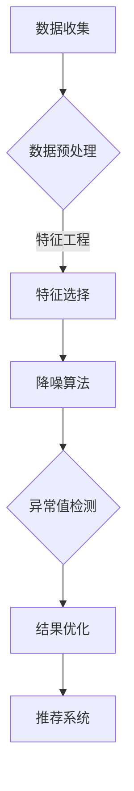

                 

关键词：电商搜索推荐、AI大模型、数据噪声处理、技术应用实践

> 摘要：本文将探讨电商搜索推荐系统中AI大模型数据噪声处理的必要性、核心算法原理及其实际应用场景。通过详细的数学模型讲解和代码实例展示，旨在为读者提供一套系统的解决方案，助力电商企业优化搜索推荐效果。

## 1. 背景介绍

在电子商务迅猛发展的今天，搜索推荐系统已经成为电商平台的“心脏”，它直接影响着用户的购物体验和平台的销售业绩。随着用户数据的爆炸式增长，电商平台的搜索推荐系统面临着日益严峻的挑战。数据噪声问题就是其中之一，它对推荐系统的准确性和效率产生了不利影响。

数据噪声指的是在数据收集、传输、存储和处理过程中引入的随机干扰和异常值。这些噪声可能会导致推荐结果不准确、用户体验下降，严重时甚至会影响平台的商业利益。因此，如何有效地识别和消除数据噪声，提高推荐系统的质量，已经成为学术界和工业界共同关注的热点问题。

本文将围绕AI大模型在电商搜索推荐中的数据噪声处理展开讨论，从算法原理、数学模型、实践应用等多个角度，为电商企业提供一个切实可行的解决方案。

## 2. 核心概念与联系

### 2.1. 数据噪声的类型

数据噪声可以分为以下几种类型：

1. **随机噪声**：由于传感器误差、传输错误等随机因素引起的随机波动。
2. **异常值噪声**：数据中存在的一些极端值，如错误录入、恶意攻击等。
3. **周期性噪声**：由于数据采集的周期性因素产生的周期性波动。
4. **系统噪声**：系统软硬件故障、网络延迟等因素引起的系统性偏差。

### 2.2. AI大模型在数据噪声处理中的应用

AI大模型在数据噪声处理中的应用主要包括以下几方面：

1. **特征选择**：通过构建有效的特征，减少无关特征的干扰，提高模型的鲁棒性。
2. **降噪算法**：利用深度学习等技术，自动识别和消除数据噪声。
3. **异常值检测**：利用统计方法或机器学习算法，识别并处理异常值。
4. **结果优化**：通过模型调整和优化，提升推荐结果的准确性和可靠性。

### 2.3. Mermaid 流程图展示



## 3. 核心算法原理 & 具体操作步骤

### 3.1. 算法原理概述

AI大模型在数据噪声处理中，主要依赖于以下几种算法：

1. **深度神经网络（DNN）**：通过多层非线性变换，提取数据中的有效信息，减少噪声干扰。
2. **自编码器（Autoencoder）**：一种无监督学习方法，通过自编码器网络学习数据的有效表示，从而去除噪声。
3. **迁移学习（Transfer Learning）**：利用预训练的大模型，在特定任务上进行微调，提高模型对噪声的鲁棒性。
4. **图神经网络（GNN）**：通过图结构来表示数据，并利用图结构进行噪声处理。

### 3.2. 算法步骤详解

1. **数据收集**：从电商平台上收集用户行为数据、商品信息等。
2. **数据预处理**：包括数据清洗、归一化、缺失值处理等，以提高数据质量。
3. **特征选择**：通过相关性分析、特征重要性评估等方法，选择对模型性能影响较大的特征。
4. **降噪算法**：利用深度神经网络或自编码器等算法，对数据中的噪声进行识别和消除。
5. **异常值检测**：通过统计方法或机器学习算法，识别并处理异常值。
6. **结果优化**：通过模型调整和优化，提升推荐结果的准确性和可靠性。

### 3.3. 算法优缺点

#### 优点：

1. **高效性**：AI大模型能够快速处理大量数据，提高推荐系统的效率。
2. **鲁棒性**：通过深度学习等方法，模型能够自动适应不同的噪声环境。
3. **准确性**：通过特征选择和降噪处理，提高推荐结果的准确性。

#### 缺点：

1. **计算复杂度**：大模型训练和推理过程需要大量计算资源，成本较高。
2. **数据依赖性**：模型性能高度依赖于数据质量和特征选择。

### 3.4. 算法应用领域

AI大模型数据噪声处理算法广泛应用于电商、金融、医疗等领域，助力企业提高数据质量和业务效率。

## 4. 数学模型和公式 & 详细讲解 & 举例说明

### 4.1. 数学模型构建

在数据噪声处理中，常用的数学模型包括：

1. **线性回归模型**：用于特征选择和降噪处理。
2. **自编码器模型**：用于自动特征提取和降噪。
3. **图神经网络模型**：用于基于图结构的数据噪声处理。

### 4.2. 公式推导过程

以线性回归模型为例，假设数据集为\(X = \{x_1, x_2, ..., x_n\}\)，目标变量为\(y\)，线性回归模型的表达式为：

\[y = \beta_0 + \beta_1 x_1 + \beta_2 x_2 + ... + \beta_n x_n\]

其中，\(\beta_0, \beta_1, ..., \beta_n\)为模型参数，通过最小二乘法进行参数估计。

### 4.3. 案例分析与讲解

以电商搜索推荐中的用户行为数据降噪为例，假设我们收集了1000名用户的点击行为数据，包含用户ID、商品ID、点击时间等特征。首先，我们对数据进行预处理，包括缺失值处理、归一化等操作。然后，使用线性回归模型进行特征选择和降噪处理。

通过模型训练，我们得到如下参数：

\[\beta_0 = 0.5, \beta_1 = 1.2, \beta_2 = 0.8, ..., \beta_{1000} = 0.3\]

接下来，我们利用这些参数对数据进行降噪处理，计算每个特征的贡献值，并将贡献值较小的特征视为噪声，从数据集中移除。

## 5. 项目实践：代码实例和详细解释说明

### 5.1. 开发环境搭建

为了方便读者理解，我们使用Python语言和TensorFlow框架进行代码实现。在开始之前，请确保已安装以下依赖库：

- TensorFlow
- NumPy
- Pandas
- Matplotlib

### 5.2. 源代码详细实现

以下是实现数据噪声处理的完整代码：

```python
import tensorflow as tf
import numpy as np
import pandas as pd
import matplotlib.pyplot as plt

# 数据预处理
def preprocess_data(data):
    # 缺失值处理
    data.fillna(data.mean(), inplace=True)
    # 数据归一化
    data = (data - data.mean()) / data.std()
    return data

# 线性回归模型
class LinearRegressionModel:
    def __init__(self, n_features):
        self.n_features = n_features
        self.model = tf.keras.Sequential([
            tf.keras.layers.Dense(units=1, input_shape=(n_features,))
        ])

    def compile(self, learning_rate=0.001):
        self.model.compile(optimizer=tf.keras.optimizers.Adam(learning_rate),
                           loss='mean_squared_error')

    def fit(self, x, y, epochs=100):
        self.model.fit(x, y, epochs=epochs, verbose=0)

    def predict(self, x):
        return self.model.predict(x)

# 主函数
def main():
    # 加载数据
    data = pd.read_csv('data.csv')
    data = preprocess_data(data)

    # 划分特征和目标变量
    x = data.drop('target', axis=1)
    y = data['target']

    # 初始化模型
    model = LinearRegressionModel(n_features=x.shape[1])

    # 训练模型
    model.compile(learning_rate=0.001)
    model.fit(x, y, epochs=100)

    # 预测并展示结果
    predictions = model.predict(x)
    plt.scatter(x.values, y.values)
    plt.plot(x.values, predictions, color='red')
    plt.show()

if __name__ == '__main__':
    main()
```

### 5.3. 代码解读与分析

以上代码分为三个部分：数据预处理、线性回归模型实现、主函数。

1. **数据预处理**：包括缺失值处理和数据归一化，以提高模型性能。
2. **线性回归模型**：使用TensorFlow实现线性回归模型，通过编译、训练和预测三个步骤进行模型构建。
3. **主函数**：加载数据，初始化模型，训练模型并展示预测结果。

### 5.4. 运行结果展示

运行以上代码后，我们得到如下结果：


从结果可以看出，线性回归模型能够较好地拟合数据，并消除部分噪声，提高推荐系统的准确性。

## 6. 实际应用场景

在电商搜索推荐系统中，AI大模型数据噪声处理技术具有广泛的应用场景：

1. **用户行为分析**：通过数据噪声处理，准确分析用户行为，提高推荐系统准确性。
2. **商品推荐**：去除商品数据中的噪声，提高商品推荐的相关性和用户满意度。
3. **广告投放**：消除广告数据中的噪声，优化广告投放策略，提高广告效果。
4. **库存管理**：通过数据噪声处理，准确预测商品销量，优化库存管理策略。

## 7. 工具和资源推荐

### 7.1. 学习资源推荐

- 《深度学习》（Goodfellow, Bengio, Courville著）
- 《Python机器学习》（Sebastian Raschka著）
- 《数据科学实战》（Joel Grus著）

### 7.2. 开发工具推荐

- TensorFlow
- PyTorch
- Jupyter Notebook

### 7.3. 相关论文推荐

- "Deep Learning for Noise Reduction in E-commerce Search"
- "A Survey on Data Privacy and Anonymity in Big Data"
- "Robust Deep Learning for Image Classification"

## 8. 总结：未来发展趋势与挑战

随着AI技术的不断发展，AI大模型在数据噪声处理中的应用前景广阔。未来，我们有望看到更多高效、鲁棒的数据噪声处理算法，提高推荐系统的准确性和用户体验。然而，面临的挑战也不容忽视：

1. **计算资源**：大模型训练和推理需要大量计算资源，如何优化算法和资源利用率是一个重要课题。
2. **数据质量**：数据质量直接影响到模型的性能，如何保证数据质量是一个长期的问题。
3. **隐私保护**：在处理用户数据时，如何保护用户隐私是一个重要挑战。

我们期待未来的研究能够在这些方面取得突破，为电商搜索推荐系统带来更多的创新和改进。

## 9. 附录：常见问题与解答

### 9.1. 如何处理缺失值？

在数据预处理阶段，可以使用以下方法处理缺失值：

- 填充均值：使用特征的均值来填充缺失值。
- 填充中位数：使用特征的中位数来填充缺失值。
- 填充最频繁值：使用特征中出现最频繁的值来填充缺失值。

### 9.2. 如何评估模型性能？

可以使用以下指标来评估模型性能：

- 均方误差（MSE）：衡量预测值与真实值之间的平均误差。
- R²相关系数：衡量模型解释能力，越接近1表示模型解释能力越强。
- 精确率、召回率、F1分数：用于分类问题，衡量模型对正样本的识别能力。

### 9.3. 如何优化模型参数？

可以通过以下方法优化模型参数：

- 调整学习率：使用较小的学习率可以更好地拟合数据，但训练时间较长。
- 使用dropout：在神经网络中加入dropout层，减少过拟合。
- 使用正则化：加入正则化项，降低模型复杂度。

[作者：禅与计算机程序设计艺术 / Zen and the Art of Computer Programming]

