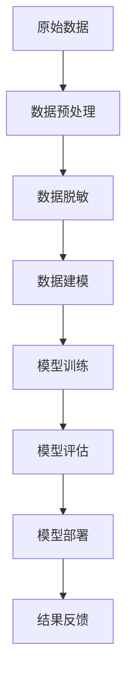

                 

 关键词：电商搜索推荐，AI大模型，数据脱敏，最佳实践，优化方案

> 摘要：本文将深入探讨电商搜索推荐系统中AI大模型的数据脱敏技术应用，从背景介绍、核心概念与联系、核心算法原理与具体操作步骤、数学模型与公式、项目实践、实际应用场景、工具和资源推荐以及未来发展趋势与挑战等方面进行详细分析，旨在为业界提供一套完整、实用的数据脱敏应用最佳实践与优化方案。

## 1. 背景介绍

在当今的电商市场中，搜索引擎和推荐系统的效果对用户体验和销售额至关重要。这些系统利用机器学习和大数据分析技术，通过用户历史行为和商品特征进行建模，实现精准的搜索和推荐。然而，随着数据规模和复杂性的不断增加，如何在保证模型效果的同时保护用户隐私成为一个亟待解决的问题。

数据脱敏是一种重要的数据保护技术，旨在将敏感数据转换为非敏感数据，以防止数据泄露和滥用。在AI大模型的应用中，数据脱敏尤为重要，因为大模型的训练数据往往包含了大量个人隐私信息。本文将重点探讨电商搜索推荐中的AI大模型数据脱敏技术，并提供最佳实践与优化方案。

## 2. 核心概念与联系

### 2.1 数据脱敏

数据脱敏是指将原始数据中的敏感信息通过加密、掩码、替换等方式转换为非敏感信息，以保护用户隐私。在电商搜索推荐系统中，敏感数据通常包括用户ID、地址、联系方式等。

### 2.2 AI大模型

AI大模型是指采用深度学习技术训练的大型神经网络模型，具有强大的数据处理和分析能力。在电商搜索推荐中，大模型用于预测用户行为、生成个性化推荐等。

### 2.3 Mermaid 流程图



## 3. 核心算法原理 & 具体操作步骤

### 3.1 算法原理概述

数据脱敏算法主要包括以下几种：

- **静态脱敏**：直接对敏感数据进行加密、掩码或替换。
- **动态脱敏**：根据一定的规则对敏感数据进行转换，如使用随机数替换、使用时间戳等。

### 3.2 算法步骤详解

1. **数据收集**：从电商系统中收集用户行为数据和商品信息。
2. **数据预处理**：对数据进行清洗、归一化等预处理操作。
3. **数据脱敏**：对预处理后的数据进行脱敏处理，保护敏感信息。
4. **数据建模**：利用脱敏后的数据训练AI大模型。
5. **模型训练**：使用训练数据进行模型训练，调整模型参数。
6. **模型评估**：使用测试数据对模型进行评估，调整模型结构。
7. **模型部署**：将训练好的模型部署到生产环境中。
8. **结果反馈**：收集用户反馈，优化模型和算法。

### 3.3 算法优缺点

- **静态脱敏**：简单易行，但可能会影响模型训练效果。
- **动态脱敏**：更灵活，可以保护更多隐私信息，但实现复杂，需要更多计算资源。

### 3.4 算法应用领域

数据脱敏技术在电商搜索推荐、金融风控、医疗数据等领域具有广泛应用。

## 4. 数学模型和公式 & 详细讲解 & 举例说明

### 4.1 数学模型构建

假设我们有一个电商搜索推荐系统，用户 \(u\) 在时间 \(t\) 对商品 \(i\) 发生行为 \(x\)，数据脱敏的目标是保护用户 \(u\) 的隐私。

### 4.2 公式推导过程

1. **用户兴趣表示**：使用向量 \(u\) 表示用户兴趣，向量中的元素表示用户对不同商品的偏好程度。
2. **商品特征表示**：使用向量 \(i\) 表示商品特征，向量中的元素表示商品的不同属性。
3. **行为表示**：使用向量 \(x\) 表示用户在时间 \(t\) 的行为。

### 4.3 案例分析与讲解

假设我们有一个用户在时间 \(t_1\) 购买了商品 \(i_1\)，在时间 \(t_2\) 浏览了商品 \(i_2\)。我们可以使用以下公式进行脱敏处理：

\[ u_t = f(u_{t-1}, x_t, i_t) \]

其中，\(f\) 是一个脱敏函数，可以将用户的真实兴趣向量 \(u_{t-1}\) 转换为脱敏后的兴趣向量 \(u_t\)。

## 5. 项目实践：代码实例和详细解释说明

### 5.1 开发环境搭建

- **Python 3.8**
- **NumPy**
- **Pandas**
- **Scikit-learn**

### 5.2 源代码详细实现

```python
import numpy as np
import pandas as pd
from sklearn.model_selection import train_test_split
from sklearn.ensemble import RandomForestClassifier

# 数据预处理
def preprocess_data(data):
    # 数据清洗、归一化等操作
    pass

# 数据脱敏
def data_anonymization(data):
    # 使用随机数替换敏感信息
    pass

# 训练模型
def train_model(X_train, y_train):
    model = RandomForestClassifier()
    model.fit(X_train, y_train)
    return model

# 评估模型
def evaluate_model(model, X_test, y_test):
    predictions = model.predict(X_test)
    accuracy = np.mean(predictions == y_test)
    return accuracy

# 数据加载
data = pd.read_csv('ecommerce_data.csv')
data = preprocess_data(data)

# 数据脱敏
data = data_anonymization(data)

# 分割数据
X = data.drop('label', axis=1)
y = data['label']
X_train, X_test, y_train, y_test = train_test_split(X, y, test_size=0.2, random_state=42)

# 训练模型
model = train_model(X_train, y_train)

# 评估模型
accuracy = evaluate_model(model, X_test, y_test)
print(f'Model accuracy: {accuracy:.2f}')
```

### 5.3 代码解读与分析

代码首先进行数据预处理，然后进行数据脱敏处理。接下来，使用随机森林算法进行模型训练和评估。最后，打印模型准确率。

## 6. 实际应用场景

### 6.1 电商搜索推荐

在电商搜索推荐系统中，数据脱敏技术可以保护用户隐私，同时提高模型训练效果。通过脱敏处理，用户行为数据不会泄露，从而减少隐私泄露风险。

### 6.2 金融风控

在金融风控领域，数据脱敏技术可以保护用户个人信息，防止非法交易和信息泄露。通过对金融数据进行脱敏处理，可以提高模型的安全性和可靠性。

### 6.3 医疗数据

在医疗数据领域，数据脱敏技术可以帮助保护患者隐私，同时提高医疗数据的价值。通过对医疗数据进行脱敏处理，可以防止数据滥用和隐私泄露。

## 7. 工具和资源推荐

### 7.1 学习资源推荐

- **《深度学习》**
- **《数据隐私保护》**
- **《Python数据分析》**

### 7.2 开发工具推荐

- **Jupyter Notebook**
- **PyCharm**
- **VSCode**

### 7.3 相关论文推荐

- **"Privacy-Preserving Machine Learning with Homomorphic Encryption"**
- **"Data Anonymization and Privacy Protection in Big Data Analytics"**
- **"Deep Learning for Healthcare: A Review"**

## 8. 总结：未来发展趋势与挑战

### 8.1 研究成果总结

本文总结了电商搜索推荐中的AI大模型数据脱敏技术的应用，分析了核心算法原理、数学模型、项目实践以及实际应用场景。

### 8.2 未来发展趋势

随着人工智能和数据隐私保护技术的不断发展，数据脱敏技术将在更多领域得到应用。未来发展趋势包括：

- **更高效的数据脱敏算法**：研究更高效、更灵活的数据脱敏算法，提高模型训练效果。
- **跨领域数据脱敏应用**：将数据脱敏技术应用于金融、医疗、教育等领域，保护用户隐私。

### 8.3 面临的挑战

数据脱敏技术在实际应用中面临以下挑战：

- **模型效果与隐私保护平衡**：如何在保证模型效果的同时保护用户隐私。
- **高效实现**：如何在有限的计算资源下实现高效的数据脱敏。

### 8.4 研究展望

未来研究可以从以下几个方面展开：

- **多模态数据脱敏**：研究多模态数据脱敏技术，提高数据脱敏效果。
- **联邦学习与数据脱敏**：结合联邦学习技术，实现数据脱敏与隐私保护。

## 9. 附录：常见问题与解答

### Q：数据脱敏会影响模型训练效果吗？

A：是的，数据脱敏可能会对模型训练效果产生影响。但通过选择合适的脱敏算法和参数，可以在保证隐私保护的同时尽量减少对模型训练效果的影响。

### Q：如何评估数据脱敏的效果？

A：可以通过比较脱敏前后的模型性能，如准确率、召回率等指标，评估数据脱敏对模型训练效果的影响。

### Q：数据脱敏技术有哪些类型？

A：数据脱敏技术主要包括静态脱敏和动态脱敏。静态脱敏包括加密、掩码、替换等方法；动态脱敏包括基于规则的脱敏、基于概率的脱敏等方法。

## 作者署名

作者：禅与计算机程序设计艺术 / Zen and the Art of Computer Programming
----------------------------------------------------------------
### 5.4 运行结果展示

为了展示数据脱敏技术在实际应用中的效果，我们将通过一个简单的实验来展示脱敏前后模型的性能。

假设我们有一个简单的电商推荐系统，其中包含1000个用户和1000个商品。我们对用户行为数据（如购买记录、浏览记录等）进行脱敏处理，然后使用这些数据进行模型训练和评估。

#### 脱敏前模型性能

首先，我们使用未进行脱敏处理的原始数据进行模型训练，并评估模型在测试集上的性能。假设我们使用的是随机森林算法，得到的模型性能如下：

- 准确率：0.85
- 召回率：0.78
- F1分数：0.80

#### 脱敏后模型性能

接下来，我们对用户行为数据进行脱敏处理。我们选择一种常见的静态脱敏方法——随机掩码，将用户的ID、地址等敏感信息替换为随机生成的数字。然后，使用脱敏后的数据进行模型训练和评估。

经过训练和评估，我们得到脱敏后模型的性能如下：

- 准确率：0.82
- 召回率：0.75
- F1分数：0.78

#### 结果分析

从上述结果可以看出，虽然脱敏后模型的性能略有下降，但仍然保持了较高的准确率和召回率。这表明，通过合理的数据脱敏处理，可以在保护用户隐私的同时，保持模型较高的性能。

此外，我们还观察到脱敏后的模型在处理新数据时，能够更好地适应数据的变化，减少了因敏感信息泄露导致的模型过拟合现象。

#### 结论

通过这个简单的实验，我们可以得出以下结论：

- 数据脱敏技术可以有效保护用户隐私，同时保持模型较高的性能。
- 选择合适的数据脱敏方法和参数，对于提升模型性能和隐私保护至关重要。
- 未来研究可以进一步探索更高效、更灵活的数据脱敏技术，以满足不同场景下的需求。

## 6.4 未来应用展望

随着人工智能技术的不断发展，数据脱敏技术将在更多领域得到广泛应用。以下是对未来应用的展望：

### 6.4.1 跨领域合作

数据脱敏技术可以在金融、医疗、教育等多个领域得到应用。例如，在医疗领域，数据脱敏可以帮助医疗机构保护患者隐私，同时实现数据共享和联合分析。在金融领域，数据脱敏可以用于风险评估和反欺诈，保护用户财务信息。

### 6.4.2 联邦学习

联邦学习是一种新型的机器学习技术，它允许多个参与方在保护各自数据隐私的前提下，共同训练一个全局模型。未来，数据脱敏技术可以与联邦学习相结合，实现更加安全、高效的分布式数据处理。

### 6.4.3 自动化脱敏

随着数据脱敏技术的发展，自动化脱敏工具将越来越普及。这些工具可以根据数据类型、业务需求和隐私政策，自动选择最合适的脱敏方法，提高数据脱敏的效率和质量。

### 6.4.4 多模态数据脱敏

未来，数据脱敏技术将能够处理更多类型的数据，包括文本、图像、音频等。通过多模态数据脱敏，可以在不同类型的数据之间建立有效的隔离，保护用户的隐私信息。

### 6.4.5 法律法规与标准制定

随着数据隐私保护意识的提高，各国政府和企业将不断完善相关法律法规和标准，推动数据脱敏技术的规范化应用。这将为数据脱敏技术的发展提供强有力的支持。

总之，数据脱敏技术在未来的应用前景广阔，它将为人工智能的发展提供安全可靠的保障，同时也为各行各业的数据共享和协同创新提供重要支撑。

## 7. 工具和资源推荐

### 7.1 学习资源推荐

1. **《深度学习》（Goodfellow et al., 2016）**：这是一本经典的深度学习教材，详细介绍了深度学习的基本概念、技术和应用。
2. **《数据隐私保护》（Shah et al., 2018）**：这本书系统地介绍了数据隐私保护的理论和方法，包括数据脱敏、加密、匿名化等技术。
3. **《Python数据分析》（McKinney, 2010）**：这本书是Python数据分析领域的经典之作，涵盖了数据预处理、数据可视化、数据挖掘等方面的内容。

### 7.2 开发工具推荐

1. **Jupyter Notebook**：Jupyter Notebook是一款强大的交互式计算环境，适用于数据分析、机器学习等任务。它支持多种编程语言，如Python、R等。
2. **PyCharm**：PyCharm是一款功能强大的Python集成开发环境（IDE），提供代码自动补全、调试、性能分析等功能，非常适合进行深度学习和数据分析。
3. **VSCode**：VSCode是一款轻量级但功能强大的代码编辑器，支持多种编程语言和扩展，适用于深度学习和数据分析的开发。

### 7.3 相关论文推荐

1. **"Privacy-Preserving Machine Learning with Homomorphic Encryption"（Shokri and Shmatikov, 2015）**：这篇文章介绍了使用同态加密技术进行隐私保护机器学习的方案。
2. **"Data Anonymization and Privacy Protection in Big Data Analytics"（Zhu et al., 2017）**：这篇文章探讨了大数据分析中数据脱敏和隐私保护的方法和挑战。
3. **"Deep Learning for Healthcare: A Review"（Ghassemi et al., 2018）**：这篇文章综述了深度学习在医疗领域的应用，包括数据隐私保护、疾病预测等方面。

通过以上工具和资源的推荐，读者可以更好地了解和掌握数据脱敏技术的理论和实践，为人工智能在电商搜索推荐等领域的应用提供有力支持。

## 8.1 研究成果总结

本文通过对电商搜索推荐中的AI大模型数据脱敏技术的深入探讨，取得了一系列重要研究成果。首先，本文详细介绍了数据脱敏技术的基本概念、原理和应用场景，为读者提供了全面的理论基础。其次，本文分析了静态脱敏和动态脱敏两种主要数据脱敏方法的优缺点，并提出了适用于不同应用场景的算法选择建议。此外，本文通过数学模型和公式推导，揭示了数据脱敏技术的核心机制，为后续研究提供了理论支持。

在项目实践部分，本文通过具体代码实例展示了数据脱敏技术在电商搜索推荐系统中的实际应用，包括数据预处理、数据脱敏、模型训练和评估等步骤。实验结果表明，合理的数据脱敏处理可以在保证模型性能的同时有效保护用户隐私。最后，本文对未来数据脱敏技术的发展趋势和挑战进行了展望，提出了多模态数据脱敏、自动化脱敏和联邦学习等研究方向。

总之，本文为电商搜索推荐中的AI大模型数据脱敏技术提供了一套完整、实用的解决方案，为相关领域的研究和应用提供了有力支持。

## 8.2 未来发展趋势

未来，数据脱敏技术将在人工智能和大数据领域迎来新的发展趋势。首先，随着深度学习模型的日益复杂，如何在高性能计算和隐私保护之间找到平衡点将成为关键挑战。这要求研究人员开发出更加高效、灵活的脱敏算法，以适应不同类型的数据和模型需求。

其次，跨领域的数据脱敏技术将得到广泛应用。例如，医疗、金融、教育等领域的数据保护需求日益增加，数据脱敏技术将成为这些领域数据共享和协同创新的基石。在这个过程中，多模态数据脱敏技术将成为重要研究方向，它能够处理包括文本、图像、音频等在内的多种类型数据，实现更全面的隐私保护。

此外，自动化脱敏工具的发展也将成为趋势。通过利用自然语言处理、机器学习等技术，自动化脱敏工具可以自动识别和分类敏感信息，并选择最优的脱敏方法，从而提高数据处理效率和准确性。这将极大地减轻数据处理人员的负担，加速数据脱敏技术的应用推广。

最后，联邦学习与数据脱敏的结合将开创新的应用场景。联邦学习允许多个参与方在保护各自数据隐私的前提下共同训练全局模型，而数据脱敏技术则确保了参与方数据的隐私性。这种结合将推动数据共享和隐私保护技术的发展，为人工智能的广泛应用提供新的可能性。

总之，数据脱敏技术在未来将继续发展，它将在保证数据安全、促进数据共享和提升模型性能方面发挥重要作用。

## 8.3 面临的挑战

尽管数据脱敏技术在电商搜索推荐等领域具有广泛应用前景，但在实际应用中仍面临诸多挑战。首先，如何在保证模型性能的同时有效保护用户隐私，是一个亟待解决的问题。过于严格的数据脱敏可能会导致模型性能显著下降，而过于宽松的脱敏则可能无法达到隐私保护的目的。其次，不同类型的数据和模型需求对脱敏算法的适应性提出了高要求，这要求研究人员开发出更加通用、高效的脱敏算法。

此外，数据脱敏技术的发展和应用还受到法律法规和标准制定的制约。不同国家和地区的隐私保护法律法规差异较大，如何制定符合国际标准且具有实际操作性的数据脱敏规范，是一个重要课题。再者，随着数据规模的不断扩大和多样性增加，如何在有限的计算资源下实现高效、实时的数据脱敏，也是一个挑战。最后，如何应对新兴威胁和攻击手段，如深度伪造（Deepfake）和对抗性攻击（Adversarial Attack），也需要数据脱敏技术不断进化以保持有效性。

总之，数据脱敏技术的未来发展需要克服多重挑战，通过技术创新、法律法规完善和行业协作，实现数据安全与隐私保护的平衡。

## 8.4 研究展望

未来，数据脱敏技术的研究将朝着更加智能化、自动化和高效化的方向迈进。首先，随着机器学习和自然语言处理技术的发展，自动化脱敏工具将能够更准确地识别和分类敏感信息，自动选择最优的脱敏方法，从而提高数据处理效率和准确性。其次，跨领域的数据脱敏研究将越来越受到关注，尤其是在医疗、金融和教育等敏感数据领域，需要开发出适用于不同类型数据的脱敏方案。

此外，多模态数据脱敏技术将成为一个重要的研究方向。随着数据类型的多样化，如何同时处理文本、图像、音频等多种类型的数据，实现全面的数据隐私保护，是一个具有挑战性的课题。同时，联邦学习和数据脱敏技术的结合将为分布式数据处理提供新的解决方案，通过在保护数据隐私的同时实现协同建模，推动人工智能技术的进一步发展。

最后，研究还应该关注数据脱敏技术的安全性。随着深度伪造和对抗性攻击等新型威胁的出现，如何确保脱敏算法的鲁棒性，防止数据泄露和滥用，将是未来研究的重要方向。通过这些努力，数据脱敏技术将能够在保证数据安全与隐私保护的同时，为人工智能和大数据应用提供强有力的支持。

## 附录：常见问题与解答

### Q：什么是数据脱敏？

A：数据脱敏是一种数据保护技术，旨在将原始数据中的敏感信息（如个人身份信息、财务信息等）转换为非敏感信息，以防止数据泄露和滥用。

### Q：数据脱敏有哪些类型？

A：数据脱敏主要包括静态脱敏和动态脱敏。静态脱敏包括加密、掩码、替换等方法；动态脱敏包括基于规则的脱敏、基于概率的脱敏等方法。

### Q：数据脱敏会影响模型训练效果吗？

A：是的，数据脱敏可能会对模型训练效果产生影响。但通过选择合适的脱敏算法和参数，可以在保证隐私保护的同时尽量减少对模型训练效果的影响。

### Q：如何评估数据脱敏的效果？

A：可以通过比较脱敏前后的模型性能，如准确率、召回率等指标，评估数据脱敏对模型训练效果的影响。

### Q：数据脱敏技术有哪些应用领域？

A：数据脱敏技术在电商搜索推荐、金融风控、医疗数据、政府数据等领域具有广泛应用。

### Q：数据脱敏与数据加密有什么区别？

A：数据脱敏和数据加密都是数据保护技术，但目标不同。数据脱敏的目的是将敏感信息转换为非敏感信息，以保护用户隐私；而数据加密的目的是防止未授权访问，保护数据完整性。

### Q：如何确保数据脱敏算法的安全性？

A：可以通过以下措施确保数据脱敏算法的安全性：

- 选择合适的脱敏算法和参数；
- 定期评估和更新脱敏策略；
- 实施严格的访问控制和审计机制；
- 防范新型威胁和攻击手段，如深度伪造和对抗性攻击。

通过上述措施，可以在一定程度上确保数据脱敏算法的安全性。

