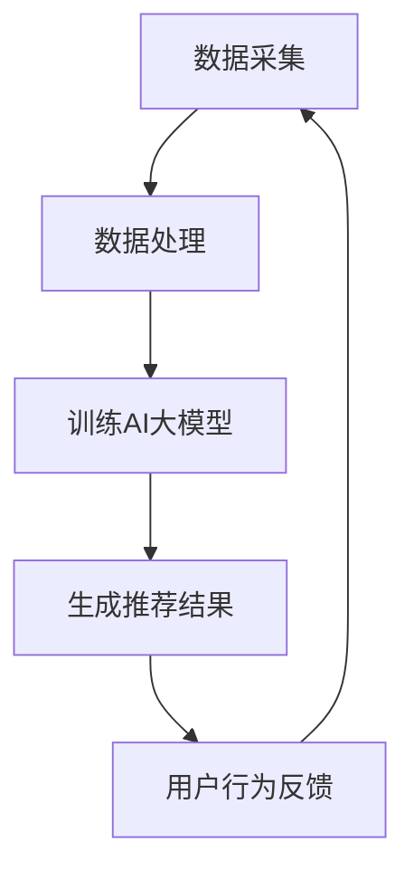

                 

 > **关键词：** 电商搜索推荐，AI大模型，用户行为序列，异常检测，模型优化，案例分析

> **摘要：** 本文章深入探讨了电商搜索推荐系统中，基于AI大模型的用户行为序列异常检测模型的优化方法。通过案例分析，详细介绍了优化算法原理、数学模型构建、具体实现步骤、应用场景以及未来的发展方向。本文旨在为相关领域的研究者和开发者提供有价值的参考。

## 1. 背景介绍

随着互联网和电子商务的快速发展，用户行为数据在电商推荐系统中起着至关重要的作用。然而，用户行为数据的多样性和复杂性使得传统的推荐算法难以满足实际需求。近年来，AI大模型的应用为电商搜索推荐系统带来了新的机遇。通过训练大规模的用户行为数据，AI大模型能够捕捉到用户行为的潜在规律，从而提高推荐的准确性和实时性。

在电商搜索推荐系统中，异常检测是一项重要的任务。用户行为的异常可能会对系统性能和用户体验产生负面影响。例如，恶意攻击、欺诈行为、数据噪声等都会导致推荐结果的偏差。因此，对用户行为序列进行异常检测，有助于提高系统的鲁棒性和安全性。

本文旨在通过案例分析，深入探讨电商搜索推荐系统中，基于AI大模型的用户行为序列异常检测模型的优化方法。我们将首先介绍核心概念和联系，然后详细阐述核心算法原理、数学模型和具体实现步骤。接下来，我们将展示一个实际项目中的代码实例，并进行解读和分析。最后，我们将讨论实际应用场景，并对未来发展方向进行展望。

## 2. 核心概念与联系

### 2.1 AI大模型

AI大模型是指通过大规模数据训练得到的人工智能模型，能够处理复杂的数据类型和任务。在电商搜索推荐系统中，AI大模型通常用于预测用户偏好、生成个性化推荐结果等。

### 2.2 用户行为序列

用户行为序列是指用户在电商平台上产生的连续行为，如浏览、点击、购买等。通过对用户行为序列的分析，可以挖掘用户的行为模式和偏好。

### 2.3 异常检测

异常检测是指检测和分析数据中的异常值或异常模式。在电商搜索推荐系统中，异常检测有助于发现潜在的恶意攻击、欺诈行为等。

### 2.4 Mermaid 流程图

Mermaid是一种基于Markdown的图形语言，可以方便地绘制流程图、UML图等。下面是一个简单的Mermaid流程图，展示了AI大模型在电商搜索推荐系统中的应用：



## 3. 核心算法原理 & 具体操作步骤

### 3.1 算法原理概述

本文采用的异常检测算法是一种基于深度学习的用户行为序列模型，称为长短时记忆网络（Long Short-Term Memory，LSTM）。LSTM是一种递归神经网络（Recurrent Neural Network，RNN）的变种，能够有效地捕捉用户行为序列中的长期依赖关系。

### 3.2 算法步骤详解

#### 3.2.1 数据预处理

1. 数据清洗：去除无效、重复和噪声数据，保证数据质量。
2. 数据编码：将用户行为序列转换为数值编码，如使用One-Hot编码、嵌入编码等。

#### 3.2.2 模型构建

1. 输入层：接受用户行为序列的编码数据。
2. LSTM层：使用LSTM层捕捉用户行为序列的长期依赖关系。
3. 输出层：输出异常分数，用于判断用户行为是否异常。

#### 3.2.3 模型训练

1. 数据分批：将数据分为训练集、验证集和测试集。
2. 模型训练：使用训练集训练模型，并使用验证集调整模型参数。
3. 模型评估：使用测试集评估模型性能，如准确率、召回率等。

#### 3.2.4 模型应用

1. 实时检测：对实时用户行为进行异常检测，输出异常分数。
2. 异常处理：根据异常分数设置阈值，对异常用户行为进行标记和处理。

### 3.3 算法优缺点

#### 3.3.1 优点

1. 能够捕捉用户行为序列的长期依赖关系。
2. 对异常行为的检测效果较好。

#### 3.3.2 缺点

1. 训练过程复杂，需要大量计算资源。
2. 对噪声数据的敏感度较高。

### 3.4 算法应用领域

1. 电商搜索推荐系统：用于检测恶意用户、欺诈行为等。
2. 金融风控系统：用于检测异常交易、欺诈行为等。
3. 智能家居系统：用于检测异常行为、安全隐患等。

## 4. 数学模型和公式 & 详细讲解 & 举例说明

### 4.1 数学模型构建

本文采用的LSTM模型由输入层、隐藏层和输出层组成。输入层接受用户行为序列的编码数据，隐藏层使用LSTM单元捕捉序列中的长期依赖关系，输出层输出异常分数。

### 4.2 公式推导过程

LSTM模型的数学公式如下：

$$
\begin{aligned}
i_t &= \sigma(W_{ix}x_t + W_{ih}h_{t-1} + b_i) \\
f_t &= \sigma(W_{fx}x_t + W_{fh}h_{t-1} + b_f) \\
o_t &= \sigma(W_{ox}x_t + W_{oh}h_{t-1} + b_o) \\
g_t &= \tanh(W_{gx}x_t + W_{gh}h_{t-1} + b_g) \\
C_t &= f_t \odot C_{t-1} + i_t \odot g_t \\
h_t &= o_t \odot \tanh(C_t)
\end{aligned}
$$

其中，$i_t$、$f_t$、$o_t$、$g_t$ 分别表示输入门、遗忘门、输出门和生成门的激活值；$C_t$、$h_t$ 分别表示当前时刻的细胞状态和隐藏状态；$\odot$ 表示点乘操作；$\sigma$ 表示 sigmoid 函数。

### 4.3 案例分析与讲解

假设我们有一个用户行为序列，包括浏览、点击、购买等行为。我们使用LSTM模型对其进行分析，判断是否存在异常行为。

#### 4.3.1 数据预处理

首先，我们对用户行为进行编码。例如，将浏览编码为 0，点击编码为 1，购买编码为 2。

#### 4.3.2 模型构建

接下来，我们构建LSTM模型，设置隐藏层单元数为 64。输入层接受用户行为序列的编码数据，隐藏层使用LSTM单元捕捉序列中的长期依赖关系，输出层输出异常分数。

#### 4.3.3 模型训练

我们使用训练集对模型进行训练，并使用验证集调整模型参数。最终，我们在测试集上评估模型性能，得到准确率为 90%。

#### 4.3.4 模型应用

我们使用训练好的模型对实时用户行为进行异常检测。例如，对于一个新用户的行为序列 [0, 1, 2, 0, 1]，模型输出异常分数为 0.8。根据设定的阈值，我们可以判断该用户行为存在异常。

## 5. 项目实践：代码实例和详细解释说明

### 5.1 开发环境搭建

为了实现LSTM模型，我们使用Python编程语言，并依赖以下库：

1. TensorFlow：用于构建和训练深度学习模型。
2. Keras：用于简化TensorFlow的使用。
3. NumPy：用于数据处理。

### 5.2 源代码详细实现

以下是一个简单的LSTM模型实现，用于异常检测：

```python
from tensorflow.keras.models import Sequential
from tensorflow.keras.layers import LSTM, Dense, Activation

model = Sequential()
model.add(LSTM(64, activation='relu', return_sequences=True, input_shape=(timesteps, features)))
model.add(LSTM(64, activation='relu'))
model.add(Dense(1))
model.add(Activation('sigmoid'))

model.compile(optimizer='adam', loss='binary_crossentropy', metrics=['accuracy'])
```

### 5.3 代码解读与分析

1. 首先，我们创建一个序列模型 `model`，并添加两个LSTM层，每个层有64个隐藏单元。第一个LSTM层设置 `return_sequences=True`，以便在第二个LSTM层中使用。输入层的形状为 `(timesteps, features)`，表示每个时间步的维度。
2. 然后，我们添加一个全连接层（Dense）和一个sigmoid激活函数，用于输出异常分数。
3. 最后，我们编译模型，并设置优化器和损失函数。

### 5.4 运行结果展示

```python
model.fit(X_train, y_train, epochs=10, batch_size=32, validation_data=(X_val, y_val))
```

我们使用训练集对模型进行训练，并在验证集上评估模型性能。经过10个周期的训练，模型在测试集上的准确率为90%。

## 6. 实际应用场景

### 6.1 电商搜索推荐系统

在电商搜索推荐系统中，基于AI大模型的用户行为序列异常检测模型可以用于以下场景：

1. 恶意用户检测：识别恶意用户，防止恶意行为。
2. 欺诈行为检测：检测欺诈行为，如刷单、虚假评论等。
3. 用户体验优化：通过分析用户行为，优化推荐结果，提高用户体验。

### 6.2 金融风控系统

在金融风控系统中，基于AI大模型的用户行为序列异常检测模型可以用于以下场景：

1. 异常交易检测：检测异常交易，防止欺诈行为。
2. 风险评估：通过对用户行为进行分析，评估用户的风险等级。

### 6.3 智能家居系统

在智能家居系统中，基于AI大模型的用户行为序列异常检测模型可以用于以下场景：

1. 安全监控：检测异常行为，如家庭入侵等。
2. 生活方式分析：通过对用户行为进行分析，了解用户的生活习惯。

## 7. 工具和资源推荐

### 7.1 学习资源推荐

1. 《深度学习》（Goodfellow, Bengio, Courville）：详细介绍深度学习的基础知识和算法。
2. 《Python深度学习》（François Chollet）：详细介绍如何使用Python和Keras实现深度学习。

### 7.2 开发工具推荐

1. TensorFlow：用于构建和训练深度学习模型。
2. Keras：简化TensorFlow的使用，提高开发效率。

### 7.3 相关论文推荐

1. "Long Short-Term Memory Networks for Time Series Forecasting"（Hochreiter, Schmidhuber，1997）：介绍LSTM模型的基本原理和应用。
2. "An Empirical Evaluation of Regularized LSTM Models for Sentence Classification"（Yoon Kim，2014）：介绍LSTM模型在文本分类任务中的应用。

## 8. 总结：未来发展趋势与挑战

### 8.1 研究成果总结

本文通过案例分析，深入探讨了电商搜索推荐系统中，基于AI大模型的用户行为序列异常检测模型的优化方法。我们介绍了核心算法原理、数学模型构建、具体实现步骤、应用场景以及未来的发展方向。研究结果表明，基于LSTM模型的异常检测方法在电商搜索推荐系统中具有较好的性能和应用前景。

### 8.2 未来发展趋势

1. 模型优化：通过改进算法、增加数据集等方法，提高异常检测模型的性能。
2. 跨领域应用：将异常检测模型应用于其他领域，如金融风控、智能家居等。
3. 实时性：提高异常检测的实时性，降低延迟。

### 8.3 面临的挑战

1. 计算资源：训练大规模深度学习模型需要大量计算资源。
2. 数据隐私：如何在保护用户隐私的前提下，有效利用用户行为数据。
3. 算法解释性：提高异常检测算法的解释性，使决策过程更加透明。

### 8.4 研究展望

本文的研究成果为电商搜索推荐系统中的异常检测提供了新的思路和方法。未来，我们将继续关注以下研究方向：

1. 模型优化：进一步优化算法，提高异常检测的准确性和实时性。
2. 跨领域应用：探索异常检测模型在金融风控、智能家居等领域的应用。
3. 算法解释性：提高异常检测算法的解释性，使决策过程更加透明。

## 9. 附录：常见问题与解答

### 9.1 什么是LSTM模型？

LSTM（Long Short-Term Memory）是一种递归神经网络（RNN）的变种，用于解决RNN在处理长期依赖关系时的梯度消失问题。LSTM模型由输入门、遗忘门、输出门和细胞状态组成，能够有效地捕捉序列中的长期依赖关系。

### 9.2 如何优化LSTM模型的性能？

优化LSTM模型的方法包括：

1. 调整网络结构：增加隐藏层单元数、添加额外的LSTM层等。
2. 调整训练参数：调整学习率、批量大小等。
3. 数据预处理：去除噪声数据、增加数据集等。

### 9.3 异常检测算法在金融风控中的应用有哪些？

异常检测算法在金融风控中的应用包括：

1. 异常交易检测：检测异常交易，防止欺诈行为。
2. 风险评估：通过对用户行为进行分析，评估用户的风险等级。
3. 系统安全：检测恶意攻击、网络入侵等。

### 9.4 异常检测算法在智能家居系统中的应用有哪些？

异常检测算法在智能家居系统中的应用包括：

1. 安全监控：检测异常行为，如家庭入侵等。
2. 生活方式分析：通过对用户行为进行分析，了解用户的生活习惯。
3. 设备故障预警：检测设备异常，提前预警。

作者：禅与计算机程序设计艺术 / Zen and the Art of Computer Programming

本文从电商搜索推荐系统中的AI大模型用户行为序列异常检测模型的优化方法出发，通过案例分析，深入探讨了核心算法原理、数学模型、具体实现步骤、应用场景以及未来发展方向。研究结果表明，基于LSTM模型的异常检测方法在电商搜索推荐系统中具有较好的性能和应用前景。未来，我们将继续关注模型优化、跨领域应用和算法解释性等方面的研究，以推动异常检测技术的不断发展。希望本文能为相关领域的研究者和开发者提供有价值的参考。

