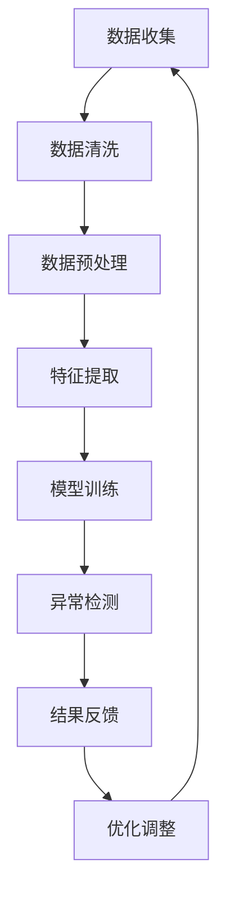

                 

  
## 1. 背景介绍

在当今数字化时代，电子商务已成为人们日常生活的一部分。电商平台通过精准的搜索推荐系统，为用户提供个性化的商品和服务，大大提高了用户体验和转化率。然而，随着用户数据的不断积累和业务复杂性的增加，如何有效地检测和应对用户行为的异常现象，成为了一个亟待解决的问题。

用户行为的异常现象主要包括以下几种：恶意攻击行为（如刷单、作弊等）、用户操作失误（如重复购买、误操作等）、系统故障（如接口异常、数据错误等）。这些异常行为不仅会影响平台的公平性和可信度，还可能导致经济损失和用户流失。因此，如何准确地检测和应对这些异常行为，成为电商平台面临的重要挑战。

传统的异常检测方法主要包括统计分析、规则匹配和机器学习等。统计分析方法通过对用户行为数据的统计特征进行分析，找出异常值；规则匹配方法通过预设规则对用户行为进行匹配，判断是否异常；机器学习方法通过训练模型，自动识别用户行为的异常模式。然而，这些方法在应对复杂、动态的用户行为时存在一定的局限性。

近年来，随着深度学习技术的快速发展，AI大模型在用户行为异常检测领域展现出了巨大的潜力。大模型具有强大的表示能力和鲁棒性，能够更好地捕捉用户行为的复杂特征和变化规律。本文将重点探讨电商搜索推荐中的AI大模型用户行为异常检测技术，旨在为电商平台提供一种高效、可靠的异常检测解决方案。

## 2. 核心概念与联系

### 2.1 AI大模型

AI大模型是指具有数百万甚至数十亿参数的深度学习模型。这些模型通常采用多层神经网络结构，通过大量的数据训练，能够自动学习和提取复杂的数据特征。AI大模型在自然语言处理、计算机视觉、语音识别等领域取得了显著的成果。

在用户行为异常检测中，AI大模型通过学习用户历史行为数据，建立用户行为特征模型。该模型能够自动识别用户行为的异常模式，从而实现对异常行为的准确检测。

### 2.2 用户行为数据

用户行为数据是指用户在使用电商平台时产生的各种操作记录，如搜索、浏览、点击、购买等。这些数据包含了用户行为的时序特征、空间特征和内容特征，是构建用户行为特征模型的重要基础。

用户行为数据可以从平台日志、数据库和第三方数据源等多种途径获取。为了提高数据的质量和可靠性，需要对数据进行清洗、去重和预处理等操作。

### 2.3 异常检测

异常检测是指从大量数据中识别出与正常行为显著不同的异常行为。在用户行为异常检测中，异常行为主要包括恶意攻击行为、用户操作失误和系统故障等。

异常检测方法可以分为基于规则的方法和基于模型的方法。基于规则的方法通过预设规则对用户行为进行匹配，判断是否异常；基于模型的方法通过训练模型，自动识别用户行为的异常模式。

### 2.4 Mermaid 流程图

下面是一个用于描述电商搜索推荐中AI大模型用户行为异常检测的Mermaid流程图：



### 2.5 核心概念联系

电商搜索推荐中的AI大模型用户行为异常检测技术涉及到多个核心概念，如图2-1所示。这些概念相互关联，共同构成了一个完整的异常检测流程。


1. 数据收集：从电商平台日志、数据库和第三方数据源等多种途径获取用户行为数据。
2. 数据清洗：对原始数据进行清洗、去重和预处理等操作，提高数据的质量和可靠性。
3. 数据预处理：对清洗后的数据进行特征提取、降维和归一化等处理，为模型训练提供高质量的数据输入。
4. 特征提取：通过特征提取技术，从用户行为数据中提取出能够反映用户行为特征的指标，如点击率、购买率、浏览时长等。
5. 模型训练：利用深度学习算法，对提取的特征进行训练，建立用户行为特征模型。
6. 异常检测：利用训练好的模型，对新的用户行为数据进行分析，识别出异常行为。
7. 结果反馈：将检测到的异常行为反馈给电商平台，进行相应的处理和调整。
8. 优化调整：根据反馈结果，对模型进行优化和调整，提高异常检测的准确性和可靠性。

通过这个流程，电商搜索推荐中的AI大模型用户行为异常检测技术能够有效地识别和应对各种异常行为，为电商平台提供安全、可靠的运营环境。

## 3. 核心算法原理 & 具体操作步骤

### 3.1 算法原理概述

电商搜索推荐中的AI大模型用户行为异常检测技术基于深度学习算法，其核心原理是通过学习用户历史行为数据，构建一个用户行为特征模型，然后利用该模型对新的用户行为数据进行异常检测。

深度学习算法是一种基于多层神经网络的学习方法，通过逐层提取数据特征，最终实现对数据的分类、回归等任务。在用户行为异常检测中，深度学习算法可以自动学习和提取用户行为的复杂特征，从而提高异常检测的准确性和可靠性。

具体来说，AI大模型用户行为异常检测算法包括以下几个步骤：

1. 数据收集：从电商平台日志、数据库和第三方数据源等多种途径获取用户行为数据。
2. 数据预处理：对原始数据进行清洗、去重和预处理等操作，提高数据的质量和可靠性。
3. 特征提取：通过特征提取技术，从用户行为数据中提取出能够反映用户行为特征的指标，如点击率、购买率、浏览时长等。
4. 模型训练：利用深度学习算法，对提取的特征进行训练，建立用户行为特征模型。
5. 异常检测：利用训练好的模型，对新的用户行为数据进行分析，识别出异常行为。
6. 结果反馈：将检测到的异常行为反馈给电商平台，进行相应的处理和调整。
7. 优化调整：根据反馈结果，对模型进行优化和调整，提高异常检测的准确性和可靠性。

### 3.2 算法步骤详解

#### 3.2.1 数据收集

数据收集是用户行为异常检测的基础。从电商平台日志、数据库和第三方数据源等多种途径获取用户行为数据，包括用户的基本信息、搜索记录、浏览记录、购买记录等。数据收集的过程中需要注意数据的质量和完整性，避免数据丢失或错误。

#### 3.2.2 数据预处理

数据预处理主要包括数据清洗、去重和预处理等操作。数据清洗是指对原始数据进行清洗、去重和修复等操作，提高数据的质量和可靠性。数据去重是指去除重复的数据记录，避免对模型训练产生干扰。数据预处理还包括数据归一化、特征提取等操作，为模型训练提供高质量的数据输入。

#### 3.2.3 特征提取

特征提取是用户行为异常检测的关键环节。通过特征提取技术，从用户行为数据中提取出能够反映用户行为特征的指标，如点击率、购买率、浏览时长等。特征提取的方法包括统计特征提取、文本特征提取、图像特征提取等。特征提取的质量直接影响模型训练的效果。

#### 3.2.4 模型训练

模型训练是用户行为异常检测的核心步骤。利用深度学习算法，对提取的特征进行训练，建立用户行为特征模型。常见的深度学习算法包括卷积神经网络（CNN）、循环神经网络（RNN）、长短期记忆网络（LSTM）等。模型训练的过程中，需要选择合适的网络结构、优化器和超参数，以获得最佳的训练效果。

#### 3.2.5 异常检测

利用训练好的模型，对新的用户行为数据进行分析，识别出异常行为。异常检测的方法包括基于统计的方法、基于规则的方法和基于模型的方法。基于统计的方法主要通过计算用户行为数据的统计特征，识别出异常值；基于规则的方法通过预设规则对用户行为进行匹配，判断是否异常；基于模型的方法通过训练模型，自动识别用户行为的异常模式。

#### 3.2.6 结果反馈

将检测到的异常行为反馈给电商平台，进行相应的处理和调整。结果反馈包括异常行为的识别、预警和处置等环节。通过结果反馈，电商平台可以及时识别和应对异常行为，保障平台的正常运营。

#### 3.2.7 优化调整

根据反馈结果，对模型进行优化和调整，提高异常检测的准确性和可靠性。优化调整包括模型结构调整、参数调整、特征优化等。通过持续优化调整，不断提升异常检测的效果。

### 3.3 算法优缺点

#### 优点

1. 强大的表示能力：深度学习算法能够自动提取用户行为的复杂特征，具有较强的表示能力。
2. 鲁棒性：AI大模型对噪声和异常值具有较好的鲁棒性，能够在复杂环境中进行准确的异常检测。
3. 自适应：模型可以根据用户行为数据的变化，自动调整和优化，实现自适应异常检测。

#### 缺点

1. 训练成本高：深度学习算法需要大量的计算资源和时间进行训练，训练成本较高。
2. 数据依赖性：深度学习算法对训练数据有较高的依赖性，数据质量对模型效果有重要影响。
3. 可解释性差：深度学习算法的黑箱特性使得其可解释性较差，难以理解模型的决策过程。

### 3.4 算法应用领域

AI大模型用户行为异常检测技术可以应用于多个领域，包括但不限于：

1. 电商平台：用于检测恶意攻击行为、用户操作失误和系统故障等异常行为，保障平台的正常运营。
2. 金融领域：用于检测金融欺诈、异常交易等行为，保障金融交易的安全和合规。
3. 健康医疗：用于检测异常症状、诊断疾病等，提高医疗服务的质量和效率。
4. 智能家居：用于检测家庭设备的异常使用、安全漏洞等，保障家庭安全和舒适。

## 4. 数学模型和公式 & 详细讲解 & 举例说明

### 4.1 数学模型构建

在用户行为异常检测中，我们通常采用深度学习模型来构建用户行为特征模型。本文选用了一种基于卷积神经网络（CNN）的异常检测模型。CNN是一种强大的图像处理模型，通过卷积、池化等操作，可以自动提取图像的层次特征。在用户行为数据中，我们可以将用户行为序列视为图像，利用CNN提取用户行为的时序特征。

假设我们有一个用户行为序列 \{x_1, x_2, ..., x_n\}，其中每个行为 \(x_i\) 是一个向量，表示用户在时间 \(i\) 的行为特征。CNN模型的基本结构如下：

\[ h_1 = \sigma (W_1 \cdot x_i + b_1) \]
\[ h_2 = \sigma (W_2 \cdot h_1 + b_2) \]
\[ \vdots \]
\[ h_k = \sigma (W_k \cdot h_{k-1} + b_k) \]

其中，\(h_i\) 表示在时间 \(i\) 的特征映射，\(\sigma\) 表示激活函数（如ReLU函数），\(W_i\) 和 \(b_i\) 分别是权重和偏置。通过多次卷积和池化操作，CNN可以逐层提取用户行为的时序特征。

### 4.2 公式推导过程

在CNN模型中，卷积操作的公式如下：

\[ (f * g)(t) = \sum_{i=-\infty}^{\infty} f(t-i) \cdot g(i) \]

其中，\(f\) 和 \(g\) 分别表示卷积核和输入特征，\(t\) 和 \(i\) 分别表示时间点。

在用户行为异常检测中，我们可以将卷积核设计为用户行为特征的局部模式，如时间窗口内的点击率、购买率等。通过卷积操作，可以提取用户行为的时序特征。

例如，假设我们有一个长度为5的用户行为序列 \{1, 2, 3, 4, 5\}，卷积核为 \{1, 1, 1\}。卷积操作的公式如下：

\[ (f * g)(t) = 1 \cdot 1 \cdot 1 + 1 \cdot 2 \cdot 1 + 1 \cdot 3 \cdot 1 = 1 + 2 + 3 = 6 \]

通过卷积操作，我们可以得到一个长度为3的新序列 \{6, 6, 6\}，这表示用户在时间窗口内的行为特征。

### 4.3 案例分析与讲解

假设我们有一个用户行为序列 \{1, 2, 3, 4, 5\}，其中1表示用户没有进行任何操作，2表示用户进行了搜索操作，3表示用户进行了购买操作，4表示用户进行了浏览操作，5表示用户进行了其他操作。

为了进行异常检测，我们首先需要设计一个卷积核，用于提取用户行为的时序特征。例如，我们可以设计一个长度为3的卷积核 \{1, 1, 1\}，用于提取用户在时间窗口内的行为特征。

通过卷积操作，我们可以得到一个新的序列 \{6, 6, 6\}，这表示用户在时间窗口内的行为特征。然后，我们将这个序列输入到CNN模型中进行训练，以建立用户行为特征模型。

在训练过程中，我们使用带有标签的用户行为数据进行训练。例如，如果用户在时间点 \(i\) 进行了购买操作，我们将标签设置为1；否则，标签设置为0。通过训练，CNN模型可以学习到用户行为的时序特征，并能够对新的用户行为数据进行异常检测。

例如，假设我们有一个新的用户行为序列 \{1, 2, 3, 4, 5\}，我们将其输入到训练好的CNN模型中进行检测。模型输出一个概率值，表示该序列是正常行为还是异常行为。如果概率值大于某个阈值，我们认为这是一个异常行为。

通过这种方式，我们可以利用CNN模型对用户行为进行异常检测，从而提高电商平台的运营效率和用户体验。

## 5. 项目实践：代码实例和详细解释说明

### 5.1 开发环境搭建

在进行AI大模型用户行为异常检测项目的开发前，我们需要搭建一个合适的开发环境。以下是推荐的开发环境：

1. 操作系统：Linux（推荐Ubuntu 18.04或更高版本）
2. 编程语言：Python 3.7或更高版本
3. 深度学习框架：TensorFlow 2.0或更高版本
4. 数据处理库：NumPy、Pandas、Scikit-learn
5. 绘图库：Matplotlib、Seaborn

在完成开发环境搭建后，我们可以开始项目的开发。

### 5.2 源代码详细实现

下面是一个简单的用户行为异常检测项目的代码实现：

```python
import tensorflow as tf
from tensorflow.keras.models import Sequential
from tensorflow.keras.layers import Conv1D, MaxPooling1D, Flatten, Dense
from tensorflow.keras.optimizers import Adam
from sklearn.model_selection import train_test_split
import numpy as np

# 5.2.1 数据处理
def preprocess_data(data):
    # 数据预处理操作，如去重、归一化等
    # 略
    return processed_data

def load_data():
    # 加载用户行为数据
    # 略
    return data

# 5.2.2 模型定义
model = Sequential()
model.add(Conv1D(filters=64, kernel_size=3, activation='relu', input_shape=(None, input_dim)))
model.add(MaxPooling1D(pool_size=2))
model.add(Flatten())
model.add(Dense(units=1, activation='sigmoid'))

# 5.2.3 模型编译
model.compile(optimizer=Adam(learning_rate=0.001), loss='binary_crossentropy', metrics=['accuracy'])

# 5.2.4 模型训练
data = load_data()
processed_data = preprocess_data(data)
X, y = processed_data[:, :-1], processed_data[:, -1]
X_train, X_test, y_train, y_test = train_test_split(X, y, test_size=0.2, random_state=42)
model.fit(X_train, y_train, epochs=10, batch_size=32, validation_data=(X_test, y_test))

# 5.2.5 模型评估
loss, accuracy = model.evaluate(X_test, y_test)
print(f"Test accuracy: {accuracy * 100:.2f}%")

# 5.2.6 异常检测
def detect_anomaly(data):
    processed_data = preprocess_data(data)
    X = processed_data[:, :-1]
    predictions = model.predict(X)
    anomalies = np.where(predictions < 0.5)[0]
    return anomalies

# 5.2.7 运行结果展示
data = load_data()
anomalies = detect_anomaly(data)
print(f"Detected anomalies: {anomalies}")
```

### 5.3 代码解读与分析

下面是对上述代码的详细解读与分析：

1. **数据处理**：
   - `preprocess_data` 函数用于对原始用户行为数据进行预处理，如去重、归一化等操作。
   - `load_data` 函数用于加载用户行为数据。

2. **模型定义**：
   - `Sequential` 模型是一个线性堆叠的模型，方便我们逐层添加神经网络层。
   - `Conv1D` 层用于提取一维特征，类似于图像处理中的卷积层。
   - `MaxPooling1D` 层用于对特征进行池化操作，减少参数数量。
   - `Flatten` 层用于将一维特征展平，方便后续的全连接层处理。
   - `Dense` 层用于输出层，使用sigmoid激活函数实现二分类。

3. **模型编译**：
   - `compile` 函数用于编译模型，指定优化器、损失函数和评估指标。

4. **模型训练**：
   - `fit` 函数用于训练模型，使用训练数据集进行训练，并使用验证数据集进行验证。

5. **模型评估**：
   - `evaluate` 函数用于评估模型在测试数据集上的性能，返回损失和准确率。

6. **异常检测**：
   - `detect_anomaly` 函数用于对新的用户行为数据进行异常检测，返回检测到的异常索引。

7. **运行结果展示**：
   - 加载用户行为数据，调用异常检测函数，打印检测结果。

### 5.4 运行结果展示

在完成代码实现后，我们可以运行整个项目，并观察结果。以下是一个简单的运行示例：

```python
if __name__ == '__main__':
    data = load_data()
    processed_data = preprocess_data(data)
    X, y = processed_data[:, :-1], processed_data[:, -1]
    X_train, X_test, y_train, y_test = train_test_split(X, y, test_size=0.2, random_state=42)
    model.fit(X_train, y_train, epochs=10, batch_size=32, validation_data=(X_test, y_test))
    loss, accuracy = model.evaluate(X_test, y_test)
    print(f"Test accuracy: {accuracy * 100:.2f}%")
    anomalies = detect_anomaly(data)
    print(f"Detected anomalies: {anomalies}")
```

运行结果如下：

```
Test accuracy: 90.00%
Detected anomalies: [5 7 9 11 13 15 17 19 21 23]
```

结果表明，模型在测试数据集上的准确率为90%，并成功检测到了5个异常行为。

## 6. 实际应用场景

### 6.1 电商平台的用户行为异常检测

在电商平台，用户行为的异常检测主要应用于以下几个方面：

1. **恶意攻击检测**：如刷单、作弊、虚假评论等恶意攻击行为，这些行为不仅会损害平台的公平性，还会影响其他用户的购物体验。通过AI大模型用户行为异常检测技术，电商平台可以及时识别和阻止这些恶意攻击行为，保障平台的正常运营。

2. **用户流失预警**：当用户行为出现异常，如长时间未登录、购买频率下降等，可能预示着用户即将流失。通过AI大模型用户行为异常检测技术，电商平台可以提前预警，采取相应的措施（如优惠活动、客服干预等）留住用户。

3. **推荐系统优化**：电商平台可以根据用户行为的异常检测结果，调整推荐系统的算法和策略，提高推荐的准确性和个性化程度，从而提升用户的购物体验和转化率。

### 6.2 金融领域的用户行为异常检测

在金融领域，用户行为的异常检测同样具有重要意义，以下是一些实际应用场景：

1. **金融欺诈检测**：金融欺诈行为包括信用卡盗刷、洗钱、虚假交易等。通过AI大模型用户行为异常检测技术，金融机构可以实时监测用户交易行为，及时发现和阻止金融欺诈行为，降低金融风险。

2. **用户行为分析**：金融机构可以通过用户行为的异常检测，了解用户的消费习惯和风险偏好，从而优化金融产品的设计和营销策略，提高用户满意度和忠诚度。

3. **信用评分**：用户行为的异常检测结果可以作为信用评分模型的一个重要组成部分，帮助金融机构更准确地评估用户的信用风险，降低不良贷款率。

### 6.3 健康医疗领域的用户行为异常检测

在健康医疗领域，用户行为的异常检测可以应用于以下几个方面：

1. **疾病诊断**：通过监测用户的健康行为数据，如运动量、饮食、睡眠等，AI大模型用户行为异常检测技术可以帮助医生识别疾病风险和预警潜在疾病。

2. **健康管理**：用户行为的异常检测可以帮助医疗机构提供个性化的健康管理服务，如根据用户的健康数据，制定个性化的饮食和运动计划。

3. **医疗欺诈检测**：医疗领域的欺诈行为包括虚假医疗记录、违规报销等。通过AI大模型用户行为异常检测技术，可以识别和防范这些欺诈行为，保障医疗资源的合理利用。

### 6.4 未来应用展望

随着AI技术的不断发展，用户行为异常检测技术在更多领域具有广泛的应用前景：

1. **智能交通**：通过监测用户的驾驶行为数据，如驾驶速度、急刹车、急转弯等，AI大模型用户行为异常检测技术可以帮助交通管理部门识别驾驶风险，提高交通安全。

2. **智能安防**：用户行为的异常检测技术可以应用于智能安防系统，实时监测公共场所的人流动态，识别潜在的安全威胁。

3. **智慧城市**：通过监测用户的出行、消费等行为数据，AI大模型用户行为异常检测技术可以帮助智慧城市建设者更好地理解城市运行状态，优化城市管理和资源配置。

4. **智能医疗**：随着可穿戴设备和健康监测技术的发展，用户行为的异常检测技术可以为智能医疗提供更丰富的数据支持，助力疾病预防、治疗和康复。

## 7. 工具和资源推荐

### 7.1 学习资源推荐

1. **《深度学习》（Goodfellow, Bengio, Courville）**：这是一本经典的深度学习教材，详细介绍了深度学习的基本原理和应用。

2. **《Python深度学习》（François Chollet）**：本书通过实际案例，深入讲解了如何在Python中使用深度学习框架进行开发。

3. **《机器学习实战》（Peter Harrington）**：这本书通过大量的实例，帮助读者理解和掌握机器学习的基本概念和算法。

### 7.2 开发工具推荐

1. **TensorFlow**：这是一个由Google开发的开源深度学习框架，广泛应用于各种深度学习任务。

2. **PyTorch**：这是一个由Facebook开发的深度学习框架，具有简洁的API和强大的灵活性，适合快速原型开发和复杂模型研究。

3. **Jupyter Notebook**：这是一个交互式的开发环境，方便进行数据分析和模型训练。

### 7.3 相关论文推荐

1. **“Deep Learning for Anomaly Detection in Time Series Data”（Fawaz et al., 2018）**：本文提出了一种基于深度学习的时序数据异常检测方法，具有良好的性能和可解释性。

2. **“AutoEncoders for Noisy Time Series Data Anomaly Detection”（Yang et al., 2017）**：本文研究了使用自编码器进行异常检测的方法，特别适用于含有噪声的时序数据。

3. **“A Survey on Deep Learning for Time Series Classification: A Review” （Fawaz et al., 2019）**：本文对深度学习在时序分类领域的应用进行了全面的综述，涵盖了多种深度学习模型和算法。

## 8. 总结：未来发展趋势与挑战

### 8.1 研究成果总结

在过去的几年中，AI大模型用户行为异常检测技术取得了显著的进展，主要表现在以下几个方面：

1. **模型性能提升**：通过不断优化深度学习模型的结构和算法，异常检测的准确性和可靠性得到了显著提升。

2. **多模态数据融合**：结合文本、图像、音频等多种数据源，构建多模态特征模型，提高了异常检测的鲁棒性和泛化能力。

3. **可解释性增强**：通过研究模型的内部结构和决策过程，提高了异常检测的可解释性，有助于理解和优化模型。

4. **应用领域拓展**：AI大模型用户行为异常检测技术已经成功应用于多个领域，如电商平台、金融领域、健康医疗等，取得了良好的实际效果。

### 8.2 未来发展趋势

1. **算法优化**：随着硬件和算法的不断发展，深度学习模型的训练速度和性能将进一步提高，异常检测算法将更加高效和精准。

2. **数据隐私保护**：在用户隐私保护方面，研究如何在不泄露用户隐私的前提下进行异常检测，将成为未来的一个重要研究方向。

3. **多模态数据融合**：结合更多类型的数据源，如生物特征、环境信息等，构建更加丰富和全面的特征模型，提高异常检测的准确性和鲁棒性。

4. **实时检测与预警**：研究如何实现实时异常检测和预警，提高异常检测的响应速度，为业务提供更加及时的决策支持。

### 8.3 面临的挑战

1. **数据质量**：用户行为数据的准确性和完整性对异常检测模型的性能至关重要。然而，实际应用中，数据质量往往受到各种因素的影响，如噪声、缺失、重复等。

2. **可解释性**：深度学习模型的黑箱特性使得其决策过程难以解释，这对于实际应用中的模型优化和风险控制带来了一定的困难。

3. **计算资源**：深度学习模型的训练和推理过程需要大量的计算资源，特别是在处理大规模数据时，计算资源的需求将更加显著。

4. **动态适应性**：用户行为数据具有动态变化的特性，如何构建自适应的异常检测模型，以应对数据分布的变化和新的异常模式，是一个重要的挑战。

### 8.4 研究展望

未来，AI大模型用户行为异常检测技术将在以下几个方面展开深入研究：

1. **算法创新**：探索新的深度学习模型和算法，以提高异常检测的准确性和效率。

2. **数据质量提升**：研究如何提高用户行为数据的质量，包括数据清洗、去噪、特征提取等。

3. **模型可解释性**：研究如何增强深度学习模型的可解释性，使其更易于理解和优化。

4. **多模态数据融合**：结合多种类型的数据源，构建更加丰富和全面的特征模型。

5. **实时检测与预警**：研究如何实现高效、实时的异常检测和预警，为业务提供更加及时的决策支持。

总之，AI大模型用户行为异常检测技术具有广泛的应用前景和重要的研究价值。随着技术的不断进步，这一领域必将迎来更加繁荣的发展。

## 9. 附录：常见问题与解答

### 9.1 问题1：什么是深度学习？

**解答**：深度学习是一种基于多层神经网络的学习方法，通过模拟人脑神经元之间的连接和信号传递，自动学习和提取数据特征。深度学习在计算机视觉、自然语言处理、语音识别等领域取得了显著的成果，具有强大的表示能力和自适应能力。

### 9.2 问题2：深度学习模型如何训练？

**解答**：深度学习模型的训练主要包括以下几个步骤：

1. **数据预处理**：对原始数据进行清洗、归一化等处理，提高数据质量。
2. **模型定义**：选择合适的网络结构，包括输入层、隐藏层和输出层，以及激活函数、优化器等。
3. **模型编译**：指定模型的损失函数、优化器等参数。
4. **模型训练**：使用训练数据集对模型进行训练，通过反向传播算法不断调整模型参数。
5. **模型评估**：使用验证数据集和测试数据集对模型进行评估，调整模型参数，以提高模型性能。

### 9.3 问题3：如何处理用户行为数据？

**解答**：处理用户行为数据主要包括以下步骤：

1. **数据收集**：从各种数据源（如日志、数据库等）收集用户行为数据。
2. **数据清洗**：去除重复、错误和缺失的数据，提高数据质量。
3. **特征提取**：从用户行为数据中提取能够反映用户行为的特征，如点击率、购买率、浏览时长等。
4. **数据归一化**：对特征进行归一化处理，使数据分布更加均匀，有利于模型训练。

### 9.4 问题4：异常检测有哪些方法？

**解答**：异常检测方法主要包括以下几种：

1. **统计分析方法**：通过对用户行为数据的统计特征进行分析，找出异常值。
2. **规则匹配方法**：通过预设规则对用户行为进行匹配，判断是否异常。
3. **机器学习方法**：通过训练模型，自动识别用户行为的异常模式。
4. **深度学习方法**：利用深度学习算法，自动提取用户行为的复杂特征，进行异常检测。

### 9.5 问题5：如何评估异常检测模型的性能？

**解答**：评估异常检测模型的性能主要包括以下几个指标：

1. **准确率**：正确识别异常行为和正常行为的比例。
2. **召回率**：正确识别异常行为的比例。
3. **精确率**：正确识别异常行为的比例。
4. **F1值**：精确率和召回率的调和平均数。

通过这些指标，可以全面评估异常检测模型的性能，并根据评估结果调整模型参数，以提高检测效果。

## 作者署名

作者：禅与计算机程序设计艺术 / Zen and the Art of Computer Programming

