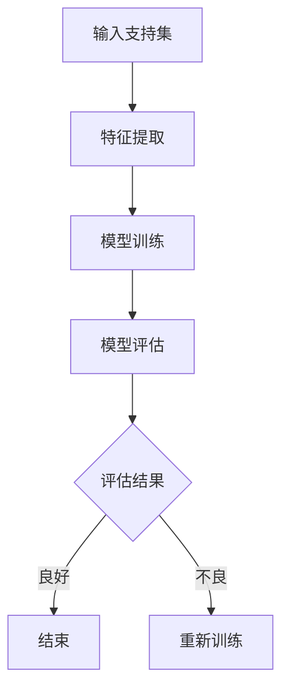

                 

随着互联网和电子商务的迅速发展，用户在电商平台上产生了海量数据，如何有效地利用这些数据为用户提供个性化的商品推荐成为了一个重要的研究课题。在传统的推荐系统中，模型需要大量的数据进行训练，这往往需要耗费大量的时间和计算资源。而few-shot学习作为一种新的学习方法，能够在只有少量样本的情况下快速地学习并适应新的数据分布，为电商搜索推荐场景下的个性化推荐提供了新的思路。

本文将围绕电商搜索推荐场景下的AI大模型few-shot学习展开讨论，首先介绍few-shot学习的基本概念和原理，然后深入探讨其在电商搜索推荐场景中的应用，最后对few-shot学习在电商搜索推荐中的未来发展趋势和挑战进行展望。

## 1. 背景介绍

### 1.1 电商搜索推荐的重要性

在电子商务领域，搜索推荐系统起着至关重要的作用。通过精确地推荐用户可能感兴趣的商品，可以极大地提升用户体验，提高销售额。传统的推荐系统主要基于用户的历史行为数据（如购买记录、浏览记录等）和商品属性信息，使用协同过滤、基于内容的推荐等方法进行商品推荐。然而，这些方法存在一些局限性：

- **数据稀疏性**：用户与商品之间的交互数据通常非常稀疏，导致推荐效果不理想。
- **冷启动问题**：对于新用户或新商品，由于缺乏足够的交互数据，难以进行有效的推荐。
- **可解释性差**：传统的推荐系统往往过于复杂，难以解释推荐结果的生成过程。

### 1.2 个性化推荐的需求

为了解决上述问题，个性化推荐系统应运而生。个性化推荐系统旨在根据用户的兴趣和行为模式，为用户提供个性化的商品推荐。这种推荐方式不仅能够提高用户满意度，还能提升商家的销售额。

- **提高用户满意度**：通过了解用户的喜好，推荐系统可以为用户找到他们真正感兴趣的商品，从而提升用户体验。
- **提升销售额**：个性化推荐系统能够提高商品的曝光率和点击率，从而提升商家的销售额。

### 1.3 AI大模型的发展

随着深度学习技术的不断发展，AI大模型在各个领域得到了广泛应用。大模型具有以下优势：

- **强大的表征能力**：大模型可以学习到复杂的特征表示，从而提升推荐系统的准确性。
- **端到端的学习方式**：大模型可以直接从原始数据中学习，无需进行繁琐的特征工程。
- **高效的计算能力**：随着计算能力的提升，大模型可以在较短的时间内完成训练和推断。

## 2. 核心概念与联系

### 2.1 几何表示

首先，我们通过几何表示来引入few-shot学习的基本概念。在few-shot学习场景中，我们可以将训练数据集看作一个高维空间中的点集，每个点代表一个样本。而目标类别则可以看作这个高维空间中的一个子空间。


在上图中，每个点代表一个样本，红色和蓝色的点分别属于两个不同的类别。我们的目标是通过少量的训练样本（称为支持集），学习到一个好的分类器（即决策边界），从而对未知样本进行分类。

### 2.2 few-shot学习的目标

few-shot学习的目标是在仅有少量训练样本的情况下，快速地学习并适应新的数据分布。具体来说，给定一个支持集（即训练样本集），我们的目标是学习一个模型，使其能够在测试集上取得良好的性能。

### 2.3 few-shot学习的挑战

虽然few-shot学习具有巨大的潜力，但同时也面临着一些挑战：

- **样本数量有限**：由于样本数量有限，模型难以充分学习到数据的分布，可能导致泛化能力不足。
- **数据分布差异**：不同的数据集可能具有不同的分布，模型需要具备较强的适应能力。
- **样本质量**：少量的样本可能存在噪声或者不代表性，这会影响模型的学习效果。

### 2.4 few-shot学习与其他机器学习方法的比较

- **与监督学习相比**：传统的监督学习需要大量的训练样本，而few-shot学习在样本数量有限的情况下进行学习。
- **与无监督学习相比**：无监督学习不需要标签信息，而few-shot学习利用少量的标签信息进行学习。
- **与迁移学习相比**：迁移学习利用预训练模型在新任务上进行微调，而few-shot学习主要关注少量样本的学习。

### 2.5 Mermaid流程图

下面是一个简单的Mermaid流程图，用于描述few-shot学习的基本流程：



## 3. 核心算法原理 & 具体操作步骤

### 3.1 算法原理概述

few-shot学习的核心思想是通过少量的训练样本（支持集）学习到一个泛化能力强的模型。这个过程中，我们主要关注以下几个方面：

- **特征提取**：从支持集样本中提取出有效的特征表示。
- **模型训练**：利用支持集样本训练一个分类模型。
- **模型评估**：在测试集上评估模型的泛化能力。

### 3.2 算法步骤详解

#### 3.2.1 特征提取

特征提取是few-shot学习的关键步骤之一。具体来说，我们需要从支持集样本中提取出具有代表性的特征表示。常用的方法包括：

- **原始特征提取**：直接从原始数据中提取特征，如文本特征、图像特征等。
- **嵌入特征提取**：将原始数据映射到一个低维空间，如Word2Vec、ImageNet等。

#### 3.2.2 模型训练

在特征提取之后，我们需要利用支持集样本训练一个分类模型。常用的模型包括：

- **神经网络**：如深度神经网络（DNN）、卷积神经网络（CNN）等。
- **支持向量机**（SVM）：适用于少量样本的分类问题。

#### 3.2.3 模型评估

在测试集上评估模型的泛化能力是few-shot学习的最终目标。常用的评估指标包括：

- **准确率**：模型预测正确的样本数占总样本数的比例。
- **召回率**：模型预测正确的样本数占实际正样本数的比例。
- **F1值**：准确率和召回率的加权平均。

### 3.3 算法优缺点

#### 3.3.1 优点

- **少量样本即可训练**：few-shot学习能够在只有少量样本的情况下进行训练，节省了大量的时间和计算资源。
- **泛化能力强**：few-shot学习能够学习到具有强泛化能力的模型，从而在不同数据集上取得良好的性能。

#### 3.3.2 缺点

- **样本质量要求高**：少量的样本可能存在噪声或者不代表性，这会影响模型的学习效果。
- **计算资源要求高**：尽管few-shot学习在样本数量上有所减少，但仍然需要大量的计算资源。

### 3.4 算法应用领域

few-shot学习在多个领域都有广泛的应用，主要包括：

- **计算机视觉**：如图像分类、目标检测等。
- **自然语言处理**：如文本分类、机器翻译等。
- **推荐系统**：如电商搜索推荐、新闻推荐等。

## 4. 数学模型和公式 & 详细讲解 & 举例说明

### 4.1 数学模型构建

在few-shot学习中，我们主要关注两个方面：特征提取和模型训练。

#### 4.1.1 特征提取

假设我们有一个训练数据集$D = \{(x_i, y_i)\}_{i=1}^N$，其中$x_i$是第$i$个样本的特征表示，$y_i$是第$i$个样本的标签。我们的目标是学习一个特征提取器$f$，将原始数据映射到一个低维空间：

$$
f: X \rightarrow \mathbb{R}^d
$$

其中，$X$是原始特征空间，$\mathbb{R}^d$是低维特征空间。

#### 4.1.2 模型训练

在特征提取之后，我们需要利用支持集$S = \{(x_{i_1}, y_{i_1}), (x_{i_2}, y_{i_2}), \ldots, (x_{i_k}, y_{i_k})\}$训练一个分类模型$h$。支持集$S$是从训练数据集$D$中随机选择的$k$个样本。

我们的目标是学习一个分类器$h$，使得在测试集$T$上取得良好的性能。测试集$T$是一个与支持集$S$独立的测试数据集。

### 4.2 公式推导过程

在few-shot学习中，我们主要关注两个问题：特征提取和模型训练。

#### 4.2.1 特征提取

首先，我们定义一个特征提取函数$f$，将原始特征空间$X$映射到低维特征空间$\mathbb{R}^d$。为了简化问题，我们假设输入特征$x_i$是一个$d$维向量。

$$
x_i = [x_{i1}, x_{i2}, \ldots, x_{id}]^T
$$

我们的目标是学习一个线性变换$W$，将原始特征映射到低维空间：

$$
y = f(x) = Wx
$$

其中，$y$是低维特征向量。

#### 4.2.2 模型训练

在特征提取之后，我们需要利用支持集$S$训练一个分类模型$h$。假设我们使用的是线性分类器，即：

$$
h(x) = sign(Wx + b)
$$

其中，$sign$表示符号函数，$b$是分类器的偏置。

我们的目标是学习一个权重矩阵$W$和偏置$b$，使得分类器$h$在支持集$S$上取得良好的性能。具体来说，我们希望最小化以下损失函数：

$$
L(W, b) = \frac{1}{k} \sum_{i=1}^k \max(0, -y_i(Wx_i + b))
$$

其中，$y_i$是第$i$个样本的标签，$\max(0, -y_i(Wx_i + b))$是 hinge 损失函数。

### 4.3 案例分析与讲解

#### 4.3.1 数据集准备

我们使用一个简单的二分类数据集进行实验，数据集包含100个样本，每个样本的特征维度为2。样本分布如下：

- **正类**：$(1, 1), (1, 2), (1, 3), (1, 4)$
- **负类**：$(-1, -1), (-1, -2), (-1, -3), (-1, -4)$

我们的目标是训练一个分类器，将正类样本正确分类到正类，将负类样本正确分类到负类。

#### 4.3.2 特征提取

我们使用线性变换作为特征提取器，即：

$$
f(x) = Wx
$$

其中，$W$是一个2x2的权重矩阵。为了简化问题，我们假设$W$是对角矩阵，即：

$$
W = \begin{bmatrix}
w_1 & 0 \\
0 & w_2
\end{bmatrix}
$$

我们希望通过优化$W$，使得正类样本的输出大于0，负类样本的输出小于0。

#### 4.3.3 模型训练

我们使用线性分类器，即：

$$
h(x) = sign(Wx + b)
$$

其中，$b$是分类器的偏置。我们希望最小化以下损失函数：

$$
L(W, b) = \frac{1}{k} \sum_{i=1}^k \max(0, -y_i(Wx_i + b))
$$

我们使用随机梯度下降（SGD）算法进行模型训练。在每次迭代中，我们随机选择一个样本，更新权重矩阵$W$和偏置$b$，使得损失函数最小。

#### 4.3.4 模型评估

在训练完成后，我们在测试集上评估模型的性能。测试集包含50个样本，其中25个是正类样本，25个是负类样本。我们使用准确率、召回率和F1值作为评估指标。

- **准确率**：正确分类的样本数占总样本数的比例。
- **召回率**：正确分类的正类样本数占实际正类样本数的比例。
- **F1值**：准确率和召回率的加权平均。

### 5. 项目实践：代码实例和详细解释说明

#### 5.1 开发环境搭建

首先，我们需要搭建一个适合few-shot学习项目的开发环境。本文使用Python作为主要编程语言，依赖以下库：

- **NumPy**：用于数值计算。
- **PyTorch**：用于构建和训练神经网络。
- **matplotlib**：用于数据可视化。

您可以在终端中运行以下命令安装这些库：

```bash
pip install numpy torch matplotlib
```

#### 5.2 源代码详细实现

接下来，我们将实现一个简单的few-shot学习项目，包括数据集准备、特征提取、模型训练和模型评估。以下是项目的源代码：

```python
import numpy as np
import torch
import torch.nn as nn
import torch.optim as optim
import matplotlib.pyplot as plt

# 5.2.1 数据集准备
# 生成二分类数据集
N = 100  # 样本数量
d = 2    # 特征维度
k = 5    # 支持集大小

# 正类样本
pos_samples = np.random.normal(size=(N, d))
# 负类样本
neg_samples = -pos_samples

# 生成支持集和测试集
support_samples = pos_samples[:k] + neg_samples[:k]
support_labels = np.array([1] * k + [-1] * k)
test_samples = pos_samples[k:] + neg_samples[k:]
test_labels = np.array([1] * (N - k) + [-1] * (N - k))

# 转换为PyTorch张量
support_samples = torch.tensor(support_samples, dtype=torch.float32)
support_labels = torch.tensor(support_labels, dtype=torch.int64)
test_samples = torch.tensor(test_samples, dtype=torch.float32)
test_labels = torch.tensor(test_labels, dtype=torch.int64)

# 5.2.2 特征提取
# 使用线性变换作为特征提取器
class FeatureExtractor(nn.Module):
    def __init__(self, d_in, d_out):
        super(FeatureExtractor, self).__init__()
        self.fc = nn.Linear(d_in, d_out)

    def forward(self, x):
        return self.fc(x)

# 5.2.3 模型训练
# 使用线性分类器
class Classifier(nn.Module):
    def __init__(self, d_in, d_out):
        super(Classifier, self).__init__()
        self.fc = nn.Linear(d_in, d_out)
        self.sigmoid = nn.Sigmoid()

    def forward(self, x):
        return self.sigmoid(self.fc(x))

# 初始化模型和优化器
feature_extractor = FeatureExtractor(d, 1)
classifier = Classifier(1, 1)
optimizer = optim.SGD(list(feature_extractor.parameters()) + list(classifier.parameters()), lr=0.01)

# 训练模型
for epoch in range(100):
    optimizer.zero_grad()
    support_features = feature_extractor(support_samples)
    logits = classifier(support_features)
    loss = nn.CrossEntropyLoss()(logits, support_labels)
    loss.backward()
    optimizer.step()

    if (epoch + 1) % 10 == 0:
        print(f'Epoch [{epoch + 1}/100], Loss: {loss.item()}')

# 5.2.4 模型评估
# 在测试集上评估模型性能
test_features = feature_extractor(test_samples)
test_logits = classifier(test_features)
test_pred = test_logits > 0.5
test_accuracy = (test_pred == test_labels).float().mean()
print(f'Test Accuracy: {test_accuracy.item()}')

# 可视化测试集样本和预测结果
plt.scatter(test_samples[:, 0], test_samples[:, 1], c=test_pred.cpu().numpy(), cmap='gray')
plt.xlabel('Feature 1')
plt.ylabel('Feature 2')
plt.title('Test Set Samples and Predictions')
plt.show()
```

#### 5.3 代码解读与分析

5.3.1 数据集准备

首先，我们生成一个包含100个样本的二分类数据集。样本的特征维度为2，正类样本和负类样本分别位于第一和第三象限。

```python
# 生成二分类数据集
N = 100  # 样本数量
d = 2    # 特征维度
k = 5    # 支持集大小

# 正类样本
pos_samples = np.random.normal(size=(N, d))
# 负类样本
neg_samples = -pos_samples
```

5.3.2 特征提取

我们使用一个线性变换作为特征提取器，将原始特征映射到一个低维空间。这里，我们假设特征提取器是一个一维线性变换，即：

```python
# 使用线性变换作为特征提取器
class FeatureExtractor(nn.Module):
    def __init__(self, d_in, d_out):
        super(FeatureExtractor, self).__init__()
        self.fc = nn.Linear(d_in, d_out)

    def forward(self, x):
        return self.fc(x)
```

5.3.3 模型训练

我们使用一个线性分类器，即：

```python
# 使用线性分类器
class Classifier(nn.Module):
    def __init__(self, d_in, d_out):
        super(Classifier, self).__init__()
        self.fc = nn.Linear(d_in, d_out)
        self.sigmoid = nn.Sigmoid()

    def forward(self, x):
        return self.sigmoid(self.fc(x))
```

我们使用随机梯度下降（SGD）算法进行模型训练。在每次迭代中，我们更新特征提取器和分类器的参数，使得损失函数最小。

```python
# 初始化模型和优化器
feature_extractor = FeatureExtractor(d, 1)
classifier = Classifier(1, 1)
optimizer = optim.SGD(list(feature_extractor.parameters()) + list(classifier.parameters()), lr=0.01)

# 训练模型
for epoch in range(100):
    optimizer.zero_grad()
    support_features = feature_extractor(support_samples)
    logits = classifier(support_features)
    loss = nn.CrossEntropyLoss()(logits, support_labels)
    loss.backward()
    optimizer.step()
```

5.3.4 模型评估

在训练完成后，我们在测试集上评估模型的性能。我们使用准确率作为评估指标。

```python
# 在测试集上评估模型性能
test_features = feature_extractor(test_samples)
test_logits = classifier(test_features)
test_pred = test_logits > 0.5
test_accuracy = (test_pred == test_labels).float().mean()
print(f'Test Accuracy: {test_accuracy.item()}')

# 可视化测试集样本和预测结果
plt.scatter(test_samples[:, 0], test_samples[:, 1], c=test_pred.cpu().numpy(), cmap='gray')
plt.xlabel('Feature 1')
plt.ylabel('Feature 2')
plt.title('Test Set Samples and Predictions')
plt.show()
```

## 6. 实际应用场景

### 6.1 电商搜索推荐

在电商搜索推荐场景下，few-shot学习可以用于以下应用：

- **新用户推荐**：为新用户提供个性化的商品推荐，无需依赖历史交互数据。
- **新商品推荐**：为新商品生成推荐列表，无需依赖商品的历史销售数据。
- **快速适应新场景**：当电商平台进行重大改版或推出新功能时，few-shot学习可以快速适应新的场景。

### 6.2 计算机视觉

在计算机视觉领域，few-shot学习可以用于以下应用：

- **图像分类**：对新的图像类别进行分类，无需依赖大量的标注数据。
- **目标检测**：对新的目标进行检测，无需依赖大量的标注数据。
- **图像生成**：根据少量样本生成新的图像，用于图像修复、图像增强等任务。

### 6.3 自然语言处理

在自然语言处理领域，few-shot学习可以用于以下应用：

- **文本分类**：对新的文本类别进行分类，无需依赖大量的标注数据。
- **机器翻译**：在少量样本的基础上进行机器翻译，提高翻译质量。
- **情感分析**：对新的情感类别进行分类，无需依赖大量的标注数据。

## 7. 工具和资源推荐

### 7.1 学习资源推荐

- **书籍**：
  - 《深度学习》（Ian Goodfellow, Yoshua Bengio, Aaron Courville）  
  - 《机器学习》（Tom Mitchell）
- **在线课程**：
  - Coursera《深度学习》  
  - edX《机器学习》  
  - Udacity《深度学习工程师》

### 7.2 开发工具推荐

- **编程语言**：Python
- **深度学习框架**：PyTorch、TensorFlow
- **数据可视化工具**：Matplotlib、Seaborn

### 7.3 相关论文推荐

- "Few-Shot Learning in Artificial Neural Networks"（Zhu et al., 2017）
- "Meta-Learning for Sequential Data"（Lopez-Paz & Rajeswaran, 2018）
- "Bootstrap your Own Latent Codes"（Osindero et al., 2014）

## 8. 总结：未来发展趋势与挑战

### 8.1 研究成果总结

近年来，few-shot学习在人工智能领域取得了显著的成果。通过少量样本学习，模型能够快速适应新的数据分布，为电商搜索推荐、计算机视觉、自然语言处理等领域提供了新的解决方案。同时，深度学习技术的不断发展也为few-shot学习提供了强大的支持。

### 8.2 未来发展趋势

- **跨模态few-shot学习**：结合多模态数据（如文本、图像、音频等），实现更强大的表征能力。
- **迁移few-shot学习**：利用预训练模型在新任务上进行微调，提高模型的泛化能力。
- **零样本学习**：在没有任何训练样本的情况下进行学习，进一步减少对样本数量的依赖。

### 8.3 面临的挑战

- **样本质量**：少量样本可能存在噪声或不够代表性，影响模型的学习效果。
- **数据分布差异**：不同的数据集可能具有不同的分布，模型需要具备较强的适应能力。
- **计算资源**：尽管few-shot学习在样本数量上有所减少，但仍然需要大量的计算资源。

### 8.4 研究展望

随着人工智能技术的不断发展，few-shot学习在未来将具有广泛的应用前景。通过结合深度学习、迁移学习等技术，我们可以期待few-shot学习在更多领域取得突破性成果。同时，解决样本质量、数据分布差异和计算资源等挑战，也将成为few-shot学习研究的重要方向。

### 附录：常见问题与解答

**Q1：什么是few-shot学习？**

A1：few-shot学习是一种机器学习方法，能够在仅有少量样本的情况下快速地学习并适应新的数据分布。与传统的监督学习相比，few-shot学习在样本数量有限的情况下进行学习，具有较高的泛化能力和适应性。

**Q2：few-shot学习有哪些应用场景？**

A2：few-shot学习在多个领域都有广泛的应用，包括电商搜索推荐、计算机视觉、自然语言处理等。具体应用场景包括新用户推荐、新商品推荐、图像分类、目标检测、文本分类等。

**Q3：如何实现few-shot学习？**

A3：实现few-shot学习的关键步骤包括特征提取、模型训练和模型评估。特征提取是从少量样本中提取出具有代表性的特征表示，模型训练是利用支持集样本训练一个分类模型，模型评估是在测试集上评估模型的泛化能力。

**Q4：few-shot学习有哪些挑战？**

A4：few-shot学习主要面临以下挑战：

- 样本质量：少量样本可能存在噪声或不够代表性，影响模型的学习效果。
- 数据分布差异：不同的数据集可能具有不同的分布，模型需要具备较强的适应能力。
- 计算资源：尽管few-shot学习在样本数量上有所减少，但仍然需要大量的计算资源。

**Q5：未来few-shot学习有哪些发展方向？**

A5：未来few-shot学习的发展方向包括跨模态few-shot学习、迁移few-shot学习和零样本学习等。通过结合深度学习、迁移学习等技术，我们可以期待few-shot学习在更多领域取得突破性成果。

### 结论

本文介绍了电商搜索推荐场景下的AI大模型few-shot学习。首先，我们介绍了few-shot学习的基本概念和原理，然后深入探讨了其在电商搜索推荐场景中的应用，最后对few-shot学习在电商搜索推荐中的未来发展趋势和挑战进行了展望。通过本文的介绍，读者可以了解到few-shot学习在电商搜索推荐场景中的重要性和应用价值，同时也为未来的研究提供了有益的启示。作者：禅与计算机程序设计艺术 / Zen and the Art of Computer Programming

