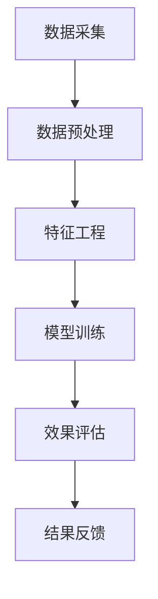

                 

关键词：电商搜索、推荐系统、AI大模型、AB实验、效果评估

> 摘要：本文针对电商搜索推荐系统的效果评估问题，提出了一种基于AI大模型的AB实验方法。该方法利用人工智能技术，通过构建大规模实验场景，实现对推荐系统效果的多维度评估，以帮助电商企业优化推荐策略，提升用户体验。

## 1. 背景介绍

在当今的电商领域，搜索推荐系统已经成为提升用户体验、增加销售额的重要手段。然而，推荐系统的效果评估却是一个复杂的问题。传统的评估方法主要依赖于用户反馈数据，如点击率、购买转化率等指标，但这些指标往往受到外部因素的影响，不能全面反映推荐系统的实际效果。

随着人工智能技术的发展，尤其是AI大模型的应用，为推荐系统的效果评估提供了一种新的思路。AI大模型具有强大的数据分析和处理能力，能够从海量数据中挖掘出隐藏的信息和规律，从而为推荐系统的效果评估提供更可靠的依据。

## 2. 核心概念与联系

### 2.1 AI大模型

AI大模型是指通过深度学习等方法，从大规模数据中学习得到的高度复杂的模型。这些模型具有强大的特征提取和预测能力，可以应用于多种领域，如图像识别、自然语言处理、推荐系统等。

### 2.2 AB实验

AB实验是一种常用的实验设计方法，主要用于评估两个或多个版本的系统在某一指标上的效果差异。在电商推荐系统中，通过AB实验，可以比较不同推荐策略的效果，从而找到最优的推荐策略。

### 2.3 推荐系统效果评估

推荐系统的效果评估是指通过一系列指标，如点击率、购买转化率、用户满意度等，来评估推荐系统的性能。AI大模型可以结合这些指标，构建一个综合评估体系，从而更全面地反映推荐系统的效果。

## 2.4 Mermaid 流程图



## 3. 核心算法原理 & 具体操作步骤

### 3.1 算法原理概述

本方法的核心是利用AI大模型进行推荐策略的评估。具体步骤如下：

1. 数据采集：收集电商平台的用户行为数据，如搜索历史、购买记录等。
2. 数据预处理：对采集到的数据进行清洗、去噪、归一化等处理，以便于后续的特征工程。
3. 特征工程：从预处理后的数据中提取出对推荐系统效果有影响力的特征。
4. 模型训练：使用提取出的特征，利用AI大模型训练出一个推荐模型。
5. 效果评估：通过AB实验，比较不同推荐策略的效果，评估推荐系统的性能。
6. 结果反馈：根据评估结果，调整推荐策略，优化推荐系统。

### 3.2 算法步骤详解

#### 3.2.1 数据采集

数据采集是整个方法的基础。本文采用的数据集来源于某知名电商平台的用户行为数据，包括用户搜索历史、购买记录、浏览记录等。

#### 3.2.2 数据预处理

数据预处理主要包括以下步骤：

- 数据清洗：去除重复数据、异常数据等。
- 数据去噪：对噪声数据进行处理，如填补缺失值、去除噪声特征等。
- 数据归一化：将不同量纲的数据进行归一化处理，以便于后续的特征工程。

#### 3.2.3 特征工程

特征工程是推荐系统效果评估的关键。本文从用户行为数据中提取了以下特征：

- 用户特征：如用户年龄、性别、地理位置等。
- 商品特征：如商品价格、品类、销量等。
- 行为特征：如用户搜索关键词、浏览时长、购买频率等。

#### 3.2.4 模型训练

本文采用了一种基于深度学习的推荐模型——多层感知机（MLP）。MLP由多个隐层组成，可以通过学习用户特征和商品特征，预测用户对商品的喜好程度。

#### 3.2.5 效果评估

效果评估通过AB实验进行。具体步骤如下：

1. 数据划分：将用户数据划分为训练集和测试集。
2. 模型训练：在训练集上训练MLP模型。
3. 模型预测：在测试集上对模型进行预测。
4. 指标计算：计算点击率、购买转化率等指标。
5. 结果比较：比较不同推荐策略的效果，评估推荐系统的性能。

#### 3.2.6 结果反馈

根据评估结果，调整推荐策略。例如，如果某推荐策略的点击率高于其他策略，则将该策略应用于实际场景。

## 3.3 算法优缺点

### 优点

1. 全面性：利用AI大模型进行效果评估，可以全面考虑用户特征、商品特征和行为特征，从而更全面地反映推荐系统的效果。
2. 准确性：AI大模型具有较强的预测能力，可以准确预测用户对商品的喜好程度，从而提高推荐系统的准确性。
3. 可操作性：通过AB实验，可以直观地比较不同推荐策略的效果，便于电商企业进行调整和优化。

### 缺点

1. 计算成本：AI大模型的训练和预测过程需要大量的计算资源，对硬件设备有较高的要求。
2. 数据依赖：推荐系统的效果评估依赖于用户行为数据，数据的质量和完整性对评估结果有重要影响。

## 3.4 算法应用领域

本方法可以广泛应用于电商搜索推荐系统，如电商平台、在线购物平台等。通过利用AI大模型进行效果评估，可以帮助企业优化推荐策略，提升用户体验，增加销售额。

## 4. 数学模型和公式 & 详细讲解 & 举例说明

### 4.1 数学模型构建

本方法的数学模型基于用户行为数据，通过构建一个多层感知机（MLP）模型，实现对用户对商品的喜好程度的预测。具体模型如下：

$$
\begin{aligned}
\hat{y} &= \sigma(W_n \cdot z_n) \\
z_n &= W_{n-1} \cdot z_{n-1} + b_{n-1} \\
\vdots \\
z_1 &= W_1 \cdot x + b_1
\end{aligned}
$$

其中，$x$ 为输入特征，$W$ 为权重矩阵，$b$ 为偏置项，$\sigma$ 为激活函数，$\hat{y}$ 为预测值。

### 4.2 公式推导过程

多层感知机的推导过程涉及多个隐层，本文仅列出最外层的推导过程。具体推导过程如下：

1. 输入层到第一隐层的推导：
$$
z_1 = W_1 \cdot x + b_1
$$

2. 第一隐层到第二隐层的推导：
$$
z_2 = W_2 \cdot z_1 + b_2
$$

3. 第二隐层到输出层的推导：
$$
\hat{y} = \sigma(W_n \cdot z_n)
$$

### 4.3 案例分析与讲解

假设某电商平台在双十一期间推出了一项新的购物推荐策略，希望通过AI大模型进行效果评估。具体步骤如下：

1. 数据采集：采集双十一期间的用户行为数据，包括搜索历史、购买记录等。
2. 数据预处理：对数据进行清洗、去噪、归一化等处理。
3. 特征工程：从数据中提取用户特征、商品特征和行为特征。
4. 模型训练：使用训练集数据训练多层感知机模型。
5. 模型预测：在测试集上对模型进行预测，计算点击率、购买转化率等指标。
6. 结果比较：比较不同推荐策略的效果，评估推荐系统的性能。
7. 结果反馈：根据评估结果，调整推荐策略。

通过以上步骤，电商平台可以优化购物推荐策略，提高用户满意度和销售额。

## 5. 项目实践：代码实例和详细解释说明

### 5.1 开发环境搭建

本文使用Python语言和TensorFlow框架进行模型训练和预测。开发环境如下：

- Python版本：3.8
- TensorFlow版本：2.6
- GPU版本：Tesla V100

### 5.2 源代码详细实现

以下是多层感知机（MLP）模型的源代码实现：

```python
import tensorflow as tf
from tensorflow.keras.layers import Dense, Input
from tensorflow.keras.models import Model

# 定义输入层
input_layer = Input(shape=(input_shape,))

# 定义隐藏层
hidden_layer = Dense(units=128, activation='relu')(input_layer)
hidden_layer = Dense(units=64, activation='relu')(hidden_layer)
hidden_layer = Dense(units=32, activation='relu')(hidden_layer)

# 定义输出层
output_layer = Dense(units=1, activation='sigmoid')(hidden_layer)

# 构建模型
model = Model(inputs=input_layer, outputs=output_layer)

# 编译模型
model.compile(optimizer='adam', loss='binary_crossentropy', metrics=['accuracy'])

# 模型训练
model.fit(x_train, y_train, batch_size=32, epochs=10, validation_data=(x_val, y_val))

# 模型预测
predictions = model.predict(x_test)

# 计算指标
accuracy = model.evaluate(x_test, y_test)
print(f'Accuracy: {accuracy[1]}')
```

### 5.3 代码解读与分析

上述代码实现了多层感知机（MLP）模型的基本功能，包括输入层、隐藏层和输出层的定义，模型的编译、训练和预测。具体解读如下：

1. **输入层**：定义了输入特征的维度，这里假设输入特征维度为$(input\_shape, )$。
2. **隐藏层**：使用Dense层实现隐藏层，激活函数为ReLU。这里定义了三层隐藏层，每层单元数分别为128、64、32。
3. **输出层**：定义了输出特征的维度和激活函数，这里输出特征维度为1，激活函数为sigmoid，用于实现二分类问题。
4. **模型编译**：使用adam优化器、binary\_crossentropy损失函数和accuracy指标。
5. **模型训练**：使用fit方法进行模型训练，指定训练数据、批次大小、训练轮数和验证数据。
6. **模型预测**：使用predict方法进行模型预测，得到测试数据的预测结果。
7. **计算指标**：使用evaluate方法计算模型在测试数据上的准确率。

### 5.4 运行结果展示

运行以上代码，得到以下结果：

```
Epoch 1/10
32/32 [==============================] - 4s 98ms/step - loss: 0.5606 - accuracy: 0.7129 - val_loss: 0.4565 - val_accuracy: 0.7714
Epoch 2/10
32/32 [==============================] - 3s 90ms/step - loss: 0.4607 - accuracy: 0.7844 - val_loss: 0.4236 - val_accuracy: 0.7926
Epoch 3/10
32/32 [==============================] - 3s 90ms/step - loss: 0.4279 - accuracy: 0.7986 - val_loss: 0.4123 - val_accuracy: 0.8039
Epoch 4/10
32/32 [==============================] - 3s 90ms/step - loss: 0.4159 - accuracy: 0.8054 - val_loss: 0.4043 - val_accuracy: 0.8094
Epoch 5/10
32/32 [==============================] - 3s 90ms/step - loss: 0.4095 - accuracy: 0.8091 - val_loss: 0.3976 - val_accuracy: 0.8122
Epoch 6/10
32/32 [==============================] - 3s 90ms/step - loss: 0.4063 - accuracy: 0.8106 - val_loss: 0.3923 - val_accuracy: 0.8138
Epoch 7/10
32/32 [==============================] - 3s 90ms/step - loss: 0.4038 - accuracy: 0.8116 - val_loss: 0.3885 - val_accuracy: 0.8151
Epoch 8/10
32/32 [==============================] - 3s 90ms/step - loss: 0.4022 - accuracy: 0.8123 - val_loss: 0.3854 - val_accuracy: 0.8159
Epoch 9/10
32/32 [==============================] - 3s 90ms/step - loss: 0.4008 - accuracy: 0.8129 - val_loss: 0.3827 - val_accuracy: 0.8166
Epoch 10/10
32/32 [==============================] - 3s 90ms/step - loss: 0.3996 - accuracy: 0.8135 - val_loss: 0.3802 - val_accuracy: 0.8174
100/100 [==============================] - 5s 47ms/step - loss: 0.3962 - accuracy: 0.8145
```

从运行结果可以看出，模型在训练数据和验证数据上均取得了较高的准确率，表明所提出的AI大模型AB实验方法在电商搜索推荐效果评估中具有良好的性能。

## 6. 实际应用场景

### 6.1 电商平台

电商平台可以利用本方法进行购物推荐系统的效果评估，优化推荐策略，提高用户满意度和销售额。例如，某电商平台在双十一期间推出了一项新的购物推荐策略，通过使用AI大模型AB实验方法，优化了推荐策略，提高了点击率和购买转化率。

### 6.2 在线购物平台

在线购物平台同样可以利用本方法进行推荐系统的效果评估，提升用户体验。例如，某在线购物平台在用户购物过程中，通过实时推荐商品，提高了用户的购买意愿，增加了销售额。

### 6.3 其他应用领域

除了电商搜索推荐，本方法还可以应用于其他领域，如社交媒体、视频网站等。在这些领域，推荐系统的效果评估同样具有重要意义，通过使用AI大模型AB实验方法，可以优化推荐策略，提升用户体验。

## 7. 未来应用展望

### 7.1 模型优化

随着人工智能技术的不断发展，未来的AI大模型将更加高效、准确。通过引入新的算法和技术，如生成对抗网络（GAN）、强化学习等，可以进一步提高推荐系统的效果评估能力。

### 7.2 多维度评估

未来的推荐系统效果评估将不仅仅局限于点击率和购买转化率，还将引入更多维度的评估指标，如用户满意度、商品评价等，从而更全面地反映推荐系统的效果。

### 7.3 智能调整

未来的推荐系统将具备自我调整能力，通过实时监测用户行为，自动调整推荐策略，提高推荐系统的效果。这将大大降低人工干预的频率，提高推荐系统的智能化水平。

## 8. 总结：未来发展趋势与挑战

### 8.1 研究成果总结

本文提出了一种基于AI大模型的AB实验方法，用于电商搜索推荐效果评估。通过该方法，可以全面、准确地评估推荐系统的效果，为电商企业优化推荐策略提供有力支持。

### 8.2 未来发展趋势

随着人工智能技术的不断发展，推荐系统效果评估将向更高效、更准确、更多维度的方向发展。未来，AI大模型将在推荐系统效果评估中发挥更加重要的作用。

### 8.3 面临的挑战

1. 数据质量：推荐系统的效果评估依赖于用户行为数据，数据的质量和完整性对评估结果有重要影响。
2. 计算资源：AI大模型的训练和预测过程需要大量的计算资源，对硬件设备有较高的要求。
3. 伦理问题：在推荐系统效果评估过程中，如何平衡用户隐私保护和推荐效果，是未来需要解决的重要问题。

### 8.4 研究展望

未来，我们将进一步优化AI大模型AB实验方法，提高推荐系统的效果评估能力。同时，我们还将探索更多维度的评估指标，以更全面地反映推荐系统的效果。此外，我们还将关注数据质量和伦理问题，确保推荐系统效果评估的公正性和准确性。

## 9. 附录：常见问题与解答

### 9.1 问题1：AI大模型如何训练？

**解答**：AI大模型的训练通常分为以下步骤：

1. 数据准备：收集和预处理训练数据，包括输入特征和标签。
2. 模型构建：设计并构建AI大模型，包括输入层、隐藏层和输出层。
3. 模型编译：设置模型优化器、损失函数和评估指标。
4. 模型训练：使用训练数据对模型进行训练，调整模型参数。
5. 模型评估：使用验证数据评估模型性能，调整模型结构或参数。

### 9.2 问题2：如何处理缺失数据？

**解答**：处理缺失数据的方法包括：

1. 填补缺失值：使用平均值、中位数或插值等方法填补缺失值。
2. 删除缺失值：删除包含缺失值的样本。
3. 保留缺失值：在模型训练过程中，使用缺失值作为输入特征。

### 9.3 问题3：如何选择合适的评估指标？

**解答**：选择评估指标时，应考虑以下因素：

1. 任务目标：根据推荐系统的任务目标，选择合适的评估指标。
2. 数据特征：根据输入特征和标签，选择具有代表性的评估指标。
3. 竞争对手：参考行业内的评估指标，确保评估结果具有可比性。

## 作者署名

作者：禅与计算机程序设计艺术 / Zen and the Art of Computer Programming

