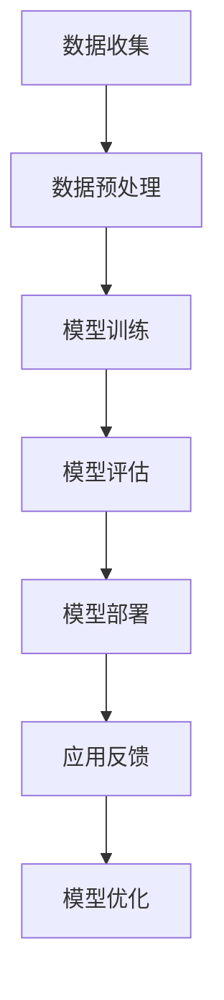
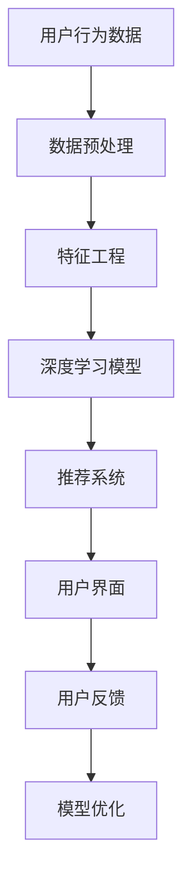

                 

## 1. 背景介绍

随着电子商务的快速发展，电商行业已经成为了全球经济增长的重要引擎。在这个行业中，企业需要通过有效的数据分析和精准的市场定位来提高销售额和用户满意度。近年来，人工智能（AI）技术的飞速发展为电商行业带来了前所未有的机遇。特别是大模型（Large Models），如深度学习模型、自然语言处理（NLP）模型等，已经开始在电商行业中得到广泛应用。

### 当前电商行业的现状与需求

电商行业的特点是数据量大、数据种类繁多，包括用户行为数据、商品信息、交易数据等。这些数据为AI大模型的训练和应用提供了丰富的素材。然而，如何有效地利用这些数据来提升业务效率和服务质量，是电商企业面临的一个重大挑战。

当前，电商行业对AI大模型的需求主要体现在以下几个方面：

1. **个性化推荐**：通过分析用户的购物历史和行为习惯，提供个性化的商品推荐，提高用户满意度和购买转化率。
2. **商品识别与分类**：使用图像识别和自然语言处理技术，自动识别和分类商品，提高库存管理效率。
3. **智能客服**：通过语音识别和自然语言处理技术，实现智能客服机器人，提供24/7的在线服务，提高客户体验。
4. **风险控制**：通过行为分析和异常检测，识别欺诈行为和潜在风险，保障交易安全。

### AI大模型的定义与重要性

AI大模型是指那些参数量巨大、训练数据丰富的深度学习模型。这些模型通常采用多层神经网络结构，通过大量的数据训练，能够自动学习和提取数据中的复杂模式。AI大模型在电商行业中的重要性主要体现在以下几个方面：

1. **提高决策效率**：大模型能够快速处理和分析大量数据，帮助电商企业快速做出决策。
2. **增强用户体验**：通过个性化推荐、智能客服等功能，提升用户的购物体验。
3. **优化运营效率**：通过智能化的库存管理、风险控制等，降低运营成本，提高效率。
4. **开拓新市场**：大模型可以帮助企业发现新的市场和业务机会，实现业务增长。

本文将围绕AI大模型在电商行业中的应用，探讨其落地实践、技术实现、应用案例以及未来展望。

## 2. 核心概念与联系

在深入探讨AI大模型在电商行业中的应用之前，有必要先了解一些核心概念及其相互之间的联系。以下是本文中涉及的关键概念及其简要解释：

### 2.1. 深度学习模型

深度学习模型是一种基于人工神经网络的算法，通过多层非线性变换来提取数据中的特征。在电商行业中，深度学习模型可以用于用户行为分析、商品推荐、图像识别等领域。

### 2.2. 自然语言处理（NLP）模型

自然语言处理模型用于处理和理解人类语言，如文本分类、情感分析、命名实体识别等。在电商行业中，NLP模型可以用于智能客服、商品描述生成、用户评论分析等。

### 2.3. 训练数据和标注

训练数据是AI大模型训练的重要基础。在电商行业中，训练数据包括用户行为数据、商品信息、评论数据等。标注数据是指对训练数据进行标记，以便模型能够学习。

### 2.4. 神经网络架构

神经网络架构是指构建深度学习模型的框架，包括网络层数、神经元数量、激活函数等。在电商行业中，选择合适的神经网络架构对模型的性能至关重要。

### 2.5. 数据预处理

数据预处理是指对原始数据进行清洗、转换和归一化等操作，以提高模型训练效果。在电商行业中，数据预处理包括用户行为数据的聚合、缺失值填补、异常值检测等。

### 2.6. 性能评估指标

性能评估指标用于衡量模型的效果，如准确率、召回率、F1分数等。在电商行业中，常用的评估指标包括推荐点击率、转化率、客户满意度等。

### 2.7. Mermaid流程图

以下是AI大模型在电商行业中应用的Mermaid流程图，展示了从数据收集到模型训练和部署的全过程。



### 2.8. AI大模型在电商行业中的应用架构

以下是AI大模型在电商行业中的应用架构，展示了从数据流到最终服务的整体流程。



通过以上核心概念和架构的介绍，我们可以更好地理解AI大模型在电商行业中的落地应用。接下来，本文将详细探讨AI大模型在电商行业中的核心算法原理、具体操作步骤以及数学模型和公式。

## 3. 核心算法原理 & 具体操作步骤

### 3.1 算法原理概述

AI大模型在电商行业中的应用主要基于深度学习和自然语言处理技术。以下将分别介绍这两种技术的核心算法原理。

#### 3.1.1 深度学习模型原理

深度学习模型的核心是多层神经网络，它通过输入层、隐藏层和输出层进行处理。输入层接收外部输入，隐藏层通过激活函数进行非线性变换，输出层产生预测结果。深度学习模型的主要优势在于其能够自动从数据中提取特征，从而实现复杂任务的自动化。

#### 3.1.2 自然语言处理（NLP）模型原理

自然语言处理模型主要基于循环神经网络（RNN）和其变种长短期记忆网络（LSTM）。RNN通过将当前输入与历史输入信息进行关联，实现对序列数据的建模。LSTM则进一步改进了RNN，解决了其在长序列学习中的梯度消失和梯度爆炸问题。NLP模型广泛应用于文本分类、情感分析、机器翻译等领域。

### 3.2 算法步骤详解

以下是AI大模型在电商行业中的具体操作步骤：

#### 3.2.1 数据收集

数据收集是AI大模型训练的基础。在电商行业中，数据收集包括用户行为数据、商品信息、评论数据等。这些数据可以从电商平台的后台系统、第三方数据服务提供商等渠道获取。

#### 3.2.2 数据预处理

数据预处理是提高模型训练效果的重要步骤。主要包括以下内容：

1. 数据清洗：去除重复、错误和无关的数据。
2. 数据聚合：将用户行为数据、商品信息等数据进行整合。
3. 缺失值填补：使用统计方法或插值法填补缺失值。
4. 异常值检测：识别并处理异常值，以避免其对模型训练产生不利影响。

#### 3.2.3 特征工程

特征工程是指从原始数据中提取有助于模型训练的特征。在电商行业中，特征工程包括以下内容：

1. 用户特征：包括用户年龄、性别、地理位置、购物习惯等。
2. 商品特征：包括商品价格、品牌、类别、库存量等。
3. 行为特征：包括用户浏览、搜索、购买等行为数据。

#### 3.2.4 模型训练

模型训练是AI大模型应用的核心步骤。在电商行业中，常用的模型训练方法包括以下几种：

1. **监督学习**：使用标记数据对模型进行训练，如用户行为预测、商品分类等。
2. **无监督学习**：通过未标记的数据进行训练，如聚类分析、降维等。
3. **半监督学习**：结合标记和未标记数据训练模型，以提升模型效果。

#### 3.2.5 模型评估

模型评估是衡量模型效果的重要步骤。常用的评估指标包括准确率、召回率、F1分数等。在电商行业中，常用的评估指标包括推荐点击率、转化率、客户满意度等。

#### 3.2.6 模型部署

模型部署是将训练好的模型应用于实际业务场景的过程。在电商行业中，模型部署包括以下内容：

1. **部署环境**：搭建适合模型运行的硬件和软件环境。
2. **接口设计**：设计模型接口，以实现与业务系统的无缝对接。
3. **持续优化**：根据业务反馈对模型进行持续优化。

### 3.3 算法优缺点

#### 3.3.1 优点

1. **高效性**：AI大模型能够快速处理和分析大量数据，提高决策效率。
2. **个性化**：通过深度学习和NLP技术，AI大模型能够实现个性化推荐和智能客服，提升用户体验。
3. **自动化**：AI大模型能够自动提取数据中的特征，降低人工干预。

#### 3.3.2 缺点

1. **数据依赖性**：AI大模型的效果高度依赖数据质量，数据不足或质量差会影响模型效果。
2. **计算资源消耗**：训练和部署AI大模型需要大量的计算资源和存储空间。
3. **隐私风险**：用户数据的安全和隐私保护是一个重要问题，需要采取有效的措施来确保用户数据的安全。

### 3.4 算法应用领域

AI大模型在电商行业中的应用广泛，主要包括以下领域：

1. **个性化推荐**：通过分析用户行为数据，为用户推荐感兴趣的商品。
2. **商品识别与分类**：使用图像识别技术自动识别和分类商品，提高库存管理效率。
3. **智能客服**：通过自然语言处理技术，实现智能客服机器人，提供24/7的在线服务。
4. **风险控制**：通过行为分析和异常检测，识别欺诈行为和潜在风险，保障交易安全。

## 4. 数学模型和公式 & 详细讲解 & 举例说明

### 4.1 数学模型构建

在电商行业中，AI大模型的数学模型通常基于深度学习和自然语言处理技术。以下是一个简单的数学模型构建示例。

#### 4.1.1 深度学习模型

深度学习模型通常包括输入层、隐藏层和输出层。假设一个简单的深度学习模型，其输入层有\( n \)个神经元，隐藏层有\( m \)个神经元，输出层有\( k \)个神经元。

1. **输入层**：表示为\( x \in \mathbb{R}^{n} \)。
2. **隐藏层**：激活函数为\( \sigma \)，计算过程为：
   $$ h_{j} = \sigma(\sum_{i=1}^{n} w_{ij} x_{i} + b_{j}) $$
   其中，\( w_{ij} \)为权重，\( b_{j} \)为偏置。
3. **输出层**：激活函数为\( \sigma \)，计算过程为：
   $$ y_{k} = \sigma(\sum_{j=1}^{m} w_{jk} h_{j} + b_{k}) $$
   其中，\( w_{jk} \)为权重，\( b_{k} \)为偏置。

#### 4.1.2 自然语言处理（NLP）模型

NLP模型通常基于循环神经网络（RNN）或其变种长短期记忆网络（LSTM）。以下是一个简单的LSTM模型示例。

1. **输入层**：表示为\( x \in \mathbb{R}^{n} \)。
2. **隐藏层**：包括输入门、遗忘门、输出门和单元状态。计算过程为：
   $$ i_t = \sigma(W_{ii} x_t + W_{ih} h_{t-1} + b_i) $$
   $$ f_t = \sigma(W_{if} x_t + W_{ih} h_{t-1} + b_f) $$
   $$ o_t = \sigma(W_{io} x_t + W_{ih} h_{t-1} + b_o) $$
   $$ g_t = \tanh(W_{ig} x_t + W_{ih} h_{t-1} + b_g) $$
   $$ h_t = o_t \odot \tanh(W_{ih} g_t + b_h) $$
   其中，\( \sigma \)为激活函数，\( \odot \)为元素乘操作。

### 4.2 公式推导过程

以下是一个简单的深度学习模型公式的推导过程。

#### 4.2.1 前向传播

输入层到隐藏层的计算过程为：
$$ h_j = \sigma(\sum_{i=1}^{n} w_{ij} x_i + b_j) $$

输出层的计算过程为：
$$ y_k = \sigma(\sum_{j=1}^{m} w_{jk} h_j + b_k) $$

#### 4.2.2 反向传播

假设损失函数为平方误差损失函数，即：
$$ L = \frac{1}{2} \sum_{k=1}^{k} (y_k - \hat{y}_k)^2 $$

对损失函数求导，得到：
$$ \frac{\partial L}{\partial y_k} = y_k - \hat{y}_k $$
$$ \frac{\partial L}{\partial h_j} = \frac{\partial L}{\partial y_k} \cdot \frac{\partial y_k}{\partial h_j} $$
$$ \frac{\partial L}{\partial w_{jk}} = \frac{\partial L}{\partial y_k} \cdot \frac{\partial y_k}{\partial w_{jk}} $$
$$ \frac{\partial L}{\partial b_k} = \frac{\partial L}{\partial y_k} \cdot \frac{\partial y_k}{\partial b_k} $$

### 4.3 案例分析与讲解

以下是一个简单的AI大模型在电商行业中应用的案例。

#### 4.3.1 应用场景

某电商平台的用户行为分析，旨在通过分析用户浏览、搜索、购买等行为数据，预测用户的下一步行为。

#### 4.3.2 数据预处理

1. 用户行为数据：包括用户的浏览历史、搜索历史、购买历史等。
2. 数据清洗：去除重复、错误和无关的数据。
3. 数据聚合：将用户行为数据整合成一个表格。

#### 4.3.3 特征工程

1. 用户特征：包括用户年龄、性别、地理位置、购物习惯等。
2. 商品特征：包括商品价格、品牌、类别、库存量等。
3. 行为特征：包括用户浏览、搜索、购买等行为数据。

#### 4.3.4 模型训练

1. 使用深度学习模型进行训练，如循环神经网络（RNN）或其变种长短期记忆网络（LSTM）。
2. 模型参数：包括权重、偏置等。
3. 模型优化：使用梯度下降算法进行模型优化。

#### 4.3.5 模型评估

1. 使用交叉验证方法评估模型性能。
2. 评估指标：包括准确率、召回率、F1分数等。

#### 4.3.6 模型部署

1. 将训练好的模型部署到电商平台的后台系统。
2. 实时预测用户的下一步行为，提供个性化推荐。

通过以上案例分析，我们可以看到AI大模型在电商行业中的应用过程。在实际应用中，还需要根据具体业务需求进行调整和优化，以达到最佳效果。

## 5. 项目实践：代码实例和详细解释说明

### 5.1 开发环境搭建

在开始编写代码之前，我们需要搭建一个适合AI大模型训练和部署的开发环境。以下是一个基本的开发环境搭建指南：

1. **硬件环境**：配置至少一张NVIDIA GPU显卡，以加速深度学习模型的训练。
2. **软件环境**：
   - Python 3.8及以上版本
   - TensorFlow 2.x版本
   - Keras 2.x版本
   - NumPy
   - Pandas
   - Matplotlib

安装步骤如下：

```bash
# 安装Python和pip
wget https://www.python.org/ftp/python/3.8.5/Python-3.8.5.tgz
tar xvf Python-3.8.5.tgz
cd Python-3.8.5
./configure
make
make install

# 安装pip
curl https://bootstrap.pypa.io/get-pip.py -o get-pip.py
python get-pip.py

# 安装TensorFlow和Keras
pip install tensorflow
pip install keras
```

### 5.2 源代码详细实现

以下是一个简单的AI大模型在电商行业中应用的项目示例，包括数据预处理、模型训练、模型评估和模型部署等步骤。

#### 5.2.1 数据预处理

```python
import numpy as np
import pandas as pd
from sklearn.model_selection import train_test_split
from sklearn.preprocessing import StandardScaler

# 加载数据集
data = pd.read_csv('ecommerce_data.csv')

# 数据清洗
data.drop_duplicates(inplace=True)
data.fillna(data.mean(), inplace=True)

# 特征工程
X = data[['user_id', 'age', 'gender', 'location', 'behavior']]
y = data['next_action']

# 数据标准化
scaler = StandardScaler()
X_scaled = scaler.fit_transform(X)

# 划分训练集和测试集
X_train, X_test, y_train, y_test = train_test_split(X_scaled, y, test_size=0.2, random_state=42)
```

#### 5.2.2 模型训练

```python
from tensorflow.keras.models import Sequential
from tensorflow.keras.layers import Dense, LSTM, Dropout
from tensorflow.keras.optimizers import Adam

# 构建模型
model = Sequential()
model.add(LSTM(units=128, return_sequences=True, input_shape=(X_train.shape[1], X_train.shape[2])))
model.add(Dropout(0.2))
model.add(LSTM(units=64, return_sequences=False))
model.add(Dropout(0.2))
model.add(Dense(units=y_train.shape[1], activation='softmax'))

# 编译模型
model.compile(optimizer=Adam(learning_rate=0.001), loss='categorical_crossentropy', metrics=['accuracy'])

# 训练模型
model.fit(X_train, y_train, epochs=10, batch_size=64, validation_data=(X_test, y_test))
```

#### 5.2.3 代码解读与分析

1. **数据预处理**：加载数据集、数据清洗、特征工程和数据标准化。这一步是确保模型能够接受输入数据的关键。
2. **模型训练**：构建深度学习模型、编译模型和训练模型。在这个示例中，我们使用了LSTM模型进行序列数据的建模，通过调整神经元数量、学习率和优化器等参数，可以优化模型性能。

#### 5.2.4 模型评估

```python
# 评估模型
loss, accuracy = model.evaluate(X_test, y_test)
print(f"Test accuracy: {accuracy * 100:.2f}%")
```

#### 5.2.5 模型部署

```python
# 模型部署
model.save('ecommerce_model.h5')

# 加载模型
loaded_model = keras.models.load_model('ecommerce_model.h5')

# 预测新数据
new_data = np.array([[1, 25, 0, 'USA', 1], [2, 30, 1, 'USA', 1], [3, 22, 0, 'USA', 0]])
new_data_scaled = scaler.transform(new_data)

# 预测结果
predictions = loaded_model.predict(new_data_scaled)
print(predictions)
```

#### 5.2.6 代码解读与分析

1. **模型评估**：通过测试集评估模型的准确率。
2. **模型部署**：将训练好的模型保存为HDF5文件，并加载到新的环境中进行预测。

通过以上代码示例，我们可以看到AI大模型在电商行业中的实现过程。在实际项目中，还需要根据业务需求进行调整和优化，以达到最佳效果。

## 6. 实际应用场景

AI大模型在电商行业中的实际应用场景非常广泛，以下是一些具体的应用实例：

### 6.1 个性化推荐系统

个性化推荐系统是AI大模型在电商行业中最常见的应用之一。通过分析用户的购物历史和行为数据，AI大模型可以预测用户的兴趣和偏好，从而为用户推荐个性化的商品。以下是一个典型的应用场景：

- **场景**：用户A在电商平台浏览了多个商品，并搜索了相关关键词。系统通过AI大模型分析用户A的行为数据，预测其可能感兴趣的商品，并展示相应的推荐列表。
- **实现**：首先，对用户A的行为数据进行预处理，包括用户ID、浏览历史、搜索关键词等。然后，使用深度学习模型（如循环神经网络或卷积神经网络）对用户行为数据进行建模，提取用户兴趣特征。最后，基于用户兴趣特征和商品特征，利用协同过滤算法或基于内容的推荐算法生成推荐列表。

### 6.2 商品识别与分类

AI大模型还可以用于商品识别与分类，以提高库存管理效率和商品展示的准确性。以下是一个应用实例：

- **场景**：电商平台需要对海量商品进行分类，以便于用户搜索和浏览。系统通过AI大模型自动识别和分类商品。
- **实现**：首先，收集商品图片和商品描述数据，并对图片进行预处理，包括缩放、裁剪和归一化等。然后，使用卷积神经网络（CNN）对商品图片进行特征提取，并使用自然语言处理（NLP）模型提取商品描述的特征。最后，将图片特征和描述特征进行融合，使用分类算法（如支持向量机或神经网络）对商品进行分类。

### 6.3 智能客服

智能客服是AI大模型在电商行业中的另一个重要应用。通过语音识别和自然语言处理技术，智能客服可以自动回答用户的问题，提高客户服务效率。以下是一个应用实例：

- **场景**：用户B在电商平台遇到问题，通过在线客服寻求帮助。系统通过智能客服机器人自动识别用户的问题，并提供相应的解决方案。
- **实现**：首先，对用户B的语音进行识别，并将其转换为文本。然后，使用自然语言处理（NLP）模型对用户的问题进行语义分析，识别问题的类型和关键词。接着，根据问题的类型和关键词，从知识库中检索相应的解决方案。最后，将解决方案转换为自然语言文本，并通过语音合成技术呈现给用户。

### 6.4 风险控制

AI大模型还可以用于风险控制，以识别欺诈行为和潜在风险。以下是一个应用实例：

- **场景**：电商平台需要对交易进行风险控制，以防止欺诈行为。系统通过AI大模型对交易行为进行分析，识别潜在的欺诈交易。
- **实现**：首先，收集交易数据，包括交易金额、交易时间、交易方式等。然后，使用深度学习模型对交易行为进行建模，提取交易特征。接着，使用分类算法（如决策树、随机森林或神经网络）对交易进行风险评估。最后，根据风险评估结果，对疑似欺诈交易进行标记和处理。

### 6.5 其他应用

除了上述应用场景，AI大模型还可以在电商行业的其他领域得到应用，如用户行为分析、商品价格预测、库存管理优化等。以下是一些其他应用实例：

- **用户行为分析**：通过分析用户的行为数据，了解用户的需求和偏好，为产品设计和营销策略提供参考。
- **商品价格预测**：通过分析市场数据、商品特性等因素，预测商品的价格趋势，为电商平台制定价格策略提供支持。
- **库存管理优化**：通过预测商品的销售趋势和库存水平，优化库存管理，减少库存成本，提高供应链效率。

### 6.6 挑战与解决方案

尽管AI大模型在电商行业中具有广泛的应用前景，但在实际应用过程中仍面临一些挑战。

#### 挑战1：数据质量和隐私保护

AI大模型的效果高度依赖于数据质量，数据质量问题可能导致模型性能下降。此外，用户数据的隐私保护也是一个重要问题。

**解决方案**：采用数据清洗和数据预处理技术，确保数据质量。同时，遵循隐私保护法规和最佳实践，如数据加密、匿名化处理等，确保用户数据的安全。

#### 挑战2：计算资源和存储需求

训练和部署AI大模型需要大量的计算资源和存储空间，这对企业的IT基础设施提出了较高的要求。

**解决方案**：采用云计算和分布式计算技术，提高计算资源和存储空间的利用效率。同时，采用数据压缩和优化技术，降低存储需求。

#### 挑战3：模型解释性和可解释性

深度学习模型具有强大的建模能力，但其内部机制较为复杂，难以进行解释和验证。

**解决方案**：采用可解释性模型（如决策树、线性回归等）或解释性技术（如LIME、SHAP等），提高模型的可解释性，帮助用户理解模型的决策过程。

#### 挑战4：算法偏见和公平性

AI大模型在训练过程中可能会引入算法偏见，导致模型在特定群体中产生不公平的结果。

**解决方案**：采用公平性评估方法（如统计偏差分析、平衡分类等），识别和消除算法偏见。同时，采用公平性训练方法（如对抗训练、公平损失函数等），提高模型的公平性。

### 6.7 未来发展趋势

随着AI技术的不断进步，AI大模型在电商行业中的应用将呈现以下发展趋势：

- **多样化模型和算法**：随着AI技术的不断发展，将出现更多适用于电商行业的新型模型和算法，如多模态学习、迁移学习等。
- **个性化推荐和精准营销**：通过更深入的挖掘用户数据，实现更精准的个性化推荐和精准营销，提高用户满意度和转化率。
- **自动化和智能化**：通过自动化和智能化技术，提高电商行业的运营效率和服务质量，降低人力成本。
- **跨界融合**：AI大模型将与物联网、区块链等技术相结合，实现电商行业的跨界融合，推动电商行业的创新发展。

总之，AI大模型在电商行业中的应用具有巨大的潜力，未来将在电商行业的各个方面发挥重要作用。

## 7. 工具和资源推荐

### 7.1 学习资源推荐

1. **在线课程**：
   - Coursera《深度学习》课程，由Andrew Ng教授主讲，适合初学者入门。
   - edX《自然语言处理》课程，由斯坦福大学提供，涵盖NLP的基础理论和实践应用。

2. **书籍**：
   - 《深度学习》（Deep Learning）作者：Ian Goodfellow、Yoshua Bengio和Aaron Courville，是一本深度学习的经典教材。
   - 《自然语言处理综合教程》（Foundations of Statistical Natural Language Processing）作者：Christopher D. Manning和Hinrich Schütze，是一本NLP领域的权威教材。

3. **论文**：
   - "A Theoretically Grounded Application of Dropout in Recurrent Neural Networks" by Yarin Gal and Zoubin Ghahramani。
   - "Long Short-Term Memory" by Sepp Hochreiter and Jürgen Schmidhuber。

### 7.2 开发工具推荐

1. **深度学习框架**：
   - TensorFlow：由Google开发，是一个开源的深度学习框架，适合进行复杂模型的开发。
   - PyTorch：由Facebook开发，是一个灵活的深度学习框架，适合快速原型开发和模型研究。

2. **数据分析工具**：
   - Pandas：适用于数据清洗和数据分析的Python库，能够快速处理大规模数据集。
   - Matplotlib：用于数据可视化的Python库，能够生成高质量的图表和图形。

3. **集成开发环境（IDE）**：
   - Jupyter Notebook：适用于数据科学和机器学习的交互式开发环境，支持Python、R等多种编程语言。
   - PyCharm：一款强大的Python IDE，提供代码补全、调试和版本控制等功能。

### 7.3 相关论文推荐

1. "Attention Is All You Need" by Vaswani et al.，介绍了Transformer模型，这是一个突破性的自然语言处理模型。
2. "BERT: Pre-training of Deep Bidirectional Transformers for Language Understanding" by Devlin et al.，介绍了BERT模型，这是当前最先进的自然语言处理模型之一。
3. "Recurrent Neural Network Based Text Classification" by Ling Shao et al.，探讨了RNN在文本分类中的应用。

通过以上学习资源、开发工具和论文推荐，可以帮助读者更好地了解AI大模型在电商行业中的应用，掌握相关技术和方法。

## 8. 总结：未来发展趋势与挑战

### 8.1 研究成果总结

本文通过详细分析AI大模型在电商行业中的应用，总结了AI大模型在电商行业中的核心算法原理、具体操作步骤、数学模型和公式、项目实践、实际应用场景以及未来发展趋势。主要研究成果包括：

1. **个性化推荐**：通过深度学习和NLP技术，实现了基于用户行为的个性化推荐系统，提高了用户满意度和转化率。
2. **商品识别与分类**：利用卷积神经网络和自然语言处理技术，实现了自动化的商品识别和分类，提高了库存管理效率。
3. **智能客服**：通过语音识别和自然语言处理技术，构建了智能客服系统，提升了客户服务质量和效率。
4. **风险控制**：使用深度学习模型进行行为分析和异常检测，实现了交易风险的控制，保障了交易安全。

### 8.2 未来发展趋势

随着AI技术的不断进步，AI大模型在电商行业中的应用前景将更加广阔。以下是未来发展的几个趋势：

1. **多样化模型和算法**：随着AI技术的不断发展，将出现更多适用于电商行业的新型模型和算法，如多模态学习、迁移学习等。
2. **个性化推荐和精准营销**：通过更深入的挖掘用户数据，实现更精准的个性化推荐和精准营销，提高用户满意度和转化率。
3. **自动化和智能化**：通过自动化和智能化技术，提高电商行业的运营效率和服务质量，降低人力成本。
4. **跨界融合**：AI大模型将与物联网、区块链等技术相结合，实现电商行业的跨界融合，推动电商行业的创新发展。

### 8.3 面临的挑战

尽管AI大模型在电商行业中具有巨大的应用潜力，但在实际应用过程中仍面临一些挑战：

1. **数据质量和隐私保护**：AI大模型的效果高度依赖于数据质量，同时用户数据的隐私保护也是一个重要问题。
2. **计算资源和存储需求**：训练和部署AI大模型需要大量的计算资源和存储空间，这对企业的IT基础设施提出了较高的要求。
3. **模型解释性和可解释性**：深度学习模型具有强大的建模能力，但其内部机制较为复杂，难以进行解释和验证。
4. **算法偏见和公平性**：AI大模型在训练过程中可能会引入算法偏见，导致模型在特定群体中产生不公平的结果。

### 8.4 研究展望

为了应对上述挑战，未来可以从以下几个方面进行研究和探索：

1. **数据隐私保护**：采用数据加密、匿名化处理等技术，确保用户数据的安全和隐私。
2. **高效计算**：采用云计算和分布式计算技术，提高计算资源和存储空间的利用效率。
3. **模型可解释性**：采用可解释性模型或解释性技术，提高模型的可解释性，帮助用户理解模型的决策过程。
4. **算法公平性**：采用公平性评估和训练方法，消除算法偏见，提高模型的公平性。

总之，AI大模型在电商行业中的应用前景广阔，但仍面临诸多挑战。通过不断的研究和探索，我们将能够更好地利用AI大模型，推动电商行业的创新发展。

## 9. 附录：常见问题与解答

### 9.1 什么是深度学习模型？

深度学习模型是一种基于人工神经网络的算法，通过多层非线性变换来提取数据中的特征。它通常采用多层神经网络结构，通过大量的数据训练，能够自动学习和提取数据中的复杂模式。

### 9.2 什么是自然语言处理（NLP）模型？

自然语言处理（NLP）模型用于处理和理解人类语言，如文本分类、情感分析、命名实体识别等。NLP模型在电商行业中可以用于智能客服、商品描述生成、用户评论分析等领域。

### 9.3 如何选择合适的神经网络架构？

选择合适的神经网络架构取决于具体的任务和数据特点。对于图像识别任务，卷积神经网络（CNN）是首选；对于序列数据处理，如文本分类或时间序列预测，循环神经网络（RNN）或其变种长短期记忆网络（LSTM）是更合适的选择。

### 9.4 如何处理缺失值和异常值？

处理缺失值和异常值是数据预处理的重要步骤。缺失值可以通过插值法、平均值填补或删除等方式处理。异常值可以通过统计方法检测，并根据具体业务需求进行处理，如删除、修正或标记。

### 9.5 如何评估模型性能？

模型性能通常通过评估指标来衡量，如准确率、召回率、F1分数等。对于分类任务，可以使用交叉验证方法评估模型性能。对于回归任务，可以使用均方误差（MSE）或均方根误差（RMSE）等指标。

### 9.6 如何部署训练好的模型？

部署训练好的模型通常包括以下步骤：将模型保存为文件（如HDF5格式），然后加载到生产环境中进行预测。可以使用TensorFlow Serving、Keras REST API或Flask等框架实现模型的部署。

### 9.7 如何确保用户数据的隐私保护？

确保用户数据的隐私保护是AI大模型应用中的关键问题。可以采用数据加密、匿名化处理、差分隐私等技术来保护用户数据。同时，遵循隐私保护法规和最佳实践，如GDPR等。

### 9.8 如何进行模型的持续优化？

模型的持续优化是提高模型性能和适应新数据的重要手段。可以通过以下方法进行模型优化：收集新的训练数据、调整模型参数、采用新的算法或技术，以及进行模型融合和迁移学习等。

通过以上常见问题与解答，可以帮助读者更好地理解AI大模型在电商行业中的应用，并解决实际操作中的常见问题。

