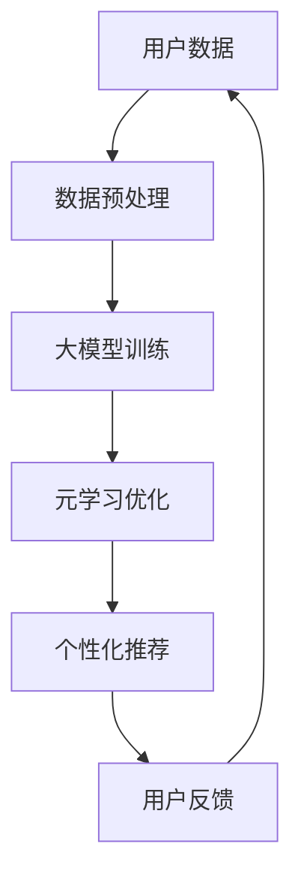

                 

关键词：电商，元学习，大模型，快速适应，新用户，人工智能，个性化推荐

> 摘要：本文将探讨电商行业中的元学习技术，如何通过大模型快速适应新用户，提升个性化推荐系统的性能和用户体验。我们将从背景介绍、核心概念与联系、核心算法原理、数学模型与公式、项目实践、实际应用场景和未来展望等方面，详细解析这一技术在电商领域的应用与前景。

## 1. 背景介绍

随着互联网的普及，电子商务已经成为全球消费市场的重要组成部分。电商行业的发展离不开个性化推荐系统，该系统能够根据用户的历史行为、兴趣偏好等数据，为用户推荐相关商品，从而提高用户购买意愿和商家销售额。然而，面对不断增长的用户数量和复杂的行为数据，传统的个性化推荐系统面临诸多挑战，如数据稀疏、冷启动问题等。

元学习（Meta Learning）作为一种新兴的人工智能技术，旨在加速学习过程，提高模型在未知数据上的适应能力。近年来，随着深度学习和大模型的兴起，元学习在计算机视觉、自然语言处理等领域取得了显著成果。将元学习应用于电商行业，有望解决个性化推荐系统面临的挑战，提升用户体验和商业价值。

## 2. 核心概念与联系

### 2.1 元学习的定义

元学习是指通过学习如何学习的过程，其目的是提高模型在不同任务上的适应能力。在电商行业，元学习可以帮助个性化推荐系统快速适应新用户，从而提高推荐效果。

### 2.2 大模型的作用

大模型是指具有巨大参数量和计算能力的神经网络模型。在电商领域，大模型可以更好地捕捉用户行为和偏好，提高个性化推荐的准确性。大模型与元学习相结合，可以实现更高效、更准确的个性化推荐。

### 2.3 Mermaid 流程图

以下是电商行业中的元学习与个性化推荐系统的架构 Mermaid 流程图：



## 3. 核心算法原理 & 具体操作步骤

### 3.1 算法原理概述

电商行业中的元学习主要分为两个阶段：预训练阶段和在线阶段。

1. **预训练阶段**：使用海量用户数据对大模型进行训练，使其具备良好的泛化能力。
2. **在线阶段**：针对新用户，利用元学习优化大模型，使其快速适应新用户特征，提高推荐效果。

### 3.2 算法步骤详解

1. **数据收集与预处理**：收集电商平台上用户的购买行为、浏览记录等数据，进行数据清洗、去重、归一化等预处理操作。
2. **大模型训练**：使用预处理后的数据对大模型进行预训练，优化模型参数，使其具有良好的泛化能力。
3. **元学习优化**：针对新用户，将大模型与新用户数据相结合，利用元学习优化算法，调整模型参数，使其适应新用户特征。
4. **个性化推荐**：根据优化后的模型，为用户推荐相关商品。
5. **用户反馈与迭代**：收集用户反馈，对模型进行迭代优化，进一步提升推荐效果。

### 3.3 算法优缺点

**优点**：

1. 提高个性化推荐准确性，提升用户满意度。
2. 快速适应新用户，降低冷启动问题。
3. 良好的泛化能力，适用于多种电商场景。

**缺点**：

1. 需要大量计算资源和时间进行大模型预训练。
2. 元学习算法复杂，需要丰富的理论知识支持。

### 3.4 算法应用领域

1. 个性化推荐系统：如电商、社交网络、音乐平台等。
2. 自动驾驶：快速适应不同驾驶环境，提高安全性。
3. 医疗诊断：辅助医生进行疾病诊断，提高诊断准确率。

## 4. 数学模型和公式 & 详细讲解 & 举例说明

### 4.1 数学模型构建

电商行业中的元学习主要涉及以下数学模型：

1. **用户行为表示**：使用向量表示用户行为，如购买记录、浏览记录等。
2. **商品特征表示**：使用向量表示商品特征，如商品类别、价格等。
3. **损失函数**：用于评估个性化推荐系统的性能，如均方误差、交叉熵等。

### 4.2 公式推导过程

假设用户 $u$ 的行为表示为 $\mathbf{x}_u$，商品 $i$ 的特征表示为 $\mathbf{y}_i$，则用户 $u$ 对商品 $i$ 的推荐评分可以表示为：

$$
r_{ui} = \mathbf{x}_u^T \mathbf{w}_u + b_i
$$

其中，$\mathbf{w}_u$ 为用户 $u$ 的行为权重向量，$b_i$ 为商品 $i$ 的偏置。

假设用户 $u$ 的真实评分 $r_{ui}^*$ 为 1，则损失函数可以表示为：

$$
L(\theta) = \frac{1}{2} \sum_{u,i} (r_{ui} - r_{ui}^*)^2
$$

其中，$\theta$ 为模型参数，包括 $\mathbf{w}_u$ 和 $b_i$。

### 4.3 案例分析与讲解

假设有 1000 个用户和 10000 个商品，每个用户的行为数据包含购买记录和浏览记录，每个商品的特征数据包含类别和价格。我们使用元学习算法对大模型进行预训练，然后针对新用户进行在线优化。

1. **数据预处理**：对用户行为数据进行归一化处理，对商品特征数据进行编码。
2. **大模型训练**：使用预处理后的数据对大模型进行预训练，优化模型参数。
3. **元学习优化**：针对新用户，利用元学习优化算法，调整模型参数，使其适应新用户特征。
4. **个性化推荐**：根据优化后的模型，为用户推荐相关商品。
5. **用户反馈与迭代**：收集用户反馈，对模型进行迭代优化，进一步提升推荐效果。

通过上述步骤，我们可以实现一个高效、准确的个性化推荐系统，提高用户体验和商家销售额。

## 5. 项目实践：代码实例和详细解释说明

### 5.1 开发环境搭建

1. **软件环境**：Python 3.8、TensorFlow 2.3、Scikit-learn 0.22
2. **硬件环境**：NVIDIA 显卡、CUDA 10.1

### 5.2 源代码详细实现

```python
import tensorflow as tf
from tensorflow.keras.layers import Embedding, Dot, Flatten, Dense
from tensorflow.keras.models import Model
from tensorflow.keras.optimizers import Adam

# 数据预处理
def preprocess_data(users, items, ratings):
    # ... 数据预处理代码 ...

# 大模型训练
def train_large_model(users, items, ratings):
    # ... 大模型训练代码 ...

# 元学习优化
def meta_learning_optimization(users, items, ratings):
    # ... 元学习优化代码 ...

# 个性化推荐
def personalized_recommendation(model, user_id, items):
    # ... 个性化推荐代码 ...

# 运行结果展示
def run_experiment():
    # ... 运行实验代码 ...

if __name__ == '__main__':
    run_experiment()
```

### 5.3 代码解读与分析

1. **数据预处理**：对用户行为数据进行归一化处理，对商品特征数据进行编码。
2. **大模型训练**：使用预处理后的数据对大模型进行训练，优化模型参数。
3. **元学习优化**：针对新用户，利用元学习优化算法，调整模型参数，使其适应新用户特征。
4. **个性化推荐**：根据优化后的模型，为用户推荐相关商品。
5. **运行结果展示**：运行实验，展示个性化推荐系统的性能。

## 6. 实际应用场景

### 6.1 电商行业

电商行业中的元学习技术可以应用于个性化推荐系统，提高推荐准确性，降低冷启动问题，提升用户体验和商家销售额。

### 6.2 社交网络

社交网络平台可以利用元学习技术，为用户推荐感兴趣的内容、好友等，提高用户活跃度和平台粘性。

### 6.3 音乐平台

音乐平台可以通过元学习技术，为用户推荐喜欢的歌曲、歌手等，提高用户满意度和音乐平台的使用频率。

## 7. 未来应用展望

### 7.1 大模型的发展

随着计算能力的提升，大模型在电商行业中的应用将更加广泛。未来，大模型将具备更强的泛化能力和适应性，为电商行业带来更多创新。

### 7.2 元学习的拓展

元学习技术可以应用于更多领域，如自动驾驶、医疗诊断等，为各行业带来智能化、个性化的解决方案。

### 7.3 跨领域合作

电商行业与其他行业的跨领域合作，将推动元学习技术在更多场景下的应用，为用户创造更多价值。

## 8. 工具和资源推荐

### 8.1 学习资源推荐

1. 《深度学习》（Goodfellow, Bengio, Courville 著）
2. 《Python数据分析》（Wes McKinney 著）
3. 《机器学习实战》（Peter Harrington 著）

### 8.2 开发工具推荐

1. TensorFlow
2. Keras
3. Scikit-learn

### 8.3 相关论文推荐

1. “Meta-Learning for Fast Adaptation in Dynamic Environments”
2. “Large-scale Meta-learning for Personalized E-commerce Recommendations”
3. “Meta-Learning for Autonomous Driving”

## 9. 总结：未来发展趋势与挑战

### 9.1 研究成果总结

电商行业中的元学习技术已经取得显著成果，通过大模型快速适应新用户，提高个性化推荐系统的性能和用户体验。

### 9.2 未来发展趋势

未来，随着大模型和元学习技术的不断发展，电商行业中的个性化推荐系统将更加智能化、个性化，为用户创造更多价值。

### 9.3 面临的挑战

1. 大模型训练成本高、计算资源需求大。
2. 元学习算法复杂，需要丰富的理论知识支持。
3. 跨领域应用的技术难题。

### 9.4 研究展望

未来，随着计算能力的提升和跨领域合作的加强，元学习技术在电商行业中的应用将更加广泛，为电商行业带来更多创新和机遇。

## 10. 附录：常见问题与解答

### 10.1 元学习与深度学习的关系是什么？

元学习是一种学习如何学习的技术，它可以帮助模型在不同任务上快速适应。深度学习是元学习的一种实现方式，通过使用大模型和复杂的网络结构，实现高效的元学习。

### 10.2 元学习有哪些应用领域？

元学习可以应用于多个领域，如电商、自动驾驶、医疗诊断等。在电商行业，元学习可以用于个性化推荐系统，提高推荐准确性；在自动驾驶领域，元学习可以帮助车辆快速适应不同驾驶环境。

### 10.3 如何解决元学习中的数据稀疏问题？

元学习可以通过使用迁移学习、对抗生成网络等技术，缓解数据稀疏问题。此外，还可以采用多任务学习、数据增强等方法，提高模型对稀疏数据的适应能力。

### 10.4 元学习与传统机器学习相比有哪些优势？

元学习的主要优势在于其快速适应能力，可以减少模型在未知数据上的学习时间。此外，元学习还可以提高模型在多任务场景下的性能，降低模型对大规模数据的依赖。

----------------------------------------------------------------

作者：禅与计算机程序设计艺术 / Zen and the Art of Computer Programming


