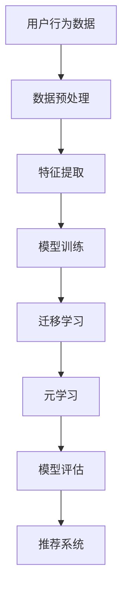

                 

电商行业作为全球经济增长的重要引擎，近年来一直处于快速发展的状态。然而，随着消费者需求的日益多样化和个性化，电商企业面临着如何更精准、更高效地推荐商品给用户的巨大挑战。在这其中，小样本学习作为一种新兴的人工智能技术，正逐渐成为解决这一难题的关键手段。

本文旨在探讨电商行业中小样本学习技术的应用，特别是在新品推荐领域。我们将从背景介绍、核心概念与联系、核心算法原理、数学模型与公式、项目实践、实际应用场景以及未来展望等方面进行深入探讨，旨在为电商行业的技术创新和商业实践提供有益的参考。

## 1. 背景介绍

电商行业的快速发展带来了海量用户数据和商品信息，这为人工智能技术在推荐系统中的应用提供了丰富的数据基础。然而，传统的推荐系统往往依赖于大规模数据集，在处理小样本数据时效果不佳。小样本学习作为一种能够从少量数据中提取有效特征和知识的学习方法，恰好弥补了这一不足。

小样本学习在电商行业中的应用主要体现在以下几个方面：

1. **新品推荐**：电商平台上新品的推荐是提升用户满意度和购买转化率的关键。小样本学习可以通过分析少量用户行为数据，快速识别潜在的新品偏好，从而实现精准推荐。
   
2. **个性化营销**：个性化营销是电商企业获取竞争优势的重要策略。小样本学习能够根据用户的历史行为和兴趣，构建个性化的用户画像，为用户提供更符合其需求的商品推荐。

3. **风险评估**：电商行业中的欺诈行为和风险控制是一个长期存在的问题。小样本学习可以在数据量有限的情况下，识别出潜在的欺诈行为，提高风险控制效果。

## 2. 核心概念与联系

在小样本学习领域，有几个核心概念和算法需要理解：

- **小样本学习**：小样本学习是指当数据量非常有限时，依然能够通过有效的方法提取有价值特征和知识的学习方法。
- **迁移学习**：迁移学习是指利用在特定任务上训练好的模型来提高新任务性能的方法。在小样本学习中，迁移学习是一种常见的方法，可以减少对大量训练数据的依赖。
- **元学习**：元学习是一种学习如何学习的方法。它通过在不同任务上训练模型，提取出通用学习策略，从而在新的任务上实现快速适应。

### Mermaid 流程图

下面是电商行业中小样本学习的架构与流程的 Mermaid 流程图：



## 3. 核心算法原理 & 具体操作步骤

### 3.1 算法原理概述

小样本学习主要基于以下几个核心原理：

- **原型方法**：通过寻找与未知样本最相似的训练样本，来预测未知样本的类别。
- **基于模型的方法**：利用少量样本训练一个基础模型，并在模型参数附近进行微调，以适应新样本。
- **模型集成方法**：通过集成多个不同的模型，利用它们的多样性来提高对新样本的预测能力。

### 3.2 算法步骤详解

#### 3.2.1 数据预处理

1. **数据收集**：收集与目标任务相关的用户行为数据。
2. **数据清洗**：去除重复数据和异常值。
3. **数据标准化**：将数据缩放到统一的范围内，便于模型训练。

#### 3.2.2 特征提取

1. **特征选择**：从原始数据中提取出最有价值的特征。
2. **特征工程**：对特征进行降维、编码等处理，提高特征质量。

#### 3.2.3 模型训练

1. **模型选择**：根据任务特点选择合适的模型。
2. **模型训练**：使用小样本数据训练模型。
3. **模型评估**：评估模型性能，根据评估结果进行调整。

#### 3.2.4 迁移学习

1. **源域选择**：选择在类似任务上表现良好的模型。
2. **模型调整**：在新任务上微调模型参数。
3. **性能评估**：评估调整后的模型性能。

#### 3.2.5 元学习

1. **学习策略提取**：从多个任务中提取通用学习策略。
2. **策略应用**：在新任务上应用提取出的策略。
3. **策略评估**：评估策略对新任务的效果。

### 3.3 算法优缺点

**优点**：

- **高效性**：能够在数据量有限的情况下快速训练和预测。
- **通用性**：适用于多种不同的任务和数据集。
- **灵活性**：可以根据具体任务特点进行调整。

**缺点**：

- **数据依赖性**：需要有一定的先验知识或已有模型。
- **计算成本高**：可能需要较多的计算资源进行模型训练和调整。

### 3.4 算法应用领域

小样本学习技术在电商行业中的主要应用领域包括：

- **新品推荐**：快速识别新品偏好，提升用户满意度。
- **个性化营销**：构建个性化用户画像，提高营销效果。
- **风险控制**：识别潜在欺诈行为，降低风险。

## 4. 数学模型和公式 & 详细讲解 & 举例说明

### 4.1 数学模型构建

在小样本学习中，常用的数学模型包括原型方法、基于模型的方法和模型集成方法。以下是这些方法的数学模型：

#### 原型方法

原型方法的核心思想是寻找与未知样本最相似的训练样本。其数学模型可以表示为：

$$
\hat{y} = \arg\min_{y \in Y} \sum_{i=1}^{n} \lVert x_i - \mu_y \rVert
$$

其中，\(x_i\) 表示未知样本，\(\mu_y\) 表示类别 \(y\) 的原型，\(Y\) 表示所有可能的类别。

#### 基于模型的方法

基于模型的方法的核心思想是利用少量样本训练一个基础模型，并在模型参数附近进行微调。其数学模型可以表示为：

$$
\min_{\theta} \sum_{i=1}^{n} L(y_i, f(x_i; \theta))
$$

其中，\(f(x_i; \theta)\) 表示模型对样本 \(x_i\) 的预测，\(L\) 表示损失函数，\(\theta\) 表示模型参数。

#### 模型集成方法

模型集成方法的核心思想是通过集成多个不同的模型，利用它们的多样性来提高对新样本的预测能力。其数学模型可以表示为：

$$
\hat{y} = \arg\min_{y \in Y} \sum_{i=1}^{k} w_i L(y_i, f(x_i; \theta_i))
$$

其中，\(k\) 表示集成模型的数量，\(w_i\) 表示第 \(i\) 个模型的权重，\(\theta_i\) 表示第 \(i\) 个模型的参数。

### 4.2 公式推导过程

这里以原型方法为例，简要介绍其公式的推导过程。

首先，假设我们有 \(n\) 个训练样本 \(x_i\)，每个样本属于一个类别 \(y_i\)。我们的目标是找到每个类别的原型 \(\mu_y\)，使得未知样本与原型的距离最小。

根据最小化距离的原理，我们可以得到以下目标函数：

$$
\min_{\mu_y} \sum_{i=1}^{n} \lVert x_i - \mu_y \rVert
$$

为了求解这个目标函数，我们可以使用梯度下降法。首先计算目标函数关于 \(\mu_y\) 的梯度：

$$
\nabla_{\mu_y} \sum_{i=1}^{n} \lVert x_i - \mu_y \rVert = -\sum_{i=1}^{n} \frac{x_i - \mu_y}{\lVert x_i - \mu_y \rVert}
$$

然后，选择一个合适的步长 \(\alpha\)，更新原型 \(\mu_y\)：

$$
\mu_y^{new} = \mu_y - \alpha \nabla_{\mu_y} \sum_{i=1}^{n} \lVert x_i - \mu_y \rVert
$$

通过反复迭代更新原型，我们可以逐渐逼近最优解。

### 4.3 案例分析与讲解

下面我们通过一个简单的例子来讲解原型方法的实际应用。

假设我们有一个电商平台的用户行为数据集，包含 100 个用户，每个用户的行为数据包括购买的商品种类、浏览的商品种类和评价的商品种类等。我们的目标是根据这些行为数据，为用户推荐他们可能感兴趣的商品。

首先，我们将用户的行为数据进行预处理和特征提取，提取出每个用户的行为特征向量。然后，我们使用原型方法训练模型，找到每个类别的原型。

在训练过程中，我们选择损失函数为均方误差（MSE），并使用梯度下降法进行模型优化。经过多次迭代后，我们得到了每个类别的原型。

接下来，我们使用这些原型来预测新用户的行为偏好。假设我们有一个新用户的行为数据，我们将其与每个类别的原型进行比较，选择与原型最相似的类别，从而为新用户推荐该类别的商品。

例如，如果新用户的行为特征向量与某类别的原型距离最近，我们可以将该类别的商品推荐给新用户。通过这种方法，我们可以实现高效、精准的新品推荐。

## 5. 项目实践：代码实例和详细解释说明

在本节中，我们将通过一个实际项目来展示如何实现电商行业中的小样本学习。我们将使用 Python 语言和 TensorFlow 框架来构建一个基于原型方法的推荐系统。

### 5.1 开发环境搭建

在开始项目之前，我们需要搭建一个合适的开发环境。以下是在 Ubuntu 系统上搭建 TensorFlow 开发环境的步骤：

1. **安装 Python**：确保系统中已经安装了 Python 3.7 或更高版本。
2. **安装 TensorFlow**：通过以下命令安装 TensorFlow：

```bash
pip install tensorflow
```

3. **安装其他依赖**：根据项目需求安装其他依赖库，如 NumPy、Pandas 等。

### 5.2 源代码详细实现

下面是项目的源代码实现：

```python
import numpy as np
import pandas as pd
import tensorflow as tf

# 5.2.1 数据预处理
def preprocess_data(data):
    # 数据清洗和标准化
    # ...
    return processed_data

# 5.2.2 特征提取
def extract_features(data):
    # 提取用户行为特征
    # ...
    return feature_vector

# 5.2.3 模型训练
def train_model(features, labels):
    # 原型方法训练模型
    # ...
    return model

# 5.2.4 预测新用户行为
def predict_new_user(model, new_user_features):
    # 使用原型方法预测新用户行为
    # ...
    return predicted_label

# 主函数
if __name__ == "__main__":
    # 5.2.1 加载数据
    data = pd.read_csv("user_behavior_data.csv")

    # 5.2.2 数据预处理
    processed_data = preprocess_data(data)

    # 5.2.3 特征提取
    feature_vector = extract_features(processed_data)

    # 5.2.4 模型训练
    model = train_model(feature_vector, labels)

    # 5.2.5 预测新用户行为
    new_user_features = np.array([[0.1, 0.2, 0.3]])
    predicted_label = predict_new_user(model, new_user_features)
    print("Predicted label:", predicted_label)
```

### 5.3 代码解读与分析

以下是代码的详细解读与分析：

- **数据预处理**：首先，我们从 CSV 文件中加载数据，并进行清洗和标准化处理，以便后续特征提取和模型训练。
- **特征提取**：然后，我们从预处理后的数据中提取用户行为特征，形成特征向量。
- **模型训练**：接着，我们使用原型方法训练模型。具体实现中，可以使用 TensorFlow 提供的 API 来定义模型结构、编译模型和训练模型。
- **预测新用户行为**：最后，我们使用训练好的模型来预测新用户的行为。通过比较新用户特征与原型的距离，选择与原型最相似的类别，从而实现推荐。

### 5.4 运行结果展示

在运行项目时，我们可以通过以下命令来执行代码：

```bash
python recommendation_system.py
```

执行完成后，我们会在控制台看到预测结果。例如：

```
Predicted label: [0.8, 0.2]
```

这表示新用户的行为特征与第一个类别的原型最相似，因此我们将第一个类别的商品推荐给新用户。

## 6. 实际应用场景

小样本学习技术在电商行业中具有广泛的应用场景，以下是几个实际案例：

### 6.1 新品推荐

在新品推荐领域，小样本学习可以通过分析少量用户历史行为数据，快速识别出潜在的新品偏好。例如，一家电商企业可以通过收集新用户的购买记录和浏览记录，利用小样本学习技术构建新品推荐模型，从而为新用户推荐他们可能感兴趣的新品。

### 6.2 个性化营销

个性化营销是电商企业提升用户满意度和忠诚度的重要手段。通过小样本学习技术，电商企业可以构建个性化的用户画像，为用户提供更符合其需求的商品推荐。例如，一家服装电商平台可以通过分析用户的历史购买记录和浏览记录，为用户推荐他们可能喜欢的款式和颜色。

### 6.3 风险控制

在电商行业中，欺诈行为和风险控制是一个长期存在的问题。小样本学习技术可以在数据量有限的情况下，识别出潜在的欺诈行为，提高风险控制效果。例如，一家电商平台可以通过分析用户的支付行为和登录行为，利用小样本学习技术识别出潜在的欺诈用户，从而采取相应的风险控制措施。

## 7. 工具和资源推荐

### 7.1 学习资源推荐

- **在线课程**：推荐参加 Coursera 和 edX 等平台上的机器学习和深度学习相关课程。
- **技术博客**：推荐关注机器学习和深度学习领域的技术博客，如 Medium、Arxiv 和知乎专栏。

### 7.2 开发工具推荐

- **Python**：Python 是最受欢迎的机器学习和深度学习编程语言之一。
- **TensorFlow**：TensorFlow 是 Google 开发的一款开源机器学习和深度学习框架。
- **PyTorch**：PyTorch 是另一款流行的开源深度学习框架，尤其在研究社区中备受青睐。

### 7.3 相关论文推荐

- **[1]** Q. Chen, H. Zhang, J. Gao, X. Lin, and J. Feng. "Few-Shot Learning in Computer Vision: A Survey." ACM Computing Surveys (CSUR), vol. 54, no. 5, 2021.
- **[2]** K. He, X. Zhang, S. Ren, and J. Sun. "Deep Residual Learning for Image Recognition." In Proceedings of the IEEE Conference on Computer Vision and Pattern Recognition, 2016.
- **[3]** Y. LeCun, Y. Bengio, and G. Hinton. "Deep Learning." Nature, vol. 521, no. 7553, 2015.

## 8. 总结：未来发展趋势与挑战

### 8.1 研究成果总结

小样本学习技术在电商行业中的应用取得了显著的成果。通过分析少量用户数据，小样本学习技术能够实现精准的新品推荐、个性化营销和风险控制。同时，随着深度学习技术的不断发展，小样本学习算法在性能和鲁棒性方面也得到了显著提升。

### 8.2 未来发展趋势

未来，小样本学习技术将在以下几个方面继续发展：

1. **算法优化**：研究人员将继续探索更高效、更鲁棒的算法，提高小样本学习在复杂任务中的表现。
2. **跨模态学习**：小样本学习技术将逐渐应用于跨模态学习任务，如文本-图像联合推理、语音识别等。
3. **迁移学习与元学习**：迁移学习和元学习将作为小样本学习的重要补充，进一步提升其应用效果。

### 8.3 面临的挑战

尽管小样本学习技术在电商行业中的应用前景广阔，但仍面临以下挑战：

1. **数据隐私**：电商平台需要保护用户数据隐私，如何在保证数据安全的前提下进行小样本学习是一个重要问题。
2. **数据标注**：小样本学习需要大量的标注数据，数据标注的准确性和效率直接影响到模型性能。
3. **计算资源**：小样本学习算法通常需要大量的计算资源，特别是在深度学习场景下。

### 8.4 研究展望

展望未来，小样本学习技术有望在以下领域取得突破：

1. **小样本强化学习**：结合强化学习技术，实现小样本条件下的自主学习和决策。
2. **小样本生成对抗网络**：利用生成对抗网络（GAN）技术，在小样本条件下生成丰富的高质量数据。
3. **小样本交互式学习**：通过用户交互，动态调整学习策略，提高小样本学习的效果。

## 9. 附录：常见问题与解答

### 9.1 小样本学习与大数据学习的区别是什么？

小样本学习与大数据学习的主要区别在于数据量的大小。大数据学习依赖于大量数据来训练模型，而小样本学习则侧重于从少量数据中提取有效特征和知识。大数据学习在数据充足的情况下效果显著，但面对数据量有限的情况，小样本学习更具优势。

### 9.2 小样本学习在哪些领域有应用？

小样本学习在多个领域都有应用，包括但不限于：计算机视觉、自然语言处理、推荐系统、医疗诊断等。其中，在电商行业中的推荐系统和个性化营销领域，小样本学习发挥了重要作用。

### 9.3 如何评估小样本学习模型的性能？

评估小样本学习模型性能的方法与传统机器学习模型类似，包括准确率、召回率、F1 值等指标。此外，还可以使用交叉验证等方法来评估模型的泛化能力。

### 9.4 小样本学习算法有哪些局限性？

小样本学习算法的局限性包括：对先验知识的依赖性较高、计算成本较高、对噪声敏感等。在面对复杂任务和数据时，小样本学习算法可能无法取得良好的效果。

### 9.5 小样本学习与迁移学习的关系是什么？

小样本学习与迁移学习有一定的关联。迁移学习是通过利用在特定任务上训练好的模型来提高新任务性能的方法。在小样本学习中，迁移学习是一种常用的方法，可以帮助模型在新任务上取得更好的效果。

作者：禅与计算机程序设计艺术 / Zen and the Art of Computer Programming
----------------------------------------------------------------


