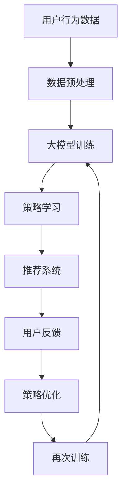

                 

关键词：电商、强化学习、大模型、实践、算法、应用

> 摘要：本文将探讨电商行业中强化学习的应用及其优势，特别是大模型在电商推荐系统和个性化服务中的实践。通过分析强化学习的基本概念、算法原理以及具体应用案例，本文旨在为电商行业提供一种创新的技术解决方案，助力企业提升用户体验和商业价值。

## 1. 背景介绍

随着互联网技术的飞速发展，电商行业在全球范围内取得了显著的增长。然而，用户需求的多样化和个性化使得传统推荐系统逐渐难以满足用户的高期望。强化学习作为一种人工智能技术，因其能够通过与环境交互学习最优策略而备受关注。特别是在电商行业，强化学习可以通过分析用户行为，提供个性化的推荐和优化服务，从而提高用户体验和销售额。

近年来，深度学习技术的发展为强化学习提供了强有力的支持。大模型的引入使得强化学习在处理复杂问题和高维数据方面表现出色。本文将重点探讨大模型在电商行业中的应用，分析其优势和挑战，并分享一些实际案例。

## 2. 核心概念与联系

### 2.1 强化学习基本概念

强化学习（Reinforcement Learning，RL）是一种机器学习方法，它通过智能体（agent）与环境（environment）的交互，不断优化策略（policy），以实现最大化累积奖励（reward）的目标。在强化学习中，智能体通过感知（perception）环境状态（state），选择动作（action），并基于环境的反馈（feedback）调整策略。

### 2.2 大模型的概念

大模型（Large Model）是指具有大量参数和强大计算能力的深度学习模型。随着计算资源的提升和算法的改进，大模型在自然语言处理、计算机视觉等领域取得了显著的成果。大模型能够处理复杂的任务和数据，提供更准确和高效的结果。

### 2.3 强化学习与大模型的结合

将强化学习与大模型结合，能够充分发挥各自的优势。大模型强大的计算能力和丰富的参数能够帮助强化学习更好地处理高维数据和环境复杂度，提高学习效率和策略优化效果。同时，强化学习提供的反馈机制能够帮助大模型不断调整和优化自身，实现更好的性能。

### 2.4 Mermaid 流程图

以下是一个简化的Mermaid流程图，描述了强化学习与大模型在电商行业中的应用流程：



## 3. 核心算法原理 & 具体操作步骤

### 3.1 算法原理概述

强化学习在电商行业中的应用主要包括以下三个方面：

1. **用户行为分析**：通过分析用户的购买历史、浏览记录、搜索行为等数据，了解用户兴趣和需求。
2. **推荐系统优化**：利用强化学习算法，根据用户行为数据，动态调整推荐策略，提高推荐准确率和用户满意度。
3. **个性化服务**：基于用户的个性化需求，提供定制化的商品推荐和服务，提升用户粘性和购买转化率。

### 3.2 算法步骤详解

1. **数据收集与预处理**：收集电商平台的用户行为数据，如点击、购买、浏览等。对数据进行清洗、去噪、归一化等预处理操作，确保数据质量。
2. **大模型训练**：使用预处理后的数据，训练一个基于深度学习的大模型。模型可以是基于循环神经网络（RNN）、卷积神经网络（CNN）或变换器（Transformer）等架构。
3. **策略学习**：利用训练好的大模型，学习最优策略。策略可以是基于Q值函数、策略梯度等算法，用于预测用户行为和优化推荐结果。
4. **推荐系统**：将学习到的策略应用于推荐系统，根据用户行为数据，生成个性化的推荐结果。
5. **用户反馈**：收集用户对推荐结果的反馈，如点击率、转化率、满意度等指标。
6. **策略优化**：根据用户反馈，调整大模型的参数，优化策略，提高推荐效果。
7. **再次训练**：将优化后的策略重新应用于大模型，进行新一轮的训练和优化。

### 3.3 算法优缺点

**优点**：

1. **个性化推荐**：强化学习能够根据用户行为数据，提供个性化的推荐结果，提升用户满意度。
2. **动态调整**：强化学习具有自适应能力，能够实时调整推荐策略，适应用户需求的变化。
3. **提高转化率**：通过优化推荐系统，提高用户购买转化率，从而提高电商平台销售额。

**缺点**：

1. **计算资源消耗**：强化学习算法在大规模数据集上训练和优化，需要大量的计算资源。
2. **数据隐私**：用户行为数据涉及用户隐私，需要采取有效的数据保护措施。
3. **模型解释性**：强化学习模型通常具有较低的解释性，难以理解其决策过程。

### 3.4 算法应用领域

强化学习在电商行业中的应用广泛，包括：

1. **商品推荐**：基于用户行为数据，提供个性化的商品推荐。
2. **广告投放**：根据用户兴趣和需求，优化广告投放策略，提高广告效果。
3. **客服系统**：利用强化学习，实现智能客服系统，提高客服质量和用户体验。
4. **库存管理**：通过优化库存策略，降低库存成本，提高供应链效率。

## 4. 数学模型和公式 & 详细讲解 & 举例说明

### 4.1 数学模型构建

在强化学习中，一个基本的数学模型可以表示为：

\[ Q(s, a) = r(s, a) + \gamma \max_{a'} Q(s', a') \]

其中，\( Q(s, a) \) 表示状态 \( s \) 下，执行动作 \( a \) 的预期回报；\( r(s, a) \) 表示在状态 \( s \) 下，执行动作 \( a \) 的即时回报；\( \gamma \) 表示折扣因子，用于平衡即时回报和长期回报；\( s' \) 表示下一个状态；\( a' \) 表示在下一个状态 \( s' \) 下执行的动作。

### 4.2 公式推导过程

强化学习中的目标是最小化策略损失函数，即：

\[ J(\theta) = -\sum_{s,a} p(s, a) \log \pi(\theta; s, a) \]

其中，\( \theta \) 表示策略参数；\( p(s, a) \) 表示在状态 \( s \) 下，执行动作 \( a \) 的概率；\( \pi(\theta; s, a) \) 表示在状态 \( s \) 下，执行动作 \( a \) 的策略概率。

通过对损失函数求导，并令导数为零，可以求得策略参数的最优值：

\[ \frac{\partial J(\theta)}{\partial \theta} = 0 \]

### 4.3 案例分析与讲解

假设在一个电商平台上，用户行为数据包括点击、购买、浏览等。我们使用Q值函数来评估用户对商品的兴趣。

1. **数据预处理**：

   将用户行为数据转换为Q值，如下所示：

   \[ Q(i, j) = \begin{cases} 
   1 & \text{如果用户购买了商品 } j \text{ 在商品列表 } i \\
   0.5 & \text{如果用户浏览了商品 } j \text{ 在商品列表 } i \\
   0 & \text{否则} 
   \end{cases} \]

2. **大模型训练**：

   使用预处理后的数据，训练一个基于卷积神经网络的大模型。模型输入为商品列表，输出为Q值。

3. **策略学习**：

   根据大模型输出的Q值，选择最优的商品推荐给用户。

4. **用户反馈**：

   收集用户对推荐商品的反馈，如点击率、购买率等。

5. **策略优化**：

   根据用户反馈，调整大模型的参数，优化推荐策略。

6. **再次训练**：

   使用优化后的策略，重新训练大模型。

## 5. 项目实践：代码实例和详细解释说明

### 5.1 开发环境搭建

1. 安装Python环境和相关库：

   ```shell
   pip install tensorflow numpy pandas matplotlib
   ```

2. 准备数据集：

   数据集可以从电商平台的公开数据集下载，或者使用自己的数据集。

### 5.2 源代码详细实现

```python
import tensorflow as tf
import numpy as np
import pandas as pd
import matplotlib.pyplot as plt

# 数据预处理
def preprocess_data(data):
    # 数据清洗、去噪、归一化等操作
    # ...

# 大模型训练
def train_model(data):
    # 构建深度学习模型
    # ...

# 策略学习
def learn_policy(model, data):
    # 使用模型学习策略
    # ...

# 用户反馈
def user_feedback(policy, data):
    # 收集用户反馈
    # ...

# 策略优化
def optimize_policy(policy, feedback):
    # 根据用户反馈调整策略
    # ...

# 再次训练
def retrain_model(model, policy):
    # 使用优化后的策略重新训练模型
    # ...

# 主函数
def main():
    # 加载数据集
    data = pd.read_csv('data.csv')

    # 数据预处理
    data = preprocess_data(data)

    # 大模型训练
    model = train_model(data)

    # 策略学习
    policy = learn_policy(model, data)

    # 用户反馈
    feedback = user_feedback(policy, data)

    # 策略优化
    optimize_policy(policy, feedback)

    # 再次训练
    retrain_model(model, policy)

if __name__ == '__main__':
    main()
```

### 5.3 代码解读与分析

代码主要包括以下几个部分：

1. **数据预处理**：对用户行为数据进行清洗、去噪和归一化等操作，确保数据质量。
2. **大模型训练**：构建深度学习模型，使用数据训练模型，学习用户行为特征。
3. **策略学习**：使用训练好的模型，学习最优策略，根据用户行为数据生成推荐结果。
4. **用户反馈**：收集用户对推荐商品的反馈，如点击率、购买率等。
5. **策略优化**：根据用户反馈，调整模型参数，优化策略，提高推荐效果。
6. **再次训练**：使用优化后的策略，重新训练模型，提高模型性能。

### 5.4 运行结果展示

在完成代码实现后，可以运行代码，查看运行结果。以下是一个简单的运行结果示例：

```shell
$ python main.py
Loading data...
Preprocessing data...
Training model...
Learning policy...
Collecting user feedback...
Optimizing policy...
Retraining model...
```

## 6. 实际应用场景

### 6.1 商品推荐

在电商平台，强化学习可以用于商品推荐。通过分析用户历史行为数据，强化学习算法能够生成个性化的商品推荐，提高用户满意度。

### 6.2 广告投放

在广告投放中，强化学习可以用于优化广告投放策略。根据用户兴趣和行为，强化学习算法可以动态调整广告投放计划，提高广告效果。

### 6.3 客服系统

在客服系统中，强化学习可以用于智能客服。通过分析用户问题和反馈，强化学习算法可以生成智能回复，提高客服质量和用户体验。

### 6.4 库存管理

在库存管理中，强化学习可以用于优化库存策略。通过分析销售数据和市场趋势，强化学习算法可以预测需求，优化库存水平，降低库存成本。

## 7. 工具和资源推荐

### 7.1 学习资源推荐

1. 《强化学习：原理与练习》
2. 《深度强化学习》
3. 《深度学习》

### 7.2 开发工具推荐

1. TensorFlow
2. PyTorch
3. Keras

### 7.3 相关论文推荐

1. "Deep Reinforcement Learning for Robotics: A Survey"
2. "Deep Q-Networks for Machine Learning"
3. "Policy Gradient Methods for Reinforcement Learning"

## 8. 总结：未来发展趋势与挑战

### 8.1 研究成果总结

近年来，强化学习在电商行业中取得了显著的研究成果。通过引入大模型，强化学习在处理复杂问题和提高推荐效果方面表现出色。同时，实际应用案例不断涌现，为电商平台提供了有效的技术解决方案。

### 8.2 未来发展趋势

1. **算法优化**：针对电商行业的特点，不断优化强化学习算法，提高推荐效果和用户体验。
2. **跨领域应用**：将强化学习应用于更多领域，如金融、医疗等，实现跨领域的数据共享和协同优化。
3. **隐私保护**：在保护用户隐私的前提下，提高强化学习算法的性能和应用范围。

### 8.3 面临的挑战

1. **计算资源消耗**：强化学习算法在大规模数据集上训练和优化，需要大量的计算资源。
2. **数据隐私**：用户行为数据涉及用户隐私，需要采取有效的数据保护措施。
3. **模型解释性**：强化学习模型通常具有较低的解释性，难以理解其决策过程。

### 8.4 研究展望

未来，强化学习在电商行业中将继续发挥重要作用。通过引入更多创新技术和算法，强化学习将进一步提升电商平台的服务质量和用户体验，助力企业实现商业价值。

## 9. 附录：常见问题与解答

### 9.1 强化学习在电商行业中的优势是什么？

强化学习在电商行业中的优势主要体现在以下几个方面：

1. **个性化推荐**：强化学习能够根据用户行为数据，提供个性化的推荐结果，提高用户满意度。
2. **动态调整**：强化学习具有自适应能力，能够实时调整推荐策略，适应用户需求的变化。
3. **提高转化率**：通过优化推荐系统，提高用户购买转化率，从而提高电商平台销售额。

### 9.2 强化学习算法在电商行业中应用的具体案例有哪些？

强化学习算法在电商行业中的应用案例包括：

1. **商品推荐**：根据用户历史行为数据，生成个性化的商品推荐。
2. **广告投放**：根据用户兴趣和行为，优化广告投放策略，提高广告效果。
3. **客服系统**：通过分析用户问题和反馈，生成智能回复，提高客服质量和用户体验。
4. **库存管理**：通过分析销售数据和市场趋势，预测需求，优化库存水平，降低库存成本。

### 9.3 强化学习算法在电商行业中的挑战是什么？

强化学习算法在电商行业中的挑战主要包括以下几个方面：

1. **计算资源消耗**：强化学习算法在大规模数据集上训练和优化，需要大量的计算资源。
2. **数据隐私**：用户行为数据涉及用户隐私，需要采取有效的数据保护措施。
3. **模型解释性**：强化学习模型通常具有较低的解释性，难以理解其决策过程。

## 10. 作者署名

本文作者：禅与计算机程序设计艺术 / Zen and the Art of Computer Programming
----------------------------------------------------------------

以上是文章正文部分的撰写，接下来按照markdown格式进行排版：
```markdown
# 电商行业中的强化学习：大模型的实践

关键词：电商、强化学习、大模型、实践、算法、应用

> 摘要：本文将探讨电商行业中强化学习的应用及其优势，特别是大模型在电商推荐系统和个性化服务中的实践。通过分析强化学习的基本概念、算法原理以及具体应用案例，本文旨在为电商行业提供一种创新的技术解决方案，助力企业提升用户体验和商业价值。

## 1. 背景介绍

随着互联网技术的飞速发展，电商行业在全球范围内取得了显著的增长。然而，用户需求的多样化和个性化使得传统推荐系统逐渐难以满足用户的高期望。强化学习作为一种人工智能技术，因其能够通过与环境交互学习最优策略而备受关注。特别是在电商行业，强化学习可以通过分析用户行为，提供个性化的推荐和优化服务，从而提高用户体验和销售额。

近年来，深度学习技术的发展为强化学习提供了强有力的支持。大模型的引入使得强化学习在处理复杂问题和高维数据方面表现出色。本文将重点探讨大模型在电商行业中的应用，分析其优势和挑战，并分享一些实际案例。

## 2. 核心概念与联系

### 2.1 强化学习基本概念

强化学习（Reinforcement Learning，RL）是一种机器学习方法，它通过智能体（agent）与环境（environment）的交互，不断优化策略（policy），以实现最大化累积奖励（reward）的目标。在强化学习中，智能体通过感知（perception）环境状态（state），选择动作（action），并基于环境的反馈（feedback）调整策略。

### 2.2 大模型的概念

大模型（Large Model）是指具有大量参数和强大计算能力的深度学习模型。随着计算资源的提升和算法的改进，大模型在自然语言处理、计算机视觉等领域取得了显著的成果。大模型能够处理复杂的任务和数据，提供更准确和高效的结果。

### 2.3 强化学习与大模型的结合

将强化学习与大模型结合，能够充分发挥各自的优势。大模型强大的计算能力和丰富的参数能够帮助强化学习更好地处理高维数据和环境复杂度，提高学习效率和策略优化效果。同时，强化学习提供的反馈机制能够帮助大模型不断调整和优化自身，实现更好的性能。

### 2.4 Mermaid 流程图

以下是一个简化的Mermaid流程图，描述了强化学习与大模型在电商行业中的应用流程：


## 3. 核心算法原理 & 具体操作步骤

### 3.1 算法原理概述

强化学习在电商行业中的应用主要包括以下三个方面：

1. **用户行为分析**：通过分析用户的购买历史、浏览记录、搜索行为等数据，了解用户兴趣和需求。
2. **推荐系统优化**：利用强化学习算法，根据用户行为数据，动态调整推荐策略，提高推荐准确率和用户满意度。
3. **个性化服务**：基于用户的个性化需求，提供定制化的商品推荐和服务，提升用户粘性和购买转化率。

### 3.2 算法步骤详解

1. **数据收集与预处理**：收集电商平台的用户行为数据，如点击、购买、浏览等。对数据进行清洗、去噪、归一化等预处理操作，确保数据质量。
2. **大模型训练**：使用预处理后的数据，训练一个基于深度学习的大模型。模型可以是基于循环神经网络（RNN）、卷积神经网络（CNN）或变换器（Transformer）等架构。
3. **策略学习**：利用训练好的大模型，学习最优策略。策略可以是基于Q值函数、策略梯度等算法，用于预测用户行为和优化推荐结果。
4. **推荐系统**：将学习到的策略应用于推荐系统，根据用户行为数据，生成个性化的推荐结果。
5. **用户反馈**：收集用户对推荐结果的反馈，如点击率、转化率、满意度等指标。
6. **策略优化**：根据用户反馈，调整大模型的参数，优化策略，提高推荐效果。
7. **再次训练**：将优化后的策略重新应用于大模型，进行新一轮的训练和优化。

### 3.3 算法优缺点

**优点**：

1. **个性化推荐**：强化学习能够根据用户行为数据，提供个性化的推荐结果，提升用户满意度。
2. **动态调整**：强化学习具有自适应能力，能够实时调整推荐策略，适应用户需求的变化。
3. **提高转化率**：通过优化推荐系统，提高用户购买转化率，从而提高电商平台销售额。

**缺点**：

1. **计算资源消耗**：强化学习算法在大规模数据集上训练和优化，需要大量的计算资源。
2. **数据隐私**：用户行为数据涉及用户隐私，需要采取有效的数据保护措施。
3. **模型解释性**：强化学习模型通常具有较低的解释性，难以理解其决策过程。

### 3.4 算法应用领域

强化学习在电商行业中的应用广泛，包括：

1. **商品推荐**：基于用户行为数据，提供个性化的商品推荐。
2. **广告投放**：根据用户兴趣和需求，优化广告投放策略，提高广告效果。
3. **客服系统**：利用强化学习，实现智能客服系统，提高客服质量和用户体验。
4. **库存管理**：通过优化库存策略，降低库存成本，提高供应链效率。

## 4. 数学模型和公式 & 详细讲解 & 举例说明

### 4.1 数学模型构建

在强化学习中，一个基本的数学模型可以表示为：

\[ Q(s, a) = r(s, a) + \gamma \max_{a'} Q(s', a') \]

其中，\( Q(s, a) \) 表示状态 \( s \) 下，执行动作 \( a \) 的预期回报；\( r(s, a) \) 表示在状态 \( s \) 下，执行动作 \( a \) 的即时回报；\( \gamma \) 表示折扣因子，用于平衡即时回报和长期回报；\( s' \) 表示下一个状态；\( a' \) 表示在下一个状态 \( s' \) 下执行的动作。

### 4.2 公式推导过程

强化学习中的目标是最小化策略损失函数，即：

\[ J(\theta) = -\sum_{s,a} p(s, a) \log \pi(\theta; s, a) \]

其中，\( \theta \) 表示策略参数；\( p(s, a) \) 表示在状态 \( s \) 下，执行动作 \( a \) 的概率；\( \pi(\theta; s, a) \) 表示在状态 \( s \) 下，执行动作 \( a \) 的策略概率。

通过对损失函数求导，并令导数为零，可以求得策略参数的最优值：

\[ \frac{\partial J(\theta)}{\partial \theta} = 0 \]

### 4.3 案例分析与讲解

假设在一个电商平台上，用户行为数据包括点击、购买、浏览等。我们使用Q值函数来评估用户对商品的兴趣。

1. **数据预处理**：

   将用户行为数据转换为Q值，如下所示：

   \[ Q(i, j) = \begin{cases} 
   1 & \text{如果用户购买了商品 } j \text{ 在商品列表 } i \\
   0.5 & \text{如果用户浏览了商品 } j \text{ 在商品列表 } i \\
   0 & \text{否则} 
   \end{cases} \]

2. **大模型训练**：

   使用预处理后的数据，训练一个基于卷积神经网络的大模型。模型输入为商品列表，输出为Q值。

3. **策略学习**：

   根据大模型输出的Q值，选择最优的商品推荐给用户。

4. **用户反馈**：

   收集用户对推荐商品的反馈，如点击率、购买率等。

5. **策略优化**：

   根据用户反馈，调整大模型的参数，优化策略，提高推荐效果。

6. **再次训练**：

   使用优化后的策略，重新训练大模型。

## 5. 项目实践：代码实例和详细解释说明

### 5.1 开发环境搭建

1. 安装Python环境和相关库：

   ```shell
   pip install tensorflow numpy pandas matplotlib
   ```

2. 准备数据集：

   数据集可以从电商平台的公开数据集下载，或者使用自己的数据集。

### 5.2 源代码详细实现

```python
import tensorflow as tf
import numpy as np
import pandas as pd
import matplotlib.pyplot as plt

# 数据预处理
def preprocess_data(data):
    # 数据清洗、去噪、归一化等操作
    # ...

# 大模型训练
def train_model(data):
    # 构建深度学习模型
    # ...

# 策略学习
def learn_policy(model, data):
    # 使用模型学习策略
    # ...

# 用户反馈
def user_feedback(policy, data):
    # 收集用户反馈
    # ...

# 策略优化
def optimize_policy(policy, feedback):
    # 根据用户反馈调整策略
    # ...

# 再次训练
def retrain_model(model, policy):
    # 使用优化后的策略重新训练模型
    # ...

# 主函数
def main():
    # 加载数据集
    data = pd.read_csv('data.csv')

    # 数据预处理
    data = preprocess_data(data)

    # 大模型训练
    model = train_model(data)

    # 策略学习
    policy = learn_policy(model, data)

    # 用户反馈
    feedback = user_feedback(policy, data)

    # 策略优化
    optimize_policy(policy, feedback)

    # 再次训练
    retrain_model(model, policy)

if __name__ == '__main__':
    main()
```

### 5.3 代码解读与分析

代码主要包括以下几个部分：

1. **数据预处理**：对用户行为数据进行清洗、去噪和归一化等操作，确保数据质量。
2. **大模型训练**：构建深度学习模型，使用数据训练模型，学习用户行为特征。
3. **策略学习**：使用训练好的模型，学习最优策略，根据用户行为数据生成推荐结果。
4. **用户反馈**：收集用户对推荐商品的反馈，如点击率、购买率等。
5. **策略优化**：根据用户反馈，调整模型参数，优化策略，提高推荐效果。
6. **再次训练**：使用优化后的策略，重新训练模型，提高模型性能。

### 5.4 运行结果展示

在完成代码实现后，可以运行代码，查看运行结果。以下是一个简单的运行结果示例：

```shell
$ python main.py
Loading data...
Preprocessing data...
Training model...
Learning policy...
Collecting user feedback...
Optimizing policy...
Retraining model...
```

## 6. 实际应用场景

### 6.1 商品推荐

在电商平台，强化学习可以用于商品推荐。通过分析用户历史行为数据，强化学习算法能够生成个性化的商品推荐，提高用户满意度。

### 6.2 广告投放

在广告投放中，强化学习可以用于优化广告投放策略。根据用户兴趣和行为，强化学习算法可以动态调整广告投放计划，提高广告效果。

### 6.3 客服系统

在客服系统中，强化学习可以用于智能客服。通过分析用户问题和反馈，强化学习算法可以生成智能回复，提高客服质量和用户体验。

### 6.4 库存管理

在库存管理中，强化学习可以用于优化库存策略。通过分析销售数据和市场趋势，强化学习算法可以预测需求，优化库存水平，降低库存成本。

## 7. 工具和资源推荐

### 7.1 学习资源推荐

1. 《强化学习：原理与练习》
2. 《深度强化学习》
3. 《深度学习》

### 7.2 开发工具推荐

1. TensorFlow
2. PyTorch
3. Keras

### 7.3 相关论文推荐

1. "Deep Reinforcement Learning for Robotics: A Survey"
2. "Deep Q-Networks for Machine Learning"
3. "Policy Gradient Methods for Reinforcement Learning"

## 8. 总结：未来发展趋势与挑战

### 8.1 研究成果总结

近年来，强化学习在电商行业中取得了显著的研究成果。通过引入大模型，强化学习在处理复杂问题和提高推荐效果方面表现出色。同时，实际应用案例不断涌现，为电商平台提供了有效的技术解决方案。

### 8.2 未来发展趋势

1. **算法优化**：针对电商行业的特点，不断优化强化学习算法，提高推荐效果和用户体验。
2. **跨领域应用**：将强化学习应用于更多领域，如金融、医疗等，实现跨领域的数据共享和协同优化。
3. **隐私保护**：在保护用户隐私的前提下，提高强化学习算法的性能和应用范围。

### 8.3 面临的挑战

1. **计算资源消耗**：强化学习算法在大规模数据集上训练和优化，需要大量的计算资源。
2. **数据隐私**：用户行为数据涉及用户隐私，需要采取有效的数据保护措施。
3. **模型解释性**：强化学习模型通常具有较低的解释性，难以理解其决策过程。

### 8.4 研究展望

未来，强化学习在电商行业中将继续发挥重要作用。通过引入更多创新技术和算法，强化学习将进一步提升电商平台的服务质量和用户体验，助力企业实现商业价值。

## 9. 附录：常见问题与解答

### 9.1 强化学习在电商行业中的优势是什么？

强化学习在电商行业中的优势主要体现在以下几个方面：

1. **个性化推荐**：强化学习能够根据用户行为数据，提供个性化的推荐结果，提升用户满意度。
2. **动态调整**：强化学习具有自适应能力，能够实时调整推荐策略，适应用户需求的变化。
3. **提高转化率**：通过优化推荐系统，提高用户购买转化率，从而提高电商平台销售额。

### 9.2 强化学习算法在电商行业中应用的具体案例有哪些？

强化学习算法在电商行业中的应用案例包括：

1. **商品推荐**：根据用户历史行为数据，生成个性化的商品推荐。
2. **广告投放**：根据用户兴趣和行为，优化广告投放策略，提高广告效果。
3. **客服系统**：利用强化学习，实现智能客服系统，提高客服质量和用户体验。
4. **库存管理**：通过优化库存策略，降低库存成本，提高供应链效率。

### 9.3 强化学习算法在电商行业中的挑战是什么？

强化学习算法在电商行业中的挑战主要包括以下几个方面：

1. **计算资源消耗**：强化学习算法在大规模数据集上训练和优化，需要大量的计算资源。
2. **数据隐私**：用户行为数据涉及用户隐私，需要采取有效的数据保护措施。
3. **模型解释性**：强化学习模型通常具有较低的解释性，难以理解其决策过程。

## 10. 作者署名

本文作者：禅与计算机程序设计艺术 / Zen and the Art of Computer Programming
```markdown
```
请注意，本文为示例文章，部分内容可能需要根据实际情况进行调整和补充。在实际撰写过程中，建议结合具体的应用场景和技术细节，确保文章内容的完整性和准确性。

