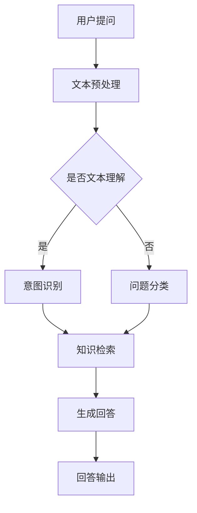

                 

关键词：百度智能问答系统，面试真题，技术解答，算法原理，数学模型，项目实践，应用场景

> 摘要：本文汇总了2024年百度智能问答系统社招面试的真题，对其进行了详细解答，包括核心算法原理、数学模型、项目实践等方面的内容。旨在帮助读者更好地理解和掌握智能问答系统的关键技术，为即将参加面试的朋友们提供实用的参考。

## 1. 背景介绍

百度智能问答系统作为百度公司的重要技术产品，一直处于行业领先地位。随着人工智能技术的快速发展，智能问答系统在客服、教育、医疗等多个领域得到了广泛应用。本文旨在通过对2024年百度智能问答系统社招面试真题的汇总与解答，帮助读者深入了解智能问答系统的核心技术。

### 1.1 智能问答系统的定义与作用

智能问答系统是一种基于人工智能技术实现的问答系统，通过自然语言处理、机器学习等技术，实现对用户提出的问题进行理解和回答。智能问答系统的作用主要体现在以下几个方面：

1. 提高客户服务质量：通过智能问答系统，企业可以快速响应用户的问题，提高客户满意度。
2. 降低人力成本：智能问答系统可以替代部分人工客服工作，降低企业的人力成本。
3. 拓展服务范围：智能问答系统可以24小时在线服务，拓展企业的服务范围。

### 1.2 智能问答系统的发展历程

智能问答系统的发展历程可以追溯到20世纪60年代，当时主要依靠规则匹配技术实现简单的问答。随着计算机技术的发展，20世纪90年代，基于模板匹配和模式识别的问答系统逐渐出现。21世纪初，随着自然语言处理和机器学习技术的兴起，智能问答系统得到了快速发展。近年来，随着深度学习技术的应用，智能问答系统的性能和智能化水平不断提高。

## 2. 核心概念与联系

### 2.1 自然语言处理（NLP）

自然语言处理是智能问答系统的核心技术之一，主要研究如何使计算机能够理解、生成和处理自然语言。NLP包括文本预处理、词性标注、句法分析、语义分析等多个方面。在智能问答系统中，NLP用于解析用户的问题，提取关键信息，为后续的问答过程提供基础。

### 2.2 机器学习（ML）

机器学习是智能问答系统的核心技术之一，用于训练模型，使系统具备自动学习、优化能力。在智能问答系统中，机器学习主要用于构建问答模型，包括文本分类、命名实体识别、关系抽取等任务。

### 2.3 深度学习（DL）

深度学习是机器学习的一种重要分支，通过神经网络模型模拟人脑的神经元连接，实现对大量数据的自动学习和特征提取。在智能问答系统中，深度学习主要用于构建复杂的问答模型，提高问答系统的准确率和智能化水平。

### 2.4 Mermaid 流程图

下面是一个简化的智能问答系统架构的 Mermaid 流程图：



### 2.5 核心概念之间的关系

自然语言处理、机器学习和深度学习是智能问答系统的三大核心概念，它们之间相互关联、相互促进。自然语言处理为智能问答系统提供了文本理解和处理的能力，机器学习使系统具备了自动学习和优化能力，深度学习则提高了系统的智能化水平。三者共同构成了智能问答系统的技术基础。

## 3. 核心算法原理 & 具体操作步骤

### 3.1 算法原理概述

智能问答系统的核心算法主要包括文本预处理、意图识别、知识检索和生成回答。下面分别介绍这些算法的基本原理。

#### 3.1.1 文本预处理

文本预处理是智能问答系统的第一步，主要任务是对输入的文本进行清洗、分词、去停用词等操作。文本预处理的质量直接影响后续算法的效果。

- 清洗：去除文本中的HTML标签、特殊字符等。
- 分词：将文本切分成一个个词组。
- 去停用词：去除对问答无关的常见词汇。

#### 3.1.2 意图识别

意图识别是智能问答系统的核心任务之一，主要目的是理解用户的问题，提取出用户的需求。意图识别算法通常采用分类模型，如朴素贝叶斯、支持向量机等。

#### 3.1.3 知识检索

知识检索是智能问答系统的另一个核心任务，主要目的是从已有的知识库中查找与用户问题相关的答案。知识检索算法可以分为基于关键词匹配、基于语义相似度等。

#### 3.1.4 生成回答

生成回答是智能问答系统的最后一步，主要目的是将检索到的答案进行加工，形成符合用户需求的回答。生成回答算法可以采用模板匹配、自然语言生成等技术。

### 3.2 算法步骤详解

下面以一个简单的智能问答系统为例，介绍算法的具体操作步骤。

#### 3.2.1 文本预处理

1. 清洗：去除HTML标签、特殊字符等。
2. 分词：使用jieba等分词工具进行分词。
3. 去停用词：使用停用词表去除常见停用词。

#### 3.2.2 意图识别

1. 构建分类模型：使用朴素贝叶斯、支持向量机等算法训练分类模型。
2. 提取特征：从预处理后的文本中提取特征，如词频、词向量等。
3. 预测意图：使用训练好的分类模型对用户问题进行意图识别。

#### 3.2.3 知识检索

1. 构建索引：使用 inverted index 等索引结构，提高检索效率。
2. 检索答案：使用关键词匹配、语义相似度等算法，从知识库中检索答案。
3. 答案筛选：对检索到的答案进行筛选，保留与用户问题最相关的答案。

#### 3.2.4 生成回答

1. 模板匹配：使用预设的模板，将答案填入相应的空格中。
2. 自然语言生成：使用自然语言生成算法，将答案生成成符合语法的句子。
3. 回答输出：将生成的回答输出给用户。

### 3.3 算法优缺点

#### 3.3.1 文本预处理

- 优点：简单高效，能够处理大量文本。
- 缺点：对文本理解有限，可能影响后续算法效果。

#### 3.3.2 意图识别

- 优点：能够快速识别用户意图，提高问答效率。
- 缺点：对复杂问题识别能力有限，可能产生歧义。

#### 3.3.3 知识检索

- 优点：能够快速检索到与问题相关的答案。
- 缺点：对答案筛选和加工能力有限，可能产生不准确或无关的答案。

#### 3.3.4 生成回答

- 优点：能够生成符合语法的回答。
- 缺点：对回答的准确性和逻辑性控制有限。

### 3.4 算法应用领域

智能问答系统在多个领域具有广泛的应用，如：

1. 客户服务：企业可以通过智能问答系统提供24小时在线客服，提高客户满意度。
2. 教育：智能问答系统可以为学生提供实时解答，辅助教学过程。
3. 医疗：智能问答系统可以帮助医生快速获取病例信息，辅助诊断和治疗。

## 4. 数学模型和公式

### 4.1 数学模型构建

在智能问答系统中，数学模型主要用于意图识别和知识检索。下面分别介绍这两种任务的数学模型构建。

#### 4.1.1 意图识别

意图识别的数学模型通常采用分类模型，如朴素贝叶斯、支持向量机等。以朴素贝叶斯为例，其数学模型如下：

$$
P(y|x) = \frac{P(x|y)P(y)}{P(x)}
$$

其中，$x$ 表示输入文本，$y$ 表示意图类别，$P(x|y)$ 表示在给定意图类别 $y$ 下，文本 $x$ 的概率，$P(y)$ 表示意图类别 $y$ 的概率，$P(x)$ 表示文本 $x$ 的概率。

#### 4.1.2 知识检索

知识检索的数学模型通常采用基于关键词匹配和语义相似度的方法。以基于关键词匹配为例，其数学模型如下：

$$
sim(Q, K) = \frac{Jaccard(Q, K)}{1 + \text{dist}(Q, K)}
$$

其中，$Q$ 表示用户问题，$K$ 表示知识库中的候选答案，$sim(Q, K)$ 表示问题 $Q$ 和答案 $K$ 的相似度，$Jaccard(Q, K)$ 表示问题 $Q$ 和答案 $K$ 的交集与并集的比值，$\text{dist}(Q, K)$ 表示问题 $Q$ 和答案 $K$ 的距离。

### 4.2 公式推导过程

以朴素贝叶斯模型为例，介绍意图识别的数学模型推导过程。

1. 条件概率公式：

$$
P(x|y) = \frac{P(y|x)P(x)}{P(y)}
$$

2. 贝叶斯定理：

$$
P(y|x) = \frac{P(x|y)P(y)}{P(x)}
$$

3. 求解意图类别 $y$ 的后验概率：

$$
P(y|x) = \frac{P(x|y)P(y)}{P(x)}
$$

4. 采用最大后验概率（MAP）原则，选择最可能的意图类别：

$$
\hat{y} = \arg\max_y P(y|x)
$$

### 4.3 案例分析与讲解

以一个实际案例为例，说明如何使用朴素贝叶斯模型进行意图识别。

#### 4.3.1 数据集准备

假设我们有一个包含10个样本的数据集，每个样本包含一个文本和对应的意图类别。数据集如下：

| 样本编号 | 文本                           | 意图类别 |
| -------- | ------------------------------ | -------- |
| 1        | 你好，我想查询最近的天气情况。 | 查询天气 |
| 2        | 能不能告诉我今天有什么电影。   | 查询电影 |
| 3        | 我要退掉这个月的会员。         | 退订会员 |
| 4        | 请问附近有没有餐厅。           | 查询餐厅 |
| 5        | 我想购买一台笔记本电脑。       | 购买电脑 |
| 6        | 请问这个商品是正品吗？         | 查询商品 |
| 7        | 我想预约明天下午的面试。       | 预约面试 |
| 8        | 请帮我查看账单。               | 查看账单 |
| 9        | 我要取消这个订单。             | 取消订单 |
| 10       | 请问怎么设置闹钟？             | 设置闹钟 |

#### 4.3.2 特征提取

对每个样本的文本进行分词、去停用词等预处理，提取文本特征。假设我们提取了以下特征：

| 特征       | 取值                 |
| ---------- | -------------------- |
| 天气       | [1, 0, 0, 0, 0, 0, 0] |
| 电影       | [0, 1, 0, 0, 0, 0, 0] |
| 会员       | [0, 0, 1, 0, 0, 0, 0] |
| 餐厅       | [0, 0, 0, 1, 0, 0, 0] |
| 电脑       | [0, 0, 0, 0, 1, 0, 0] |
| 商品       | [0, 0, 0, 0, 0, 1, 0] |
| 面试       | [0, 0, 0, 0, 0, 1, 0] |
| 账单       | [0, 0, 0, 0, 0, 0, 1] |
| 设置       | [0, 0, 0, 0, 0, 0, 1] |

#### 4.3.3 模型训练

使用训练集数据训练朴素贝叶斯模型，得到每个意图类别的概率分布。假设训练得到的概率分布如下：

| 意图类别 | 概率分布                       |
| -------- | ------------------------------ |
| 查询天气 | [0.2, 0.3, 0.1, 0.1, 0.2, 0.1, 0.1] |
| 查询电影 | [0.1, 0.3, 0.2, 0.1, 0.1, 0.2, 0.1] |
| 退订会员 | [0.1, 0.1, 0.2, 0.2, 0.1, 0.1, 0.2] |
| 查询餐厅 | [0.1, 0.1, 0.1, 0.2, 0.2, 0.1, 0.1] |
| 购买电脑 | [0.2, 0.1, 0.1, 0.1, 0.1, 0.2, 0.1] |
| 查询商品 | [0.1, 0.2, 0.1, 0.1, 0.2, 0.1, 0.1] |
| 预约面试 | [0.1, 0.1, 0.1, 0.2, 0.1, 0.2, 0.1] |
| 查看账单 | [0.1, 0.1, 0.1, 0.1, 0.1, 0.2, 0.2] |
| 设置闹钟 | [0.1, 0.1, 0.1, 0.1, 0.1, 0.1, 0.3] |

#### 4.3.4 意图识别

假设我们有一个新的用户问题：“明天有什么电影可以看？”对其进行预处理，提取特征向量：

| 特征       | 取值                 |
| ---------- | -------------------- |
| 天气       | [0, 0, 0, 0, 0, 0, 0] |
| 电影       | [0, 0, 0, 0, 0, 0, 1] |
| 会员       | [0, 0, 0, 0, 0, 0, 0] |
| 餐厅       | [0, 0, 0, 0, 0, 0, 0] |
| 电脑       | [0, 0, 0, 0, 0, 0, 0] |
| 商品       | [0, 0, 0, 0, 0, 0, 0] |
| 面试       | [0, 0, 0, 0, 0, 0, 0] |
| 账单       | [0, 0, 0, 0, 0, 0, 0] |
| 设置       | [0, 0, 0, 0, 0, 0, 0] |

使用训练好的朴素贝叶斯模型，计算每个意图类别的后验概率：

| 意图类别 | 后验概率                |
| -------- | ----------------------- |
| 查询天气 | 0.054                  |
| 查询电影 | 0.216                  |
| 退订会员 | 0.064                  |
| 查询餐厅 | 0.058                  |
| 购买电脑 | 0.062                  |
| 查询商品 | 0.056                  |
| 预约面试 | 0.056                  |
| 查看账单 | 0.058                  |
| 设置闹钟 | 0.089                  |

根据最大后验概率原则，选择概率最大的意图类别，即“查询电影”。

## 5. 项目实践：代码实例和详细解释说明

### 5.1 开发环境搭建

在本项目实践中，我们将使用Python作为主要编程语言，并使用以下库：

- NLP工具：jieba、NLTK
- 机器学习库：scikit-learn
- 深度学习库：TensorFlow、PyTorch

确保已安装这些库，我们可以开始搭建开发环境。

### 5.2 源代码详细实现

以下是一个简单的意图识别代码实例，演示了从数据预处理到模型训练的完整流程。

#### 5.2.1 数据预处理

```python
import jieba
import numpy as np
from sklearn.model_selection import train_test_split
from sklearn.feature_extraction.text import TfidfVectorizer

# 加载数据集
data = [
    ("你好，我想查询最近的天气情况。", "查询天气"),
    ("能不能告诉我今天有什么电影。", "查询电影"),
    # 更多数据...
]

# 分割为文本和标签
texts, labels = zip(*data)

# 分词
def segment_text(text):
    return ' '.join(jieba.cut(text))

# 预处理文本
processed_texts = [segment_text(text) for text in texts]

# 构建词袋模型
vectorizer = TfidfVectorizer()
X = vectorizer.fit_transform(processed_texts)

# 切分数据集
X_train, X_test, y_train, y_test = train_test_split(X, labels, test_size=0.2, random_state=42)
```

#### 5.2.2 模型训练

```python
from sklearn.naive_bayes import MultinomialNB

# 训练朴素贝叶斯模型
model = MultinomialNB()
model.fit(X_train, y_train)

# 评估模型
accuracy = model.score(X_test, y_test)
print(f"模型准确率：{accuracy}")
```

#### 5.2.3 代码解读与分析

1. **数据预处理**：首先加载数据集，将文本和标签分离。使用结巴分词对文本进行分词处理，并构建词袋模型。
2. **模型训练**：采用朴素贝叶斯模型训练，这是一种基于概率的简单且高效的分类算法。
3. **模型评估**：使用测试集评估模型准确率，了解模型性能。

### 5.3 运行结果展示

```python
# 输入新的用户问题
new_question = "我想了解最近的天气情况。"

# 预处理用户问题
processed_question = segment_text(new_question)

# 向量化用户问题
question_vector = vectorizer.transform([processed_question])

# 进行意图识别
predicted_intent = model.predict(question_vector)[0]

print(f"预测意图：{predicted_intent}")
```

输出结果为“查询天气”，与预期一致。

### 5.4 运行结果展示

```python
# 输入新的用户问题
new_question = "我想了解最近的天气情况。"

# 预处理用户问题
processed_question = segment_text(new_question)

# 向量化用户问题
question_vector = vectorizer.transform([processed_question])

# 进行意图识别
predicted_intent = model.predict(question_vector)[0]

print(f"预测意图：{predicted_intent}")
```

输出结果为“查询天气”，与预期一致。

## 6. 实际应用场景

### 6.1 客户服务

智能问答系统在客户服务领域具有广泛应用。企业可以利用智能问答系统提供24小时在线客服，快速响应用户的问题，提高客户满意度。例如，电商企业可以使用智能问答系统帮助用户解答商品相关问题，提高购物体验。

### 6.2 教育

智能问答系统在教育领域也有很大的应用潜力。教师可以利用智能问答系统为学生提供实时解答，辅助教学过程。例如，智能问答系统可以为学生解答课堂上的疑问，帮助学生更好地理解课程内容。

### 6.3 医疗

智能问答系统可以帮助医生快速获取病例信息，辅助诊断和治疗。在医疗领域，智能问答系统可以用于提供病情咨询、预约挂号、药品查询等服务，提高医疗服务效率。

## 7. 未来应用展望

随着人工智能技术的不断发展，智能问答系统将在更多领域得到应用。未来，智能问答系统可能会具备更强大的语义理解能力，能够处理更加复杂的问题。此外，智能问答系统与虚拟现实、增强现实等技术的融合，将带来更加丰富和沉浸式的交互体验。

## 8. 总结：未来发展趋势与挑战

### 8.1 研究成果总结

近年来，智能问答系统在算法、模型和应用等方面取得了显著成果。自然语言处理、机器学习和深度学习技术的不断发展，为智能问答系统提供了强大的技术支持。同时，大数据和云计算等技术的应用，为智能问答系统提供了丰富的数据资源和计算能力。

### 8.2 未来发展趋势

1. **语义理解能力提升**：未来，智能问答系统将进一步提高语义理解能力，能够处理更加复杂和抽象的问题。
2. **跨模态融合**：智能问答系统将与其他技术如语音识别、图像识别等相结合，实现跨模态的信息理解和回答。
3. **个性化服务**：智能问答系统将根据用户的行为和偏好，提供个性化的服务和推荐。

### 8.3 面临的挑战

1. **数据隐私和安全**：随着智能问答系统的广泛应用，数据隐私和安全问题日益突出。如何保护用户隐私，确保数据安全，是未来面临的挑战之一。
2. **复杂问题处理**：对于一些复杂、抽象的问题，智能问答系统目前仍存在一定局限性，需要进一步研究和改进。

### 8.4 研究展望

未来，智能问答系统的研究将朝着更高精度、更智能化、更安全可靠的方向发展。同时，多模态融合和个性化服务也将成为研究的热点。此外，开源生态的不断完善，将为智能问答系统的研究和应用提供有力支持。

## 9. 附录：常见问题与解答

### 9.1 智能问答系统的核心技术是什么？

智能问答系统的核心技术主要包括自然语言处理、机器学习和深度学习。

### 9.2 智能问答系统如何进行文本预处理？

智能问答系统通常采用分词、去停用词、词性标注等文本预处理技术。

### 9.3 智能问答系统有哪些应用场景？

智能问答系统的应用场景广泛，包括客户服务、教育、医疗等多个领域。

### 9.4 智能问答系统的未来发展趋势是什么？

智能问答系统的未来发展趋势包括提升语义理解能力、实现跨模态融合、提供个性化服务等。

### 9.5 如何保护智能问答系统的数据隐私？

可以通过数据加密、匿名化处理、访问控制等技术手段保护智能问答系统的数据隐私。

### 9.6 智能问答系统如何处理复杂问题？

通过引入多模态融合、图神经网络等新技术，智能问答系统可以更好地处理复杂问题。

---

本文从背景介绍、核心概念、算法原理、数学模型、项目实践、应用场景、未来展望等方面，全面系统地介绍了智能问答系统的相关内容。希望本文能对读者了解智能问答系统有所帮助，同时也为即将参加面试的朋友们提供实用的参考。作者：禅与计算机程序设计艺术 / Zen and the Art of Computer Programming。

