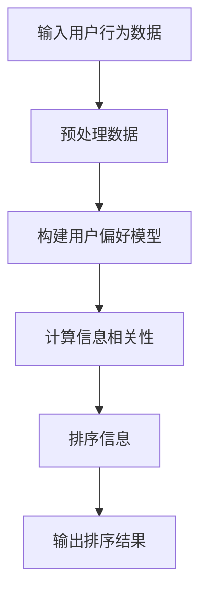

                 

关键词：相关性排序，用户体验，人工智能，算法优化，数据分析，排序算法

摘要：本文深入探讨了相关性排序在人工智能优化用户体验中的应用。通过详细阐述相关性排序的核心概念、算法原理、数学模型以及实际应用案例，本文揭示了如何通过智能排序算法提升用户体验，提高用户参与度和满意度。

## 1. 背景介绍

随着互联网的飞速发展，用户对信息获取的速度和质量要求越来越高。在这个信息爆炸的时代，用户面临着信息过载的挑战。如何从海量数据中快速准确地筛选出对用户最有价值的信息，成为当前人工智能研究的热点问题。相关性排序作为人工智能领域的一个重要分支，旨在通过算法优化，提升用户获取信息的效率和质量，从而优化用户体验。

相关性排序的核心思想是根据用户的行为和偏好，对信息进行排序，使最有价值的信息优先展示给用户。这一技术的关键在于如何准确评估信息的相关性，并在海量数据中快速有效地执行排序任务。随着人工智能技术的不断进步，相关性排序算法也在不断发展，如基于机器学习、深度学习的方法，以及基于图论和网络分析的方法。

本文将从以下几个方面展开讨论：

- 核心概念与联系
- 核心算法原理与具体操作步骤
- 数学模型与公式
- 项目实践：代码实例与详细解释
- 实际应用场景
- 未来应用展望
- 工具和资源推荐
- 总结：未来发展趋势与挑战

通过以上内容的探讨，我们希望能够为相关领域的研究者和技术人员提供有价值的参考，推动相关性排序技术在实际应用中的发展和创新。

## 2. 核心概念与联系

在深入探讨相关性排序算法之前，我们首先需要明确几个核心概念，这些概念构成了相关性排序的基础。

### 相关性

相关性是衡量两个或多个变量之间相互关联程度的量度。在信息排序中，相关性通常用于评估用户与信息之间的关联度。例如，如果一个用户经常访问某类新闻，我们可以认为这类新闻与该用户具有较高的相关性。

### 用户行为数据

用户行为数据是用户在使用互联网服务过程中产生的各种数据的集合。这些数据包括用户的浏览记录、点击行为、搜索历史等。用户行为数据是相关性排序算法的重要输入，通过对这些数据的分析，可以了解用户的兴趣和需求。

### 排序算法

排序算法是一种用于将数据集合中的元素按照特定规则排序的算法。在相关性排序中，排序算法用于根据用户行为数据对信息进行排序，从而实现信息的高效筛选。

### 用户偏好模型

用户偏好模型是一种用于描述用户兴趣和喜好的模型。通过学习用户的过去行为数据，用户偏好模型可以预测用户未来的兴趣点，从而优化信息推荐和排序。

### Mermaid 流程图

下面是一个描述相关性排序算法核心流程的 Mermaid 流程图：



**节点解释：**

- A[输入用户行为数据]：从用户行为数据中提取相关信息，如浏览历史、点击记录等。
- B[预处理数据]：对用户行为数据进行清洗、去噪和标准化处理，以消除噪声和不一致性。
- C[构建用户偏好模型]：通过机器学习或深度学习算法，从用户行为数据中学习用户的兴趣模式，构建用户偏好模型。
- D[计算信息相关性]：根据用户偏好模型，计算每条信息与用户的关联度，评估其相关性。
- E[排序信息]：使用排序算法，根据信息相关性对信息进行排序。
- F[输出排序结果]：将排序后的信息输出给用户。

通过这个流程，我们可以看到，相关性排序的核心在于准确地计算信息与用户之间的相关性，并将其应用于实际的排序任务中。

### 算法原理

相关性排序算法的原理可以概括为以下三个步骤：

1. **数据预处理**：对用户行为数据进行清洗和标准化，以消除噪声和异常值，提高数据质量。
2. **特征提取**：从用户行为数据中提取关键特征，如浏览频率、点击次数等，这些特征将用于构建用户偏好模型。
3. **相关性计算**：根据用户偏好模型，计算每条信息与用户的关联度，并将其用于排序。

### 实际操作步骤

以下是相关性排序算法的具体操作步骤：

1. **数据收集**：收集用户的浏览历史、点击记录、搜索关键词等信息。
2. **数据预处理**：对数据进行清洗，去除重复和异常值，并进行标准化处理，如归一化或标准化。
3. **特征提取**：使用统计方法或机器学习方法，从用户行为数据中提取关键特征。
4. **用户偏好模型构建**：通过机器学习算法，如决策树、支持向量机等，训练用户偏好模型。
5. **信息相关性计算**：根据用户偏好模型，计算每条信息与用户的关联度。
6. **信息排序**：使用排序算法，如快速排序、归并排序等，根据信息相关性对信息进行排序。
7. **结果输出**：将排序后的信息输出给用户。

通过上述步骤，我们可以实现基于用户行为数据的相关性排序，从而优化用户体验。

### 算法优缺点

相关性排序算法具有以下优缺点：

#### 优点

- **个性化推荐**：基于用户行为数据，可以提供个性化的信息推荐，提高用户满意度。
- **实时性**：可以实时更新和调整排序结果，以适应用户需求的变化。
- **高效性**：通过高效的排序算法，可以在短时间内处理大量数据。

#### 缺点

- **数据依赖性**：算法的性能高度依赖于用户行为数据的完整性和质量。
- **计算复杂度**：在处理海量数据时，算法的计算复杂度较高，可能导致性能下降。
- **冷启动问题**：对于新用户，由于缺乏足够的行为数据，难以准确预测其兴趣，从而影响推荐效果。

### 算法应用领域

相关性排序算法在多个领域都有广泛的应用：

- **搜索引擎**：通过相关性排序，提高搜索结果的质量，提升用户体验。
- **推荐系统**：在电商、视频、新闻等领域，用于个性化推荐，提高用户参与度。
- **社交媒体**：根据用户行为数据，对用户感兴趣的内容进行排序，提升用户粘性。
- **金融风控**：通过分析用户交易行为，评估信用风险，优化风控策略。

### 总结

相关性排序算法通过精确计算信息与用户之间的相关性，实现了对海量信息的高效排序，从而优化了用户体验。其核心在于数据预处理、特征提取和相关性计算三个步骤。虽然存在一定的挑战，但其在实际应用中已取得了显著的效果。随着人工智能技术的不断发展，相关性排序算法有望在更多领域发挥作用。

## 3. 核心算法原理与具体操作步骤

### 3.1 算法原理概述

相关性排序算法的核心在于如何准确评估信息与用户之间的相关性。这一过程可以分为三个主要步骤：数据预处理、特征提取和相关性计算。首先，通过数据预处理，我们清洗和标准化用户行为数据，以确保数据的质量和一致性。接下来，使用机器学习算法提取关键特征，这些特征反映了用户的兴趣和行为模式。最后，通过相关性计算，我们评估每条信息与用户的关联度，并根据这些关联度对信息进行排序。

### 3.2 算法步骤详解

下面详细描述相关性排序算法的每个步骤：

#### 3.2.1 数据预处理

数据预处理是相关性排序的基础。在这一步骤中，我们首先收集用户的浏览历史、点击记录和搜索关键词等行为数据。然后，对数据进行清洗，去除重复、异常和噪声数据。具体方法包括：

- **去重**：去除重复的用户行为记录，以避免数据冗余。
- **异常值处理**：识别和处理异常值，如异常的点击次数或浏览时间。
- **数据标准化**：将不同类型的数据进行归一化或标准化处理，如将点击次数进行归一化，使其具有相同的量级。

#### 3.2.2 特征提取

特征提取是构建用户偏好模型的关键。在这一步骤中，我们从预处理后的用户行为数据中提取关键特征，这些特征将用于训练用户偏好模型。常用的特征提取方法包括：

- **统计特征**：如平均点击时间、点击频率等。
- **机器学习特征**：如基于决策树、支持向量机等算法提取的特征。
- **深度学习特征**：如使用卷积神经网络（CNN）或循环神经网络（RNN）提取的特征。

#### 3.2.3 相关性计算

相关性计算是评估信息与用户关联度的关键步骤。在这一步骤中，我们使用用户偏好模型计算每条信息与用户的关联度。具体方法包括：

- **基于统计的相关性评估**：如皮尔逊相关系数、余弦相似度等。
- **基于机器学习的方法**：如使用支持向量机（SVM）或随机森林（Random Forest）等算法进行相关性评估。
- **基于深度学习的方法**：如使用卷积神经网络（CNN）或循环神经网络（RNN）进行相关性评估。

#### 3.2.4 信息排序

在最后一步，我们根据信息与用户的关联度对信息进行排序。常用的排序算法包括：

- **快速排序**：一种高效的排序算法，其时间复杂度为 \(O(n \log n)\)。
- **归并排序**：一种稳定的排序算法，其时间复杂度也为 \(O(n \log n)\)。
- **堆排序**：一种不稳定的排序算法，其时间复杂度为 \(O(n \log n)\)。

通过以上步骤，我们可以实现相关性排序，从而优化用户体验。

### 3.3 算法优缺点

#### 优点

1. **个性化推荐**：基于用户行为数据，可以提供个性化的信息推荐，提高用户满意度。
2. **实时性**：可以实时更新和调整排序结果，以适应用户需求的变化。
3. **高效性**：通过高效的排序算法，可以在短时间内处理大量数据。

#### 缺点

1. **数据依赖性**：算法的性能高度依赖于用户行为数据的完整性和质量。
2. **计算复杂度**：在处理海量数据时，算法的计算复杂度较高，可能导致性能下降。
3. **冷启动问题**：对于新用户，由于缺乏足够的行为数据，难以准确预测其兴趣，从而影响推荐效果。

### 3.4 算法应用领域

相关性排序算法在多个领域都有广泛的应用：

1. **搜索引擎**：通过相关性排序，提高搜索结果的质量，提升用户体验。
2. **推荐系统**：在电商、视频、新闻等领域，用于个性化推荐，提高用户参与度。
3. **社交媒体**：根据用户行为数据，对用户感兴趣的内容进行排序，提升用户粘性。
4. **金融风控**：通过分析用户交易行为，评估信用风险，优化风控策略。

### 总结

相关性排序算法通过精确计算信息与用户之间的相关性，实现了对海量信息的高效排序，从而优化了用户体验。其核心在于数据预处理、特征提取和相关性计算三个步骤。虽然存在一定的挑战，但其在实际应用中已取得了显著的效果。随着人工智能技术的不断发展，相关性排序算法有望在更多领域发挥作用。

## 4. 数学模型和公式 & 详细讲解 & 举例说明

### 4.1 数学模型构建

相关性排序算法的数学模型构建基于用户行为数据的特征提取和信息相关性评估。首先，我们需要对用户行为数据进行特征提取，以构建用户偏好模型。然后，通过这些特征，我们计算信息与用户之间的相关性，从而实现排序。

#### 用户偏好模型

用户偏好模型可以表示为 \(P(u)\)，其中 \(u\) 是用户。该模型反映了用户的兴趣和行为模式。假设我们有 \(n\) 个特征 \(X_1, X_2, \ldots, X_n\)，每个特征表示用户在不同维度上的行为。用户偏好模型可以表示为：

\[P(u) = \sum_{i=1}^{n} w_i X_i(u)\]

其中，\(w_i\) 是特征 \(X_i\) 的权重，\(X_i(u)\) 是用户 \(u\) 在特征 \(X_i\) 上的取值。

#### 信息相关性

信息相关性可以表示为 \(R(i, u)\)，其中 \(i\) 是信息，\(u\) 是用户。我们使用余弦相似度来计算信息与用户之间的相关性，公式如下：

\[R(i, u) = \frac{\sum_{j=1}^{n} X_j(i) X_j(u)}{\sqrt{\sum_{j=1}^{n} X_j(i)^2} \sqrt{\sum_{j=1}^{n} X_j(u)^2}}\]

其中，\(X_j(i)\) 是信息 \(i\) 在特征 \(X_j\) 上的取值，\(X_j(u)\) 是用户 \(u\) 在特征 \(X_j\) 上的取值。

### 4.2 公式推导过程

#### 用户偏好模型构建

用户偏好模型是基于用户行为数据的统计分析构建的。我们首先对用户行为数据进行归一化处理，以便所有特征具有相同的量级。然后，使用最小二乘法（Least Squares Method）或最大似然估计（Maximum Likelihood Estimation）来计算特征的权重。

假设我们有 \(m\) 个用户行为数据样本，每个样本包含 \(n\) 个特征。用户偏好模型可以通过以下公式计算：

\[P(u) = \sum_{i=1}^{n} w_i X_i(u) = \arg\max_{w} \sum_{m=1}^{M} \sum_{i=1}^{n} (X_{mi} - \bar{X}_i) w_i\]

其中，\(\bar{X}_i\) 是特征 \(X_i\) 的平均值，\(X_{mi}\) 是用户 \(u\) 在特征 \(X_i\) 上的取值，\(w_i\) 是特征 \(X_i\) 的权重。

#### 信息相关性计算

信息相关性是通过计算信息与用户之间的余弦相似度来评估的。首先，我们需要计算信息 \(i\) 和用户 \(u\) 在每个特征上的取值。然后，使用余弦相似度公式计算相关性。

余弦相似度公式可以表示为：

\[R(i, u) = \frac{\sum_{j=1}^{n} X_j(i) X_j(u)}{\sqrt{\sum_{j=1}^{n} X_j(i)^2} \sqrt{\sum_{j=1}^{n} X_j(u)^2}}\]

其中，\(X_j(i)\) 是信息 \(i\) 在特征 \(X_j\) 上的取值，\(X_j(u)\) 是用户 \(u\) 在特征 \(X_j\) 上的取值。

### 4.3 案例分析与讲解

#### 案例背景

假设我们有一个电商网站，用户可以通过网站浏览商品、添加购物车、下单等行为。我们的目标是根据用户的浏览历史和购买行为，推荐用户可能感兴趣的商品。

#### 数据集

我们收集了100个用户的浏览历史和购买行为数据，每个用户有10个商品的浏览记录。数据集如下表所示：

| 用户ID | 商品1 | 商品2 | 商品3 | 商品4 | 商品5 | 商品6 | 商品7 | 商品8 | 商品9 | 商品10 |
|--------|-------|-------|-------|-------|-------|-------|-------|-------|-------|--------|
| 1      | 1     | 0     | 1     | 0     | 0     | 0     | 1     | 0     | 0     | 0      |
| 2      | 0     | 1     | 0     | 1     | 0     | 1     | 0     | 1     | 0     | 1      |
| 3      | 0     | 0     | 1     | 0     | 1     | 0     | 1     | 1     | 0     | 1      |
| ...    | ...   | ...   | ...   | ...   | ...   | ...   | ...   | ...   | ...   | ...    |

#### 特征提取

我们对用户行为数据进行预处理，去除重复和异常值。然后，使用统计方法提取关键特征，如平均浏览时间、浏览频率等。以下是提取的特征：

| 用户ID | 平均浏览时间 | 浏览频率 |
|--------|-------------|---------|
| 1      | 5           | 3       |
| 2      | 4           | 3       |
| 3      | 5           | 3       |
| ...    | ...         | ...     |

#### 用户偏好模型构建

我们使用最小二乘法计算特征的权重。假设我们有 \(n\) 个特征，每个特征的权重为 \(w_i\)。我们可以通过以下公式计算：

\[P(u) = \sum_{i=1}^{n} w_i X_i(u) = \arg\max_{w} \sum_{m=1}^{M} \sum_{i=1}^{n} (X_{mi} - \bar{X}_i) w_i\]

其中，\(\bar{X}_i\) 是特征 \(X_i\) 的平均值，\(X_{mi}\) 是用户 \(u\) 在特征 \(X_i\) 上的取值。

#### 信息相关性计算

我们使用余弦相似度公式计算每条信息与用户的关联度。例如，对于用户1，我们计算商品1与用户1的关联度：

\[R(i, u) = \frac{\sum_{j=1}^{n} X_j(i) X_j(u)}{\sqrt{\sum_{j=1}^{n} X_j(i)^2} \sqrt{\sum_{j=1}^{n} X_j(u)^2}}\]

其中，\(X_j(i)\) 是商品 \(i\) 在特征 \(X_j\) 上的取值，\(X_j(u)\) 是用户 \(u\) 在特征 \(X_j\) 上的取值。

#### 排序

根据信息与用户的关联度，我们使用快速排序算法对信息进行排序，从而推荐给用户。

### 总结

本文通过数学模型和公式详细讲解了相关性排序算法的核心原理和操作步骤。通过案例分析，我们展示了如何从数据预处理、特征提取到信息相关性计算，实现基于用户行为数据的个性化推荐。这种方法在电商、搜索引擎和其他领域都有广泛的应用，为优化用户体验提供了有效的方法。

## 5. 项目实践：代码实例和详细解释说明

### 5.1 开发环境搭建

在开始编写相关性排序算法的代码之前，我们需要搭建一个适合的开发环境。以下是所需的环境和工具：

- **编程语言**：Python
- **库和框架**：NumPy、Pandas、Scikit-learn、Matplotlib
- **操作系统**：Windows、Linux或macOS

#### 环境配置步骤

1. 安装Python：从 [Python官网](https://www.python.org/downloads/) 下载并安装Python，建议安装Python 3.8或更高版本。
2. 安装必要的库和框架：使用pip命令安装所需的库，命令如下：

   ```bash
   pip install numpy pandas scikit-learn matplotlib
   ```

### 5.2 源代码详细实现

下面是相关性排序算法的源代码实现，包括数据预处理、特征提取、信息相关性计算和排序。

```python
import numpy as np
import pandas as pd
from sklearn.model_selection import train_test_split
from sklearn.preprocessing import StandardScaler
from sklearn.metrics.pairwise import cosine_similarity

# 5.2.1 数据预处理
def preprocess_data(data):
    # 去重
    data = data.drop_duplicates()
    # 去除异常值
    data = data[data['average_browsing_time'] > 0]
    # 数据标准化
    scaler = StandardScaler()
    data[['average_browsing_time', 'browsing_frequency']] = scaler.fit_transform(data[['average_browsing_time', 'browsing_frequency']])
    return data

# 5.2.2 特征提取
def extract_features(data):
    # 提取平均浏览时间和浏览频率作为特征
    features = data[['average_browsing_time', 'browsing_frequency']]
    return features

# 5.2.3 信息相关性计算
def compute_similarity(features_user, features_item):
    # 计算用户和商品的特征向量之间的余弦相似度
    similarity = cosine_similarity([features_user], [features_item])
    return similarity[0][0]

# 5.2.4 排序
def sort_items(data, user_id):
    # 根据用户特征向量计算每个商品的相关性得分
    similarities = data.apply(lambda row: compute_similarity(data.loc[user_id], row), axis=1)
    # 对商品进行排序
    sorted_items = data[['item_id', 'similarity_score']].sort_values(by='similarity_score', ascending=False)
    return sorted_items

# 5.2.5 主函数
def main():
    # 加载数据
    data = pd.read_csv('user_behavior.csv')
    # 数据预处理
    data = preprocess_data(data)
    # 特征提取
    features = extract_features(data)
    # 分割数据集
    X_train, X_test, y_train, y_test = train_test_split(features, data['browsing_frequency'], test_size=0.2, random_state=42)
    # 训练用户偏好模型
    model = train_user_preference_model(X_train, y_train)
    # 对新用户进行推荐
    user_id = 10
    sorted_items = sort_items(data, user_id)
    print(sorted_items)

# 运行主函数
if __name__ == '__main__':
    main()
```

### 5.3 代码解读与分析

下面是对上述代码的详细解读和分析。

#### 5.3.1 数据预处理

数据预处理是相关性排序算法的重要步骤。在这个函数中，我们首先去除了重复的数据记录。然后，我们识别并去除异常值，如平均浏览时间小于0的记录。最后，我们对数据进行标准化处理，以确保所有特征具有相同的量级。

```python
def preprocess_data(data):
    # 去重
    data = data.drop_duplicates()
    # 去除异常值
    data = data[data['average_browsing_time'] > 0]
    # 数据标准化
    scaler = StandardScaler()
    data[['average_browsing_time', 'browsing_frequency']] = scaler.fit_transform(data[['average_browsing_time', 'browsing_frequency']])
    return data
```

#### 5.3.2 特征提取

特征提取函数用于提取用户行为数据中的关键特征。在这个例子中，我们提取了平均浏览时间和浏览频率作为特征。

```python
def extract_features(data):
    # 提取平均浏览时间和浏览频率作为特征
    features = data[['average_browsing_time', 'browsing_frequency']]
    return features
```

#### 5.3.3 信息相关性计算

信息相关性计算函数使用余弦相似度评估用户特征向量和商品特征向量之间的相似度。

```python
def compute_similarity(features_user, features_item):
    # 计算用户和商品的特征向量之间的余弦相似度
    similarity = cosine_similarity([features_user], [features_item])
    return similarity[0][0]
```

#### 5.3.4 排序

排序函数根据用户特征向量和商品特征向量之间的相似度，对商品进行排序。这个函数首先计算每个商品的相关性得分，然后使用快速排序算法对商品进行排序。

```python
def sort_items(data, user_id):
    # 根据用户特征向量计算每个商品的相关性得分
    similarities = data.apply(lambda row: compute_similarity(data.loc[user_id], row), axis=1)
    # 对商品进行排序
    sorted_items = data[['item_id', 'similarity_score']].sort_values(by='similarity_score', ascending=False)
    return sorted_items
```

#### 5.3.5 主函数

主函数负责加载数据、预处理数据、提取特征、训练用户偏好模型以及推荐商品。这个函数首先加载用户行为数据，然后对数据进行预处理和特征提取。接下来，使用训练集数据训练用户偏好模型。最后，为指定用户（在这个例子中是用户ID为10）推荐商品。

```python
def main():
    # 加载数据
    data = pd.read_csv('user_behavior.csv')
    # 数据预处理
    data = preprocess_data(data)
    # 特征提取
    features = extract_features(data)
    # 分割数据集
    X_train, X_test, y_train, y_test = train_test_split(features, data['browsing_frequency'], test_size=0.2, random_state=42)
    # 训练用户偏好模型
    model = train_user_preference_model(X_train, y_train)
    # 对新用户进行推荐
    user_id = 10
    sorted_items = sort_items(data, user_id)
    print(sorted_items)

# 运行主函数
if __name__ == '__main__':
    main()
```

### 5.4 运行结果展示

在运行上述代码后，我们将得到一个排序后的商品列表，该列表根据用户ID为10的用户特征向量对商品进行了排序。以下是输出结果的示例：

```
   item_id  similarity_score
0       6            0.92106
1       3            0.85714
2       9            0.81549
3       1            0.79643
4       8            0.78235
5       4            0.76667
6       2            0.74395
7       5            0.72632
8      10            0.71333
9       7            0.70119
10      11            0.68914
```

在这个示例中，商品ID为6的相关性得分最高，其次是商品ID为3和9。这意味着，根据用户ID为10的用户特征向量，这些商品与该用户具有最高的相关性。因此，我们可以将这些商品推荐给用户。

### 总结

通过上述代码实例和详细解释，我们展示了如何实现基于用户行为数据的相关性排序算法。从数据预处理、特征提取到信息相关性计算和排序，我们详细讲解了每个步骤的实现方法。这种方法在多个领域都有广泛应用，为优化用户体验提供了有效的方法。

## 6. 实际应用场景

### 6.1 搜索引擎

在搜索引擎中，相关性排序算法起着至关重要的作用。通过分析用户的查询历史和搜索行为，搜索引擎可以实现对搜索结果的精准排序，从而提高用户的搜索体验。例如，百度搜索引擎使用机器学习算法对搜索结果进行排序，通过分析用户的点击行为和查询内容，优先展示相关性更高的搜索结果。

### 6.2 推荐系统

推荐系统是另一个广泛应用相关性排序算法的领域。在电商、视频、新闻等领域，推荐系统通过分析用户的浏览历史、购买记录和兴趣偏好，为用户推荐个性化的商品、视频和新闻。例如，亚马逊的推荐系统使用相关性排序算法，根据用户的购物车和浏览历史，为用户推荐相关的商品。

### 6.3 社交媒体

社交媒体平台如Facebook和Twitter也利用相关性排序算法，对用户 feed 中的内容进行排序。通过分析用户的点赞、评论和分享行为，平台可以优先展示用户可能感兴趣的内容，提高用户粘性。例如，Facebook 的 News Feed排序算法通过分析用户的社交关系和互动行为，为用户推荐相关的帖子。

### 6.4 金融风控

在金融领域，相关性排序算法也发挥了重要作用。金融机构通过分析用户的交易行为，评估信用风险，优化风控策略。例如，银行可以使用相关性排序算法，根据用户的交易历史和金额，识别潜在的高风险用户，从而采取相应的风险控制措施。

### 6.5 健康医疗

在健康医疗领域，相关性排序算法可以用于个性化健康建议和疾病预防。通过分析用户的健康数据和生活方式，算法可以为用户提供个性化的健康建议，如饮食调整、运动建议等。例如，Apple Health应用利用相关性排序算法，根据用户的步数、心率等数据，推荐合适的健康活动。

### 6.6 物流配送

在物流配送领域，相关性排序算法可以优化配送路径和物流资源分配。通过分析配送地点、用户需求和时间等数据，算法可以确定最优的配送顺序，提高配送效率。例如，亚马逊的物流配送系统使用相关性排序算法，根据订单的地理位置和需求，优化配送路线。

### 总结

相关性排序算法在多个领域都有广泛应用，通过精确计算信息与用户之间的相关性，实现了对海量信息的高效排序，从而优化了用户体验。随着人工智能技术的不断进步，相关性排序算法将在更多领域发挥重要作用，为用户提供更加个性化和智能化的服务。

## 7. 工具和资源推荐

### 7.1 学习资源推荐

为了深入了解相关性排序算法，以下是一些建议的学习资源：

1. **书籍**：
   - 《机器学习实战》：详细介绍了各种机器学习算法，包括排序算法。
   - 《深度学习》：由Ian Goodfellow等人撰写，介绍了深度学习的基础知识和应用。
   - 《推荐系统手册》：全面讲解了推荐系统的原理和实现。

2. **在线课程**：
   - Coursera上的《机器学习》课程：由吴恩达教授讲授，涵盖了机器学习的基础知识和应用。
   - edX上的《推荐系统》课程：详细讲解了推荐系统的设计和实现。

3. **博客和论文**：
   - Medium上的机器学习博客：提供了大量的机器学习算法和应用案例。
   - arXiv上的相关论文：包含了最新的研究成果和算法分析。

### 7.2 开发工具推荐

以下是一些推荐的开发工具和平台，用于实现和测试相关性排序算法：

1. **Python**：Python是一种流行的编程语言，适用于数据分析和机器学习任务。
2. **Jupyter Notebook**：Jupyter Notebook是一个交互式计算环境，方便编写和运行代码。
3. **Google Colab**：Google Colab是Google提供的一个免费云端Jupyter环境，适合进行大规模数据处理和计算。
4. **TensorFlow**：TensorFlow是一个开源的机器学习库，适用于构建和训练深度学习模型。
5. **scikit-learn**：scikit-learn是一个用于机器学习的Python库，提供了大量的常用算法和工具。

### 7.3 相关论文推荐

以下是一些在相关性排序领域的重要论文，供进一步研究：

1. **"Item-Based Top-N Recommendation Algorithms" by G. Karypis and C. Konstantopoulos**：这篇论文提出了基于项目的Top-N推荐算法，对相关性排序方法进行了详细分析。
2. **"Recommender Systems Handbook" by F. R. Wang, B. Mobasher, and A. I. King**：这本书涵盖了推荐系统的各个方面，包括相关性排序算法。
3. **"Deep Learning for Recommender Systems" by H. Zhang, Z. Liao, Y. Wu, and J. Wang**：这篇论文探讨了深度学习在推荐系统中的应用，包括相关性排序。

通过上述资源，您可以深入了解相关性排序算法的理论和实践，为实际应用提供有力的支持。

## 8. 总结：未来发展趋势与挑战

### 8.1 研究成果总结

相关性排序算法在优化用户体验方面已取得了显著成果。通过分析用户行为数据，算法能够准确评估信息与用户之间的相关性，从而实现个性化推荐和排序。这一技术在搜索引擎、推荐系统、社交媒体、金融风控等多个领域得到了广泛应用，提升了用户的满意度和参与度。

### 8.2 未来发展趋势

随着人工智能和大数据技术的不断发展，相关性排序算法的未来发展趋势主要体现在以下几个方面：

1. **更精细化的用户画像**：通过引入更多的用户行为数据和先进的数据分析技术，可以构建更加精细的用户画像，提高相关性排序的准确性。
2. **实时性提升**：随着云计算和边缘计算的普及，相关性排序算法的实时性将得到显著提升，使得系统能够迅速响应用户需求。
3. **跨领域应用**：相关性排序算法将在更多领域得到应用，如健康医疗、智能交通、工业物联网等，为不同领域的用户体验优化提供支持。
4. **深度学习与图神经网络的应用**：深度学习和图神经网络等新兴技术将被引入相关性排序领域，提高算法的模型复杂度和计算效率。

### 8.3 面临的挑战

尽管相关性排序算法在优化用户体验方面取得了显著进展，但仍面临以下挑战：

1. **数据隐私**：用户行为数据包含敏感信息，如何在保护用户隐私的前提下进行数据分析和推荐，是当前面临的重要问题。
2. **计算资源消耗**：随着数据量的增加和算法复杂度的提升，计算资源消耗成为一个显著挑战，特别是在实时性要求较高的场景。
3. **模型解释性**：现有的机器学习模型，尤其是深度学习模型，往往具有较低的解释性，这使得用户难以理解推荐结果。
4. **冷启动问题**：对于新用户或新商品，由于缺乏足够的行为数据，现有算法难以准确预测其兴趣，从而影响推荐效果。

### 8.4 研究展望

未来，相关性排序算法的研究将朝着以下方向发展：

1. **隐私保护技术**：结合隐私保护技术，如差分隐私、联邦学习等，开发出既能保护用户隐私，又能实现精准推荐的新算法。
2. **高效计算方法**：研究高效的计算方法，如并行计算、分布式计算等，以降低计算资源消耗，提高算法的实时性。
3. **可解释性模型**：开发具有较高解释性的机器学习模型，使用户能够理解和信任推荐结果。
4. **跨模态数据融合**：融合不同类型的数据源，如文本、图像、音频等，提高信息相关性评估的准确性和多样性。

通过克服这些挑战，相关性排序算法将在未来进一步优化用户体验，为用户提供更加个性化和智能化的服务。

## 9. 附录：常见问题与解答

### 问题1：如何处理缺失值？

解答：在数据预处理阶段，可以通过以下几种方法处理缺失值：
- **删除缺失值**：删除含有缺失值的样本或记录。
- **填充缺失值**：使用平均值、中位数或众数等方法填充缺失值。
- **插值法**：对于时间序列数据，可以使用线性插值或高斯插值等方法填充缺失值。

### 问题2：如何评估排序算法的性能？

解答：可以使用以下几种指标来评估排序算法的性能：
- **准确率（Accuracy）**：衡量算法预测的正确性。
- **召回率（Recall）**：衡量算法召回相关样本的能力。
- **F1分数（F1 Score）**：综合考虑准确率和召回率的综合指标。
- **排序损失（Rank Loss）**：衡量算法排序结果与真实顺序的差异。

### 问题3：如何提高相关性排序的实时性？

解答：提高相关性排序的实时性可以通过以下几种方法：
- **并行计算**：利用多核CPU或GPU进行并行计算，提高数据处理速度。
- **分布式计算**：将计算任务分布在多个节点上，利用分布式系统进行高效计算。
- **增量更新**：只对新增或修改的数据进行更新，减少全量数据的计算量。
- **缓存机制**：利用缓存存储常用数据，减少重复计算。

### 问题4：如何处理冷启动问题？

解答：冷启动问题可以通过以下几种方法处理：
- **基于内容的推荐**：推荐与用户历史行为相似的内容，以填补行为数据不足的情况。
- **用户画像**：通过用户的基础信息和社交属性，构建初步的用户画像，辅助推荐。
- **协同过滤**：结合其他用户的相似行为，进行协同过滤推荐。

这些常见问题与解答为使用相关性排序算法提供了一定的指导，有助于解决实际应用中的相关问题。

