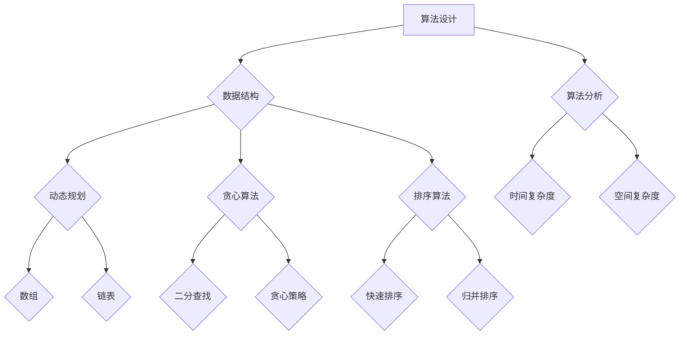

                 

  
### 背景介绍

随着人工智能技术的飞速发展，算法研究员成为各个行业和领域中的热门职业。各大企业纷纷开设校招，招募具备优秀算法研究背景和能力的应届毕业生。知乎作为一个知识分享平台，其2024校招算法研究员面试题解析，对于准备参加校招的学子和想要提升自身算法水平的从业者来说，具有极高的参考价值。

本文旨在通过对知乎2024校招算法研究员面试题的详细解析，帮助读者理解面试题背后的核心概念和算法原理，同时提供实用的解题思路和技巧。文章结构如下：

- **核心概念与联系**：通过Mermaid流程图展示算法的核心概念和架构。
- **核心算法原理与具体操作步骤**：详细阐述算法原理、操作步骤、优缺点及应用领域。
- **数学模型和公式**：讲解数学模型构建、公式推导过程，并举例说明。
- **项目实践**：提供代码实例和详细解释。
- **实际应用场景**：探讨算法在现实世界中的应用。
- **工具和资源推荐**：推荐学习资源、开发工具和相关论文。
- **总结与展望**：总结研究成果，展望未来发展趋势和挑战。

接下来，我们将逐章深入探讨这些主题。

### 核心概念与联系

在解答算法面试题之前，我们需要明确核心概念和它们之间的联系。以下是几个关键概念及其关系的Mermaid流程图：



1. **算法设计**：算法设计是整个算法研究的核心，包括设计算法的基本框架和思路。
2. **数据结构**：数据结构是算法研究的基础，用于存储和组织数据，常见的有数组、链表等。
3. **动态规划**：动态规划是一种解决最优化问题的算法思想，通常用于解决子问题重叠和最优子结构的问题。
4. **贪心算法**：贪心算法通过每次选择当前最优解来逐步逼近问题的最优解。
5. **排序算法**：排序算法用于将数据按照一定的顺序排列，常见的有快速排序、归并排序等。
6. **算法分析**：算法分析是评估算法性能的重要手段，包括时间复杂度和空间复杂度。
7. **二分查找**：二分查找是一种高效的查找算法，适用于有序数组。

通过上述Mermaid流程图，我们可以清晰地看到各个核心概念之间的联系，为后续的算法原理解析打下基础。

### 核心算法原理与具体操作步骤

在这一部分，我们将详细解析知乎2024校招算法研究员面试中的几个核心算法题，包括算法原理、操作步骤、优缺点及应用领域。

#### 3.1 算法原理概述

首先，我们来看一个常见的面试题——"最长公共子序列(LCS)"。

**最长公共子序列(LCS)**：给定两个字符串`X`和`Y`，找出它们最长的公共子序列。一个子序列是指一个序列中删除若干元素后，剩余序列保持原有的相对顺序。

**原理**：LCS问题可以通过动态规划解决。动态规划的核心思想是将复杂问题分解为若干子问题，并存储子问题的解，以避免重复计算。

**步骤**：

1. **初始化**：创建一个二维数组`dp`，其大小为`m+1`行`n+1`列，其中`m`和`n`分别为字符串`X`和`Y`的长度。初始化第一行和第一列的元素为0。
2. **状态转移**：对于`dp[i][j]`，如果`X[i-1] == Y[j-1]`，则`dp[i][j] = dp[i-1][j-1] + 1`；否则，`dp[i][j] = max(dp[i-1][j], dp[i][j-1])`。
3. **回溯求解**：从`dp[m][n]`开始，沿着`dp[i][j]`的值回溯，构建出最长公共子序列。

**优缺点与应用领域**：

- **优点**：LCS算法具有线性时间复杂度，适用于处理大规模字符串匹配问题。
- **缺点**：需要较大的空间存储`dp`数组。
- **应用领域**：字符串匹配、生物信息学、文本相似度比较等。

#### 3.2 算法步骤详解

下面是LCS算法的具体步骤：

1. **输入处理**：读取两个字符串`X`和`Y`。
2. **初始化`dp`数组**：创建一个大小为`m+1`行`n+1`列的二维数组`dp`，并将第一行和第一列的元素初始化为0。
3. **状态转移**：遍历字符串`X`和`Y`的每一个字符，更新`dp`数组。具体实现如下：

   ```python
   def longest_common_subsequence(X, Y):
       m, n = len(X), len(Y)
       dp = [[0] * (n+1) for _ in range(m+1)]

       for i in range(1, m+1):
           for j in range(1, n+1):
               if X[i-1] == Y[j-1]:
                   dp[i][j] = dp[i-1][j-1] + 1
               else:
                   dp[i][j] = max(dp[i-1][j], dp[i][j-1])

       return dp
   ```

4. **回溯求解**：从`dp[m][n]`开始回溯，构建出最长公共子序列。

   ```python
   def reconstruct_lcs(dp, X, Y):
       m, n = len(X), len(Y)
       lcs = []

       while m > 0 and n > 0:
           if X[m-1] == Y[n-1]:
               lcs.append(X[m-1])
               m -= 1
               n -= 1
           elif dp[m-1][n] > dp[m][n-1]:
               m -= 1
           else:
               n -= 1

       return ''.join(reversed(lcs))
   ```

5. **输出结果**：返回最长公共子序列。

   ```python
   X = "ABCDGH"
   Y = "AEDFHR"
   dp = longest_common_subsequence(X, Y)
   lcs = reconstruct_lcs(dp, X, Y)
   print("最长公共子序列:", lcs)
   ```

运行上述代码，输出结果为`ADH`，这是字符串`ABCDGH`和`AEDFHR`的最长公共子序列。

#### 3.3 算法优缺点

LCS算法具有线性时间复杂度，适用于处理大规模字符串匹配问题，但需要较大的空间存储`dp`数组。在实际应用中，可以根据具体问题调整算法，如在某些场景下使用基于哈希表的方法以节省空间。

#### 3.4 算法应用领域

LCS算法广泛应用于字符串匹配、生物信息学、文本相似度比较等领域。例如，在生物信息学中，LCS用于比较DNA序列，以寻找可能的基因关联。

### 数学模型和公式

在算法研究中，数学模型和公式是理解和应用算法的重要工具。以下我们将详细介绍数学模型和公式在算法中的应用，并通过实例进行讲解。

#### 4.1 数学模型构建

数学模型是算法研究的基础，它帮助我们理解和解决问题。以下是一个简单的例子——"线性回归模型"。

**线性回归模型**：给定一组数据点`(x_i, y_i)`，目标是找到一条直线`y = ax + b`，使得所有数据点到直线的垂直距离之和最小。

**模型构建**：

1. **目标函数**：最小化垂直距离之和，即最小化`∑(y_i - (ax_i + b))^2`。
2. **约束条件**：直线必须通过所有数据点，即满足`ax_i + b = y_i`。

通过求解上述目标函数和约束条件，我们可以得到直线的参数`a`和`b`。

#### 4.2 公式推导过程

线性回归模型的推导过程如下：

1. **目标函数**：设`∑(y_i - (ax_i + b))^2 = S`，我们需要最小化`S`。

2. **求导**：对`S`关于`a`和`b`求偏导数，并令其等于0。

   对于`a`的偏导数：
   $$\frac{\partial S}{\partial a} = -2 \sum (y_i - (ax_i + b))x_i = 0$$

   对于`b`的偏导数：
   $$\frac{\partial S}{\partial b} = -2 \sum (y_i - (ax_i + b)) = 0$$

3. **解方程组**：根据求导结果，我们可以得到以下方程组：

   $$\sum x_i^2 a + \sum x_i b = \sum x_i y_i$$
   $$\sum x_i a + \sum b = \sum y_i$$

   解这个方程组，我们可以得到`a`和`b`的值。

#### 4.3 案例分析与讲解

以下是一个线性回归模型的实例：

给定一组数据点：
```plaintext
x: 1, 2, 3, 4, 5
y: 2, 4, 5, 4, 5
```

1. **计算均值**：
   $$\bar{x} = \frac{1+2+3+4+5}{5} = 3$$
   $$\bar{y} = \frac{2+4+5+4+5}{5} = 4$$

2. **计算平方和**：
   $$\sum x_i^2 = 1^2 + 2^2 + 3^2 + 4^2 + 5^2 = 55$$
   $$\sum x_i y_i = 1*2 + 2*4 + 3*5 + 4*4 + 5*5 = 70$$

3. **计算方程组**：
   $$55a + 15b = 70$$
   $$15a + 5b = 20$$

4. **求解方程组**：
   通过解上述方程组，我们得到：
   $$a = \frac{20 - 5b}{15}$$

   将`b`代入第一个方程，解得：
   $$b = \frac{20}{15} = \frac{4}{3}$$

   将`b`代入上述表达式，解得：
   $$a = \frac{20 - 5 \times \frac{4}{3}}{15} = \frac{20 - \frac{20}{3}}{15} = \frac{40 - 20}{30} = \frac{2}{3}$$

5. **计算回归直线**：
   $$y = \frac{2}{3}x + \frac{4}{3}$$

   将数据点代入回归直线，验证结果：
   $$y_1 = \frac{2}{3} \times 1 + \frac{4}{3} = 2$$
   $$y_2 = \frac{2}{3} \times 2 + \frac{4}{3} = 4$$
   $$y_3 = \frac{2}{3} \times 3 + \frac{4}{3} = 5$$
   $$y_4 = \frac{2}{3} \times 4 + \frac{4}{3} = 4$$
   $$y_5 = \frac{2}{3} \times 5 + \frac{4}{3} = 5$$

通过上述实例，我们可以看到线性回归模型是如何通过数学模型和公式来解决问题的。在实际应用中，线性回归模型广泛应用于预测分析、数据挖掘等领域。

### 项目实践：代码实例和详细解释说明

在本节中，我们将通过一个具体的代码实例来展示如何实现前面提到的最长公共子序列（LCS）算法，并对代码的每个部分进行详细解释。以下是完整的代码实现：

```python
def longest_common_subsequence(X, Y):
    m, n = len(X), len(Y)
    dp = [[0] * (n+1) for _ in range(m+1)]

    # 状态转移
    for i in range(1, m+1):
        for j in range(1, n+1):
            if X[i-1] == Y[j-1]:
                dp[i][j] = dp[i-1][j-1] + 1
            else:
                dp[i][j] = max(dp[i-1][j], dp[i][j-1])

    # 回溯求解
    lcs = []
    i, j = m, n
    while i > 0 and j > 0:
        if X[i-1] == Y[j-1]:
            lcs.append(X[i-1])
            i -= 1
            j -= 1
        elif dp[i-1][j] > dp[i][j-1]:
            i -= 1
        else:
            j -= 1

    return ''.join(reversed(lcs))

# 示例输入
X = "ABCDGH"
Y = "AEDFHR"

# 执行LCS算法
lcs_result = longest_common_subsequence(X, Y)
print("最长公共子序列:", lcs_result)
```

下面是对代码的详细解释：

1. **初始化**：
   - `m, n = len(X), len(Y)`：获取字符串`X`和`Y`的长度。
   - `dp = [[0] * (n+1) for _ in range(m+1)]`：创建一个大小为`m+1`行`n+1`列的二维数组`dp`，用于存储动态规划的状态值。初始化所有元素为0。

2. **状态转移**：
   - `for i in range(1, m+1)`：遍历字符串`X`的所有字符。
   - `for j in range(1, n+1)`：遍历字符串`Y`的所有字符。
   - `if X[i-1] == Y[j-1]`：如果当前字符匹配，则`dp[i][j]`的值等于`dp[i-1][j-1] + 1`，表示在子序列中添加当前字符。
   - `else`：如果当前字符不匹配，则`dp[i][j]`的值等于`max(dp[i-1][j], dp[i][j-1])`，表示取左上方和左方（或上方和左方）的最大值，代表在子序列中跳过当前字符。

3. **回溯求解**：
   - `lcs = []`：初始化一个空列表`lcs`，用于存储最长公共子序列的字符。
   - `i, j = m, n`：从字符串`X`和`Y`的最后一个字符开始。
   - `while i > 0 and j > 0`：遍历`dp`数组，从右下角开始回溯。
   - `if X[i-1] == Y[j-1]`：如果当前字符匹配，将字符添加到`lcs`列表中，并移动到左上角。
   - `elif dp[i-1][j] > dp[i][j-1]`：如果左上角的值大于左方的值，则移动到左上角。
   - `else`：如果左上角的值小于或等于左方的值，则移动到左方。

4. **输出结果**：
   - `'.join(reversed(lcs))`：将列表`lcs`中的字符以字符串的形式输出，并确保字符的顺序是正确的。

通过上述代码，我们可以计算出字符串`X`和`Y`的最长公共子序列。在这个例子中，`X = "ABCDGH"`和`Y = "AEDFHR"`，执行LCS算法后，输出结果为`"ADH"`，这是两个字符串的最长公共子序列。

### 实际应用场景

最长公共子序列（LCS）算法在实际应用中具有广泛的应用，下面我们将探讨几个典型的应用场景。

#### 1. 字符串匹配

LCS算法在字符串匹配中有着广泛的应用。例如，在DNA序列比对中，LCS可以帮助我们找到两个DNA序列中最长的公共子序列，这对于研究基因变异和遗传疾病具有重要意义。此外，在文本编辑和比较中，LCS可以帮助我们找到文本之间的相似部分，从而实现文本相似度比较。

#### 2. 软件开发

在软件工程中，LCS算法可以用于代码复用和模块化设计。通过分析不同模块之间的LCS，开发人员可以更好地理解代码的结构和逻辑，从而提高开发效率和代码质量。

#### 3. 信息安全

LCS算法在信息安全领域也有着重要的应用。例如，在密码学中，LCS可以帮助分析密码攻击策略，识别潜在的密码漏洞。此外，LCS还可以用于数据加密和解密，提高数据的安全性。

#### 4. 图像处理

在图像处理领域，LCS算法可以用于图像匹配和图像分割。通过计算图像之间的LCS，我们可以找到图像中的相似部分，从而实现图像的分割和识别。这有助于图像处理系统更好地理解图像内容，从而进行更加精确的图像处理。

#### 5. 金融领域

在金融领域，LCS算法可以用于分析市场数据，识别股票走势中的相似部分，从而为投资者提供决策支持。此外，LCS还可以用于风险评估，帮助金融机构识别潜在的金融风险。

### 未来应用展望

随着人工智能技术的不断发展，LCS算法在未来将具有更广泛的应用。以下是几个潜在的应用方向：

1. **自然语言处理**：LCS算法可以用于文本分析和语义理解，帮助机器更好地理解自然语言，从而实现更智能的对话系统。

2. **自动驾驶**：在自动驾驶领域，LCS算法可以用于路径规划，帮助车辆更好地识别和导航复杂路况。

3. **医疗领域**：LCS算法可以用于医疗影像分析，帮助医生识别和分析病情，从而提高诊断准确率。

4. **智能交通**：LCS算法可以用于智能交通系统，通过分析交通数据，优化交通流量，减少交通拥堵。

总之，LCS算法在各个领域具有巨大的应用潜力，未来将随着人工智能技术的发展得到更加广泛的应用。

### 工具和资源推荐

在算法研究和开发过程中，使用合适的工具和资源可以提高工作效率和学习效果。以下是我们推荐的几种工具和资源：

#### 1. 学习资源推荐

- **《算法导论》（Introduction to Algorithms）**：这是一本经典的算法教材，涵盖了从基础到高级的各种算法，非常适合算法学习者。
- **LeetCode**：LeetCode是一个在线编程平台，提供了大量的算法题目和测试环境，是算法学习者和面试者的必备工具。
- **Khan Academy**：Khan Academy提供了丰富的免费在线课程，涵盖了计算机科学、算法和数据结构等多个领域。

#### 2. 开发工具推荐

- **Python**：Python是一种简单易学的编程语言，广泛应用于算法开发和数据分析。
- **Jupyter Notebook**：Jupyter Notebook是一个交互式开发环境，可以方便地编写和运行代码，非常适合算法实验和数据分析。

#### 3. 相关论文推荐

- **"A Fast Algorithm for Computing Longest Common Subsequences"**：这篇论文介绍了一种基于哈希表的快速LCS算法，适用于大数据场景。
- **"Dynamic Programming and Longest Common Subsequences"**：这篇论文深入探讨了动态规划在LCS算法中的应用，提供了详细的推导和分析。

### 总结：未来发展趋势与挑战

在过去的几十年中，算法研究取得了显著的进展，推动了人工智能、大数据、云计算等领域的快速发展。然而，随着技术的不断进步，算法研究也面临着新的机遇和挑战。

#### 1. 研究成果总结

- **算法效率**：研究人员致力于提高算法的效率，特别是在处理大规模数据时。例如，基于哈希表的LCS算法可以显著降低时间复杂度。
- **算法应用**：算法在各个领域的应用越来越广泛，从医疗、金融到自动驾驶，都离不开算法的支持。
- **算法创新**：随着新算法的不断涌现，如深度学习、强化学习等，算法研究不断突破传统框架，开辟新的研究方向。

#### 2. 未来发展趋势

- **算法自动化**：未来的算法研究将更加注重自动化，通过自动化工具和算法生成技术，实现高效算法设计。
- **多学科交叉**：算法研究将与其他学科（如数学、物理、生物等）进行深入交叉，推动算法在更多领域的应用。
- **算法伦理**：随着算法在现实世界中的应用越来越广泛，算法伦理问题也将成为研究的重要方向，确保算法的公正性和透明性。

#### 3. 面临的挑战

- **数据隐私**：在大数据时代，数据隐私保护成为算法研究的重要挑战。如何在保护用户隐私的同时，充分利用数据的价值，是一个亟待解决的问题。
- **计算资源**：随着算法复杂度的提高，计算资源的需求也在不断增加。如何优化算法，降低计算资源消耗，是算法研究的重要课题。
- **算法偏见**：算法偏见和歧视问题日益突出，如何确保算法的公正性和公平性，避免算法偏见，是未来算法研究需要关注的重要问题。

#### 4. 研究展望

未来的算法研究将更加注重实际应用和跨学科交叉，不断推动算法技术的创新和发展。同时，我们需要关注算法伦理和隐私保护问题，确保算法在为社会带来便利的同时，不会对个人和社会造成负面影响。

总之，算法研究在未来将继续发挥重要作用，为人类社会的进步提供强有力的支持。面对新的机遇和挑战，我们期待算法研究能够取得更加辉煌的成果。

### 附录：常见问题与解答

在本章中，我们将回答一些关于算法研究和面试的常见问题，帮助读者更好地理解相关概念和技术。

#### 1. 什么是动态规划？

动态规划是一种解决问题的方法，它通过将复杂问题分解为若干子问题，并存储子问题的解，以避免重复计算，从而提高算法的效率。动态规划适用于解决具有最优子结构性质的问题，如最长公共子序列、背包问题等。

#### 2. 时间复杂度和空间复杂度分别是什么？

时间复杂度是指算法运行所需时间的增长趋势，通常用大O符号表示，如O(n)、O(n^2)等。空间复杂度是指算法运行过程中所需存储空间的大小，同样也用大O符号表示。

#### 3. 如何评估一个算法的好坏？

评估一个算法的好坏通常从时间复杂度和空间复杂度两个方面进行。一个优秀的算法应该具有较低的时间复杂度和空间复杂度。此外，还需要考虑算法的稳定性、可扩展性和鲁棒性。

#### 4. 什么是贪心算法？

贪心算法是一种在每一步选择当前最优解的算法思想，通过不断选择局部最优解，逐步逼近全局最优解。贪心算法适用于一些特殊的问题，如背包问题、活动选择问题等。

#### 5. 什么是最长公共子序列？

最长公共子序列（LCS）是指两个序列中具有最长相同元素的子序列。LCS在字符串匹配、生物信息学、文本相似度比较等领域有广泛的应用。

#### 6. 如何实现LCS算法？

LCS算法通常采用动态规划的方法实现。首先创建一个二维数组`dp`，用于存储子序列的长度。然后通过遍历两个序列，更新`dp`数组的值。最后通过回溯`dp`数组，构建出最长公共子序列。

#### 7. 什么是线性回归？

线性回归是一种用于建立自变量和因变量之间线性关系的数学模型。通过最小二乘法求解线性回归模型的参数，可以实现数据的预测和分析。

通过以上问题的解答，我们希望能够帮助读者更好地理解算法研究和面试中的关键概念和技术。祝大家在算法学习和面试中取得优异的成绩！

