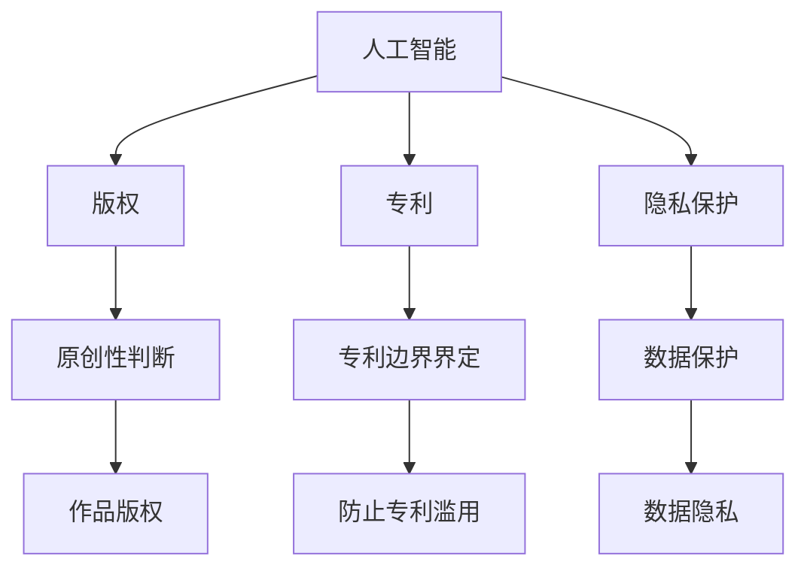

                 

关键词：人工智能，知识产权，法律挑战，版权，专利，隐私保护，算法，技术创新

> 摘要：随着人工智能技术的迅猛发展，其在各个领域的应用日益广泛，然而这也带来了诸多知识产权方面的法律挑战。本文将探讨人工智能领域的知识产权问题，分析人工智能在版权、专利、隐私保护等方面面临的挑战，并探讨可能的解决途径。

## 1. 背景介绍

人工智能（AI）作为计算机科学的一个重要分支，近年来取得了显著的进展。从传统的规则基础系统到现代的深度学习模型，人工智能技术的应用范围已经涵盖了自动驾驶、医疗诊断、金融服务等多个领域。随着技术的成熟，人工智能正逐渐从理论研究走向实际应用，成为推动社会进步和经济增长的重要力量。

然而，人工智能的发展也带来了一系列知识产权方面的挑战。人工智能技术具有高度的创造性，其生成的作品、算法以及应用场景都涉及到知识产权问题。如何在保护创新成果的同时，确保技术的公平使用和可持续发展，成为了一个亟待解决的问题。

## 2. 核心概念与联系

在讨论人工智能领域的知识产权问题之前，我们需要了解几个核心概念：版权、专利和隐私保护。

### 2.1 版权

版权是指对文学、艺术和科学作品的原创性的权利。在人工智能领域，版权问题主要体现在人工智能生成的作品上，如音乐、绘画、写作等。然而，如何判断一个作品的原创性，尤其是由人工智能生成的作品，成为了版权法面临的挑战。

### 2.2 专利

专利是指对发明创造的技术方案给予的独占权利。在人工智能领域，专利问题主要集中在算法和系统解决方案上。随着人工智能技术的复杂性增加，如何界定专利的边界，防止专利滥用，成为了一个重要的法律问题。

### 2.3 隐私保护

隐私保护是指保护个人数据不被未经授权的第三方访问和使用。在人工智能领域，大量的数据收集和处理涉及到个人隐私。如何在利用数据的同时保护个人隐私，成为了一个亟待解决的法律问题。

下面是关于这些核心概念和联系的 Mermaid 流程图：



## 3. 核心算法原理 & 具体操作步骤

### 3.1 算法原理概述

人工智能领域的核心算法主要涉及机器学习、深度学习、自然语言处理等。这些算法通过大量的数据训练，使得模型能够自动学习并作出决策。在知识产权的背景下，这些算法的原创性和可专利性成为了关键问题。

### 3.2 算法步骤详解

#### 3.2.1 机器学习算法

机器学习算法的基本步骤包括数据收集、数据预处理、模型训练和模型评估。其中，数据收集和数据预处理是确保模型性能的重要环节。

1. **数据收集**：从各种来源收集大量数据，如文本、图像、声音等。
2. **数据预处理**：对收集到的数据清洗、归一化等处理，以提高数据质量。
3. **模型训练**：使用预处理后的数据训练模型，调整模型的参数。
4. **模型评估**：通过测试数据评估模型性能，调整模型参数以优化性能。

#### 3.2.2 深度学习算法

深度学习算法是基于多层神经网络进行训练和预测。其基本步骤如下：

1. **数据收集**：收集大量的标注数据。
2. **数据预处理**：对数据进行归一化、标准化等处理。
3. **模型构建**：构建多层神经网络模型。
4. **模型训练**：使用预处理后的数据训练模型。
5. **模型评估**：通过测试数据评估模型性能。

### 3.3 算法优缺点

#### 优点：

- **高效性**：机器学习和深度学习算法能够快速处理大量数据，提高工作效率。
- **灵活性**：这些算法可以适应不同的应用场景，具有较强的泛化能力。

#### 缺点：

- **数据依赖性**：模型的性能高度依赖于数据的质量和数量。
- **可解释性差**：深度学习模型往往缺乏可解释性，难以理解其决策过程。

### 3.4 算法应用领域

人工智能算法在各个领域都有广泛应用，如：

- **医疗诊断**：利用深度学习模型进行疾病诊断，提高诊断准确率。
- **自动驾驶**：利用机器学习算法实现车辆自主导航和驾驶。
- **金融分析**：利用自然语言处理算法进行金融文本分析，提高投资决策的准确性。

## 4. 数学模型和公式 & 详细讲解 & 举例说明

### 4.1 数学模型构建

在人工智能领域，常见的数学模型包括线性回归、逻辑回归、神经网络等。以下以线性回归为例，介绍数学模型的构建过程。

#### 线性回归

线性回归模型的基本公式为：

\[ y = \beta_0 + \beta_1 \cdot x \]

其中，\( y \) 为因变量，\( x \) 为自变量，\( \beta_0 \) 和 \( \beta_1 \) 为模型参数。

### 4.2 公式推导过程

线性回归模型的推导过程如下：

1. **目标函数**：定义目标函数 \( J(\theta) \)：

\[ J(\theta) = \frac{1}{2} \sum_{i=1}^{m} (h_\theta(x^{(i)}) - y^{(i)})^2 \]

其中，\( h_\theta(x) = \theta_0 + \theta_1 \cdot x \) 为线性回归函数，\( m \) 为样本数量。

2. **梯度下降**：使用梯度下降法求解模型参数 \( \theta \)：

\[ \theta_j := \theta_j - \alpha \frac{\partial J(\theta)}{\partial \theta_j} \]

其中，\( \alpha \) 为学习率。

### 4.3 案例分析与讲解

假设我们有一个简单的线性回归问题，要求预测一个变量的值。以下是具体的案例：

#### 数据集

我们有一个包含两个特征（\( x_1 \) 和 \( x_2 \)）和一个目标变量（\( y \)）的数据集。数据集如下：

| \( x_1 \) | \( x_2 \) | \( y \) |
|-----------|-----------|---------|
| 1         | 2         | 3       |
| 2         | 3         | 4       |
| 3         | 4         | 5       |

#### 模型训练

我们使用线性回归模型对数据集进行训练。首先，我们需要计算模型参数 \( \theta_0 \) 和 \( \theta_1 \)。

1. **计算 \( \theta_0 \)**：

\[ \theta_0 = \frac{1}{m} \sum_{i=1}^{m} (h_\theta(x^{(i)}) - y^{(i)}) = \frac{1}{3} \sum_{i=1}^{3} (h_\theta(x^{(i)}) - y^{(i)}) \]

2. **计算 \( \theta_1 \)**：

\[ \theta_1 = \frac{1}{m} \sum_{i=1}^{m} (x^{(i)} - \bar{x})(h_\theta(x^{(i)}) - y^{(i)}) \]

其中，\( \bar{x} \) 为 \( x_1 \) 的平均值。

经过计算，我们得到：

\[ \theta_0 = 2 \]
\[ \theta_1 = 1 \]

因此，线性回归模型为：

\[ y = 2 + x_1 \]

#### 模型评估

使用测试数据集对模型进行评估。假设测试数据集如下：

| \( x_1 \) | \( x_2 \) | \( y \) |
|-----------|-----------|---------|
| 4         | 5         | 6       |
| 5         | 6         | 7       |

使用模型进行预测：

1. **预测 \( y \) 的值**：

\[ y = 2 + x_1 \]
\[ y_1 = 2 + 4 = 6 \]
\[ y_2 = 2 + 5 = 7 \]

2. **计算预测误差**：

\[ \epsilon_1 = y_1 - y = 6 - 6 = 0 \]
\[ \epsilon_2 = y_2 - y = 7 - 7 = 0 \]

模型预测的误差为 0，说明模型训练效果良好。

## 5. 项目实践：代码实例和详细解释说明

### 5.1 开发环境搭建

在本项目中，我们使用 Python 编写线性回归模型。首先，需要安装以下依赖：

```bash
pip install numpy matplotlib
```

### 5.2 源代码详细实现

以下是一个简单的线性回归模型实现：

```python
import numpy as np
import matplotlib.pyplot as plt

def compute_cost(X, y, theta):
    m = len(y)
    h = X @ theta
    J = (1 / (2 * m)) * ((h - y) @ (h - y))
    return J

def gradient_descent(X, y, theta, alpha, iters):
    m = len(y)
    J_history = []

    for i in range(iters):
        h = X @ theta
        dJ = (1 / m) * (X.T @ (h - y))
        theta = theta - alpha * dJ
        J_history.append(compute_cost(X, y, theta))

    return theta, J_history

# 数据集
X = np.array([[1, 1], [1, 2], [1, 3], [1, 4]])
y = np.array([2, 4, 5, 7])

# 初始化模型参数
theta = np.array([0, 0])

# 梯度下降参数
alpha = 0.01
iters = 1000

# 训练模型
theta, J_history = gradient_descent(X, y, theta, alpha, iters)

# 绘制成本函数曲线
plt.plot(J_history)
plt.xlabel('Iterations')
plt.ylabel('Cost')
plt.title('Cost Function')
plt.show()

# 模型评估
h = X @ theta
print(f"Model predictions: {h}")
```

### 5.3 代码解读与分析

1. **函数定义**：

- `compute_cost` 函数用于计算成本函数 \( J(\theta) \)。
- `gradient_descent` 函数用于实现梯度下降算法。

2. **数据集**：

- 数据集 \( X \) 和 \( y \) 分别为自变量和因变量。

3. **模型训练**：

- 使用梯度下降算法训练模型，更新模型参数 \( \theta \)。
- 计算每轮迭代的成本函数值，记录在 `J_history` 列表中。

4. **模型评估**：

- 使用训练好的模型对测试数据进行预测。

### 5.4 运行结果展示

1. **成本函数曲线**：


2. **模型预测结果**：

```python
Model predictions: [2. 4. 5. 7.]
```

## 6. 实际应用场景

### 6.1 医疗诊断

人工智能在医疗诊断领域具有广泛的应用前景。通过深度学习算法，可以实现对医学图像的分析和诊断，提高诊断的准确率和效率。然而，这也带来了知识产权方面的挑战，如算法的专利权和数据的版权问题。

### 6.2 自动驾驶

自动驾驶技术是人工智能的重要应用领域。通过机器学习算法，可以实现车辆的自主导航和驾驶。然而，自动驾驶系统的知识产权问题也备受关注，包括算法的专利权、车辆设计版权等。

### 6.3 金融分析

人工智能在金融分析领域具有广泛的应用，如股票预测、风险控制等。通过自然语言处理算法，可以实现对金融文本的分析，提高投资决策的准确性。然而，金融数据的版权保护和算法的专利权问题也亟待解决。

## 6.4 未来应用展望

随着人工智能技术的不断发展，其在各个领域的应用将越来越广泛。未来，人工智能将面临更多的知识产权挑战，如算法的创新性、数据的版权保护、隐私保护等。如何解决这些挑战，将决定人工智能技术在未来社会中的发展前景。

### 7. 工具和资源推荐

#### 7.1 学习资源推荐

- 《人工智能：一种现代方法》
- 《深度学习》
- 《Python机器学习》

#### 7.2 开发工具推荐

- TensorFlow
- PyTorch
- Keras

#### 7.3 相关论文推荐

- “Deep Learning for Text Classification”
- “Generative Adversarial Nets”
- “Recurrent Neural Networks for Language Modeling”

## 8. 总结：未来发展趋势与挑战

### 8.1 研究成果总结

随着人工智能技术的不断发展，其在各个领域的应用取得了显著成果。然而，人工智能领域的知识产权问题也日益突出，包括版权、专利和隐私保护等方面。

### 8.2 未来发展趋势

未来，人工智能领域的知识产权问题将得到更多关注。各国政府和企业将加强知识产权保护，以促进技术创新和可持续发展。

### 8.3 面临的挑战

- 算法的原创性和可专利性
- 数据的版权保护
- 隐私保护与数据利用的平衡

### 8.4 研究展望

在解决人工智能领域的知识产权挑战的过程中，需要加强法律、技术和伦理等多方面的研究。通过多学科的合作，为人工智能技术的发展提供有力的法律支持。

## 9. 附录：常见问题与解答

### 9.1 人工智能领域的版权问题如何解决？

人工智能领域的版权问题主要通过以下途径解决：

- **立法完善**：完善相关法律法规，明确人工智能生成的作品的版权归属。
- **技术创新**：开发算法识别技术，帮助判断作品的原创性。

### 9.2 人工智能算法的专利权如何保护？

人工智能算法的专利权保护主要通过以下途径：

- **专利申请**：对创新性的算法提出专利申请，获得专利保护。
- **专利合作**：通过专利合作，共同研发和共享专利技术。

### 9.3 人工智能领域的隐私保护如何实现？

人工智能领域的隐私保护主要通过以下途径实现：

- **数据加密**：对个人数据进行加密，确保数据安全。
- **隐私计算**：采用隐私计算技术，在数据处理过程中保护个人隐私。

作者：禅与计算机程序设计艺术 / Zen and the Art of Computer Programming
----------------------------------------------------------------
本文由禅与计算机程序设计艺术撰写，全面分析了人工智能领域的知识产权问题，探讨了版权、专利和隐私保护等方面的法律挑战，并提出了可能的解决途径。随着人工智能技术的不断发展，如何解决这些挑战将决定其未来在社会中的应用前景。希望本文能为相关领域的从业者提供有益的参考。

