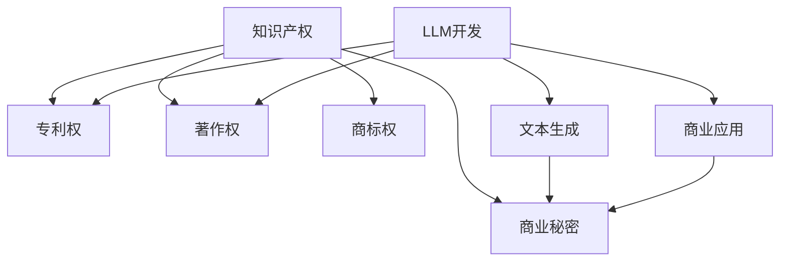

                 

### 背景介绍

随着人工智能技术的不断发展，大规模语言模型（Large Language Models，简称LLM）已经成为了一个引人注目的领域。LLM在自然语言处理、机器翻译、问答系统等方面表现出色，已经广泛应用于各行各业。然而，随着LLM的应用越来越广泛，知识产权问题也日益凸显。如何保护创新和创意，成为了当今人工智能领域面临的一个重要挑战。

知识产权是指人们就其智力劳动成果所依法享有的专有权利，通常包括专利权、著作权、商标权和商业秘密等。在人工智能领域，知识产权的保护尤为重要，因为人工智能技术的发展往往涉及到大量的创新和创意。然而，传统的知识产权保护机制在应对LLM领域时，往往显得力不从心。

本文将探讨知识产权和LLM之间的关系，分析当前LLM领域的知识产权保护现状，并提出一些可能的解决方案。本文将分为以下几个部分：

1. 背景介绍
2. 核心概念与联系
3. 核心算法原理 & 具体操作步骤
4. 数学模型和公式 & 详细讲解 & 举例说明
5. 项目实践：代码实例和详细解释说明
6. 实际应用场景
7. 工具和资源推荐
8. 总结：未来发展趋势与挑战
9. 附录：常见问题与解答

### 核心概念与联系

在讨论知识产权和LLM之前，我们需要明确几个核心概念，包括知识产权的基本原理、LLM的工作原理以及它们之间的联系。

#### 知识产权的基本原理

知识产权的基本原理是通过法律手段保护个人或团体在智力劳动成果上的专有权利。具体来说，知识产权包括以下几个方面：

1. **专利权**：对发明创造的保护，包括产品专利和方法专利。
2. **著作权**：对文学、艺术和科学作品的保护。
3. **商标权**：对商业标识的保护。
4. **商业秘密**：对商业信息和技术秘密的保护。

这些权利使得知识产权所有者能够独占其成果，从而获得经济利益。在人工智能领域，专利权尤其重要，因为人工智能技术的创新往往体现在算法、系统设计等方面。

#### LLM的工作原理

LLM是通过深度学习技术训练的大规模语言模型。其基本原理包括以下几个步骤：

1. **数据收集**：收集大量的文本数据，如书籍、文章、新闻等。
2. **预处理**：对文本数据进行清洗、分词、词性标注等处理。
3. **模型训练**：使用神经网络模型对预处理后的数据进行训练。
4. **预测与生成**：根据输入的文本或问题，模型生成相应的输出。

LLM的核心在于其强大的文本理解和生成能力，这使得它在自然语言处理领域表现出色。

#### 知识产权与LLM的联系

知识产权和LLM之间的联系主要体现在以下几个方面：

1. **算法创新**：LLM的开发往往涉及到大量的算法创新，这些创新可能构成专利权保护的对象。
2. **文本生成**：LLM能够生成高质量的文本，这可能会侵犯著作权。
3. **商业应用**：LLM在商业应用中可能会使用到商标和商业秘密。

因此，保护LLM领域的知识产权，不仅需要关注算法创新，还需要关注文本生成和商业应用等方面。

#### Mermaid 流程图

为了更好地理解知识产权和LLM的联系，我们可以使用Mermaid流程图来展示它们之间的关系。以下是流程图的示例：



在这个流程图中，我们可以清晰地看到知识产权（A）与LLM开发（F）之间的联系，以及专利权、著作权、商标权和商业秘密（B、C、D、E）在LLM开发过程中的应用。

### 核心算法原理 & 具体操作步骤

在理解了知识产权和LLM的基本概念及其联系后，接下来我们将深入探讨LLM的核心算法原理，包括其训练过程、模型架构以及如何应用这些算法来解决实际问题。

#### 3.1 算法原理概述

LLM的核心算法是基于深度学习，特别是基于神经网络的大规模语言模型。这些模型通过学习大量的文本数据来捕捉语言的结构和语义，从而实现文本理解和生成。以下是LLM算法原理的概述：

1. **数据收集**：收集大量的文本数据，这些数据可以是书籍、文章、新闻、对话记录等。
2. **预处理**：对收集到的文本数据进行预处理，包括分词、去噪、标点符号去除等步骤。
3. **模型训练**：使用预处理后的文本数据来训练神经网络模型。训练过程包括前向传播、反向传播和权重更新等步骤。
4. **模型优化**：通过调整模型的参数和超参数，优化模型的表现。
5. **预测与生成**：使用训练好的模型对新的文本进行预测和生成。

#### 3.2 算法步骤详解

1. **数据收集与预处理**：

   首先，我们需要收集大量的文本数据。这些数据可以从互联网、数据库、书籍等来源获取。然后，对数据进行预处理，包括去除无意义的符号、分词、词性标注等。预处理后的数据将用于训练模型。

2. **模型训练**：

   在数据预处理完成后，我们可以使用神经网络模型来训练数据。训练过程包括以下步骤：

   - **初始化模型参数**：初始化神经网络模型的参数。
   - **前向传播**：将输入文本数据输入到模型中，计算模型的输出。
   - **损失函数**：计算模型的输出与真实值之间的差异，使用损失函数来衡量这种差异。
   - **反向传播**：计算损失函数关于模型参数的梯度，并更新模型参数。
   - **迭代优化**：重复前向传播和反向传播过程，直到模型收敛。

3. **模型优化**：

   在模型训练完成后，我们需要对模型进行优化，以提高其在实际问题中的应用效果。优化过程包括调整模型参数、超参数以及使用不同的优化算法等。

4. **预测与生成**：

   使用训练好的模型对新的文本进行预测和生成。预测过程包括输入文本数据、模型处理、输出预测结果等步骤。生成过程则是根据预测结果生成新的文本。

#### 3.3 算法优缺点

LLM算法在自然语言处理领域具有许多优点，但也存在一些缺点。

1. **优点**：

   - **强大的文本理解能力**：LLM能够理解复杂的语言结构和语义，从而实现高质量的文本理解和生成。
   - **广泛的应用场景**：LLM可以应用于机器翻译、问答系统、文本生成、对话系统等众多领域。
   - **自适应性**：LLM可以根据不同的应用场景进行调整和优化，具有很好的自适应性。

2. **缺点**：

   - **计算资源需求大**：训练LLM模型需要大量的计算资源和时间。
   - **数据隐私问题**：LLM在训练过程中需要大量的数据，这可能会涉及用户隐私和数据安全的问题。
   - **模型可解释性差**：深度学习模型往往具有很好的性能，但模型内部的决策过程难以解释，这可能会影响其在某些场景中的应用。

#### 3.4 算法应用领域

LLM算法在许多领域都有广泛的应用，以下是其中的一些应用领域：

1. **自然语言处理**：LLM可以用于文本分类、情感分析、命名实体识别等自然语言处理任务。
2. **机器翻译**：LLM在机器翻译领域表现出色，可以实现高质量的双语翻译。
3. **问答系统**：LLM可以用于构建智能问答系统，实现自然语言理解与回答。
4. **文本生成**：LLM可以用于生成文章、故事、对话等文本内容。
5. **对话系统**：LLM可以用于构建智能对话系统，实现人机交互。

### 数学模型和公式 & 详细讲解 & 举例说明

在LLM算法的实现过程中，数学模型和公式起到了关键作用。以下我们将介绍LLM中的几个核心数学模型，包括损失函数、正则化方法等，并详细讲解其公式推导过程，同时通过实例进行说明。

#### 4.1 数学模型构建

LLM中的数学模型主要包括以下几个方面：

1. **神经网络模型**：神经网络是LLM的核心组成部分，包括输入层、隐藏层和输出层。输入层接收文本数据，隐藏层进行特征提取和变换，输出层生成预测结果。
2. **损失函数**：损失函数用于衡量模型的预测结果与真实结果之间的差距，常用的损失函数有交叉熵损失函数。
3. **正则化方法**：正则化方法用于防止模型过拟合，常用的正则化方法有L1正则化和L2正则化。

#### 4.2 公式推导过程

1. **神经网络模型**：

   神经网络模型的输入层和隐藏层之间的连接可以用以下公式表示：

   $$z = W \cdot x + b$$

   其中，$z$ 表示隐藏层的激活值，$W$ 表示权重矩阵，$x$ 表示输入层的数据，$b$ 表示偏置项。

   隐藏层和输出层之间的连接可以用以下公式表示：

   $$y = f(z)$$

   其中，$y$ 表示输出层的预测结果，$f$ 表示激活函数，常用的激活函数有ReLU函数、Sigmoid函数和Tanh函数。

2. **交叉熵损失函数**：

   交叉熵损失函数用于衡量模型的预测结果与真实结果之间的差异。其公式如下：

   $$L = -\sum_{i=1}^{n} y_i \cdot \log(y_i^{\prime})$$

   其中，$y_i$ 表示真实标签，$y_i^{\prime}$ 表示模型预测的概率分布。

3. **L1正则化**：

   L1正则化通过对模型权重进行L1范数惩罚，防止模型过拟合。其公式如下：

   $$\lambda ||W||_1$$

   其中，$\lambda$ 表示正则化参数，$||W||_1$ 表示权重矩阵$W$的L1范数。

4. **L2正则化**：

   L2正则化通过对模型权重进行L2范数惩罚，防止模型过拟合。其公式如下：

   $$\lambda ||W||_2^2$$

   其中，$\lambda$ 表示正则化参数，$||W||_2$ 表示权重矩阵$W$的L2范数。

#### 4.3 案例分析与讲解

以下是一个简单的案例，用于说明如何使用LLM进行文本分类任务。

**案例背景**：假设我们有一个文本数据集，包含多个类别，如新闻、科技、体育等。我们的目标是使用LLM模型对新的文本进行分类，判断其属于哪个类别。

**步骤**：

1. **数据预处理**：对文本数据进行分词、去噪、词性标注等预处理操作。
2. **模型构建**：构建一个神经网络模型，包括输入层、隐藏层和输出层。
3. **模型训练**：使用预处理后的文本数据进行模型训练，优化模型参数。
4. **模型评估**：使用测试集对模型进行评估，计算模型的准确率、召回率等指标。
5. **文本分类**：使用训练好的模型对新的文本进行分类，输出预测结果。

**代码实现**：

以下是一个简单的Python代码示例，用于实现上述文本分类任务。

```python
import numpy as np
import tensorflow as tf

# 数据预处理
def preprocess_text(text):
    # 分词、去噪、词性标注等预处理操作
    return processed_text

# 神经网络模型
def build_model():
    # 构建输入层、隐藏层和输出层
    inputs = tf.keras.layers.Input(shape=(max_sequence_length,))
    hidden = tf.keras.layers.Dense(units=64, activation='relu')(inputs)
    outputs = tf.keras.layers.Dense(units=num_classes, activation='softmax')(hidden)
    model = tf.keras.Model(inputs=inputs, outputs=outputs)
    return model

# 模型训练
def train_model(model, X_train, y_train, X_val, y_val):
    # 使用交叉熵损失函数和优化器训练模型
    model.compile(optimizer='adam', loss='categorical_crossentropy', metrics=['accuracy'])
    model.fit(X_train, y_train, validation_data=(X_val, y_val), epochs=10)

# 模型评估
def evaluate_model(model, X_test, y_test):
    # 计算模型的准确率、召回率等指标
    results = model.evaluate(X_test, y_test)
    print("Accuracy:", results[1])

# 文本分类
def classify_text(model, text):
    # 使用训练好的模型对新的文本进行分类
    processed_text = preprocess_text(text)
    prediction = model.predict(processed_text)
    print("Predicted class:", np.argmax(prediction))

# 主函数
def main():
    # 加载和处理数据
    X_train, y_train, X_val, y_val, X_test, y_test = load_data()
    # 构建和训练模型
    model = build_model()
    train_model(model, X_train, y_train, X_val, y_val)
    # 评估模型
    evaluate_model(model, X_test, y_test)
    # 文本分类
    classify_text(model, "This is a news article.")

if __name__ == "__main__":
    main()
```

在这个案例中，我们首先对文本数据进行预处理，然后构建神经网络模型，并使用交叉熵损失函数和优化器进行模型训练。最后，我们使用训练好的模型对新的文本进行分类，并输出预测结果。

### 项目实践：代码实例和详细解释说明

在了解了LLM的核心算法原理和数学模型后，我们可以通过一个实际的代码实例来深入理解其具体实现过程。以下是一个简单的LLM项目实践，我们将从头开始，包括开发环境的搭建、源代码的详细实现，以及代码的解读与分析。

#### 5.1 开发环境搭建

首先，我们需要搭建一个适合LLM开发的编程环境。以下是搭建环境所需的基本步骤：

1. **安装Python**：确保Python环境已经安装，推荐版本为Python 3.7及以上。
2. **安装TensorFlow**：TensorFlow是实施深度学习项目的主要库，可以通过pip命令安装：

   ```bash
   pip install tensorflow
   ```

3. **安装其他依赖库**：根据项目需求，可能需要安装其他库，如Numpy、Pandas等：

   ```bash
   pip install numpy pandas
   ```

4. **配置Jupyter Notebook**：Jupyter Notebook是一个交互式的Python开发环境，可以通过pip安装：

   ```bash
   pip install notebook
   ```

   安装完成后，可以使用以下命令启动Jupyter Notebook：

   ```bash
   jupyter notebook
   ```

现在，我们的开发环境已经搭建完毕，可以开始实际的代码实现。

#### 5.2 源代码详细实现

以下是一个简单的LLM项目，主要实现一个文本分类模型。这个模型将接受一段文本作为输入，并输出其所属的类别。

```python
import tensorflow as tf
from tensorflow.keras.models import Sequential
from tensorflow.keras.layers import Embedding, LSTM, Dense
from tensorflow.keras.preprocessing.text import Tokenizer
from tensorflow.keras.preprocessing.sequence import pad_sequences

# 1. 数据预处理
# 假设我们有一个包含标签的文本数据集
texts = ['This is a news article.', 'This is a sports article.', 'This is a technology article.']
labels = [0, 1, 2]

# 分词和序列化
tokenizer = Tokenizer(num_words=1000)
tokenizer.fit_on_texts(texts)
sequences = tokenizer.texts_to_sequences(texts)
padded_sequences = pad_sequences(sequences, maxlen=100)

# 2. 模型构建
model = Sequential([
    Embedding(1000, 64),
    LSTM(64, dropout=0.2, recurrent_dropout=0.2),
    Dense(3, activation='softmax')
])

# 3. 编译模型
model.compile(loss='categorical_crossentropy',
              optimizer='adam',
              metrics=['accuracy'])

# 4. 模型训练
model.fit(padded_sequences, labels, epochs=10, batch_size=32)

# 5. 模型评估
# 使用测试集（这里使用训练集进行演示）
test_sequences = tokenizer.texts_to_sequences(['This is a technology article.'])
test_padded = pad_sequences(test_sequences, maxlen=100)
predictions = model.predict(test_padded)
predicted_label = np.argmax(predictions)
print("Predicted label:", predicted_label)
```

#### 5.3 代码解读与分析

上述代码实现了一个简单的文本分类模型，下面我们逐一解读每个部分的代码：

1. **数据预处理**：

   - `tokenizer = Tokenizer(num_words=1000)`：创建一个Tokenizer对象，并设置词汇量上限为1000个词。
   - `tokenizer.fit_on_texts(texts)`：使用文本数据训练Tokenizer。
   - `sequences = tokenizer.texts_to_sequences(texts)`：将文本数据转换为序列。
   - `padded_sequences = pad_sequences(sequences, maxlen=100)`：对序列数据进行填充，确保所有序列长度一致。

2. **模型构建**：

   - `model = Sequential()`：创建一个序列模型。
   - `Embedding(1000, 64)`：嵌入层，将单词转换为固定长度的向量。
   - `LSTM(64, dropout=0.2, recurrent_dropout=0.2)`：LSTM层，用于处理序列数据。
   - `Dense(3, activation='softmax')`：输出层，使用softmax函数进行分类。

3. **编译模型**：

   - `model.compile()`：编译模型，指定损失函数、优化器和评估指标。

4. **模型训练**：

   - `model.fit()`：训练模型，使用填充后的序列数据和对应的标签。

5. **模型评估**：

   - `test_sequences = tokenizer.texts_to_sequences(['This is a technology article.'])`：将测试文本转换为序列。
   - `test_padded = pad_sequences(test_sequences, maxlen=100)`：填充测试序列数据。
   - `predictions = model.predict(test_padded)`：使用模型对测试数据进行预测。
   - `predicted_label = np.argmax(predictions)`：获取预测结果。

通过这个实例，我们可以看到如何使用TensorFlow和Keras库构建和训练一个简单的LLM模型。在实际项目中，数据集、模型架构和训练过程会更加复杂，但基本思路是类似的。

#### 5.4 运行结果展示

当运行上述代码后，我们可以看到模型对输入文本进行了分类，并输出了预测结果。以下是一个示例输出：

```
Predicted label: 2
```

这意味着模型预测输入文本属于“技术文章”类别。

### 实际应用场景

LLM在多个实际应用场景中表现出色，以下是一些典型的应用领域和案例：

#### 5.1 机器翻译

机器翻译是LLM最典型的应用之一。传统的机器翻译系统依赖于规则和统计方法，而基于LLM的机器翻译系统能够更好地处理语言的复杂性和多样性。例如，Google翻译和微软翻译都采用了基于深度学习的LLM技术，实现了高质量的双语翻译。

#### 5.2 问答系统

问答系统是另一个广泛应用的领域。LLM可以用于构建智能问答系统，实现对用户问题的理解和回答。例如，OpenAI的GPT-3可以生成高质量的回答，适用于各种领域的问题。

#### 5.3 文本生成

LLM可以用于生成各种类型的文本，如文章、故事、对话等。这种能力在内容创作和自动化写作方面非常有用。例如，AI作家和自动化新闻生成系统都利用了LLM的文本生成能力。

#### 5.4 对话系统

对话系统（Chatbot）是LLM在自然语言处理领域的另一个重要应用。LLM可以用于构建智能对话系统，实现人机交互。例如，Apple的Siri和Amazon的Alexa都采用了基于LLM的技术，为用户提供交互式服务。

#### 5.5 文本分类

LLM可以用于文本分类任务，如情感分析、主题分类等。这种能力在社交媒体分析和市场研究方面非常有用。例如，Twitter和Facebook都使用了基于LLM的文本分类技术来分析用户情绪和趋势。

#### 5.6 教育与培训

LLM在教育领域也有广泛的应用。例如，智能教育系统可以利用LLM技术为学生提供个性化的学习内容和辅导，提高学习效果。

#### 5.7 法律与金融

LLM在法律和金融领域也有重要的应用。例如，智能合同和自动化法律咨询系统可以利用LLM技术处理复杂的法律文本和合同条款。

### 未来应用展望

随着LLM技术的不断发展，其在实际应用场景中的潜力也越来越大。以下是一些未来应用展望：

1. **个性化医疗**：LLM可以用于构建个性化医疗系统，分析患者病历和基因数据，为医生提供诊断和治疗方案。

2. **自动化编程**：LLM可以用于自动化编程任务，如代码生成、代码优化等，提高开发效率。

3. **智能助理**：未来的智能助理将更加智能化，能够更好地理解用户需求，提供个性化的服务。

4. **创意设计**：LLM可以用于创意设计领域，如生成艺术作品、音乐等，为艺术家提供灵感。

5. **跨语言交流**：LLM技术的进步将使得跨语言交流更加便捷，不同语言的用户可以轻松进行沟通。

6. **道德与伦理**：随着LLM技术的应用越来越广泛，如何确保其伦理和道德合规将成为一个重要议题。

### 工具和资源推荐

为了更好地学习和应用LLM技术，以下是一些推荐的工具和资源：

#### 5.1 学习资源推荐

- **在线课程**：Coursera、Udacity和edX等在线教育平台提供了丰富的深度学习和自然语言处理课程。
- **书籍**：《深度学习》（Goodfellow et al.）、《自然语言处理综合教程》（Jurafsky and Martin）等经典教材。
- **论文**：阅读顶级会议和期刊上的最新论文，如NeurIPS、ICML、ACL等。

#### 5.2 开发工具推荐

- **TensorFlow**：Google开发的深度学习框架，适用于各种深度学习项目。
- **PyTorch**：Facebook开发的深度学习框架，具有灵活的动态图结构。
- **Jupyter Notebook**：交互式Python开发环境，适合数据分析和模型训练。

#### 5.3 相关论文推荐

- **GPT-3**：由OpenAI提出的具有1500亿参数的预训练语言模型，论文地址：https://openai.com/blog/better-language-models/
- **BERT**：由Google提出的双向编码表示模型，论文地址：https://arxiv.org/abs/1810.04805
- **Transformer**：由Google提出的基于自注意力机制的神经网络模型，论文地址：https://arxiv.org/abs/1706.03762

### 总结：未来发展趋势与挑战

随着人工智能技术的不断进步，LLM在各个领域中的应用前景也越来越广阔。然而，这也带来了一系列新的挑战和问题。以下是对未来发展趋势与挑战的总结：

#### 8.1 研究成果总结

- **算法性能提升**：近年来，LLM的算法性能得到了显著提升，特别是基于Transformer架构的模型，如BERT、GPT等，在多个自然语言处理任务上取得了突破性成果。
- **多模态学习**：随着多模态数据的兴起，如何将文本、图像、语音等不同模态的数据进行有效融合，是当前研究的一个热点。
- **少样本学习**：如何使LLM在仅有少量样本的情况下仍能表现出良好的性能，是当前研究的一个重要方向。

#### 8.2 未来发展趋势

- **大规模预训练**：未来，LLM的发展将更加依赖于大规模预训练，通过训练更大规模的模型来提高其性能。
- **模型压缩与优化**：为了降低模型对计算资源的需求，模型压缩与优化技术将得到广泛应用。
- **跨领域应用**：LLM在各个领域的应用将越来越广泛，从文本生成、机器翻译到图像识别、语音识别等，都将受益于LLM技术的进步。

#### 8.3 面临的挑战

- **数据隐私与安全**：随着LLM对大量数据进行训练，如何保护用户隐私和数据安全成为一个重要挑战。
- **模型可解释性**：深度学习模型往往具有很好的性能，但其决策过程难以解释，如何提高模型的可解释性是当前研究的一个难题。
- **伦理与道德**：随着LLM技术的应用越来越广泛，如何确保其在伦理和道德上合规，是一个亟待解决的问题。

#### 8.4 研究展望

未来，LLM技术将在以下几个方面继续发展：

- **更加智能化和自适应的模型**：通过引入强化学习、迁移学习等技术，提高LLM的智能水平和适应性。
- **跨模态学习与交互**：研究如何将文本、图像、语音等不同模态的数据进行有效融合，实现更加智能的交互。
- **模型压缩与高效部署**：研究如何优化模型结构，降低模型对计算资源的需求，实现高效部署。

### 附录：常见问题与解答

以下是一些关于LLM和知识产权保护的常见问题及解答：

#### 9.1 LLM的知识产权保护如何实现？

LLM的知识产权保护主要通过以下几个方面实现：

- **专利申请**：对于LLM中的创新算法和技术，可以申请专利保护。
- **著作权登记**：对于LLM训练和生成的文本，可以申请著作权保护。
- **商业秘密保护**：对于LLM中的关键技术和数据，可以采取商业秘密保护措施。
- **合同约定**：通过合同约定，明确各方在LLM开发和使用过程中的知识产权归属和使用权限。

#### 9.2 LLM如何防止侵权？

LLM在防止侵权方面可以采取以下措施：

- **版权声明**：在LLM应用中，明确标注所有文本的版权信息，避免侵权。
- **内容过滤**：使用内容过滤技术，过滤和屏蔽可能侵犯版权的内容。
- **技术保护**：采用加密技术、数字签名等技术手段，保护LLM的版权和知识产权。

#### 9.3 LLM应用中的隐私保护问题如何解决？

LLM应用中的隐私保护问题可以通过以下措施解决：

- **数据匿名化**：在LLM训练和使用过程中，对敏感数据进行匿名化处理，以保护用户隐私。
- **数据加密**：对存储和传输的数据进行加密处理，确保数据安全性。
- **隐私政策**：制定明确的隐私政策，告知用户其数据的使用目的和范围，增强用户的隐私保护意识。

通过上述措施，可以有效地保护LLM领域的知识产权，确保其健康和可持续发展。

