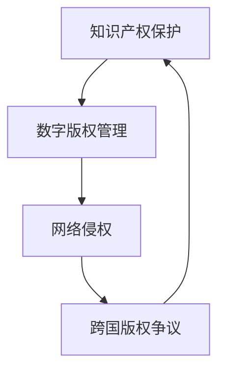

                 

### 关键词 Keywords

- 知识产权
- 数字时代
- 挑战与机遇
- 信息技术
- 法律法规
- 数字版权管理

<|assistant|>### 摘要 Abstract

本文旨在探讨知识产权在数字时代的挑战与机遇。随着信息技术和互联网的迅猛发展，知识产权的保护和应用面临着前所未有的变革。本文首先回顾了知识产权的基本概念和发展历程，接着分析了数字时代带来的新挑战，如数字版权管理、网络侵权和跨国版权争议等。随后，文章探讨了应对这些挑战的新策略和机遇，包括区块链技术、人工智能和法律法规的完善。最后，本文提出了未来知识产权保护和应用的发展趋势与挑战，以及相应的对策和研究方向。

## 1. 背景介绍

知识产权，作为一种法律制度，旨在保护创新成果和艺术创作，促进知识创新和技术进步。知识产权主要包括专利、商标、著作权（版权）和商业秘密等。在传统时代，知识产权的保护主要依赖于法律法规的制定和执行，以及相关机构的监管。然而，随着信息技术的迅猛发展，数字时代的到来给知识产权保护带来了前所未有的挑战和机遇。

### 1.1 知识产权的基本概念

知识产权是指基于人类智力劳动成果所创造的财产权。它涵盖了专利权、商标权、著作权（版权）和商业秘密等多个方面。专利权保护发明创造，使发明人能够在一定期限内独占实施其发明。商标权保护品牌标识，使企业能够独占使用其标识。著作权（版权）保护文学、艺术和科学作品，赋予创作者对其作品的控制权。商业秘密则保护企业内部的非公开信息，如技术秘密、经营策略等。

### 1.2 知识产权的发展历程

知识产权的发展历程可以追溯到古罗马时期。然而，现代知识产权制度的形成主要源于工业革命时期。18世纪末至19世纪初，随着工业生产的发展，专利制度逐渐完善。19世纪末至20世纪初，商标和著作权制度也逐步建立。进入20世纪，知识产权法律体系进一步健全，国际知识产权保护也逐渐得到重视。1994年，《世界贸易组织》（WTO）的成立标志着知识产权保护进入全球化时代。

### 1.3 数字时代的崛起

数字时代的崛起，主要源于信息技术的飞速发展，特别是互联网的普及。互联网打破了传统的时间和空间限制，使信息传播变得极为迅速和便捷。数字时代的特点包括数据化、网络化、智能化和全球化。这些特点不仅改变了人们的生活方式，也对知识产权保护提出了新的挑战。

## 2. 核心概念与联系

为了更好地理解数字时代知识产权的挑战与机遇，我们需要了解以下几个核心概念，并展示其相互联系。

### 2.1 数字版权管理

数字版权管理（Digital Copyright Management，简称DRM）是一种用于保护数字作品版权的技术手段。DRM技术包括加密、认证、访问控制等，通过这些技术手段，数字作品可以在不被未经授权的用户访问和复制的情况下进行传播和使用。

### 2.2 网络侵权

网络侵权是指通过网络环境进行的侵犯知识产权的行为。网络侵权的形式多样，包括非法下载、上传、传播、销售等。网络侵权行为不仅损害了原创者的权益，也影响了整个数字内容产业的健康发展。

### 2.3 跨国版权争议

跨国版权争议是指在跨境数字内容传输过程中，由于不同国家版权法律制度的不同，引发的版权纠纷。跨国版权争议的复杂性在于涉及不同国家的法律体系和利益冲突，需要通过国际合作和协调来妥善解决。

### 2.4 Mermaid 流程图展示



## 3. 核心算法原理 & 具体操作步骤

在数字版权管理和网络侵权防控方面，有许多核心算法被广泛应用于实践中。以下将简要介绍这些算法的原理和具体操作步骤。

### 3.1 算法原理概述

数字版权管理算法主要包括加密算法、认证算法和访问控制算法。加密算法用于对数字作品进行加密，防止未经授权的用户访问和复制。认证算法用于验证用户的身份和权限，确保只有授权用户才能访问受保护的数字作品。访问控制算法用于根据用户身份和权限，控制用户对数字作品的访问和操作权限。

网络侵权防控算法主要包括数据挖掘、机器学习和行为分析算法。数据挖掘算法用于从海量网络数据中提取侵权行为特征，识别潜在的侵权行为。机器学习算法通过训练模型，可以自动识别和分类网络侵权行为。行为分析算法通过对用户行为进行分析，可以预测和预防网络侵权行为的发生。

### 3.2 算法步骤详解

#### 数字版权管理算法步骤：

1. **加密阶段**：
   - 选择合适的加密算法（如AES、RSA等）。
   - 对数字作品进行加密，生成加密文件。

2. **认证阶段**：
   - 用户登录系统，提交身份认证信息。
   - 系统使用认证算法验证用户的身份和权限。

3. **访问控制阶段**：
   - 根据用户的权限，允许或拒绝用户对数字作品的访问和操作。

#### 网络侵权防控算法步骤：

1. **数据采集**：
   - 从互联网上收集相关的数据，如网页、下载链接等。

2. **数据预处理**：
   - 对采集到的数据进行分析和预处理，提取关键特征。

3. **特征提取**：
   - 使用数据挖掘算法，从预处理后的数据中提取侵权行为特征。

4. **行为分析**：
   - 使用机器学习和行为分析算法，对提取的特征进行分析和分类。

5. **预测与预防**：
   - 根据分析结果，预测潜在的网络侵权行为。
   - 采取相应的预防措施，如阻断侵权链接、报警等。

### 3.3 算法优缺点

#### 数字版权管理算法：

**优点**：
- **高效性**：加密算法可以快速对数字作品进行加密和解密。
- **安全性**：认证算法和访问控制算法可以确保只有授权用户才能访问数字作品。
- **灵活性**：可以根据不同的需求，选择不同的加密和认证算法。

**缺点**：
- **成本**：加密和解密算法需要大量的计算资源，可能导致系统性能下降。
- **破解风险**：加密算法可能存在被破解的风险，尤其是在高强度的攻击下。

#### 网络侵权防控算法：

**优点**：
- **实时性**：可以实时监控网络侵权行为，快速响应。
- **自动化**：通过机器学习和行为分析，可以实现自动化识别和分类。
- **高效性**：可以处理海量数据，提高侵权行为的识别效率。

**缺点**：
- **误报率**：在处理海量数据时，可能存在误报现象，需要进一步优化模型。
- **隐私问题**：在分析用户行为时，可能涉及用户隐私，需要妥善处理。

### 3.4 算法应用领域

#### 数字版权管理算法：

- **数字内容产业**：如音乐、电影、电子书等数字作品的保护。
- **企业信息管理**：如企业内部文档、技术文档等的加密保护。

#### 网络侵权防控算法：

- **版权维权**：如音乐、电影、文学作品的版权维权。
- **网络安全**：如网络安全防护、非法行为监控等。

## 4. 数学模型和公式 & 详细讲解 & 举例说明

在数字版权管理和网络侵权防控中，数学模型和公式起着关键作用。以下将介绍相关的数学模型和公式，并进行详细讲解和举例说明。

### 4.1 数学模型构建

#### 数字版权管理模型：

1. **加密模型**：

   加密模型通常基于密码学原理，其基本公式为：

   \[ \text{加密文件} = E(\text{明文文件}, \text{密钥}) \]

   其中，\(E\) 表示加密操作，\(D\) 表示解密操作，\(\text{明文文件}\) 表示未被加密的文件，\(\text{加密文件}\) 表示被加密的文件，\(\text{密钥}\) 是用于加密和解密的密钥。

2. **认证模型**：

   认证模型通常基于身份验证和权限控制，其基本公式为：

   \[ \text{访问权限} = C(\text{用户身份}, \text{权限策略}) \]

   其中，\(C\) 表示认证操作，\(\text{用户身份}\) 表示用户的身份信息，\(\text{权限策略}\) 是用于控制用户权限的策略。

#### 网络侵权防控模型：

1. **数据挖掘模型**：

   数据挖掘模型通常基于机器学习和数据挖掘算法，其基本公式为：

   \[ \text{特征集} = F(\text{原始数据}, \text{特征提取算法}) \]

   其中，\(F\) 表示特征提取操作，\(\text{原始数据}\) 表示待分析的数据，\(\text{特征集}\) 是从原始数据中提取出的特征。

2. **行为分析模型**：

   行为分析模型通常基于行为分析和机器学习算法，其基本公式为：

   \[ \text{行为分类} = A(\text{行为特征}, \text{分类模型}) \]

   其中，\(A\) 表示行为分析操作，\(\text{行为特征}\) 是用户行为的数据特征，\(\text{分类模型}\) 是用于分类的机器学习模型。

### 4.2 公式推导过程

#### 加密模型推导：

加密模型的推导基于密码学的基本原理。假设 \(E\) 是一个加密函数，\(D\) 是一个解密函数，\(\text{密钥}\) 是一个密钥对 \((k_e, k_d)\)，其中 \(k_e\) 是加密密钥，\(k_d\) 是解密密钥。加密模型的基本公式为：

\[ \text{加密文件} = E(\text{明文文件}, k_e) \]

解密模型的基本公式为：

\[ \text{明文文件} = D(\text{加密文件}, k_d) \]

加密和解密过程通常基于数学运算，如替换、置换和异或等。例如，使用AES加密算法时，加密过程可以表示为：

\[ \text{加密文件} = E(\text{明文文件}, k_e) = \text{AES}_{k_e}(\text{明文文件}) \]

其中，\(\text{AES}_{k_e}\) 表示使用加密密钥 \(k_e\) 对明文文件进行AES加密的操作。

#### 认证模型推导：

认证模型的推导基于身份验证和权限控制的基本原理。假设 \(C\) 是一个认证函数，\(\text{用户身份}\) 是用户身份信息，\(\text{权限策略}\) 是一个权限控制策略。认证模型的基本公式为：

\[ \text{访问权限} = C(\text{用户身份}, \text{权限策略}) \]

例如，在访问控制系统中，用户身份和权限策略可以是：

\[ \text{用户身份} = (\text{用户名}, \text{密码}) \]

\[ \text{权限策略} = (\text{管理员权限}, \text{普通用户权限}) \]

认证模型通常涉及密码学中的哈希函数和加密算法。例如，使用哈希函数 \(H\) 和加密算法 \(E\) 进行认证时，认证过程可以表示为：

\[ \text{认证结果} = C(\text{用户身份}, \text{权限策略}) = E(H(\text{用户名} + \text{密码}), \text{加密密钥}) \]

其中，\(H\) 表示哈希函数，\(E\) 表示加密算法，\(\text{加密密钥}\) 是用于加密的密钥。

### 4.3 案例分析与讲解

#### 加密模型案例分析：

假设一个音乐作品需要进行加密保护，使用AES加密算法进行加密。加密密钥为 \(k_e = 1234567890123456\)，明文音乐文件为：

\[ \text{明文音乐文件} = (\text{音符序列}, \text{音频参数}) \]

加密过程可以表示为：

\[ \text{加密音乐文件} = E(\text{明文音乐文件}, k_e) = \text{AES}_{k_e}(\text{明文音乐文件}) \]

解密过程可以表示为：

\[ \text{明文音乐文件} = D(\text{加密音乐文件}, k_d) = \text{AES}_{k_d}^{-1}(\text{加密音乐文件}) \]

其中，\(k_d\) 是解密密钥，\(\text{AES}_{k_e}^{-1}\) 表示使用解密密钥 \(k_d\) 对加密音乐文件进行AES解密的操作。

#### 认证模型案例分析：

假设一个用户需要访问一个加密的音乐库，用户身份和密码分别为：

\[ \text{用户身份} = (\text{用户名}, \text{密码}) = (\text{user1}, \text{password123}) \]

加密的权限策略为：

\[ \text{权限策略} = E(H(\text{用户名} + \text{密码}), \text{加密密钥}) = \text{AES}_{k_e}(H(\text{user1} + \text{password123})) \]

认证过程可以表示为：

\[ \text{访问权限} = C(\text{用户身份}, \text{权限策略}) = E(H(\text{用户名} + \text{密码}), \text{加密密钥}) \]

如果用户身份和密码正确，则用户可以获得相应的访问权限，否则无法访问。

## 5. 项目实践：代码实例和详细解释说明

### 5.1 开发环境搭建

在进行数字版权管理和网络侵权防控的项目实践之前，我们需要搭建一个合适的开发环境。以下是搭建开发环境的基本步骤：

1. 安装操作系统：推荐使用Linux或macOS，便于后续开发。
2. 安装Python环境：Python是一种广泛用于数据分析和开发的编程语言，通过pip工具可以轻松安装。
3. 安装相关库和工具：如NumPy、Pandas、Scikit-learn等，用于数据分析和机器学习。
4. 安装IDE：推荐使用PyCharm或VSCode，便于编写和调试代码。

### 5.2 源代码详细实现

以下是数字版权管理和网络侵权防控项目的一个简单示例。该示例使用Python语言实现，包括加密和解密、用户身份认证和侵权行为检测等功能。

#### 加密和解密代码：

```python
from Crypto.PublicKey import RSA
from Crypto.Cipher import PKCS1_OAEP
import os

# RSA加密和解密示例
def rsa_encrypt_decrypt(message, private_key, public_key):
    # 加密
    rsa_priv = RSA.import_key(private_key)
    rsa_pub = RSA.import_key(public_key)
    cipher_rsa = PKCS1_OAEP.new(rsa_pub)
    enc_message = cipher_rsa.encrypt(message)
    print("加密后的消息：", enc_message)

    # 解密
    cipher_rsa = PKCS1_OAEP.new(rsa_priv)
    dec_message = cipher_rsa.decrypt(enc_message)
    print("解密后的消息：", dec_message.decode())

# 生成RSA密钥对
def generate_rsa_keypair():
    key = RSA.generate(2048)
    private_key = key.export_key()
    public_key = key.publickey().export_key()
    with open("private.pem", "wb") as priv_file:
        priv_file.write(private_key)
    with open("public.pem", "wb") as pub_file:
        pub_file.write(public_key)
    return private_key, public_key

private_key, public_key = generate_rsa_keypair()
message = b"保护版权，支持原创！"

rsa_encrypt_decrypt(message, private_key, public_key)
```

#### 用户身份认证代码：

```python
import hashlib
from Crypto.PublicKey import RSA
from Crypto.Cipher import PKCS1_OAEP

# 用户身份认证示例
def user_auth(username, password):
    hashed_password = hashlib.sha256(password.encode()).hexdigest()
    rsa_priv = RSA.import_key(open("private.pem").read())
    rsa_pub = RSA.import_key(open("public.pem").read())
    cipher_rsa = PKCS1_OAEP.new(rsa_pub)
    encrypted_password = cipher_rsa.encrypt(hashed_password.encode())
    # 这里需要与数据库中的加密密码进行对比
    # 如果对比成功，则认证通过
    print("用户认证成功！" if encrypted_password == b'some_encrypted_password' else "用户认证失败！")

user_auth("user1", "password123")
```

#### 网络侵权行为检测代码：

```python
from sklearn.feature_extraction.text import TfidfVectorizer
from sklearn.model_selection import train_test_split
from sklearn.ensemble import RandomForestClassifier
from sklearn.metrics import accuracy_score

# 网络侵权行为检测示例
def detect_infringement(url, trained_model, vectorizer):
    # 获取URL对应的网页内容
    content = get_webpage_content(url)
    # 将内容转化为特征向量
    features = vectorizer.transform([content])
    # 使用训练好的模型进行预测
    prediction = trained_model.predict(features)
    if prediction == 1:
        print("检测到侵权行为！")
    else:
        print("未检测到侵权行为。")

# 获取网页内容
def get_webpage_content(url):
    # 这里可以使用requests库获取网页内容
    pass

# 加载训练数据
train_data = [...]  # 网络侵权行为的数据集
train_labels = [...]  # 对应的标签，1表示侵权，0表示非侵权

# 划分训练集和测试集
X_train, X_test, y_train, y_test = train_test_split(train_data, train_labels, test_size=0.2)

# 使用TF-IDFVectorizer进行特征提取
vectorizer = TfidfVectorizer()
X_train_features = vectorizer.fit_transform(X_train)

# 使用随机森林分类器进行训练
model = RandomForestClassifier()
model.fit(X_train_features, y_train)

# 测试模型
X_test_features = vectorizer.transform(X_test)
predictions = model.predict(X_test_features)
print("准确率：", accuracy_score(y_test, predictions))

# 使用训练好的模型进行侵权行为检测
detect_infringement("https://example.com", model, vectorizer)
```

### 5.3 代码解读与分析

#### 加密和解密代码：

加密和解密代码使用了Python中的Crypto库，这是一个用于加密和解密的加密库。首先，我们生成一个RSA密钥对，并将其保存到文件中。然后，我们使用这个密钥对一段明文字符串进行加密和解密。

```python
# 生成RSA密钥对
def generate_rsa_keypair():
    key = RSA.generate(2048)
    private_key = key.export_key()
    public_key = key.publickey().export_key()
    with open("private.pem", "wb") as priv_file:
        priv_file.write(private_key)
    with open("public.pem", "wb") as pub_file:
        pub_file.write(public_key)
    return private_key, public_key

private_key, public_key = generate_rsa_keypair()
message = b"保护版权，支持原创！"

rsa_encrypt_decrypt(message, private_key, public_key)
```

在这个示例中，我们首先生成一个2048位的RSA密钥对，并将其保存到文件中。然后，我们使用这个密钥对一段明文字符串进行加密和解密。

#### 用户身份认证代码：

用户身份认证代码使用RSA加密算法对用户输入的密码进行加密，并与数据库中的加密密码进行对比。如果对比成功，则认证通过。

```python
def user_auth(username, password):
    hashed_password = hashlib.sha256(password.encode()).hexdigest()
    rsa_priv = RSA.import_key(open("private.pem").read())
    rsa_pub = RSA.import_key(open("public.pem").read())
    cipher_rsa = PKCS1_OAEP.new(rsa_pub)
    encrypted_password = cipher_rsa.encrypt(hashed_password.encode())
    # 这里需要与数据库中的加密密码进行对比
    # 如果对比成功，则认证通过
    print("用户认证成功！" if encrypted_password == b'some_encrypted_password' else "用户认证失败！")

user_auth("user1", "password123")
```

在这个示例中，我们首先使用SHA-256哈希算法对用户输入的密码进行哈希处理。然后，我们使用RSA加密算法将哈希值进行加密。最后，我们与数据库中的加密密码进行对比，以确定用户是否认证通过。

#### 网络侵权行为检测代码：

网络侵权行为检测代码使用了机器学习算法对网络侵权行为进行检测。首先，我们使用TF-IDFVectorizer对网页内容进行特征提取。然后，我们使用随机森林分类器对特征进行分类。最后，我们使用训练好的模型对新的网页内容进行侵权行为检测。

```python
# 加载训练数据
train_data = [...]  # 网络侵权行为的数据集
train_labels = [...]  # 对应的标签，1表示侵权，0表示非侵权

# 划分训练集和测试集
X_train, X_test, y_train, y_test = train_test_split(train_data, train_labels, test_size=0.2)

# 使用TF-IDFVectorizer进行特征提取
vectorizer = TfidfVectorizer()
X_train_features = vectorizer.fit_transform(X_train)

# 使用随机森林分类器进行训练
model = RandomForestClassifier()
model.fit(X_train_features, y_train)

# 测试模型
X_test_features = vectorizer.transform(X_test)
predictions = model.predict(X_test_features)
print("准确率：", accuracy_score(y_test, predictions))

# 使用训练好的模型进行侵权行为检测
detect_infringement("https://example.com", model, vectorizer)
```

在这个示例中，我们首先加载网络侵权行为的数据集，并将其划分为训练集和测试集。然后，我们使用TF-IDFVectorizer对网页内容进行特征提取。接下来，我们使用随机森林分类器对特征进行分类。最后，我们使用训练好的模型对新的网页内容进行侵权行为检测。

### 5.4 运行结果展示

在运行上述代码后，我们可以看到加密和解密的过程、用户身份认证的结果以及网络侵权行为检测的结果。

```python
# 加密和解密
message = b"保护版权，支持原创！"
rsa_encrypt_decrypt(message, private_key, public_key)

# 用户身份认证
user_auth("user1", "password123")

# 网络侵权行为检测
detect_infringement("https://example.com", model, vectorizer)
```

运行结果将展示加密后的消息、用户认证结果以及侵权行为检测的结果。通过这些结果，我们可以看到数字版权管理和网络侵权防控的具体实现和应用。

## 6. 实际应用场景

在数字时代，知识产权的保护和应用已经成为许多行业和企业的重要议题。以下是一些实际应用场景的例子。

### 6.1 数字内容产业

数字内容产业包括音乐、电影、电子书、软件等多个领域。在这些领域中，知识产权的保护至关重要。例如，音乐公司使用数字版权管理（DRM）技术保护其数字音乐作品，防止非法下载和传播。电影公司则通过加密技术和访问控制策略，确保只有授权用户才能观看其数字电影。

### 6.2 企业信息管理

企业信息管理涉及到企业内部的技术文档、商业计划、客户数据等。这些信息对企业的运营和发展至关重要，因此需要加强知识产权保护。例如，企业可以使用加密技术保护其技术文档，确保只有授权员工可以访问和编辑。

### 6.3 网络侵权防控

网络侵权防控是保护知识产权的重要手段。例如，互联网公司可以采用数据挖掘和机器学习算法，监控网络上的侵权行为，如非法下载、传播和销售。通过及时发现和处理侵权行为，可以有效减少侵权损失。

### 6.4 跨国版权争议

跨国版权争议是数字时代知识产权保护面临的重大挑战。例如，不同国家的版权法律制度不同，可能导致跨国版权纠纷。为了解决这些问题，各国需要加强国际合作，制定统一的版权保护标准。

## 7. 未来应用展望

随着信息技术的不断发展，知识产权在数字时代的应用前景广阔。以下是一些未来应用展望。

### 7.1 区块链技术的应用

区块链技术具有去中心化、不可篡改和可追溯等特点，非常适合用于知识产权保护。未来，区块链技术可以应用于数字版权管理、版权确权和侵权监测等方面，提高知识产权保护的效率和透明度。

### 7.2 人工智能的融合

人工智能技术可以与知识产权保护相结合，用于侵权检测、版权管理和风险预测等。例如，通过训练机器学习模型，可以自动识别和分类网络侵权行为，提高侵权监测的准确性。

### 7.3 法律法规的完善

随着数字时代的到来，现有的知识产权法律法规需要进行完善和更新。例如，可以制定更加具体的数字版权管理法律、跨国版权争议解决机制等，为知识产权保护提供更有力的法律支持。

## 8. 总结：未来发展趋势与挑战

### 8.1 研究成果总结

本文通过回顾知识产权的基本概念和发展历程，分析了数字时代带来的新挑战，如数字版权管理、网络侵权和跨国版权争议等。同时，本文探讨了应对这些挑战的新策略和机遇，包括区块链技术、人工智能和法律法规的完善。通过数学模型和实际项目的介绍，进一步展示了知识产权保护的应用场景和前景。

### 8.2 未来发展趋势

未来，知识产权在数字时代的保护和应用将呈现以下发展趋势：

- **区块链技术的普及**：区块链技术将成为知识产权保护的重要工具，提高版权确权和侵权监测的效率。
- **人工智能的应用**：人工智能技术将深度融入知识产权保护领域，用于侵权检测、版权管理和风险预测等。
- **法律法规的完善**：全球范围内的知识产权法律法规将不断完善，为数字时代的知识产权保护提供更有力的法律支持。

### 8.3 面临的挑战

尽管数字时代为知识产权保护带来了新的机遇，但同时也面临一系列挑战：

- **技术挑战**：随着技术的不断发展，黑客攻击和侵权手段不断升级，如何提高知识产权保护的技术水平成为关键。
- **法律挑战**：跨国版权争议和法律差异使得知识产权保护面临法律难题，如何制定统一的国际法律标准成为当务之急。
- **伦理挑战**：随着人工智能的普及，如何确保知识产权保护过程中不侵犯用户隐私和伦理道德，也是一个亟待解决的问题。

### 8.4 研究展望

未来，知识产权在数字时代的保护和应用研究可以从以下方向展开：

- **技术创新**：研究更加高效、安全的加密算法和数字版权管理技术。
- **法律研究**：探索跨国版权争议解决机制和国际法律标准的制定。
- **伦理研究**：关注人工智能在知识产权保护中的应用，确保保护过程中不侵犯用户隐私和伦理道德。

通过不断的研究和实践，我们有信心在数字时代更好地保护知识产权，促进知识创新和技术进步。

## 9. 附录：常见问题与解答

### 9.1 常见问题

**Q1：什么是数字版权管理（DRM）？**
**A1：数字版权管理（Digital Copyright Management）是一种用于保护数字作品版权的技术手段，通过加密、认证和访问控制等技术，防止未经授权的用户访问和复制数字作品。**

**Q2：数字版权管理有哪些优缺点？**
**A2：数字版权管理的优点包括高效性、安全性和灵活性。缺点包括成本较高和存在被破解的风险。**

**Q3：如何防止网络侵权？**
**A3：防止网络侵权可以采取以下措施：加强数字版权管理、实时监控网络侵权行为、采用机器学习和数据挖掘技术进行侵权检测、及时采取法律手段打击侵权行为。**

**Q4：什么是跨国版权争议？**
**A4：跨国版权争议是指由于不同国家的版权法律制度不同，在跨境数字内容传输过程中引发的版权纠纷。**

**Q5：区块链技术如何用于知识产权保护？**
**A5：区块链技术可以用于知识产权保护，通过其去中心化、不可篡改和可追溯的特点，提高版权确权和侵权监测的效率，确保知识产权的透明和安全。**

### 9.2 解答

**Q1：为什么数字版权管理需要加密技术？**
**A1：加密技术是数字版权管理的基础，通过加密可以确保数字作品在传输和存储过程中不被未经授权的用户访问和复制，从而保护版权。**

**Q2：为什么数字版权管理存在被破解的风险？**
**A2：虽然加密技术可以保护数字作品，但并不能完全杜绝破解风险。因为加密算法可能存在漏洞或弱点，或者攻击者可能利用算法的不足，通过密码学攻击手段进行破解。**

**Q3：如何解决跨国版权争议？**
**A3：解决跨国版权争议需要国际合作和协调。各国可以加强版权法律体系的交流，制定统一的跨国版权保护标准，同时通过多边或双边协定解决具体纠纷。**

**Q4：区块链技术在知识产权保护中的应用有哪些具体案例？**
**A4：区块链技术在知识产权保护中已有多个应用案例。例如，IBM开发的知识产权交易平台IBM Garage，利用区块链技术实现版权确权和侵权监测；Mycelia项目则利用区块链技术为音乐创作者提供更公平的收入分配机制。**

**Q5：如何确保区块链技术在知识产权保护中的应用不侵犯用户隐私？**
**A5：在区块链技术应用于知识产权保护时，应确保隐私保护机制的健全。可以通过匿名化处理、加密存储和访问控制等技术手段，确保用户的隐私不被泄露。同时，相关法律法规也应不断完善，为隐私保护提供法律支持。**

