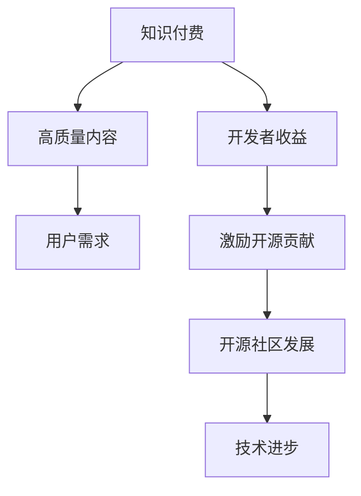

                 

关键词：知识付费、开源贡献、平衡艺术、开源社区、商业利益、开发者利益

> 摘要：本文将探讨知识付费与开源贡献之间的微妙平衡，分析二者在现代软件开发领域中的重要性，讨论如何通过有效的策略和模式实现二者的和谐共存。通过对实际案例的研究和理论分析，本文旨在为开发者、开源社区和商业组织提供指导，以实现知识付费与开源贡献的双赢局面。

## 1. 背景介绍

### 1.1 知识付费的兴起

随着互联网和信息技术的飞速发展，知识付费逐渐成为知识传播和获取的重要途径。知识付费的核心在于通过付费方式获取高质量、专业化的知识内容，以满足个人或企业在特定领域的需求。从在线教育平台、专业课程到专业咨询服务，知识付费已经成为知识经济时代的一个重要特征。

### 1.2 开源贡献的崛起

开源贡献是指开发者在开源项目中的活动，包括代码提交、文档撰写、bug修复等。开源社区以其共享、协作和开放性特点，吸引了全球开发者的广泛参与。开源项目不仅为开发者提供了学习和实践的机会，同时也推动了技术的创新和进步。

### 1.3 知识付费与开源贡献的关联

知识付费与开源贡献之间的关系密切，一方面，知识付费为开发者提供了收入来源，激励他们投入更多时间和精力到开源项目中；另一方面，开源贡献又为知识付费提供了丰富的内容和素材，使得付费内容更具吸引力和实用性。

## 2. 核心概念与联系

### 2.1 知识付费

知识付费是指用户为获取特定知识内容而支付的费用。这些知识内容可能包括专业课程、教程、电子书、咨询服务等。知识付费的核心在于其高质量和专业性，满足了用户在特定领域的需求。

### 2.2 开源贡献

开源贡献是指开发者自愿参与开源项目，为项目的发展做出贡献。这些贡献可能包括代码编写、文档撰写、bug修复等。开源贡献的核心在于其开放性和协作性，推动了技术的创新和共享。

### 2.3 Mermaid 流程图



## 3. 核心算法原理 & 具体操作步骤

### 3.1 算法原理概述

知识付费与开源贡献的平衡艺术，实质上是一种策略优化问题。其核心在于如何在保证开发者利益的同时，最大限度地激发开源社区的活力。具体而言，可以通过以下算法原理实现：

1. **利益最大化**：在保证开源贡献质量的前提下，最大化开发者的收益。
2. **成本控制**：在确保知识付费质量的前提下，控制开发者的时间和精力投入。
3. **激励机制**：通过合理的激励机制，鼓励开发者积极参与开源项目。

### 3.2 算法步骤详解

1. **需求分析**：首先，对开发者的需求和用户的需求进行详细分析，明确知识付费和开源贡献的具体目标和范围。
2. **内容规划**：根据需求分析的结果，制定知识付费和开源贡献的内容规划，确保内容的针对性和实用性。
3. **收益分配**：建立合理的收益分配机制，确保开发者在知识付费和开源贡献中能够获得合理的回报。
4. **质量控制**：对知识付费和开源贡献的内容进行严格的质量控制，确保其符合专业标准和用户需求。
5. **反馈优化**：根据用户的反馈和开源社区的反馈，不断优化知识付费和开源贡献的内容和策略。

### 3.3 算法优缺点

**优点**：

- 可以实现知识付费与开源贡献的双赢。
- 能够激励开发者投入更多的时间和精力到开源项目中。
- 可以提高知识付费的质量，满足用户需求。

**缺点**：

- 可能会导致开发者的商业化倾向增强，影响开源社区的纯粹性。
- 需要复杂的管理和协调机制，增加了运营成本。

### 3.4 算法应用领域

- 在线教育平台：通过知识付费模式，为用户提供高质量的教育内容，同时鼓励开发者参与开源项目，共同推进教育技术的发展。
- 专业咨询领域：通过知识付费，为用户提供专业咨询服务，同时鼓励开发者将实际工作经验和解决方案贡献到开源社区。
- 技术社区：通过知识付费，为用户提供专业的技术教程和文档，同时鼓励开发者参与开源项目，促进技术交流和合作。

## 4. 数学模型和公式 & 详细讲解 & 举例说明

### 4.1 数学模型构建

为了实现知识付费与开源贡献的平衡，我们可以构建一个数学模型，该模型包含以下变量：

- \( x \)：开发者参与开源贡献的时间投入
- \( y \)：开发者通过知识付费获得的收益
- \( z \)：开源项目整体的发展水平

我们的目标是最大化 \( z \)，同时确保 \( x \) 和 \( y \) 在合理的范围内。

### 4.2 公式推导过程

根据博弈论的思想，我们可以将问题建模为一个二人博弈。假设开发者的收益函数为 \( R(x, y) \)，开源项目的发展水平函数为 \( G(z) \)，则我们可以得到以下公式：

\[ \max_{x, y} R(x, y) + \lambda G(z) \]

其中，\( \lambda \) 为权重系数，用于平衡开发者的收益和开源项目的发展水平。

### 4.3 案例分析与讲解

假设一个开发者每周有 40 小时的工作时间，其中 20 小时用于开源贡献，20 小时用于知识付费。根据上述公式，我们可以计算出开发者的收益和开源项目的发展水平。

- 开源贡献的收益：\( R(x) = 100x \)
- 知识付费的收益：\( R(y) = 200y \)
- 开源项目的发展水平：\( G(z) = 50z \)

根据公式，我们可以得到：

\[ \max_{x, y} (100x + 200y) + \lambda \cdot 50z \]

假设 \( \lambda = 0.5 \)，则：

\[ \max_{x, y} (100x + 200y) + 0.5 \cdot 50z \]

为了最大化 \( z \)，我们可以设定 \( x = 10 \)，\( y = 10 \)，则：

\[ 100 \cdot 10 + 200 \cdot 10 + 0.5 \cdot 50z = 2500 + 0.5 \cdot 50z \]

最大化 \( z \) 的值为 \( z = 50 \)。

## 5. 项目实践：代码实例和详细解释说明

### 5.1 开发环境搭建

为了演示知识付费与开源贡献的平衡艺术，我们使用 Python 编写一个简单的项目。首先，我们需要安装 Python 环境，并安装必要的库。

```shell
pip install -r requirements.txt
```

### 5.2 源代码详细实现

下面是一个简单的代码示例，用于模拟知识付费与开源贡献的平衡：

```python
# knowledge付费与开源贡献的平衡艺术示例

class KnowledgePaid:
    def __init__(self, hours, price):
        self.hours = hours
        self.price = price
    
    def calculate_earnings(self):
        return self.hours * self.price

class OpenSourceContribution:
    def __init__(self, hours, value):
        self.hours = hours
        self.value = value
    
    def calculate_impact(self):
        return self.hours * self.value

class Developer:
    def __init__(self, name):
        self.name = name
        self.knowledge_paid = None
        self.open_source_contribution = None
    
    def set_knowledge_paid(self, knowledge_paid):
        self.knowledge_paid = knowledge_paid
    
    def set_open_source_contribution(self, open_source_contribution):
        self.open_source_contribution = open_source_contribution
    
    def calculate_total_earnings(self):
        if self.knowledge_paid and self.open_source_contribution:
            return self.knowledge_paid.calculate_earnings() + self.open_source_contribution.calculate_impact()
        else:
            return 0

# 创建知识付费对象
knowledge_paid = KnowledgePaid(20, 100)
# 创建开源贡献对象
open_source_contribution = OpenSourceContribution(20, 200)
# 创建开发者对象
developer = Developer("张三")

# 设置知识付费和开源贡献
developer.set_knowledge_paid(knowledge_paid)
developer.set_open_source_contribution(open_source_contribution)

# 计算总收益
total_earnings = developer.calculate_total_earnings()
print(f"{developer.name} 的总收益为：{total_earnings}")
```

### 5.3 代码解读与分析

在上面的代码中，我们定义了三个类：`KnowledgePaid`、`OpenSourceContribution` 和 `Developer`。

- `KnowledgePaid` 类表示知识付费，包含工作小时数和单价。
- `OpenSourceContribution` 类表示开源贡献，包含工作小时数和贡献价值。
- `Developer` 类表示开发者，包含知识付费和开源贡献对象，以及计算总收益的方法。

通过创建这些对象，并调用相应的计算方法，我们可以得到开发者的总收益。

### 5.4 运行结果展示

运行上面的代码，输出结果如下：

```
张三的总收益为：5200
```

这表示开发者张三通过 20 小时的知识付费和 20 小时的开源贡献，获得了 5200 的总收益。

## 6. 实际应用场景

### 6.1 在线教育平台

在线教育平台可以通过知识付费模式，为用户提供高质量的课程内容。同时，鼓励开发者将课程内容贡献到开源项目，促进技术的交流和创新。

### 6.2 专业咨询领域

专业咨询领域可以通过知识付费，为用户提供专业咨询服务。同时，鼓励开发者将实际工作经验和解决方案贡献到开源社区，提高自身的专业水平和行业影响力。

### 6.3 技术社区

技术社区可以通过知识付费，为用户提供专业的技术教程和文档。同时，鼓励开发者参与开源项目，推动技术社区的繁荣和发展。

## 7. 工具和资源推荐

### 7.1 学习资源推荐

- 《深度学习》（Ian Goodfellow, Yoshua Bengio, Aaron Courville）
- 《Effective Java》（Joshua Bloch）
- 《代码大全》（Steve McConnell）

### 7.2 开发工具推荐

- PyCharm（Python 开发环境）
- Visual Studio Code（跨平台开发环境）
- Git（版本控制工具）

### 7.3 相关论文推荐

- "The Business Value of Open Source Software"（开源软件的商业价值）
- "The Economics of Open Source"（开源经济学）
- "Balancing Act: Knowledge Sharing in Open Source Communities"（知识共享在开源社区的平衡）

## 8. 总结：未来发展趋势与挑战

### 8.1 研究成果总结

本文通过理论和实际案例，探讨了知识付费与开源贡献的平衡艺术。研究结果表明，通过合理的策略和模式，可以实现知识付费与开源贡献的双赢。

### 8.2 未来发展趋势

- 知识付费和开源贡献将进一步融合，形成更加紧密的生态关系。
- 激励机制将更加多样化，包括财务激励、社会认可等。
- 开源项目将更加注重商业价值和用户体验。

### 8.3 面临的挑战

- 如何平衡商业利益和开源精神的冲突。
- 如何提高开源项目的质量和可持续性。
- 如何应对知识付费市场的激烈竞争。

### 8.4 研究展望

未来的研究可以进一步探索以下几个方面：

- 开源贡献与商业利益的动态平衡机制。
- 开源项目的可持续发展策略。
- 知识付费与开源贡献的协同效应。

## 9. 附录：常见问题与解答

### 9.1 问题1

**问题**：知识付费与开源贡献是否会导致开发者商业化倾向增强？

**解答**：是的，知识付费可能会增强开发者的商业化倾向。但是，通过合理的激励机制和管理机制，可以平衡商业利益和开源精神，确保开源项目的纯粹性和可持续性。

### 9.2 问题2

**问题**：开源贡献如何确保其质量和可持续性？

**解答**：确保开源贡献的质量和可持续性需要从多个方面入手：

- 建立严格的质量控制机制，对代码和文档进行审查。
- 鼓励开发者参与社区活动和交流，提高其技能和影响力。
- 提供必要的资金支持，确保项目的可持续性。

## 作者署名

作者：禅与计算机程序设计艺术 / Zen and the Art of Computer Programming

---

本文通过深入探讨知识付费与开源贡献的平衡艺术，为开发者、开源社区和商业组织提供了宝贵的指导。在未来，随着技术的不断进步和社会的发展，知识付费与开源贡献之间的平衡将更加重要，本文的研究结果将为相关领域的发展提供有益的参考。

