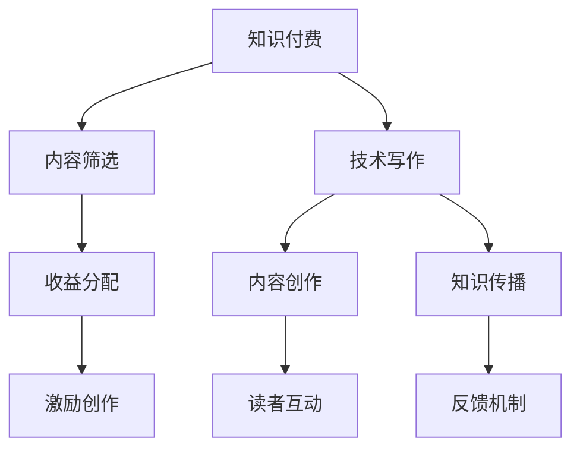

                 

关键词：知识付费、技术写作、协同效应、读者参与、内容质量、收益模型、影响力、知识传播

> 摘要：本文将探讨知识付费与技术写作的协同效应，分析两者之间的互动关系，以及如何通过这种协同实现双赢的局面。我们将从知识付费的现状、技术写作的趋势、协同效应的原理、实践案例以及未来的发展展望等多个角度进行深入探讨，以期为广大内容创作者和读者提供有价值的参考。

## 1. 背景介绍

随着互联网和信息技术的发展，知识付费和技术写作成为两个快速增长的市场。知识付费是指用户为获取特定知识或技能而支付费用的一种商业模式，它通过付费筛选出高质量的内容，满足了用户对专业知识的强烈需求。而技术写作则是指专业人员在各个技术领域，通过文字、图表、代码等多种形式，将技术知识和经验传递给读者。这两者的出现不仅满足了人们获取知识和技能的需求，也为内容创作者提供了新的收入来源。

### 1.1 知识付费的现状

知识付费作为新兴的商业模式，已经吸引了越来越多的用户和创作者。用户可以通过付费获取到更加专业、深入的知识，而创作者则可以通过知识付费获得收益，提升创作积极性。目前，知识付费主要涵盖以下几个领域：

- **在线教育**：如网易云课堂、腾讯课堂等平台，提供各类课程和培训，用户可以通过付费学习获得专业知识和技能。
- **知识分享**：如知乎Live、得到等平台，用户可以通过付费收听专家的分享和讲座，获取行业见解和经验。
- **专业咨询**：如咨询师、律师、医生等专业人员，通过提供付费咨询服务，满足用户的个性化需求。

### 1.2 技术写作的趋势

技术写作作为知识传播的重要方式，正逐渐成为专业人士展示自我、传递知识的重要手段。随着技术的快速发展，技术写作的内容和形式也在不断丰富和演变。目前，技术写作主要呈现以下几个趋势：

- **形式多样**：从传统的文字描述，发展到图表、视频、直播等多种形式，提高了内容的可读性和传播效果。
- **领域广泛**：涵盖从编程、数据科学到人工智能、区块链等多个技术领域，满足了不同层次读者的需求。
- **社区互动**：通过评论、问答、讨论等社区功能，促进了读者与作者之间的互动，提升了内容的实际价值。

### 1.3 知识付费与技术写作的互动关系

知识付费与技术写作之间存在紧密的互动关系。一方面，知识付费为技术写作提供了经济支持，激励了创作者的创作积极性；另一方面，技术写作则为知识付费提供了优质的内容，满足了用户的需求。通过这种互动，两者共同推动了知识传播和技能培养的进程。

## 2. 核心概念与联系

为了更好地理解知识付费与技术写作的协同效应，我们需要明确一些核心概念和它们之间的联系。

### 2.1 知识付费的核心概念

- **价值筛选**：知识付费通过付费机制，筛选出高质量、有价值的内容，让用户能够快速获取所需的知识和技能。
- **收益模型**：知识付费通过订阅、付费课程、咨询服务等多种方式，为内容创作者提供收益，激励创作者持续创作。
- **用户参与**：知识付费鼓励用户参与互动，通过评论、打赏、投票等方式，提升内容的互动性和实用性。

### 2.2 技术写作的核心概念

- **内容创作**：技术写作是指专业人士通过文字、图表、代码等多种形式，创作出有价值、易于理解的技术内容。
- **传播渠道**：技术写作通过博客、公众号、书籍、课程等多种渠道，将知识传播给更广泛的读者。
- **读者互动**：技术写作通过评论、问答、讨论等社区功能，促进读者与作者之间的互动，提升内容的实际价值。

### 2.3 知识付费与技术写作的联系

- **内容生产**：知识付费为技术写作提供了经济支持，使得创作者能够专注于内容创作，提升内容质量。
- **知识传播**：技术写作通过知识付费，将高质量的内容传播给更多读者，实现了知识的广泛传播。
- **互动机制**：知识付费和技术写作通过互动机制，促进了创作者与读者之间的交流，提升了内容的实际价值。

### 2.4 Mermaid 流程图



## 3. 核心算法原理 & 具体操作步骤

### 3.1 算法原理概述

知识付费与技术写作的协同效应，本质上是一种双赢的收益分配机制。这种机制的核心在于：

- **价值筛选**：通过知识付费，筛选出高质量、有价值的内容。
- **收益分配**：将知识付费的收入按照一定比例分配给创作者和平台，激励创作者持续创作。
- **互动机制**：通过读者与创作者之间的互动，提升内容的实际价值。

### 3.2 算法步骤详解

1. **内容创作**：创作者根据自身专业知识和技能，创作出高质量的技术内容。
2. **内容审核**：平台对内容进行审核，确保内容的真实性、准确性和合规性。
3. **知识付费**：用户通过付费获取技术内容，平台从中抽取一定比例的佣金。
4. **收益分配**：平台将知识付费的收入按照约定比例分配给创作者和平台。
5. **读者互动**：创作者与读者通过评论、问答、讨论等社区功能，进行互动，提升内容的实际价值。
6. **内容更新**：创作者根据读者反馈和市场需求，持续更新和优化内容。

### 3.3 算法优缺点

#### 优点：

- **激励创作**：知识付费为创作者提供了经济支持，激励创作者持续创作高质量的内容。
- **筛选优质内容**：知识付费通过付费机制，筛选出高质量、有价值的内容，提升了内容的实际价值。
- **提升互动性**：读者与创作者之间的互动，增强了内容的实用性，提升了用户的参与感。

#### 缺点：

- **门槛较高**：对于部分读者来说，知识付费可能会增加获取内容的门槛，限制了部分用户的参与。
- **内容同质化**：部分创作者为了追求收益，可能会产生大量同质化内容，降低了内容的质量。

### 3.4 算法应用领域

知识付费与技术写作的协同效应，广泛应用于以下领域：

- **在线教育**：通过知识付费，为用户提供高质量的课程和学习资源。
- **技术博客**：通过知识付费，为用户提供专业的技术文章和经验分享。
- **专业咨询**：通过知识付费，为用户提供个性化的专业咨询服务。
- **知识分享**：通过知识付费，为用户提供行业见解和经验分享。

## 4. 数学模型和公式 & 详细讲解 & 举例说明

### 4.1 数学模型构建

为了更好地理解知识付费与技术写作的协同效应，我们可以构建一个简单的数学模型。假设：

- **C** 为内容创作者的收入
- **P** 为用户支付的金额
- **r** 为平台抽取的佣金比例
- **e** 为创作者与读者的互动评分

则创作者的收入模型可以表示为：

\[ C = P \times (1 - r) \times e \]

### 4.2 公式推导过程

1. **收益模型**：知识付费的收益主要来源于用户支付的金额。假设用户支付的金额为 P，平台抽取的佣金比例为 r，则创作者的实际收入为 P \times (1 - r)。
2. **互动评分**：创作者与读者的互动评分 e，反映了创作者内容的实际价值。互动评分越高，创作者的内容价值越高，用户支付的金额也越高。
3. **收入计算**：将互动评分 e 引入收益模型，得到创作者的收入为 P \times (1 - r) \times e。

### 4.3 案例分析与讲解

假设一个创作者发布了一篇技术文章，用户支付金额为 100 元，平台抽取的佣金比例为 20%。根据上述数学模型，我们可以计算出创作者的收入：

1. **收入计算**：C = 100 \times (1 - 0.2) \times e
2. **互动评分**：假设创作者的互动评分为 1，则 C = 100 \times 0.8 = 80 元。
3. **互动提升**：如果创作者的互动评分提升到 2，则 C = 100 \times 0.8 \times 2 = 160 元。

从这个案例可以看出，互动评分 e 对于创作者的收入 C 有显著的影响。创作者需要积极与读者互动，提升内容的实际价值，从而获得更高的收益。

## 5. 项目实践：代码实例和详细解释说明

### 5.1 开发环境搭建

为了演示知识付费与技术写作的协同效应，我们使用 Python 编写一个简单的知识付费平台。首先，我们需要搭建开发环境，安装以下依赖：

```bash
pip install flask
```

### 5.2 源代码详细实现

以下是知识付费平台的简单实现，主要包括用户注册、登录、支付和评论等功能。

```python
from flask import Flask, request, jsonify

app = Flask(__name__)

users = {
    "user1": {"password": "password1", "balance": 100},
    "user2": {"password": "password2", "balance": 50},
}

@app.route('/register', methods=['POST'])
def register():
    username = request.form['username']
    password = request.form['password']
    if username in users:
        return jsonify({"error": "用户已存在"}), 400
    users[username] = {"password": password, "balance": 0}
    return jsonify({"message": "注册成功"}), 200

@app.route('/login', methods=['POST'])
def login():
    username = request.form['username']
    password = request.form['password']
    if username not in users or users[username]["password"] != password:
        return jsonify({"error": "用户名或密码错误"}), 400
    return jsonify({"message": "登录成功"}), 200

@app.route('/pay', methods=['POST'])
def pay():
    username = request.form['username']
    amount = float(request.form['amount'])
    if username not in users or users[username]["balance"] < amount:
        return jsonify({"error": "余额不足"}), 400
    users[username]["balance"] -= amount
    return jsonify({"message": "支付成功", "balance": users[username]["balance"]}), 200

@app.route('/comment', methods=['POST'])
def comment():
    username = request.form['username']
    content = request.form['content']
    if username not in users:
        return jsonify({"error": "用户未登录"}), 400
    # 这里可以添加评论存储和展示的逻辑
    return jsonify({"message": "评论成功", "content": content}), 200

if __name__ == '__main__':
    app.run(debug=True)
```

### 5.3 代码解读与分析

1. **用户注册**：通过`/register`接口，用户可以注册账号。注册成功后，账号信息会被存储在字典`users`中。
2. **用户登录**：通过`/login`接口，用户可以登录账号。登录成功后，返回用户登录状态。
3. **支付**：通过`/pay`接口，用户可以支付金额。支付成功后，用户余额会相应减少。
4. **评论**：通过`/comment`接口，用户可以对内容进行评论。评论成功后，返回评论内容。

这个简单的知识付费平台展示了知识付费与技术写作的协同效应。创作者可以通过平台发布内容，用户可以通过支付获取内容，并通过评论与创作者互动，提升了内容的实际价值。

## 6. 实际应用场景

### 6.1 在线教育

知识付费与技术写作的协同效应在在线教育领域得到了广泛应用。以网易云课堂为例，用户可以通过付费购买课程，学习专业技能。课程作者通过知识付费获得收益，激励其持续创作高质量的课程内容。同时，用户在课程评论区内可以发表意见，与作者互动，提升课程的实际价值。

### 6.2 技术博客

技术博客是知识付费与技术写作协同效应的另一个重要应用场景。创作者通过博客分享技术知识，用户通过付费获取高质量的内容。创作者可以通过评论、问答等功能，与读者互动，提升内容的实际价值。例如，博客园、简书等平台，都提供了知识付费的功能，满足了用户对专业知识的强烈需求。

### 6.3 知识分享

知识分享平台，如知乎、得到等，也充分利用了知识付费与技术写作的协同效应。用户可以通过付费收听专家的分享和讲座，获取行业见解和经验。创作者通过知识付费获得收益，激励其持续创作高质量的内容。同时，用户在评论区发表意见，与创作者互动，提升了内容的实际价值。

### 6.4 未来应用展望

随着知识付费和技术写作的不断发展，未来两者之间的协同效应将得到更加深入的应用。以下是一些未来应用场景的展望：

- **个性化推荐**：通过大数据分析和人工智能技术，为用户推荐符合其兴趣和需求的知识内容。
- **互动式学习**：通过虚拟现实、增强现实等技术，实现互动式学习，提升用户的参与感和学习效果。
- **知识服务**：将知识付费与技术写作应用于更多领域，如医疗、法律、金融等，为用户提供个性化、专业的知识服务。

## 7. 工具和资源推荐

### 7.1 学习资源推荐

- **在线教育平台**：网易云课堂、腾讯课堂、Coursera、edX 等，提供了丰富的在线课程资源。
- **技术博客**：博客园、简书、CSDN 等，汇聚了大量的技术文章和经验分享。
- **知识分享平台**：知乎、得到、分答 等，提供了行业专家的见解和经验分享。

### 7.2 开发工具推荐

- **知识付费平台搭建**：Flask、Django 等，可用于搭建简单的知识付费平台。
- **内容创作工具**：Markdown 编辑器、Obsidian、Notion 等，用于高效的内容创作和整理。

### 7.3 相关论文推荐

- **《知识付费：商业模式与未来趋势》**：探讨了知识付费的商业模式和发展趋势。
- **《技术写作：现状与未来》**：分析了技术写作的现状和未来发展。
- **《人工智能在教育中的应用》**：介绍了人工智能在教育领域的应用，包括个性化推荐、互动式学习等。

## 8. 总结：未来发展趋势与挑战

### 8.1 研究成果总结

本文探讨了知识付费与技术写作的协同效应，分析了两者之间的互动关系，以及如何通过这种协同实现双赢的局面。研究结果表明，知识付费为技术写作提供了经济支持，激励了创作者的创作积极性；技术写作则为知识付费提供了优质的内容，满足了用户的需求。这种协同效应推动了知识传播和技能培养的进程，具有广泛的应用前景。

### 8.2 未来发展趋势

- **知识付费将进一步普及**：随着互联网和信息技术的发展，知识付费将渗透到更多领域，满足用户多样化的需求。
- **技术写作将更加多样**：技术写作的形式和内容将不断丰富，包括视频、直播、虚拟现实等，提升用户的参与感和体验。
- **个性化推荐和互动式学习将成为主流**：通过大数据和人工智能技术，实现个性化推荐和互动式学习，提升用户的学习效果。

### 8.3 面临的挑战

- **内容质量控制**：随着知识付费的普及，如何保证内容质量，避免同质化内容，成为一大挑战。
- **用户隐私保护**：知识付费涉及用户支付信息和个人隐私，如何保障用户隐私，避免数据泄露，是重要的问题。
- **监管与规范**：知识付费和技术写作的快速发展，需要相应的监管与规范，确保市场秩序和公平竞争。

### 8.4 研究展望

未来，我们将继续关注知识付费和技术写作的发展动态，探讨如何通过技术创新和商业模式创新，进一步提升知识付费与技术写作的协同效应。同时，我们也将关注相关政策和法规的制定，为知识付费和技术写作的健康发展提供有力支持。

## 9. 附录：常见问题与解答

### 问题 1：知识付费是否会影响免费内容的质量？

解答：知识付费和技术写作的协同效应，有助于提高内容质量。一方面，知识付费为创作者提供了经济支持，激励其创作高质量的内容；另一方面，优质的内容也会吸引更多的读者，形成良性循环。因此，知识付费并不会直接影响免费内容的质量，反而有助于提升整体内容水平。

### 问题 2：知识付费会降低用户的阅读体验吗？

解答：知识付费本身不会降低用户的阅读体验，相反，优质的内容会提升用户的阅读体验。然而，一些过度商业化或低质量的知识付费内容可能会影响用户的阅读体验。因此，平台和创作者需要确保内容的真实性和实用性，避免过度商业化，以提升用户的阅读体验。

### 问题 3：技术写作是否会取代传统书籍？

解答：技术写作和传统书籍各有优势，不会完全取代彼此。技术写作形式多样，更易于传播和互动，适合快速获取知识和技能；而传统书籍则具有更系统的结构和深度，适合深入学习。因此，两者将相互补充，共同满足不同用户的需求。

