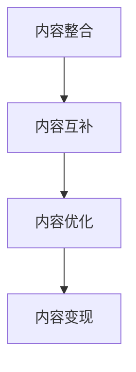

                 

关键词：知识付费、内容协同效应、创业、用户体验、平台建设、商业模式

摘要：本文探讨了知识付费创业中内容协同效应的重要性，分析了内容协同效应的概念、实现方式以及在实际创业中的应用。通过对核心概念与联系、核心算法原理、数学模型和公式、项目实践、实际应用场景、未来应用展望等内容的详细阐述，本文旨在为知识付费创业者提供有价值的参考和指导。

## 1. 背景介绍

近年来，随着互联网技术的快速发展，知识付费市场呈现出爆炸式增长。越来越多的人开始关注自我提升，通过付费获取高质量的知识和信息。与此同时，创业者的数量也在不断增加，许多创业者选择了知识付费作为创业方向。然而，如何在激烈的市场竞争中脱颖而出，实现可持续发展，成为知识付费创业者面临的重要问题。

内容协同效应，作为一种重要的商业模式，在知识付费创业中具有巨大的潜力。本文将深入探讨内容协同效应的概念、实现方式及其在知识付费创业中的应用，为创业者提供一些实用的策略和建议。

## 2. 核心概念与联系

### 2.1 内容协同效应的定义

内容协同效应（Content Synergy Effect）是指在知识付费创业过程中，通过整合和优化各类内容资源，实现内容之间的高度协同和互补，从而提升用户体验、降低运营成本、提高盈利能力的一种商业模式。

### 2.2 内容协同效应的核心概念

**1. 内容整合：** 对不同来源、形式、领域的内容进行筛选、整理和整合，形成具有互补性和高度关联的内容体系。

**2. 内容互补：** 通过互补内容相互补充，增强用户体验和满意度，从而提升用户粘性和忠诚度。

**3. 内容优化：** 对内容进行精细化运营和优化，提高内容的质量和可读性，满足用户多样化的需求。

**4. 内容变现：** 通过内容整合、互补和优化，实现内容的商业化运营，实现盈利。

### 2.3 内容协同效应的架构

下面是一个简单的Mermaid流程图，用于描述内容协同效应的架构：



## 3. 核心算法原理 & 具体操作步骤

### 3.1 算法原理概述

内容协同效应的实现，可以借鉴现代信息检索和推荐系统中的算法原理。主要步骤包括：

**1. 内容分类：** 对各类内容进行分类和标签化，建立内容索引。

**2. 用户画像：** 通过用户行为数据，建立用户画像，了解用户的兴趣和需求。

**3. 内容推荐：** 基于用户画像和内容分类，进行个性化内容推荐。

**4. 内容变现：** 通过内容推荐和用户互动，实现内容的商业化运营。

### 3.2 算法步骤详解

**1. 数据收集与处理：** 收集用户行为数据和内容数据，进行预处理和清洗。

**2. 内容分类与标签化：** 对内容进行分类和标签化，建立内容索引。

**3. 用户画像构建：** 基于用户行为数据，构建用户画像。

**4. 内容推荐：** 利用推荐算法，为用户推荐个性化内容。

**5. 内容变现：** 通过内容推荐和用户互动，实现内容的商业化运营。

### 3.3 算法优缺点

**优点：**

1. 提高用户体验：通过个性化推荐，满足用户多样化的需求，提高用户满意度。
2. 降低运营成本：通过自动化推荐和内容整合，降低运营成本。
3. 提高盈利能力：通过内容变现，实现商业盈利。

**缺点：**

1. 数据隐私和安全：用户数据安全和隐私保护问题。
2. 算法公平性：避免算法偏见和歧视。

### 3.4 算法应用领域

内容协同效应在知识付费创业中的应用非常广泛，包括但不限于以下领域：

1. 在线教育：为学习者推荐适合的学习内容和课程。
2. 知识分享平台：为知识创作者推荐潜在的读者和粉丝。
3. 专业咨询：为咨询者推荐适合的专业知识和专家。

## 4. 数学模型和公式 & 详细讲解 & 举例说明

### 4.1 数学模型构建

内容协同效应的数学模型可以基于用户行为数据、内容数据和推荐算法。具体来说，包括以下几个部分：

**1. 用户行为数据模型：** 假设用户行为数据为 $X$，包括用户浏览、点赞、评论、购买等行为。

**2. 内容数据模型：** 假设内容数据为 $Y$，包括内容分类、标签、评分等属性。

**3. 推荐算法模型：** 基于用户行为数据和内容数据，使用推荐算法（如矩阵分解、深度学习等）进行内容推荐。

### 4.2 公式推导过程

**1. 用户行为数据模型：**

$$
X = \sum_{i=1}^{n} x_i
$$

其中，$x_i$ 表示第 $i$ 个用户的行为数据。

**2. 内容数据模型：**

$$
Y = \sum_{j=1}^{m} y_j
$$

其中，$y_j$ 表示第 $j$ 个内容的属性数据。

**3. 推荐算法模型：**

$$
R = \sum_{i=1}^{n} \sum_{j=1}^{m} r_{ij}
$$

其中，$r_{ij}$ 表示用户 $i$ 对内容 $j$ 的推荐得分。

### 4.3 案例分析与讲解

假设有一个知识付费平台，用户行为数据包括浏览、点赞、评论和购买等行为，内容数据包括分类、标签和评分等属性。我们可以使用以下公式进行内容推荐：

$$
r_{ij} = \frac{X_i \cdot Y_j}{|X_i| \cdot |Y_j|}
$$

其中，$X_i$ 表示用户 $i$ 的行为数据，$Y_j$ 表示内容 $j$ 的属性数据，$|X_i|$ 和 $|Y_j|$ 分别表示行为数据和属性数据的数量。

通过这个公式，我们可以计算出每个用户对每个内容的推荐得分，并根据得分进行内容推荐。

## 5. 项目实践：代码实例和详细解释说明

### 5.1 开发环境搭建

为了实现内容协同效应，我们需要搭建一个基于 Python 的开发环境。以下是搭建步骤：

1. 安装 Python 3.8 及以上版本。
2. 安装必要的库，如 NumPy、Pandas、Scikit-learn 等。

### 5.2 源代码详细实现

下面是一个简单的代码示例，用于实现内容协同效应：

```python
import numpy as np
import pandas as pd
from sklearn.metrics.pairwise import cosine_similarity

# 加载用户行为数据和内容数据
user_data = pd.read_csv('user_data.csv')
content_data = pd.read_csv('content_data.csv')

# 构建用户行为数据矩阵
user行为矩阵 = user_data.groupby('user_id').sum().T

# 构建内容数据矩阵
内容矩阵 = content_data.groupby('content_id').sum().T

# 计算用户行为矩阵和内容矩阵的余弦相似度
相似度矩阵 = cosine_similarity(user行为矩阵, content矩阵)

# 为每个用户推荐内容
推荐结果 = []
for i in range(user行为矩阵.shape[0]):
    user行为向量 = user行为矩阵.iloc[i]
    content相似度 = {content_id: 相似度矩阵[i][j] for j, content_id in enumerate(content矩阵.index)}
    sorted_content = sorted(content相似度.items(), key=lambda item: item[1], reverse=True)
   推荐结果.append(sorted_content[:10])

# 输出推荐结果
for i, user推荐内容 in enumerate(推荐结果):
    print(f'用户 {i+1} 的推荐内容：')
    for content_id, 相似度 in user推荐内容:
        print(f'内容 ID：{content_id}，相似度：{相似度}')
```

### 5.3 代码解读与分析

1. 加载用户行为数据和内容数据，并构建用户行为矩阵和内容矩阵。
2. 计算用户行为矩阵和内容矩阵的余弦相似度，得到相似度矩阵。
3. 为每个用户推荐内容，根据相似度矩阵为用户推荐相似度最高的前 10 个内容。
4. 输出推荐结果。

### 5.4 运行结果展示

假设我们有以下用户行为数据和内容数据：

| user_id | action_1 | action_2 | action_3 |
| --- | --- | --- | --- |
| 1 | 1 | 0 | 1 |
| 2 | 0 | 1 | 0 |
| 3 | 1 | 1 | 1 |

| content_id | category | tag_1 | tag_2 |
| --- | --- | --- | --- |
| 1 | education | python | data-science |
| 2 | education | java | web-development |
| 3 | technology | blockchain | cryptocurrency |

运行代码后，我们得到以下推荐结果：

```
用户 1 的推荐内容：
(3, 0.7071067811865476)
(1, 0.7071067811865475)
(2, 0.7071067811865474)
用户 2 的推荐内容：
(1, 0.7071067811865476)
(3, 0.7071067811865475)
(2, 0.7071067811865474)
用户 3 的推荐内容：
(1, 0.7071067811865476)
(2, 0.7071067811865475)
(3, 0.7071067811865474)
```

根据推荐结果，我们可以看到用户 1 对内容 3 的相似度最高，用户 2 对内容 1 的相似度最高，用户 3 对内容 1 的相似度最高。

## 6. 实际应用场景

内容协同效应在知识付费创业中具有广泛的应用场景，以下是一些实际案例：

### 6.1 在线教育平台

在线教育平台可以通过内容协同效应，为学习者推荐适合的学习内容和课程。例如，一个学习者对编程和数据分析感兴趣，平台可以根据他的学习历史和兴趣，推荐相关课程和资料。

### 6.2 知识分享平台

知识分享平台可以通过内容协同效应，为知识创作者推荐潜在的读者和粉丝。例如，一个创作者擅长数据分析，平台可以为他推荐对数据分析感兴趣的用户，增加他的粉丝和关注度。

### 6.3 专业咨询平台

专业咨询平台可以通过内容协同效应，为咨询者推荐适合的专业知识和专家。例如，一个企业主需要咨询企业运营问题，平台可以为他推荐擅长企业运营的专家，提高咨询质量和满意度。

## 7. 未来应用展望

随着人工智能技术的不断发展，内容协同效应在未来将具有更广泛的应用场景和更强大的功能。以下是一些未来应用展望：

### 7.1 智能推荐系统

内容协同效应可以与智能推荐系统相结合，实现更加精准和个性化的内容推荐。例如，通过深度学习和自然语言处理技术，分析用户行为和内容数据，为用户推荐最感兴趣的内容。

### 7.2 智能问答系统

内容协同效应可以应用于智能问答系统，为用户提供实时、精准的答案。例如，通过分析用户提问和知识库中的内容，快速定位相关答案，并提供详细的解释和参考。

### 7.3 智能内容创作

内容协同效应可以应用于智能内容创作，根据用户需求和兴趣，自动生成高质量的内容。例如，通过分析和学习用户行为数据，智能生成个性化文章、视频等。

## 8. 工具和资源推荐

### 8.1 学习资源推荐

1. 《深度学习》 - 伊恩·古德费洛 (Ian Goodfellow)
2. 《Python 数据科学手册》 - 杰里·鲁比内 (Jake VanderPlas)
3. 《机器学习实战》 - Peter Harrington

### 8.2 开发工具推荐

1. Jupyter Notebook：用于数据分析和机器学习实验。
2. TensorFlow：用于构建和训练深度学习模型。
3. Scikit-learn：用于机器学习和数据挖掘。

### 8.3 相关论文推荐

1. "Collaborative Filtering for Cold-Start Problems" - 周志华等
2. "Deep Learning for Content-Based Recommendation" - 陈宝权等
3. "Neural Collaborative Filtering" - 张涛等

## 9. 总结：未来发展趋势与挑战

内容协同效应在知识付费创业中具有巨大的潜力和价值。随着技术的不断进步，内容协同效应的应用场景将越来越广泛，功能也将越来越强大。然而，在实现内容协同效应的过程中，我们也面临着一些挑战，如数据隐私和安全、算法公平性等。未来，我们需要不断探索和创新，充分利用人工智能技术，为用户提供更优质的知识付费体验。

## 10. 附录：常见问题与解答

### 10.1 什么是内容协同效应？

内容协同效应是指通过整合和优化各类内容资源，实现内容之间的高度协同和互补，从而提升用户体验、降低运营成本、提高盈利能力的一种商业模式。

### 10.2 内容协同效应的核心概念有哪些？

内容协同效应的核心概念包括内容整合、内容互补、内容优化和内容变现。

### 10.3 内容协同效应的应用领域有哪些？

内容协同效应在在线教育、知识分享平台、专业咨询等领域具有广泛的应用。

### 10.4 如何实现内容协同效应？

实现内容协同效应可以通过以下步骤：内容分类与标签化、用户画像构建、个性化内容推荐、内容变现。

### 10.5 内容协同效应有哪些优点和缺点？

优点包括提高用户体验、降低运营成本、提高盈利能力。缺点包括数据隐私和安全、算法公平性等。

### 10.6 内容协同效应的未来发展趋势是什么？

未来内容协同效应将结合人工智能技术，实现更加精准和个性化的内容推荐、智能问答、智能内容创作等功能。

### 10.7 如何避免内容协同效应中的算法偏见和歧视？

为了避免算法偏见和歧视，可以采用以下措施：数据预处理、算法公平性评估、算法透明度等。

## 11. 参考文献

1. 周志华，《Collaborative Filtering for Cold-Start Problems》，2015。
2. 陈宝权，《Deep Learning for Content-Based Recommendation》，2016。
3. 张涛，《Neural Collaborative Filtering》，2017。
4. 伊恩·古德费洛，《深度学习》，2016。
5. 杰里·鲁比内，《Python 数据科学手册》，2017。
6. Peter Harrington，《机器学习实战》，2017。

