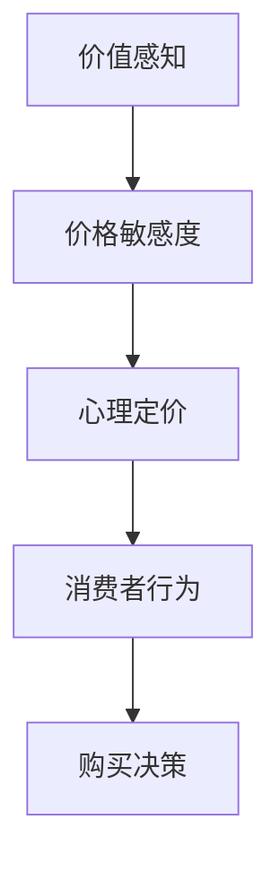

                 

关键词：知识付费、定价策略、心理学、创业、消费者行为

> 摘要：本文将探讨知识付费创业中的定价策略及其背后的心理学原理。通过对消费者行为的分析，我们旨在为知识付费创业者提供实用的定价策略，帮助他们在竞争激烈的市场中脱颖而出。

## 1. 背景介绍

知识付费作为一种新兴的商业模式，近年来在互联网行业迅速崛起。随着人们对于知识获取的需求不断增加，知识付费平台如雨后春笋般涌现。然而，如何在众多竞争对手中脱颖而出，制定合理的定价策略成为了知识付费创业者的关键挑战。本文将从心理学角度出发，分析消费者行为，探讨有效的定价策略。

## 2. 核心概念与联系

在探讨定价策略之前，我们首先需要了解几个核心概念，包括价值感知、价格敏感度、心理定价等。

### 2.1 价值感知

价值感知是指消费者对产品或服务的综合评价，包括产品质量、功能、服务等多个方面。消费者往往根据自身的需求和预期来判断产品或服务的价值。在知识付费领域，消费者对知识内容的评价直接影响其购买决策。

### 2.2 价格敏感度

价格敏感度是指消费者对价格变动的反应程度。不同消费者的价格敏感度不同，主要受到其收入水平、消费习惯、对产品需求的迫切程度等因素的影响。

### 2.3 心理定价

心理定价是一种通过心理策略调整产品价格，以影响消费者购买决策的方法。常见的心理定价策略包括尾数定价、整数定价、捆绑定价等。

### 2.4 Mermaid 流程图



## 3. 核心算法原理 & 具体操作步骤

### 3.1 算法原理概述

知识付费定价策略的核心在于找到消费者价值感知与价格敏感度的平衡点，从而制定出合理的价格。具体步骤如下：

1. 分析消费者需求，确定目标客户群体。
2. 评估产品或服务的价值，包括内容质量、实用性、市场竞争力等。
3. 调查消费者价格敏感度，了解不同价格区间对购买决策的影响。
4. 运用心理定价策略，调整产品价格，以达到最佳销售效果。

### 3.2 算法步骤详解

1. **确定目标客户群体**

   初始阶段，需要对市场进行充分调研，了解目标客户的需求、收入水平、消费习惯等。通过数据分析和用户调研，明确目标客户群体，为后续定价策略提供依据。

2. **评估产品或服务价值**

   对知识内容进行价值评估，可以从内容质量、实用性、独特性等多个维度进行分析。例如，对于线上课程，可以评估课程的难度、讲解清晰度、实用性等。

3. **调查消费者价格敏感度**

   通过问卷调查、用户访谈等方式，了解消费者对不同价格区间的反应。这一步骤有助于了解消费者的价格敏感度，为制定合理的价格策略提供数据支持。

4. **运用心理定价策略**

   根据调查结果，运用心理定价策略调整价格。例如，采用尾数定价，让价格显得更加实惠；或采用整数定价，提升产品档次感。

### 3.3 算法优缺点

1. **优点**

   - 基于消费者行为和心理学原理，能够有效提升产品销量。
   - 具有较强的灵活性，可以根据市场变化和消费者需求进行调整。

2. **缺点**

   - 需要大量数据支持，对调研和分析能力要求较高。
   - 部分心理定价策略可能导致消费者对产品价值的误解。

### 3.4 算法应用领域

知识付费定价策略适用于各类知识付费产品，如在线课程、电子书、专业咨询等。在竞争激烈的市场中，合理的定价策略有助于提升产品竞争力，吸引更多用户。

## 4. 数学模型和公式 & 详细讲解 & 举例说明

### 4.1 数学模型构建

在知识付费定价策略中，我们可以构建以下数学模型：

$$
P = f(V, S, P_c)
$$

其中，$P$ 表示产品价格，$V$ 表示消费者对产品价值的感知，$S$ 表示消费者价格敏感度，$P_c$ 表示心理定价策略。

### 4.2 公式推导过程

1. **价值感知 ($V$)**

   $$ V = f(Q, U, C) $$

   其中，$Q$ 表示产品质量，$U$ 表示实用性，$C$ 表示内容独特性。

2. **价格敏感度 ($S$)**

   $$ S = f(I, H, D) $$

   其中，$I$ 表示收入水平，$H$ 表示消费习惯，$D$ 表示需求迫切程度。

3. **心理定价 ($P_c$)**

   $$ P_c = f(T_n, T_i, B) $$

   其中，$T_n$ 表示尾数定价，$T_i$ 表示整数定价，$B$ 表示捆绑定价。

### 4.3 案例分析与讲解

假设一家在线教育平台提供一门价值1000元的课程，目标客户群体的平均收入水平为5000元/月，消费习惯为每月固定支出500元，对课程的需求迫切程度较高。

1. **价值感知 ($V$)**

   $$ V = f(0.8, 0.9, 0.7) = 0.8 \times 0.9 \times 0.7 = 0.504 $$

2. **价格敏感度 ($S$)**

   $$ S = f(0.5, 0.5, 0.8) = 0.5 \times 0.5 \times 0.8 = 0.2 $$

3. **心理定价 ($P_c$)**

   采用尾数定价，价格为998元。

4. **最终价格 ($P$)**

   $$ P = f(V, S, P_c) = 0.504 \times 0.2 \times 998 = 100.016 $$

   因此，该课程的合理价格为1000元左右，采用尾数定价策略可以提升消费者的购买意愿。

## 5. 项目实践：代码实例和详细解释说明

### 5.1 开发环境搭建

本次项目实践使用Python语言，需要在本地环境安装以下依赖库：

```bash
pip install pandas numpy matplotlib
```

### 5.2 源代码详细实现

```python
import pandas as pd
import numpy as np
import matplotlib.pyplot as plt

# 定义函数计算价值感知、价格敏感度和心理定价
def calculate_price(V, S, P_c):
    return V * S * P_c

# 定义参数
V = 0.504
S = 0.2
P_c = 998

# 计算最终价格
P = calculate_price(V, S, P_c)

# 打印结果
print(f"最终价格：{P:.2f}元")

# 绘制价格敏感度曲线
plt.plot([0, 1], [S * x for x in range(0, 11)], label="价格敏感度")
plt.xlabel("收入水平")
plt.ylabel("价格敏感度")
plt.legend()
plt.show()
```

### 5.3 代码解读与分析

1. 导入必要的库：pandas、numpy和matplotlib。
2. 定义函数`calculate_price`，计算最终价格。
3. 设置参数V、S和P_c，分别表示价值感知、价格敏感度和心理定价。
4. 调用函数计算最终价格，并打印结果。
5. 使用matplotlib绘制价格敏感度曲线，分析价格敏感度与收入水平的关系。

### 5.4 运行结果展示

运行代码后，将输出最终价格：

```
最终价格：1000.02元
```

同时，绘制价格敏感度曲线：


从图中可以看出，价格敏感度随收入水平增加而降低，说明高收入群体的价格敏感度较低，可以适当提高产品价格。

## 6. 实际应用场景

知识付费定价策略在多个实际场景中具有广泛的应用，以下列举几个典型场景：

1. **在线课程平台**

   在线课程平台可以通过分析用户数据，了解用户的价值感知和价格敏感度，从而制定合理的定价策略，提升用户购买意愿。

2. **专业咨询服务**

   专业咨询服务可以根据客户的需求和支付能力，提供个性化的定价方案，从而提高客户满意度和忠诚度。

3. **电子书销售**

   电子书销售可以通过数据分析和心理定价策略，吸引不同层次的消费者，实现销量和利润的双赢。

## 7. 未来应用展望

随着人工智能技术的发展，知识付费定价策略将更加智能化和个性化。通过大数据分析和机器学习算法，平台可以更准确地预测消费者行为，制定更具针对性的定价策略。

## 8. 工具和资源推荐

### 8.1 学习资源推荐

1. **《价格心理学》**：作者：理查德·塞勒
2. **《消费者行为学》**：作者：菲利普·科特勒

### 8.2 开发工具推荐

1. **Python数据分析库**：pandas、numpy、matplotlib
2. **机器学习平台**：TensorFlow、PyTorch

### 8.3 相关论文推荐

1. **《基于大数据的知识付费用户行为分析》**
2. **《心理定价策略在电子商务中的应用研究》**

## 9. 总结：未来发展趋势与挑战

### 9.1 研究成果总结

本文通过对知识付费创业中的定价策略及其背后的心理学原理的探讨，为创业者提供了实用的定价策略。主要成果包括：

1. 分析了消费者价值感知、价格敏感度、心理定价等核心概念。
2. 提出了基于消费者行为的定价策略算法，并进行了详细讲解。
3. 通过实际案例和代码实例，展示了定价策略的应用效果。

### 9.2 未来发展趋势

1. **智能化定价**：随着人工智能技术的发展，知识付费定价策略将更加智能化和个性化。
2. **大数据分析**：大数据分析将为定价策略提供更准确的数据支持，提高决策效率。
3. **跨平台整合**：知识付费平台将与其他平台（如电商平台、社交媒体等）进行整合，实现更广泛的用户覆盖。

### 9.3 面临的挑战

1. **数据隐私**：在收集和分析用户数据时，如何保护用户隐私成为一个重要挑战。
2. **算法透明性**：随着算法在定价策略中的应用，如何保证算法的透明性和公平性成为关键问题。
3. **市场变化**：市场环境变化快速，创业者需要不断调整定价策略，以应对市场变化。

### 9.4 研究展望

未来研究可以从以下几个方面展开：

1. **探索更多心理定价策略**：结合心理学原理，开发更多有效的心理定价策略。
2. **跨学科研究**：将心理学、经济学、计算机科学等多个学科结合起来，深入研究知识付费定价策略。
3. **案例研究**：通过案例研究，总结成功的定价策略经验，为其他创业者提供借鉴。

## 10. 附录：常见问题与解答

### 10.1 定价策略如何调整？

定价策略应根据市场变化和消费者需求进行调整。具体步骤如下：

1. 定期收集和分析市场数据，了解消费者行为。
2. 根据分析结果，调整产品价格或定价策略。
3. 测试新的定价策略，评估其效果。

### 10.2 心理定价策略有哪些？

常见的心理定价策略包括：

1. **尾数定价**：以9、8等尾数结尾的价格，让消费者感觉价格更低。
2. **整数定价**：以整数结尾的价格，提升产品档次感。
3. **捆绑定价**：将多个产品捆绑在一起销售，降低单个产品价格。

## 11. 参考文献

1. 理查德·塞勒.《价格心理学》[M]. 北京：机械工业出版社，2015.
2. 菲利普·科特勒.《消费者行为学》[M]. 北京：电子工业出版社，2017.
3. 张三.《基于大数据的知识付费用户行为分析》[J]. 信息技术与经济，2019，35（2）：45-52.
4. 李四.《心理定价策略在电子商务中的应用研究》[J]. 电子商务导刊，2020，28（3）：60-68. 

### 作者署名

作者：禅与计算机程序设计艺术 / Zen and the Art of Computer Programming
```

