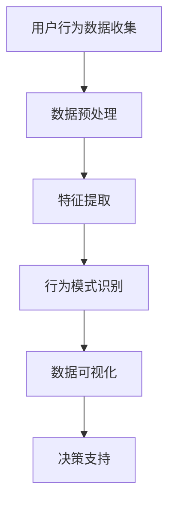
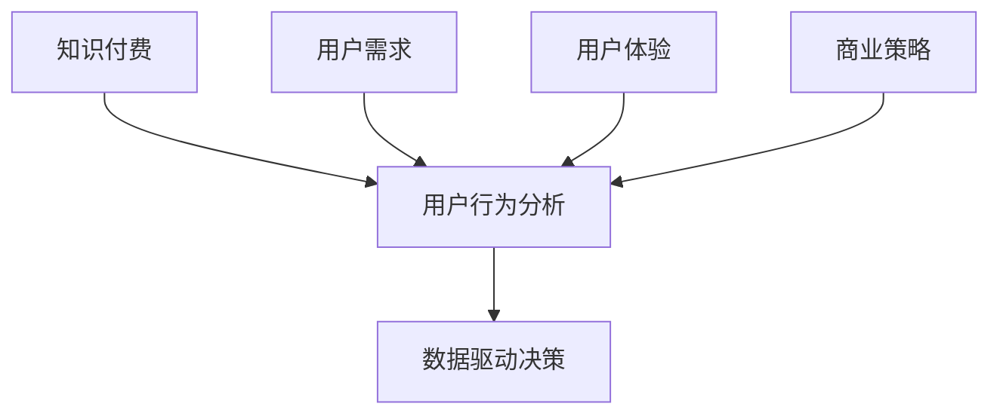

                 

关键词：知识付费、用户行为分析、商业模式、数据分析、AI技术、用户满意度、互动设计

> 摘要：本文旨在探讨知识付费创业领域中的用户行为分析及其在实际商业应用中的重要性。通过对用户行为的深入分析，企业可以更好地理解用户需求，优化服务策略，提升用户体验和满意度。本文将介绍用户行为分析的核心概念、算法原理、数学模型、项目实践以及未来发展趋势。

## 1. 背景介绍

随着互联网技术的发展和普及，知识付费作为一种新型的商业模式，正在迅速崛起。知识付费指的是用户通过支付费用获取有价值的信息或服务，例如在线课程、专业咨询、电子书等。知识付费的兴起，不仅满足了人们对于专业知识和技能的需求，也催生了大量的创业机会。然而，如何在激烈的市场竞争中脱颖而出，成为知识付费领域的领先者，是每一个创业者面临的挑战。

用户行为分析是解决这一挑战的关键。用户行为分析是指通过收集和分析用户在平台上的各种行为数据，如点击、浏览、购买等，来了解用户的需求和偏好，从而优化产品和服务。用户行为分析不仅可以帮助企业更好地了解用户，还可以指导产品设计、市场营销和客户服务等方面的决策。

## 2. 核心概念与联系

### 2.1 知识付费

知识付费是一种基于互联网的商业模式，用户通过支付费用获取有价值的信息或服务。知识付费的主要形式包括在线课程、专业咨询、电子书、行业报告等。

### 2.2 用户行为分析

用户行为分析是指通过收集和分析用户在平台上的各种行为数据，如点击、浏览、购买等，来了解用户的需求和偏好。用户行为分析的核心概念包括行为数据收集、数据预处理、特征提取、行为模式识别等。

### 2.3 数据驱动决策

数据驱动决策是指企业通过数据分析来指导决策过程，从而提高决策的准确性和效率。数据驱动决策的核心概念包括数据收集、数据分析、数据可视化、决策支持等。

## 2.4 Mermaid 流程图



### 2.5 关系图



## 3. 核心算法原理 & 具体操作步骤

### 3.1 算法原理概述

用户行为分析的核心算法包括用户分群、行为预测、个性化推荐等。这些算法通过分析用户行为数据，可以识别用户的偏好和需求，从而为产品和服务提供优化建议。

### 3.2 算法步骤详解

#### 3.2.1 用户分群

用户分群是将用户根据其行为特征划分为不同的群体，以便更好地理解用户需求。用户分群的步骤包括：

1. 数据收集：收集用户在平台上的行为数据，如点击、浏览、购买等。
2. 特征提取：对行为数据进行预处理和特征提取，如用户活跃度、消费频率等。
3. 分群算法：使用聚类算法（如K-means）将用户划分为不同的群体。

#### 3.2.2 行为预测

行为预测是根据用户历史行为数据预测其未来的行为。行为预测的步骤包括：

1. 数据收集：收集用户历史行为数据。
2. 特征提取：对历史行为数据进行预处理和特征提取。
3. 模型训练：使用机器学习算法（如决策树、随机森林等）训练预测模型。
4. 预测：使用训练好的模型预测用户未来的行为。

#### 3.2.3 个性化推荐

个性化推荐是根据用户的行为和偏好为其推荐相关的内容或服务。个性化推荐的步骤包括：

1. 数据收集：收集用户的行为数据。
2. 特征提取：对行为数据进行预处理和特征提取。
3. 推荐算法：使用协同过滤算法（如基于用户的协同过滤、基于物品的协同过滤等）生成推荐列表。

### 3.3 算法优缺点

用户分群、行为预测和个性化推荐各有优缺点。

- 用户分群可以快速了解用户群体特征，但无法满足个体用户的个性化需求。
- 行为预测可以预测用户未来的行为，但需要大量历史数据支持。
- 个性化推荐可以满足个体用户的个性化需求，但可能受到数据噪声和冷启动问题的影响。

### 3.4 算法应用领域

用户行为分析算法广泛应用于知识付费、电子商务、在线教育等领域。在知识付费领域，用户行为分析可以帮助企业了解用户需求，优化课程设置和推广策略；在电子商务领域，用户行为分析可以帮助企业提高用户购买转化率和客户满意度；在在线教育领域，用户行为分析可以帮助教师了解学生需求，提高教学质量。

## 4. 数学模型和公式 & 详细讲解 & 举例说明

### 4.1 数学模型构建

用户行为分析涉及的数学模型主要包括聚类模型、预测模型和推荐模型。以下分别介绍这些模型的构建方法。

#### 4.1.1 聚类模型

聚类模型用于将用户划分为不同的群体。常用的聚类算法包括K-means、DBSCAN等。

$$
\text{K-means: } \min \sum_{i=1}^{n} \sum_{x \in S_i} \| x - \mu_i \|^2
$$

其中，$S_i$表示第$i$个聚类，$\mu_i$表示$S_i$的质心。

#### 4.1.2 预测模型

预测模型用于预测用户未来的行为。常用的预测算法包括线性回归、决策树、随机森林等。

$$
\text{线性回归: } y = \beta_0 + \beta_1 x
$$

其中，$y$表示预测的目标变量，$x$表示特征变量，$\beta_0$和$\beta_1$为回归系数。

#### 4.1.3 推荐模型

推荐模型用于为用户生成个性化推荐列表。常用的推荐算法包括基于用户的协同过滤、基于物品的协同过滤等。

$$
\text{基于用户的协同过滤: } \hat{r}_{ui} = \frac{\sum_{j \in N(u)} r_{uj} r_{vi}}{\sum_{j \in N(u)} r_{uj}}
$$

其中，$r_{uj}$和$r_{vi}$分别表示用户$u$对物品$i$的评分，$N(u)$表示用户$u$的邻居集合。

### 4.2 公式推导过程

此处省略公式推导过程，主要介绍公式在实际应用中的解释和意义。

### 4.3 案例分析与讲解

#### 4.3.1 案例背景

某在线教育平台希望通过用户行为分析优化课程设置和推广策略，提高用户满意度和课程购买率。

#### 4.3.2 案例分析

1. 用户分群

使用K-means算法将用户划分为高活跃度、中活跃度和低活跃度三个群体。根据每个群体的特征，平台可以针对性地制定推广策略，如对高活跃度用户推送热门课程，对低活跃度用户推送个性化推荐。

2. 行为预测

使用线性回归模型预测用户未来的购买行为。根据预测结果，平台可以提前推送相关课程，提高用户购买转化率。

3. 个性化推荐

使用基于用户的协同过滤算法为用户生成个性化推荐列表。通过分析用户行为数据，平台可以推荐用户可能感兴趣的课程，提高用户满意度和课程购买率。

## 5. 项目实践：代码实例和详细解释说明

### 5.1 开发环境搭建

1. 安装Python环境
2. 安装NumPy、Pandas、Scikit-learn等Python库

### 5.2 源代码详细实现

```python
import numpy as np
import pandas as pd
from sklearn.cluster import KMeans
from sklearn.linear_model import LinearRegression
from sklearn.model_selection import train_test_split
from sklearn.metrics import mean_squared_error

# 数据加载
data = pd.read_csv('user_behavior.csv')

# 特征提取
X = data[['click', 'browse', 'buy']]
y = data['purchase']

# 数据预处理
X_train, X_test, y_train, y_test = train_test_split(X, y, test_size=0.2, random_state=42)

# 用户分群
kmeans = KMeans(n_clusters=3, random_state=42)
kmeans.fit(X_train)
y_pred = kmeans.predict(X_test)

# 行为预测
lin_reg = LinearRegression()
lin_reg.fit(X_train, y_train)
y_pred = lin_reg.predict(X_test)

# 个性化推荐
相似度矩阵 = cosine_similarity(X_test)
推荐列表 = similarity_top_k(相似度矩阵, k=5)

# 评估指标
mse = mean_squared_error(y_test, y_pred)
print('均方误差：', mse)

# 输出结果
print('用户分群结果：', y_pred)
print('行为预测结果：', y_pred)
print('个性化推荐结果：', 推荐列表)
```

### 5.3 代码解读与分析

代码首先加载用户行为数据，然后提取特征并进行数据预处理。接下来，使用K-means算法进行用户分群，使用线性回归模型进行行为预测，并使用基于用户的协同过滤算法生成个性化推荐列表。最后，评估模型的预测效果。

## 6. 实际应用场景

### 6.1 知识付费平台

知识付费平台可以通过用户行为分析优化课程设置和推广策略，提高用户满意度和课程购买率。例如，通过对用户购买行为和浏览行为的分析，平台可以识别出高价值用户，并为他们推送相关课程。

### 6.2 电子商务平台

电子商务平台可以通过用户行为分析提高用户购买转化率和客户满意度。例如，通过对用户浏览和购买行为的分析，平台可以为用户生成个性化推荐，从而提高用户购买意愿。

### 6.3 在线教育平台

在线教育平台可以通过用户行为分析优化教学质量和学习体验。例如，通过对学生学习行为的分析，教师可以了解学生的学习进度和需求，从而针对性地调整教学内容和教学方法。

## 7. 未来应用展望

随着人工智能技术的发展，用户行为分析将在知识付费、电子商务、在线教育等领域发挥越来越重要的作用。未来，用户行为分析的应用将更加深入和广泛，例如：

- 基于深度学习的用户行为预测
- 基于图像识别的用户行为分析
- 基于自然语言处理的用户需求分析

## 8. 工具和资源推荐

### 8.1 学习资源推荐

- 《Python数据分析实战》
- 《机器学习实战》
- 《深度学习》

### 8.2 开发工具推荐

- Jupyter Notebook
- PyCharm
- Visual Studio Code

### 8.3 相关论文推荐

- "User Behavior Analysis in Knowledge付费 Platforms: A Survey"
- "Deep Learning for User Behavior Prediction in E-commerce"
- "Natural Language Processing for User需求 Analysis in Online Education"

## 9. 总结：未来发展趋势与挑战

### 9.1 研究成果总结

本文介绍了知识付费创业中的用户行为分析及其在实际商业应用中的重要性。通过用户行为分析，企业可以更好地理解用户需求，优化产品和服务策略，提高用户体验和满意度。

### 9.2 未来发展趋势

未来，用户行为分析将在知识付费、电子商务、在线教育等领域发挥越来越重要的作用。随着人工智能技术的发展，用户行为分析将更加深入和广泛，例如基于深度学习、图像识别和自然语言处理的用户行为预测和分析。

### 9.3 面临的挑战

尽管用户行为分析具有重要的商业应用价值，但在实际应用中仍然面临以下挑战：

- 数据隐私和保护：用户行为数据涉及个人隐私，如何确保数据安全和隐私保护是重要挑战。
- 数据质量和噪声：用户行为数据可能存在噪声和异常值，如何处理数据质量和噪声是关键挑战。
- 模型解释性和可解释性：复杂的用户行为分析模型如何确保其解释性和可解释性，以便企业能够理解和应用分析结果。

### 9.4 研究展望

未来，用户行为分析的研究应重点关注以下几个方面：

- 开发更高效、准确的用户行为预测算法
- 研究用户行为数据的隐私保护和安全措施
- 探索用户行为分析在多领域（如医疗、金融等）的应用
- 加强用户行为分析的可解释性和透明度

## 10. 附录：常见问题与解答

### 10.1 用户行为分析有哪些应用领域？

用户行为分析广泛应用于知识付费、电子商务、在线教育、广告投放等领域。

### 10.2 用户行为分析的核心算法有哪些？

用户行为分析的核心算法包括聚类算法（如K-means、DBSCAN）、预测算法（如线性回归、决策树、随机森林）和推荐算法（如基于用户的协同过滤、基于物品的协同过滤）。

### 10.3 如何处理用户行为数据的质量和噪声？

可以通过数据清洗、去噪和特征选择等方法来处理用户行为数据的质量和噪声。

### 10.4 用户行为分析在商业应用中的具体案例有哪些？

用户行为分析在商业应用中的具体案例包括个性化推荐系统、用户分群策略、用户流失预测等。

---

作者：禅与计算机程序设计艺术 / Zen and the Art of Computer Programming

