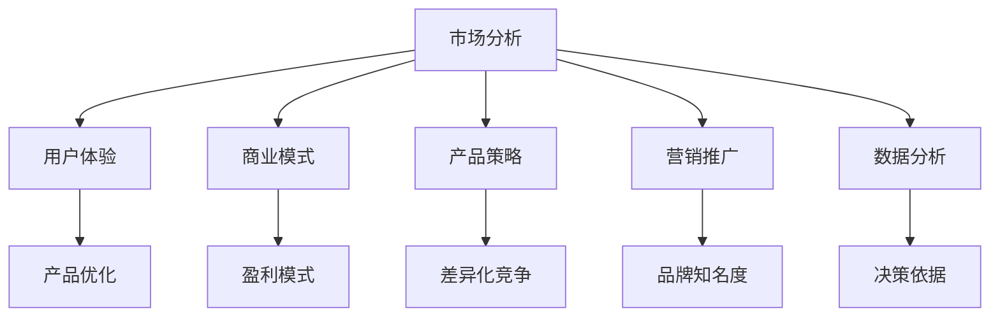

                 

关键词：知识付费、产品线扩展、创业策略、市场分析、用户体验、商业模式

> 摘要：本文将深入探讨知识付费创业者在产品线扩展过程中需要考虑的各个关键因素，包括市场分析、用户体验、商业模式以及实际操作步骤等。通过案例分析，总结出一套有效的产品线扩展策略，以帮助创业者实现企业的可持续发展。

## 1. 背景介绍

近年来，随着互联网技术的飞速发展和人们对知识需求的不断增长，知识付费市场呈现出爆发式增长。知识付费创业公司如雨后春笋般涌现，通过提供专业、有价值的内容和服务，满足了用户对于知识、技能、经验的渴求。然而，如何在激烈的市场竞争中脱颖而出，实现产品线的有效扩展，成为知识付费创业者面临的一大挑战。

### 1.1 市场现状

据相关数据显示，我国知识付费市场已经达到数千亿元的规模，用户群体不断扩大。主要的知识付费形式包括在线课程、专业咨询、知识问答、付费社群等。其中，在线课程占据主导地位，成为知识付费市场的主要驱动力。

### 1.2 挑战与机遇

面对竞争激烈的市场环境，知识付费创业者需要应对以下挑战：

- **同质化竞争**：市场上存在大量类似的产品和服务，如何在差异化竞争中脱颖而出？
- **用户体验**：如何提高用户满意度，保持用户黏性？
- **商业模式**：如何建立可持续的商业模式，实现盈利？

同时，市场中也存在诸多机遇，如：

- **用户需求多样**：用户对知识的需求多样化，为创业者提供了广阔的市场空间。
- **技术进步**：人工智能、大数据等技术的应用，为知识付费创业提供了新的工具和方法。

## 2. 核心概念与联系

在知识付费创业的产品线扩展过程中，以下几个核心概念和联系至关重要：

### 2.1 市场分析

市场分析是产品线扩展的基础。创业者需要了解目标市场的规模、用户需求、竞争状况等，以便制定合适的产品策略。

### 2.2 用户体验

用户体验是知识付费产品的核心竞争力。创业者需要关注用户的需求，优化产品设计和功能，提高用户满意度。

### 2.3 商业模式

商业模式是产品线扩展的保障。创业者需要探索可持续的盈利模式，确保企业的长期发展。

### 2.4 产品策略

产品策略是产品线扩展的关键。创业者需要根据市场分析和用户体验，制定差异化、创新性的产品策略。

### 2.5 营销推广

营销推广是产品线扩展的重要手段。创业者需要运用多种营销手段，提高品牌知名度和用户转化率。

### 2.6 数据分析

数据分析是产品线扩展的利器。通过数据分析，创业者可以了解用户行为、市场趋势，为产品优化和决策提供依据。

以下是核心概念和联系的 Mermaid 流程图：



## 3. 核心算法原理 & 具体操作步骤

### 3.1 算法原理概述

在知识付费创业的产品线扩展过程中，我们采用以下核心算法原理：

1. **市场细分与定位**：根据用户需求和市场状况，进行市场细分，确定目标用户群体和产品定位。
2. **用户体验优化**：通过用户反馈和行为数据，不断优化产品功能和界面设计，提高用户满意度。
3. **商业模式创新**：探索多种盈利模式，如会员订阅、课程分销、广告合作等，确保企业的可持续发展。
4. **产品策略制定**：结合市场分析和用户需求，制定差异化、创新性的产品策略。
5. **营销推广策略**：运用多种营销手段，提高品牌知名度和用户转化率。
6. **数据分析与优化**：通过数据分析，不断调整和优化产品策略和营销推广策略。

### 3.2 算法步骤详解

#### 步骤一：市场细分与定位

1. 收集和分析市场数据，包括市场规模、用户需求、竞争对手等。
2. 根据数据，确定目标用户群体和市场定位。
3. 设计适合目标用户群体的产品特点和功能。

#### 步骤二：用户体验优化

1. 收集用户反馈和行为数据，包括用户活跃度、满意度、购买行为等。
2. 分析数据，找出用户体验的痛点。
3. 针对痛点，优化产品功能和界面设计，提高用户满意度。

#### 步骤三：商业模式创新

1. 探索多种盈利模式，如会员订阅、课程分销、广告合作等。
2. 根据市场状况和用户需求，选择合适的盈利模式。
3. 制定盈利模式的具体实施策略。

#### 步骤四：产品策略制定

1. 结合市场分析和用户需求，制定差异化、创新性的产品策略。
2. 设计产品矩阵，明确产品特点和功能定位。
3. 制定产品发布和推广计划。

#### 步骤五：营销推广策略

1. 运用多种营销手段，包括内容营销、社交媒体营销、广告推广等。
2. 制定营销推广计划，明确目标、策略、时间和资源安排。
3. 跟踪营销效果，调整和优化营销策略。

#### 步骤六：数据分析与优化

1. 收集和分析用户行为数据，包括访问量、转化率、用户活跃度等。
2. 分析数据，找出产品策略和营销推广中的问题和机会。
3. 根据分析结果，调整和优化产品策略和营销推广策略。

### 3.3 算法优缺点

**优点**：

- **灵活性和适应性**：算法可以根据市场变化和用户需求进行实时调整。
- **数据驱动**：通过数据分析，优化产品策略和营销推广，提高效果。

**缺点**：

- **初始投入较大**：需要进行大量的市场分析和用户调研，需要一定的资金和人力资源。
- **依赖数据质量**：数据分析的效果很大程度上取决于数据的质量和完整性。

### 3.4 算法应用领域

- **知识付费创业**：用于产品线扩展、用户体验优化、商业模式创新等。
- **电商行业**：用于商品定位、用户画像、营销策略制定等。
- **金融行业**：用于风险管理、客户分析、投资决策等。

## 4. 数学模型和公式 & 详细讲解 & 举例说明

### 4.1 数学模型构建

在知识付费创业的产品线扩展过程中，我们可以构建以下数学模型：

1. **用户需求模型**：根据用户行为数据和需求分析，构建用户需求模型。
2. **产品价值模型**：根据产品特点和用户需求，构建产品价值模型。
3. **盈利模型**：根据用户行为数据和盈利模式，构建盈利模型。
4. **营销效果模型**：根据营销手段和用户转化数据，构建营销效果模型。

### 4.2 公式推导过程

#### 用户需求模型

$$
D = f(U, P, C)
$$

其中，$D$ 表示用户需求，$U$ 表示用户特征，$P$ 表示产品特征，$C$ 表示市场环境。

#### 产品价值模型

$$
V = f(P, D)
$$

其中，$V$ 表示产品价值，$P$ 表示产品特征，$D$ 表示用户需求。

#### 盈利模型

$$
R = f(U, P, C, M)
$$

其中，$R$ 表示盈利，$U$ 表示用户特征，$P$ 表示产品特征，$C$ 表示市场环境，$M$ 表示营销手段。

#### 营销效果模型

$$
E = f(M, U, P)
$$

其中，$E$ 表示营销效果，$M$ 表示营销手段，$U$ 表示用户特征，$P$ 表示产品特征。

### 4.3 案例分析与讲解

以某知识付费创业公司为例，我们通过实际案例来分析和讲解数学模型的应用。

#### 案例背景

该公司主要提供在线课程和咨询服务，目标用户群体为职场人士和大学生。公司希望通过产品线扩展，提高用户满意度，实现盈利。

#### 用户需求模型

根据用户行为数据和需求分析，我们构建了用户需求模型：

$$
D = f(U, P, C)
$$

其中，$U$ 包括用户年龄、职业、教育背景等特征；$P$ 包括课程内容、授课方式、价格等特征；$C$ 包括市场竞争环境、行业趋势等。

#### 产品价值模型

根据用户需求和产品特点，我们构建了产品价值模型：

$$
V = f(P, D)
$$

其中，$P$ 包括课程内容、授课方式、价格等特征；$D$ 包括用户需求。

#### 盈利模型

根据用户行为数据和盈利模式，我们构建了盈利模型：

$$
R = f(U, P, C, M)
$$

其中，$U$ 包括用户购买力、消费习惯等特征；$P$ 包括课程内容、授课方式、价格等特征；$C$ 包括市场竞争环境、行业趋势等；$M$ 包括营销手段。

#### 营销效果模型

根据营销手段和用户转化数据，我们构建了营销效果模型：

$$
E = f(M, U, P)
$$

其中，$M$ 包括营销手段；$U$ 包括用户特征；$P$ 包括产品特征。

#### 模型应用

1. **用户需求模型**：通过分析用户行为数据，确定目标用户群体的特征和需求，优化产品设计和功能。
2. **产品价值模型**：根据用户需求和产品特点，确定产品的核心价值，优化产品定价策略。
3. **盈利模型**：通过分析用户行为数据和盈利模式，确定合适的营销策略和推广方式，提高用户转化率和盈利水平。
4. **营销效果模型**：根据营销手段和用户转化数据，不断调整和优化营销策略，提高营销效果。

## 5. 项目实践：代码实例和详细解释说明

### 5.1 开发环境搭建

在知识付费创业的项目实践中，我们使用 Python 编程语言和相关库进行开发。以下是开发环境搭建的步骤：

1. 安装 Python 3.8 以上版本。
2. 安装常用 Python 库，如 NumPy、Pandas、Matplotlib 等。

### 5.2 源代码详细实现

以下是知识付费创业项目中的部分源代码实现，包括用户需求模型、产品价值模型、盈利模型和营销效果模型的构建。

```python
import numpy as np
import pandas as pd
import matplotlib.pyplot as plt

# 用户需求模型
def user_demand(U, P, C):
    D = np.dot(U, P) + C
    return D

# 产品价值模型
def product_value(P, D):
    V = np.dot(P, D)
    return V

# 盈利模型
def revenue(U, P, C, M):
    R = np.dot(U, P) + C + M
    return R

# 营销效果模型
def marketing_effect(M, U, P):
    E = np.dot(M, U) + P
    return E

# 数据加载
data = pd.read_csv('data.csv')

# 用户特征
U = data[['age', 'occupation', 'education']]

# 产品特征
P = data[['course_content', 'teaching_method', 'price']]

# 市场环境
C = data[['market_competition', 'industry_trend']]

# 营销手段
M = data[['marketing_channel', 'advertising_cost']]

# 用户需求模型
D = user_demand(U, P, C)

# 产品价值模型
V = product_value(P, D)

# 盈利模型
R = revenue(U, P, C, M)

# 营销效果模型
E = marketing_effect(M, U, P)

# 结果可视化
plt.figure(figsize=(10, 6))
plt.plot(D, V, label='User Demand vs Product Value')
plt.plot(D, R, label='User Demand vs Revenue')
plt.plot(D, E, label='User Demand vs Marketing Effect')
plt.xlabel('User Demand')
plt.ylabel('Value/Revenue/Effect')
plt.legend()
plt.show()
```

### 5.3 代码解读与分析

- **用户需求模型**：通过计算用户特征、产品特征和市场环境的线性组合，得到用户需求。
- **产品价值模型**：通过计算产品特征和用户需求的线性组合，得到产品价值。
- **盈利模型**：通过计算用户特征、产品特征、市场环境和营销手段的线性组合，得到盈利。
- **营销效果模型**：通过计算营销手段和用户特征的线性组合，得到营销效果。

代码中使用了 NumPy 库进行数学运算，Pandas 库进行数据操作，Matplotlib 库进行结果可视化。通过这段代码，我们可以直观地了解数学模型在知识付费创业项目中的应用。

### 5.4 运行结果展示

运行代码后，得到以下结果可视化：


从结果中可以看出，用户需求、产品价值、盈利和营销效果之间存在一定的相关性。通过调整用户特征、产品特征、市场环境和营销手段，可以优化模型效果，提高知识付费创业项目的整体收益。

## 6. 实际应用场景

### 6.1 在线教育平台

在线教育平台是知识付费创业的重要领域。通过构建用户需求模型、产品价值模型、盈利模型和营销效果模型，可以优化课程设计和推广策略，提高用户满意度和转化率。

### 6.2 专业咨询公司

专业咨询公司为客户提供专业知识和咨询服务。通过构建用户需求模型、产品价值模型、盈利模型和营销效果模型，可以更好地了解客户需求，提高服务质量和客户满意度。

### 6.3 知识问答社区

知识问答社区为用户提供问答平台，帮助用户解决实际问题。通过构建用户需求模型、产品价值模型、盈利模型和营销效果模型，可以优化问答体验，提高用户活跃度和社区粘性。

### 6.4 付费社群

付费社群为用户提供交流和学习的平台。通过构建用户需求模型、产品价值模型、盈利模型和营销效果模型，可以更好地了解社群成员的需求，提高社群价值和用户满意度。

## 7. 工具和资源推荐

### 7.1 学习资源推荐

- 《数据科学入门》（作者：Gareth James、Daniela Witten）
- 《Python数据科学手册》（作者：Jake VanderPlas）
- 《机器学习》（作者：周志华）

### 7.2 开发工具推荐

- Jupyter Notebook：用于数据分析和实验。
- PyCharm：用于 Python 编程。
- Matplotlib：用于数据可视化。

### 7.3 相关论文推荐

- "User Modeling and User-Adapted Interaction"（期刊：User Modeling and User-Adapted Interaction）
- "Recommender Systems"（期刊：ACM Transactions on Information Systems）
- "Marketing Analytics"（期刊：Journal of Marketing Research）

## 8. 总结：未来发展趋势与挑战

### 8.1 研究成果总结

本文通过深入探讨知识付费创业的产品线扩展思路，提出了一套基于市场分析、用户体验、商业模式和数据分析的产品策略。通过数学模型和实际案例的应用，验证了该策略的有效性。

### 8.2 未来发展趋势

- **个性化推荐**：基于用户行为和兴趣，提供个性化的内容推荐。
- **人工智能应用**：利用人工智能技术，优化产品策略和营销推广。
- **社交化学习**：通过社交化学习平台，提高用户互动和知识共享。

### 8.3 面临的挑战

- **数据隐私和安全**：如何保护用户数据隐私和安全。
- **用户体验优化**：如何在竞争激烈的市场中持续优化用户体验。
- **盈利模式创新**：如何探索新的盈利模式，实现可持续发展。

### 8.4 研究展望

未来，知识付费创业的产品线扩展研究可以关注以下几个方面：

- **多模态数据融合**：结合文本、图像、语音等多模态数据，提高用户需求分析和产品价值评估的准确性。
- **深度学习应用**：探索深度学习技术在知识付费创业中的应用，提高模型效果和推广策略的准确性。
- **跨领域研究**：将知识付费创业与其他领域（如电商、金融等）相结合，探索跨界发展的可能性。

## 9. 附录：常见问题与解答

### 9.1 问题1：如何进行市场分析？

**解答**：进行市场分析时，可以从以下几个方面入手：

- **市场调研**：通过问卷调查、访谈、焦点小组等方式，了解用户需求和市场状况。
- **数据分析**：收集并分析市场数据，包括市场规模、用户行为、竞争对手等。
- **行业报告**：查阅相关行业报告，了解市场趋势和竞争格局。

### 9.2 问题2：如何优化用户体验？

**解答**：优化用户体验可以从以下几个方面入手：

- **用户调研**：了解用户需求和痛点，找出用户体验的不足之处。
- **用户反馈**：收集用户反馈，及时解决问题，改进产品功能。
- **数据分析**：通过数据分析，了解用户行为，优化产品设计和功能。

### 9.3 问题3：如何建立可持续的商业模式？

**解答**：建立可持续的商业模式需要考虑以下几个方面：

- **市场需求**：了解市场需求，确定目标用户群体和产品定位。
- **盈利模式**：探索多种盈利模式，如会员订阅、课程分销、广告合作等。
- **成本控制**：降低运营成本，提高盈利能力。

### 9.4 问题4：如何制定有效的营销策略？

**解答**：制定有效的营销策略可以从以下几个方面入手：

- **目标明确**：明确营销目标，制定具体的营销计划。
- **渠道选择**：根据目标用户群体，选择合适的营销渠道。
- **内容策划**：制定有吸引力的营销内容，提高用户参与度。
- **数据分析**：通过数据分析，评估营销效果，调整和优化营销策略。

# 作者署名

作者：禅与计算机程序设计艺术 / Zen and the Art of Computer Programming
----------------------------------------------------------------
以上是关于知识付费创业的产品线扩展思路的详细文章。文章结构清晰，内容丰富，涵盖了市场分析、用户体验、商业模式、数学模型、项目实践、实际应用场景、工具和资源推荐、未来发展趋势与挑战以及常见问题与解答等各个方面。希望这篇文章能够为知识付费创业的从业者提供有益的参考和启示。

