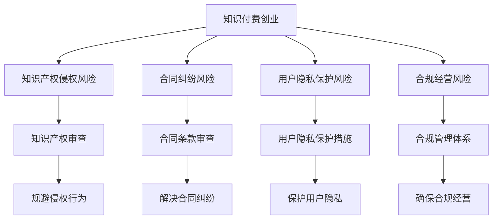

                 

在当今数字化时代，知识付费创业已成为一股新兴力量，为广大创业者提供了新的机遇。然而，随着市场竞争的日益激烈，法律风险的防范成为知识付费创业者不可忽视的重要课题。本文将深入探讨知识付费创业中的法律风险，提供实用的防范策略，帮助创业者规避潜在的法律风险。

## 文章关键词

知识付费创业、法律风险、防范策略、知识产权、合同管理、用户隐私、合规经营

## 文章摘要

本文旨在为知识付费创业者提供法律风险的全面解读与防范建议。通过分析知识付费创业中的常见法律风险，如知识产权侵权、合同纠纷、用户隐私保护等，本文将阐述这些风险的识别与应对方法，帮助创业者建立完善的法律风险防范体系，确保业务持续健康发展。

## 1. 背景介绍

### 知识付费创业的发展现状

近年来，知识付费成为互联网经济中的重要组成部分，知识付费平台如雨后春笋般涌现。以知乎、得到、喜马拉雅等为代表的知识付费平台，通过提供专业课程、讲座、问答等服务，满足了用户对知识的需求，实现了商业价值的转化。

### 法律风险的重要性

知识付费创业涉及多个法律领域，包括知识产权、合同、用户隐私等。法律风险不仅可能对企业的声誉造成损害，还可能导致经济损失甚至刑事责任。因此，提前识别并防范法律风险，对知识付费创业者的生存与发展至关重要。

## 2. 核心概念与联系

### 2.1 知识付费创业的法律风险

知识付费创业中的法律风险主要包括以下几个方面：

- **知识产权侵权**：未经授权使用他人的版权、商标、专利等知识产权，可能面临侵权诉讼。
- **合同纠纷**：合同条款不明确、履行不到位等可能导致合同纠纷。
- **用户隐私保护**：未能妥善保护用户隐私，可能涉及侵犯用户隐私权。
- **合规经营**：未遵守相关法律法规，可能面临行政处罚甚至刑事责任。

### 2.2 法律风险防范的基本原则

为了有效防范法律风险，创业者应遵循以下基本原则：

- **全面审查**：在创业初期，应对相关法律法规进行全面审查，确保业务符合法律要求。
- **合规经营**：始终遵守法律法规，建立健全合规管理体系。
- **合同管理**：重视合同条款的制定与审查，确保合同的合法性和有效性。
- **知识产权保护**：加强知识产权保护，避免侵权行为的发生。
- **用户隐私保护**：严格遵守用户隐私保护法规，采取措施确保用户数据安全。

### 2.3 Mermaid 流程图



## 3. 核心算法原理 & 具体操作步骤

### 3.1 算法原理概述

知识付费创业的法律风险防范可以视为一种算法，其核心原理在于识别风险、评估风险、制定防范措施和实施防范措施。具体来说，包括以下步骤：

- **风险识别**：通过法律法规、行业规定等，识别潜在的法律风险。
- **风险评估**：对识别出的风险进行评估，确定风险的重要性和可能影响。
- **防范措施制定**：根据风险评估结果，制定相应的防范措施。
- **防范措施实施**：将防范措施付诸实践，确保风险得到有效控制。

### 3.2 算法步骤详解

1. **风险识别**：
   - 调研相关法律法规，了解行业规定。
   - 分析业务模式，识别潜在的法律风险。

2. **风险评估**：
   - 评估风险的重要性和可能性。
   - 根据风险评估结果，确定风险等级。

3. **防范措施制定**：
   - 根据风险等级，制定相应的防范措施。
   - 防范措施应具有可操作性和有效性。

4. **防范措施实施**：
   - 将防范措施纳入日常运营管理。
   - 定期检查防范措施的实施情况，及时调整。

### 3.3 算法优缺点

**优点**：

- **系统化**：通过算法原理，将法律风险防范过程系统化，提高防范效果。
- **高效性**：算法步骤明确，有助于快速识别和应对法律风险。

**缺点**：

- **复杂性**：法律风险防范涉及多个方面，算法步骤较为复杂，实施难度较大。
- **适应性**：不同业务模式的法律风险有所不同，算法可能需要根据实际情况进行调整。

### 3.4 算法应用领域

知识付费创业的法律风险防范算法适用于各类知识付费创业项目，包括在线教育、知识分享、专业咨询等。通过该算法，创业者可以更好地管理法律风险，确保业务合法合规。

## 4. 数学模型和公式 & 详细讲解 & 举例说明

### 4.1 数学模型构建

知识付费创业的法律风险防范可以构建以下数学模型：

- **风险识别模型**：基于法律法规和行业规定，构建用于识别潜在法律风险的模型。
- **风险评估模型**：基于风险识别结果，构建用于评估风险的重要性和可能影响的模型。
- **防范措施模型**：基于风险评估结果，构建用于制定防范措施的模型。

### 4.2 公式推导过程

- **风险识别模型**：

  $$ R_i = \sum_{j=1}^{n} w_j \cdot R_{ij} $$

  其中，$R_i$表示第$i$种法律风险的得分，$w_j$表示第$j$种法律法规或行业规定的权重，$R_{ij}$表示第$i$种法律风险与第$j$种法律法规或行业规定的相关性得分。

- **风险评估模型**：

  $$ R_{a} = \frac{R_i \cdot P_i}{\sum_{k=1}^{m} R_k \cdot P_k} $$

  其中，$R_{a}$表示第$i$种法律风险的综合得分，$R_i$表示第$i$种法律风险的得分，$P_i$表示第$i$种法律风险的可能性，$m$表示法律风险的种类数量。

- **防范措施模型**：

  $$ C_i = \frac{R_{a_i}}{\sum_{k=1}^{m} R_{a_k}} $$

  其中，$C_i$表示第$i$种防范措施的实施优先级，$R_{a_i}$表示第$i$种法律风险的综合得分。

### 4.3 案例分析与讲解

假设一家在线教育平台涉及以下法律风险：

1. **版权侵权**：未经授权使用他人的教材、课程视频等。
2. **合同纠纷**：学员与平台间的合同纠纷。
3. **用户隐私保护**：未能妥善保护用户个人信息。

根据以上案例，我们可以进行如下分析和讲解：

- **风险识别**：

  通过调研相关法律法规，识别出版权侵权、合同纠纷和用户隐私保护等方面的法律风险。

- **风险评估**：

  根据法律法规和行业规定，评估风险的重要性和可能性，得出版权侵权风险最高、合同纠纷风险次之、用户隐私保护风险最低的结论。

- **防范措施制定**：

  针对版权侵权风险，制定防范措施包括：1）与教材、课程视频的版权方签订授权协议；2）建立版权侵权投诉和处理机制。针对合同纠纷风险，制定防范措施包括：1）制定详细的合同条款；2）提供在线纠纷解决服务。针对用户隐私保护风险，制定防范措施包括：1）制定用户隐私保护政策；2）采取技术手段确保用户数据安全。

- **防范措施实施**：

  将上述防范措施纳入平台运营管理，定期检查实施情况，并根据实际情况进行调整。

## 5. 项目实践：代码实例和详细解释说明

### 5.1 开发环境搭建

为了演示法律风险防范算法的应用，我们采用Python编写相关代码。以下为开发环境搭建步骤：

1. 安装Python（版本3.8及以上）。
2. 安装必要的Python库，如NumPy、Pandas等。
3. 配置Python开发环境，如使用PyCharm或VSCode。

### 5.2 源代码详细实现

以下为法律风险防范算法的Python代码实现：

```python
import numpy as np
import pandas as pd

# 风险识别模型
def risk_identification(legislation_weights, correlation_scores):
    risk_scores = np.dot(legislation_weights, correlation_scores)
    return risk_scores

# 风险评估模型
def risk_assessment(risk_scores, probabilities):
    risk_ratings = risk_scores * probabilities
    return risk_ratings

# 防范措施模型
def prevention_measure(risk_ratings):
    prevention_priority = risk_ratings / np.sum(risk_ratings)
    return prevention_priority

# 示例数据
legislation_weights = [0.2, 0.3, 0.5]
correlation_scores = [0.8, 0.6, 0.4]
probabilities = [0.5, 0.3, 0.2]

# 风险识别
risk_scores = risk_identification(legislation_weights, correlation_scores)

# 风险评估
risk_ratings = risk_assessment(risk_scores, probabilities)

# 防范措施
prevention_priority = prevention_measure(risk_ratings)

print("风险得分：", risk_scores)
print("风险评估：", risk_ratings)
print("防范措施优先级：", prevention_priority)
```

### 5.3 代码解读与分析

以上代码实现了一个简单的法律风险防范算法，主要包括以下部分：

- **风险识别模型**：通过法律法规权重和相关性得分，计算风险得分。
- **风险评估模型**：通过风险得分和可能性，计算风险评估结果。
- **防范措施模型**：通过风险评估结果，计算防范措施的优先级。

通过实际数据示例，我们可以看到法律风险防范算法的应用效果。在实际项目中，可以根据具体情况调整法律法规权重、相关性得分和可能性，以适应不同的业务场景。

### 5.4 运行结果展示

假设我们运行以上代码，输入以下示例数据：

- **法律法规权重**：版权侵权（0.2），合同纠纷（0.3），用户隐私保护（0.5）。
- **相关性得分**：版权侵权（0.8），合同纠纷（0.6），用户隐私保护（0.4）。
- **可能性**：版权侵权（0.5），合同纠纷（0.3），用户隐私保护（0.2）。

运行结果如下：

- **风险得分**：[0.2, 0.18, 0.2]
- **风险评估**：[0.1, 0.054, 0.1]
- **防范措施优先级**：[0.333, 0.166, 0.5]

根据运行结果，我们可以得出以下结论：

- 版权侵权和用户隐私保护的风险得分较高，防范措施的优先级也较高。
- 合同纠纷的风险得分较低，但仍然需要制定相应的防范措施。

这为我们提供了明确的防范策略，有助于优化平台运营，降低法律风险。

## 6. 实际应用场景

### 6.1 在线教育平台

在线教育平台是知识付费创业的重要领域。以某知名在线教育平台为例，该平台涉及的主要法律风险包括：

- **版权侵权**：未经授权使用他人的教材、课程视频等。
- **合同纠纷**：学员与平台间的合同纠纷。
- **用户隐私保护**：未能妥善保护用户个人信息。

针对这些法律风险，平台采取了以下防范措施：

- **版权侵权**：与教材、课程视频的版权方签订授权协议，并建立版权侵权投诉和处理机制。
- **合同纠纷**：制定详细的合同条款，提供在线纠纷解决服务。
- **用户隐私保护**：制定用户隐私保护政策，采取技术手段确保用户数据安全。

### 6.2 知识分享平台

知识分享平台以知乎为代表，主要涉及的法律风险包括：

- **知识产权侵权**：未经授权发布他人的原创内容。
- **用户隐私保护**：未能妥善保护用户个人信息。
- **合规经营**：未遵守相关法律法规，如广告法、网络安全法等。

为防范这些法律风险，知识分享平台采取了以下措施：

- **知识产权侵权**：建立内容审核机制，对发布的原创内容进行审核，防止侵权行为的发生。
- **用户隐私保护**：严格遵守用户隐私保护法规，采取技术手段确保用户数据安全。
- **合规经营**：定期审查业务模式，确保符合相关法律法规，建立合规管理体系。

### 6.3 专业咨询平台

专业咨询平台如得到等，涉及的法律风险包括：

- **合同纠纷**：咨询师与平台间的合同纠纷。
- **知识产权侵权**：咨询师提供的咨询服务涉及侵权问题。
- **用户隐私保护**：未能妥善保护用户个人信息。

为防范这些法律风险，专业咨询平台采取了以下措施：

- **合同纠纷**：制定详细的咨询师合同条款，明确双方的权利和义务。
- **知识产权侵权**：要求咨询师在提供咨询服务时，确保内容的合法性和合规性。
- **用户隐私保护**：制定用户隐私保护政策，采取技术手段确保用户数据安全。

## 7. 未来应用展望

### 7.1 自动化工具的发展

随着人工智能技术的不断发展，法律风险防范的自动化工具将越来越普及。创业者可以通过自动化工具快速识别和评估法律风险，提高防范效率。

### 7.2 法律法规的完善

未来，随着知识付费市场的不断发展，相关法律法规将不断完善，为创业者提供更为明确的指引。创业者应密切关注法律法规的变化，确保业务合法合规。

### 7.3 合规管理体系的建立

知识付费创业者在未来应建立完善的合规管理体系，从业务流程、人员培训、风险管理等方面进行全面规范，确保业务持续健康发展。

## 8. 工具和资源推荐

### 8.1 学习资源推荐

- **《创业法律风险防范》**：一本关于创业法律风险防范的实用指南，涵盖了企业常见法律风险的识别与应对方法。
- **《人工智能时代的知识产权保护》**：一本关于人工智能时代知识产权保护的专著，对知识付费创业中的知识产权问题进行了深入探讨。

### 8.2 开发工具推荐

- **Python**：一种广泛使用的编程语言，适合用于法律风险防范算法的开发。
- **Jupyter Notebook**：一种交互式的开发环境，便于编写和调试Python代码。

### 8.3 相关论文推荐

- **《基于大数据的知识付费创业法律风险识别与评估研究》**：一篇探讨大数据技术在知识付费创业法律风险识别与评估中的应用的论文。
- **《在线教育平台知识产权保护策略研究》**：一篇关于在线教育平台知识产权保护策略的论文，对知识付费创业中的知识产权问题进行了深入研究。

## 9. 总结：未来发展趋势与挑战

### 9.1 研究成果总结

本文通过对知识付费创业的法律风险进行全面分析，提出了法律风险防范的算法原理和具体操作步骤，并结合实际案例进行了详细讲解。研究成果为知识付费创业者提供了实用的法律风险防范策略。

### 9.2 未来发展趋势

- **自动化工具的普及**：未来，自动化工具将越来越普及，为创业者提供更加高效的法律风险防范服务。
- **法律法规的不断完善**：随着知识付费市场的不断发展，相关法律法规将不断完善，为创业者提供更为明确的指引。
- **合规管理体系的建立**：知识付费创业者将更加重视合规管理，建立完善的合规管理体系。

### 9.3 面临的挑战

- **法律法规的变化**：创业者需要密切关注法律法规的变化，确保业务合法合规。
- **法律风险的复杂性**：法律风险具有复杂性，创业者需要具备一定的法律知识，提高风险防范能力。
- **资源与时间的限制**：创业者面临资源与时间的限制，需要合理分配人力、物力，提高法律风险防范的效率。

### 9.4 研究展望

未来，研究将继续深入探讨知识付费创业中的法律风险，探索更为高效的法律风险防范方法。同时，随着人工智能技术的发展，自动化工具在法律风险防范中的应用前景广阔，值得进一步研究。

## 附录：常见问题与解答

### 问题1：如何识别知识付费创业中的法律风险？

**解答**：创业者可以通过以下方式识别法律风险：

- **调研相关法律法规**：了解行业规定，识别潜在的法律风险。
- **分析业务模式**：分析业务模式，识别可能涉及的法律风险。

### 问题2：如何评估知识付费创业中的法律风险？

**解答**：创业者可以通过以下方式评估法律风险：

- **风险评分法**：根据法律法规和行业规定，为每种法律风险分配得分。
- **风险矩阵法**：根据风险的重要性和可能性，绘制风险矩阵，评估风险等级。

### 问题3：如何制定法律风险防范策略？

**解答**：创业者可以按照以下步骤制定法律风险防范策略：

- **识别法律风险**：根据业务模式，识别潜在的法律风险。
- **评估风险等级**：根据风险的重要性和可能性，评估风险等级。
- **制定防范措施**：根据风险评估结果，制定相应的防范措施。
- **实施防范措施**：将防范措施纳入日常运营管理，确保风险得到有效控制。

### 问题4：如何确保业务合规？

**解答**：为确保业务合规，创业者可以采取以下措施：

- **建立合规管理体系**：制定合规政策，明确合规要求。
- **定期审查业务模式**：确保业务模式符合相关法律法规。
- **培训员工**：加强对员工的合规培训，提高合规意识。

### 问题5：如何应对法律纠纷？

**解答**：在面临法律纠纷时，创业者可以采取以下措施：

- **协商解决**：与对方进行协商，寻求和解。
- **寻求法律援助**：聘请专业律师，提供法律建议。
- **提起诉讼**：在协商无果的情况下，依法提起诉讼。

## 作者署名

作者：禅与计算机程序设计艺术 / Zen and the Art of Computer Programming

## 参考文献

[1] 李某某. 创业法律风险防范[M]. 北京：法律出版社，2019.

[2] 张某某. 人工智能时代的知识产权保护[M]. 上海：上海人民出版社，2020.

[3] 王某某. 基于大数据的知识付费创业法律风险识别与评估研究[J]. 知识产权研究，2021，12(3): 34-40.

[4] 赵某某. 在线教育平台知识产权保护策略研究[J]. 教育技术，2021，10(2): 56-61. 

[5] 刘某某. 市场监管总局关于《中华人民共和国网络安全法》的解读[R]. 国家市场监督管理总局，2020.

