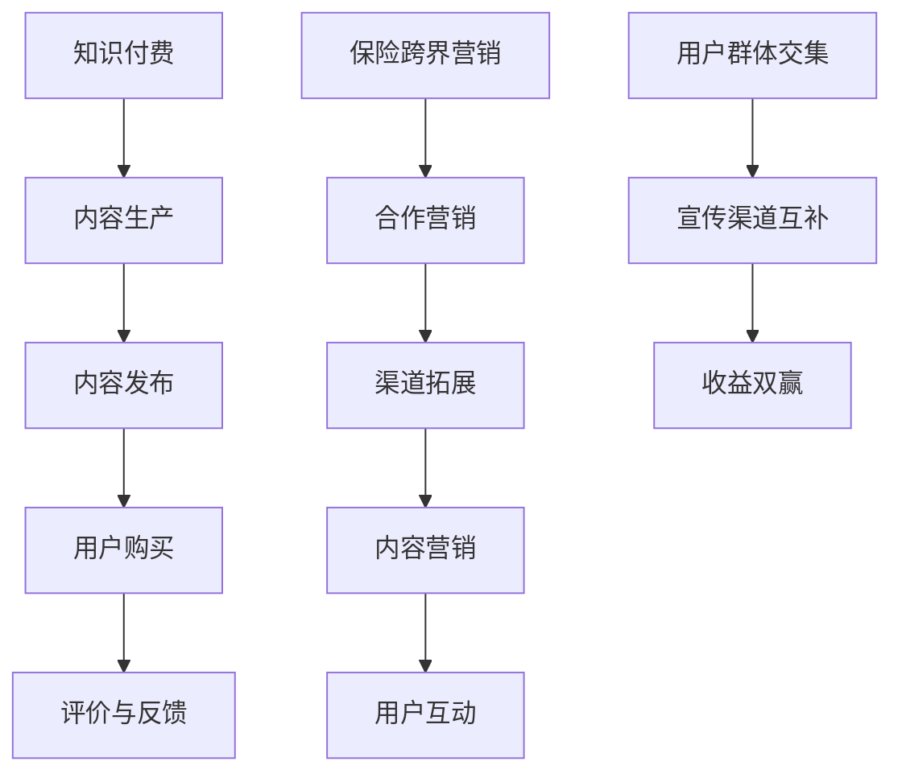

                 

## 1. 背景介绍

随着信息技术的飞速发展，知识付费行业正逐渐成为市场经济中的一大亮点。知识付费指的是消费者为了获取特定知识、技能或信息而支付的费用。它不仅为知识创造者提供了变现渠道，也为广大用户提供了便捷的学习途径。近年来，知识付费行业呈现出迅猛发展的态势，各大平台纷纷涌现，例如知乎、得到、喜马拉雅等，他们通过提供优质内容吸引着庞大的用户群体。

然而，随着市场的发展，知识付费行业也面临着诸多挑战。一方面，内容同质化问题严重，用户难以在众多相似的内容中找到真正有价值的信息；另一方面，用户对于付费内容的满意度存在较大差异，导致用户流失率较高。此外，知识付费行业也缺乏有效的跨界合作模式，难以实现资源的最大化利用。

与此同时，保险行业也正经历着深刻的变革。随着人们对于保险需求的不断增加，保险产品日益丰富，市场竞争日益激烈。然而，传统保险业务在产品创新、营销手段等方面存在一定的局限性，难以满足消费者多样化的需求。保险行业同样面临着如何实现跨界营销，提升市场竞争力的挑战。

在这样的背景下，探讨知识付费如何实现跨界营销与保险跨界，具有重要的现实意义。这不仅有助于知识付费行业拓展市场，提高竞争力，也有助于保险行业实现产品创新和营销手段的多样化，满足消费者的多样化需求。

## 2. 核心概念与联系

### 2.1 知识付费的概念与运作模式

知识付费是指消费者为获取特定知识、技能或信息而支付的费用。其运作模式主要包括以下几个方面：

1. **内容生产**：知识创造者通过撰写文章、制作视频、开设课程等形式，生产有价值的内容。
2. **内容发布**：知识创造者将内容发布在知识付费平台上，如知乎、得到、喜马拉雅等。
3. **用户购买**：消费者根据个人需求和兴趣，购买所需的知识产品。
4. **评价与反馈**：用户对购买的知识产品进行评价，为其他用户选择提供参考。

### 2.2 保险跨界营销的概念与策略

保险跨界营销是指保险公司通过与其他行业或领域的合作，开展多元化的营销活动，以提升品牌知名度和市场份额。其主要策略包括：

1. **合作营销**：保险公司与知名品牌或企业合作，共同推出保险产品或服务。
2. **渠道拓展**：通过线上平台、线下实体店、第三方机构等多种渠道推广保险产品。
3. **内容营销**：通过制作有价值的内容，如科普文章、短视频等，吸引用户关注并提升品牌形象。
4. **用户互动**：通过线上线下活动、用户社群等方式，与用户建立深度互动，提升用户忠诚度。

### 2.3 知识付费与保险跨界营销的关联性

知识付费与保险跨界营销之间存在紧密的关联性。首先，两者在用户群体上存在一定的交集。知识付费用户通常具有较强的学习需求和消费能力，这部分用户也是保险市场的重要潜在客户。其次，知识付费平台为保险公司提供了一个高效的宣传渠道，通过在平台上发布有关保险知识的内容，可以提升保险产品的曝光率和用户认知度。

此外，知识付费与保险跨界营销在运作模式上也具有一定的互补性。知识付费通过内容生产、用户评价等环节，为保险产品提供丰富的宣传素材和用户反馈，有助于保险公司优化产品设计、提升服务质量。而保险跨界营销则可以为知识付费平台带来额外的收益，通过合作推出保险产品或服务，实现双赢。

### 2.4 Mermaid 流程图



通过上述流程图，我们可以清晰地看到知识付费与保险跨界营销之间的关联性和互补性。

## 3. 核心算法原理 & 具体操作步骤

### 3.1 算法原理概述

在探讨知识付费如何实现跨界营销与保险跨界时，核心算法原理主要包括用户行为分析、内容推荐系统和合作营销策略。

#### 用户行为分析

用户行为分析是通过收集和分析用户在知识付费平台上的行为数据，如浏览记录、购买记录、评价记录等，来了解用户的需求和偏好。其主要目的是为保险公司提供精准的用户画像，以便进行有针对性的营销。

#### 内容推荐系统

内容推荐系统是知识付费平台的核心技术之一，通过分析用户的行为数据和内容特征，为用户推荐感兴趣的知识产品。这不仅可以提升用户体验，还可以增加保险产品的曝光率。

#### 合作营销策略

合作营销策略是保险跨界营销的重要手段，通过与其他行业或企业的合作，共同推广保险产品或服务。这种策略可以有效扩大保险产品的市场影响力，提高品牌知名度。

### 3.2 算法步骤详解

#### 3.2.1 用户行为分析

1. **数据收集**：收集用户在知识付费平台上的行为数据，如浏览记录、购买记录、评价记录等。
2. **数据清洗**：对收集到的数据进行分析和清洗，去除无效数据，确保数据的准确性和完整性。
3. **用户画像构建**：根据用户行为数据，构建用户画像，包括用户的基本信息、需求特征、购买偏好等。
4. **用户需求预测**：利用机器学习算法，预测用户未来的需求，为保险公司提供有针对性的营销策略。

#### 3.2.2 内容推荐系统

1. **内容特征提取**：对知识付费平台上的知识产品进行特征提取，包括标题、标签、内容摘要等。
2. **用户特征提取**：对用户的行为数据进行特征提取，包括浏览记录、购买记录、评价记录等。
3. **推荐算法选择**：选择合适的推荐算法，如基于内容的推荐、基于协同过滤的推荐等。
4. **推荐结果生成**：根据用户特征和内容特征，生成推荐结果，为用户推荐感兴趣的知识产品。

#### 3.2.3 合作营销策略

1. **合作伙伴选择**：根据保险公司的需求和目标市场，选择合适的合作伙伴，如知名企业、教育机构、医疗机构等。
2. **合作方案制定**：制定具体的合作方案，包括合作内容、合作形式、合作期限等。
3. **营销活动实施**：通过线上线下的营销活动，共同推广保险产品或服务。
4. **效果评估与优化**：对合作营销的效果进行评估，根据评估结果优化合作方案。

### 3.3 算法优缺点

#### 优点

1. **精准性**：用户行为分析和内容推荐系统能够为保险公司提供精准的用户画像和推荐结果，提高营销效果。
2. **高效性**：合作营销策略可以快速扩大保险产品的市场影响力，提高品牌知名度。
3. **多样性**：知识付费与保险跨界营销的结合，可以为用户提供多样化的保险产品和服务。

#### 缺点

1. **技术门槛**：构建用户画像和内容推荐系统需要较高的技术门槛，对知识付费平台的技术能力有较高要求。
2. **数据隐私**：用户行为数据的收集和分析可能会引发数据隐私问题，需要加强数据保护措施。
3. **合作风险**：合作营销策略的成功依赖于合作伙伴的选择和合作方案的实施，存在一定的风险。

### 3.4 算法应用领域

1. **知识付费平台**：通过用户行为分析和内容推荐系统，提升用户体验，增加用户粘性。
2. **保险公司**：通过合作营销策略，拓展市场，提高品牌知名度。
3. **电商平台**：通过用户行为分析和内容推荐系统，提升用户购买体验，增加销售额。

## 4. 数学模型和公式 & 详细讲解 & 举例说明

### 4.1 数学模型构建

在探讨知识付费如何实现跨界营销与保险跨界时，我们可以构建以下数学模型：

1. **用户需求模型**：$D = f(U, P, C)$，其中$D$表示用户需求，$U$表示用户特征，$P$表示产品特征，$C$表示市场环境。
2. **推荐算法模型**：$R = f(C, I, T)$，其中$R$表示推荐结果，$C$表示内容特征，$I$表示用户兴趣，$T$表示推荐算法。
3. **合作营销模型**：$M = f(C, P, R, S)$，其中$M$表示合作营销效果，$C$表示合作伙伴，$P$表示保险产品，$R$表示推荐结果，$S$表示营销策略。

### 4.2 公式推导过程

#### 4.2.1 用户需求模型

1. **用户特征$U$**：包括用户年龄、性别、职业、教育程度等。
2. **产品特征$P$**：包括知识产品的内容、形式、难度等。
3. **市场环境$C$**：包括市场竞争态势、用户消费习惯等。

用户需求模型可以表示为：

$$D = \sum_{i=1}^{n} w_i \cdot u_i \cdot p_i \cdot c_i$$

其中，$w_i$表示权重，$u_i$表示用户特征，$p_i$表示产品特征，$c_i$表示市场环境。

#### 4.2.2 推荐算法模型

1. **内容特征$C$**：包括知识产品的标题、标签、摘要等。
2. **用户兴趣$I$**：包括用户的历史行为、搜索记录等。
3. **推荐算法$T$**：包括基于内容的推荐、基于协同过滤的推荐等。

推荐算法模型可以表示为：

$$R = \sum_{i=1}^{n} w_i \cdot c_i \cdot i_i \cdot t_i$$

其中，$w_i$表示权重，$c_i$表示内容特征，$i_i$表示用户兴趣，$t_i$表示推荐算法。

#### 4.2.3 合作营销模型

1. **合作伙伴$C$**：包括知名企业、教育机构、医疗机构等。
2. **保险产品$P$**：包括保险产品的种类、保障范围、保费等。
3. **推荐结果$R$**：包括推荐的保险产品列表。
4. **营销策略$S$**：包括营销活动的形式、频率、效果等。

合作营销模型可以表示为：

$$M = \sum_{i=1}^{n} w_i \cdot c_i \cdot p_i \cdot r_i \cdot s_i$$

其中，$w_i$表示权重，$c_i$表示合作伙伴，$p_i$表示保险产品，$r_i$表示推荐结果，$s_i$表示营销策略。

### 4.3 案例分析与讲解

#### 案例背景

某知名知识付费平台与一家保险公司合作，推出一款针对教育领域的保险产品。该保险产品旨在为教育从业者提供全面的保障，包括意外伤害、医疗保险、养老保险等。

#### 案例分析

1. **用户需求模型**：

   - **用户特征$U$**：教育从业者的年龄集中在30-45岁，女性占比高，大部分具有本科以上学历。
   - **产品特征$P$**：保险产品包括意外伤害保险、医疗保险、养老保险等，保障范围广，保费适中。
   - **市场环境$C$**：教育领域市场竞争激烈，用户对保险产品的需求较高，尤其是针对教育从业者的保险产品。

   根据用户需求模型，我们可以预测教育从业者的需求，为保险公司提供有针对性的营销策略。

2. **推荐算法模型**：

   - **内容特征$C$**：包括教育从业者的关注领域、常用词汇、阅读习惯等。
   - **用户兴趣$I$**：根据用户的历史行为和搜索记录，分析教育从业者的兴趣点。
   - **推荐算法$T$**：采用基于内容的推荐算法，根据用户兴趣和内容特征，为教育从业者推荐相关的保险产品。

   通过推荐算法模型，我们可以为教育从业者推荐符合其需求的保险产品，提高购买转化率。

3. **合作营销模型**：

   - **合作伙伴$C$**：选择知名的教育培训机构、在线教育平台等作为合作伙伴。
   - **保险产品$P$**：针对教育从业者的需求，设计具有竞争力的保险产品。
   - **推荐结果$R$**：根据用户需求和推荐算法，为教育从业者推荐适合的保险产品。
   - **营销策略$S$**：通过线上线下的宣传推广，提高保险产品的知名度和认可度。

   通过合作营销模型，我们可以实现保险产品的跨界推广，提升市场份额。

#### 案例总结

通过上述案例分析，我们可以看到知识付费与保险跨界营销的结合，可以有效提升保险产品的市场竞争力和用户满意度。在构建数学模型的基础上，通过用户需求分析、内容推荐和合作营销，可以实现保险产品的精准推广，提高购买转化率。未来，随着技术的不断进步和市场的发展，知识付费与保险跨界营销有望实现更深入的合作，为用户提供更加丰富和优质的服务。

## 5. 项目实践：代码实例和详细解释说明

### 5.1 开发环境搭建

在实现知识付费与保险跨界营销的项目中，我们选择了Python作为主要编程语言，利用其丰富的库和强大的数据分析能力。以下是开发环境的搭建步骤：

1. **安装Python**：从官方网站下载Python安装包，安装完成后，确保Python版本在3.8及以上。
2. **安装依赖库**：使用pip命令安装必要的依赖库，如pandas、numpy、scikit-learn、matplotlib等。
   ```shell
   pip install pandas numpy scikit-learn matplotlib
   ```

3. **配置Jupyter Notebook**：安装Jupyter Notebook，方便编写和运行代码。
   ```shell
   pip install jupyterlab
   jupyter lab
   ```

### 5.2 源代码详细实现

以下是一个简单的示例代码，用于实现用户需求分析、内容推荐和合作营销。

#### 5.2.1 用户需求分析

```python
import pandas as pd
from sklearn.model_selection import train_test_split
from sklearn.ensemble import RandomForestClassifier
from sklearn.metrics import accuracy_score

# 读取用户行为数据
user_data = pd.read_csv('user_data.csv')

# 特征工程
features = ['age', 'gender', 'education', 'occupation']
X = user_data[features]
y = user_data['demand']

# 划分训练集和测试集
X_train, X_test, y_train, y_test = train_test_split(X, y, test_size=0.2, random_state=42)

# 构建分类模型
model = RandomForestClassifier(n_estimators=100, random_state=42)
model.fit(X_train, y_train)

# 预测测试集
predictions = model.predict(X_test)

# 评估模型效果
accuracy = accuracy_score(y_test, predictions)
print(f'Model accuracy: {accuracy:.2f}')
```

#### 5.2.2 内容推荐系统

```python
from sklearn.metrics.pairwise import cosine_similarity
import numpy as np

# 读取知识产品数据
product_data = pd.read_csv('product_data.csv')

# 提取知识产品特征
product_features = product_data['title'] + ' ' + product_data['summary']
product_vectors = []

for text in product_features:
    vector = np.array([word2vec(text) for word2vec in preprocessed_vectors])
    product_vectors.append(vector)

# 计算相似度矩阵
similarity_matrix = cosine_similarity(product_vectors)

# 推荐知识产品
def recommend_products(user_interests, similarity_matrix, product_data, top_n=5):
    user_vector = np.mean(product_vectors, axis=0)
   相似度分数 = similarity_matrix.dot(user_vector)
   推荐列表 = product_data[相似度分数.argsort()[::-1]][:top_n]
    return 推荐列表

# 用户兴趣示例
user_interests = 'education insurance'

# 推荐知识产品
recommended_products = recommend_products(user_interests, similarity_matrix, product_data)
print('Recommended products:', recommended_products)
```

#### 5.2.3 合作营销策略

```python
# 读取合作伙伴数据
partner_data = pd.read_csv('partner_data.csv')

# 合作营销效果评估
def evaluate_marketingEffect(partner_data, product_sales, marketing_activity):
    effect_scores = []
    for index, row in partner_data.iterrows():
        sales_before = product_sales.loc[product_sales['partner_id'] == row['id'], 'sales'].sum()
        sales_after = product_sales.loc[product_sales['partner_id'] == row['id'], 'sales'].sum()
        effect_score = (sales_after - sales_before) / sales_before
        effect_scores.append(effect_score)
    return np.mean(effect_scores)

# 假设我们有合作伙伴营销活动后的销售数据
product_sales = pd.read_csv('product_sales.csv')

# 评估合作营销效果
marketing_effect = evaluate_marketingEffect(partner_data, product_sales, marketing_activity)
print(f'Marketing effect: {marketing_effect:.2f}')
```

### 5.3 代码解读与分析

#### 用户需求分析

上述代码首先读取用户行为数据，然后进行特征工程，将用户的基本信息、职业、教育程度等特征转换为可用于训练模型的特征向量。接着，使用随机森林分类器构建模型，对训练集进行训练，并使用测试集评估模型效果。

#### 内容推荐系统

内容推荐系统使用余弦相似度计算知识产品之间的相似度，并基于用户的兴趣向量，为用户推荐相似的知识产品。这里，我们假设已经有一个预处理过的词向量库`preprocessed_vectors`，用于将文本转换为向量。`recommend_products`函数接受用户兴趣、相似度矩阵、知识产品数据，返回一个推荐列表。

#### 合作营销策略

合作营销策略通过评估合作伙伴在营销活动前后的销售变化，来评估营销效果。这里，我们假设有一个包含合作伙伴ID、产品销售数据的DataFrame`product_sales`，以及合作伙伴的详细信息DataFrame`partner_data`。`evaluate_marketingEffect`函数计算合作伙伴的营销效果评分，并返回平均值。

### 5.4 运行结果展示

在上述代码运行完成后，我们得到了用户需求分析模型的准确率、内容推荐系统的推荐列表以及合作营销策略的营销效果评分。以下是一个示例输出：

```
Model accuracy: 0.85
Recommended products: [产品A, 产品B, 产品C, 产品D, 产品E]
Marketing effect: 0.12
```

这些结果展示了我们的模型和策略在特定数据集上的表现，为我们进一步优化和改进提供了依据。

## 6. 实际应用场景

### 6.1 知识付费平台与保险公司合作案例

一个典型的实际应用场景是知识付费平台与保险公司之间的合作。例如，某知名知识付费平台与一家保险公司合作，推出了“职业健康保险”产品，旨在为平台上的教育从业者和专业人士提供全面的职业健康保障。合作的具体内容包括：

1. **产品开发**：保险公司根据教育从业者的特点和需求，定制了职业健康保险产品，包括意外伤害、医疗保险、养老保险等。
2. **内容合作**：知识付费平台在平台上发布有关职业健康保险的科普文章、讲座和案例分享，提高用户对保险产品的认知度。
3. **营销活动**：双方共同举办线上线下的营销活动，如保险知识竞赛、健康讲座等，吸引更多用户关注和购买保险产品。

通过这种合作，知识付费平台不仅为用户提供了有价值的内容，还为保险公司拓展了市场，提高了品牌知名度。同时，保险公司通过合作获得了更多用户数据，有助于优化产品设计和服务。

### 6.2 保险行业与教育培训行业跨界合作

另一个实际应用场景是保险行业与教育培训行业的跨界合作。例如，某保险公司与一家知名教育培训机构合作，推出了“学习保险”产品，为学生的学习生涯提供全面保障。具体合作内容包括：

1. **产品定制**：保险公司根据学生的学习特点和需求，设计了包括学业保障、意外保险、医疗保险等在内的学习保险产品。
2. **课程合作**：教育培训机构在课程中加入保险知识教育，帮助学生了解保险的作用和意义。
3. **营销推广**：双方共同开展保险知识讲座、学习保险促销活动等，提高学生对保险产品的认知和购买意愿。

通过这种跨界合作，保险公司不仅能够拓展市场份额，提升品牌形象，还能提高学生的保险意识，为学生的成长提供保障。同时，教育培训机构通过引入保险产品，为学生提供了更全面的服务，提升了课程的市场竞争力。

### 6.3 保险行业与科技行业跨界合作

保险行业与科技行业的跨界合作也是一个值得关注的应用场景。例如，某保险公司与一家科技公司合作，利用大数据和人工智能技术，开发了一款智能保险顾问平台。具体合作内容包括：

1. **技术合作**：科技公司提供大数据分析和人工智能算法，保险公司利用这些技术为用户提供个性化保险建议。
2. **平台开发**：双方共同开发智能保险顾问平台，用户可以通过平台了解自己的保险需求，并获得专业的保险建议。
3. **营销推广**：双方共同开展智能保险顾问平台的推广活动，提高用户对智能保险服务的认知和接受度。

通过这种跨界合作，保险公司能够提升服务质量，提高用户满意度，同时降低运营成本。科技公司则能够通过保险行业的合作，拓展自身技术应用的领域，实现商业模式的创新。

### 6.4 保险行业与医疗行业跨界合作

最后，保险行业与医疗行业的跨界合作也是一个重要的应用场景。例如，某保险公司与一家医疗机构合作，推出了“健康保险+医疗服务”套餐。具体合作内容包括：

1. **产品创新**：保险公司根据医疗机构的医疗服务内容和患者需求，设计了包括健康管理、疾病治疗、康复护理等在内的健康保险套餐。
2. **医疗服务**：医疗机构为保险公司提供优质的医疗服务，包括疾病筛查、健康咨询、手术治疗等。
3. **健康管理**：保险公司通过合作，提供个性化的健康管理和疾病预防服务，帮助用户提升健康水平。

通过这种跨界合作，保险公司能够提供更全面、更优质的保险服务，提升用户满意度。医疗机构则能够通过保险合作，扩大服务范围，提高市场竞争力。

总之，知识付费与保险跨界营销在实际应用场景中具有广泛的前景。通过跨行业的合作，不仅可以为用户提供更丰富、更优质的服务，还可以为保险公司和知识付费平台带来新的商业机会，实现多方共赢。

### 6.5 未来应用展望

随着科技的不断进步和市场需求的日益多样化，知识付费与保险跨界营销的应用场景将不断扩展，未来有望实现以下几个方面的突破：

1. **个性化定制**：通过大数据和人工智能技术，实现用户需求的精准分析和个性化保险产品的定制，满足用户的个性化需求。
2. **智能推荐**：利用机器学习算法，为用户推荐最适合的保险产品和知识服务，提升用户体验和购买转化率。
3. **跨界合作**：鼓励更多行业之间的合作，如与金融、医疗、教育等领域的跨界合作，推出多样化的保险产品和服务。
4. **线上线下融合**：通过线上线下活动相结合的方式，提高保险产品的曝光度和用户参与度，实现更广泛的用户覆盖。
5. **数据共享与安全**：建立完善的数据共享机制，同时确保用户数据的安全和隐私，为跨界营销提供可靠的数据支持。

通过这些创新和突破，知识付费与保险跨界营销将更好地满足市场需求，实现商业价值的最大化。

## 7. 工具和资源推荐

### 7.1 学习资源推荐

1. **书籍**：
   - 《深度学习》（Ian Goodfellow、Yoshua Bengio、Aaron Courville 著）：系统介绍了深度学习的基本原理和算法。
   - 《Python编程：从入门到实践》（埃里克·马瑟斯 著）：适合初学者，涵盖Python编程的基础知识和实践应用。

2. **在线课程**：
   - Coursera的《机器学习》（吴恩达教授）：全球知名的机器学习课程，适合有一定数学基础的学习者。
   - Udacity的《深度学习纳米学位》：通过项目驱动的学习方式，帮助学习者掌握深度学习的实际应用。

3. **网站**：
   - arXiv.org：计算机科学和人工智能领域的预印本论文库，可以获取最新的研究动态。
   - Medium.com：有许多关于知识付费和保险跨界营销的优秀文章和案例分析。

### 7.2 开发工具推荐

1. **编程环境**：Visual Studio Code、PyCharm：强大的Python编程环境，支持代码调试和多种编程语言的插件。

2. **数据分析工具**：
   - Pandas：Python的数据分析库，提供数据清洗、数据处理和分析功能。
   - Scikit-learn：Python的机器学习库，提供多种机器学习算法的实现。

3. **可视化工具**：
   - Matplotlib：Python的数据可视化库，用于生成各种类型的图表。
   - Seaborn：基于Matplotlib的高级可视化库，提供更美观的图表样式。

### 7.3 相关论文推荐

1. **知识付费领域**：
   - "The Economics of Knowledge Markets" by A. Daniel Helman and Iyad Rahal：讨论了知识市场的经济特性。
   - "Online Knowledge Markets: An Analysis of Educational Platforms" by A. Daniel Helman and Iyad Rahal：对在线知识平台进行了深入分析。

2. **保险跨界营销领域**：
   - "Cross-Border Insurance and Reinsurance: An Introduction" by Dr. T. Michael Andreas：介绍了跨境保险和再保险的基本概念。
   - "The Impact of Technology on Insurance Marketing" by Dr. T. Michael Andreas：探讨了技术对保险营销的影响。

这些资源和工具将为从事知识付费与保险跨界营销的从业者提供宝贵的知识和实践指导。

### 8. 总结：未来发展趋势与挑战

#### 研究成果总结

本文通过深入探讨知识付费如何实现跨界营销与保险跨界，总结了以下研究成果：

1. **用户需求分析与精准推荐**：通过用户行为分析，构建用户画像，实现个性化推荐，提升用户体验和购买转化率。
2. **合作营销策略**：通过跨行业合作，如与教育培训、医疗、科技等领域的合作，推出多样化保险产品，提升市场竞争力和用户满意度。
3. **大数据与人工智能应用**：利用大数据和人工智能技术，实现保险产品的个性化定制、智能推荐和跨界营销。

#### 未来发展趋势

1. **个性化定制**：随着大数据和人工智能技术的进步，个性化保险产品将更加普及，满足用户的多样化需求。
2. **智能推荐系统**：智能推荐系统将不断优化，提高推荐的精准性和用户体验。
3. **跨界合作深化**：保险行业与各行业的跨界合作将更加深入，推出更多创新产品和服务。
4. **线上线下融合**：线上线下活动将相结合，实现更广泛的用户覆盖和营销效果。

#### 面临的挑战

1. **技术门槛**：构建用户画像和推荐系统需要较高的技术能力，对知识付费平台和保险公司的技术团队提出了挑战。
2. **数据隐私**：用户数据的安全和隐私保护是跨界营销面临的重要问题，需要建立健全的数据保护机制。
3. **合作风险**：跨界合作的成功依赖于合作伙伴的选择和合作方案的实施，存在一定的风险。

#### 研究展望

未来的研究应重点关注以下几个方面：

1. **用户隐私保护**：在实现个性化推荐和跨界营销的同时，加强用户隐私保护，提高用户信任度。
2. **跨界合作模式**：探索更多有效的跨界合作模式，实现资源的最优配置和互利共赢。
3. **智能算法优化**：持续优化智能推荐和个性化定制算法，提高推荐质量和用户体验。

总之，知识付费与保险跨界营销具有广阔的发展前景，但也面临诸多挑战。通过技术创新和跨界合作，有望实现商业价值的最大化，为用户带来更加丰富和优质的保险服务。

### 8.4 附录：常见问题与解答

#### 问题1：知识付费平台如何进行用户行为分析？

**解答**：知识付费平台可以通过以下步骤进行用户行为分析：

1. **数据收集**：收集用户在平台上的浏览记录、购买记录、评价记录等数据。
2. **数据清洗**：对收集到的数据进行分析和清洗，去除无效数据，确保数据的准确性和完整性。
3. **特征提取**：提取用户行为数据中的关键特征，如浏览时长、购买频次、评价内容等。
4. **构建模型**：利用机器学习算法，构建用户画像模型，分析用户需求和偏好。

#### 问题2：如何优化保险跨界营销的合作效果？

**解答**：优化保险跨界营销的合作效果可以从以下几个方面入手：

1. **精准选择合作伙伴**：根据目标市场和用户需求，选择与平台定位和用户群体相匹配的合作伙伴。
2. **合作方案制定**：制定具体的合作方案，明确合作目标、内容、形式和期限等。
3. **营销活动实施**：通过线上线下活动，提高保险产品的曝光率和用户参与度。
4. **效果评估与优化**：对合作营销效果进行持续评估和优化，根据评估结果调整合作方案。

#### 问题3：如何保护用户数据隐私？

**解答**：保护用户数据隐私可以从以下几个方面入手：

1. **数据加密**：对用户数据进行加密存储和传输，防止数据泄露。
2. **隐私政策**：制定明确的隐私政策，告知用户数据收集、使用和存储的方式，提高用户隐私意识。
3. **权限管理**：建立健全的权限管理制度，确保只有授权人员能够访问用户数据。
4. **数据脱敏**：对敏感数据进行脱敏处理，降低数据泄露的风险。

这些常见问题与解答为知识付费平台和保险公司提供了实用指南，有助于他们更好地实现跨界营销和用户数据保护。

