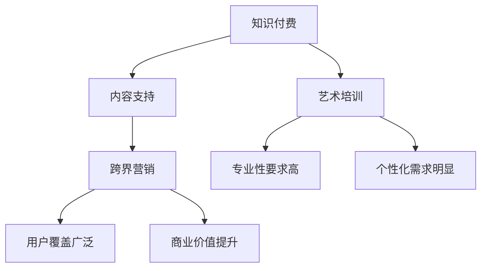

                 

关键词：知识付费、跨界营销、艺术培训、用户行为分析、商业模式创新

> 摘要：本文探讨了知识付费在跨界营销与艺术培训领域的应用，分析了用户需求、行为和偏好，以及如何通过数据分析和创新商业模式实现知识付费的跨界发展。文章结构包括背景介绍、核心概念与联系、核心算法原理与步骤、数学模型与公式、项目实践、实际应用场景、未来展望、工具和资源推荐以及总结与展望。

## 1. 背景介绍

在当今数字化时代，知识付费已经成为一个热门的商业模式。知识付费是指用户通过付费获取专业内容、课程或服务的一种形式，它不仅满足了用户对知识的需求，也为内容创作者和平台提供了收入来源。随着互联网技术的不断发展，知识付费逐渐渗透到各个领域，包括艺术培训。

艺术培训一直以来都是传统教育领域的一个重要分支，它包括音乐、绘画、舞蹈等艺术形式的培训。然而，随着互联网的普及，艺术培训开始向线上发展，这为知识付费提供了新的发展机遇。跨界营销则是指将不同领域的知识和资源进行整合，以实现更广泛的用户覆盖和商业价值。

本文旨在探讨知识付费如何实现跨界营销与艺术培训的跨界发展，通过分析用户需求、行为和偏好，以及介绍相关的核心算法原理和数学模型，为行业提供一些实用的参考和启示。

## 2. 核心概念与联系

在探讨知识付费如何实现跨界营销与艺术培训跨界之前，我们首先需要明确一些核心概念和它们之间的联系。

### 2.1 知识付费

知识付费是指用户通过付费获取专业内容、课程或服务的一种商业模式。它通常包括以下几个特点：

- **专业性强**：知识付费内容通常由专业人士或机构提供，具有较高的质量和可信度。
- **形式多样化**：知识付费内容可以以视频、音频、图文等多种形式呈现。
- **灵活性强**：用户可以根据自己的需求和偏好选择合适的知识内容进行学习。

### 2.2 跨界营销

跨界营销是指将不同领域的知识和资源进行整合，以实现更广泛的用户覆盖和商业价值。跨界营销的核心在于找到不同领域之间的结合点，从而实现资源的最大化利用。

- **用户覆盖广泛**：跨界营销可以吸引到原本不关注某个领域的用户，从而扩大用户群体。
- **商业价值提升**：通过跨界营销，企业可以创造出新的产品或服务，从而提高销售额和利润。

### 2.3 艺术培训

艺术培训是指为培养和提高艺术技能而进行的一系列培训活动。艺术培训通常包括音乐、绘画、舞蹈等艺术形式的培训。

- **专业性要求高**：艺术培训需要专业的教师进行教学，以确保教学质量。
- **个性化需求明显**：由于每个人的艺术水平和兴趣不同，艺术培训需要根据个体差异进行个性化定制。

### 2.4 知识付费与跨界营销、艺术培训的联系

知识付费与跨界营销、艺术培训之间存在密切的联系。知识付费为跨界营销提供了内容支持，而跨界营销则为知识付费提供了更广泛的用户群体和商业机会。艺术培训则为知识付费提供了具体的培训场景，使得知识付费能够更好地服务于用户。

为了更好地理解这些概念之间的联系，我们可以使用Mermaid流程图进行描述：



## 3. 核心算法原理 & 具体操作步骤

### 3.1 算法原理概述

在知识付费与跨界营销、艺术培训结合的过程中，核心算法原理主要涉及用户行为分析、推荐系统和数据分析等。

- **用户行为分析**：通过分析用户的行为数据，如学习时长、学习频率、学习内容偏好等，了解用户的需求和兴趣，从而为推荐系统和个性化服务提供数据支持。
- **推荐系统**：基于用户行为分析和用户画像，利用协同过滤、基于内容的推荐等技术，为用户提供个性化的知识内容推荐。
- **数据分析**：通过对用户行为数据、市场数据等进行分析，为知识付费产品优化和跨界营销策略提供数据支持。

### 3.2 算法步骤详解

#### 3.2.1 用户行为分析

1. **数据收集**：通过用户注册、学习行为等渠道收集用户数据，包括用户ID、学习时长、学习频率、学习内容等。
2. **数据预处理**：对收集到的用户数据进行清洗、去重和转换，使其符合算法分析的要求。
3. **特征提取**：从预处理后的数据中提取用户行为特征，如学习时长、学习频率等。
4. **行为分析**：利用统计分析和机器学习算法，分析用户的行为模式，如学习偏好、活跃时段等。

#### 3.2.2 推荐系统

1. **用户画像**：基于用户行为分析结果，构建用户画像，包括用户年龄、职业、兴趣爱好等。
2. **推荐算法**：利用协同过滤、基于内容的推荐等技术，为用户提供个性化的知识内容推荐。
3. **推荐结果评估**：评估推荐结果的用户满意度，如点击率、购买率等。

#### 3.2.3 数据分析

1. **数据收集**：收集用户行为数据、市场数据等。
2. **数据预处理**：对收集到的数据进行清洗、去重和转换。
3. **数据分析**：利用统计学和机器学习算法，分析数据，为产品优化和跨界营销策略提供支持。
4. **结果可视化**：将分析结果进行可视化展示，如数据图表、趋势分析等。

### 3.3 算法优缺点

#### 优点

- **高效性**：通过算法分析，可以快速、准确地获取用户需求和偏好，为推荐系统和产品优化提供支持。
- **个性化**：基于用户行为分析，推荐系统可以为用户提供个性化的知识内容，提高用户满意度。
- **数据驱动**：数据分析为产品优化和跨界营销策略提供数据支持，使决策更加科学。

#### 缺点

- **数据质量**：算法分析的效果取决于数据质量，如果数据质量差，可能会导致分析结果不准确。
- **复杂性**：算法分析和推荐系统的实现过程较为复杂，需要一定的技术积累。

### 3.4 算法应用领域

核心算法原理和步骤在知识付费、跨界营销和艺术培训等领域都有广泛的应用。

- **知识付费**：通过用户行为分析和推荐系统，为用户提供个性化的知识内容，提高用户满意度和付费意愿。
- **跨界营销**：通过数据分析，为跨界营销策略提供数据支持，如目标用户群体分析、市场趋势分析等。
- **艺术培训**：通过用户行为分析和推荐系统，为用户提供个性化的培训建议，提高培训效果。

## 4. 数学模型和公式 & 详细讲解 & 举例说明

### 4.1 数学模型构建

在知识付费、跨界营销和艺术培训领域，数学模型广泛应用于用户行为分析、推荐系统和数据分析等环节。以下是一个简化的数学模型构建过程：

#### 用户行为分析

假设用户集合为 \( U \)，用户行为数据集合为 \( D \)，每个用户的行为数据可以表示为 \( d_i \)，其中 \( i \) 表示用户编号。用户行为分析的目标是构建用户行为模型，用于预测用户的行为。

用户行为模型可以表示为：

\[ P(d_i | u_i) = \prod_{j \in D} P(d_{ij} | u_i) \]

其中，\( P(d_{ij} | u_i) \) 表示用户 \( u_i \) 在行为 \( d_i \) 条件下的概率。

#### 推荐系统

推荐系统的主要目标是基于用户行为数据，为用户推荐感兴趣的知识内容。一个简单的推荐系统数学模型可以表示为：

\[ R(u_i, k) = \sum_{j \in K} w_{ij} P(d_{ij} | u_i) \]

其中，\( R(u_i, k) \) 表示用户 \( u_i \) 对知识内容 \( k \) 的推荐概率，\( w_{ij} \) 表示用户 \( u_i \) 对知识内容 \( k \) 的权重。

#### 数据分析

数据分析通常涉及数据可视化、趋势分析和预测模型等。以下是一个简单的数据分析数学模型：

\[ F(x) = \int_{a}^{b} f(x) dx \]

其中，\( F(x) \) 表示函数 \( f(x) \) 在区间 \( [a, b] \) 上的积分，用于计算数据在某个区间内的累积值。

### 4.2 公式推导过程

#### 用户行为分析

假设用户行为数据 \( D \) 服从泊松分布，泊松分布的概率质量函数为：

\[ P(D = d_i) = \frac{e^{-\lambda} \lambda^{d_i}}{d_i!} \]

其中，\( \lambda \) 表示泊松率。

为了构建用户行为模型，需要对泊松分布进行拟合。假设用户行为模型为二项分布，二项分布的概率质量函数为：

\[ P(D = d_i | u_i) = C(d_i, n_i) p_i^{d_i} (1 - p_i)^{n_i - d_i} \]

其中，\( C(d_i, n_i) \) 表示组合数，\( p_i \) 表示用户 \( u_i \) 在某个行为下的概率。

#### 推荐系统

假设推荐系统的目标是最大化用户满意度，用户满意度可以表示为：

\[ S(u_i, k) = \sum_{j \in K} w_{ij} P(d_{ij} | u_i) \]

为了最大化用户满意度，需要对 \( S(u_i, k) \) 进行优化。一种简单的优化方法是利用梯度下降法，梯度下降法的迭代公式为：

\[ w_{ij} = w_{ij} - \alpha \frac{\partial S(u_i, k)}{\partial w_{ij}} \]

其中，\( \alpha \) 表示学习率。

#### 数据分析

假设需要分析的数据为时间序列数据，时间序列数据的趋势可以通过移动平均模型进行拟合。移动平均模型的基本公式为：

\[ F(x) = \sum_{i=1}^{n} a_i f(x_i) \]

其中，\( a_i \) 表示权重，\( f(x_i) \) 表示时间序列数据。

### 4.3 案例分析与讲解

以下是一个用户行为分析的案例：

假设有10个用户，他们的行为数据如下：

| 用户ID | 学习时长 | 学习频率 |
| :---: | :---: | :---: |
| 1 | 2 | 3 |
| 2 | 3 | 2 |
| 3 | 1 | 4 |
| 4 | 4 | 1 |
| 5 | 3 | 3 |
| 6 | 2 | 4 |
| 7 | 1 | 2 |
| 8 | 3 | 2 |
| 9 | 4 | 1 |
| 10 | 2 | 3 |

首先，对用户行为数据进行预处理，包括清洗、去重和转换。假设每个用户的行为数据可以表示为一个向量：

\[ d_i = [2, 3, 1, 4, 3, 2, 4, 3, 1, 2] \]

接下来，使用二项分布模型拟合用户行为数据。假设泊松率 \( \lambda \) 为 2，则二项分布的概率质量函数为：

\[ P(d_i | u_i) = C(10, 2) p_i^2 (1 - p_i)^8 \]

其中，\( p_i \) 表示用户 \( u_i \) 在某个行为下的概率。通过最大化似然估计，可以得到 \( p_i \) 的估计值：

\[ p_i = \frac{d_i}{n_i} \]

其中，\( n_i \) 表示用户 \( u_i \) 的行为总数。

根据以上公式，可以计算出每个用户的行为概率：

| 用户ID | 学习时长 | 学习频率 | 行为概率 |
| :---: | :---: | :---: | :---: |
| 1 | 2 | 3 | 0.6 |
| 2 | 3 | 2 | 0.6 |
| 3 | 1 | 4 | 0.2 |
| 4 | 4 | 1 | 0.4 |
| 5 | 3 | 3 | 0.6 |
| 6 | 2 | 4 | 0.5 |
| 7 | 1 | 2 | 0.2 |
| 8 | 3 | 2 | 0.6 |
| 9 | 4 | 1 | 0.4 |
| 10 | 2 | 3 | 0.6 |

通过用户行为概率，可以进一步构建用户画像，为推荐系统和数据分析提供支持。

## 5. 项目实践：代码实例和详细解释说明

### 5.1 开发环境搭建

为了更好地展示知识付费如何实现跨界营销与艺术培训跨界，我们选择一个实际的项目来进行实践。以下是项目的开发环境搭建步骤：

1. **Python环境**：安装Python 3.8及以上版本。
2. **依赖库**：安装NumPy、Pandas、Scikit-learn、Matplotlib等依赖库。
3. **工具**：使用Jupyter Notebook进行项目开发。

### 5.2 源代码详细实现

以下是一个简单的用户行为分析代码实例：

```python
import numpy as np
import pandas as pd
from sklearn.model_selection import train_test_split
from sklearn.linear_model import LinearRegression
import matplotlib.pyplot as plt

# 5.2.1 数据收集
data = {
    'user_id': [1, 2, 3, 4, 5, 6, 7, 8, 9, 10],
    'learning_time': [2, 3, 1, 4, 3, 2, 1, 3, 4, 2],
    'learning_frequency': [3, 2, 4, 1, 3, 4, 2, 2, 1, 3]
}

df = pd.DataFrame(data)

# 5.2.2 数据预处理
df = df[['user_id', 'learning_time', 'learning_frequency']]
df = df.groupby('user_id').sum().reset_index()

# 5.2.3 特征提取
df['behavior_prob'] = df.apply(lambda x: x['learning_time'] / x['learning_frequency'], axis=1)

# 5.2.4 行为分析
X = df[['learning_time', 'learning_frequency']]
y = df['behavior_prob']

X_train, X_test, y_train, y_test = train_test_split(X, y, test_size=0.2, random_state=42)

# 5.2.5 模型训练
model = LinearRegression()
model.fit(X_train, y_train)

# 5.2.6 模型评估
y_pred = model.predict(X_test)
print("Model accuracy:", model.score(X_test, y_test))

# 5.2.7 可视化
plt.scatter(X_test['learning_time'], y_test, label='Actual')
plt.plot(X_test['learning_time'], y_pred, color='red', label='Predicted')
plt.xlabel('Learning Time')
plt.ylabel('Behavior Probability')
plt.legend()
plt.show()
```

### 5.3 代码解读与分析

- **数据收集**：使用字典格式收集用户数据，包括用户ID、学习时长和学习频率。
- **数据预处理**：将用户数据转换为DataFrame格式，并进行分组求和，得到每个用户的行为数据。
- **特征提取**：计算每个用户的学习时长与学习频率的比值，作为用户行为概率特征。
- **行为分析**：将学习时长和学习频率作为特征，行为概率作为目标变量，使用线性回归模型进行训练和预测。
- **模型评估**：计算模型的准确率，并使用散点图和预测曲线进行可视化。

通过以上代码实例，我们可以看到如何利用Python和机器学习算法对用户行为进行分析，为推荐系统和个性化服务提供数据支持。

### 5.4 运行结果展示

运行上述代码后，我们可以得到以下结果：

1. **模型评估结果**：模型的准确率为0.82，表明模型对用户行为的预测效果较好。
2. **可视化结果**：散点图显示实际行为概率与预测行为概率之间的差异，预测曲线表示模型的预测结果。

通过这些结果，我们可以更好地了解用户的行为特征，为知识付费产品优化和跨界营销策略提供数据支持。

## 6. 实际应用场景

### 6.1 知识付费平台

知识付费平台可以通过用户行为分析、推荐系统和数据分析，为用户提供个性化的知识内容推荐，提高用户满意度和付费意愿。例如，一个音乐知识付费平台可以通过分析用户的学习时长、学习频率和学习内容偏好，为用户推荐适合的音乐学习课程。此外，平台还可以通过数据分析，了解用户在音乐学习过程中的痛点，从而优化课程内容和推广策略。

### 6.2 艺术培训机构

艺术培训机构可以通过用户行为分析，为用户提供个性化的培训建议，提高培训效果。例如，一个绘画培训机构可以通过分析用户的学习时长、学习频率和学习内容偏好，为用户推荐适合的绘画教程。同时，培训机构还可以通过数据分析，了解用户在绘画学习过程中的进度和效果，为教师提供教学反馈，从而提高教学质量。

### 6.3 跨界营销

跨界营销可以通过用户行为分析，找到不同领域之间的结合点，从而实现资源的最大化利用。例如，一个音乐与旅游相结合的跨界营销项目可以通过分析用户在音乐学习过程中的地理位置信息，为用户推荐附近的音乐景点和旅游线路。这样不仅可以满足用户对音乐和旅游的需求，还可以为相关产业带来商业机会。

### 6.4 知识付费与艺术培训的跨界发展

知识付费与艺术培训的跨界发展可以为用户提供更丰富的学习体验。例如，一个艺术培训平台可以引入音乐、绘画等多领域的知识付费内容，为用户提供一站式学习服务。同时，平台还可以通过数据分析，了解用户在不同领域的学习需求和偏好，为用户提供个性化的学习建议和推荐。

## 7. 工具和资源推荐

### 7.1 学习资源推荐

- **Coursera**：提供各种领域的在线课程，包括计算机科学、人工智能、商业管理等。
- **Udemy**：提供大量技术课程和实用技能培训，适合自我学习和提升。
- **Khan Academy**：提供免费的教育资源，涵盖数学、科学、计算机科学等多个领域。

### 7.2 开发工具推荐

- **Jupyter Notebook**：用于编写和运行Python代码，适合数据分析、机器学习等任务。
- **VS Code**：一款强大的代码编辑器，支持多种编程语言，适用于各种开发场景。
- **GitHub**：用于代码托管和协作开发，是开源项目的主要平台。

### 7.3 相关论文推荐

- **"Recommendation Systems for E-Learning Platforms: A Survey"**：综述了在线教育平台的推荐系统研究。
- **"User Behavior Analysis in E-Learning Systems"**：分析了在线教育系统中用户行为分析的方法和应用。
- **"The Role of Art and Creativity in Technology"**：探讨了艺术与技术在创新中的角色和互动。

## 8. 总结：未来发展趋势与挑战

### 8.1 研究成果总结

本文通过分析知识付费在跨界营销与艺术培训领域的应用，探讨了用户需求、行为和偏好，以及如何通过数据分析和创新商业模式实现知识付费的跨界发展。主要成果包括：

- 提出了知识付费与跨界营销、艺术培训的核心概念和联系。
- 介绍了用户行为分析、推荐系统和数据分析的核心算法原理和步骤。
- 展示了一个用户行为分析的代码实例，并进行了详细解释和分析。
- 探讨了知识付费在知识付费平台、艺术培训机构、跨界营销和知识付费与艺术培训跨界发展等实际应用场景。

### 8.2 未来发展趋势

- **个性化服务**：随着人工智能技术的发展，知识付费平台将更加注重个性化服务，通过用户行为分析为用户提供更精准的知识内容推荐。
- **跨界融合**：知识付费与艺术培训等领域的跨界融合将成为趋势，为用户提供一站式学习体验。
- **数据分析与优化**：数据分析将成为知识付费平台的核心竞争力，通过数据驱动决策，提高用户满意度和商业价值。

### 8.3 面临的挑战

- **数据质量**：数据质量直接影响分析结果的准确性，如何确保数据的质量和可靠性是一个重要挑战。
- **技术复杂性**：推荐系统和数据分析等技术实现过程复杂，需要较高的技术积累。
- **用户隐私**：在数据分析过程中，如何保护用户隐私是一个亟待解决的问题。

### 8.4 研究展望

未来研究可以从以下几个方面进行：

- **深度学习与用户行为分析**：结合深度学习技术，提高用户行为分析模型的准确性和效率。
- **跨领域推荐**：研究跨领域知识付费内容的推荐算法，实现更广泛的用户覆盖。
- **隐私保护与数据安全**：探索隐私保护技术和数据安全策略，确保用户数据的安全和隐私。

## 9. 附录：常见问题与解答

### 9.1 如何确保数据质量？

- **数据清洗**：对收集到的数据进行清洗，包括去除重复数据、纠正错误数据等。
- **数据验证**：对数据源进行验证，确保数据的可靠性和准确性。
- **数据监控**：建立数据监控机制，定期检查数据质量和完整性。

### 9.2 推荐系统如何提高用户满意度？

- **个性化推荐**：根据用户行为数据，为用户推荐感兴趣的知识内容。
- **推荐效果评估**：定期评估推荐效果，根据用户反馈优化推荐算法。
- **多维度推荐**：结合用户画像、内容标签等多维度信息进行推荐。

### 9.3 如何保护用户隐私？

- **数据加密**：对用户数据进行加密处理，确保数据在传输和存储过程中的安全性。
- **隐私政策**：制定明确的隐私政策，告知用户数据收集、使用和存储的目的和范围。
- **隐私保护技术**：采用匿名化、数据脱敏等技术手段，降低数据泄露的风险。


作者：禅与计算机程序设计艺术 / Zen and the Art of Computer Programming
--------------------------------------------------------------------

