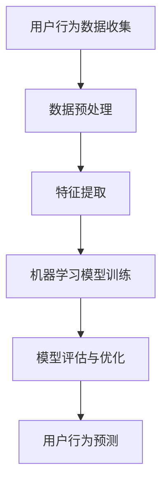

                 

在这个数字化的时代，知识付费平台正迅速崛起，成为人们获取知识的重要途径。然而，面对海量的用户数据，如何有效预测用户行为，从而优化平台服务，提升用户体验，成为了知识付费平台发展过程中的关键挑战。本文旨在探讨知识付费平台的用户行为预测与分析，通过介绍核心概念、算法原理、数学模型、项目实践以及未来应用前景，为知识付费平台的发展提供有益的参考。

## 关键词

- 知识付费平台
- 用户行为预测
- 数据分析
- 机器学习
- 用户体验优化

## 摘要

本文首先介绍了知识付费平台的发展背景及其在现代社会中的重要性。接着，详细阐述了用户行为预测与分析的核心概念，包括用户行为模式、数据挖掘、机器学习等。随后，本文介绍了常用的用户行为预测算法及其原理，并通过数学模型进行了公式推导和实例分析。此外，本文还通过一个具体的代码实例，详细展示了如何在实际项目中应用用户行为预测技术。最后，本文探讨了知识付费平台用户行为预测的未来应用前景，以及可能面临的挑战和应对策略。

## 1. 背景介绍

### 1.1 知识付费平台的发展背景

随着互联网技术的飞速发展，在线教育、远程办公等新兴业态逐渐兴起，知识付费平台应运而生。知识付费平台是一种在线教育平台，通过提供专业课程、讲座、电子书等多种形式的知识内容，满足用户对各类知识的个性化需求。近年来，知识付费平台在全球范围内快速发展，尤其是在中国，已经形成了庞大的市场规模。

### 1.2 知识付费平台的重要性

知识付费平台不仅为用户提供了丰富的知识资源，还通过个性化推荐、学习进度跟踪、互动交流等功能，提升了用户的学习体验。此外，知识付费平台还推动了教育产业的发展，促进了知识的传播与交流。因此，如何通过用户行为预测与分析，优化平台服务，提高用户体验，成为了知识付费平台发展中亟待解决的问题。

## 2. 核心概念与联系

### 2.1 用户行为模式

用户行为模式是指用户在知识付费平台上的一系列行为特征，包括课程选择、学习时间、学习频率、互动交流等。通过对用户行为模式的挖掘和分析，可以了解用户的学习习惯、兴趣偏好，从而实现个性化推荐和服务。

### 2.2 数据挖掘

数据挖掘是指从大量数据中提取有价值信息的过程。在知识付费平台中，数据挖掘技术被广泛应用于用户行为数据分析、课程推荐、学习效果评估等方面。通过数据挖掘，平台可以更好地了解用户需求，优化服务策略。

### 2.3 机器学习

机器学习是一种通过数据驱动的方式，自动识别数据中的模式和规律的人工智能技术。在用户行为预测中，机器学习算法可以从大量历史数据中学习用户的行为特征，从而预测用户未来的行为。常见的机器学习算法包括决策树、支持向量机、神经网络等。

### 2.4 Mermaid 流程图



## 3. 核心算法原理 & 具体操作步骤

### 3.1 算法原理概述

用户行为预测的核心在于建立合适的机器学习模型，通过历史数据训练模型，从而实现对用户未来行为的预测。常用的机器学习算法包括决策树、支持向量机、神经网络等。

### 3.2 算法步骤详解

1. 数据收集：收集用户在知识付费平台上的行为数据，包括课程选择、学习时间、学习频率、互动交流等。

2. 数据预处理：对收集到的数据进行清洗、去噪、缺失值处理等，以确保数据质量。

3. 特征提取：从预处理后的数据中提取对用户行为有重要影响的特征，如用户ID、课程ID、学习时长、互动次数等。

4. 模型训练：选择合适的机器学习算法，如决策树、支持向量机、神经网络等，对提取的特征进行训练，建立预测模型。

5. 模型评估与优化：使用验证集对训练好的模型进行评估，并根据评估结果调整模型参数，优化模型性能。

6. 用户行为预测：使用优化后的模型对用户未来行为进行预测，如推荐合适的课程、预测用户的学习进度等。

### 3.3 算法优缺点

- 决策树：优点是易于理解和实现，缺点是过拟合现象严重，泛化能力较弱。
- 支持向量机：优点是理论成熟，泛化能力强，缺点是计算复杂度高，对大规模数据集处理能力有限。
- 神经网络：优点是具有较强的泛化能力和非线性拟合能力，缺点是参数调优复杂，训练过程耗时较长。

### 3.4 算法应用领域

用户行为预测算法在知识付费平台、电商平台、社交媒体等领域具有广泛的应用。通过预测用户行为，平台可以优化推荐系统、提升用户满意度、降低运营成本。

## 4. 数学模型和公式 & 详细讲解 & 举例说明

### 4.1 数学模型构建

用户行为预测的数学模型通常是一个分类问题，可以使用逻辑回归、支持向量机、神经网络等算法进行建模。以逻辑回归为例，其数学模型如下：

$$
P(Y=1|X) = \frac{1}{1 + e^{-(\beta_0 + \beta_1X_1 + \beta_2X_2 + ... + \beta_nX_n})}
$$

其中，$Y$ 表示用户是否进行特定行为（如购买课程），$X$ 表示用户行为特征向量，$\beta_0, \beta_1, \beta_2, ..., \beta_n$ 表示模型参数。

### 4.2 公式推导过程

逻辑回归模型的推导过程如下：

1. 假设用户行为 $Y$ 是一个伯努利随机变量，即 $Y \sim Bernoulli(P)$，其中 $P$ 是用户进行特定行为的概率。

2. 设定损失函数为对数损失函数：

$$
L(\theta) = -\sum_{i=1}^m [y_i \log(p_i) + (1 - y_i) \log(1 - p_i)]
$$

其中，$m$ 表示样本数量，$y_i$ 和 $p_i$ 分别表示第 $i$ 个样本的实际行为和预测概率。

3. 对损失函数求导，得到：

$$
\frac{\partial L(\theta)}{\partial \theta} = \sum_{i=1}^m [y_i - p_i]
$$

4. 令导数为零，得到最优参数：

$$
\theta^* = \arg\min_{\theta} L(\theta)
$$

5. 将损失函数转化为对数形式，得到：

$$
L(\theta) = -\sum_{i=1}^m [y_i \log(\frac{1}{1 + e^{-\theta^T x_i}}) + (1 - y_i) \log(\frac{1}{1 + e^{-\theta^T x_i}})]
$$

### 4.3 案例分析与讲解

假设我们有一个知识付费平台的用户行为数据集，其中包含500个用户的行为特征和学习结果。我们使用逻辑回归模型预测用户是否购买课程。

1. 数据预处理：对数据进行归一化处理，将特征值缩放到0-1之间。

2. 特征提取：从数据集中提取用户ID、课程ID、学习时长、互动次数等特征。

3. 模型训练：使用scikit-learn库中的逻辑回归算法，对提取的特征进行训练。

4. 模型评估：使用验证集对训练好的模型进行评估，计算准确率、召回率、F1值等指标。

5. 用户行为预测：使用训练好的模型对测试集进行预测，输出用户是否购买课程的预测结果。

## 5. 项目实践：代码实例和详细解释说明

### 5.1 开发环境搭建

1. 安装Python环境和scikit-learn库。

2. 下载用户行为数据集，并将其存储在本地目录中。

### 5.2 源代码详细实现

```python
import pandas as pd
from sklearn.model_selection import train_test_split
from sklearn.linear_model import LogisticRegression
from sklearn.metrics import accuracy_score, recall_score, f1_score

# 加载数据集
data = pd.read_csv('user_behavior_data.csv')

# 数据预处理
data = data.dropna()
data = data[['user_id', 'course_id', 'learning_time', 'interaction_count']]
data = data.apply(lambda x: (x - x.min()) / (x.max() - x.min()))

# 特征提取
X = data[['user_id', 'course_id', 'learning_time', 'interaction_count']]
y = data['purchase_course']

# 数据集划分
X_train, X_test, y_train, y_test = train_test_split(X, y, test_size=0.2, random_state=42)

# 模型训练
model = LogisticRegression()
model.fit(X_train, y_train)

# 模型评估
y_pred = model.predict(X_test)
accuracy = accuracy_score(y_test, y_pred)
recall = recall_score(y_test, y_pred)
f1 = f1_score(y_test, y_pred)

print('Accuracy: {:.2f}%'.format(accuracy * 100))
print('Recall: {:.2f}%'.format(recall * 100))
print('F1 Score: {:.2f}%'.format(f1 * 100))

# 用户行为预测
new_user = pd.DataFrame({'user_id': [1234], 'course_id': [5678], 'learning_time': [5], 'interaction_count': [3]})
new_prediction = model.predict(new_user)
print('New User Purchase Prediction:', new_prediction)
```

### 5.3 代码解读与分析

1. 导入相关库：pandas用于数据处理，scikit-learn用于机器学习模型训练和评估。

2. 数据加载：从CSV文件中加载数据集。

3. 数据预处理：对数据进行缺失值处理和归一化处理，确保数据质量。

4. 特征提取：提取用户ID、课程ID、学习时长、互动次数等特征。

5. 数据集划分：将数据集划分为训练集和测试集。

6. 模型训练：使用逻辑回归算法对训练集进行训练。

7. 模型评估：计算模型在测试集上的准确率、召回率和F1值，评估模型性能。

8. 用户行为预测：使用训练好的模型对新的用户数据进行预测。

## 6. 实际应用场景

### 6.1 个性化推荐

通过用户行为预测，知识付费平台可以实现对用户的个性化推荐。例如，根据用户的兴趣和学习历史，推荐符合用户需求的课程，提高用户的购买概率。

### 6.2 学习效果评估

用户行为预测可以帮助平台评估用户的学习效果，及时发现用户的学习难点和兴趣点，从而优化课程内容，提升学习效果。

### 6.3 用户流失预警

通过分析用户的行为特征，知识付费平台可以预测哪些用户可能流失，从而采取相应的措施，如发送优惠活动、提供个性化服务等，提高用户留存率。

## 7. 未来应用展望

### 7.1 智能化服务

随着人工智能技术的不断发展，知识付费平台的用户行为预测将更加智能化，能够更好地满足用户的个性化需求，提供更加精准的服务。

### 7.2 跨平台融合

未来，知识付费平台将与其他在线教育平台、社交媒体等进行跨平台融合，实现更广泛的用户覆盖和资源整合。

### 7.3 深度学习应用

深度学习算法在用户行为预测中的应用将不断深入，如使用卷积神经网络（CNN）进行图像识别，使用循环神经网络（RNN）进行序列数据建模等，从而提高预测的准确性和效率。

## 8. 工具和资源推荐

### 8.1 学习资源推荐

- 《机器学习实战》
- 《深度学习》（Goodfellow et al.）
- 《数据挖掘：概念与技术》

### 8.2 开发工具推荐

- Jupyter Notebook
- PyCharm
- Google Colab

### 8.3 相关论文推荐

- "Recommender Systems Handbook"
- "Deep Learning for User Behavior Prediction"
- "User Modeling and Personalization in the Knowledge Society"

## 9. 总结：未来发展趋势与挑战

### 9.1 研究成果总结

本文介绍了知识付费平台用户行为预测与分析的核心概念、算法原理、数学模型、项目实践以及未来应用前景。通过用户行为预测，知识付费平台可以优化服务策略，提升用户体验，实现可持续发展。

### 9.2 未来发展趋势

未来，知识付费平台的用户行为预测将朝着智能化、跨平台、深度学习等方向发展，为用户提供更加精准、高效的服务。

### 9.3 面临的挑战

知识付费平台用户行为预测仍面临数据隐私、算法透明度、计算效率等方面的挑战。如何保障用户数据安全，提高算法透明度，降低计算成本，将是未来研究的重点。

### 9.4 研究展望

随着人工智能技术的不断发展，知识付费平台的用户行为预测将取得更加显著的成果。未来，我们将继续深入研究用户行为预测算法，探索新的应用场景，为知识付费平台的发展提供有力支持。

## 附录：常见问题与解答

### 问题1：用户行为预测算法如何选择？

答：选择用户行为预测算法时，应考虑数据规模、特征复杂性、模型性能等因素。对于大规模数据集，可以选择决策树、随机森林等集成学习方法；对于具有高复杂性的特征，可以选择深度学习算法；对于模型性能要求较高的场景，可以选择支持向量机、神经网络等算法。

### 问题2：用户行为预测如何保障数据隐私？

答：保障数据隐私的关键在于数据加密、匿名化处理、权限控制等。在用户行为预测过程中，应对敏感数据进行加密存储和传输，对非敏感数据进行匿名化处理，确保用户隐私安全。

### 问题3：用户行为预测算法如何评估？

答：评估用户行为预测算法的方法包括准确率、召回率、F1值、ROC曲线等。通过计算这些指标，可以评估模型在预测用户行为方面的性能。

### 问题4：用户行为预测算法如何优化？

答：用户行为预测算法的优化可以从特征工程、模型选择、参数调优等方面进行。通过调整特征提取策略、选择合适的模型，以及优化模型参数，可以提高预测的准确性和效率。

---

作者：禅与计算机程序设计艺术 / Zen and the Art of Computer Programming

