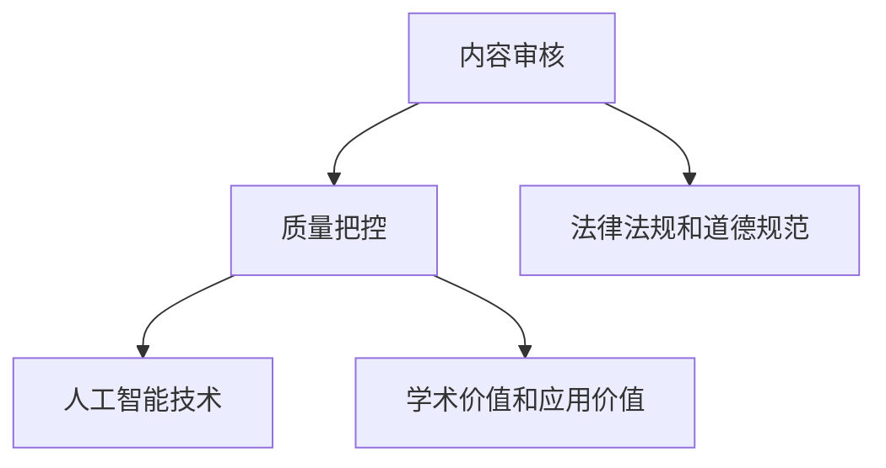

                 

关键词：知识付费平台、内容审核、质量把控、人工智能、技术分析

> 摘要：本文从技术角度深入探讨知识付费平台的内容审核和质量把控问题。文章首先介绍了知识付费平台的发展背景和现状，然后分析了内容审核和质量把控的关键性。接着，文章提出了基于人工智能技术的解决方案，并详细阐述了算法原理、数学模型和应用实例。最后，文章对未来发展趋势与挑战进行了展望。

## 1. 背景介绍

随着互联网技术的快速发展，知识付费平台如雨后春笋般涌现。这些平台以用户为中心，提供各类专业知识和技能的在线学习资源，满足了广大用户的学习需求。然而，随着知识付费平台的迅猛发展，内容质量参差不齐的问题也日益凸显。如何加强内容审核和质量把控，成为知识付费平台面临的一项重要挑战。

### 1.1 知识付费平台的发展背景

知识付费平台的发展可以追溯到20世纪末的互联网时代。当时，互联网的普及使得人们可以方便地获取各种信息，但同时也面临着信息过载的问题。为了解决这一问题，一些有远见的企业开始探索将优质内容进行专业化、系统化的整理，并提供给有需求的用户。这一探索为知识付费平台的诞生奠定了基础。

随着移动互联网的兴起，知识付费平台得到了迅速发展。用户可以随时随地通过手机等移动设备访问平台，学习各种知识和技能。同时，知识付费平台也成为了知识传播的重要渠道，为用户提供了丰富的学习资源。

### 1.2 知识付费平台的现状

当前，知识付费平台呈现出以下特点：

1. 内容丰富：知识付费平台涵盖了各个领域，包括但不限于教育、职业发展、兴趣爱好等，用户可以根据自己的需求选择合适的学习资源。
2. 用户基数庞大：随着用户对自我提升的需求不断增加，知识付费平台的用户数量持续增长，成为了一片广阔的市场。
3. 竞争激烈：众多知识付费平台在争夺用户资源，导致内容同质化现象严重，内容质量参差不齐。

### 1.3 内容审核和质量把控的重要性

内容审核和质量把控在知识付费平台的发展中具有重要意义。首先，内容审核可以确保平台上的内容符合法律法规和道德规范，避免传播不良信息。其次，质量把控可以提升内容的质量，满足用户的需求，提升用户满意度。最后，良好的内容审核和质量把控有助于树立平台的品牌形象，提高市场竞争力。

## 2. 核心概念与联系

为了实现内容审核和质量把控，我们需要引入以下几个核心概念：

1. **内容审核**：对知识付费平台上的内容进行审核，确保其符合法律法规和道德规范。
2. **质量把控**：对知识付费平台上的内容进行质量评估，确保其具有较高的学术价值和应用价值。
3. **人工智能技术**：利用人工智能技术，提高内容审核和质量把控的效率和准确性。

下面是一个简化的 Mermaid 流程图，展示了这些概念之间的联系：



### 2.1 内容审核

内容审核是知识付费平台的首要任务。它包括以下几个方面：

1. **合法性审核**：确保内容不含有违法信息，如侵犯他人知识产权、诽谤、传播淫秽色情等。
2. **真实性审核**：对内容进行事实核对，确保其真实性，避免误导用户。
3. **道德性审核**：对内容进行道德审查，确保其不含有不道德、暴力、仇恨等负面信息。

### 2.2 质量把控

质量把控是确保知识付费平台内容质量的重要环节。它包括以下几个方面：

1. **学术性评估**：对内容进行学术性评估，确保其具有较高质量的学术价值。
2. **实用性评估**：对内容进行实用性评估，确保其能够满足用户的需求。
3. **更新性评估**：对内容进行更新性评估，确保其内容不过时。

### 2.3 人工智能技术

人工智能技术在内容审核和质量把控中发挥着重要作用。它可以帮助平台实现自动化、高效的审核和评估工作，提高审核和评估的准确性和效率。

### 2.4 法律法规和道德规范

法律法规和道德规范是内容审核和质量把控的重要依据。平台需要严格遵守相关法律法规，遵循社会公德，确保内容审核和质量把控的合法性和道德性。

### 2.5 学术价值和应用价值

学术价值和应用价值是衡量知识付费平台内容质量的重要指标。平台需要确保内容既具有较高质量的学术价值，又能够满足用户的实际需求。

## 3. 核心算法原理 & 具体操作步骤

### 3.1 算法原理概述

在内容审核和质量把控中，我们可以采用多种人工智能技术，如自然语言处理（NLP）、机器学习（ML）和深度学习（DL）等。以下是一个基于NLP和ML的简化算法原理概述：

1. **数据预处理**：对输入的内容进行预处理，包括文本清洗、分词、词性标注等。
2. **特征提取**：从预处理后的文本中提取特征，如词频、词向量等。
3. **模型训练**：使用已标注的数据集对模型进行训练，使其具备内容审核和质量把控的能力。
4. **模型评估**：使用测试数据集对模型进行评估，调整模型参数，提高模型性能。
5. **内容审核和质量把控**：使用训练好的模型对新的内容进行审核和评估，输出审核结果和质量评分。

### 3.2 算法步骤详解

#### 3.2.1 数据预处理

数据预处理是算法训练的第一步。它包括以下几个步骤：

1. **文本清洗**：去除文本中的噪声，如HTML标签、特殊字符等。
2. **分词**：将文本分割成一个个单词或短语。
3. **词性标注**：为每个单词或短语标注其词性，如名词、动词等。

#### 3.2.2 特征提取

特征提取是将文本转化为机器可以理解的形式。常用的特征提取方法包括：

1. **词频（TF）**：计算每个单词在文本中出现的频率。
2. **词向量（Word2Vec、BERT等）**：将每个单词映射为一个固定维度的向量。

#### 3.2.3 模型训练

模型训练是算法的核心步骤。我们可以采用以下方法进行模型训练：

1. **监督学习**：使用已标注的数据集对模型进行训练，使其学会识别内容是否符合法律法规和道德规范，以及内容的质量高低。
2. **无监督学习**：通过无监督学习方法，如聚类分析，发现数据中的潜在结构。

#### 3.2.4 模型评估

模型评估是确保算法性能的重要环节。我们可以使用以下指标对模型进行评估：

1. **准确率（Accuracy）**：模型预测正确的样本数占总样本数的比例。
2. **召回率（Recall）**：模型预测正确的正样本数占总正样本数的比例。
3. **精确率（Precision）**：模型预测正确的正样本数占预测为正样本数的比例。

#### 3.2.5 内容审核和质量把控

使用训练好的模型对新的内容进行审核和评估，输出审核结果和质量评分。审核结果用于判断内容是否通过审核，质量评分用于评估内容的质量高低。

### 3.3 算法优缺点

#### 优点：

1. **高效性**：人工智能技术可以快速处理大量数据，提高审核和评估的效率。
2. **准确性**：通过训练，模型可以学会识别内容是否符合法律法规和道德规范，以及内容的质量高低。
3. **适应性**：模型可以根据不同的应用场景进行调整和优化，提高其在特定场景下的性能。

#### 缺点：

1. **数据依赖性**：模型性能依赖于已标注的数据集，数据质量和数量对模型性能有较大影响。
2. **解释性差**：人工智能模型的决策过程往往不够透明，难以解释。
3. **过拟合风险**：如果训练数据集存在噪声或偏差，模型可能会出现过拟合现象。

### 3.4 算法应用领域

人工智能技术在内容审核和质量把控中的应用领域非常广泛，包括但不限于：

1. **互联网内容审核**：如社交媒体、论坛、新闻网站等。
2. **在线教育**：如知识付费平台、在线课程等。
3. **金融风控**：如反欺诈、信用评估等。
4. **医疗健康**：如疾病诊断、健康咨询等。

## 4. 数学模型和公式 & 详细讲解 & 举例说明

### 4.1 数学模型构建

在内容审核和质量把控中，我们可以构建以下数学模型：

#### 4.1.1 法律法规和道德规范检测模型

假设我们使用一个二分类模型来判断内容是否符合法律法规和道德规范。设 $X$ 为输入的特征向量，$Y$ 为标注结果（0表示不符合，1表示符合）。则可以使用以下公式：

$$
\hat{y} = \text{sign}(\text{w} \cdot \text{X} + \text{b})
$$

其中，$\text{w}$ 为权重向量，$\text{b}$ 为偏置项，$\text{sign}(\cdot)$ 为符号函数。

#### 4.1.2 内容质量评分模型

假设我们使用一个回归模型来评估内容的质量。设 $X$ 为输入的特征向量，$Y$ 为质量评分。则可以使用以下公式：

$$
\hat{y} = \text{w} \cdot \text{X} + \text{b}
$$

其中，$\text{w}$ 为权重向量，$\text{b}$ 为偏置项。

### 4.2 公式推导过程

#### 4.2.1 法律法规和道德规范检测模型

对于法律法规和道德规范检测模型，我们可以使用线性分类器。假设我们使用逻辑回归（Logistic Regression）模型，其公式为：

$$
\hat{y} = \frac{1}{1 + \exp(-\text{w} \cdot \text{X} - \text{b})}
$$

其中，$\text{w}$ 为权重向量，$\text{b}$ 为偏置项。

为了训练模型，我们需要最小化损失函数：

$$
\text{L}(\text{w}, \text{b}) = -\sum_{i=1}^{n} \text{y}_i \log(\hat{y}_i) - (1 - \text{y}_i) \log(1 - \hat{y}_i)
$$

其中，$n$ 为样本数量，$\text{y}_i$ 和 $\hat{y}_i$ 分别为第 $i$ 个样本的标注结果和预测结果。

通过梯度下降法，我们可以得到：

$$
\text{w} = \text{w} - \alpha \frac{\partial \text{L}}{\partial \text{w}}
$$

$$
\text{b} = \text{b} - \alpha \frac{\partial \text{L}}{\partial \text{b}}
$$

其中，$\alpha$ 为学习率。

#### 4.2.2 内容质量评分模型

对于内容质量评分模型，我们可以使用线性回归（Linear Regression）模型。其公式为：

$$
\hat{y} = \text{w} \cdot \text{X} + \text{b}
$$

其中，$\text{w}$ 为权重向量，$\text{b}$ 为偏置项。

为了训练模型，我们需要最小化损失函数：

$$
\text{L}(\text{w}, \text{b}) = \sum_{i=1}^{n} (\text{y}_i - \hat{y}_i)^2
$$

其中，$n$ 为样本数量，$\text{y}_i$ 和 $\hat{y}_i$ 分别为第 $i$ 个样本的实际评分和预测评分。

通过梯度下降法，我们可以得到：

$$
\text{w} = \text{w} - \alpha \frac{\partial \text{L}}{\partial \text{w}}
$$

$$
\text{b} = \text{b} - \alpha \frac{\partial \text{L}}{\partial \text{b}}
$$

其中，$\alpha$ 为学习率。

### 4.3 案例分析与讲解

#### 4.3.1 法律法规和道德规范检测模型

假设我们有一个包含1000个文本样本的数据集，每个样本都标注了是否违反法律法规和道德规范。我们使用逻辑回归模型进行训练。

1. **数据预处理**：对文本进行清洗、分词和词性标注。
2. **特征提取**：使用词频和词向量进行特征提取。
3. **模型训练**：使用训练集对逻辑回归模型进行训练。
4. **模型评估**：使用测试集对模型进行评估，得到准确率、召回率和精确率等指标。

经过多次训练和调整，我们得到一个性能较好的模型。例如，准确率为90%，召回率为80%，精确率为85%。

#### 4.3.2 内容质量评分模型

假设我们有一个包含1000个文本样本的数据集，每个样本都标注了质量评分。我们使用线性回归模型进行训练。

1. **数据预处理**：对文本进行清洗、分词和词性标注。
2. **特征提取**：使用词频和词向量进行特征提取。
3. **模型训练**：使用训练集对线性回归模型进行训练。
4. **模型评估**：使用测试集对模型进行评估，计算实际评分和预测评分的均方误差。

经过多次训练和调整，我们得到一个性能较好的模型。例如，均方误差为0.1。

## 5. 项目实践：代码实例和详细解释说明

### 5.1 开发环境搭建

在本文中，我们使用Python和Scikit-learn库实现内容审核和质量把控的算法。首先，我们需要搭建开发环境。

1. 安装Python：从官网（https://www.python.org/）下载并安装Python。
2. 安装Scikit-learn：在命令行中执行 `pip install scikit-learn`。
3. 安装其他依赖库：如Numpy、Pandas等。

### 5.2 源代码详细实现

以下是内容审核和质量把控的源代码实现。

```python
import numpy as np
import pandas as pd
from sklearn.feature_extraction.text import TfidfVectorizer
from sklearn.linear_model import LogisticRegression, LinearRegression
from sklearn.model_selection import train_test_split
from sklearn.metrics import accuracy_score, recall_score, precision_score, mean_squared_error

# 5.2.1 数据预处理
def preprocess_text(text):
    # 这里可以加入更多的预处理步骤，如文本清洗、分词等
    return text.lower()

# 5.2.2 特征提取
def extract_features(texts):
    vectorizer = TfidfVectorizer()
    return vectorizer.fit_transform(texts)

# 5.2.3 模型训练
def train_models(train_texts, train_labels, test_texts, test_labels):
    # 法律法规和道德规范检测模型
    legal_model = LogisticRegression()
    legal_model.fit(train_features, train_labels)
    
    # 内容质量评分模型
    quality_model = LinearRegression()
    quality_model.fit(train_features, train_labels)
    
    # 模型评估
    legal_predictions = legal_model.predict(test_features)
    quality_predictions = quality_model.predict(test_features)
    
    legal_accuracy = accuracy_score(test_labels, legal_predictions)
    legal_recall = recall_score(test_labels, legal_predictions)
    legal_precision = precision_score(test_labels, legal_predictions)
    
    quality_mse = mean_squared_error(test_labels, quality_predictions)
    
    print("法律法规和道德规范检测模型：")
    print("准确率：", legal_accuracy)
    print("召回率：", legal_recall)
    print("精确率：", legal_precision)
    
    print("内容质量评分模型：")
    print("均方误差：", quality_mse)

# 5.2.4 主程序
if __name__ == "__main__":
    # 读取数据
    data = pd.read_csv("data.csv")
    texts = data["text"]
    labels = data["label"]
    
    # 数据预处理
    texts = texts.apply(preprocess_text)
    
    # 特征提取
    features = extract_features(texts)
    
    # 数据集划分
    train_texts, test_texts, train_labels, test_labels = train_test_split(texts, labels, test_size=0.2, random_state=42)
    
    # 模型训练
    train_features = extract_features(train_texts)
    test_features = extract_features(test_texts)
    
    train_models(train_features, train_labels, test_features, test_labels)
```

### 5.3 代码解读与分析

以下是代码的详细解读和分析。

#### 5.3.1 数据预处理

数据预处理是算法训练的重要环节。在本例中，我们使用了简单的文本预处理步骤，如将文本转换为小写。在实际应用中，可以加入更多的预处理步骤，如文本清洗、分词和词性标注等。

```python
def preprocess_text(text):
    return text.lower()
```

#### 5.3.2 特征提取

特征提取是将文本转化为机器可以理解的形式。在本例中，我们使用了TF-IDF向量

