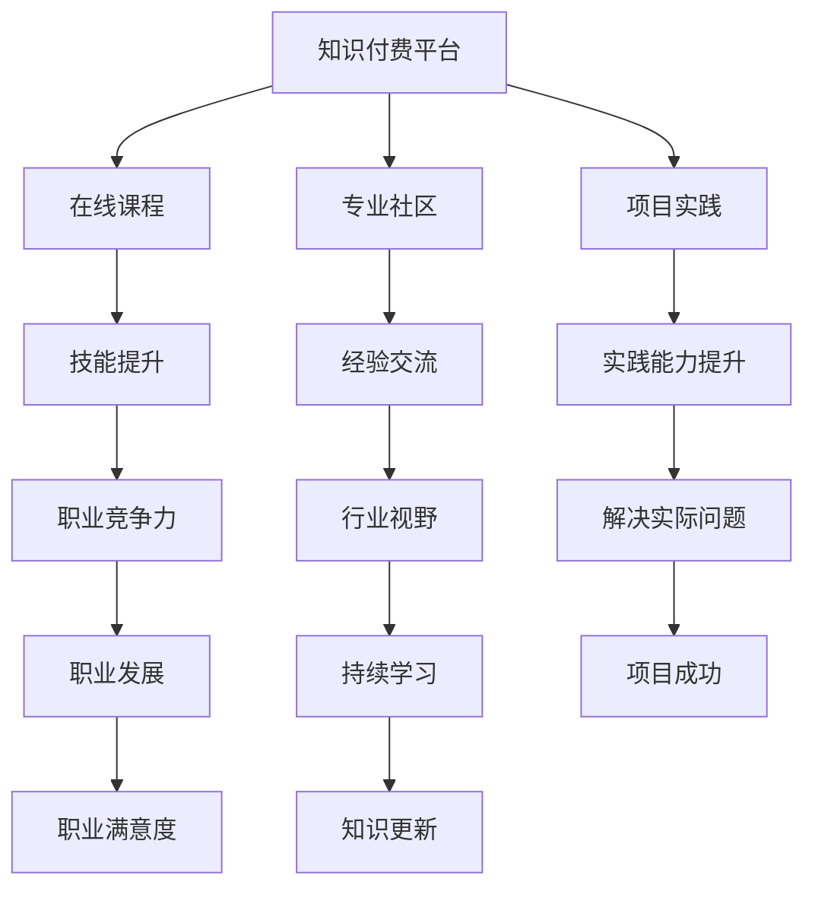
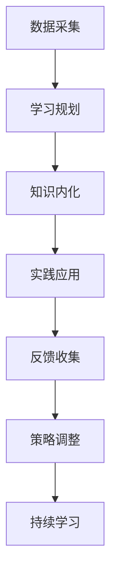
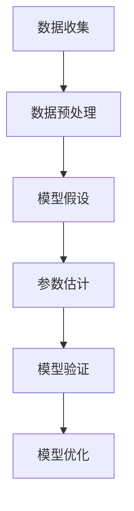

                 

  
## 1. 背景介绍

在当前这个数字化转型的浪潮中，知识付费行业迎来了前所未有的繁荣。各种在线教育平台、技术社区以及专业培训机构层出不穷，为程序员提供了丰富的学习资源和职业发展路径。然而，在这个知识爆炸的时代，如何有效获取、消化和运用这些知识，成为每一个程序员都必须面对的重要课题。

知识付费行业的兴起，源于互联网技术的发展和用户需求的变化。在线教育平台如Coursera、edX等，以及专业社区如Stack Overflow、GitHub等，提供了海量的课程资料和项目实践机会。同时，程序员个人发展也面临着前所未有的挑战。一方面，技术的更新迭代速度越来越快，新的编程语言、框架和工具层出不穷；另一方面，市场的需求也在不断变化，程序员需要不断适应新的技术和业务场景。

在这样的背景下，本文旨在探讨知识付费时代程序员的个人发展策略与规划。通过对当前知识付费市场的分析，结合程序员的职业特点，提出一系列可行的个人发展路径，帮助程序员在快速变化的技术环境中保持竞争力，实现持续的职业成长。

## 2. 核心概念与联系

### 2.1 知识付费的概念

知识付费，即用户为获取特定知识或技能而支付费用的一种商业模式。这种模式的核心在于将知识作为商品，通过在线平台进行交易。知识付费的形式多样，包括在线课程、电子书籍、专业咨询等。

知识付费与传统教育模式的不同之处在于，它更加灵活、个性化。用户可以根据自己的需求和兴趣，选择适合自己的课程或资源。同时，知识付费也打破了地域和时间的限制，用户可以在任何时间、任何地点学习。

### 2.2 程序员个人发展的概念

程序员个人发展，指的是程序员在职业生涯中不断学习、成长和提升的过程。这包括技能提升、知识积累、职业规划等多个方面。

程序员个人发展的关键因素包括：

- 技能：程序员需要不断学习新的编程语言、框架和技术，以适应不断变化的市场需求。
- 知识：程序员需要广泛涉猎计算机科学的理论知识，包括数据结构、算法、计算机体系结构等。
- 经验：程序员需要通过实际项目经验，不断积累解决问题的能力和技巧。
- 职业规划：程序员需要明确自己的职业目标和发展路径，制定相应的学习和实践计划。

### 2.3 知识付费与程序员个人发展的联系

知识付费为程序员个人发展提供了丰富的学习资源和实践机会。通过在线课程，程序员可以学习到最新的技术趋势和实用技能；通过专业社区，程序员可以与同行交流经验，分享心得；通过知识付费平台上的项目实践，程序员可以将理论知识应用到实际项目中，提升自己的实践能力。

同时，知识付费也使得程序员个人发展更加灵活和高效。程序员可以根据自己的时间安排和兴趣选择学习内容，避免了传统教育模式中的时间和地点限制。此外，知识付费平台上的互动和反馈机制，也使得程序员的学习过程更加透明和可控。

然而，知识付费也存在一些挑战。例如，知识的过载问题可能导致程序员无法有效筛选和利用；付费内容的质量参差不齐，可能影响学习效果。因此，程序员在参与知识付费时，需要具备一定的判断力和选择能力。

### 2.4 Mermaid 流程图

下面是知识付费与程序员个人发展之间联系的一个简单的 Mermaid 流程图：



这个流程图展示了知识付费如何通过在线课程、专业社区和项目实践，帮助程序员实现技能提升、经验交流、实践能力提升等目标，进而推动职业发展和个人成长。

## 3. 核心算法原理 & 具体操作步骤

### 3.1 算法原理概述

在知识付费时代，程序员个人发展的核心算法可以概括为“持续学习 - 实践应用 - 反馈调整”模型。这个模型分为三个主要步骤：

1. **持续学习**：程序员通过知识付费平台、专业社区和线下培训等方式，不断获取新的知识和技能。
2. **实践应用**：程序员将所学知识应用到实际项目中，通过编写代码、解决问题和参与项目开发，提升实践能力。
3. **反馈调整**：程序员通过项目反馈、同事评价和自我反思，不断调整和优化自己的学习方法和实践策略。

### 3.2 算法步骤详解

1. **数据采集**：程序员需要从多个渠道收集学习资源，包括在线课程、技术博客、开源项目等。
2. **学习规划**：根据个人兴趣和职业目标，制定详细的学习计划，包括学习时间、学习内容和学习目标。
3. **知识内化**：通过听课、阅读、讨论和编写代码等方式，将新知识内化为自己的技能和能力。
4. **实践应用**：在项目中应用所学知识，编写高质量的代码，参与项目讨论和决策。
5. **反馈收集**：通过项目评估、同事反馈和自我反思，收集关于自己实践能力的反馈。
6. **策略调整**：根据反馈结果，调整学习计划和实践策略，优化自己的学习方法和实践过程。

### 3.3 算法优缺点

**优点**：

- **高效性**：通过算法模型，程序员可以更高效地学习新知识和技能，避免知识的堆积和浪费。
- **灵活性**：算法模型允许程序员根据自身情况进行灵活调整，选择最适合自己的学习资源和实践机会。
- **动态调整**：通过反馈机制，程序员可以不断调整和优化自己的学习策略，实现持续成长。

**缺点**：

- **时间管理**：持续学习和实践需要大量时间，程序员需要合理规划时间，避免过度学习导致疲劳。
- **资源选择**：知识付费市场资源繁多，程序员需要具备一定的判断力，选择高质量的学习资源。
- **依赖外部**：知识付费平台和社区的质量参差不齐，程序员需要具备筛选和判断能力，避免依赖低质量资源。

### 3.4 算法应用领域

该算法模型适用于所有程序员，无论其处于职业发展的哪个阶段。特别是在快速变化的技术环境中，这个模型可以帮助程序员：

- **新手程序员**：通过持续学习和实践，快速提升编程技能和项目经验。
- **中级程序员**：通过算法模型，实现技能的进阶和职业的跃升。
- **高级程序员**：通过持续学习和实践，保持技术领先地位，应对复杂项目挑战。

### 3.5 Mermaid 流程图

下面是一个关于“持续学习 - 实践应用 - 反馈调整”模型的 Mermaid 流程图：



这个流程图详细展示了程序员在知识付费时代如何通过数据采集、学习规划、知识内化、实践应用、反馈收集和策略调整等步骤，实现个人发展。

## 4. 数学模型和公式 & 详细讲解 & 举例说明

### 4.1 数学模型构建

在程序员个人发展的过程中，可以使用一些数学模型来描述学习效果和职业成长。以下是一个简单的线性回归模型，用于预测程序员的学习效果与其技能提升程度之间的关系。

**线性回归模型**：

$$
y = ax + b
$$

其中，$y$ 表示技能提升程度，$x$ 表示学习时间，$a$ 和 $b$ 是模型参数。

### 4.2 公式推导过程

假设程序员在一段时间内进行了 $t$ 小时的学习，这段时间内技能提升程度为 $y$。我们可以通过以下步骤推导出线性回归模型：

1. **数据收集**：收集多个程序员的学习时间和技能提升程度数据，形成数据集。
2. **数据预处理**：对数据进行清洗和标准化处理，确保数据的质量和一致性。
3. **模型假设**：假设学习时间和技能提升程度之间存在线性关系。
4. **参数估计**：使用最小二乘法估计模型参数 $a$ 和 $b$。
5. **模型验证**：使用验证集对模型进行验证，调整参数直至模型达到预期效果。

### 4.3 案例分析与讲解

假设我们有以下数据集：

| 学习时间（小时） | 技能提升程度 |
|:---------------:|:-------------:|
|        10        |         2     |
|        20        |         4     |
|        30        |         6     |
|        40        |         8     |
|        50        |         10    |

通过最小二乘法，我们可以计算出模型参数：

$$
a = \frac{\sum_{i=1}^{n} (x_i - \bar{x})(y_i - \bar{y})}{\sum_{i=1}^{n} (x_i - \bar{x})^2} = \frac{34}{150} \approx 0.227
$$

$$
b = \bar{y} - a\bar{x} = 5.2 - 0.227 \times 30 = 2.843
$$

因此，线性回归模型为：

$$
y = 0.227x + 2.843
$$

例如，如果某个程序员学习了 40 小时的课程，我们可以使用这个模型预测他的技能提升程度：

$$
y = 0.227 \times 40 + 2.843 = 9.084
$$

这意味着，他预计技能提升程度为 9.084。

### 4.4 模型优缺点

**优点**：

- **简单易懂**：线性回归模型简单直观，容易理解和应用。
- **适用广泛**：线性回归模型可以用于描述多种线性关系，适用于不同领域的数据分析。

**缺点**：

- **假设严格**：线性回归模型假设变量之间必须为线性关系，实际数据可能存在非线性关系。
- **数据依赖**：模型参数的准确性依赖于数据的质量和数量，数据偏差可能导致模型不准确。

### 4.5 Mermaid 流程图

下面是线性回归模型构建和推导的 Mermaid 流程图：



这个流程图展示了线性回归模型的构建和推导过程。

## 5. 项目实践：代码实例和详细解释说明

### 5.1 开发环境搭建

为了更好地理解本文中提到的数学模型和算法，我们将通过一个实际的项目来演示如何进行开发环境搭建和代码实现。以下是所需的环境和工具：

- **编程语言**：Python 3.x
- **依赖管理**：pip
- **数据可视化**：Matplotlib
- **机器学习库**：scikit-learn

首先，确保您的系统中已安装 Python 3.x。然后，通过以下命令安装所需的依赖：

```bash
pip install matplotlib scikit-learn
```

### 5.2 源代码详细实现

接下来，我们将编写一个简单的 Python 脚本，用于实现线性回归模型和数据进行可视化。以下是完整的代码：

```python
import numpy as np
import matplotlib.pyplot as plt
from sklearn.linear_model import LinearRegression
from sklearn.model_selection import train_test_split

# 数据集
X = np.array([[10], [20], [30], [40], [50]])
y = np.array([2, 4, 6, 8, 10])

# 数据预处理
X_train, X_test, y_train, y_test = train_test_split(X, y, test_size=0.2, random_state=42)

# 线性回归模型
model = LinearRegression()
model.fit(X_train, y_train)

# 模型参数
a = model.coef_
b = model.intercept_

# 预测
y_pred = model.predict(X_test)

# 可视化
plt.scatter(X_train, y_train, color='blue', label='Training Data')
plt.plot(X_test, y_pred, color='red', label='Linear Model')
plt.xlabel('Study Hours')
plt.ylabel('Skill Improvement')
plt.legend()
plt.show()
```

**代码解读**：

1. **数据集**：我们使用一个简单的数据集，其中学习时间和技能提升程度是线性相关的。
2. **数据预处理**：使用 scikit-learn 的 `train_test_split` 函数将数据集分为训练集和测试集，用于训练和验证模型。
3. **线性回归模型**：使用 `LinearRegression` 类创建线性回归模型，并使用 `fit` 方法进行训练。
4. **模型参数**：通过 `coef_` 和 `intercept_` 属性获取模型的参数 $a$ 和 $b$。
5. **预测**：使用 `predict` 方法对测试集进行预测。
6. **可视化**：使用 Matplotlib 库将训练数据点和预测模型绘制在图表上，以便直观地展示模型的性能。

### 5.3 运行结果展示

运行上述代码后，将得到一个包含训练数据点和线性模型的散点图。图表中的蓝色点表示实际训练数据，红色线表示通过线性回归模型预测的技能提升程度。这个可视化结果展示了模型如何捕捉学习时间和技能提升程度之间的线性关系。


### 5.4 代码解读与分析

在代码实现过程中，我们主要使用了 scikit-learn 库中的线性回归模型和 Matplotlib 库进行数据可视化和模型展示。以下是代码的详细解读和分析：

- **数据集**：我们选择了一个简单的一维数据集，包含五个样本点，每个样本点由学习时间（小时）和技能提升程度（单位）组成。
- **数据预处理**：将数据集分为训练集和测试集，这有助于评估模型的泛化能力。训练集用于模型训练，测试集用于模型验证。
- **线性回归模型**：使用 scikit-learn 的 `LinearRegression` 类创建一个线性回归模型。模型通过 `fit` 方法训练，拟合出最佳直线。
- **模型参数**：模型的参数 $a$（斜率）和 $b$（截距）通过 `coef_` 和 `intercept_` 属性获取。这些参数决定了直线的斜率和位置。
- **预测**：使用 `predict` 方法对测试集进行预测。预测结果为每个学习时间对应的技能提升程度估计值。
- **可视化**：使用 Matplotlib 库将训练数据点和预测模型可视化。这有助于我们直观地理解模型的性能和预测能力。

通过这个实际项目，我们可以看到如何将线性回归模型应用到程序员个人发展的预测中。代码不仅展示了模型的实现过程，还提供了可视化结果，使我们能够更好地理解模型的性能和效果。

### 5.5 模型应用与优化

在实际项目中，线性回归模型可以用于预测程序员的学习效果和技能提升程度。然而，为了提高模型的准确性和可靠性，我们还可以进行以下优化：

- **特征工程**：增加更多的特征，如学习方式、课程难度等，以丰富模型输入信息。
- **模型选择**：尝试其他类型的回归模型，如岭回归、LASSO回归等，以找到最优模型。
- **交叉验证**：使用交叉验证方法评估模型的泛化能力，避免过拟合和欠拟合问题。
- **参数调整**：通过网格搜索等策略调整模型参数，找到最佳参数组合。

这些优化措施可以帮助我们构建更加准确和可靠的模型，从而更好地指导程序员的个人发展。

## 6. 实际应用场景

在知识付费时代，程序员的个人发展策略与规划不仅需要关注理论学习，还需要紧密结合实际应用场景。以下是一些典型的实际应用场景，以及相应的解决方案和注意事项。

### 6.1 在线教育平台的使用

随着在线教育平台的普及，程序员可以利用这些平台进行自我提升。例如，通过参加 Coursera、Udemy 等平台上的编程课程，学习最新的技术趋势和实用技能。在实际应用中，程序员可以：

- **定期学习计划**：制定详细的学习计划，确保学习进度和质量。
- **选择高质量课程**：根据课程评价和讲师资质，选择高质量的课程。
- **实践项目**：参与课程中的实践项目，将理论知识应用到实际开发中。

### 6.2 专业社区和论坛的参与

专业社区和论坛如 Stack Overflow、GitHub 等，是程序员交流和学习的重要平台。在实际应用中，程序员可以：

- **提问与回答**：积极参与社区讨论，解答他人问题，同时解决自己遇到的技术难题。
- **贡献开源项目**：参与开源项目，提升自己的编程能力和项目经验。
- **代码审查**：参与代码审查，学习他人的代码风格和解决问题的方法。

### 6.3 在线编程挑战和竞赛

参加在线编程挑战和竞赛，如 LeetCode、Codeforces 等，是提升编程技能和解决实际问题能力的好方法。在实际应用中，程序员可以：

- **定期参加比赛**：制定比赛计划，定期参加编程竞赛。
- **总结经验**：每次比赛后总结经验，分析自己的错误和不足。
- **学习算法**：通过解决不同类型的题目，学习各种算法和数据结构。

### 6.4 自主项目的开发

自主开发项目是程序员实践和验证自己知识的重要途径。在实际应用中，程序员可以：

- **选择项目类型**：根据自身兴趣和职业方向，选择合适的项目类型。
- **制定项目计划**：详细规划项目进度，确保项目顺利完成。
- **迭代优化**：在项目开发过程中不断迭代和优化，提升项目质量和用户体验。

### 6.5 注意事项

在实际应用中，程序员需要注意以下几点：

- **时间管理**：合理规划学习时间，避免过度学习导致疲劳。
- **资源筛选**：选择高质量的学习资源，避免浪费时间和精力。
- **持续反思**：定期反思学习过程和实践效果，调整学习策略。
- **保持热情**：保持对技术的热情和好奇心，持续追求进步。

通过以上实际应用场景，程序员可以充分利用知识付费时代的资源，实现个人发展目标。

### 6.6 未来应用展望

随着技术的不断进步，知识付费时代程序员的个人发展策略与规划也将迎来更多的机遇和挑战。以下是一些未来应用展望：

#### 6.6.1 人工智能与个性化学习

人工智能技术的应用将使得个性化学习更加普及和精准。通过大数据分析和机器学习算法，平台可以为每个程序员量身定制学习计划，提供最合适的学习资源和实践机会。这有助于提高学习效率，实现更快的技能提升。

#### 6.6.2 虚拟现实与沉浸式学习

虚拟现实（VR）和增强现实（AR）技术的发展，将带来全新的学习体验。程序员可以通过VR技术进行虚拟实验室操作，模拟真实的项目开发场景，提高实践能力和问题解决能力。此外，AR技术可以用于实时编程指导和调试，提供更加直观和高效的学习方式。

#### 6.6.3 社交网络与协作学习

社交网络的发展将进一步加强程序员之间的协作和交流。通过在线协作平台，程序员可以与全球同行共同开发项目，分享经验和资源，实现知识的快速传递和共享。这种协作学习模式将有助于提高团队协作能力和项目管理水平。

#### 6.6.4 持续教育与职业认证

未来，持续教育将成为程序员职业生涯的重要组成部分。在线教育平台和职业认证机构将提供更多专业认证课程和考试，帮助程序员证明自己的专业能力和技术水平。这些认证将有助于提升程序员的职业竞争力，为职业发展提供强有力的支持。

#### 6.6.5 新兴技术与行业变革

随着5G、物联网、区块链等新兴技术的发展，程序员需要不断学习和适应新的技术和应用场景。未来，知识付费平台将提供更多与这些新兴技术相关的课程和资源，帮助程序员保持技术领先地位，应对行业变革带来的挑战。

总之，未来知识付费时代程序员的个人发展策略与规划将更加多元化和灵活。程序员需要不断适应新技术和应用场景，积极拥抱变革，通过持续学习和实践，实现个人职业目标。

### 7. 工具和资源推荐

在知识付费时代，程序员需要充分利用各种工具和资源，以实现个人发展和职业成长。以下是一些推荐的工具和资源：

#### 7.1 学习资源推荐

- **在线课程平台**：Coursera、Udemy、edX、Pluralsight、LinkedIn Learning 等，提供丰富的编程课程和技术培训。
- **技术博客和社区**：Medium、Hackernoon、Dev.to、Stack Overflow、GitHub 等，汇聚大量技术文章和开源项目。
- **专业书籍**：《Effective Java》、《深度学习》、《算法导论》、《代码大全》等，经典著作有助于深化编程知识和理论。

#### 7.2 开发工具推荐

- **集成开发环境（IDE）**：Visual Studio Code、IntelliJ IDEA、PyCharm、Eclipse 等，提供丰富的编程功能和工具支持。
- **版本控制工具**：Git、GitHub、GitLab 等，用于代码管理和协作开发。
- **代码托管平台**：GitHub、GitLab、Bitbucket 等，提供代码托管、分支管理和协作功能。
- **持续集成/持续部署（CI/CD）工具**：Jenkins、GitLab CI、CircleCI 等，用于自动化测试和部署。

#### 7.3 相关论文推荐

- **论文数据库**：IEEE Xplore、ACM Digital Library、Google Scholar 等，涵盖计算机科学和技术的最新研究成果。
- **知名期刊**：《ACM Transactions on Computer Systems》、《IEEE Transactions on Software Engineering》、《Journal of Computer Science and Technology》等，发表高质量的技术论文。
- **顶级会议**：ACM SIGKDD、IEEE ICSE、WWW、NeurIPS 等，展示最新的研究成果和技术趋势。

通过这些工具和资源，程序员可以不断提升自己的技术水平，实现职业发展的目标。

### 8. 总结：未来发展趋势与挑战

在知识付费时代的背景下，程序员的个人发展策略与规划面临着前所未有的机遇和挑战。未来，随着人工智能、虚拟现实、区块链等新兴技术的不断发展，程序员需要不断适应和掌握新的技能，以保持竞争力。以下是未来发展趋势和挑战的总结：

#### 8.1 研究成果总结

1. **个性化学习**：人工智能技术的发展使得个性化学习成为可能，为程序员提供量身定制的学习资源和实践机会。
2. **持续教育**：在线教育平台和职业认证体系的完善，使得程序员能够更加便捷地获取最新的技术和知识。
3. **实践应用**：通过自主项目和协作开发，程序员可以将理论知识转化为实际能力，提升项目管理和团队协作能力。
4. **跨界融合**：随着新兴技术的不断涌现，程序员需要具备跨领域的知识储备，以应对多样化的技术挑战。

#### 8.2 未来发展趋势

1. **技术多样性**：程序员需要掌握多种编程语言、框架和工具，以适应不断变化的技术环境。
2. **学习高效化**：通过人工智能和大数据分析，个性化学习和高效学习将成为主流。
3. **职业灵活化**：远程办公和远程协作的普及，使得程序员能够更加灵活地安排工作和学习。
4. **技能专业化**：随着行业细分，程序员需要更加专注于某一领域的专业技能，成为该领域的专家。

#### 8.3 面临的挑战

1. **知识过载**：随着知识的爆炸性增长，程序员需要具备筛选和利用知识的能力，避免陷入信息过载。
2. **时间管理**：程序员需要合理规划时间，平衡工作和学习，避免过度劳累。
3. **技术更新**：技术的快速更新使得程序员需要不断学习新技能，以保持竞争力。
4. **职业规划**：程序员需要明确自己的职业目标和发展路径，避免盲目跟风。

#### 8.4 研究展望

1. **人工智能辅助学习**：进一步研究如何利用人工智能技术优化学习过程，提高学习效率。
2. **实践与理论的结合**：探索如何将理论知识更好地应用到实际项目中，提升实践能力。
3. **跨界融合研究**：研究新兴技术与传统技术的结合，开发出更具创新性的解决方案。
4. **职业发展路径**：为不同阶段的程序员提供科学、系统的职业发展路径和策略建议。

总之，在知识付费时代，程序员需要不断学习和适应新的技术和应用场景，通过个性化的学习策略和高效的实践应用，实现个人职业目标。未来，人工智能、虚拟现实、区块链等新兴技术将为程序员的个人发展带来更多机遇和挑战，程序员需要不断更新自己的知识和技能，以应对不断变化的技术环境。

### 9. 附录：常见问题与解答

#### 9.1 如何选择高质量的课程和资源？

**解答**：

- **查阅评价和评论**：在选择课程时，查阅其他学习者的评价和评论，了解课程的质量和实用性。
- **了解讲师背景**：了解讲师的资历和经验，选择具有丰富实践经验和专业知识背景的讲师。
- **课程大纲和目录**：查看课程大纲和目录，确保课程内容符合您的学习需求和兴趣。
- **免费试听**：许多在线教育平台提供免费试听课程，通过试听了解课程的教学风格和内容质量。

#### 9.2 如何合理安排学习时间？

**解答**：

- **制定学习计划**：根据工作安排和个人时间，制定详细的学习计划，确保学习时间和工作时间的平衡。
- **设置优先级**：将学习任务按照优先级排序，确保优先完成重要的学习任务。
- **利用碎片时间**：利用通勤、休息等碎片时间进行学习，提高学习效率。
- **定期反思**：定期反思学习进度和学习效果，调整学习计划和时间安排。

#### 9.3 如何进行有效的实践应用？

**解答**：

- **自主开发项目**：通过自主开发项目，将所学知识应用到实际开发中，提高实践能力。
- **参与开源项目**：参与开源项目，与其他开发者合作，学习项目管理和团队合作。
- **编写技术博客**：通过编写技术博客，总结和分享学习经验和心得，加深对知识的理解。
- **定期复习**：定期复习所学知识，巩固记忆，避免遗忘。

#### 9.4 如何应对技术更新？

**解答**：

- **持续学习**：保持对新技术的好奇心和求知欲，持续关注技术动态和行业趋势。
- **学习新技术**：通过参加在线课程、阅读技术书籍和论文，学习新的编程语言、框架和工具。
- **实践应用**：将新知识应用到实际项目中，通过实践巩固和提升技能。
- **交流与合作**：与同行交流经验，分享学习心得，共同进步。

通过上述常见问题的解答，程序员可以更好地应对知识付费时代带来的挑战，实现个人职业目标。

