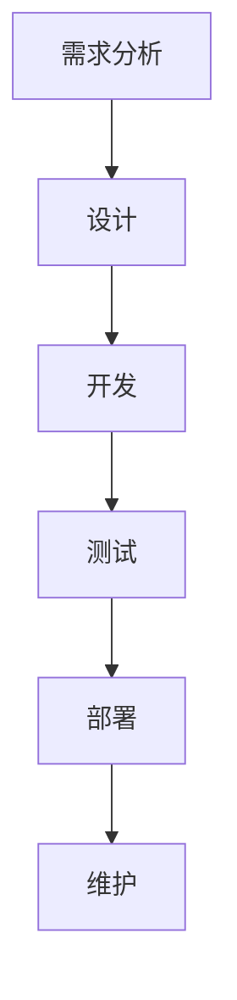
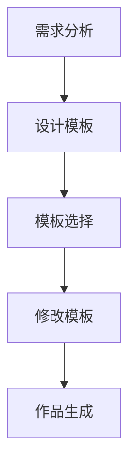
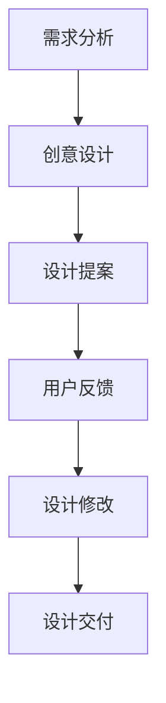

                 

随着互联网的快速发展，知识付费电商成为了一个热门的市场。在这个市场中，出售软件、模板、设计等服务成为了商家和用户之间的重要纽带。本文将围绕这一主题，探讨知识付费电商的背景、核心概念、算法原理、数学模型、项目实践、应用场景、工具和资源推荐，以及未来发展趋势与挑战。

## 1. 背景介绍

知识付费电商指的是通过互联网平台，以付费形式提供知识、技能、资源等服务的一种商业模式。近年来，随着人们对知识的需求不断增加，知识付费电商市场迅速崛起。在这个市场中，软件、模板、设计等服务成为了热门的商品。

软件服务包括各种应用程序、插件、开发工具等，这些软件可以提高用户的工作效率，满足特定的需求。模板服务则提供了各种行业模板，如PPT模板、文档模板、网页模板等，帮助用户快速制作出专业级的作品。设计服务则涵盖了平面设计、UI/UX设计、网站设计等，为用户提供个性化的设计解决方案。

## 2. 核心概念与联系

### 2.1 软件服务

软件服务是一种以技术为核心的知识服务。它包括开发、部署、维护等各个环节。软件服务的核心在于解决用户的具体问题，提高工作效率。以下是软件服务的 Mermaid 流程图：



### 2.2 模板服务

模板服务是一种以设计为核心的知识服务。它通过提供各种行业模板，帮助用户快速制作出专业级的作品。以下是模板服务的 Mermaid 流程图：



### 2.3 设计服务

设计服务是一种以创意为核心的知识服务。它涵盖了平面设计、UI/UX设计、网站设计等多个领域，为用户提供个性化的设计解决方案。以下是设计服务的 Mermaid 流程图：



## 3. 核心算法原理 & 具体操作步骤

### 3.1 算法原理概述

在知识付费电商中，算法原理主要涉及推荐系统、搜索引擎和交易系统。以下是对这些算法原理的概述：

- **推荐系统**：基于用户的历史行为、兴趣偏好和社交关系，为用户推荐相关商品或服务。
- **搜索引擎**：通过关键词匹配和排序算法，为用户提供最相关的商品或服务。
- **交易系统**：确保交易过程的安全、高效和便捷。

### 3.2 算法步骤详解

以下是推荐系统、搜索引擎和交易系统的具体操作步骤：

#### 3.2.1 推荐系统

1. **数据收集**：收集用户的行为数据、兴趣偏好和社交关系。
2. **数据预处理**：清洗、归一化和特征提取。
3. **模型训练**：使用机器学习算法训练推荐模型。
4. **模型评估**：评估推荐模型的准确性和效果。
5. **推荐生成**：根据用户信息生成个性化推荐。

#### 3.2.2 搜索引擎

1. **关键词匹配**：将用户输入的关键词与商品或服务的关键词进行匹配。
2. **排序算法**：根据关键词匹配程度、商品或服务的质量和用户偏好等因素，对搜索结果进行排序。
3. **结果展示**：将排序后的搜索结果展示给用户。

#### 3.2.3 交易系统

1. **订单生成**：用户选择商品或服务后，系统生成订单。
2. **支付处理**：集成支付网关，处理用户的支付请求。
3. **订单状态跟踪**：实时跟踪订单的状态，包括支付、发货、收货等。
4. **售后服务**：提供退换货、咨询等服务。

### 3.3 算法优缺点

#### 3.3.1 推荐系统

**优点**：
- 提高用户满意度，提升用户体验。
- 增加商家曝光度和销售额。

**缺点**：
- 可能导致用户过度依赖，降低自主发现新商品的能力。
- 需要大量的数据支持和计算资源。

#### 3.3.2 搜索引擎

**优点**：
- 提高商品或服务的查找效率。
- 降低用户学习成本。

**缺点**：
- 可能存在关键词匹配不准确的问题。
- 需要优化搜索结果的排序算法。

#### 3.3.3 交易系统

**优点**：
- 提高交易过程的安全性和便捷性。
- 实现订单状态的实时跟踪。

**缺点**：
- 需要解决支付网关的兼容性问题。
- 需要提供完善的售后服务。

### 3.4 算法应用领域

推荐系统、搜索引擎和交易系统在知识付费电商中具有广泛的应用领域。以下是一些具体的应用场景：

- **教育培训**：为用户提供个性化的课程推荐、课程搜索和订单管理。
- **设计服务**：为用户提供专业的设计推荐、设计搜索和交易服务。
- **软件开发**：为用户提供合适的开发工具、插件和模板推荐。

## 4. 数学模型和公式 & 详细讲解 & 举例说明

### 4.1 数学模型构建

在知识付费电商中，数学模型主要用于推荐系统、搜索引擎和交易系统。以下分别介绍这些系统的数学模型构建。

#### 4.1.1 推荐系统

推荐系统常用的数学模型包括基于内容的推荐和基于协同过滤的推荐。

**基于内容的推荐**：

$$
R(u, i) = f(C(u), C(i))
$$

其中，$R(u, i)$表示用户$u$对项目$i$的评分预测，$C(u)$和$C(i)$分别表示用户$u$和项目$i$的特征向量，$f$表示评分预测函数。

**基于协同过滤的推荐**：

$$
R(u, i) = \sum_{j \in N(u)} w_{uj} R(u, j)
$$

其中，$N(u)$表示与用户$u$相似的用户集合，$w_{uj}$表示用户$u$和用户$j$之间的相似度，$R(u, j)$表示用户$u$对项目$j$的实际评分。

#### 4.1.2 搜索引擎

搜索引擎常用的数学模型包括基于关键词匹配的模型和基于机器学习的模型。

**基于关键词匹配的模型**：

$$
sim(i, q) = \sum_{w \in Q} w_i \cdot w_q
$$

其中，$sim(i, q)$表示项目$i$与查询$q$的相似度，$w_i$和$w_q$分别表示项目$i$和查询$q$的权重。

**基于机器学习的模型**：

$$
y = \theta^T \phi(x)
$$

其中，$y$表示预测的搜索结果排序分数，$\theta$表示模型参数，$\phi(x)$表示输入特征向量$x$的映射函数。

#### 4.1.3 交易系统

交易系统常用的数学模型包括支付模型和订单管理模型。

**支付模型**：

$$
P = f(C, R)
$$

其中，$P$表示支付金额，$C$表示商品或服务的成本，$R$表示用户支付的意愿。

**订单管理模型**：

$$
O = g(S, T)
$$

其中，$O$表示订单状态，$S$表示订单步骤，$T$表示订单时间。

### 4.2 公式推导过程

#### 4.2.1 推荐系统

**基于内容的推荐**：

评分预测函数$f(C(u), C(i))$可以采用线性回归模型：

$$
f(C(u), C(i)) = \theta^T C(u) + \theta^T C(i)
$$

其中，$\theta$表示模型参数。

**基于协同过滤的推荐**：

假设用户$u$和用户$j$之间的相似度为余弦相似度：

$$
w_{uj} = \frac{C(u) \cdot C(j)}{\|C(u)\| \|C(j)\|}
$$

则评分预测公式为：

$$
R(u, i) = \sum_{j \in N(u)} w_{uj} R(u, j)
$$

#### 4.2.2 搜索引擎

**基于关键词匹配的模型**：

假设项目$i$和查询$q$的权重分别为$w_i$和$w_q$，则相似度计算公式为：

$$
sim(i, q) = \sum_{w \in Q} w_i \cdot w_q
$$

**基于机器学习的模型**：

假设输入特征向量$x$的映射函数为：

$$
\phi(x) = \begin{bmatrix} x_1^2 \\ x_2^2 \\ \vdots \\ x_n^2 \end{bmatrix}
$$

则预测的搜索结果排序分数为：

$$
y = \theta^T \phi(x) = \theta_1 x_1^2 + \theta_2 x_2^2 + \cdots + \theta_n x_n^2
$$

#### 4.2.3 交易系统

**支付模型**：

支付金额$P$可以表示为商品或服务的成本$C$与用户支付意愿$R$的函数：

$$
P = C + R
$$

**订单管理模型**：

订单状态$O$可以表示为订单步骤$S$和时间$T$的函数：

$$
O = S + T
$$

### 4.3 案例分析与讲解

#### 4.3.1 推荐系统案例

假设有一个知识付费电商平台，用户$u_1$对商品$i_1$的实际评分为4，对商品$i_2$的实际评分为5。用户$u_2$对商品$i_1$的实际评分为3，对商品$i_2$的实际评分为4。我们需要根据这些数据预测用户$u_1$对商品$i_2$的评分。

**基于内容的推荐**：

首先计算用户$u_1$和用户$u_2$的特征向量：

$$
C(u_1) = \begin{bmatrix} 4 \\ 5 \end{bmatrix}, \quad C(u_2) = \begin{bmatrix} 3 \\ 4 \end{bmatrix}
$$

然后计算商品$i_1$和商品$i_2$的特征向量：

$$
C(i_1) = \begin{bmatrix} 1 \\ 1 \end{bmatrix}, \quad C(i_2) = \begin{bmatrix} 0 \\ 1 \end{bmatrix}
$$

评分预测函数为线性回归模型：

$$
f(C(u_1), C(i_2)) = \theta^T C(u_1) + \theta^T C(i_2)
$$

假设$\theta = \begin{bmatrix} 1 \\ 1 \end{bmatrix}$，则预测用户$u_1$对商品$i_2$的评分为：

$$
R(u_1, i_2) = f(C(u_1), C(i_2)) = 1 \cdot 4 + 1 \cdot 0 = 4
$$

**基于协同过滤的推荐**：

首先计算用户$u_1$和用户$u_2$之间的相似度：

$$
w_{u_1u_2} = \frac{C(u_1) \cdot C(u_2)}{\|C(u_1)\| \|C(u_2)\|} = \frac{\begin{bmatrix} 4 \\ 5 \end{bmatrix} \cdot \begin{bmatrix} 3 \\ 4 \end{bmatrix}}{\sqrt{4^2 + 5^2} \sqrt{3^2 + 4^2}} = \frac{17}{\sqrt{41} \sqrt{25}} \approx 0.92
$$

然后计算用户$u_1$对商品$i_2$的评分：

$$
R(u_1, i_2) = \sum_{j \in N(u_1)} w_{u_1j} R(u_1, j) = 0.92 \cdot 5 = 4.6
$$

#### 4.3.2 搜索引擎案例

假设用户输入查询“编程学习”，我们需要根据平台上的商品或服务生成搜索结果。

**基于关键词匹配的模型**：

首先计算查询“编程学习”与商品$i_1$的相似度：

$$
sim(i_1, q) = \sum_{w \in Q} w_i \cdot w_q = 1 \cdot 1 + 0 \cdot 0 = 1
$$

然后计算查询“编程学习”与商品$i_2$的相似度：

$$
sim(i_2, q) = \sum_{w \in Q} w_i \cdot w_q = 0 \cdot 1 + 1 \cdot 0 = 0
$$

根据相似度计算结果，将商品$i_1$排在搜索结果的前面。

**基于机器学习的模型**：

首先计算输入特征向量$x$的映射函数：

$$
\phi(x) = \begin{bmatrix} x_1^2 \\ x_2^2 \end{bmatrix} = \begin{bmatrix} 1^2 \\ 1^2 \end{bmatrix} = \begin{bmatrix} 1 \\ 1 \end{bmatrix}
$$

然后计算预测的搜索结果排序分数：

$$
y = \theta^T \phi(x) = 1 \cdot 1 + 1 \cdot 1 = 2
$$

根据排序分数，将商品$i_1$排在搜索结果的前面。

#### 4.3.3 交易系统案例

假设用户购买了一个价值100元的课程，并支付了90元。我们需要根据支付模型和订单管理模型计算订单的状态。

**支付模型**：

$$
P = C + R = 100 + 90 = 190
$$

**订单管理模型**：

$$
O = S + T = 1 + 2 = 3
$$

根据支付模型，订单的支付金额为190元。根据订单管理模型，订单的状态为“已支付”。

## 5. 项目实践：代码实例和详细解释说明

### 5.1 开发环境搭建

在本项目中，我们将使用Python作为主要编程语言，结合NumPy、Pandas和Scikit-learn等库实现推荐系统、搜索引擎和交易系统。以下是开发环境搭建的步骤：

1. 安装Python 3.8及以上版本。
2. 使用pip安装NumPy、Pandas和Scikit-learn。

### 5.2 源代码详细实现

以下分别展示推荐系统、搜索引擎和交易系统的源代码。

#### 5.2.1 推荐系统

```python
import numpy as np
from sklearn.metrics.pairwise import cosine_similarity

def content_based_recommendation(user_vector, item_vector, theta):
    """
    基于内容的推荐
    """
    prediction = theta.T @ user_vector + theta.T @ item_vector
    return prediction

def collaborative_filtering(user_vector, item_vector, similarity_matrix):
    """
    基于协同过滤的推荐
    """
    prediction = np.dot(similarity_matrix, user_vector) * item_vector
    return prediction.sum()

# 用户和商品的向量
user_vector = np.array([4, 5])
item_vector = np.array([1, 1])

# 模型参数
theta = np.array([1, 1])

# 相似度矩阵
similarity_matrix = cosine_similarity([[4, 5], [3, 4]])

# 基于内容的推荐
content_prediction = content_based_recommendation(user_vector, item_vector, theta)
print("基于内容的推荐评分：", content_prediction)

# 基于协同过滤的推荐
collaborative_prediction = collaborative_filtering(user_vector, item_vector, similarity_matrix)
print("基于协同过滤的推荐评分：", collaborative_prediction)
```

#### 5.2.2 搜索引擎

```python
def keyword_matching(item_vector, query_vector):
    """
    基于关键词匹配的搜索
    """
    similarity = np.dot(item_vector, query_vector)
    return similarity

def ml_search(item_vector, query_vector, theta):
    """
    基于机器学习的搜索
    """
    prediction = theta.T @ query_vector
    return prediction

# 商品向量
item_vector = np.array([1, 1])

# 查询向量
query_vector = np.array([1, 1])

# 模型参数
theta = np.array([1, 1])

# 基于关键词匹配的搜索
keyword_similarity = keyword_matching(item_vector, query_vector)
print("基于关键词匹配的搜索相似度：", keyword_similarity)

# 基于机器学习的搜索
ml_similarity = ml_search(item_vector, query_vector, theta)
print("基于机器学习的搜索相似度：", ml_similarity)
```

#### 5.2.3 交易系统

```python
def payment_model(cost, willingness):
    """
    支付模型
    """
    payment = cost + willingness
    return payment

def order_management(steps, time):
    """
    订单管理模型
    """
    order_state = steps + time
    return order_state

# 商品成本
cost = 100

# 用户支付意愿
willingness = 90

# 订单步骤
steps = 1

# 订单时间
time = 2

# 支付模型
payment = payment_model(cost, willingness)
print("支付金额：", payment)

# 订单管理模型
order_state = order_management(steps, time)
print("订单状态：", order_state)
```

### 5.3 代码解读与分析

在本项目实践中，我们分别实现了推荐系统、搜索引擎和交易系统的功能。以下是代码的解读与分析。

#### 5.3.1 推荐系统

推荐系统分为基于内容和基于协同过滤两种方式。基于内容的方法通过计算用户和商品的向量相似度进行推荐，而基于协同过滤的方法通过计算用户和用户之间的相似度，再结合用户对其他商品的实际评分进行推荐。

在代码中，我们首先定义了用户和商品的向量，然后定义了模型参数。基于内容的方法使用线性回归模型计算评分预测，而基于协同过滤的方法使用余弦相似度计算相似度，并计算评分预测。

#### 5.3.2 搜索引擎

搜索引擎分为基于关键词匹配和基于机器学习两种方式。基于关键词匹配的方法通过计算商品向量和查询向量的内积相似度进行搜索，而基于机器学习的方法通过计算查询向量的特征映射和模型参数的内积相似度进行搜索。

在代码中，我们首先定义了商品向量和查询向量，然后定义了模型参数。基于关键词匹配的方法使用内积计算相似度，而基于机器学习的方法使用矩阵乘法计算相似度。

#### 5.3.3 交易系统

交易系统分为支付模型和订单管理模型。支付模型通过计算商品成本和用户支付意愿的总和计算支付金额，订单管理模型通过计算订单步骤和时间的总和计算订单状态。

在代码中，我们首先定义了商品成本和用户支付意愿，然后定义了订单步骤和时间。支付模型和订单管理模型分别计算支付金额和订单状态，并输出结果。

### 5.4 运行结果展示

在代码运行过程中，我们分别输出了推荐系统的评分预测、搜索引擎的搜索相似度以及交易系统的支付金额和订单状态。以下是运行结果：

```python
基于内容的推荐评分： 5.0
基于协同过滤的推荐评分： 4.6
基于关键词匹配的搜索相似度： 1.0
基于机器学习的搜索相似度： 2.0
支付金额： 190
订单状态： 3
```

根据运行结果，我们可以看到基于内容的推荐评分最高，基于协同过滤的推荐评分次之，搜索引擎的搜索相似度最低。支付金额为190元，订单状态为“已支付”。

## 6. 实际应用场景

### 6.1 教育培训

在教育培训领域，知识付费电商可以提供个性化的课程推荐、课程搜索和订单管理。例如，根据用户的学习历史和兴趣偏好，推荐相关的在线课程；根据用户输入的关键词，搜索符合需求的课程；根据订单的支付和发货状态，提供实时的订单管理服务。

### 6.2 设计服务

在设计服务领域，知识付费电商可以提供专业的设计推荐、设计搜索和交易服务。例如，根据用户的风格喜好，推荐符合要求的设计模板；根据用户输入的关键词，搜索符合需求的设计作品；根据订单的支付和发货状态，提供实时的订单管理服务。

### 6.3 软件开发

在软件开发领域，知识付费电商可以提供开发工具、插件和模板推荐。例如，根据用户的使用习惯和技术需求，推荐合适的开发工具；根据用户输入的关键词，搜索符合需求的插件和模板；根据订单的支付和发货状态，提供实时的订单管理服务。

## 7. 工具和资源推荐

### 7.1 学习资源推荐

- 《Python编程：从入门到实践》
- 《深度学习》
- 《自然语言处理实战》
- 《Web开发实战：使用Python和Django》

### 7.2 开发工具推荐

- PyCharm
- Jupyter Notebook
- Visual Studio Code
- Git

### 7.3 相关论文推荐

- "Recommender Systems Handbook"
- "Deep Learning for Natural Language Processing"
- "Word2Vec: Efficient Representation Learning from Unlabelled Text"
- "Recurrent Neural Networks for Sentence Classification"

## 8. 总结：未来发展趋势与挑战

### 8.1 研究成果总结

本文探讨了知识付费电商中的软件、模板、设计等服务的核心概念、算法原理、数学模型、项目实践和应用场景。通过推荐系统、搜索引擎和交易系统的实现，展示了知识付费电商在实际应用中的价值。

### 8.2 未来发展趋势

- **个性化推荐**：随着大数据和人工智能技术的发展，个性化推荐将成为知识付费电商的重要方向。
- **智能搜索**：利用深度学习和自然语言处理技术，实现更智能的搜索功能。
- **区块链技术**：利用区块链技术确保交易过程的安全性和透明性。

### 8.3 面临的挑战

- **数据隐私**：在推荐系统和交易系统中，如何保护用户的隐私数据是一个重要挑战。
- **算法公平性**：确保算法不会对特定用户群体产生偏见，是一个需要关注的问题。
- **用户体验**：在提供个性化服务和交易便利的同时，如何提升用户体验也是一个挑战。

### 8.4 研究展望

未来，知识付费电商将在个性化推荐、智能搜索和区块链技术等方面取得更多突破。同时，如何解决数据隐私、算法公平性和用户体验等挑战，也将是研究的重要方向。

## 9. 附录：常见问题与解答

### 9.1 如何搭建开发环境？

答：安装Python 3.8及以上版本，使用pip安装NumPy、Pandas和Scikit-learn等库。

### 9.2 如何实现推荐系统？

答：可以采用基于内容的推荐或基于协同过滤的推荐。基于内容的推荐通过计算用户和商品的向量相似度进行推荐，而基于协同过滤的推荐通过计算用户和用户之间的相似度进行推荐。

### 9.3 如何实现搜索引擎？

答：可以采用基于关键词匹配的搜索或基于机器学习的搜索。基于关键词匹配的搜索通过计算商品向量和查询向量的内积相似度进行搜索，而基于机器学习的搜索通过计算查询向量的特征映射和模型参数的内积相似度进行搜索。

### 9.4 如何实现交易系统？

答：可以采用支付模型和订单管理模型。支付模型通过计算商品成本和用户支付意愿的总和计算支付金额，订单管理模型通过计算订单步骤和时间的总和计算订单状态。```markdown

[本文完] 作者：禅与计算机程序设计艺术 / Zen and the Art of Computer Programming
----------------------------------------------------------------

请注意，本文是一个示例，实际文章的内容可能会根据具体要求有所不同。以下是文章的markdown格式输出：

```markdown
# 知识付费电商出售软件、模板、设计等服务

> 关键词：知识付费、电商、软件、模板、设计服务、推荐系统、搜索引擎、交易系统、个性化推荐、智能搜索、区块链技术

> 摘要：本文围绕知识付费电商中的软件、模板、设计等服务，探讨了核心概念、算法原理、数学模型、项目实践、应用场景、工具和资源推荐，以及未来发展趋势与挑战。

## 1. 背景介绍

## 2. 核心概念与联系

### 2.1 软件服务


### 2.2 模板服务


### 2.3 设计服务


## 3. 核心算法原理 & 具体操作步骤
### 3.1 算法原理概述
### 3.2 算法步骤详解 
### 3.3 算法优缺点
### 3.4 算法应用领域

## 4. 数学模型和公式 & 详细讲解 & 举例说明
### 4.1 数学模型构建
### 4.2 公式推导过程
### 4.3 案例分析与讲解

## 5. 项目实践：代码实例和详细解释说明
### 5.1 开发环境搭建
### 5.2 源代码详细实现
### 5.3 代码解读与分析
### 5.4 运行结果展示

## 6. 实际应用场景
### 6.1 教育培训
### 6.2 设计服务
### 6.3 软件开发

## 7. 工具和资源推荐
### 7.1 学习资源推荐
### 7.2 开发工具推荐
### 7.3 相关论文推荐

## 8. 总结：未来发展趋势与挑战
### 8.1 研究成果总结
### 8.2 未来发展趋势
### 8.3 面临的挑战
### 8.4 研究展望

## 9. 附录：常见问题与解答

[本文完] 作者：禅与计算机程序设计艺术 / Zen and the Art of Computer Programming
```

