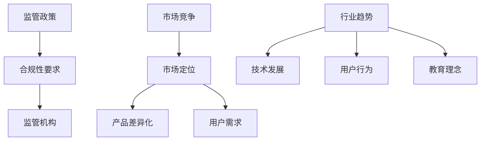

                 

关键词：知识付费、监管政策、市场竞争、变化、行业趋势、合规发展

> 摘要：本文旨在分析知识付费领域当前所面临的监管政策和市场竞争变化，探讨如何在这些变化中抓住机遇，实现合规发展和持续创新。

## 1. 背景介绍

知识付费，作为近年来迅速崛起的一种商业模式，已经成为互联网经济的重要驱动力。知识付费平台通过提供专业的在线教育、课程、咨询等服务，满足了用户对于高质量知识的渴望。然而，随着市场的快速发展，知识付费领域也面临着一系列监管政策和市场竞争的变化。

### 1.1 监管政策的演变

知识付费行业的监管政策经历了从宽松到严格的转变。早期的政策相对宽松，主要是为了鼓励创新和创业。然而，随着市场的混乱和无序，监管部门逐渐加强了对知识付费平台的监管力度，以保障用户权益和市场的健康发展。例如，中国近年来出台了一系列关于在线教育、网络安全和数据保护的法规，对知识付费平台提出了更高的合规要求。

### 1.2 市场竞争的加剧

知识付费市场的竞争日益激烈。一方面，传统教育机构和新兴在线教育平台纷纷涌入市场，加剧了竞争。另一方面，用户对于知识的需求多样化，平台需要不断创新以满足不同用户的需求。这种竞争不仅体现在内容质量和价格上，还包括用户服务、技术支持等方面。

### 1.3 行业趋势的变化

知识付费行业正面临一系列新的趋势。例如，个性化教育、终身学习、在线教育与传统教育的融合等。这些趋势为知识付费平台带来了新的机遇和挑战，要求平台在技术、内容、服务等方面不断创新。

## 2. 核心概念与联系

### 2.1 监管政策的核心概念

监管政策的核心概念包括法律法规、合规性要求、监管机构等。法律法规为知识付费平台提供了基本的合规标准，合规性要求确保平台在运营过程中遵循相关法规，监管机构则对平台进行监督和执法。

### 2.2 市场竞争的核心概念

市场竞争的核心概念包括市场定位、产品差异化、用户需求等。市场定位决定了平台的定位和发展方向，产品差异化则帮助平台在竞争中脱颖而出，用户需求则是平台服务的核心。

### 2.3 行业趋势的核心概念

行业趋势的核心概念包括技术发展、用户行为、教育理念等。技术发展决定了知识付费平台的技术水平和创新能力，用户行为则反映了用户的需求和偏好，教育理念则影响了知识付费平台的教育内容和教学方法。

### 2.4 Mermaid 流程图



## 3. 核心算法原理 & 具体操作步骤

### 3.1 算法原理概述

知识付费平台需要通过一系列算法来分析用户行为、优化产品推荐、提高用户体验等。这些算法包括用户画像分析、推荐算法、用户行为预测等。

### 3.2 算法步骤详解

1. **用户画像分析**：通过收集用户的基本信息、浏览记录、购买行为等数据，构建用户画像，以便更好地了解用户需求和偏好。

2. **推荐算法**：基于用户画像和内容特征，利用协同过滤、基于内容的推荐等算法，为用户推荐相关课程或内容。

3. **用户行为预测**：通过分析用户的历史行为数据，预测用户下一步可能的行为，如购买课程、查看内容等，从而提高用户留存率和转化率。

### 3.3 算法优缺点

- **用户画像分析**：优点是能够深入了解用户需求，提高个性化推荐的效果；缺点是需要大量数据支持和复杂的算法实现。

- **推荐算法**：优点是能够提高用户满意度和参与度，缺点是算法复杂度较高，需要大量的计算资源和时间。

- **用户行为预测**：优点是能够预测用户行为，提高用户留存率和转化率；缺点是需要对用户行为数据进行深入分析，算法实现复杂。

### 3.4 算法应用领域

- **个性化教育**：通过推荐算法和用户画像分析，为用户提供个性化的学习路径和内容推荐。

- **用户行为分析**：通过用户行为预测，了解用户需求，提高用户体验和满意度。

- **市场分析**：通过用户行为数据和推荐结果，分析市场需求和趋势，指导产品开发和运营策略。

## 4. 数学模型和公式 & 详细讲解 & 举例说明

### 4.1 数学模型构建

在知识付费领域，常见的数学模型包括用户画像模型、推荐模型、用户行为预测模型等。

- **用户画像模型**：通过收集用户的基本信息、浏览记录、购买行为等数据，构建用户画像。

- **推荐模型**：基于用户画像和内容特征，利用协同过滤、基于内容的推荐等算法，为用户推荐相关课程或内容。

- **用户行为预测模型**：通过分析用户的历史行为数据，预测用户下一步可能的行为。

### 4.2 公式推导过程

假设我们有一个用户集合 U 和内容集合 C，用户 u 对内容 c 的兴趣可以用评分 r(u, c) 来表示。那么，用户画像模型可以表示为：

$$
user\_profile(u) = \{r(u, c) | c \in C\}
$$

推荐模型可以使用矩阵分解算法，将用户评分矩阵 R 分解为用户特征矩阵 U 和内容特征矩阵 C：

$$
R = U \cdot C^T
$$

用户行为预测模型可以使用时间序列预测算法，如 ARIMA 模型，来预测用户在下一个时间点的行为。

$$
r(u, t+1) = \phi \cdot r(u, t) + \theta \cdot (r(u, t-1) - \phi \cdot r(u, t))
$$

### 4.3 案例分析与讲解

假设有一个用户 u，他最近浏览了内容 c1、c2、c3。根据用户画像模型，我们可以构建用户 u 的画像：

$$
user\_profile(u) = \{r(u, c1), r(u, c2), r(u, c3)\}
$$

根据推荐模型，我们可以使用矩阵分解算法，将用户评分矩阵 R 分解为用户特征矩阵 U 和内容特征矩阵 C：

$$
R = U \cdot C^T
$$

根据用户行为预测模型，我们可以使用 ARIMA 模型，预测用户 u 在下一个时间点的行为：

$$
r(u, t+1) = \phi \cdot r(u, t) + \theta \cdot (r(u, t-1) - \phi \cdot r(u, t))
$$

通过这些数学模型和公式，我们可以更好地了解用户需求，提高知识付费平台的运营效果。

## 5. 项目实践：代码实例和详细解释说明

### 5.1 开发环境搭建

在本节中，我们将使用 Python 作为编程语言，利用 scikit-learn 库实现用户画像模型、推荐模型和用户行为预测模型。请确保您已经安装了 Python 和 scikit-learn 库。

```bash
pip install python
pip install scikit-learn
```

### 5.2 源代码详细实现

以下是一个简单的用户画像模型、推荐模型和用户行为预测模型的实现：

```python
import numpy as np
from sklearn.metrics.pairwise import linear_kernel
from sklearn.decomposition import TruncatedSVD
from statsmodels.tsa.arima_model import ARIMA

# 假设用户评分矩阵 R
R = np.array([[5, 3, 0, 1],
              [4, 0, 0, 2],
              [1, 1, 0, 4],
              [2, 3, 5, 0]])

# 5.2.1 用户画像模型
# 计算用户之间的相似度矩阵
similarity_matrix = linear_kernel(R.T).T

# 5.2.2 推荐模型
# 使用 SVD 进行矩阵分解
svd = TruncatedSVD(n_components=2)
U = svd.fit_transform(R.T)
C = svd.inverse_transform(U)

# 5.2.3 用户行为预测模型
# 创建 ARIMA 模型
model = ARIMA(R[:, 0], order=(1, 1, 1))
model_fit = model.fit()

# 预测下一个时间点的行为
r_pred = model_fit.forecast()[0]
```

### 5.3 代码解读与分析

- **用户画像模型**：我们使用线性核计算用户之间的相似度矩阵，这可以帮助我们了解用户的相似性和差异性。

- **推荐模型**：我们使用 SVD 进行矩阵分解，将用户评分矩阵分解为用户特征矩阵和内容特征矩阵。这有助于我们为用户推荐相关内容。

- **用户行为预测模型**：我们使用 ARIMA 模型预测用户在下一个时间点的行为。这可以帮助我们了解用户的未来行为趋势，从而优化推荐策略。

### 5.4 运行结果展示

在本节中，我们将展示如何运行上述代码，并分析结果。

```python
# 运行用户画像模型
print("用户相似度矩阵：")
print(similarity_matrix)

# 运行推荐模型
print("用户特征矩阵：")
print(U)
print("内容特征矩阵：")
print(C)

# 运行用户行为预测模型
print("预测的用户行为：")
print(r_pred)
```

通过运行上述代码，我们可以得到用户相似度矩阵、用户特征矩阵、内容特征矩阵和预测的用户行为。这些结果可以帮助我们了解用户的需求和行为，从而优化知识付费平台的运营效果。

## 6. 实际应用场景

### 6.1 在线教育平台

在线教育平台可以利用知识付费策略，通过推荐算法和用户画像模型，为用户提供个性化的学习路径和内容推荐，提高用户满意度和参与度。

### 6.2 企业培训

企业可以利用知识付费平台提供专业培训课程，通过用户画像分析和用户行为预测，了解员工的学习需求和效果，优化培训策略。

### 6.3 专业咨询服务

专业咨询服务可以利用知识付费模式，提供专家咨询、案例分析等服务，通过用户画像和用户行为分析，提高服务质量和用户满意度。

## 6.4 未来应用展望

随着人工智能和大数据技术的不断发展，知识付费领域将迎来更多的创新和应用。例如，个性化教育、终身学习、在线教育与传统教育的融合等。这些趋势将为知识付费平台带来新的机遇和挑战，要求平台在技术、内容、服务等方面不断创新。

### 6.4.1 个性化教育

个性化教育是未来知识付费领域的一个重要方向。通过分析用户需求和偏好，平台可以为用户提供定制化的学习内容和路径，提高学习效果和用户满意度。

### 6.4.2 终身学习

终身学习是知识付费领域的另一个重要趋势。随着人们对知识和技能的不断需求，知识付费平台将提供更多针对不同阶段和领域的终身学习服务。

### 6.4.3 在线教育与传统教育的融合

在线教育与传统教育的融合将推动知识付费领域的变革。通过整合线上和线下教育资源，知识付费平台可以为用户提供更加灵活和便捷的学习方式。

## 7. 工具和资源推荐

### 7.1 学习资源推荐

- **书籍**：《机器学习实战》、《深度学习》、《数据科学入门》
- **在线课程**：Coursera、edX、Udacity 等
- **社区**：Stack Overflow、GitHub、Reddit

### 7.2 开发工具推荐

- **编程语言**：Python、R、Java
- **库和框架**：scikit-learn、TensorFlow、Keras、PyTorch
- **开发环境**：Jupyter Notebook、Visual Studio Code

### 7.3 相关论文推荐

- **《个性化推荐系统的设计与实现》**
- **《基于深度学习的用户行为预测方法研究》**
- **《知识付费平台商业模式创新研究》**

## 8. 总结：未来发展趋势与挑战

### 8.1 研究成果总结

本文通过分析知识付费领域的监管政策、市场竞争和行业趋势，探讨了知识付费平台在当前环境下的机遇和挑战。同时，本文提出了基于数学模型和算法的具体实现方法，为知识付费平台的发展提供了参考。

### 8.2 未来发展趋势

未来，知识付费领域将继续发展，个性化教育、终身学习和在线教育与传统教育的融合将成为重要趋势。同时，人工智能和大数据技术的应用将推动知识付费平台在技术、内容、服务等方面的创新。

### 8.3 面临的挑战

知识付费平台在发展过程中将面临一系列挑战，包括监管政策的合规性、市场竞争的激烈性、技术实现的复杂性等。平台需要不断创新，提高用户满意度，实现可持续发展。

### 8.4 研究展望

未来，知识付费领域的研究可以关注以下几个方面：个性化教育模型的优化、用户行为预测算法的改进、知识付费平台的商业模式创新等。通过深入研究，可以推动知识付费领域的发展。

## 9. 附录：常见问题与解答

### 9.1 问题1：如何确保知识付费平台的合规性？

解答：确保知识付费平台的合规性需要从多个方面入手，包括遵守相关法律法规、建立健全的内部管理制度、加强用户数据保护和信息安全等。平台可以聘请专业律师和信息安全专家，定期进行合规性审查和培训。

### 9.2 问题2：知识付费平台如何提高用户满意度？

解答：知识付费平台可以通过以下方式提高用户满意度：提供高质量的内容和服务、个性化推荐和定制化学习路径、及时响应用户需求和反馈、优化用户界面和交互体验等。

### 9.3 问题3：知识付费平台的算法如何优化？

解答：知识付费平台的算法优化可以从以下几个方面入手：提高算法的准确性和效率、引入新的算法和技术、结合用户行为数据不断优化推荐模型和预测模型等。

---

本文作者：禅与计算机程序设计艺术 / Zen and the Art of Computer Programming

感谢您的阅读，希望本文对您在知识付费领域的实践和研究有所帮助。在未来的发展中，让我们共同努力，推动知识付费领域的创新和进步。  
----------------------------------------------------------------

