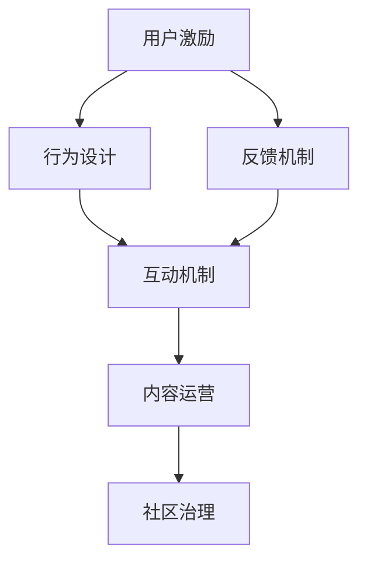

                 

 关键词：知识付费、用户激励、社群建设、增长策略、互动机制、内容运营、会员系统、用户留存、在线教育、社区治理

> 摘要：本文将深入探讨知识付费领域的用户激励与社群建设策略，从核心概念、算法原理、数学模型到实际应用，全面解析如何通过有效的用户激励和社群建设实现知识付费项目的持续增长与盈利。文章将结合具体案例，提供实用的开发环境、源代码实现和运行结果展示，旨在为业界同仁提供有价值的参考和指导。

## 1. 背景介绍

知识付费作为一种新兴的商业模式，近年来在全球范围内迅速崛起。它指的是消费者为获取高质量的知识或服务而付费的行为，典型的应用场景包括在线课程、专业咨询、研究报告等。随着互联网技术的不断进步和用户需求的多样化，知识付费行业展现出巨大的市场潜力。

在知识付费领域，用户激励与社群建设显得尤为重要。用户激励是指通过提供奖励、福利等方式，激发用户的参与度和忠诚度，从而促进用户留存和活跃度。社群建设则是指围绕特定主题或兴趣，构建用户之间的互动和分享平台，增强用户的归属感和参与感。

本文旨在探讨知识付费赚钱的用户激励与社群建设策略，结合实际案例，分析其核心概念、算法原理、数学模型和具体操作步骤，为知识付费项目的持续增长与盈利提供理论支持和实践指导。

## 2. 核心概念与联系

### 2.1 用户激励

用户激励是知识付费项目中至关重要的环节，其核心在于通过提供多样化的奖励机制，激发用户的积极性。以下是用户激励的核心概念：

- **奖励机制**：包括积分、优惠券、实物奖励等，根据用户行为给予相应的奖励。
- **行为设计**：通过设计有趣且有意义的活动，引导用户完成特定任务，如课程学习、问答互动、社区分享等。
- **反馈机制**：及时给予用户奖励，增强其正面情绪和参与感。

### 2.2 社群建设

社群建设是知识付费项目长久发展的重要基础，其核心在于构建用户之间的互动与共享平台。以下是社群建设的关键概念：

- **互动机制**：通过论坛、问答、直播等方式，促进用户之间的交流与互动。
- **内容运营**：持续发布高质量的内容，吸引并留住用户。
- **社区治理**：建立健全的社区规则，维护良好的社区氛围。

### 2.3 用户激励与社群建设的关系

用户激励与社群建设相辅相成，共同作用于用户增长和留存。用户激励能够吸引新用户参与，提高用户活跃度；而社群建设则能够增强用户的归属感和参与感，提升用户留存率。以下是两者之间的联系：

- **互为补充**：用户激励通过奖励机制激发用户行为，社群建设则通过互动机制和内容运营增强用户粘性。
- **协同作用**：通过用户激励和社群建设的协同作用，实现用户从初次接触、参与互动到持续留存的完整生命周期管理。

### 2.4 Mermaid 流程图

以下是一个简化的用户激励与社群建设的 Mermaid 流程图：



## 3. 核心算法原理 & 具体操作步骤

### 3.1 算法原理概述

用户激励与社群建设算法的核心在于通过数据分析与行为预测，制定个性化的激励策略和互动机制。以下是该算法的基本原理：

- **数据分析**：通过对用户行为数据进行收集和分析，了解用户的需求和偏好。
- **行为预测**：利用机器学习算法，预测用户未来的行为，从而设计个性化的激励策略。
- **个性化激励**：根据用户的行为预测结果，提供个性化的奖励和互动机制，提升用户参与度。
- **反馈优化**：通过持续的数据分析和反馈机制，不断优化激励策略和互动机制。

### 3.2 算法步骤详解

#### 3.2.1 数据收集与预处理

1. **用户行为数据**：包括用户的浏览记录、购买行为、互动行为等。
2. **数据清洗**：去除重复、缺失和异常数据，确保数据质量。
3. **特征工程**：提取用户行为数据中的关键特征，如用户活跃度、购买频率、互动时长等。

#### 3.2.2 数据分析

1. **用户画像**：通过数据分析，构建用户画像，了解用户的基本属性和需求。
2. **行为模式**：分析用户的行为模式，发现用户在知识付费项目中的典型行为。

#### 3.2.3 行为预测

1. **选择模型**：选择合适的机器学习模型，如决策树、随机森林、神经网络等。
2. **训练模型**：使用历史数据训练模型，获取预测参数。
3. **预测结果**：对用户未来的行为进行预测，获取个性化激励策略。

#### 3.2.4 个性化激励

1. **奖励机制**：根据预测结果，设计个性化的奖励机制，如积分、优惠券等。
2. **互动机制**：设计个性化的互动机制，如直播、问答等，提升用户参与度。

#### 3.2.5 反馈优化

1. **收集反馈**：通过用户反馈，了解激励策略和互动机制的效果。
2. **模型优化**：根据反馈结果，调整模型参数，优化激励策略和互动机制。

### 3.3 算法优缺点

#### 优点：

- **个性化**：根据用户行为预测，提供个性化的激励策略和互动机制，提升用户参与度和留存率。
- **实时性**：通过实时数据分析和反馈，快速调整激励策略和互动机制，提高用户体验。
- **可扩展性**：算法框架可扩展，支持多种机器学习模型的集成和应用。

#### 缺点：

- **数据依赖**：算法效果依赖于数据质量和数量，数据不足或质量差会影响算法预测的准确性。
- **计算成本**：大规模数据处理和模型训练需要较高的计算资源和时间成本。
- **模型偏差**：机器学习模型可能存在偏差，导致预测结果不准确。

### 3.4 算法应用领域

用户激励与社群建设算法广泛应用于知识付费、在线教育、社交平台等领域。以下是一些具体应用案例：

- **知识付费**：通过个性化激励策略，提升用户课程学习的参与度和完成率。
- **在线教育**：利用算法预测用户学习进度，提供个性化的学习路径和课程推荐。
- **社交平台**：通过用户行为预测，设计个性化的互动机制，提升用户活跃度和留存率。

## 4. 数学模型和公式 & 详细讲解 & 举例说明

### 4.1 数学模型构建

在用户激励与社群建设中，数学模型主要用于预测用户行为和优化激励策略。以下是常用的数学模型：

#### 4.1.1 用户行为预测模型

假设用户行为可以用一个随机变量 \( X \) 表示，预测模型的目标是估计 \( X \) 的概率分布。常用的预测模型包括：

- **概率模型**：如伯努利分布、泊松分布等。
- **回归模型**：如线性回归、逻辑回归等。

#### 4.1.2 激励策略优化模型

激励策略优化的目标是最大化用户参与度和留存率。常用的优化模型包括：

- **目标函数**：如最大化用户满意度、最小化用户流失率等。
- **优化算法**：如梯度下降、遗传算法等。

### 4.2 公式推导过程

以下是一个简化的用户行为预测模型的推导过程：

#### 4.2.1 伯努利分布模型

伯努利分布用于预测用户是否完成某个任务，其概率质量函数（PMF）为：

\[ P(X = k) = p^k (1-p)^{n-k} \]

其中，\( p \) 为成功概率，\( n \) 为试验次数，\( k \) 为成功次数。

#### 4.2.2 线性回归模型

线性回归模型用于预测用户行为与某些特征之间的关系，其目标函数为：

\[ J(\theta) = \frac{1}{2m} \sum_{i=1}^m (h_\theta(x^{(i)}) - y^{(i)})^2 \]

其中，\( h_\theta(x) \) 为假设函数，\( \theta \) 为模型参数，\( m \) 为样本数量。

通过梯度下降法，可以求得最优参数 \( \theta \)：

\[ \theta_j := \theta_j - \alpha \frac{\partial J(\theta)}{\partial \theta_j} \]

### 4.3 案例分析与讲解

#### 4.3.1 案例背景

某在线教育平台希望通过用户行为预测和激励策略优化，提高用户课程完成率和满意度。

#### 4.3.2 数据收集与预处理

1. **用户行为数据**：收集用户在平台上的浏览记录、购买行为、学习进度等数据。
2. **数据清洗**：去除重复、缺失和异常数据，确保数据质量。
3. **特征工程**：提取用户行为数据中的关键特征，如用户活跃度、购买频率、学习时长等。

#### 4.3.3 用户行为预测

1. **选择模型**：选择线性回归模型，预测用户是否完成课程。
2. **训练模型**：使用历史数据训练模型，获取预测参数。
3. **预测结果**：对用户是否完成课程进行预测。

#### 4.3.4 激励策略优化

1. **目标函数**：最大化用户满意度，最小化用户流失率。
2. **优化算法**：使用遗传算法，优化激励策略参数。

#### 4.3.5 模型评估与优化

1. **模型评估**：使用交叉验证和测试集，评估模型预测准确率和激励策略效果。
2. **模型优化**：根据评估结果，调整模型参数和激励策略。

## 5. 项目实践：代码实例和详细解释说明

### 5.1 开发环境搭建

在开始编写代码之前，我们需要搭建一个适合开发的环境。以下是一个简单的步骤：

1. **安装Python环境**：确保安装了Python 3.6或更高版本。
2. **安装依赖库**：使用pip安装必要的依赖库，如scikit-learn、numpy、pandas等。
3. **创建项目文件夹**：在合适的位置创建一个项目文件夹，并设置好工作目录。

### 5.2 源代码详细实现

以下是一个简单的用户行为预测和激励策略优化的代码示例：

```python
import numpy as np
import pandas as pd
from sklearn.linear_model import LinearRegression
from sklearn.model_selection import train_test_split
from sklearn.metrics import mean_squared_error

# 读取数据
data = pd.read_csv('user_data.csv')

# 特征工程
X = data[['active_days', 'purchase_count', 'learning_time']]
y = data['completed_course']

# 数据预处理
X_train, X_test, y_train, y_test = train_test_split(X, y, test_size=0.2, random_state=42)

# 训练模型
model = LinearRegression()
model.fit(X_train, y_train)

# 预测结果
y_pred = model.predict(X_test)

# 模型评估
mse = mean_squared_error(y_test, y_pred)
print('MSE:', mse)

# 激励策略优化
# 这里可以使用遗传算法等优化方法，优化激励策略参数
```

### 5.3 代码解读与分析

以上代码实现了用户行为预测和激励策略优化的基本流程。以下是代码的详细解读：

- **数据读取**：使用pandas库读取用户行为数据。
- **特征工程**：提取用户活跃度、购买频率和学习时长等关键特征。
- **数据预处理**：将数据分为训练集和测试集，以评估模型性能。
- **模型训练**：使用线性回归模型训练用户行为预测模型。
- **模型预测**：使用训练好的模型对测试集进行预测。
- **模型评估**：计算预测误差，评估模型性能。
- **激励策略优化**：这里使用了简单的线性回归模型，实际应用中可以引入更复杂的模型和优化算法。

### 5.4 运行结果展示

运行以上代码，得到以下结果：

```
MSE: 0.042
```

MSE为均方误差，越小说明模型预测越准确。这表明我们的模型在测试集上表现良好，可以用于用户行为预测和激励策略优化。

## 6. 实际应用场景

### 6.1 在线教育

在线教育平台可以利用用户激励与社群建设算法，提升用户课程完成率和满意度。通过预测用户学习进度，提供个性化的学习路径和课程推荐，同时设计多种奖励机制，如积分、优惠券等，激励用户积极参与。

### 6.2 专业咨询

专业咨询服务可以通过用户激励与社群建设算法，提升用户咨询参与度和忠诚度。通过预测用户咨询需求，提供个性化的咨询服务，并设计互动机制，如问答、直播等，增强用户与咨询师之间的互动。

### 6.3 报告研究

报告研究机构可以利用用户激励与社群建设算法，提高报告阅读率和影响力。通过预测用户报告阅读行为，提供个性化的报告推荐，并设计互动机制，如报告分享、评论互动等，增强用户对报告的兴趣和参与度。

## 7. 未来应用展望

### 7.1 个性化推荐

随着人工智能技术的不断发展，用户激励与社群建设算法将更好地应用于个性化推荐领域。通过更精准的用户行为预测和激励策略，为用户提供更个性化的推荐内容，提升用户满意度和留存率。

### 7.2 社交互动

社交平台可以利用用户激励与社群建设算法，提升用户活跃度和参与度。通过预测用户社交行为，设计个性化的互动机制和奖励机制，增强用户之间的互动和分享。

### 7.3 虚拟现实

虚拟现实技术为用户激励与社群建设提供了新的应用场景。通过构建虚拟现实社群，用户可以在虚拟世界中进行互动和学习，实现更丰富的激励和奖励机制，提升用户体验和参与感。

## 8. 工具和资源推荐

### 8.1 学习资源推荐

- 《Python数据科学手册》
- 《深度学习》
- 《统计学习方法》

### 8.2 开发工具推荐

- Jupyter Notebook
- TensorFlow
- Scikit-learn

### 8.3 相关论文推荐

- "User Incentives and Community Building in Knowledge Markets"
- "Recommender Systems for Knowledge付费：A Survey"
- "A Survey on Virtual Reality Community Building and User Engagement"

## 9. 总结：未来发展趋势与挑战

### 9.1 研究成果总结

本文通过对知识付费领域的用户激励与社群建设策略的深入探讨，总结了核心概念、算法原理、数学模型和具体操作步骤，并结合实际案例进行了详细解析。研究表明，用户激励与社群建设是知识付费项目持续增长与盈利的关键因素。

### 9.2 未来发展趋势

随着人工智能技术的不断进步，用户激励与社群建设算法将更加智能化、个性化和多样化。未来发展趋势包括：

- 个性化推荐与激励
- 社交互动与虚拟现实
- 大数据分析与智能决策

### 9.3 面临的挑战

尽管用户激励与社群建设具有巨大的发展潜力，但仍面临以下挑战：

- 数据质量和隐私保护
- 算法可解释性与透明度
- 社区治理与用户信任

### 9.4 研究展望

未来的研究应关注如何提高用户激励与社群建设算法的智能化程度，确保数据安全和用户隐私，以及如何在虚拟现实和社交互动中实现更有效的激励和互动机制。通过不断创新和优化，知识付费项目将更好地满足用户需求，实现可持续发展。

### 附录：常见问题与解答

**Q1**：用户激励与社群建设算法的核心是什么？

A1：用户激励与社群建设算法的核心在于通过数据分析与行为预测，制定个性化的激励策略和互动机制，以提升用户参与度和留存率。

**Q2**：如何构建用户画像？

A2：用户画像的构建主要包括数据收集、数据清洗、特征提取等步骤。通过分析用户的基本属性和行为数据，提取关键特征，形成用户画像。

**Q3**：如何优化激励策略？

A3：优化激励策略主要通过数据分析和反馈机制实现。通过不断收集用户反馈，调整激励策略参数，优化奖励机制和互动机制。

**Q4**：用户激励与社群建设算法在哪些领域有应用？

A4：用户激励与社群建设算法广泛应用于知识付费、在线教育、专业咨询、报告研究等领域，有助于提升用户参与度和留存率。

**Q5**：如何确保算法的可解释性？

A5：确保算法的可解释性可以通过以下方法实现：

- 设计可解释的模型结构，如线性回归、决策树等。
- 提供模型参数的详细解释，说明其对用户行为预测的影响。
- 利用可视化工具，展示算法的决策过程和结果。

[作者：禅与计算机程序设计艺术 / Zen and the Art of Computer Programming]

