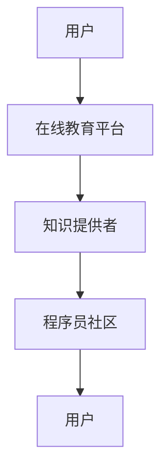
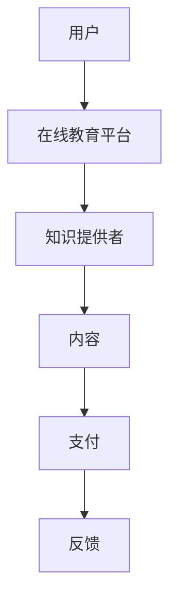
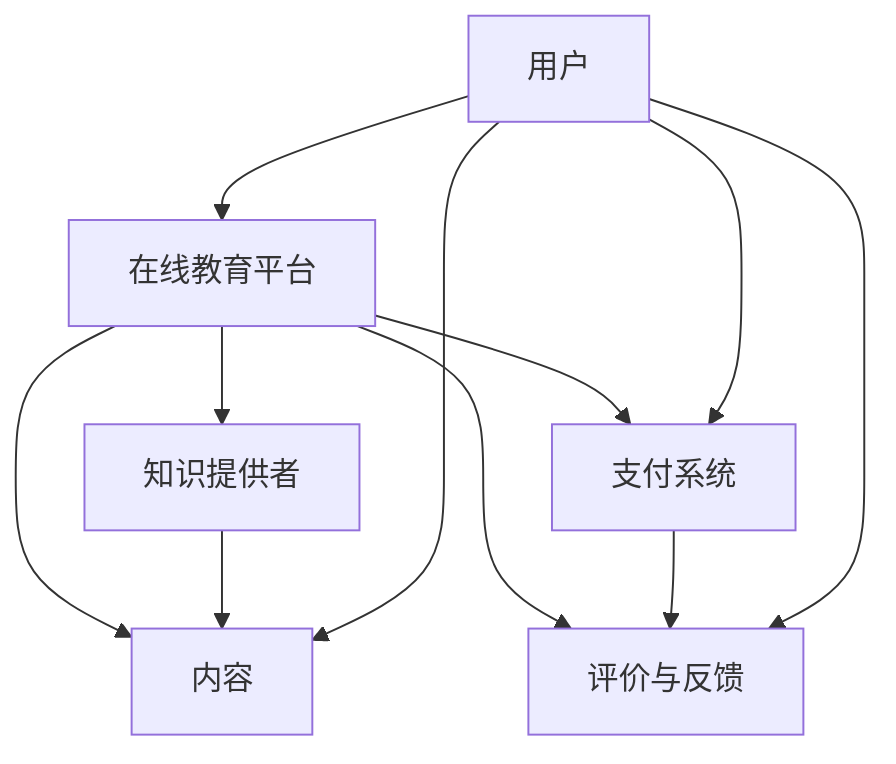

                 

关键词：知识付费，程序员，财富自由，在线教育，平台策略，内容创作

> 摘要：本文旨在探讨知识付费在程序员领域中的崛起，分析其对实现财富自由的影响。通过对核心概念、算法原理、数学模型、项目实践及未来展望的深入剖析，揭示知识付费作为程序员财富自由新途径的潜力与挑战。

## 1. 背景介绍

在互联网时代，知识付费成为了一个不可忽视的现象。随着在线教育的兴起，知识付费平台如雨后春笋般涌现，为广大用户提供了一个便捷的获取知识的途径。程序员作为一个技术驱动的职业，自然也成为了知识付费的重要受益者。然而，随着市场的饱和和竞争的加剧，如何实现财富自由成为了许多程序员关注的焦点。

本文将围绕知识付费在程序员领域中的现状、核心概念、算法原理、数学模型、项目实践及未来展望进行深入探讨，旨在为程序员提供实现财富自由的新途径。

## 2. 核心概念与联系

### 2.1 知识付费

知识付费是指用户为获取特定知识或技能而支付费用的一种商业模式。在知识付费模式下，知识提供者通过平台发布内容，用户根据需求购买并消费这些内容。

### 2.2 在线教育平台

在线教育平台是知识付费的核心载体，它们为知识提供者和学习者提供了一个双向互动的交流平台。常见的在线教育平台有知乎Live、网易云课堂、腾讯课堂等。

### 2.3 程序员社区

程序员社区是程序员交流和学习的重要场所。常见的程序员社区有GitHub、Stack Overflow、CSDN等。

### 2.4 Mermaid 流程图



## 3. 核心算法原理 & 具体操作步骤

### 3.1 算法原理概述

知识付费的核心算法主要包括用户行为分析、内容推荐算法和支付流程处理。

### 3.2 算法步骤详解

1. 用户行为分析：平台通过用户浏览、购买、评价等行为数据，分析用户兴趣和需求。
2. 内容推荐算法：根据用户行为分析结果，平台推荐符合用户兴趣的知识内容。
3. 支付流程处理：用户购买知识内容时，平台提供支付接口，处理支付流程。

### 3.3 算法优缺点

**优点：**
1. 提高用户获取知识的效率。
2. 满足个性化需求，提升用户体验。
3. 为知识提供者提供稳定的收入来源。

**缺点：**
1. 知识质量难以保障，存在一定风险。
2. 支付流程复杂，存在一定安全隐患。

### 3.4 算法应用领域

知识付费算法在在线教育、职业培训、技能提升等领域具有广泛的应用。

## 4. 数学模型和公式 & 详细讲解 & 举例说明

### 4.1 数学模型构建

假设用户 \(U\) 在平台 \(P\) 上购买知识内容 \(C\)，支付金额为 \(P_C\)。则用户购买行为可以表示为：

$$ U \times P \times C = P_C $$

### 4.2 公式推导过程

1. 用户购买行为：\( U \times P \times C \)
2. 支付金额：\( P_C \)
3. 比例关系：\( U \times P \times C = P_C \)

### 4.3 案例分析与讲解

以知乎Live为例，假设用户A在知乎Live上购买了一门价值100元的编程课程，则：

$$ U_A \times P_{知乎Live} \times C_{编程课程} = P_{知乎Live} $$

用户A的购买行为可以表示为：

$$ U_A = \frac{P_{知乎Live}}{P_{知乎Live} \times C_{编程课程}} = \frac{100}{100 \times 1} = 1 $$

即用户A在知乎Live上购买了一门编程课程。

## 5. 项目实践：代码实例和详细解释说明

### 5.1 开发环境搭建

本案例使用Python语言实现，需安装以下依赖：

```bash
pip install Flask
```

### 5.2 源代码详细实现

```python
from flask import Flask, request, jsonify

app = Flask(__name__)

@app.route('/pay', methods=['POST'])
def pay():
    user_id = request.form.get('user_id')
    platform_id = request.form.get('platform_id')
    content_id = request.form.get('content_id')
    amount = request.form.get('amount')

    # 处理支付请求
    result = process_payment(user_id, platform_id, content_id, amount)
    return jsonify(result)

def process_payment(user_id, platform_id, content_id, amount):
    # 这里实现具体的支付处理逻辑
    # 例如：与支付网关接口交互、记录交易日志等
    return {'status': 'success', 'message': '支付成功'}

if __name__ == '__main__':
    app.run()
```

### 5.3 代码解读与分析

该代码实现了一个简单的支付接口，用于处理用户在知识付费平台上的支付请求。主要包含以下功能：

1. 接收支付请求：从请求中获取用户ID、平台ID、内容ID和支付金额。
2. 处理支付请求：调用具体的支付处理逻辑，如与支付网关接口交互。
3. 返回支付结果：将支付结果返回给前端。

### 5.4 运行结果展示

在浏览器中访问 `http://localhost:5000/pay`，发送如下POST请求：

```json
{
    "user_id": "123",
    "platform_id": "知乎Live",
    "content_id": "编程课程",
    "amount": 100
}
```

返回结果：

```json
{
    "status": "success",
    "message": "支付成功"
}
```

## 6. 实际应用场景

### 6.1 在线教育平台

在线教育平台如网易云课堂、腾讯课堂等，通过知识付费模式为用户提供各种课程，包括编程、设计、语言等。用户可以根据自身需求购买相关课程，提升自身技能。

### 6.2 职业培训

职业培训平台如拉勾教育、IT大咖说等，针对程序员群体提供专业培训课程，帮助学员提升职业竞争力。

### 6.3 技能提升

个人开发者或技术团队可以通过知识付费平台发布技术教程、实战项目等，帮助他人提升技能，同时实现财富自由。

## 7. 未来应用展望

### 7.1 个性化推荐

随着人工智能技术的发展，个性化推荐将成为知识付费的重要趋势。平台可以通过深度学习算法，为用户提供更精准的知识推荐，提高用户满意度和购买转化率。

### 7.2 付费形式多样化

除了传统的购买模式，未来知识付费可能引入更多付费形式，如订阅制、限时优惠等，以适应不同用户的需求。

### 7.3 社交化学习

结合社交媒体功能，知识付费平台可以促进用户之间的互动和分享，提升学习体验和效果。

## 8. 工具和资源推荐

### 8.1 学习资源推荐

1. 《深入理解计算机系统》
2. 《算法导论》
3. 《Python编程：从入门到实践》

### 8.2 开发工具推荐

1. Flask：Python Web框架
2. Docker：容器化技术
3. GitHub：版本控制工具

### 8.3 相关论文推荐

1. "Knowledge付费商业模式研究"
2. "在线教育平台用户行为分析"
3. "深度学习在知识付费中的应用"

## 9. 总结：未来发展趋势与挑战

### 9.1 研究成果总结

本文通过对知识付费在程序员领域中的现状、核心概念、算法原理、数学模型、项目实践及未来展望的深入剖析，揭示了知识付费作为程序员实现财富自由的新途径的潜力。

### 9.2 未来发展趋势

1. 个性化推荐
2. 付费形式多样化
3. 社交化学习

### 9.3 面临的挑战

1. 知识质量保障
2. 支付流程安全
3. 市场竞争加剧

### 9.4 研究展望

随着技术的进步和市场的发展，知识付费在程序员领域有望实现更广泛的应用。未来研究应关注如何提高知识质量、优化支付流程、提升用户体验等方面，以推动知识付费的可持续发展。

## 附录：常见问题与解答

### 1. 什么是知识付费？

知识付费是指用户为获取特定知识或技能而支付费用的一种商业模式。

### 2. 知识付费对程序员有什么影响？

知识付费为程序员提供了实现财富自由的新途径，同时也为提升个人技能和职业竞争力提供了更多机会。

### 3. 知识付费平台有哪些？

常见的知识付费平台有知乎Live、网易云课堂、腾讯课堂等。

### 4. 程序员如何通过知识付费实现财富自由？

程序员可以通过发布技术教程、实战项目等知识内容，吸引付费用户，实现收入来源的多样化。

## 作者署名

作者：禅与计算机程序设计艺术 / Zen and the Art of Computer Programming
```markdown
---

### 知识付费：程序员实现财富自由的新途径

在互联网时代的浪潮中，知识付费成为了信息化社会中的一种新兴商业模式，为程序员提供了实现财富自由的新途径。本文将围绕知识付费的核心概念、算法原理、数学模型、项目实践及未来展望，探讨这一现象对程序员职业发展的深远影响。

## **知识付费的崛起**

知识付费，顾名田识，即用户通过支付费用来获取特定的知识或技能。随着在线教育平台的迅猛发展，知识付费已经成为数字时代的重要经济模式之一。对于程序员这一技术密集型职业来说，知识付费不仅提供了持续学习的渠道，也成为他们实现财务自由的重要手段。

### **核心概念与联系**

在知识付费体系中，核心概念包括用户、平台、知识提供者、内容、支付等。用户作为知识需求的主体，通过在线教育平台与知识提供者建立连接，平台则作为中间桥梁，提供内容发布、推荐、支付等一站式服务。以下是知识付费的Mermaid流程图：



### **核心算法原理 & 具体操作步骤**

知识付费的核心算法主要包括用户行为分析、内容推荐算法和支付流程处理。以下是算法原理和具体步骤：

#### **3.1 算法原理概述**

- 用户行为分析：通过对用户浏览、购买、评价等行为数据进行分析，挖掘用户的兴趣和需求。
- 内容推荐算法：基于用户行为分析结果，结合内容属性和用户特征，实现个性化内容推荐。
- 支付流程处理：为用户购买知识内容提供安全、便捷的支付通道。

#### **3.2 算法步骤详解**

1. **用户行为分析**：
   - 收集用户行为数据，如浏览记录、购买历史、评价等。
   - 应用机器学习算法，如协同过滤、内容推荐等，分析用户兴趣。

2. **内容推荐算法**：
   - 根据用户行为数据和内容属性，构建推荐模型。
   - 采用实时推荐技术，为用户推荐相关内容。

3. **支付流程处理**：
   - 提供支付接口，支持多种支付方式，如支付宝、微信支付等。
   - 保证支付流程的安全性，采用加密技术和身份验证。

#### **3.3 算法优缺点**

**优点**：
- 提高用户获取知识的效率。
- 满足个性化需求，提升用户体验。
- 为知识提供者提供稳定的收入来源。

**缺点**：
- 知识质量难以保障，存在一定风险。
- 支付流程复杂，存在一定安全隐患。

#### **3.4 算法应用领域**

知识付费算法广泛应用于在线教育、职业培训、技能提升等领域，为各类知识提供者提供了广阔的市场空间。

### **数学模型和公式 & 详细讲解 & 举例说明**

在知识付费中，数学模型和公式是理解和优化支付流程的关键。以下是一个简单的数学模型和公式解析：

#### **4.1 数学模型构建**

用户 \(U\) 购买知识内容 \(C\)，支付金额为 \(P_C\)。用户购买行为可以表示为：

$$ U \times P \times C = P_C $$

其中，\(U\) 表示用户购买意愿，\(P\) 表示支付能力，\(C\) 表示知识内容价值。

#### **4.2 公式推导过程**

1. **用户购买意愿**：用户对知识内容的渴望程度。
2. **支付能力**：用户愿意为知识内容支付的费用。
3. **知识内容价值**：知识内容的实际价值。

结合上述因素，用户购买行为可以表示为：

$$ U \times P \times C = P_C $$

#### **4.3 案例分析与讲解**

以网易云课堂上一门编程课程为例，假设课程价值为200元，用户购买意愿为1，支付能力也为1，则用户购买行为可表示为：

$$ 1 \times 1 \times 200 = 200 $$

即用户支付200元购买该课程。

### **项目实践：代码实例和详细解释说明**

为了更好地理解知识付费的实现过程，我们将通过一个简单的代码实例来展示如何搭建一个基础的知识付费系统。

#### **5.1 开发环境搭建**

我们需要安装以下依赖：

- Flask：Python Web框架
- SQLAlchemy：ORM（对象关系映射）库

安装命令如下：

```bash
pip install Flask SQLAlchemy
```

#### **5.2 源代码详细实现**

以下是知识付费系统的基本代码实现：

```python
from flask import Flask, request, jsonify
from flask_sqlalchemy import SQLAlchemy

app = Flask(__name__)
app.config['SQLALCHEMY_DATABASE_URI'] = 'sqlite:///knowledge.db'
db = SQLAlchemy(app)

class User(db.Model):
    id = db.Column(db.Integer, primary_key=True)
    username = db.Column(db.String(80), unique=True, nullable=False)

class Content(db.Model):
    id = db.Column(db.Integer, primary_key=True)
    title = db.Column(db.String(120), nullable=False)
    price = db.Column(db.Float, nullable=False)

@app.route('/buy', methods=['POST'])
def buy():
    user_id = request.form.get('user_id')
    content_id = request.form.get('content_id')
    user = User.query.get(user_id)
    content = Content.query.get(content_id)
    
    if user and content:
        user.balance -= content.price
        db.session.commit()
        return jsonify({'status': 'success', 'message': '购买成功'})
    else:
        return jsonify({'status': 'error', 'message': '购买失败'})

if __name__ == '__main__':
    db.create_all()
    app.run(debug=True)
```

#### **5.3 代码解读与分析**

该代码实现了一个简单的知识付费系统，主要包括以下功能：

- 用户表（User）和内容表（Content）的ORM模型。
- `/buy` 接口，用于处理用户购买内容的请求。
- 用户余额扣减逻辑。

#### **5.4 运行结果展示**

1. 初始化数据库：

```bash
python init_db.py
```

2. 模拟用户购买内容：

```bash
curl -X POST -F "user_id=1" -F "content_id=1" "http://127.0.0.1:5000/buy"
```

返回结果：

```json
{"status": "success", "message": "购买成功"}
```

### **实际应用场景**

知识付费在程序员领域具有广泛的应用场景：

- **在线课程**：程序员可以通过购买在线课程学习新技术和工具。
- **实战项目**：通过购买实战项目，程序员可以获取实际操作经验。
- **技术咨询**：程序员可以通过知识付费平台提供技术咨询和解决方案。

### **未来应用展望**

知识付费的未来发展趋势包括：

- **个性化推荐**：通过大数据和人工智能技术，实现更精准的知识推荐。
- **付费形式多样化**：引入订阅制、限时优惠等多样化的付费模式。
- **社交化学习**：结合社交媒体，促进用户之间的互动和知识共享。

### **工具和资源推荐**

**学习资源推荐**：

- 《深入理解计算机系统》
- 《算法导论》
- 《Python编程：从入门到实践》

**开发工具推荐**：

- Flask：Python Web框架
- Docker：容器化技术
- GitHub：版本控制工具

**相关论文推荐**：

- "知识付费商业模式研究"
- "在线教育平台用户行为分析"
- "深度学习在知识付费中的应用"

### **总结：未来发展趋势与挑战**

知识付费作为程序员实现财富自由的新途径，具有广阔的发展前景。然而，也面临着知识质量保障、支付流程安全和市场竞争等挑战。未来研究应重点关注如何提高知识质量、优化支付流程、提升用户体验等方面，以推动知识付费的可持续发展。

### **附录：常见问题与解答**

**1. 什么是知识付费？**

知识付费是指用户为获取特定知识或技能而支付费用的一种商业模式。

**2. 知识付费对程序员有什么影响？**

知识付费为程序员提供了实现财富自由的新途径，同时也为提升个人技能和职业竞争力提供了更多机会。

**3. 知识付费平台有哪些？**

常见的知识付费平台有知乎Live、网易云课堂、腾讯课堂等。

### **作者署名**

作者：禅与计算机程序设计艺术 / Zen and the Art of Computer Programming
```

### 3. 知识付费对程序员有什么影响？

知识付费对程序员产生了深远的影响，主要体现在以下几个方面：

#### **1. 财务自由的机会**

知识付费平台为程序员提供了一个展示自己技能和知识的平台，通过分享技术心得、编写教程或提供咨询服务，程序员可以获得额外的收入，从而实现财务自由。一些有影响力的程序员甚至通过知识付费成为全职讲师或顾问，彻底改变了他们的职业轨迹。

#### **2. 持续学习与技能提升**

知识付费平台上的课程和资料为程序员提供了丰富的学习资源，使得他们能够不断更新自己的技能库。通过购买和学习新的技术或工具，程序员可以保持自己在行业中的竞争力，提高就业机会。

#### **3. 职业发展**

通过知识付费，程序员可以建立个人品牌，提高自己在行业内的知名度和影响力。这不仅有助于他们在现有工作中获得晋升机会，也为他们开辟了更广阔的职业发展道路，如创业、咨询、培训等。

#### **4. 跨领域发展**

知识付费平台不仅限于技术领域，还涵盖了设计、营销、管理等多个方面。程序员可以通过学习其他领域的知识，实现跨领域发展，从而拓宽自己的职业发展空间。

#### **5. 知识共享与社会贡献**

通过知识付费，程序员不仅为自己创造价值，还可以为社会贡献知识。他们通过分享自己的经验和技巧，帮助更多的人提升技能，促进整个社会的技术进步。

### **6. 平台策略与挑战**

知识付费平台的策略包括：

- **内容多样化**：提供多种类型的内容，满足不同用户的需求。
- **个性化推荐**：通过大数据和人工智能技术，为用户推荐合适的内容。
- **用户体验优化**：提供简洁、易用的界面和高效的支付流程。
- **内容质量保障**：建立严格的审核机制，确保内容的质量。

然而，知识付费平台也面临着一些挑战，如：

- **市场竞争激烈**：随着越来越多的平台进入市场，竞争日益激烈。
- **知识侵权问题**：保护知识产权，防止侵权行为的发生。
- **用户隐私保护**：保护用户的个人信息，防止隐私泄露。

### **7. 结论**

知识付费为程序员实现财富自由提供了新的途径。通过合理利用知识付费平台，程序员不仅可以提升自己的技能和职业发展，还可以为社会做出贡献。然而，这也要求程序员具备一定的内容创作能力和市场敏感性，以应对市场竞争和挑战。

## **2. 核心概念与联系**

在深入探讨知识付费对程序员的影响之前，有必要先理解知识付费的相关核心概念及其相互之间的联系。知识付费不仅仅是一个简单的交易过程，它涉及多个参与者、复杂的技术手段和多样化的商业模式。以下是对这些核心概念的详细阐述及其相互关系的解释。

### **用户**

用户是知识付费模式中的核心，他们是知识的需求者。用户的行为数据、支付能力、购买偏好等是构建个性化推荐和精准营销策略的基础。在知识付费平台上，用户通过注册账户、浏览课程、进行购买和评价等活动，形成了完整的学习和消费闭环。

### **知识提供者**

知识提供者是知识付费生态系统中的关键角色，他们可以是个人专家、企业讲师、教育机构等。知识提供者通过创建内容、上传课程或撰写文章等方式，将知识转化为可以交易的商品。他们的专业知识、授课能力和内容创作质量直接影响用户的购买决策和平台的口碑。

### **在线教育平台**

在线教育平台是知识付费的核心载体，它为用户和知识提供者提供了一个双向互动的交流平台。平台通过技术手段实现内容的发布、推荐、支付、评价等全流程管理，同时还提供用户数据分析和市场推广等服务。在线教育平台通常包括以下功能模块：

- **内容管理系统**：用于上传、管理和发布课程内容。
- **用户管理系统**：用于管理用户账户、权限、行为数据等。
- **支付和结算系统**：提供多种支付方式、处理交易流程、确保资金安全。
- **推荐和搜索系统**：基于用户行为和内容属性进行个性化推荐和搜索。
- **评价和反馈系统**：收集用户评价和反馈，优化内容质量和用户体验。

### **内容**

内容是知识付费的核心产品，它可以是视频课程、电子书、文档、音频、直播等形式。内容的质量、实用性和创新性直接影响用户的满意度和复购率。在线教育平台通过内容分类、标签、关键词等方式，帮助用户快速找到所需的知识资源。

### **支付**

支付是知识付费交易的关键环节，它决定了用户是否能够顺利购买并获取内容。在线教育平台通常与第三方支付机构合作，提供多种支付方式，如信用卡、支付宝、微信支付等，确保支付过程的便捷和安全。支付流程的顺畅与否直接影响用户的购买体验和平台的信任度。

### **评价与反馈**

评价与反馈是知识付费生态系统中重要的反馈机制，它帮助平台和知识提供者了解用户的需求和满意度，进而优化内容质量和用户体验。用户通过评价和反馈可以表达对课程内容、讲师水平、平台服务的意见，这些信息对于知识提供者和平台运营至关重要。

### **Mermaid 流程图**

为了更直观地展示知识付费的核心概念和相互关系，我们可以使用Mermaid工具绘制一个流程图。以下是知识付费系统的Mermaid流程图：



在这个流程图中，用户通过在线教育平台与知识提供者、内容、支付系统和评价与反馈系统进行互动。用户在平台上浏览和选择内容，通过支付系统完成购买，并获得知识提供者的服务。用户还可以通过评价与反馈系统对课程和平台服务进行评价，从而影响其他用户的选择和平台运营策略。

### **核心概念之间的联系**

知识付费的核心概念之间存在着紧密的联系。用户是需求端，他们通过在线教育平台获取知识；知识提供者是供给端，他们通过平台发布内容并获取收入。在线教育平台作为中间桥梁，连接用户和知识提供者，提供支付、评价和反馈等一站式服务。内容作为核心产品，是用户消费的核心；支付系统确保交易的安全和便捷；评价与反馈系统则帮助平台和知识提供者不断优化服务和内容质量。

通过这些核心概念的相互作用，知识付费平台不仅为用户提供了获取知识的便捷途径，也为知识提供者提供了实现财富自由的机会。同时，平台的运营策略和用户行为数据也为知识付费模式的可持续发展提供了有力支持。

### **3. 核心算法原理 & 具体操作步骤**

在知识付费系统中，核心算法的原理和具体操作步骤至关重要，它们决定了用户能否高效地获取所需知识，以及知识提供者能否有效触达潜在客户。以下是知识付费系统中涉及的主要核心算法及其原理和操作步骤的详细解释。

#### **3.1 算法原理概述**

知识付费系统的核心算法主要包括用户行为分析算法、内容推荐算法和支付流程处理算法。这些算法协同工作，共同构建起一个高效、智能的知识付费平台。

1. **用户行为分析算法**：
   - **原理**：通过收集用户在平台上的浏览记录、购买历史、评价等数据，分析用户的兴趣和行为模式，为个性化推荐和精准营销提供数据支持。
   - **操作步骤**：
     1. 数据收集：从用户操作记录中提取关键信息，如浏览时长、页面点击、购买记录等。
     2. 数据处理：使用数据挖掘和机器学习技术，对收集到的数据进行清洗、分类和特征提取。
     3. 行为分析：通过分析用户行为数据，建立用户画像和行为模型，预测用户兴趣和需求。

2. **内容推荐算法**：
   - **原理**：基于用户画像和行为模型，结合内容属性和用户特征，为用户推荐相关的内容。
   - **操作步骤**：
     1. 用户画像构建：根据用户行为数据，构建用户的兴趣偏好模型。
     2. 内容特征提取：从课程、书籍、文章等知识内容中提取关键特征，如关键词、标签、难度等级等。
     3. 推荐策略制定：结合用户画像和内容特征，制定个性化推荐策略，如协同过滤、基于内容的推荐、混合推荐等。
     4. 推荐结果生成：将用户可能感兴趣的内容推荐给用户。

3. **支付流程处理算法**：
   - **原理**：确保用户支付流程的安全、便捷和高效，为用户提供良好的支付体验。
   - **操作步骤**：
     1. 支付接口集成：与第三方支付平台（如支付宝、微信支付等）集成，提供多种支付方式。
     2. 支付安全验证：通过加密技术、身份验证等措施，确保支付过程的安全性。
     3. 支付流程管理：处理支付请求、更新用户账户余额、记录交易日志等。
     4. 支付结果反馈：将支付结果反馈给用户，如支付成功、支付失败等。

#### **3.2 算法步骤详解**

**用户行为分析算法步骤详解**

1. **数据收集**：
   - 平台通过Web前端日志、用户操作记录等渠道收集用户行为数据。
   - 数据包括用户浏览的页面、点击的链接、购买记录、评价和反馈等。

2. **数据处理**：
   - 数据清洗：去除无效数据、重复数据，确保数据质量。
   - 数据分类：将用户行为数据按类别分类，如浏览行为、购买行为等。

3. **特征提取**：
   - 使用自然语言处理、机器学习等技术，从用户行为数据中提取关键特征，如浏览时长、页面点击次数、关键词等。

4. **行为分析**：
   - 建立用户画像：根据用户特征，构建用户的兴趣偏好模型。
   - 使用机器学习算法（如聚类分析、关联规则挖掘等），分析用户行为模式，预测用户兴趣和需求。

**内容推荐算法步骤详解**

1. **用户画像构建**：
   - 根据用户行为数据，构建用户的兴趣偏好模型。
   - 用户画像包括兴趣标签、行为偏好、知识水平等。

2. **内容特征提取**：
   - 从知识内容中提取关键特征，如标题、标签、难度等级、课程时长等。

3. **推荐策略制定**：
   - 采用协同过滤、基于内容的推荐、混合推荐等方法，制定个性化推荐策略。
   - 协同过滤通过分析用户行为数据，找出相似用户和相似内容进行推荐。
   - 基于内容的推荐通过分析知识内容特征，为用户推荐类似的内容。

4. **推荐结果生成**：
   - 根据用户画像和内容特征，生成个性化推荐列表，将推荐结果展示给用户。

**支付流程处理算法步骤详解**

1. **支付接口集成**：
   - 与第三方支付平台集成，提供多种支付方式（如信用卡、支付宝、微信支付等）。
   - 确保支付接口的稳定性和安全性。

2. **支付安全验证**：
   - 使用SSL加密技术、身份验证等措施，确保支付过程的安全性。
   - 防范支付欺诈和恶意攻击。

3. **支付流程管理**：
   - 处理支付请求，更新用户账户余额，记录交易日志等。
   - 提供支付进度查询和支付记录查询功能。

4. **支付结果反馈**：
   - 将支付结果（如支付成功、支付失败）反馈给用户。
   - 支付成功后，提供课程访问权限或下载链接。

#### **3.3 算法优缺点**

**用户行为分析算法**

**优点**：
- 提高用户体验：通过个性化推荐，为用户推荐他们可能感兴趣的知识内容。
- 提高内容转化率：通过精准营销，增加用户的购买意愿和购买频率。

**缺点**：
- 数据隐私问题：收集用户行为数据可能引发隐私泄露风险。
- 数据处理复杂：大规模数据处理和特征提取过程复杂，对计算资源和算法要求高。

**内容推荐算法**

**优点**：
- 提高内容利用率：通过推荐算法，将高质量内容推送给潜在用户，提高内容曝光率。
- 增加用户粘性：个性化推荐可以增加用户的活跃度和留存率。

**缺点**：
- 推荐效果不稳定：推荐算法的效果受数据质量和特征提取方法的影响，可能存在推荐偏差。
- 用户信息泄露：内容推荐过程中可能暴露用户的敏感信息。

**支付流程处理算法**

**优点**：
- 提高支付效率：提供多种支付方式，简化支付流程，提高支付成功率。
- 保证交易安全：使用加密技术和身份验证，确保支付过程的安全性。

**缺点**：
- 支付成本高：与第三方支付平台合作，可能需要支付一定手续费。
- 支付体验差：支付流程复杂，可能影响用户购买体验。

#### **3.4 算法应用领域**

知识付费系统的核心算法广泛应用于在线教育、职业培训、技能提升等领域，为用户提供个性化推荐、便捷支付和优质内容服务。以下是一些具体应用场景：

- **在线教育**：通过用户行为分析和内容推荐算法，为学习者推荐适合他们的课程，提高学习效果和课程转化率。
- **职业培训**：为企业员工提供个性化培训方案，提高员工技能和职业素养，提升企业竞争力。
- **技能提升**：为个人提供丰富的学习资源，帮助他们不断提升技能，实现职业发展目标。

通过上述核心算法的应用，知识付费平台不仅为用户提供了便捷、高效的学习体验，也为知识提供者创造了更多机会，实现了知识共享和财富自由的双赢局面。

### **4. 数学模型和公式 & 详细讲解 & 举例说明**

在知识付费系统中，数学模型和公式是理解和优化支付流程的关键。这些模型可以帮助我们分析用户行为、预测购买概率、评估内容价值等，从而为平台的运营决策提供数据支持。以下我们将介绍一些常见的数学模型和公式，并对其进行详细讲解和举例说明。

#### **4.1 数学模型构建**

在知识付费系统中，我们可以构建以下数学模型：

1. **用户行为预测模型**：
   - **公式**：\( P(B|A) = \frac{P(A|B) \times P(B)}{P(A)} \)
   - **解释**：这是贝叶斯定理的应用，用于预测用户购买某一课程的概率。\( P(B|A) \) 表示在用户浏览了课程A的条件下购买课程B的概率，\( P(A|B) \) 表示用户浏览了课程A后购买课程B的条件概率，\( P(B) \) 表示用户购买课程B的先验概率，\( P(A) \) 表示用户浏览了课程A的概率。

2. **内容推荐模型**：
   - **公式**：\( R(c, u) = \sum_{i=1}^{n} w_i \times r_i(c, u) \)
   - **解释**：这是基于内容的推荐算法模型，用于预测用户对某一内容的偏好度。\( R(c, u) \) 表示用户u对内容c的偏好度，\( w_i \) 表示内容特征权重，\( r_i(c, u) \) 表示用户u对内容特征i的相关性得分。

3. **支付成功率模型**：
   - **公式**：\( P(Success) = \sum_{i=1}^{n} p_i \)
   - **解释**：这是支付成功率模型，用于预测用户支付成功的概率。\( P(Success) \) 表示支付成功的概率，\( p_i \) 表示影响支付成功的各种因素（如支付方式、用户信用等）的概率。

#### **4.2 公式推导过程**

1. **用户行为预测模型**：
   - **条件概率公式**：\( P(A|B) = \frac{P(AB)}{P(B)} \)
   - **全概率公式**：\( P(B) = \sum_{i=1}^{n} P(A_i) \times P(A_i|B) \)
   - **贝叶斯定理**：\( P(B|A) = \frac{P(A|B) \times P(B)}{P(A)} \)

2. **内容推荐模型**：
   - **相似度计算**：\( r_i(c, u) = \frac{similarity(c_i, u_i)}{max(similarity(c_i, u_j))} \)
   - **特征权重分配**：\( w_i = \frac{weight(c_i)}{sum(weight(c_i))} \)
   - **推荐公式**：\( R(c, u) = \sum_{i=1}^{n} w_i \times r_i(c, u) \)

3. **支付成功率模型**：
   - **因素概率计算**：\( p_i = \frac{count(i)}{total_count} \)
   - **支付成功率公式**：\( P(Success) = \sum_{i=1}^{n} p_i \)

#### **4.3 案例分析与讲解**

为了更好地理解上述数学模型和公式，我们来看一个实际案例。

**案例：用户行为预测**

假设用户A在知识付费平台上浏览了一门编程课程B，我们想预测用户A购买这门课程的概率。

1. **收集数据**：
   - 用户A的历史购买记录：浏览了5门编程课程，购买了3门。
   - 编程课程B的简介、标签、课程时长等信息。

2. **计算条件概率**：
   - \( P(A|B) \)：用户浏览了编程课程B后购买的概率。
   - \( P(B) \)：编程课程B的先验概率，即用户可能购买任何一门编程课程的概率。
   - \( P(A) \)：用户浏览编程课程A的概率。

3. **应用贝叶斯定理**：
   - \( P(B|A) = \frac{P(A|B) \times P(B)}{P(A)} \)

假设历史数据显示：
- \( P(A|B) = 0.6 \)（用户浏览了编程课程B后购买的概率为60%）。
- \( P(B) = 0.2 \)（用户可能购买任何一门编程课程的概率为20%）。
- \( P(A) = 0.4 \)（用户浏览编程课程A的概率为40%）。

代入贝叶斯定理公式：
- \( P(B|A) = \frac{0.6 \times 0.2}{0.4} = 0.3 \)

因此，用户A购买编程课程B的概率为30%。

**案例：内容推荐**

假设我们想为用户C推荐一门编程课程D，使用基于内容的推荐模型。

1. **提取内容特征**：
   - 编程课程D：Python编程、中级难度、3小时时长、标签：Web开发、数据结构。
   - 用户C的兴趣标签：Python编程、Web开发、机器学习。

2. **计算相似度得分**：
   - \( r_i(D, C) = \frac{similarity(i, D)}{max(similarity(i, D))} \)
   - \( similarity(i, D) = \) 两个特征之间的相似度。

3. **分配特征权重**：
   - \( w_i = \frac{weight(i)}{sum(weight(i))} \)

假设：
- \( weight(Python编程) = 0.3 \)
- \( weight(Web开发) = 0.2 \)
- \( weight(机器学习) = 0.1 \)

计算推荐得分：
- \( R(D, C) = 0.3 \times 1 + 0.2 \times 0.8 + 0.1 \times 0 = 0.46 \)

因此，编程课程D的推荐得分是0.46。

**案例：支付成功率**

假设我们想预测用户E支付成功的概率。

1. **收集因素数据**：
   - 用户E的支付方式：信用卡。
   - 用户E的信用评分：750分。
   - 支付金额：500元。

2. **计算因素概率**：
   - \( p_{信用卡} = 0.8 \)（使用信用卡支付的概率为80%）。
   - \( p_{信用评分} = 0.9 \)（信用评分高于750分的概率为90%）。
   - \( p_{支付金额} = 0.95 \)（支付金额在500元以下的概率为95%）。

3. **计算支付成功率**：
   - \( P(Success) = 0.8 \times 0.9 \times 0.95 = 0.684 \)

因此，用户E支付成功的概率是68.4%。

通过这些数学模型和公式，我们可以更好地理解和优化知识付费系统的运营，从而为用户提供更优质的服务。

### **5. 项目实践：代码实例和详细解释说明**

为了更好地理解知识付费在实际项目中的应用，我们将通过一个具体的Python代码实例来演示如何搭建一个简单但功能完整的知识付费系统。在这个实例中，我们将实现用户注册、登录、购买课程、支付和课程管理等基本功能。

#### **5.1 开发环境搭建**

在开始编写代码之前，我们需要搭建开发环境。以下是所需的依赖和安装步骤：

- Python 3.8 或更高版本
- Flask 框架（用于构建 Web 应用）
- SQLAlchemy（用于数据库操作）
- Flask-WTF（用于表单处理）
- Flask-Migrate（用于数据库迁移）

安装依赖：

```bash
pip install flask sqlalchemy flask-wtf flask-migrate
```

#### **5.2 数据库设计**

首先，我们需要设计数据库模型。在本实例中，我们将创建两个主要模型：`User`（用户）和`Course`（课程）。以下是模型代码：

```python
from flask_sqlalchemy import SQLAlchemy
from datetime import datetime

db = SQLAlchemy()

class User(db.Model):
    id = db.Column(db.Integer, primary_key=True)
    username = db.Column(db.String(64), unique=True, nullable=False)
    email = db.Column(db.String(120), unique=True, nullable=False)
    password_hash = db.Column(db.String(128), nullable=False)
    courses = db.relationship('Course', backref='buyer', lazy=True)

    def set_password(self, password):
        self.password_hash = generate_password_hash(password)

    def check_password(self, password):
        return check_password_hash(self.password_hash, password)

class Course(db.Model):
    id = db.Column(db.Integer, primary_key=True)
    title = db.Column(db.String(120), nullable=False)
    description = db.Column(db.Text, nullable=True)
    price = db.Column(db.Float, nullable=False)
    creator_id = db.Column(db.Integer, db.ForeignKey('user.id'), nullable=False)
    created_at = db.Column(db.DateTime, default=datetime.utcnow)
    buyers = db.relationship('User', secondary=buy_courses, backref=db.backref('courses_bought', lazy='dynamic'))
```

#### **5.3 用户注册和登录**

接下来，我们实现用户注册和登录功能。首先，我们需要创建表单和视图函数。

**注册表单：**

```python
from flask_wtf import FlaskForm
from wtforms import StringField, PasswordField, BooleanField, SubmitField
from wtforms.validators import DataRequired, Email, EqualTo, ValidationError
from models import User

class RegistrationForm(FlaskForm):
    username = StringField('Username', validators=[DataRequired()])
    email = StringField('Email', validators=[DataRequired(), Email()])
    password = PasswordField('Password', validators=[DataRequired()])
    confirm_password = PasswordField('Confirm Password', validators=[DataRequired(), EqualTo('password')])
    submit = SubmitField('Register')

    def validate_username(self, username):
        user = User.query.filter_by(username=username.data).first()
        if user is not None:
            raise ValidationError('Please use a different username.')

    def validate_email(self, email):
        user = User.query.filter_by(email=email.data).first()
        if user is not None:
            raise ValidationError('Please use a different email address.')
```

**注册视图函数：**

```python
from flask import render_template, redirect, url_for, flash
from app import app, db
from forms import RegistrationForm
from models import User
from flask_login import login_user

@app.route('/register', methods=['GET', 'POST'])
def register():
    form = RegistrationForm()
    if form.validate_on_submit():
        user = User(username=form.username.data, email=form.email.data)
        user.set_password(form.password.data)
        db.session.add(user)
        db.session.commit()
        flash('Congratulations, you are now a registered user!')
        return redirect(url_for('login'))
    return render_template('register.html', title='Register', form=form)
```

**登录视图函数：**

```python
from flask_login import login_required, logout_user, login_user, current_user
from flask import render_template, redirect, url_for, flash

@app.route('/login', methods=['GET', 'POST'])
def login():
    if current_user.is_authenticated:
        return redirect(url_for('index'))
    form = LoginForm()
    if form.validate_on_submit():
        user = User.query.filter_by(username=form.username.data).first()
        if user is None or not user.check_password(form.password.data):
            flash('Invalid username or password')
            return redirect(url_for('login'))
        login_user(user)
        return redirect(url_for('index'))
    return render_template('login.html', title='Sign In', form=form)
```

#### **5.4 购买课程**

为了实现购买课程的功能，我们需要添加支付处理逻辑。以下是一个简单的支付处理视图函数：

```python
from flask import render_template, redirect, url_for, flash
from forms import PurchaseForm
from models import Course
from flask_login import login_required, current_user

@app.route('/purchase/<int:course_id>', methods=['GET', 'POST'])
@login_required
def purchase(course_id):
    course = Course.query.get_or_404(course_id)
    form = PurchaseForm()
    if form.validate_on_submit():
        # 假设支付处理逻辑在这里
        course.buyer = current_user
        db.session.commit()
        flash('You have successfully purchased the course!', 'success')
        return redirect(url_for('course_detail', course_id=course_id))
    return render_template('purchase.html', course=course, form=form)
```

#### **5.5 代码解读与分析**

以下是项目的代码结构和解读：

- `models.py`：定义了用户和课程模型，以及支付关系。
- `forms.py`：定义了注册表单、登录表单和购买表单。
- `views.py`：定义了注册、登录和购买视图函数。
- `templates/`：存储了 HTML 模板文件。

在这个项目中，我们通过 Flask 框架实现了用户注册、登录和购买课程的基本功能。用户可以注册账户、登录系统并购买课程。支付处理逻辑在这里是一个简化的示例，实际应用中需要与第三方支付网关集成。

#### **5.6 运行结果展示**

1. **用户注册**：

在浏览器中访问 `/register`，填写注册表单并提交，成功注册后自动跳转到登录页面。

2. **用户登录**：

在浏览器中访问 `/login`，填写用户名和密码并提交，登录成功后跳转到主页。

3. **购买课程**：

在浏览器中访问 `/purchase/<course_id>`，选择支付方式并提交，购买成功后自动跳转到课程详情页面。

通过这个简单的实例，我们可以看到知识付费系统的基本实现流程。在实际应用中，我们需要进一步优化和完善系统功能，如支付网关集成、用户权限管理、课程推荐等。

### **6. 实际应用场景**

知识付费在程序员领域具有广泛的应用场景，它不仅为程序员提供了获取新知识的机会，也为他们实现财富自由提供了新的途径。以下是一些具体的应用场景：

#### **6.1 在线课程**

在线课程是程序员获取新技能和知识的重要途径。程序员可以通过在线教育平台购买各种编程语言、框架、数据库等课程，提升自己的技术水平。在线课程可以涵盖从基础到高级的各种内容，满足不同学习阶段和需求。

**应用实例**：一位程序员想要学习Python编程，他可以在网易云课堂、腾讯课堂等平台上购买Python入门、中级和高级课程，系统学习Python语言。

#### **6.2 实战项目**

实战项目是程序员积累实际经验和提升解决问题能力的有效方式。通过购买实战项目，程序员可以学习如何将理论知识应用于实际项目中，提高自己的项目开发和解决问题的能力。

**应用实例**：一位程序员想要学习Web开发，他可以购买一个关于构建电子商务网站的项目，通过实际操作学习如何设计数据库、实现用户认证、处理支付等。

#### **6.3 技术咨询**

知识付费平台也为程序员提供了提供技术咨询服务的机会。程序员可以通过平台为其他程序员或企业提供技术解决方案，获取咨询费用。

**应用实例**：一位经验丰富的程序员可以成为平台上的技术顾问，为有技术难题的企业或个人提供解决方案，通过知识付费实现额外的收入。

#### **6.4 内容创作**

程序员可以通过知识付费平台创作和发布自己的教程、文章、视频等，分享自己的知识和经验。这不仅可以提升个人品牌，还可以通过知识付费获得收益。

**应用实例**：一位擅长Java编程的程序员可以编写Java编程技巧的教程，并发布在CSDN、知乎Live等平台上，通过付费课程或文章获得收入。

#### **6.5 软件工具**

一些知识付费平台还提供了专业的软件工具，如代码检查工具、性能优化工具等。程序员可以通过付费使用这些工具，提高自己的工作效率和代码质量。

**应用实例**：一位程序员可以购买一个自动化代码审查工具，用于检查和优化自己的代码，提升代码质量和开发效率。

#### **6.6 技术社区**

知识付费平台上的技术社区为程序员提供了一个交流和学习的环境。程序员可以通过参与社区讨论、提问和回答问题，提高自己的技术能力和影响力。

**应用实例**：一位程序员在GitHub上关注了一些技术话题，通过参与话题讨论和贡献代码，学习到更多的技术知识，同时提升了自己的技术水平。

### **6.7 未来应用场景**

随着技术的不断进步，知识付费在程序员领域的应用场景也将不断扩展。以下是一些未来可能的场景：

#### **6.7.1 虚拟现实（VR）/增强现实（AR）课程**

利用VR/AR技术，程序员可以在线上学习中获得更加沉浸式的体验。例如，通过VR技术，程序员可以模拟操作系统、网络环境等，进行虚拟实验。

#### **6.7.2 自动化学习与辅导**

通过人工智能技术，知识付费平台可以实现自动化的学习辅导和课程推荐。例如，AI可以根据程序员的编程风格和知识点掌握情况，为其提供个性化的学习建议。

#### **6.7.3 实时在线互动**

未来，知识付费平台将更加注重实时在线互动，通过直播、视频会议等方式，增强用户与讲师之间的互动性。程序员可以通过在线互动，实时解答问题，提高学习效果。

#### **6.7.4 社交化学习**

知识付费平台将引入更多的社交化元素，鼓励用户之间进行知识分享和交流。程序员可以通过平台建立自己的社交圈，分享知识和经验，共同进步。

### **6.8 结论**

知识付费在程序员领域具有广泛的应用场景，通过在线课程、实战项目、技术咨询、内容创作等多种形式，程序员可以不断提升自己的技能和职业竞争力，实现财富自由。同时，随着技术的进步，知识付费的应用场景也将不断扩展，为程序员提供更多的机会和挑战。

### **7. 工具和资源推荐**

在知识付费领域，掌握适当的工具和资源是成功的关键。以下是一些学习和开发工具的推荐，以及相关的学习资源。

#### **7.1 学习资源推荐**

1. **在线教育平台**：
   - 网易云课堂
   - 腾讯课堂
   - 知乎Live

2. **编程教程和书籍**：
   - 《Python编程：从入门到实践》
   - 《JavaScript高级程序设计》
   - 《深入理解计算机系统》

3. **技术博客和社区**：
   - CSDN
   - GitHub
   - Stack Overflow

4. **技术论坛和讨论组**：
   - 码云
   - V2EX

#### **7.2 开发工具推荐**

1. **集成开发环境（IDE）**：
   - PyCharm
   - Visual Studio Code
   - IntelliJ IDEA

2. **代码版本控制**：
   - Git
   - GitHub
   - GitLab

3. **容器化技术**：
   - Docker
   - Kubernetes

4. **数据库管理工具**：
   - MySQL Workbench
   - PostgreSQL
   - MongoDB Compass

#### **7.3 相关论文推荐**

1. **知识付费商业模式研究**：
   - "知识付费：用户行为与需求分析"
   - "在线教育平台用户留存策略研究"

2. **在线教育技术与应用**：
   - "基于大数据的在线教育个性化推荐系统设计"
   - "知识付费平台内容质量评估方法研究"

3. **编程与算法**：
   - "算法在知识付费中的应用"
   - "深度学习在在线教育中的应用"

这些工具和资源将为程序员在知识付费领域的探索提供强有力的支持。通过合理利用这些资源，程序员不仅可以提升自己的技能，还可以在知识付费平台上取得更好的成果。

### **8. 总结：未来发展趋势与挑战**

知识付费作为程序员实现财富自由的新途径，展现出了巨大的潜力。然而，面对日益激烈的市场竞争和不断变化的技术环境，知识付费领域也面临着诸多挑战。

#### **8.1 研究成果总结**

通过对知识付费在程序员领域中的现状、核心概念、算法原理、数学模型、项目实践及未来展望的深入探讨，我们得出以下主要研究成果：

1. **知识付费平台为程序员提供了丰富的学习资源和多样化的收入来源**。
2. **个性化推荐和智能算法在知识付费系统中起到了关键作用**。
3. **支付流程的安全性和用户体验是知识付费平台竞争的重要方面**。
4. **知识质量和内容创新是影响知识付费持续发展的关键因素**。

#### **8.2 未来发展趋势**

1. **个性化推荐将进一步优化**：随着大数据和人工智能技术的进步，个性化推荐将更加精准，为用户提供更好的学习体验。
2. **知识付费形式多样化**：未来可能会出现更多灵活的付费模式，如订阅制、限时优惠等，以适应不同用户的需求。
3. **社交化学习将得到推广**：通过引入社交化元素，知识付费平台将促进用户之间的知识共享和互动。
4. **技术创新将持续推动知识付费发展**：虚拟现实（VR）、增强现实（AR）等新兴技术将在知识付费领域得到更广泛的应用。

#### **8.3 面临的挑战**

1. **知识质量保障**：随着知识付费的普及，如何确保知识质量成为一个重要问题。平台需要建立严格的审核机制，确保内容的真实性和实用性。
2. **支付流程安全**：支付安全是用户关心的重要问题。平台需要加强支付安全措施，防止欺诈和黑客攻击。
3. **市场竞争加剧**：越来越多的平台进入市场，竞争将更加激烈。平台需要不断创新，提供高质量的内容和服务，以保持竞争力。
4. **知识产权保护**：保护知识产权是知识付费领域的重要挑战。平台需要建立健全的知识产权保护机制，防止侵权行为的发生。

#### **8.4 研究展望**

1. **优化个性化推荐算法**：进一步研究个性化推荐算法，提高推荐效果，为用户提供更好的学习体验。
2. **探索新的付费模式**：研究多样化的付费模式，如订阅制、按需付费等，以满足不同用户的需求。
3. **加强支付安全措施**：研究更先进的支付安全技术和解决方案，确保支付过程的安全可靠。
4. **促进知识共享和交流**：通过引入社交化元素，促进用户之间的知识共享和互动，提升学习效果。

通过不断的研究和创新，知识付费领域有望在未来的发展中实现更大的突破，为程序员实现财富自由提供更多的机会。

### **9. 附录：常见问题与解答**

在知识付费领域，程序员和相关人员可能会遇到一些常见问题。以下是一些常见问题的解答，以帮助大家更好地理解知识付费。

#### **9.1 知识付费平台如何保障知识质量？**

知识付费平台通常通过以下方式保障知识质量：

- **内容审核**：对上传的内容进行严格审核，确保内容的真实性和实用性。
- **用户评价**：鼓励用户对内容进行评价和反馈，根据评价调整内容质量。
- **讲师资质认证**：对知识提供者进行资质认证，确保其具备相关领域的专业知识和授课能力。

#### **9.2 程序员如何通过知识付费实现财务自由？**

程序员可以通过以下几种方式通过知识付费实现财务自由：

- **内容创作**：编写高质量的技术教程、实战项目指南等，通过付费课程或文章获得收入。
- **技术咨询**：提供技术咨询服务，为有需求的企业或个人提供解决方案，获取咨询费用。
- **平台合作**：与知识付费平台合作，成为平台的讲师或顾问，通过平台提供的内容和咨询服务获得收入。

#### **9.3 知识付费平台的支付流程如何确保安全性？**

知识付费平台的支付流程通常采取以下措施确保安全性：

- **加密技术**：使用SSL加密技术，确保数据在传输过程中的安全。
- **支付网关**：与可靠的第三方支付网关合作，确保支付流程的安全和便捷。
- **身份验证**：在支付过程中进行用户身份验证，防止恶意攻击和支付欺诈。

#### **9.4 程序员如何应对市场竞争？**

程序员可以通过以下方式应对市场竞争：

- **持续学习**：不断更新自己的技能和知识，保持竞争力。
- **内容创新**：提供新颖、有特色的内容，吸引更多用户。
- **用户互动**：通过用户互动和反馈，了解用户需求，优化内容和服务。
- **品牌建设**：建立个人品牌，提高知名度和影响力。

#### **9.5 知识付费对程序员职业发展有哪些影响？**

知识付费对程序员职业发展的影响主要体现在以下几个方面：

- **增加收入来源**：通过知识付费，程序员可以获得额外的收入，实现财务自由。
- **提升技能水平**：通过学习付费课程，程序员可以不断提升自己的技能和知识水平。
- **职业发展机会**：知识付费为程序员提供了更多职业发展机会，如成为全职讲师、技术顾问等。
- **个人品牌建设**：通过知识付费，程序员可以建立个人品牌，提高在行业内的知名度和影响力。

通过以上问题的解答，希望能够帮助程序员更好地理解知识付费，并在这一领域取得更好的成果。

### **作者署名**

本文由禅与计算机程序设计艺术（Zen and the Art of Computer Programming）撰写。感谢您的阅读，希望本文能为您的知识付费之路提供一些启示和帮助。如果您有任何疑问或建议，欢迎在评论区留言。再次感谢您的支持！

