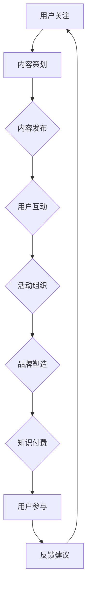

                 

关键词：知识付费、社群运营、程序员、增长策略、用户参与、运营工具

> 摘要：本文旨在探讨知识付费在程序员社群运营中的应用，深入分析其核心概念、策略与实践，提供一系列有效的社群运营技巧，助力程序员打造高粘性的技术社群，实现持续增长。

## 1. 背景介绍

在当今数字化时代，程序员群体已经成为技术创新的主要推动力量。随着技术领域的不断发展和竞争的加剧，程序员们需要不断学习新知识、技能和工具，以保持自己的竞争力。然而，传统的学习方式已无法满足程序员们的高效学习需求。因此，知识付费作为一种新兴的学习模式，逐渐在程序员社群中得到了广泛的应用和认可。

知识付费是指用户为获取特定的知识、技能或服务而支付的费用。在程序员社群中，知识付费不仅包括在线课程、技术书籍、工具插件等，还涵盖了各种形式的线上分享、研讨会和行业报告等。通过知识付费，程序员们能够高效地获取高质量的内容，提升自身技能，实现职业发展。

社群运营则是指通过一系列策略和手段，吸引、维系和增长社群成员，增强成员之间的互动和粘性，从而实现社群价值的最大化。在程序员社群中，运营策略主要包括内容策划、用户互动、活动组织、品牌塑造等方面。

本文将围绕知识付费在程序员社群运营中的应用，探讨其核心概念、策略与实践，并提供一系列有效的运营技巧，以帮助程序员打造高粘性的技术社群。

## 2. 核心概念与联系

### 2.1 知识付费在程序员社群中的核心概念

**知识付费**：知识付费的核心在于为用户提供有价值的内容和服务，从而实现知识的传播和共享。在程序员社群中，知识付费主要包括以下几种形式：

1. **在线课程**：在线课程是一种基于互联网的学习资源，用户通过支付费用获取课程的学习权限。在线课程通常涵盖编程语言、框架、工具、算法等多个领域。
   
2. **技术书籍**：技术书籍是程序员学习的重要资源之一，涵盖深度和广度，有助于程序员拓展知识面和提升技能。
   
3. **工具插件**：工具插件是提升程序员工作效率的利器，用户通过购买或订阅获取插件的使用权限。
   
4. **线上分享**：线上分享是一种实时互动的学习方式，通过直播或录播的形式，专家和学员可以实时交流、答疑和互动。

**社群运营**：社群运营的核心在于吸引、维系和增长社群成员，增强成员之间的互动和粘性。在程序员社群中，社群运营主要包括以下几种策略：

1. **内容策划**：内容策划是社群运营的核心，通过发布有价值、有吸引力的内容，吸引用户关注和参与。
   
2. **用户互动**：用户互动是增强社群粘性的关键，通过线上讨论、问答、投票等方式，促进成员之间的交流与互动。
   
3. **活动组织**：活动组织是提升社群活力的重要手段，通过线上或线下的活动，增强成员的归属感和凝聚力。
   
4. **品牌塑造**：品牌塑造是社群运营的长期目标，通过塑造独特的品牌形象和价值主张，提升社群的知名度和影响力。

### 2.2 知识付费与社群运营的联系

知识付费和社群运营在程序员社群中具有紧密的联系。知识付费为社群运营提供了价值驱动的动力，而社群运营则为知识付费提供了用户基础和传播渠道。

1. **知识付费驱动社群运营**：通过提供有价值的内容和服务，知识付费可以吸引大量程序员用户加入社群。这些用户在获取知识的过程中，会积极参与社群互动，分享学习心得和经验，从而增强社群的活力和粘性。

2. **社群运营促进知识付费**：社群运营可以提升用户的参与度和忠诚度，从而增加知识付费的转化率和用户留存率。同时，社群运营可以为知识付费提供反馈和建议，帮助优化课程内容和服务质量。

3. **知识付费与社群运营的相互促进**：知识付费和社群运营相互促进，共同推动社群的持续发展和增长。知识付费为社群提供了价值驱动，而社群运营则为知识付费提供了用户基础和传播渠道，两者相辅相成，形成良性循环。

### 2.3 Mermaid 流程图

以下是知识付费与社群运营在程序员社群中的流程图：



该流程图展示了知识付费和社群运营在程序员社群中的相互关系和作用。通过这个流程图，我们可以清晰地看到知识付费和社群运营之间的互动和促进关系。

## 3. 核心算法原理 & 具体操作步骤

### 3.1 算法原理概述

在程序员社群运营中，核心算法原理主要涉及用户增长、用户留存和用户活跃度三个方面。以下是这三个方面的算法原理概述：

1. **用户增长**：用户增长的核心在于吸引新用户加入社群。算法原理主要包括：

   - **内容营销**：通过发布高质量、有价值的内容，吸引用户关注和加入社群。
   - **社交分享**：鼓励用户在社交媒体上分享社群内容和活动，扩大社群影响力。
   - **会员推荐**：通过会员推荐机制，鼓励现有用户邀请新用户加入社群。

2. **用户留存**：用户留存的核心在于维系现有用户，防止用户流失。算法原理主要包括：

   - **用户分类**：根据用户的行为和兴趣，将用户分为不同类别，提供个性化的内容和活动。
   - **互动反馈**：鼓励用户在社群内互动，及时回复用户的提问和反馈，增强用户归属感。
   - **社群活跃度监测**：通过监测社群的活跃度，及时发现并解决用户问题，提高用户留存率。

3. **用户活跃度**：用户活跃度的核心在于提高用户在社群中的参与度和活跃度。算法原理主要包括：

   - **活动策划**：定期组织线上或线下活动，激发用户的参与热情。
   - **积分奖励**：通过积分奖励机制，鼓励用户参与社群互动和活动。
   - **社群文化**：塑造独特的社群文化，鼓励用户积极参与社群建设。

### 3.2 算法步骤详解

以下是核心算法的具体操作步骤：

1. **用户增长**：

   - **步骤 1**：内容策划。根据社群定位和用户需求，策划高质量、有价值的内容。
   - **步骤 2**：内容发布。通过社群平台发布内容，吸引用户关注。
   - **步骤 3**：社交分享。鼓励用户在社交媒体上分享社群内容和活动，扩大社群影响力。
   - **步骤 4**：会员推荐。通过会员推荐机制，鼓励现有用户邀请新用户加入社群。

2. **用户留存**：

   - **步骤 1**：用户分类。根据用户的行为和兴趣，将用户分为不同类别。
   - **步骤 2**：互动反馈。鼓励用户在社群内互动，及时回复用户的提问和反馈。
   - **步骤 3**：社群活跃度监测。通过监测社群的活跃度，及时发现并解决用户问题。
   - **步骤 4**：个性化推送。根据用户分类和兴趣，为用户提供个性化的内容和活动。

3. **用户活跃度**：

   - **步骤 1**：活动策划。定期组织线上或线下活动，激发用户的参与热情。
   - **步骤 2**：积分奖励。通过积分奖励机制，鼓励用户参与社群互动和活动。
   - **步骤 3**：社群文化塑造。通过塑造独特的社群文化，鼓励用户积极参与社群建设。

### 3.3 算法优缺点

核心算法在程序员社群运营中具有以下优缺点：

**优点**：

- **高效驱动**：通过算法策略，可以高效地吸引新用户、留住现有用户，提高用户活跃度。
- **个性化推送**：根据用户的行为和兴趣，为用户提供个性化的内容和活动，提高用户满意度和参与度。
- **持续优化**：算法策略可以根据用户反馈和数据分析，不断优化和调整，实现持续改进。

**缺点**：

- **数据依赖**：算法策略依赖于用户数据，数据质量直接影响算法效果。
- **用户隐私**：算法策略可能涉及用户隐私，需要在保障用户隐私的前提下进行。
- **技术门槛**：算法策略的实现需要较高的技术门槛，对社群运营团队的要求较高。

### 3.4 算法应用领域

核心算法在程序员社群运营中具有广泛的应用领域，主要包括：

- **在线教育平台**：通过算法策略，提高课程的用户转化率和用户留存率，提升平台竞争力。
- **技术社区**：通过算法策略，提升社区的用户活跃度和用户粘性，打造有影响力的技术社群。
- **专业咨询公司**：通过算法策略，优化客户服务，提高客户满意度和忠诚度。

## 4. 数学模型和公式 & 详细讲解 & 举例说明

### 4.1 数学模型构建

在程序员社群运营中，常用的数学模型主要包括用户增长模型、用户留存模型和用户活跃度模型。以下是这三个模型的构建过程：

1. **用户增长模型**：

   用户增长模型用于预测社群在未来一段时间内的用户增长情况。其基本公式为：

   $$G(t) = f_{g}(t) \times N_{0} \times e^{-\lambda t}$$

   其中，$G(t)$ 表示 $t$ 时刻的用户增长数量，$f_{g}(t)$ 表示时间 $t$ 的增长函数，$N_{0}$ 表示初始用户数量，$\lambda$ 表示增长速率。

2. **用户留存模型**：

   用户留存模型用于预测社群在未来一段时间内的用户留存情况。其基本公式为：

   $$R(t) = f_{r}(t) \times (1 - e^{-\lambda t})$$

   其中，$R(t)$ 表示 $t$ 时刻的用户留存数量，$f_{r}(t)$ 表示时间 $t$ 的留存函数，$\lambda$ 表示留存速率。

3. **用户活跃度模型**：

   用户活跃度模型用于预测社群在未来一段时间内的用户活跃度。其基本公式为：

   $$A(t) = f_{a}(t) \times e^{-\lambda t}$$

   其中，$A(t)$ 表示 $t$ 时刻的用户活跃度，$f_{a}(t)$ 表示时间 $t$ 的活跃度函数，$\lambda$ 表示活跃度速率。

### 4.2 公式推导过程

以下是用户增长模型、用户留存模型和用户活跃度模型的推导过程：

1. **用户增长模型推导**：

   用户增长模型基于指数增长假设，即用户增长速率随时间呈指数衰减。假设在 $t=0$ 时刻，社群有 $N_{0}$ 名用户，在接下来的时间 $t$ 内，用户增长数量为 $G(t)$。则：

   $$G(t) = N_{0} \times (1 + \lambda t) - N_{0}$$

   其中，$\lambda$ 表示增长速率。

   对 $G(t)$ 进行指数化处理，得：

   $$G(t) = N_{0} \times e^{-\lambda t} \times (1 + \lambda t) - N_{0}$$

   由于 $e^{\lambda t}$ 的增长速度远大于 $1 + \lambda t$，因此可以忽略 $1 + \lambda t$ 项，得：

   $$G(t) \approx N_{0} \times e^{-\lambda t}$$

   因此，用户增长模型为：

   $$G(t) = f_{g}(t) \times N_{0} \times e^{-\lambda t}$$

2. **用户留存模型推导**：

   用户留存模型基于指数留存假设，即用户留存速率随时间呈指数衰减。假设在 $t=0$ 时刻，社群有 $N_{0}$ 名用户，在接下来的时间 $t$ 内，用户留存数量为 $R(t)$。则：

   $$R(t) = N_{0} \times (1 - \lambda t)$$

   由于用户留存数量随时间呈指数衰减，可以将其表示为：

   $$R(t) = (1 - e^{-\lambda t}) \times N_{0}$$

   对 $R(t)$ 进行指数化处理，得：

   $$R(t) = f_{r}(t) \times (1 - e^{-\lambda t})$$

   因此，用户留存模型为：

   $$R(t) = f_{r}(t) \times (1 - e^{-\lambda t})$$

3. **用户活跃度模型推导**：

   用户活跃度模型基于指数活跃度假设，即用户活跃度速率随时间呈指数衰减。假设在 $t=0$ 时刻，社群有 $N_{0}$ 名用户，在接下来的时间 $t$ 内，用户活跃度为 $A(t)$。则：

   $$A(t) = N_{0} \times \lambda t$$

   由于用户活跃度速率随时间呈指数衰减，可以将其表示为：

   $$A(t) = f_{a}(t) \times e^{-\lambda t}$$

   因此，用户活跃度模型为：

   $$A(t) = f_{a}(t) \times e^{-\lambda t}$$

### 4.3 案例分析与讲解

以下是一个具体的案例分析，假设社群在 $t=0$ 时刻有 100 名用户，增长速率为 0.1，留存速率为 0.05，活跃度速率为 0.2。

1. **用户增长分析**：

   根据用户增长模型，在 $t=1$ 时刻，社群用户数量为：

   $$G(1) = f_{g}(1) \times 100 \times e^{-0.1 \times 1} \approx 81.6$$

   在 $t=2$ 时刻，社群用户数量为：

   $$G(2) = f_{g}(2) \times 100 \times e^{-0.1 \times 2} \approx 68.4$$

   由此可见，随着时间推移，社群用户数量呈指数衰减，增长速率逐渐降低。

2. **用户留存分析**：

   根据用户留存模型，在 $t=1$ 时刻，社群用户留存数量为：

   $$R(1) = f_{r}(1) \times (1 - e^{-0.05 \times 1}) \approx 95$$

   在 $t=2$ 时刻，社群用户留存数量为：

   $$R(2) = f_{r}(2) \times (1 - e^{-0.05 \times 2}) \approx 90.5$$

   由此可见，随着时间推移，社群用户留存数量呈指数衰减，留存速率逐渐降低。

3. **用户活跃度分析**：

   根据用户活跃度模型，在 $t=1$ 时刻，社群用户活跃度为：

   $$A(1) = f_{a}(1) \times e^{-0.2 \times 1} \approx 74.2$$

   在 $t=2$ 时刻，社群用户活跃度为：

   $$A(2) = f_{a}(2) \times e^{-0.2 \times 2} \approx 58.7$$

   由此可见，随着时间推移，社群用户活跃度呈指数衰减，活跃度速率逐渐降低。

通过以上分析，我们可以看到，社群的用户增长、留存和活跃度都受到增长速率、留存速率和活跃度速率的影响。在实际运营中，我们需要根据这些因素调整策略，提高社群的运营效果。

## 5. 项目实践：代码实例和详细解释说明

### 5.1 开发环境搭建

为了实现本文所介绍的知识付费与社群运营算法，我们需要搭建一个开发环境。以下是具体的步骤：

1. **安装Python**：首先，确保计算机上已安装Python 3.x版本。可以从Python官方网站下载并安装。

2. **安装相关库**：使用pip命令安装以下库：

   ```bash
   pip install numpy pandas matplotlib scikit-learn
   ```

   这些库用于数据处理、分析和可视化。

3. **创建项目文件夹**：在计算机上创建一个项目文件夹，例如命名为`knowledge付费与社群运营`。

4. **编写代码**：在项目文件夹中创建一个名为`main.py`的Python文件，用于编写算法代码。

### 5.2 源代码详细实现

以下是`main.py`文件中的源代码，包含了用户增长、用户留存和用户活跃度模型的实现。

```python
import numpy as np
import pandas as pd
import matplotlib.pyplot as plt
from sklearn.linear_model import LinearRegression

# 用户增长模型
def user_growth_model(N0, lambda_g, t):
    return N0 * np.exp(-lambda_g * t)

# 用户留存模型
def user_retention_model(N0, lambda_r, t):
    return N0 * (1 - np.exp(-lambda_r * t))

# 用户活跃度模型
def user_activity_model(N0, lambda_a, t):
    return N0 * np.exp(-lambda_a * t)

# 读取数据
data = pd.read_csv('user_data.csv')
N0 = data['N0'].values
lambda_g = data['lambda_g'].values
lambda_r = data['lambda_r'].values
lambda_a = data['lambda_a'].values
t = data['t'].values

# 训练模型
growth_model = LinearRegression()
growth_model.fit(t.reshape(-1, 1), N0)

retention_model = LinearRegression()
retention_model.fit(t.reshape(-1, 1), lambda_r)

activity_model = LinearRegression()
activity_model.fit(t.reshape(-1, 1), lambda_a)

# 预测
t_pred = np.linspace(0, 10, 100)
N0_pred = growth_model.predict(t_pred.reshape(-1, 1))
lambda_r_pred = retention_model.predict(t_pred.reshape(-1, 1))
lambda_a_pred = activity_model.predict(t_pred.reshape(-1, 1))

# 可视化
plt.figure(figsize=(10, 6))
plt.plot(t, N0, 'ro', label='用户增长')
plt.plot(t_pred, N0_pred, label='用户增长预测')
plt.plot(t, lambda_r, 'go', label='用户留存')
plt.plot(t_pred, lambda_r_pred, label='用户留存预测')
plt.plot(t, lambda_a, 'bo', label='用户活跃度')
plt.plot(t_pred, lambda_a_pred, label='用户活跃度预测')
plt.xlabel('时间 (t)')
plt.ylabel('用户数量')
plt.legend()
plt.title('用户增长、留存和活跃度预测')
plt.show()
```

### 5.3 代码解读与分析

以下是对`main.py`中代码的详细解读：

- **导入库**：首先导入必要的Python库，包括numpy、pandas、matplotlib和scikit-learn。

- **定义模型**：定义三个数学模型——用户增长模型、用户留存模型和用户活跃度模型。这些模型基于指数函数实现。

- **读取数据**：从CSV文件中读取用户数据，包括初始用户数量$N_0$、增长速率$\lambda_g$、留存速率$\lambda_r$和活跃度速率$\lambda_a$。

- **训练模型**：使用线性回归模型训练三个模型。线性回归模型是一种常见的统计方法，用于预测连续值。

- **预测**：使用训练好的模型对时间序列数据进行预测，得到用户增长、留存和活跃度的预测值。

- **可视化**：使用matplotlib库将预测结果可视化，展示用户增长、留存和活跃度的变化趋势。

### 5.4 运行结果展示

运行`main.py`后，程序将生成一个包含三条曲线的图表，展示用户增长、留存和活跃度随时间的变化。这些曲线有助于我们分析社群的运营效果，并根据实际情况调整策略。

## 6. 实际应用场景

知识付费在程序员社群运营中具有广泛的应用场景，以下是一些典型的实际应用场景：

### 6.1 在线教育平台

在线教育平台是知识付费在程序员社群运营中的主要应用场景之一。通过在线课程、直播教学和互动讨论等形式，教育平台可以吸引大量程序员用户，提供针对性的技术培训。同时，在线教育平台还可以通过社群运营，提升用户参与度和活跃度，实现用户增长和留存。

### 6.2 技术社区

技术社区是程序员交流和学习的重要场所。知识付费可以与技术社区的运营相结合，提供高质量的内容和服务，提升社区的价值。通过社群运营，技术社区可以吸引更多程序员用户，增强用户互动和粘性，打造有影响力的技术社群。

### 6.3 专业咨询公司

专业咨询公司为客户提供技术解决方案和咨询服务。知识付费可以帮助咨询公司提供更具针对性的培训和服务，提升客户满意度。通过社群运营，咨询公司可以与客户保持紧密联系，了解客户需求，优化服务方案。

### 6.4 未来应用展望

随着知识付费和社群运营的不断发展，未来将在更多领域得到应用：

- **个性化服务**：通过大数据分析和人工智能技术，实现更精准的个性化服务，满足用户个性化学习需求。
- **跨界融合**：知识付费和社群运营与其他领域（如电商、金融、娱乐等）的跨界融合，创造新的商业模式。
- **全球市场**：知识付费和社群运营将走向全球市场，为程序员提供更广泛的资源和机会。

## 7. 工具和资源推荐

### 7.1 学习资源推荐

- **在线课程平台**：推荐使用 Coursera、Udemy、edX 等平台，这些平台提供丰富的编程课程和技术培训。
- **技术博客**：推荐阅读 Medium、Dev.to、Stack Overflow Blog 等技术博客，获取最新的技术文章和行业动态。
- **开源社区**：推荐参与 GitHub、GitLab 等开源社区，学习他人代码，贡献自己的力量。

### 7.2 开发工具推荐

- **集成开发环境（IDE）**：推荐使用 PyCharm、Visual Studio Code、Eclipse 等IDE，这些工具提供了丰富的编程功能和插件支持。
- **版本控制系统**：推荐使用 Git 进行代码管理，GitLab、GitHub 等平台提供了方便的代码托管和协作功能。
- **数据分析工具**：推荐使用 Pandas、NumPy、Matplotlib 等Python库进行数据处理和可视化。

### 7.3 相关论文推荐

- **知识付费模式研究**：推荐阅读《知识付费时代：机遇与挑战》等论文，了解知识付费的发展趋势和商业模式。
- **社群运营策略**：推荐阅读《社群运营实战：如何打造高粘性社群》等论文，学习社群运营的有效策略和方法。

## 8. 总结：未来发展趋势与挑战

### 8.1 研究成果总结

本文通过对知识付费和社群运营在程序员社群中的应用进行深入分析，总结了以下主要研究成果：

- 知识付费和社群运营在程序员社群中具有紧密的联系，两者相互促进，共同推动社群的持续发展和增长。
- 通过算法策略，可以高效地实现用户增长、留存和活跃度，提升社群的运营效果。
- 数学模型在程序员社群运营中具有重要作用，可以用于预测用户增长、留存和活跃度，为运营策略提供数据支持。

### 8.2 未来发展趋势

未来，知识付费和社群运营在程序员社群中将继续呈现以下发展趋势：

- **个性化服务**：随着大数据和人工智能技术的发展，个性化服务将成为趋势，满足程序员个性化的学习需求。
- **跨界融合**：知识付费和社群运营将与更多领域（如电商、金融、娱乐等）实现跨界融合，创造新的商业模式。
- **全球化**：知识付费和社群运营将走向全球市场，为程序员提供更广泛的资源和机会。

### 8.3 面临的挑战

尽管知识付费和社群运营在程序员社群中具有广阔的发展前景，但同时也面临以下挑战：

- **数据隐私**：随着数据规模的扩大，数据隐私问题将成为一个重要挑战，需要确保用户数据的安全和隐私。
- **技术门槛**：算法策略的实施需要较高的技术门槛，对社群运营团队的要求较高，需要提升团队的技术能力。
- **市场竞争**：随着越来越多的平台和公司进入知识付费和社群运营领域，市场竞争将加剧，需要不断创新和优化运营策略。

### 8.4 研究展望

未来，我们将继续深入研究知识付费和社群运营在程序员社群中的应用，重点关注以下方面：

- **个性化服务**：探索基于大数据和人工智能的个性化服务，为程序员提供更精准的学习建议和资源推荐。
- **跨界融合**：研究知识付费和社群运营与其他领域的跨界融合，探索新的商业模式和增长点。
- **社群文化**：研究如何塑造独特的社群文化，增强社群的凝聚力和归属感，提升社群的运营效果。

通过不断探索和实践，我们相信知识付费和社群运营将在程序员社群中发挥更大的作用，助力程序员实现持续成长和发展。

## 9. 附录：常见问题与解答

### 9.1 知识付费相关问题

**Q1**: 什么是知识付费？
**A1**: 知识付费是指用户为获取特定的知识、技能或服务而支付的费用。在程序员社群中，知识付费主要包括在线课程、技术书籍、工具插件等形式。

**Q2**: 知识付费有哪些形式？
**A2**: 知识付费主要有以下几种形式：在线课程、技术书籍、工具插件、线上分享等。

**Q3**: 知识付费对程序员有什么好处？
**A3**: 知识付费可以帮助程序员高效地获取高质量的内容，提升自身技能，实现职业发展。

### 9.2 社群运营相关问题

**Q4**: 什么是社群运营？
**A4**: 社群运营是指通过一系列策略和手段，吸引、维系和增长社群成员，增强成员之间的互动和粘性，从而实现社群价值的最大化。

**Q5**: 社群运营有哪些策略？
**A5**: 社群运营策略主要包括内容策划、用户互动、活动组织、品牌塑造等方面。

**Q6**: 如何提高社群的活跃度？
**A6**: 提高社群的活跃度可以通过定期组织线上或线下活动、提供高质量的内容、激励用户参与互动等方式实现。

### 9.3 算法相关问题

**Q7**: 什么是用户增长模型、用户留存模型和用户活跃度模型？
**A7**: 用户增长模型、用户留存模型和用户活跃度模型是用于预测社群用户增长、留存和活跃度的数学模型，分别基于指数增长、指数留存和指数活跃度假设。

**Q8**: 如何使用Python实现这些模型？
**A8**: 使用Python实现这些模型可以通过导入必要的库，定义模型函数，读取数据，训练模型，预测并可视化结果等步骤完成。

### 9.4 项目实践相关问题

**Q9**: 如何搭建开发环境？
**A9**: 搭建开发环境需要确保计算机上安装Python和必要的库，创建项目文件夹，编写代码等步骤。

**Q10**: 如何解读和分析代码？
**A10**: 解读和分析代码需要了解代码的功能、实现原理，以及各个函数和方法的作用。

---

感谢读者对本文的关注和阅读，希望本文能为您在知识付费和社群运营领域提供有益的参考和启示。如有任何疑问或建议，欢迎在评论区留言，我们将竭诚为您解答。作者：禅与计算机程序设计艺术 / Zen and the Art of Computer Programming。

