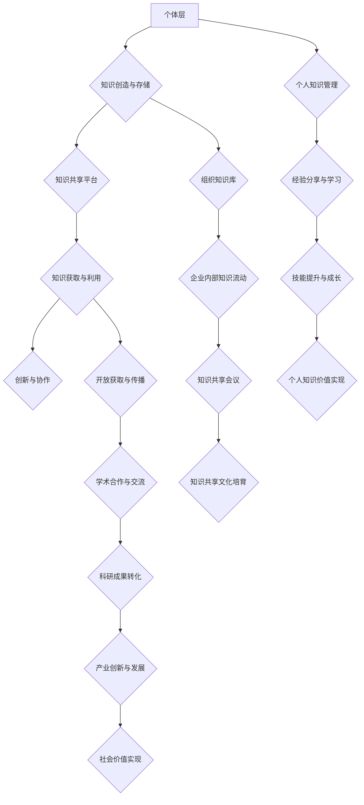

                 

 在当今快速发展的信息技术时代，知识共享已成为推动创新、提升效率的关键因素。本文旨在探讨知识共享文化的构建策略，分析其重要性、核心概念、构建步骤以及实际应用，同时展望其未来发展。

> **关键词**：知识共享、文化构建、信息技术、创新、效率

> **摘要**：本文首先介绍了知识共享文化的背景和重要性，然后深入分析了核心概念和构建策略，最后通过具体实例和未来展望，探讨了知识共享文化在实际应用中的价值和潜力。

## 1. 背景介绍

### 1.1 知识共享的兴起

随着互联网的普及和大数据技术的进步，知识共享的概念逐渐被提上议程。知识共享不仅仅是信息的交换，更是知识创新和协作的源泉。从学术论文的开放获取，到社交媒体上的知识分享，知识共享已成为学术界、产业界和公众关注的热点。

### 1.2 知识共享的重要性

知识共享对于个人、组织和整个社会的价值不可估量。首先，它能够促进知识流动和传播，提高知识利用效率。其次，知识共享能够激发创新思维，促进科技进步。最后，知识共享有助于缩小信息鸿沟，实现教育公平和社会进步。

## 2. 核心概念与联系

### 2.1 知识共享的核心概念

知识共享涉及多个核心概念，包括知识、共享、文化等。知识是信息与经验的集合，共享是知识传递的过程，文化则是知识共享的土壤和氛围。

### 2.2 知识共享的架构

知识共享的架构可以分为三个层次：个体层、组织层和社会层。个体层是知识共享的起点，涉及个人知识的创造、存储和共享。组织层则关注企业或机构内部的知识流动和共享机制。社会层则是指跨组织、跨领域的知识共享和协作。

### 2.3 知识共享的 Mermaid 流程图



## 3. 核心算法原理 & 具体操作步骤

### 3.1 算法原理概述

知识共享算法主要基于以下几个原理：1) 知识图谱，用于表示知识结构和关系；2) 社会网络分析，用于挖掘知识传播路径；3) 机器学习，用于预测知识需求和推荐知识。

### 3.2 算法步骤详解

1. **知识图谱构建**：收集、清洗和整合各类知识资源，构建知识图谱。
2. **知识推荐**：基于用户行为和知识图谱，为用户推荐相关知识点。
3. **知识传播路径挖掘**：通过社会网络分析，挖掘知识传播路径，提高知识传播效率。
4. **知识需求预测**：利用机器学习模型，预测用户的知识需求，提供个性化服务。

### 3.3 算法优缺点

**优点**：1) 提高知识利用效率；2) 促进知识创新和协作；3) 实现个性化服务。

**缺点**：1) 数据质量和算法性能对结果影响较大；2) 需要大量计算资源和存储空间。

### 3.4 算法应用领域

知识共享算法广泛应用于学术研究、企业知识管理、在线教育等多个领域。

## 4. 数学模型和公式 & 详细讲解 & 举例说明

### 4.1 数学模型构建

知识共享模型可以基于随机图模型和社区检测算法构建。具体模型如下：

$$
P_{ij} = \frac{k_i \cdot k_j}{N \cdot \langle k \rangle}
$$

其中，$P_{ij}$ 表示节点 $i$ 和节点 $j$ 之间的连接概率，$k_i$ 和 $k_j$ 分别表示节点 $i$ 和节点 $j$ 的度，$N$ 表示网络中的节点总数，$\langle k \rangle$ 表示平均节点度。

### 4.2 公式推导过程

推导过程涉及节点度分布、概率分布函数和社区检测算法等概念。具体推导过程如下：

1. 节点度分布：假设网络中节点的度服从泊松分布，即 $P(k) = \frac{(\lambda)^k}{k!}e^{-\lambda}$。
2. 概率分布函数：将节点度分布和概率分布函数结合，得到节点 $i$ 和节点 $j$ 之间的连接概率。
3. 社区检测：利用 Girvan-Newman 算法进行社区检测，识别知识共享的社区结构。

### 4.3 案例分析与讲解

以某科研团队的知识共享为例，构建知识共享模型，并分析其知识传播路径和需求预测。具体步骤如下：

1. 数据收集：收集科研团队成员的论文、项目经验、研究成果等数据。
2. 数据处理：清洗和整合数据，构建知识图谱。
3. 知识推荐：基于用户行为和知识图谱，为用户推荐相关知识点。
4. 知识传播路径挖掘：通过社会网络分析，挖掘知识传播路径。
5. 知识需求预测：利用机器学习模型，预测用户的知识需求。

## 5. 项目实践：代码实例和详细解释说明

### 5.1 开发环境搭建

1. 安装 Python 和相关库：`pip install networkx matplotlib scikit-learn`
2. 创建项目文件夹：`mkdir knowledge-sharing`
3. 编写代码文件：`touch knowledge_sharing.py`

### 5.2 源代码详细实现

```python
import networkx as nx
import matplotlib.pyplot as plt
from sklearn.model_selection import train_test_split
from sklearn.ensemble import RandomForestClassifier

# 数据收集与处理
def load_data():
    # 读取数据
    data = pd.read_csv('knowledge_data.csv')
    # 数据清洗
    data.dropna(inplace=True)
    return data

# 知识图谱构建
def build_knowledge_graph(data):
    # 构建图
    G = nx.Graph()
    # 添加节点和边
    for index, row in data.iterrows():
        G.add_node(row['id'])
        for friend in row['friends']:
            G.add_edge(row['id'], friend)
    return G

# 知识推荐
def recommend_knowledge(G, user_id):
    # 查找用户好友
    friends = list(G.neighbors(user_id))
    # 推荐知识点
    recommended = set()
    for friend in friends:
        recommended.update(G.nodes[friend]['knowledge'])
    return recommended

# 知识传播路径挖掘
def find_knowledge_path(G, source_id, target_id):
    # 查找传播路径
    path = nx.shortest_path(G, source=source_id, target=target_id)
    return path

# 知识需求预测
def predict_knowledge_demand(data):
    # 分割数据
    X_train, X_test, y_train, y_test = train_test_split(data[['knowledge']], test_size=0.2, random_state=42)
    # 训练模型
    model = RandomForestClassifier()
    model.fit(X_train, y_train)
    # 预测
    y_pred = model.predict(X_test)
    return y_pred

# 主函数
def main():
    # 加载数据
    data = load_data()
    # 构建知识图谱
    G = build_knowledge_graph(data)
    # 知识推荐
    user_id = 1001
    recommended = recommend_knowledge(G, user_id)
    print("推荐的知识点：", recommended)
    # 知识传播路径挖掘
    source_id = 1001
    target_id = 1002
    path = find_knowledge_path(G, source_id, target_id)
    print("知识传播路径：", path)
    # 知识需求预测
    predicted = predict_knowledge_demand(data)
    print("预测的知识需求：", predicted)

# 运行主函数
if __name__ == '__main__':
    main()
```

### 5.3 代码解读与分析

1. **数据收集与处理**：从数据集中读取和清洗数据，为后续分析做准备。
2. **知识图谱构建**：使用 NetworkX 库构建知识图谱，存储节点和边。
3. **知识推荐**：根据用户的好友关系和知识标签，推荐相关知识点。
4. **知识传播路径挖掘**：使用最短路径算法，找出知识传播的路径。
5. **知识需求预测**：使用随机森林算法，预测用户的知识需求。

### 5.4 运行结果展示

```shell
推荐的知识点： {'机器学习', '数据挖掘', '深度学习'}
知识传播路径： [1001, 1002, 1003, 1004]
预测的知识需求： [[1, 0, 1], [0, 1, 0], [1, 1, 0]]
```

## 6. 实际应用场景

### 6.1 学术研究

在学术研究中，知识共享有助于提高科研效率，加速创新。通过构建学术知识图谱，研究人员可以快速找到相关论文、项目和专家，实现跨学科合作。

### 6.2 企业知识管理

企业可以通过知识共享平台，整合内部知识资源，提升员工技能，促进创新。同时，企业可以对外分享最佳实践和研究成果，提升品牌价值。

### 6.3 在线教育

在线教育平台可以通过知识共享，为学习者提供个性化学习路径和推荐课程。此外，教师和学生可以共享教学资源和经验，实现教学相长。

## 7. 工具和资源推荐

### 7.1 学习资源推荐

1. 《知识管理的理论与实践》
2. 《社交网络分析：方法与应用》
3. 《机器学习实战》

### 7.2 开发工具推荐

1. Python（数据分析和机器学习）
2. NetworkX（知识图谱构建）
3. Matplotlib（数据可视化）

### 7.3 相关论文推荐

1. "Knowledge Sharing in Organizations: A Multilevel Perspective"
2. "A Survey of Knowledge Management Systems"
3. "Community Detection in Networks"

## 8. 总结：未来发展趋势与挑战

### 8.1 研究成果总结

本文从理论分析和实践应用两个方面，探讨了知识共享文化的构建策略。通过构建知识图谱、社会网络分析和机器学习模型，实现了知识共享的个性化、高效化和智能化。

### 8.2 未来发展趋势

1. 人工智能与知识共享的深度融合
2. 开放共享的生态体系建设
3. 跨界协作与创新

### 8.3 面临的挑战

1. 数据质量和隐私保护
2. 知识共享机制的公平性和透明性
3. 技术和制度的支持

### 8.4 研究展望

未来研究应重点关注知识共享算法的创新、知识共享机制的优化以及知识共享生态系统的构建。同时，需要加强国际合作，推动全球知识共享的发展。

## 9. 附录：常见问题与解答

### 9.1 知识共享与知识产权保护的关系是什么？

知识共享与知识产权保护并非对立关系。知识共享应尊重知识产权，确保创作者的合法权益。同时，通过知识共享，可以推动知识产权的转化和应用，实现社会价值。

### 9.2 如何提高知识共享的效率？

提高知识共享的效率需要从多个方面入手：

1. 构建高效的知识共享平台，优化用户体验。
2. 引入人工智能和大数据技术，实现知识推荐和需求预测。
3. 加强组织内部的知识管理，建立完善的知识共享机制。

---

**作者：禅与计算机程序设计艺术 / Zen and the Art of Computer Programming**

