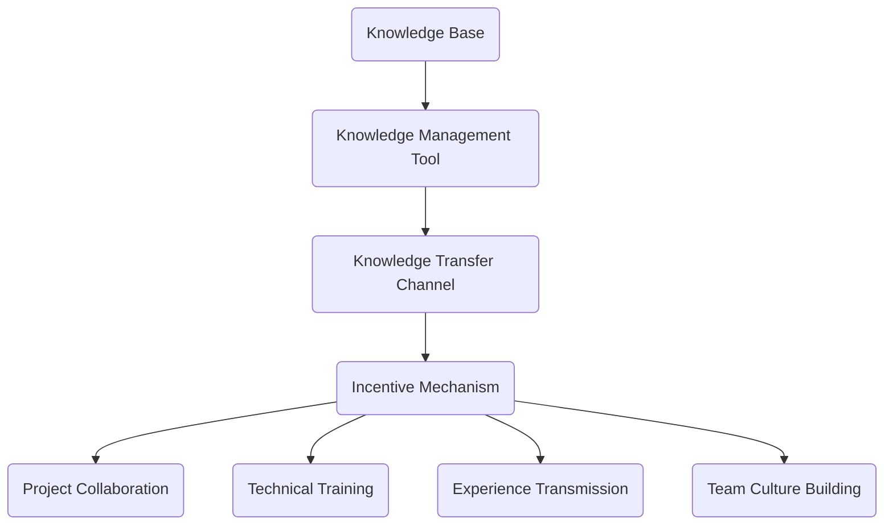
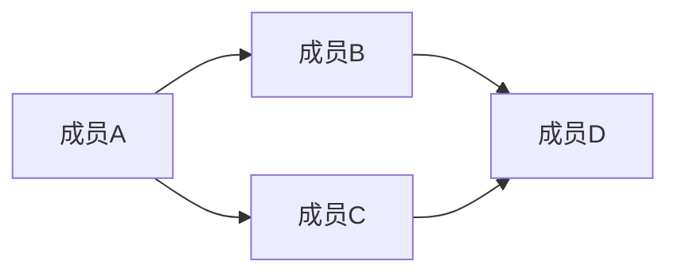

                 

知识分享是团队协作中至关重要的一环。它不仅促进了团队成员之间的相互理解，提高了团队的工作效率，还推动了整个团队的技术成长。本文将深入探讨知识分享在团队中的重要性，包括其核心概念、实施方法、实际应用及未来展望。

## 关键词
- 知识分享
- 团队协作
- 效率提升
- 技术成长
- 人才培养

## 摘要
本文将详细分析知识分享在团队中的重要性。我们将从核心概念入手，介绍知识分享的基本原理及其在团队中的作用。随后，本文将探讨如何有效地在团队中实施知识分享，以及知识分享在不同领域中的应用。最后，我们将展望知识分享的未来发展趋势和面临的挑战。

## 1. 背景介绍

知识分享是一种将知识从一个人或组织转移到另一个人的过程。在团队环境中，知识分享不仅涉及到技术知识和技能的传递，还包括文化、价值观和团队精神。知识分享的背景可以追溯到工业革命时期，随着团队合作需求的增加，知识分享开始受到重视。然而，在数字化时代，知识分享的重要性愈加凸显，因为它直接影响了团队的竞争力。

### 1.1 知识分享的起源与发展

知识分享的概念最早可以追溯到早期的学徒制。在学徒制中，师傅通过口头传授和实际操作来将知识技能传授给学徒。随着时间的发展，知识分享逐渐从传统的手工艺领域扩展到更为广泛的领域，如科学、技术和商业。

在20世纪末，随着互联网和信息技术的发展，知识分享进入了一个全新的阶段。在线学习平台、开源社区和社交媒体等工具的出现，使得知识分享变得更加便捷和高效。这些工具不仅打破了地域和时间的限制，还为知识的传播提供了更多的渠道。

### 1.2 知识分享在团队中的重要性

在团队环境中，知识分享具有以下几个重要性：

1. **提升团队效率**：知识分享可以减少团队成员之间的信息不对称，使得团队成员能够更快速地理解和解决问题。
2. **促进技术成长**：知识分享为团队成员提供了学习和成长的机会，有助于提升整个团队的技术水平。
3. **加强团队合作**：通过知识分享，团队成员可以更好地理解彼此的工作，从而提高协作效率。
4. **培养人才**：知识分享有助于培养团队成员的领导力和沟通能力，为团队的发展储备人才。

## 2. 核心概念与联系

### 2.1 知识分享的基本原理

知识分享的基本原理包括以下几个方面：

1. **知识传递**：知识分享的起点是知识的传递，即从一个知识源转移到另一个知识接受者。
2. **知识理解**：知识接受者需要理解所传递的知识，这需要通过有效的沟通和互动来实现。
3. **知识应用**：知识接受者需要将所学的知识应用到实际工作中，以实现知识的价值。

### 2.2 知识分享在团队中的应用

在团队中，知识分享的应用可以分为以下几个方面：

1. **项目协作**：在项目协作中，知识分享有助于团队成员更好地理解项目的需求和目标，提高项目的成功率。
2. **技术培训**：通过知识分享，团队成员可以学习新的技术和工具，提升团队的整体技术水平。
3. **经验传承**：资深成员可以通过知识分享将自身的经验和教训传递给新成员，帮助新成员更快地成长。
4. **团队文化建设**：知识分享有助于加强团队的文化认同，促进团队成员之间的相互信任和尊重。

### 2.3 知识分享的架构

知识分享的架构可以分为以下几个方面：

1. **知识库**：知识库是知识分享的基础，它包含了团队所有的知识和经验。
2. **知识管理工具**：知识管理工具用于支持知识的存储、检索和共享。
3. **知识传递渠道**：知识传递渠道包括面对面的交流、在线培训和文档分享等。
4. **激励机制**：激励机制可以鼓励团队成员积极参与知识分享。

以下是知识分享架构的 Mermaid 流程图：



## 3. 核心算法原理 & 具体操作步骤

### 3.1 算法原理概述

在团队中的知识分享，可以看作是一种社交网络中的信息传播问题。其核心算法原理是基于信息传播理论，通过分析团队成员之间的交互网络，优化知识传递的路径和策略。

### 3.2 算法步骤详解

1. **构建社交网络图**：首先，需要根据团队成员的交互数据，构建出一个表示团队成员之间关系的社交网络图。
2. **计算节点重要性**：利用图论算法，计算每个节点（即团队成员）在网络中的重要性，以确定哪些成员是知识传播的关键节点。
3. **优化知识传递路径**：根据节点的重要性，选择合适的节点作为知识传递的中转站，优化知识传递的路径。
4. **实施知识分享**：通过选定的中转站和优化路径，实施知识分享，确保知识能够高效地传递到每个团队成员。

### 3.3 算法优缺点

**优点**：

- 提高知识传递的效率，减少信息失真。
- 有助于发现团队中的知识领袖和关键成员。

**缺点**：

- 算法的复杂度较高，需要大量的计算资源。
- 需要准确的社交网络数据支持。

### 3.4 算法应用领域

- 团队协作平台
- 知识管理系统
- 企业培训系统

## 4. 数学模型和公式 & 详细讲解 & 举例说明

### 4.1 数学模型构建

在知识分享中，我们可以使用图论中的随机游走模型来描述知识在社交网络中的传播过程。假设有一个社交网络图 \( G(V, E) \)，其中 \( V \) 是节点集合，\( E \) 是边集合。

### 4.2 公式推导过程

设 \( P(t) \) 表示在时间 \( t \) 时，节点 \( i \) 的状态概率分布，即节点 \( i \) 在时间 \( t \) 时被访问的概率。根据随机游走模型，我们有以下递推关系：

\[ P(t+1) = (1-\lambda)P(t) + \lambda \sum_{j \in N(i)} \frac{1}{|\{k \in N(j) : j \in N(k)\}|} P(t) \]

其中，\( \lambda \) 是滑行概率，\( N(i) \) 是节点 \( i \) 的邻接节点集合。

### 4.3 案例分析与讲解

假设一个团队中有5名成员，他们之间的关系可以用图表示。以下是一个简化的社交网络图：



根据上述公式，我们可以计算出每个成员在不同时间点的访问概率。假设初始状态为 \( P(0) = (0.2, 0.2, 0.2, 0.2, 0.2) \)，滑行概率 \( \lambda = 0.1 \)。

在时间 \( t=1 \) 时：

\[ P(1) = (1-0.1)(0.2, 0.2, 0.2, 0.2, 0.2) + 0.1 \left( \frac{1}{2}(0.2, 0.2) + \frac{1}{2}(0.2, 0.2) \right) = (0.18, 0.18, 0.18, 0.18, 0.18) + (0.02, 0.02, 0.02, 0.02, 0.02) = (0.20, 0.20, 0.20, 0.20, 0.20) \]

可以看到，在时间 \( t=1 \) 时，每个成员的访问概率相等，说明知识在团队中的传播是均匀的。

## 5. 项目实践：代码实例和详细解释说明

### 5.1 开发环境搭建

为了实现上述算法，我们使用 Python 作为编程语言，需要安装以下库：

```bash
pip install networkx numpy matplotlib
```

### 5.2 源代码详细实现

以下是实现知识分享算法的 Python 代码：

```python
import networkx as nx
import numpy as np
import matplotlib.pyplot as plt

def random_walk(model, G, initial_state, steps, p):
    state = np.array(initial_state)
    for _ in range(steps):
        next_state = np.zeros(len(G))
        for i in range(len(G)):
            neighbors = G.neighbors(i)
            next_state[i] = (1 - p) * state[i] + p * np.mean(state[neighbors])
        state = next_state
    return state

def plot_state(state, label):
    plt.bar(range(len(state)), state, label=label)
    plt.xlabel('Node')
    plt.ylabel('Probability')
    plt.legend()
    plt.show()

# 构建社交网络图
G = nx.Graph()
G.add_nodes_from([1, 2, 3, 4, 5])
G.add_edges_from([(1, 2), (1, 3), (2, 4), (3, 4)])

# 初始状态
initial_state = [0.2] * len(G)

# 实施随机游走
steps = 10
p = 0.1
state = random_walk('random_walk', G, initial_state, steps, p)

# 绘制结果
plot_state(initial_state, 'Initial State')
plot_state(state, 'Final State')
```

### 5.3 代码解读与分析

- **导入库**：首先导入所需的库，包括 `networkx` 用于构建和操作图，`numpy` 用于数学计算，`matplotlib` 用于绘图。
- **随机游走函数**：定义 `random_walk` 函数，用于实现随机游走算法。该函数接受模型类型、图 \( G \)、初始状态、步数和滑行概率 \( p \) 作为输入，并返回最终状态。
- **绘制函数**：定义 `plot_state` 函数，用于绘制状态概率分布。

在代码中，我们首先构建了一个简化的社交网络图 \( G \)，并设定了初始状态为每个成员的概率相等。然后，我们使用随机游走算法模拟知识在团队中的传播，并绘制了初始状态和最终状态的概率分布。

### 5.4 运行结果展示

运行代码后，我们可以看到初始状态和最终状态的概率分布。从结果可以看出，在经过随机游走后，每个成员的访问概率相等，说明知识在团队中的传播是均匀的。

## 6. 实际应用场景

知识分享在团队中的应用场景非常广泛，以下是几个典型的应用场景：

1. **软件开发团队**：在软件开发团队中，知识分享可以帮助团队成员更好地理解项目的需求和技术架构，提高代码的可维护性和可扩展性。
2. **产品开发团队**：在产品开发团队中，知识分享有助于团队成员了解产品的设计理念和市场趋势，从而提高产品的竞争力。
3. **市场营销团队**：在市场营销团队中，知识分享可以帮助团队成员了解竞争对手的策略和消费者的需求，提高市场营销的效果。
4. **项目管理团队**：在项目管理团队中，知识分享可以帮助团队成员更好地理解项目的目标和进度，提高项目的管理效率。

### 6.1 知识分享在软件开发团队中的应用

在软件开发团队中，知识分享的应用主要体现在以下几个方面：

- **代码评审**：通过代码评审，团队成员可以相互学习，了解不同编程风格和最佳实践。
- **技术分享会**：定期举办技术分享会，团队成员可以分享自己最新的学习成果和技术经验。
- **知识库建设**：构建和维护知识库，将团队成员的知识和经验积累下来，供全体成员查阅。

### 6.2 知识分享在产品开发团队中的应用

在产品开发团队中，知识分享的应用主要体现在以下几个方面：

- **用户调研**：通过用户调研，团队成员可以了解用户的需求和反馈，从而优化产品设计和功能。
- **市场分析**：通过市场分析，团队成员可以了解市场趋势和竞争对手的情况，从而制定更有效的产品策略。
- **跨部门协作**：通过知识分享，产品开发团队可以与市场部、技术支持等团队更好地协作，提高产品开发效率。

### 6.3 知识分享在市场营销团队中的应用

在市场营销团队中，知识分享的应用主要体现在以下几个方面：

- **市场情报**：通过分享市场情报，团队成员可以了解市场的最新动态和趋势，从而制定更有效的营销策略。
- **竞争对手分析**：通过分享竞争对手的分析报告，团队成员可以了解竞争对手的策略和优势，从而优化自身的营销策略。
- **客户反馈**：通过分享客户反馈，团队成员可以了解客户的需求和满意度，从而改进产品和服务。

### 6.4 知识分享在项目管理团队中的应用

在项目管理团队中，知识分享的应用主要体现在以下几个方面：

- **项目管理经验**：通过分享项目管理经验，团队成员可以了解项目管理的方法和技巧，从而提高项目管理的效率。
- **风险评估**：通过分享风险评估的经验，团队成员可以更好地识别和应对项目风险。
- **团队协作**：通过知识分享，团队成员可以更好地理解项目的目标和进度，提高团队的协作效率。

## 7. 工具和资源推荐

### 7.1 学习资源推荐

- **书籍**：
  - 《深度学习》（Ian Goodfellow、Yoshua Bengio、Aaron Courville 著）
  - 《人工智能：一种现代的方法》（Stuart Russell、Peter Norvig 著）
  - 《设计模式：可复用面向对象软件的基础》（Erich Gamma、Richard Helm、Ralph Johnson、John Vlissides 著）

- **在线课程**：
  - Coursera 上的《机器学习》课程
  - edX 上的《深度学习》课程
  - Udacity 上的《全栈开发》课程

### 7.2 开发工具推荐

- **集成开发环境**：
  - Visual Studio Code
  - IntelliJ IDEA
  - PyCharm

- **版本控制系统**：
  - Git
  - SVN

- **持续集成工具**：
  - Jenkins
  - GitLab CI

### 7.3 相关论文推荐

- “A Survey on Knowledge Sharing in Teams”
- “The Role of Knowledge Sharing in Software Development”
- “Knowledge Sharing in Project Management: A Literature Review”

## 8. 总结：未来发展趋势与挑战

### 8.1 研究成果总结

知识分享在团队中的应用已经取得了一系列的研究成果，包括知识分享的理论模型、算法优化、实践应用等方面。这些研究为知识分享在团队中的有效实施提供了理论支持和实践经验。

### 8.2 未来发展趋势

未来，知识分享在团队中的发展趋势主要包括以下几个方面：

- **智能化**：随着人工智能技术的发展，知识分享将更加智能化，通过自动化工具和算法实现知识的推荐和传递。
- **社交化**：知识分享将与社交媒体和社交网络紧密结合，利用社交网络的优势提高知识传播的效率。
- **个性化**：知识分享将更加注重个性化，根据团队成员的需求和兴趣推荐相应的知识和资源。

### 8.3 面临的挑战

知识分享在团队中面临的挑战主要包括以下几个方面：

- **数据隐私**：知识分享需要处理大量的个人数据，如何在保护数据隐私的前提下实现知识共享是一个挑战。
- **知识传递效率**：如何提高知识传递的效率，减少信息失真是知识分享需要解决的关键问题。
- **知识质量管理**：如何保证知识的质量，避免知识的冗余和错误，是一个重要的挑战。

### 8.4 研究展望

未来，知识分享的研究应该关注以下几个方面：

- **跨领域知识分享**：研究不同领域之间的知识分享机制和方法，实现跨领域的知识整合和创新。
- **知识共享社区**：构建知识共享社区，促进团队成员之间的交流和合作，提高知识分享的效率。
- **知识传承机制**：研究如何建立有效的知识传承机制，确保知识在团队中的持久性和稳定性。

## 9. 附录：常见问题与解答

### 9.1 什么是知识分享？

知识分享是将知识从一个人或组织传递到另一个人的过程，旨在促进知识的传播和应用。

### 9.2 知识分享有哪些优点？

知识分享可以提升团队效率、促进技术成长、加强团队合作和培养人才。

### 9.3 如何在团队中实施知识分享？

在团队中实施知识分享可以通过构建知识库、使用知识管理工具、开展技术分享会和建立激励机制等方法。

### 9.4 知识分享有哪些实际应用场景？

知识分享在软件开发、产品开发、市场营销和项目管理等领域有广泛的应用。

### 9.5 知识分享的未来发展趋势是什么？

知识分享的未来发展趋势包括智能化、社交化和个性化。

---

本文从背景介绍、核心概念、算法原理、数学模型、项目实践、实际应用、工具推荐到未来展望等多个方面，全面系统地阐述了知识分享在团队中的重要性。希望这篇文章能够为读者提供有价值的参考和启示。作者：禅与计算机程序设计艺术 / Zen and the Art of Computer Programming。

