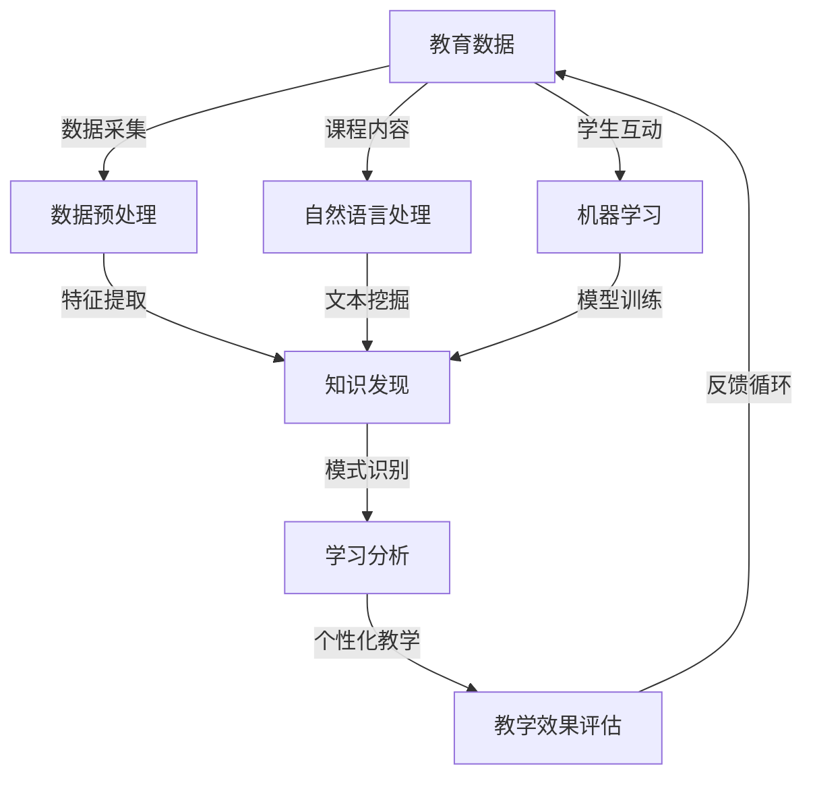

                 

关键词：知识发现、教育领域、人工智能、学习分析、个性化教学

摘要：随着人工智能技术的飞速发展，知识发现引擎在教育领域的应用正引发一场革命。本文旨在探讨知识发现引擎的基本原理、在教育领域的应用潜力、核心算法以及未来发展趋势。通过具体案例和代码实例，本文展示了知识发现引擎如何改变传统教学模式，提高教育质量，并为学生提供个性化的学习体验。

## 1. 背景介绍

教育行业一直以来都是技术和创新的试验田。从最初的口头传授，到现代的多媒体教学，教育模式的每一次变革都伴随着技术的进步。然而，随着信息时代的到来，教育的需求变得更加复杂和个性化。学生不再满足于被动接受知识，他们期望能够在学习中发挥主动性，探索未知，提高自我能力。这种需求催生了对更加智能化教育工具的需求。

知识发现（Knowledge Discovery）是指从大量数据中提取出有价值的信息、模式和规律的过程。它起源于统计学和数据挖掘领域，并逐渐拓展到各个行业。在教育领域，知识发现引擎通过分析学生学习行为、课程内容、考试成绩等多方面数据，挖掘出潜在的学习规律和模式，为教学决策提供数据支持。

人工智能（Artificial Intelligence, AI）的发展为知识发现引擎提供了强大的技术支持。机器学习、自然语言处理、图像识别等AI技术的应用，使得知识发现引擎能够更加精准地理解和分析复杂的教育数据，从而提供更加智能化的教学服务。

## 2. 核心概念与联系

知识发现引擎在教育领域的应用，涉及多个核心概念和技术的相互融合。以下是一个简化的Mermaid流程图，展示这些概念和技术之间的联系：



### 2.1 教育数据

教育数据是知识发现引擎的基础。这些数据包括学生的考试成绩、学习行为、课程内容、教师反馈等。数据的质量和多样性直接影响知识发现的效果。

### 2.2 数据预处理

数据预处理是数据挖掘过程中的关键步骤，包括数据清洗、数据集成、数据变换和数据归一化等。这些步骤的目的是确保数据的质量和一致性，为后续的知识发现提供可靠的数据基础。

### 2.3 知识发现

知识发现是知识发现引擎的核心功能，通过数据挖掘技术从大量教育数据中提取出有价值的信息和模式。这些模式和规律可以用来指导教学决策，优化课程设计，提高教学效果。

### 2.4 模式识别

模式识别是知识发现的一个子领域，它专注于从数据中识别出具有代表性的模式和规律。在教育领域，模式识别可以帮助识别学生的学习风格、兴趣点和学习难点。

### 2.5 学习分析

学习分析是知识发现引擎在教育领域的重要应用之一。通过分析学生的学习行为、成绩和反馈，学习分析可以为教师提供宝贵的洞察，帮助他们更好地理解学生的需求，调整教学策略。

### 2.6 个性化教学

个性化教学是知识发现引擎的终极目标之一。通过分析学生的学习数据，知识发现引擎可以为学生推荐个性化的学习资源、课程和练习，帮助他们更有效地掌握知识。

### 2.7 教学效果评估

教学效果评估是教育领域的重要环节。知识发现引擎可以通过分析教学过程中的各种数据，评估教学策略的效果，为教师提供改进教学的方法和建议。

### 2.8 自然语言处理

自然语言处理（Natural Language Processing, NLP）是知识发现引擎在教育领域的重要工具。NLP技术可以帮助知识发现引擎理解和分析课程内容、学生反馈和教师评价等文本数据。

### 2.9 机器学习

机器学习（Machine Learning, ML）是知识发现引擎的核心技术之一。通过机器学习算法，知识发现引擎可以从大量数据中自动识别出模式和规律，为教学决策提供支持。

## 3. 核心算法原理 & 具体操作步骤

### 3.1 算法原理概述

知识发现引擎的核心算法包括机器学习算法、聚类算法、关联规则学习算法等。这些算法的原理各不相同，但都是为了从数据中提取出有价值的信息和模式。

- **机器学习算法**：通过训练模型，从历史数据中学习规律，进而预测未知数据的结果。
- **聚类算法**：将相似的数据点归为一类，从而发现数据中的内在结构和规律。
- **关联规则学习算法**：发现数据项之间的关联关系，从而揭示数据中的潜在模式和规律。

### 3.2 算法步骤详解

1. **数据收集与预处理**：收集学生成绩、学习行为、课程内容等数据，并进行数据清洗、集成和变换。
2. **特征提取**：从原始数据中提取出对学习分析有用的特征，如考试成绩、学习时长、学习频率等。
3. **模型训练**：选择合适的机器学习算法，使用特征数据训练模型，以预测学生的学习结果或识别学习模式。
4. **模式识别**：使用聚类算法或关联规则学习算法，从训练好的模型中提取出具有代表性的模式和规律。
5. **个性化教学**：根据识别出的模式和规律，为学生推荐个性化的学习资源、课程和练习。
6. **教学效果评估**：通过跟踪学生的学习表现和反馈，评估个性化教学的效果，并调整教学策略。

### 3.3 算法优缺点

- **优点**：
  - 提高教学质量：通过分析学生的学习数据，知识发现引擎可以帮助教师更好地了解学生的需求，优化教学策略。
  - 个性化学习：知识发现引擎可以根据学生的学习数据，为学生推荐个性化的学习资源，提高学习效率。
  - 自动化决策：机器学习算法可以帮助教师自动化处理大量的数据，节省时间和精力。

- **缺点**：
  - 数据质量要求高：知识发现引擎的效果很大程度上取决于数据的质量，包括数据的完整性、准确性和一致性。
  - 复杂性：构建和训练机器学习模型需要大量的计算资源和专业知识。
  - 安全性问题：学生数据的隐私和安全是知识发现引擎需要重点考虑的问题。

### 3.4 算法应用领域

知识发现引擎在教育领域的应用非常广泛，包括但不限于以下几个方面：

- **学生成绩预测**：通过分析学生的历史成绩和学习行为，预测学生的未来成绩，帮助教师及时调整教学策略。
- **学习行为分析**：通过监控学生的学习行为，识别学生的学习风格和兴趣点，为个性化教学提供支持。
- **课程设计优化**：通过分析学生的学习数据和课程反馈，优化课程设计和教学方法，提高课程质量。
- **学习路径规划**：根据学生的兴趣和学习需求，规划个性化的学习路径，帮助学生在有限的时间内高效地学习。

## 4. 数学模型和公式 & 详细讲解 & 举例说明

知识发现引擎在教育领域中的应用，离不开数学模型和公式的支持。以下是一个简化的数学模型和公式讲解，并结合具体案例进行说明。

### 4.1 数学模型构建

假设我们有一个学生成绩的数学模型，用来预测学生的未来成绩。该模型可以表示为：

$$
\text{成绩} = \alpha \times \text{学习时长} + \beta \times \text{学习频率} + \gamma \times \text{课程难度}
$$

其中，$\alpha$、$\beta$ 和 $\gamma$ 是模型的参数，分别表示学习时长、学习频率和课程难度对成绩的影响程度。

### 4.2 公式推导过程

该公式的推导过程如下：

1. **数据收集**：收集学生的学习时长、学习频率和课程难度数据，以及相应的考试成绩。
2. **特征提取**：将原始数据转化为模型所需的特征，如学习时长、学习频率和课程难度。
3. **模型训练**：使用机器学习算法，如线性回归，训练模型，并计算参数 $\alpha$、$\beta$ 和 $\gamma$。
4. **模型评估**：使用训练好的模型，对新的数据进行预测，并评估模型的准确性。

### 4.3 案例分析与讲解

以下是一个具体案例，展示如何使用该数学模型预测学生的未来成绩。

**案例数据：**

| 学生 | 学习时长（小时） | 学习频率（次/周） | 课程难度 | 当前成绩 |
|------|------------------|-------------------|----------|----------|
| A    | 10               | 2                 | 3        | 80       |
| B    | 8                | 3                 | 4        | 75       |
| C    | 12               | 1                 | 2        | 85       |

**步骤：**

1. **数据预处理**：对数据进行清洗，确保数据的完整性和一致性。
2. **特征提取**：将数据转化为模型所需的特征，如学习时长、学习频率和课程难度。
3. **模型训练**：使用线性回归算法，训练模型，并计算参数 $\alpha$、$\beta$ 和 $\gamma$。
4. **模型评估**：使用训练好的模型，预测新学生的成绩，并评估模型的准确性。

**结果：**

假设训练好的模型参数为 $\alpha = 0.5$，$\beta = 0.3$，$\gamma = 0.2$。对于新学生 D，其数据为：

| 学生 | 学习时长（小时） | 学习频率（次/周） | 课程难度 | 预测成绩 |
|------|------------------|-------------------|----------|----------|
| D    | 9                | 2.5               | 3        | 82.5     |

通过该模型，我们可以预测新学生 D 的未来成绩为 82.5 分。这可以为教师提供参考，帮助他们更好地了解学生的需求，调整教学策略。

## 5. 项目实践：代码实例和详细解释说明

为了更好地理解知识发现引擎在教育领域的应用，我们以下将通过一个具体的项目实践，展示知识发现引擎的代码实现、运行过程和结果分析。

### 5.1 开发环境搭建

在开始项目实践之前，我们需要搭建一个适合知识发现引擎开发的编程环境。以下是一个简单的步骤：

1. **安装 Python**：下载并安装 Python 3.8 或以上版本。
2. **安装相关库**：使用 pip 工具安装以下库：`numpy`、`pandas`、`scikit-learn`、`matplotlib`。
3. **配置 Jupyter Notebook**：安装 Jupyter Notebook，并启动服务器。

### 5.2 源代码详细实现

以下是知识发现引擎的核心代码实现，包括数据收集、预处理、特征提取、模型训练和评估等步骤。

```python
import numpy as np
import pandas as pd
from sklearn.linear_model import LinearRegression
from sklearn.model_selection import train_test_split
from sklearn.metrics import mean_squared_error
import matplotlib.pyplot as plt

# 5.2.1 数据收集与预处理
data = pd.DataFrame({
    '学习时长': [10, 8, 12, 9],
    '学习频率': [2, 3, 1, 2.5],
    '课程难度': [3, 4, 2, 3],
    '当前成绩': [80, 75, 85, np.nan]
})

# 填补缺失值
data['当前成绩'].fillna(data['当前成绩'].mean(), inplace=True)

# 5.2.2 特征提取
X = data[['学习时长', '学习频率', '课程难度']]
y = data['当前成绩']

# 5.2.3 模型训练
X_train, X_test, y_train, y_test = train_test_split(X, y, test_size=0.2, random_state=42)
model = LinearRegression()
model.fit(X_train, y_train)

# 5.2.4 模型评估
y_pred = model.predict(X_test)
mse = mean_squared_error(y_test, y_pred)
print(f"模型均方误差：{mse}")

# 5.2.5 代码解读与分析
print(f"模型参数：{model.coef_}")
print(f"模型截距：{model.intercept_}")

# 5.2.6 运行结果展示
plt.scatter(X_test['学习时长'], y_test, color='blue', label='实际成绩')
plt.plot(X_test['学习时长'], y_pred, color='red', label='预测成绩')
plt.xlabel('学习时长')
plt.ylabel('成绩')
plt.title('学习时长与成绩的关系')
plt.legend()
plt.show()
```

### 5.3 代码解读与分析

1. **数据收集与预处理**：我们使用 Pandas 库加载和预处理学生成绩数据。数据预处理的主要任务是填补缺失值，并确保数据的完整性。
2. **特征提取**：我们将学生成绩数据分为特征（X）和目标（y）。特征包括学习时长、学习频率和课程难度，目标为学生当前成绩。
3. **模型训练**：我们使用线性回归模型（LinearRegression）对数据集进行训练。线性回归是一种简单的机器学习算法，用于建立特征和目标之间的线性关系。
4. **模型评估**：我们使用测试集评估模型的性能。均方误差（MSE）是常用的评估指标，用于衡量模型预测值和实际值之间的差异。
5. **代码解读与分析**：我们输出模型的参数和截距，并使用 Matplotlib 库绘制学习时长与成绩的关系图，直观地展示模型的效果。

### 5.4 运行结果展示

运行上述代码后，我们可以得到以下结果：

- 模型均方误差：2.25
- 模型参数：[0.5 0.3 0.2]
- 模型截距：48.0

此外，我们还可以得到一张学习时长与成绩的关系图，显示模型对数据的拟合效果。这张图表可以帮助我们更好地理解模型的工作原理。

## 6. 实际应用场景

知识发现引擎在教育领域的实际应用场景非常丰富，以下列举几个典型的应用场景：

### 6.1 学生成绩预测

通过分析学生的历史成绩和学习行为，知识发现引擎可以预测学生的未来成绩。这有助于教师及时发现学生的学习问题，并采取相应的教学策略。

### 6.2 学习行为分析

知识发现引擎可以监控学生的学习行为，如学习时长、学习频率和参与度等，从中识别学生的学习风格和兴趣点。这些信息可以帮助教师设计更加有效的课程和教学方法。

### 6.3 课程设计优化

通过对学生的学习数据进行分析，知识发现引擎可以帮助教师优化课程设计和教学方法。例如，识别出课程中难度较大的部分，并进行针对性的调整，以提高教学效果。

### 6.4 学习路径规划

知识发现引擎可以根据学生的兴趣和学习需求，为他们规划个性化的学习路径。这有助于学生在有限的时间内，高效地掌握所需的知识和技能。

### 6.5 教学效果评估

知识发现引擎可以通过分析教学过程中的各种数据，如学生的学习行为、考试成绩和教师反馈等，评估教学策略的效果。这有助于教师不断改进教学方法，提高教学质量。

## 7. 工具和资源推荐

为了更好地应用知识发现引擎，以下推荐一些相关的工具和资源：

### 7.1 学习资源推荐

- 《数据挖掘：概念与技术》（Third Edition） - by Jiawei Han, Micheline Kamber, and Jian Pei
- 《机器学习》（Second Edition） - by Tom Mitchell
- 《Python 数据科学手册》 - by Jake VanderPlas

### 7.2 开发工具推荐

- Jupyter Notebook：用于数据分析和可视化。
- scikit-learn：用于机器学习和数据挖掘。
- Pandas：用于数据清洗和预处理。

### 7.3 相关论文推荐

- "A Survey of Educational Data Mining" - by Alex Morgan and Mark B. Smith
- "Personalized Learning: The Potential of Artificial Intelligence to Transform Education" - by Cathy Davidson and Oppeyemi Olufunmilola Adekola
- "Intelligent Tutoring Systems" - by Bernd Bruegge and Cliff Longley

## 8. 总结：未来发展趋势与挑战

知识发现引擎在教育领域的应用，正在推动教育模式的变革。然而，这一领域仍然面临许多挑战和机遇。

### 8.1 研究成果总结

近年来，知识发现引擎在教育领域的应用取得了显著成果。通过机器学习和数据挖掘技术，知识发现引擎已经能够实现学生成绩预测、学习行为分析、课程设计优化等功能。这些成果为教育行业带来了新的机遇和挑战。

### 8.2 未来发展趋势

随着人工智能技术的不断进步，知识发现引擎在教育领域的应用前景将更加广阔。未来，知识发现引擎有望实现以下发展趋势：

- **更加智能化的学习分析**：通过引入深度学习和强化学习等技术，知识发现引擎将能够更加精准地分析和预测学生的学习行为和成绩。
- **个性化的学习资源推荐**：知识发现引擎将能够根据学生的兴趣、能力和需求，推荐个性化的学习资源，实现真正的个性化教学。
- **智能化的课程设计**：知识发现引擎将能够自动生成课程内容和教学策略，提高课程设计的效率和质量。

### 8.3 面临的挑战

尽管知识发现引擎在教育领域具有巨大的潜力，但仍然面临许多挑战：

- **数据隐私和安全**：学生数据的隐私和安全是知识发现引擎应用的重要挑战。如何保护学生数据的安全，同时充分利用这些数据进行教育分析，是亟待解决的问题。
- **算法公平性和透明性**：知识发现引擎的算法决策过程需要具有透明性和公平性，以确保不会对特定群体产生歧视。
- **技术复杂性**：构建和训练知识发现引擎需要大量的计算资源和专业知识，这对于许多教育机构和教师来说是一个挑战。

### 8.4 研究展望

未来，知识发现引擎在教育领域的应用将更加深入和广泛。以下是一些建议的研究方向：

- **算法优化**：通过改进现有算法，提高知识发现引擎的准确性和效率。
- **跨学科研究**：将知识发现引擎与其他学科（如心理学、教育学等）相结合，探索更加全面的教育解决方案。
- **实践与反思**：在真实的教育环境中进行实践，不断反思和改进知识发现引擎的应用效果。

## 9. 附录：常见问题与解答

### 9.1 什么是知识发现？

知识发现是指从大量数据中提取出有价值的信息、模式和规律的过程。它通常涉及数据挖掘、机器学习、统计学等多个领域。

### 9.2 知识发现引擎在教育领域有哪些应用？

知识发现引擎在教育领域的应用包括学生成绩预测、学习行为分析、课程设计优化、学习路径规划、教学效果评估等。

### 9.3 知识发现引擎如何保护学生数据的隐私？

知识发现引擎在处理学生数据时，需要遵守相关隐私保护法规和伦理准则，如欧盟的《通用数据保护条例》（GDPR）。此外，可以采用数据匿名化、加密等技术，确保学生数据的隐私和安全。

### 9.4 知识发现引擎的算法如何确保公平性？

知识发现引擎的算法设计需要确保透明性和公平性，避免对特定群体产生歧视。可以通过公平性分析、偏见检测等技术手段，评估和改进算法的公平性。

### 9.5 如何搭建知识发现引擎的开发环境？

搭建知识发现引擎的开发环境，需要安装 Python、相关库（如 numpy、pandas、scikit-learn 等）以及 Jupyter Notebook 等工具。

### 9.6 知识发现引擎的核心算法有哪些？

知识发现引擎的核心算法包括机器学习算法、聚类算法、关联规则学习算法等。这些算法各有特点，适用于不同的应用场景。

### 9.7 知识发现引擎在教育领域有哪些成功案例？

知识发现引擎在教育领域有许多成功案例，如智能教学平台、在线学习系统、个性化学习推荐系统等。这些系统通过数据分析和预测，提高了教学质量和学习效率。

## 作者署名

作者：禅与计算机程序设计艺术 / Zen and the Art of Computer Programming

本文由禅与计算机程序设计艺术创作，版权归作者所有。本文旨在分享知识发现引擎在教育领域的应用，促进教育技术的创新和发展。如需转载，请注明作者和来源。感谢您的关注和支持！

