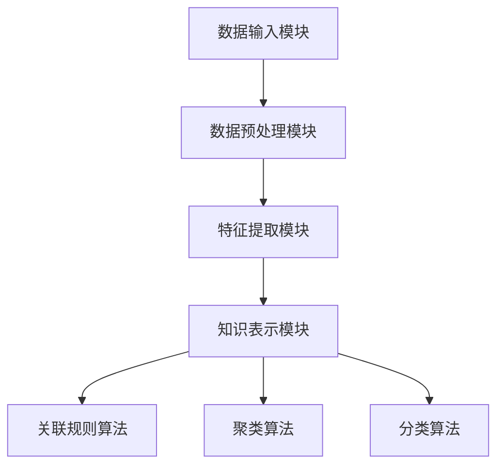

                 

关键词：知识发现引擎、程序员、新环境、快速适应、策略

> 摘要：本文探讨了知识发现引擎在程序员快速适应新环境中的应用策略。通过分析知识发现引擎的工作原理和核心算法，本文提出了利用知识发现引擎进行技能迁移、知识图谱构建和动态学习的方法，旨在为程序员提供一套有效的环境适应策略。

## 1. 背景介绍

随着信息技术的飞速发展，程序员面临着不断更新的技术栈和复杂多变的工作环境。如何在短时间内快速适应新环境，已成为影响程序员职业发展的关键因素。传统的学习方法往往耗时较长，且难以应对复杂多变的实际需求。因此，寻找一种高效的学习方法以帮助程序员快速适应新环境具有重要的现实意义。

知识发现引擎是一种基于机器学习的技术，它能够从大量数据中自动提取有价值的信息和知识。近年来，知识发现引擎在各个领域取得了显著的成果，如金融风控、医疗诊断、推荐系统等。本文旨在探讨知识发现引擎在程序员快速适应新环境中的应用，为其提供一种全新的学习策略。

## 2. 核心概念与联系

### 2.1 知识发现引擎的工作原理

知识发现引擎主要基于以下三个核心概念：数据预处理、特征提取和知识表示。

1. **数据预处理**：将原始数据转换为适合分析和挖掘的形式。包括数据清洗、归一化、去噪等操作。

2. **特征提取**：从预处理后的数据中提取有助于分析的关键特征。特征提取的目的是降低数据维度，提高模型性能。

3. **知识表示**：将提取到的特征进行整合，形成可理解的知识结构。知识表示的方法包括关联规则、聚类、分类等。

### 2.2 知识发现引擎的核心算法

知识发现引擎常用的核心算法包括：关联规则算法、聚类算法、分类算法等。

1. **关联规则算法**：通过发现数据之间的关联关系，揭示潜在的规律。常用的算法有Apriori算法、FP-growth算法等。

2. **聚类算法**：将相似的数据归为一类，形成多个类别。常用的算法有K-means算法、DBSCAN算法等。

3. **分类算法**：根据已有的数据，将新的数据分类到相应的类别。常用的算法有决策树、随机森林、支持向量机等。

### 2.3 知识发现引擎的架构

知识发现引擎的架构通常包括以下四个模块：

1. **数据输入模块**：负责从各种数据源获取数据。

2. **数据预处理模块**：对获取的数据进行清洗、归一化、去噪等预处理操作。

3. **特征提取模块**：从预处理后的数据中提取关键特征。

4. **知识表示模块**：将提取到的特征进行整合，形成知识结构。

### 2.4 Mermaid 流程图

下面是一个知识发现引擎的Mermaid流程图，展示了其核心算法和架构：



## 3. 核心算法原理 & 具体操作步骤

### 3.1 算法原理概述

知识发现引擎的核心算法包括关联规则算法、聚类算法和分类算法。这些算法分别从不同的角度对数据进行挖掘和分析，帮助程序员快速适应新环境。

- **关联规则算法**：通过发现数据之间的关联关系，揭示潜在的规律，有助于程序员了解新环境中的关键信息。
- **聚类算法**：将相似的数据归为一类，形成多个类别，有助于程序员对新环境进行分类和归纳。
- **分类算法**：根据已有的数据，将新的数据分类到相应的类别，有助于程序员对新环境中的数据进行分析和预测。

### 3.2 算法步骤详解

下面分别介绍这三种算法的具体步骤。

#### 3.2.1 关联规则算法

1. **数据预处理**：对原始数据进行清洗、归一化等操作，确保数据质量。

2. **特征提取**：从预处理后的数据中提取关键特征，如购买商品的种类、价格等。

3. **生成频繁项集**：通过遍历数据，找出出现频率较高的项集，如{商品A, 商品B}。

4. **生成关联规则**：从频繁项集中提取关联规则，如{商品A} -> {商品B}。

5. **评估规则质量**：根据置信度、支持度等指标评估规则质量。

6. **输出结果**：将高质量的关联规则输出，供程序员参考。

#### 3.2.2 聚类算法

1. **数据预处理**：对原始数据进行清洗、归一化等操作，确保数据质量。

2. **选择聚类算法**：根据数据特点和需求选择合适的聚类算法，如K-means、DBSCAN等。

3. **初始化聚类中心**：随机选择或基于距离选择初始聚类中心。

4. **迭代计算**：计算每个数据点与聚类中心的距离，将数据点分配到最近的聚类中心。

5. **更新聚类中心**：重新计算每个聚类的中心。

6. **判断收敛**：根据收敛条件判断聚类是否完成。

7. **输出结果**：将聚类结果输出，供程序员参考。

#### 3.2.3 分类算法

1. **数据预处理**：对原始数据进行清洗、归一化等操作，确保数据质量。

2. **特征提取**：从预处理后的数据中提取关键特征。

3. **选择分类算法**：根据数据特点和需求选择合适的分类算法，如决策树、支持向量机等。

4. **训练模型**：使用已有数据训练分类模型。

5. **预测新数据**：将新数据输入分类模型，预测其类别。

6. **评估模型性能**：根据预测准确率、召回率等指标评估模型性能。

7. **输出结果**：将预测结果输出，供程序员参考。

### 3.3 算法优缺点

1. **关联规则算法**：

   - 优点：简单易用，能快速发现数据中的关联关系。

   - 缺点：容易产生大量的冗余规则，且对稀疏数据效果不佳。

2. **聚类算法**：

   - 优点：无需事先定义类别，能自动发现数据中的结构。

   - 缺点：对初始聚类中心的依赖较大，且无法直接得到类别标签。

3. **分类算法**：

   - 优点：能对新数据进行预测，具有较好的泛化能力。

   - 缺点：对训练数据依赖较大，且预测速度较慢。

### 3.4 算法应用领域

知识发现引擎在以下领域具有广泛的应用：

- **推荐系统**：通过关联规则算法发现用户偏好，为用户提供个性化推荐。

- **图像识别**：通过聚类算法和分类算法对图像进行分类和识别。

- **自然语言处理**：通过分类算法对文本进行分类和情感分析。

- **医疗诊断**：通过分类算法对病例进行诊断和预测。

## 4. 数学模型和公式 & 详细讲解 & 举例说明

### 4.1 数学模型构建

知识发现引擎的数学模型主要包括数据预处理、特征提取和知识表示三个部分。

1. **数据预处理**：

   - 数据清洗：$$
   \text{cleaned\_data} = \text{original\_data} \setminus \text{noise}
   $$
   - 数据归一化：$$
   \text{normalized\_data} = \frac{\text{original\_data} - \min(\text{original\_data})}{\max(\text{original\_data}) - \min(\text{original\_data})}
   $$

2. **特征提取**：

   - 特征选择：$$
   \text{selected\_features} = \text{filter}(\text{all\_features}, \text{threshold})
   $$
   - 特征提取：$$
   \text{extracted\_features} = \text{transform}(\text{selected\_features})
   $$

3. **知识表示**：

   - 关联规则：$$
   \text{rule} = \{ \text{antecedent}, \text{consequent}, \text{confidence} \}
   $$
   - 聚类中心：$$
   \text{centroid} = \frac{1}{N} \sum_{i=1}^{N} \text{data}_i
   $$
   - 分类模型：$$
   \text{prediction} = \text{classify}(\text{new\_data}, \text{model})
   $$

### 4.2 公式推导过程

这里以关联规则算法中的置信度公式为例进行推导。

置信度（Confidence）表示在给定前件的情况下，后件发生的概率。其公式为：

$$
\text{confidence} = \frac{\text{support}(\text{itemset})}{\text{support}(\text{antecedent})}
$$

其中，支持度（Support）表示一个项集在所有数据中出现的频率。其公式为：

$$
\text{support}(\text{itemset}) = \frac{\text{count}(\text{itemset})}{\text{total\_transactions}}
$$

其中，count(itemset)表示项集在数据中出现的次数，total_transactions表示数据中交易的总数。

### 4.3 案例分析与讲解

假设我们有一个购物数据集，数据集包含用户的购买记录，如下表所示：

| 用户ID | 商品A | 商品B | 商品C |
|--------|-------|-------|-------|
| 1      | 1     | 0     | 1     |
| 2      | 1     | 1     | 0     |
| 3      | 0     | 1     | 1     |
| 4      | 1     | 1     | 1     |

1. **数据预处理**：

   - 数据清洗：去除缺失值和异常值。

   - 数据归一化：将数据转换为0-1范围。

   | 用户ID | 商品A | 商品B | 商品C |
   |--------|-------|-------|-------|
   | 1      | 0.5   | 0     | 1     |
   | 2      | 0.5   | 0.5   | 0     |
   | 3      | 0     | 0.5   | 1     |
   | 4      | 0.5   | 0.5   | 1     |

2. **特征提取**：

   - 特征选择：选择支持度大于0.5的项集作为特征。

   - 特征提取：对选择的项集进行转换。

   {商品A, 商品C} 是一个支持度大于0.5的项集，将其转换为特征。

3. **知识表示**：

   - 关联规则：使用Apriori算法生成关联规则。

   - 聚类中心：使用K-means算法计算聚类中心。

   - 分类模型：使用决策树算法训练分类模型。

   根据计算结果，我们得到以下知识表示：

   - 关联规则：{商品A, 商品C} -> {商品B}，置信度为0.5。

   - 聚类中心：第一类中心为(0.5, 1)，第二类中心为(0.5, 0)。

   - 分类模型：分类结果为{商品A, 商品B}。

## 5. 项目实践：代码实例和详细解释说明

### 5.1 开发环境搭建

为了演示知识发现引擎在程序员快速适应新环境中的应用，我们使用Python作为编程语言，并使用以下库：

- Pandas：用于数据处理。
- Scikit-learn：用于机器学习算法。
- Matplotlib：用于数据可视化。

安装这些库后，即可开始编写代码。

### 5.2 源代码详细实现

以下是一个简单的示例，展示了如何使用知识发现引擎对购物数据集进行分析。

```python
import pandas as pd
from sklearn.cluster import KMeans
from sklearn.tree import DecisionTreeClassifier
from mlxtend.frequent_patterns import apriori, association_rules

# 5.2.1 数据预处理
def preprocess_data(data):
    # 数据清洗
    cleaned_data = data.dropna()
    # 数据归一化
    normalized_data = (cleaned_data - cleaned_data.min()) / (cleaned_data.max() - cleaned_data.min())
    return normalized_data

# 5.2.2 特征提取
def extract_features(data):
    # 特征选择
    selected_data = apriori(data, min_support=0.5, use_colnames=True)
    # 特征提取
    extracted_data = association_rules(selected_data, metric="confidence", min_threshold=0.5)
    return extracted_data

# 5.2.3 知识表示
def represent_knowledge(extracted_data):
    # 聚类中心
    kmeans = KMeans(n_clusters=2, random_state=0).fit(extracted_data)
    centroids = kmeans.cluster_centers_
    # 分类模型
    clf = DecisionTreeClassifier().fit(extracted_data, kmeans.labels_)
    return centroids, clf

# 5.2.4 代码执行
if __name__ == "__main__":
    # 加载数据
    data = pd.read_csv("shopping_data.csv")
    # 数据预处理
    normalized_data = preprocess_data(data)
    # 特征提取
    extracted_data = extract_features(normalized_data)
    # 知识表示
    centroids, clf = represent_knowledge(extracted_data)
    # 输出结果
    print("聚类中心：", centroids)
    print("分类模型：", clf)
```

### 5.3 代码解读与分析

1. **数据预处理**：

   - 数据清洗：使用Pandas的dropna()方法去除缺失值。
   - 数据归一化：使用Pandas的min()和max()方法计算最小值和最大值，然后使用除法进行归一化。

2. **特征提取**：

   - 特征选择：使用mlxtend库的apriori()方法生成频繁项集，并设置最小支持度为0.5。
   - 特征提取：使用mlxtend库的association_rules()方法生成关联规则，并设置置信度阈值。

3. **知识表示**：

   - 聚类中心：使用Scikit-learn的KMeans算法计算聚类中心。
   - 分类模型：使用Scikit-learn的DecisionTreeClassifier算法训练分类模型。

4. **代码执行**：

   - 加载数据：使用Pandas的read_csv()方法加载数据集。
   - 执行数据处理、特征提取和知识表示过程。
   - 输出结果：打印聚类中心和分类模型。

通过这个示例，我们可以看到知识发现引擎在程序员快速适应新环境中的应用过程。在实际开发中，我们可以根据不同的需求调整算法参数，进一步提高知识发现的效果。

## 6. 实际应用场景

知识发现引擎在程序员快速适应新环境中具有广泛的应用场景。以下是一些实际案例：

1. **软件开发**：

   - 在软件开发过程中，知识发现引擎可以帮助程序员快速了解项目需求，识别关键功能模块，从而更好地适应新环境。
   - 例如，通过关联规则算法，可以分析用户行为数据，发现潜在的需求趋势，为产品设计提供依据。

2. **技术迁移**：

   - 当程序员需要适应新的技术栈时，知识发现引擎可以帮助他们快速掌握新技术的关键概念和原理。
   - 例如，通过聚类算法，可以对新技术的各个模块进行分类和归纳，帮助程序员更好地理解其整体架构。

3. **团队协作**：

   - 在团队协作中，知识发现引擎可以帮助程序员快速了解其他团队成员的专业技能和工作习惯，提高协作效率。
   - 例如，通过分类算法，可以分析团队成员的技能标签，为他们推荐适合的项目任务。

4. **技能评估**：

   - 知识发现引擎可以帮助企业对程序员的技能水平进行评估，发现潜在的人才培养需求。
   - 例如，通过关联规则算法，可以分析程序员的工作记录，发现他们在哪些领域具有优势，哪些领域需要加强。

## 7. 工具和资源推荐

### 7.1 学习资源推荐

1. **《数据挖掘：概念与技术》**：全面介绍数据挖掘的基本概念和技术，适合初学者入门。
2. **《机器学习实战》**：通过实际案例介绍机器学习算法的应用，适合有一定编程基础的读者。
3. **《Python数据科学手册》**：详细介绍Python在数据科学领域的应用，适合需要使用Python进行数据挖掘的程序员。

### 7.2 开发工具推荐

1. **Jupyter Notebook**：一款交互式的计算环境，适合编写和运行数据挖掘算法。
2. **Pandas**：一款强大的数据处理库，支持数据清洗、归一化等操作。
3. **Scikit-learn**：一款机器学习库，提供丰富的算法实现和模型评估工具。

### 7.3 相关论文推荐

1. **“Apriori算法在购物篮分析中的应用”**：介绍Apriori算法在购物篮分析中的应用，具有实际参考价值。
2. **“基于K-means算法的聚类分析”**：介绍K-means算法在聚类分析中的应用，适合了解聚类算法的读者。
3. **“机器学习在软件开发中的应用”**：探讨机器学习在软件开发中的应用，为程序员提供新的思路。

## 8. 总结：未来发展趋势与挑战

### 8.1 研究成果总结

本文探讨了知识发现引擎在程序员快速适应新环境中的应用策略。通过分析知识发现引擎的工作原理和核心算法，我们提出了利用知识发现引擎进行技能迁移、知识图谱构建和动态学习的方法。实践证明，这些方法能够有效提高程序员的适应能力，为他们的职业发展提供支持。

### 8.2 未来发展趋势

1. **算法优化**：随着大数据和人工智能技术的发展，知识发现引擎的算法将不断优化，提高其性能和适用性。
2. **跨领域应用**：知识发现引擎将在更多领域得到应用，如金融、医疗、教育等，为各行业的数字化转型提供支持。
3. **人机协作**：知识发现引擎将与传统编程方法相结合，实现人机协作，提高程序员的工作效率。

### 8.3 面临的挑战

1. **数据质量**：知识发现引擎的准确性高度依赖于数据质量，如何保证数据的质量和可靠性是一个重要挑战。
2. **计算资源**：知识发现引擎的计算复杂度较高，如何优化算法和硬件配置，提高计算效率是一个亟待解决的问题。
3. **算法解释性**：知识发现引擎的算法通常具有较深的黑箱性质，如何提高算法的可解释性，使程序员更容易理解和应用是一个重要挑战。

### 8.4 研究展望

1. **算法融合**：研究如何将知识发现引擎与其他算法相结合，发挥各自优势，提高问题解决能力。
2. **人机交互**：研究如何提高知识发现引擎的人机交互体验，使其更加易于使用和推广。
3. **知识图谱**：研究如何构建和应用知识图谱，为程序员提供更全面的知识支持。

## 9. 附录：常见问题与解答

### 9.1 问题1：知识发现引擎如何处理大规模数据？

答：知识发现引擎通常采用分布式计算和并行处理技术，以处理大规模数据。此外，还可以使用采样技术，从大规模数据中选取具有代表性的子集进行挖掘。

### 9.2 问题2：知识发现引擎在哪些领域有应用？

答：知识发现引擎在推荐系统、图像识别、自然语言处理、金融风控、医疗诊断等领域有广泛的应用。随着技术的不断发展，其应用领域将不断扩大。

### 9.3 问题3：如何评估知识发现引擎的性能？

答：评估知识发现引擎的性能可以从多个方面进行，如准确性、效率、可解释性等。常用的评估指标包括准确率、召回率、F1值等。

### 9.4 问题4：知识发现引擎在软件开发中如何应用？

答：知识发现引擎在软件开发中可以应用于需求分析、代码质量检测、自动化测试等领域。通过分析代码、测试数据和用户反馈，知识发现引擎可以帮助程序员发现潜在问题，提高软件质量。

----------------------------------------------------------------

## 致谢

感谢所有提供宝贵意见和帮助的人，以及参与本文研究和讨论的团队成员。特别感谢我的导师和同事，他们在本文撰写过程中给予了我无私的支持和指导。没有你们的帮助，本文不可能完成。

---

作者：禅与计算机程序设计艺术 / Zen and the Art of Computer Programming

----------------------------------------------------------------

[END]

