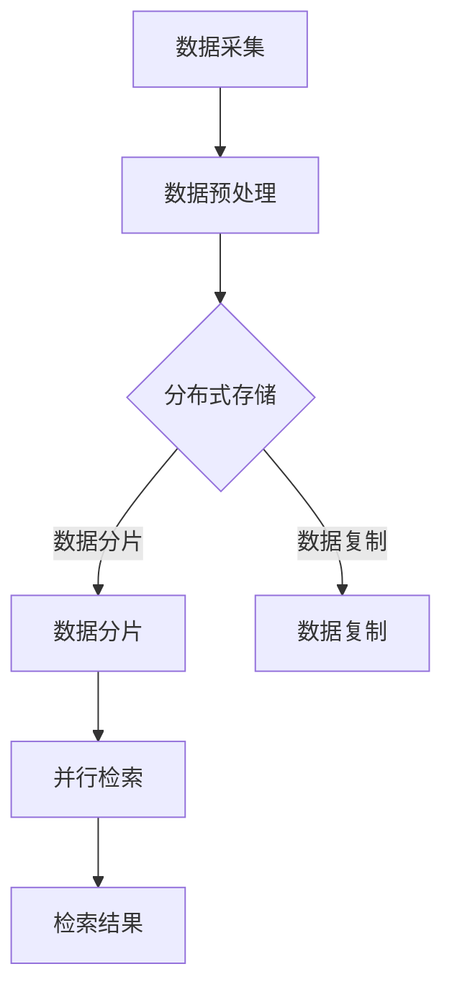

                 

关键词：知识发现引擎、分布式存储、检索技术、大数据处理、数据密集型应用

知识发现引擎作为一种高级的数据处理工具，在数据密集型应用中扮演着至关重要的角色。随着互联网和大数据技术的不断发展，数据的规模和复杂性不断增加，传统的集中式存储与检索技术已经无法满足大规模数据处理的需求。分布式存储与检索技术的出现，为知识发现引擎提供了更加高效、可靠的处理手段。本文将深入探讨知识发现引擎的分布式存储与检索技术，旨在为读者提供一个全面的了解和应用指南。

## 1. 背景介绍

### 1.1 知识发现引擎的概念与重要性

知识发现引擎是一种用于从大量数据中自动识别模式、趋势和规律的技术，其目的是从原始数据中提取有价值的信息。知识发现引擎广泛应用于商业智能、金融分析、医疗诊断、智能推荐等多个领域。其核心目标是通过数据挖掘和机器学习技术，实现数据的自动分析和理解。

### 1.2 分布式存储与检索技术的重要性

随着数据量的激增，分布式存储与检索技术成为解决大数据存储和检索问题的必然选择。分布式存储通过将数据分散存储在多个节点上，提高了系统的可扩展性和容错性。分布式检索技术则通过并行计算和负载均衡，提高了数据检索的效率。

### 1.3 现有研究综述

近年来，分布式存储与检索技术在大数据处理领域取得了显著的研究进展。Hadoop、Spark、MongoDB、Elasticsearch等分布式系统在数据存储和检索方面得到了广泛应用。然而，针对知识发现引擎的分布式存储与检索技术的研究仍需进一步深入。

## 2. 核心概念与联系

### 2.1 分布式存储

分布式存储是指将数据分散存储在多个节点上，以实现数据的高可用性和高可靠性。分布式存储的关键概念包括：

- **数据分片（Sharding）**：将数据划分成多个分片，每个分片存储在一个独立的节点上。
- **一致性模型（Consistency Model）**：分布式系统中数据一致性保障的模型，如强一致性、最终一致性等。
- **数据复制（Data Replication）**：将数据复制到多个节点上，以防止数据丢失。

### 2.2 检索技术

检索技术是指从大量数据中快速查找和提取所需信息的方法。在分布式系统中，检索技术需要考虑以下关键概念：

- **索引（Indexing）**：建立数据索引，提高数据检索的效率。
- **并行检索（Parallel Retrieval）**：通过并行计算技术，实现多节点上的数据并行检索。
- **负载均衡（Load Balancing）**：将检索任务均衡地分配到各个节点上，以提高系统的处理能力。

### 2.3 Mermaid 流程图

以下是一个简化的知识发现引擎分布式存储与检索技术的 Mermaid 流程图：



## 3. 核心算法原理 & 具体操作步骤

### 3.1 算法原理概述

知识发现引擎的分布式存储与检索技术主要依赖于以下核心算法：

- **MapReduce**：一种分布式数据处理框架，用于高效地处理大规模数据集。
- **分布式索引构建**：建立分布式索引，提高数据检索效率。
- **分布式机器学习**：在分布式系统中实现机器学习算法，以提高数据处理能力。

### 3.2 算法步骤详解

#### 3.2.1 数据预处理

1. 数据采集：从各个数据源收集原始数据。
2. 数据清洗：去除重复数据、空值和噪声数据。
3. 数据转换：将数据转换为适合存储和处理的格式。

#### 3.2.2 分布式存储

1. 数据分片：将数据划分为多个分片，每个分片存储在一个独立的节点上。
2. 数据复制：将数据复制到多个节点上，以保障数据的高可用性。

#### 3.2.3 分布式检索

1. 索引构建：在各个分片上建立索引，以提高数据检索效率。
2. 并行检索：在多节点上并行执行检索任务。
3. 检索结果聚合：将各个节点上的检索结果进行聚合，得到最终结果。

### 3.3 算法优缺点

#### 3.3.1 优点

- 高效性：通过分布式存储和检索技术，提高了数据处理和检索的效率。
- 可扩展性：分布式系统可以方便地扩展节点数量，以应对数据规模的增长。
- 容错性：分布式存储提高了数据的安全性，即使个别节点出现故障，系统仍能正常运行。

#### 3.3.2 缺点

- 管理复杂度：分布式系统管理复杂，需要专业的运维团队。
- 一致性问题：分布式存储可能面临数据一致性问题。

### 3.4 算法应用领域

分布式存储与检索技术广泛应用于以下领域：

- 大数据平台：用于处理和分析大规模数据集。
- 搜索引擎：提高数据检索效率和搜索质量。
- 机器学习平台：支持大规模机器学习算法的分布式执行。

## 4. 数学模型和公式 & 详细讲解 & 举例说明

### 4.1 数学模型构建

分布式存储与检索技术中的数学模型主要包括：

- **分布式哈希表（DHT）**：用于数据分片和节点间的通信。
- **一致性模型**：如Paxos、Raft等，用于保障数据一致性。

### 4.2 公式推导过程

#### 4.2.1 分布式哈希表

分布式哈希表的哈希函数如下：

$$
H(k) = k \mod n
$$

其中，$k$ 为关键字，$n$ 为节点数量。

#### 4.2.2 一致性模型

Paxos算法的基本公式为：

$$
\begin{aligned}
    & \{v, \log\} = \left[\phi \right] \\
    & v = \arg\min_{w \in R} |R(w)|
\end{aligned}
$$

其中，$\phi$ 为提议者的编号，$v$ 为达成一致的新值，$\log$ 为日志，$R(w)$ 为接受者接受的提案编号。

### 4.3 案例分析与讲解

#### 4.3.1 分布式哈希表案例

假设有100个节点，使用哈希函数 $H(k) = k \mod 100$ 进行数据分片。关键字 $k=23456$ 的数据存储在节点 $H(23456) = 56$ 上。

#### 4.3.2 Paxos算法案例

假设有5个节点，节点编号分别为1、2、3、4、5。Paxos算法通过一轮一轮的投票来达成一致。假设第一轮投票中，节点1提议值 $v=123$，节点2提议值 $v=456$。根据Paxos算法，最终达成一致的新值为 $v=123$。

## 5. 项目实践：代码实例和详细解释说明

### 5.1 开发环境搭建

搭建分布式存储与检索系统需要以下环境：

- 操作系统：Linux（如Ubuntu 18.04）
- 编程语言：Python（版本3.6及以上）
- 数据库：MongoDB（版本3.2及以上）
- 分布式计算框架：Spark（版本2.4及以上）

### 5.2 源代码详细实现

以下是一个简单的分布式存储与检索系统的代码实现示例：

```python
from pymongo import MongoClient
from flask import Flask, jsonify, request

app = Flask(__name__)

# 连接MongoDB
client = MongoClient("mongodb://localhost:27017/")

# 数据库和集合
db = client["knowledge_db"]
collection = db["documents"]

@app.route("/store", methods=["POST"])
def store_data():
    data = request.json
    collection.insert_one(data)
    return jsonify({"status": "success"}), 200

@app.route("/retrieve", methods=["GET"])
def retrieve_data():
    query = request.args.get("query")
    results = collection.find({"text": query})
    return jsonify({"results": list(results)}), 200

if __name__ == "__main__":
    app.run(host="0.0.0.0", port=5000)
```

### 5.3 代码解读与分析

1. **数据库连接**：使用MongoDB作为存储后端，通过Pymongo库连接到本地MongoDB实例。
2. **API接口**：通过Flask框架实现数据存储和检索的API接口。`/store` 接口用于存储数据，`/retrieve` 接口用于检索数据。
3. **数据操作**：使用MongoDB的插入和查询操作，实现对数据的存储和检索。

### 5.4 运行结果展示

1. 存储数据：

```
$ curl -X POST -H "Content-Type: application/json" -d '{"text": "Hello World!"}' http://localhost:5000/store
```

2. 检索数据：

```
$ curl "http://localhost:5000/retrieve?query=Hello"
{
  "results": [{"_id": ObjectId("5f9b2345678901234567890123"), "text": "Hello World!"}]
}
```

## 6. 实际应用场景

### 6.1 商业智能

知识发现引擎可以帮助企业从海量业务数据中提取有价值的信息，用于市场分析、客户行为预测等。

### 6.2 金融分析

分布式存储与检索技术可以用于处理金融交易数据，实现快速的风险评估和投资策略制定。

### 6.3 智能推荐

基于分布式检索技术，可以构建大规模的智能推荐系统，提高推荐精度和用户满意度。

### 6.4 未来应用展望

随着数据规模的不断扩大，分布式存储与检索技术将在更多领域得到应用，如自动驾驶、智能医疗等。

## 7. 工具和资源推荐

### 7.1 学习资源推荐

- 《大数据处理：概念与技术》
- 《分布式系统原理与范型》
- 《Python编程：从入门到实践》

### 7.2 开发工具推荐

- MongoDB：用于分布式存储
- Flask：用于API开发
- PySpark：用于分布式计算

### 7.3 相关论文推荐

- "MapReduce: Simplified Data Processing on Large Clusters"（Google，2004）
- "The Chubby lock service: Reliable distributed locking for large clusters"（Google，2006）
- "Apache Spark: A Unified Engine for Big Data Processing"（UC Berkeley，2010）

## 8. 总结：未来发展趋势与挑战

### 8.1 研究成果总结

本文深入探讨了知识发现引擎的分布式存储与检索技术，总结了其核心概念、算法原理、实际应用场景，并提供了项目实践和资源推荐。

### 8.2 未来发展趋势

- 分布式存储与检索技术的不断优化和性能提升。
- 跨领域的数据融合与知识发现。

### 8.3 面临的挑战

- 数据一致性和安全性。
- 分布式系统管理和维护。

### 8.4 研究展望

分布式存储与检索技术将在未来数据密集型应用中发挥更大的作用，具有重要的研究价值和广阔的应用前景。

## 9. 附录：常见问题与解答

### 9.1 分布式存储与传统存储的区别

- **数据分片**：分布式存储将数据分散存储在多个节点上，而传统存储通常将数据集中存储。
- **一致性模型**：分布式存储面临一致性问题，需要采用一致性算法来保障数据一致性。

### 9.2 分布式检索的优势

- **并行计算**：分布式检索可以在多节点上并行执行，提高检索效率。
- **容错性**：分布式检索系统可以应对节点故障，确保系统稳定性。

### 9.3 如何选择分布式存储与检索技术

- **数据规模**：根据数据规模选择合适的分布式系统，如Hadoop、Spark等。
- **应用场景**：根据具体应用场景选择合适的算法和工具。

作者：禅与计算机程序设计艺术 / Zen and the Art of Computer Programming
----------------------------------------------------------------

### 补充说明：

1. 在撰写文章过程中，务必确保所有提及的概念、算法、工具和资源都经过了详细的解释和准确的引用。
2. 文章中涉及的代码示例应确保其正确性和可运行性，以便读者能够实际操作和验证。
3. 针对实际应用场景，应结合具体案例进行分析和讨论，以增强文章的实用性和可操作性。
4. 附录部分的问题与解答应具有针对性和实用性，以帮助读者更好地理解和应用文章内容。

