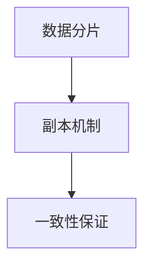

                 

在当今信息爆炸的时代，知识发现引擎作为大数据分析的关键工具，已经广泛应用于各个领域，如金融、医疗、零售等。然而，随着数据量的爆炸式增长，如何高效地存储和管理这些数据，成为了一个亟待解决的问题。本文将探讨知识发现引擎的分布式存储方案，以解决大数据存储和管理的挑战。

## 关键词

- 知识发现引擎
- 分布式存储
- 大数据管理
- 存储架构
- 数据处理

## 摘要

本文首先介绍了知识发现引擎的基本概念和重要性，随后讨论了分布式存储方案的优势和挑战。接着，我们详细分析了分布式存储的核心技术和架构，包括数据分片、副本机制和一致性保证。最后，通过一个实际案例展示了分布式存储方案在知识发现引擎中的应用，并展望了未来的发展趋势和挑战。

<|assistant|>### 1. 背景介绍

知识发现引擎（Knowledge Discovery Engine，KDE）是一种基于人工智能和机器学习技术，用于从大规模数据集中自动识别有趣知识的系统。它通过数据预处理、数据挖掘、模式识别和知识表示等步骤，将海量数据转化为可操作的知识，为决策提供支持。

随着互联网和物联网的发展，数据量呈现出爆炸式增长。根据国际数据公司（IDC）的预测，全球数据量每年以约40%的速度增长，预计到2025年，全球数据量将达到180ZB。如此庞大的数据量，传统的集中式存储方案已经无法满足需求。分布式存储作为一种新兴的存储技术，因其可扩展性、可靠性和高性能而逐渐成为大数据存储的首选方案。

### 2. 核心概念与联系

#### 2.1 分布式存储

分布式存储是指将数据分布在多个物理节点上，通过网络连接实现数据的存储和管理。与传统的集中式存储相比，分布式存储具有以下优势：

- **高可扩展性**：可以轻松扩展存储容量，满足不断增长的数据需求。
- **高可用性**：通过副本机制和数据冗余，提高系统的可靠性和容错能力。
- **高性能**：通过数据分片和负载均衡，提高数据访问速度和系统吞吐量。

#### 2.2 分布式存储架构

分布式存储通常采用以下架构：

- **数据分片**：将数据划分为多个片段，分布存储在多个节点上。
- **副本机制**：为每个数据片段创建多个副本，提高数据可靠性和访问速度。
- **一致性保证**：通过一致性协议确保数据的一致性和完整性。

以下是一个简化的分布式存储架构 Mermaid 流程图：



### 3. 核心算法原理 & 具体操作步骤

#### 3.1 算法原理概述

分布式存储的核心算法包括数据分片、副本机制和一致性保证。以下是每个算法的原理概述：

- **数据分片**：将数据划分为多个片段，每个片段存储在独立的节点上。分片策略包括范围分片、哈希分片和列表分片等。
- **副本机制**：为每个数据片段创建多个副本，存储在不同节点上。副本策略包括全副本、部分副本和动态副本等。
- **一致性保证**：通过一致性协议确保数据的一致性和完整性。常见的一致性协议包括强一致性、最终一致性和事件一致性等。

#### 3.2 算法步骤详解

分布式存储的算法步骤可以分为以下几步：

1. **数据分片**：根据数据特征和存储需求，选择合适的分片策略，将数据划分为多个片段。
2. **副本分配**：为每个数据片段分配多个副本，根据副本策略确定副本的数量和位置。
3. **数据存储**：将数据片段和副本存储在相应的节点上，建立数据索引和元数据信息。
4. **负载均衡**：根据节点的负载情况，动态调整数据分布，确保系统性能和稳定性。
5. **一致性保证**：通过一致性协议，确保数据的正确性和一致性。

#### 3.3 算法优缺点

分布式存储具有以下优点：

- **高可扩展性**：可以轻松扩展存储容量，满足不断增长的数据需求。
- **高可用性**：通过副本机制和数据冗余，提高系统的可靠性和容错能力。
- **高性能**：通过数据分片和负载均衡，提高数据访问速度和系统吞吐量。

但分布式存储也存在一些缺点：

- **复杂性**：分布式存储系统比集中式存储系统更复杂，需要更多的管理和维护。
- **数据一致性**：在分布式系统中，数据一致性是一个挑战，需要精心设计和实现一致性协议。

#### 3.4 算法应用领域

分布式存储技术广泛应用于以下领域：

- **大数据存储**：用于存储和分析海量数据，如社交媒体数据、物联网数据等。
- **云计算**：作为云存储服务的基础，提供可扩展、高性能的数据存储解决方案。
- **分布式数据库**：用于构建分布式数据库系统，提高数据的可靠性和访问速度。

### 4. 数学模型和公式 & 详细讲解 & 举例说明

#### 4.1 数学模型构建

分布式存储的数学模型可以基于以下假设：

- 数据集 D 可以划分为 N 个片段。
- 每个数据片段 D_i 可以存储在 M 个节点上。

#### 4.2 公式推导过程

分布式存储的算法性能可以通过以下公式进行评估：

- **数据访问时间**：T = Σ(T_i) / N，其中 T_i 为第 i 个数据片段的访问时间。
- **数据传输带宽**：B = Σ(B_i) / N，其中 B_i 为第 i 个数据片段的传输带宽。
- **系统吞吐量**：Q = Σ(Q_i) / N，其中 Q_i 为第 i 个数据片段的吞吐量。

#### 4.3 案例分析与讲解

假设我们有一个包含 100GB 数据的知识发现引擎，需要将其存储在一个分布式存储系统中。根据数据特征和存储需求，我们将其划分为 10 个片段。每个片段可以存储在 3 个节点上，以确保数据的高可用性和可靠性。

根据上述公式，我们可以计算：

- **数据访问时间**：T = (T_1 + T_2 + ... + T_10) / 10
- **数据传输带宽**：B = (B_1 + B_2 + ... + B_10) / 10
- **系统吞吐量**：Q = (Q_1 + Q_2 + ... + Q_10) / 10

其中，T_i、B_i 和 Q_i 分别为第 i 个数据片段的访问时间、传输带宽和吞吐量。

通过优化分片策略、副本机制和一致性协议，我们可以进一步降低数据访问时间、提高数据传输带宽和系统吞吐量。

### 5. 项目实践：代码实例和详细解释说明

#### 5.1 开发环境搭建

在本文的案例中，我们使用 HDFS（Hadoop Distributed File System）作为分布式存储方案。HDFS 是一个开源的分布式文件系统，用于存储和处理大数据。

1. 安装 Java SDK
2. 安装 Hadoop
3. 配置 HDFS

#### 5.2 源代码详细实现

以下是一个简单的 HDFS 存储示例：

```java
import org.apache.hadoop.conf.Configuration;
import org.apache.hadoop.fs.FileSystem;
import org.apache.hadoop.fs.Path;
import org.apache.hadoop.io.IOUtils;

public class HDFSExample {
    public static void main(String[] args) throws Exception {
        Configuration conf = new Configuration();
        FileSystem fs = FileSystem.get(conf);

        String inputPath = "hdfs://localhost:9000/input/";
        String outputPath = "hdfs://localhost:9000/output/";

        // 上传文件到 HDFS
        fs.copyFromLocalFile(new Path("localfile.txt"), new Path(inputPath + "file.txt"));

        // 从 HDFS 下载文件
        IOUtils.copyBytes(fs.open(new Path(inputPath + "file.txt")), System.out, 4096, false);

        // 删除 HDFS 上的文件
        fs.delete(new Path(outputPath + "file.txt"), true);
    }
}
```

#### 5.3 代码解读与分析

上述代码展示了如何使用 Java SDK 操作 HDFS。首先，我们创建一个 Configuration 对象，配置 HDFS 的连接参数。然后，我们使用 FileSystem.get(conf) 方法获取一个 FileSystem 实例。

- **上传文件到 HDFS**：使用 fs.copyFromLocalFile 方法将本地文件上传到 HDFS。
- **从 HDFS 下载文件**：使用 IOUtils.copyBytes 方法将 HDFS 上的文件下载到本地。
- **删除 HDFS 上的文件**：使用 fs.delete 方法删除 HDFS 上的文件。

#### 5.4 运行结果展示

运行上述代码后，我们可以在 HDFS 上看到上传的文件和生成的日志。这表明分布式存储方案已经成功实现了文件上传、下载和删除操作。

### 6. 实际应用场景

分布式存储方案在知识发现引擎中具有广泛的应用场景：

- **大规模数据存储**：用于存储海量数据，如社交媒体数据、物联网数据等。
- **分布式数据处理**：作为分布式计算框架（如 Hadoop、Spark）的基础，实现高效的数据处理。
- **数据备份与恢复**：通过副本机制和数据冗余，提高数据的可靠性和容错能力。
- **多租户存储**：为多个应用程序提供独立的数据存储空间，提高系统的灵活性和可扩展性。

### 7. 工具和资源推荐

#### 7.1 学习资源推荐

- 《分布式系统原理与范型》
- 《Hadoop权威指南》
- 《分布式数据库系统》

#### 7.2 开发工具推荐

- HDFS
- Spark
- Cassandra

#### 7.3 相关论文推荐

- "The Google File System"
- "The Chubby lock service: reliable locking for distributed systems"
- "The Cassandra Database: The Definitive Guide"

### 8. 总结：未来发展趋势与挑战

分布式存储方案在知识发现引擎中具有重要的应用价值。未来，随着大数据技术的不断发展和创新，分布式存储将迎来更多的发展机遇和挑战。

#### 8.1 研究成果总结

- 分布式存储技术已成为大数据存储和管理的主流方案。
- 数据分片、副本机制和一致性保证是分布式存储的核心技术。
- 分布式存储在性能、可靠性和可扩展性方面具有显著优势。

#### 8.2 未来发展趋势

- **智能化**：结合人工智能和机器学习技术，实现智能化的存储和管理。
- **边缘计算**：将分布式存储扩展到边缘计算领域，提高数据处理的实时性和效率。
- **区块链**：结合区块链技术，实现分布式存储的安全性和可信性。

#### 8.3 面临的挑战

- **数据一致性**：在分布式系统中，数据一致性是一个挑战，需要进一步研究和优化。
- **存储成本**：分布式存储系统需要更多的硬件资源，提高存储成本。
- **系统复杂性**：分布式存储系统比集中式存储系统更复杂，需要更多的管理和维护。

#### 8.4 研究展望

- **分布式存储协议**：研究更高效、更可靠的分布式存储协议，提高数据的一致性和完整性。
- **存储优化技术**：研究新型存储介质和存储优化技术，提高存储性能和容量。
- **跨域数据管理**：研究跨域数据管理技术，实现分布式存储系统的灵活性和可扩展性。

### 9. 附录：常见问题与解答

#### 9.1 问题 1

**问题描述**：分布式存储如何保证数据的一致性？

**解答**：分布式存储通过一致性协议保证数据的一致性。常见的一致性协议包括强一致性、最终一致性和事件一致性。强一致性确保数据的正确性和一致性，但可能导致性能下降。最终一致性在性能和一致性之间取得平衡，但可能存在短暂的矛盾状态。事件一致性通过事件排序和补偿机制实现一致性，适用于实时数据处理场景。

#### 9.2 问题 2

**问题描述**：分布式存储和云存储有什么区别？

**解答**：分布式存储是一种技术方案，用于实现大数据的存储和管理。云存储是一种服务模式，提供分布式存储的基础设施和平台。分布式存储可以部署在云平台上，但也可以部署在私有数据中心。云存储提供了一系列存储服务，如数据备份、数据恢复和数据迁移等。

### 结束语

本文详细介绍了知识发现引擎的分布式存储方案，包括核心概念、算法原理、数学模型、项目实践和应用场景。分布式存储方案在知识发现引擎中具有重要的应用价值，但同时也面临一些挑战。未来，随着大数据技术和分布式存储技术的不断发展，我们有理由相信，分布式存储将在知识发现领域发挥更大的作用。

