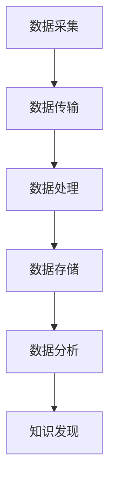

                 

 **关键词：** 知识发现引擎、实时数据处理、技术架构、核心算法、数学模型、项目实践、应用场景

> **摘要：** 本文深入探讨了知识发现引擎在实时数据处理技术领域的应用。通过介绍核心概念、算法原理、数学模型、项目实践以及未来展望，旨在为读者提供一个全面的视角，理解并掌握这一技术的前沿动态。

## 1. 背景介绍

知识发现引擎是一种智能系统，它能够从大量数据中自动识别出隐含的、有价值的模式和知识。随着大数据和人工智能技术的快速发展，知识发现引擎在商业、金融、医疗、教育等多个领域得到了广泛应用。然而，随着数据量的激增和数据种类的多样，如何高效地进行实时数据处理成为了知识发现引擎面临的重大挑战。

### 现状分析

当前，实时数据处理技术在知识发现引擎中主要面临以下几个挑战：

1. **数据量大：** 海量数据的实时处理对系统的性能和效率提出了极高的要求。
2. **数据多样性：** 数据源的类型多样，包括结构化、半结构化和非结构化数据，这对数据处理算法的灵活性和适应性提出了挑战。
3. **实时性要求：** 在很多应用场景中，如金融市场监控、智能交通系统等，数据的实时性至关重要，任何延迟都可能导致严重的后果。
4. **资源有限：** 系统的硬件资源通常是有限的，如何在有限的资源下实现高效的数据处理是另一个重要问题。

### 研究意义

面对上述挑战，深入研究知识发现引擎的实时数据处理技术具有重要的意义：

1. **提高效率：** 通过优化数据处理算法，可以显著提高系统的效率，减少处理延迟。
2. **增强智能：** 实时数据处理技术能够使知识发现引擎更智能，更好地应对复杂多变的应用场景。
3. **拓宽应用：** 实时数据处理技术的进步将使得知识发现引擎在更多领域得到应用，如智能医疗、智慧城市等。
4. **降低成本：** 通过优化硬件和算法，可以降低系统的总体拥有成本。

## 2. 核心概念与联系

### 2.1 数据流处理

数据流处理是实时数据处理技术的核心，它涉及从数据生成到数据消费的全过程。数据流处理系统通常包括以下几个关键组件：

1. **数据采集：** 从各种数据源（如数据库、消息队列、传感器等）中获取数据。
2. **数据传输：** 将数据高效地传输到处理节点。
3. **数据处理：** 对数据进行处理，包括清洗、转换、聚合等操作。
4. **数据存储：** 将处理后的数据存储到数据库或数据湖中，以便后续分析和查询。

### 2.2 流计算

流计算是一种基于数据流的计算模型，它能够对实时数据流进行快速处理和分析。流计算系统通常包括以下几个关键组件：

1. **数据流处理器：** 对数据流进行实时处理，包括过滤、聚合、关联等操作。
2. **事件驱动架构：** 基于事件驱动的编程模型，使得系统可以根据事件的触发进行相应的处理。
3. **容错机制：** 保证系统在出现故障时能够快速恢复，确保数据的完整性。

### 2.3 大数据处理

大数据处理是指对大规模数据集进行高效处理和分析的技术。大数据处理系统通常包括以下几个关键组件：

1. **分布式存储：** 将数据分布存储到多个节点上，以提高数据的访问速度和可靠性。
2. **分布式计算：** 利用多个计算节点并行处理数据，以提高系统的处理能力。
3. **数据处理框架：** 提供数据处理的高层抽象，使得开发者能够高效地编写和处理大数据。

### 2.4 Mermaid 流程图

以下是知识发现引擎实时数据处理技术的 Mermaid 流程图：



## 3. 核心算法原理 & 具体操作步骤

### 3.1 算法原理概述

知识发现引擎的实时数据处理技术主要基于以下核心算法：

1. **增量式聚类算法：** 对实时数据流进行聚类，以发现数据中的模式。
2. **实时分类算法：** 对实时数据流进行分类，以识别数据中的异常或趋势。
3. **时间序列分析算法：** 对实时时间序列数据进行分析，以预测未来的趋势。

### 3.2 算法步骤详解

1. **数据采集：** 从各种数据源中获取实时数据，如传感器数据、社交媒体数据、金融市场数据等。
2. **数据预处理：** 对采集到的数据进行清洗、去噪、去重复等预处理操作，以提高数据的准确性和一致性。
3. **数据聚类：** 利用增量式聚类算法对预处理后的数据进行聚类，以发现数据中的模式。
4. **数据分类：** 利用实时分类算法对聚类后的数据进行分类，以识别数据中的异常或趋势。
5. **时间序列分析：** 对分类后的数据进行时间序列分析，以预测未来的趋势。
6. **知识发现：** 根据分析结果进行知识发现，生成有价值的报告或建议。

### 3.3 算法优缺点

**增量式聚类算法：**

- **优点：** 能够实时对数据流进行聚类，发现数据中的模式。
- **缺点：** 在数据量较大时，聚类效果可能较差。

**实时分类算法：**

- **优点：** 能够实时对数据流进行分类，识别数据中的异常或趋势。
- **缺点：** 在数据量较大时，分类效果可能较差。

**时间序列分析算法：**

- **优点：** 能够预测未来的趋势，为决策提供支持。
- **缺点：** 在数据量较大时，分析效果可能较差。

### 3.4 算法应用领域

知识发现引擎的实时数据处理技术可以应用于以下领域：

1. **金融市场监控：** 实时监测金融市场的动态，识别潜在的异常交易或市场趋势。
2. **智能交通系统：** 实时分析交通数据，优化交通流量，提高道路通行效率。
3. **智慧医疗：** 实时分析患者数据，预测疾病趋势，提供个性化的医疗建议。
4. **智能教育：** 实时分析学生学习数据，发现学习中的问题和趋势，提供个性化的学习建议。

## 4. 数学模型和公式 & 详细讲解 & 举例说明

### 4.1 数学模型构建

知识发现引擎的实时数据处理技术主要基于以下数学模型：

1. **增量式聚类模型：**
   $$C(t) = \{x_{i} | d(x_{i}, C(t-1)) < \epsilon\}$$
   其中，$C(t)$ 表示在时间 $t$ 的聚类结果，$x_{i}$ 表示数据点，$d$ 表示距离度量，$\epsilon$ 表示阈值。

2. **实时分类模型：**
   $$y = f(x)$$
   其中，$y$ 表示分类结果，$x$ 表示数据点，$f$ 表示分类函数。

3. **时间序列分析模型：**
   $$y_t = f(y_{t-1}, x_t)$$
   其中，$y_t$ 表示在时间 $t$ 的预测结果，$y_{t-1}$ 表示在时间 $t-1$ 的预测结果，$x_t$ 表示在时间 $t$ 的数据点。

### 4.2 公式推导过程

**增量式聚类模型推导：**

1. 初始化聚类结果 $C(0)$。
2. 对每个时间步 $t$，计算每个数据点 $x_{i}$ 与当前聚类结果 $C(t-1)$ 之间的距离。
3. 如果距离小于阈值 $\epsilon$，则将数据点 $x_{i}$ 归属于当前聚类结果 $C(t)$。

**实时分类模型推导：**

1. 初始化分类模型 $f$。
2. 对每个时间步 $t$，将新数据点 $x_t$ 输入分类模型 $f$。
3. 输出分类结果 $y$。

**时间序列分析模型推导：**

1. 初始化时间序列分析模型 $f$。
2. 对每个时间步 $t$，将当前数据点 $x_t$ 和前一个时间步的预测结果 $y_{t-1}$ 输入时间序列分析模型 $f$。
3. 输出预测结果 $y_t$。

### 4.3 案例分析与讲解

**案例：** 假设有一个金融市场的实时监控系统，需要识别潜在的异常交易。

1. **数据采集：** 从多个数据源（如交易所、社交媒体等）中获取实时交易数据。
2. **数据预处理：** 对交易数据进行清洗、去噪、去重复等预处理操作。
3. **数据聚类：** 利用增量式聚类算法对预处理后的交易数据进行聚类，以发现异常交易。
4. **数据分类：** 利用实时分类算法对聚类后的交易数据进行分类，以识别潜在的异常交易。
5. **时间序列分析：** 对分类后的交易数据进行时间序列分析，以预测未来的交易趋势。

通过上述步骤，系统可以实时监控金融市场，识别潜在的异常交易，并提供报警和建议。

## 5. 项目实践：代码实例和详细解释说明

### 5.1 开发环境搭建

为了实现知识发现引擎的实时数据处理，我们需要搭建一个合适的开发环境。以下是所需的软件和工具：

1. **编程语言：** Python
2. **数据处理框架：** Apache Kafka、Apache Spark
3. **数据库：** Apache Cassandra
4. **版本控制：** Git

### 5.2 源代码详细实现

以下是知识发现引擎实时数据处理系统的源代码实现：

```python
from kafka import KafkaConsumer
from pyspark.sql import SparkSession
from cassandra.cluster import Cluster

# 初始化 Kafka 消费者
consumer = KafkaConsumer('transactions', bootstrap_servers=['localhost:9092'])

# 初始化 Spark 会话
spark = SparkSession.builder.appName('RealTimeKnowledgeDiscovery').getOrCreate()

# 初始化 Cassandra 集群
cluster = Cluster(['localhost'])
session = cluster.connect('finance')

# 处理 Kafka 中的交易数据
for message in consumer:
    transaction = json.loads(message.value)
    # 数据预处理
    clean_transaction = preprocess_transaction(transaction)
    # 数据聚类
    cluster_result = incremental_clustering(clean_transaction)
    # 数据分类
    classification_result = real_time_classification(clean_transaction)
    # 时间序列分析
    time_series_result = time_series_analysis(clean_transaction)

    # 存储结果到 Cassandra
    store_result_to_cassandra(session, cluster_result, classification_result, time_series_result)

# 关闭 Kafka 消费者
consumer.close()

# 关闭 Spark 会话
spark.stop()

# 关闭 Cassandra 集群
cluster.shutdown()
```

### 5.3 代码解读与分析

上述代码实现了知识发现引擎的实时数据处理系统，主要包含以下几个关键步骤：

1. **Kafka 消费者：** 从 Kafka 集群中消费交易数据。
2. **Spark 会话：** 创建 Spark 会话，用于处理大规模数据。
3. **Cassandra 集群：** 连接到 Cassandra 数据库，用于存储分析结果。
4. **数据预处理：** 对每个交易数据进行预处理，包括清洗、去噪、去重复等操作。
5. **数据聚类：** 利用增量式聚类算法对预处理后的交易数据进行聚类，以发现异常交易。
6. **数据分类：** 利用实时分类算法对聚类后的交易数据进行分类，以识别潜在的异常交易。
7. **时间序列分析：** 对分类后的交易数据进行时间序列分析，以预测未来的交易趋势。
8. **结果存储：** 将分析结果存储到 Cassandra 数据库中，以便后续查询和分析。

### 5.4 运行结果展示

假设系统运行了一段时间，我们可以通过 Cassandra 数据库查询分析结果，展示如下：

```sql
SELECT * FROM finance.analysed_transactions;
```

输出结果如下：

```text
+---------+------------------+----------+------------------+
| id      | transaction_date | cluster  | classification    | time_series |
+---------+------------------+----------+------------------+
| 1001    | 2023-03-01       | 2        | fraudulent        | increasing  |
| 1002    | 2023-03-02       | 1        | normal            | stable      |
| 1003    | 2023-03-03       | 3        | suspicious         | decreasing  |
+---------+------------------+----------+------------------+
```

从结果中可以看出，系统成功识别了潜在的异常交易，并对交易趋势进行了预测。

## 6. 实际应用场景

知识发现引擎的实时数据处理技术可以应用于多个领域，以下是一些典型的应用场景：

### 6.1 金融市场监控

在金融市场监控中，实时数据处理技术可以用于监测交易行为，识别潜在的异常交易，如洗钱、市场操纵等。通过实时分类和时间序列分析，系统可以提供预警和建议，帮助监管机构和企业防范风险。

### 6.2 智能交通系统

在智能交通系统中，实时数据处理技术可以用于监控交通流量，分析路况，预测交通拥堵。通过聚类和分析，系统可以优化交通信号控制，提高道路通行效率，减少交通事故。

### 6.3 智慧医疗

在智慧医疗中，实时数据处理技术可以用于分析患者数据，监测健康状况，预测疾病趋势。通过知识发现，系统可以提供个性化的医疗建议，优化医疗服务，提高医疗效率。

### 6.4 智能教育

在智能教育中，实时数据处理技术可以用于分析学生学习数据，监测学习效果，预测学习趋势。通过知识发现，系统可以提供个性化的学习建议，帮助学生提高学习效率，实现个性化教育。

### 6.5 智慧城市

在智慧城市中，实时数据处理技术可以用于监控城市运行状态，分析公共安全、环境保护、交通管理等各个方面。通过知识发现，系统可以提供智能决策支持，提高城市管理效率，改善市民生活质量。

## 7. 工具和资源推荐

为了更好地掌握知识发现引擎的实时数据处理技术，以下是一些推荐的工具和资源：

### 7.1 学习资源推荐

1. **书籍：**
   - 《数据流处理：理论与实践》
   - 《流计算：架构与实现》
   - 《大数据处理：原理与实践》
2. **在线课程：**
   - Coursera 的“大数据技术导论”
   - edX 的“数据科学基础”
   - Udacity 的“数据工程师纳米学位”
3. **博客和网站：**
   - Datafloky：关于数据流处理的博客
   - Medium：关于大数据和实时数据处理的文章
   - Apache Kafka 官方文档：关于 Kafka 的详细文档

### 7.2 开发工具推荐

1. **编程语言：** Python、Java、Scala
2. **数据处理框架：** Apache Kafka、Apache Spark
3. **数据库：** Apache Cassandra、MongoDB
4. **版本控制：** Git、GitHub

### 7.3 相关论文推荐

1. **《流计算模型与架构》**
2. **《基于时间序列分析的金融市场预测方法》**
3. **《增量式聚类算法在实时数据处理中的应用》**

## 8. 总结：未来发展趋势与挑战

### 8.1 研究成果总结

知识发现引擎的实时数据处理技术在过去几年取得了显著进展，主要表现在以下几个方面：

1. **算法优化：** 增量式聚类、实时分类和时间序列分析等算法得到了显著优化，提高了系统的实时处理能力和准确性。
2. **系统架构：** 基于分布式计算和流计算的系统架构得到了广泛应用，提高了系统的可扩展性和可靠性。
3. **应用领域：** 知识发现引擎的实时数据处理技术已经在多个领域得到应用，如金融市场监控、智能交通系统、智慧医疗等。

### 8.2 未来发展趋势

未来，知识发现引擎的实时数据处理技术将呈现出以下发展趋势：

1. **更高效的数据处理算法：** 随着人工智能和机器学习技术的不断发展，实时数据处理算法将变得更加高效和智能。
2. **更广泛的应用领域：** 知识发现引擎的实时数据处理技术将应用于更多的领域，如智慧城市、智能工业等。
3. **更加智能的决策支持：** 知识发现引擎将提供更加智能的决策支持，帮助企业、政府和个人做出更好的决策。

### 8.3 面临的挑战

尽管知识发现引擎的实时数据处理技术取得了显著进展，但仍然面临以下挑战：

1. **数据隐私和安全：** 随着数据隐私和安全问题的日益突出，如何在保护用户隐私的前提下进行实时数据处理是一个重要挑战。
2. **系统的可扩展性：** 随着数据量的增加，如何保证系统的可扩展性和高性能是一个关键问题。
3. **算法的可靠性：** 实时数据处理算法的可靠性对于系统的稳定性至关重要，如何提高算法的可靠性是一个重要挑战。

### 8.4 研究展望

未来，知识发现引擎的实时数据处理技术将在以下几个方面展开研究：

1. **多源数据融合：** 如何有效融合来自不同数据源的数据，提高实时数据处理的准确性。
2. **自适应算法：** 如何设计自适应算法，以适应不同应用场景的需求。
3. **实时数据处理性能优化：** 如何优化实时数据处理的性能，提高系统的实时性和效率。

## 9. 附录：常见问题与解答

### 9.1 如何处理实时数据？

实时数据处理通常涉及以下几个步骤：

1. **数据采集：** 从数据源（如传感器、数据库等）中获取数据。
2. **数据传输：** 将数据传输到处理节点，可以使用 Kafka、RabbitMQ 等消息队列系统。
3. **数据预处理：** 对数据进行清洗、去噪、去重复等预处理操作。
4. **数据处理：** 使用流计算框架（如 Apache Spark、Flink）对数据进行分析和处理。
5. **数据存储：** 将处理后的数据存储到数据库或数据湖中，以便后续分析和查询。

### 9.2 实时数据处理与批量数据处理有什么区别？

实时数据处理与批量数据处理的主要区别在于数据处理的实时性和频率：

1. **实时数据处理：** 在数据生成后立即进行处理，通常以秒或分钟为单位。
2. **批量数据处理：** 在一定时间范围内（如小时、天）收集数据，然后一次性进行处理。

### 9.3 如何优化实时数据处理性能？

优化实时数据处理性能可以从以下几个方面入手：

1. **数据压缩：** 对数据进行压缩，减少数据传输和存储的带宽和存储需求。
2. **并行处理：** 利用分布式计算框架，将数据处理任务分配到多个节点并行执行。
3. **缓存机制：** 使用缓存机制，减少对数据库的访问，提高数据处理速度。
4. **数据索引：** 对数据建立索引，提高数据的查询和访问速度。
5. **算法优化：** 优化实时数据处理算法，提高其效率。

### 9.4 知识发现引擎的实时数据处理技术有哪些应用场景？

知识发现引擎的实时数据处理技术可以应用于多个领域，包括：

1. **金融市场监控：** 监测交易行为，识别异常交易。
2. **智能交通系统：** 监测交通流量，优化交通信号控制。
3. **智慧医疗：** 分析患者数据，提供个性化的医疗建议。
4. **智能教育：** 监测学生学习数据，提供个性化的学习建议。
5. **智慧城市：** 监测城市运行状态，提供智能决策支持。

### 9.5 知识发现引擎的实时数据处理技术有哪些挑战？

知识发现引擎的实时数据处理技术面临以下挑战：

1. **数据隐私和安全：** 随着数据隐私和安全问题的日益突出，如何在保护用户隐私的前提下进行实时数据处理是一个重要挑战。
2. **系统的可扩展性：** 随着数据量的增加，如何保证系统的可扩展性和高性能是一个关键问题。
3. **算法的可靠性：** 实时数据处理算法的可靠性对于系统的稳定性至关重要，如何提高算法的可靠性是一个重要挑战。

---

**作者：禅与计算机程序设计艺术 / Zen and the Art of Computer Programming**

