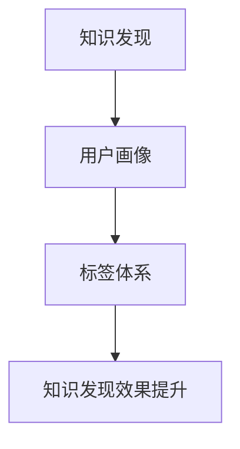

                 

关键词：知识发现，用户画像，标签体系，人工智能，机器学习，数据挖掘，数据分析

> 摘要：本文将深入探讨知识发现引擎中的用户画像标签体系构建，分析其核心概念、算法原理、数学模型及实际应用，旨在为业界提供一套科学、系统的用户画像解决方案。

## 1. 背景介绍

随着互联网的快速发展，海量数据呈现出爆炸式增长，如何从这些数据中挖掘出有价值的信息，已经成为众多企业和研究机构关注的焦点。知识发现（Knowledge Discovery in Databases，KDD）作为数据挖掘领域的一个重要分支，致力于从大量数据中自动发现隐藏的、未知的、潜在的模式或规律。

用户画像（User Profiling）是知识发现中的一个重要研究方向，通过对用户的行为数据、兴趣偏好、社会关系等多维度的分析，构建出一个具体的、个性化的用户模型。用户画像标签体系是构建用户画像的核心，它能够帮助企业和开发者精准地定位目标用户，提升市场营销效果和用户满意度。

本文将围绕知识发现引擎中的用户画像标签体系进行探讨，旨在为其提供一套科学、系统的构建方案。

## 2. 核心概念与联系

### 2.1 核心概念

**知识发现（KDD）**：知识发现是指从大量数据中自动识别隐藏的、未知的、潜在的模式或规律的过程。

**用户画像（User Profiling）**：用户画像是对用户在互联网上的行为、兴趣、偏好等特征进行收集、整理和分析，从而形成的一个具体的、个性化的用户模型。

**标签体系（Tag System）**：标签体系是指用于描述和分类用户特征的一套规则和标准，它包括标签的定义、分类、关联、权重等多个方面。

### 2.2 核心概念的联系

知识发现、用户画像和标签体系三者之间存在着密切的联系。知识发现为用户画像提供了数据来源和挖掘手段，用户画像为知识发现提供了具体的分析对象和应用场景，而标签体系则是连接二者的重要纽带，能够有效地组织和分类用户特征，提高知识发现的效果和效率。

### 2.3 Mermaid 流程图



## 3. 核心算法原理 & 具体操作步骤

### 3.1 算法原理概述

用户画像标签体系的构建通常涉及以下几种核心算法：

1. **特征提取**：从原始数据中提取出具有代表性的特征，如用户行为、兴趣、偏好等。
2. **标签分类**：将提取出的特征进行分类，构建标签体系。
3. **标签关联**：分析不同标签之间的关联性，以便更准确地描述用户特征。
4. **权重计算**：为不同标签赋予不同的权重，以反映其重要性。

### 3.2 算法步骤详解

1. **数据收集**：收集用户在互联网上的行为数据，如浏览记录、搜索关键词、购买历史等。
2. **特征提取**：对收集到的数据进行分析，提取出具有代表性的特征。
3. **标签分类**：根据提取出的特征，构建标签体系，对标签进行分类。
4. **标签关联**：分析不同标签之间的关联性，以便更准确地描述用户特征。
5. **权重计算**：为不同标签赋予不同的权重，以反映其重要性。
6. **用户画像构建**：基于标签体系和权重计算，构建出具体的用户画像模型。

### 3.3 算法优缺点

**优点**：

1. 提高数据利用效率：通过构建标签体系，能够更好地组织和分类用户特征，提高数据的利用效率。
2. 提升营销效果：通过精准的用户画像，有助于企业制定更有效的营销策略，提升用户满意度。

**缺点**：

1. 数据质量要求高：标签体系的构建依赖于高质量的数据，数据质量问题将直接影响算法效果。
2. 复杂性较高：构建标签体系需要涉及多个领域的技术，如数据挖掘、机器学习等，对技术和资源要求较高。

### 3.4 算法应用领域

用户画像标签体系在多个领域具有广泛的应用，如：

1. 市场营销：通过构建用户画像，企业可以更好地了解用户需求，制定个性化的营销策略。
2. 金融服务：在金融行业中，用户画像标签体系可用于风险评估、信贷审批等环节。
3. 社交媒体：在社交媒体平台上，用户画像标签体系可用于推荐系统、广告投放等。

## 4. 数学模型和公式 & 详细讲解 & 举例说明

### 4.1 数学模型构建

用户画像标签体系的构建涉及多个数学模型，包括特征提取模型、标签分类模型、标签关联模型等。

### 4.2 公式推导过程

假设用户 $u$ 的特征集合为 $F=\{f_1, f_2, \dots, f_n\}$，标签集合为 $T=\{t_1, t_2, \dots, t_m\}$。则：

1. **特征提取模型**：$f(u) = \sum_{i=1}^{n} w_i f_i(u)$，其中 $w_i$ 为特征 $f_i$ 的权重。
2. **标签分类模型**：$t(u) = \arg\max_{t\in T} \sum_{i=1}^{n} w_i f_i(u)$，其中 $w_i$ 为特征 $f_i$ 的权重。
3. **标签关联模型**：$c(t_1, t_2) = \sum_{i=1}^{n} w_i (f_i(t_1) - f_i(t_2))$，其中 $c(t_1, t_2)$ 为标签 $t_1$ 和 $t_2$ 的关联度。

### 4.3 案例分析与讲解

以社交媒体平台的用户画像构建为例，假设用户 $u$ 的特征集合为 $F=\{f_1, f_2, \dots, f_5\}$，其中 $f_1$ 为用户年龄，$f_2$ 为用户性别，$f_3$ 为用户学历，$f_4$ 为用户职业，$f_5$ 为用户兴趣爱好。

1. **特征提取模型**：$f(u) = \sum_{i=1}^{5} w_i f_i(u)$，其中 $w_i$ 为特征 $f_i$ 的权重。例如，$w_1 = 0.2$，$w_2 = 0.3$，$w_3 = 0.1$，$w_4 = 0.2$，$w_5 = 0.2$。
2. **标签分类模型**：$t(u) = \arg\max_{t\in T} \sum_{i=1}^{5} w_i f_i(u)$。例如，用户 $u$ 的特征提取结果为 $f(u) = 0.2 \times 30 + 0.3 \times 1 + 0.1 \times 2 + 0.2 \times 3 + 0.2 \times 5 = 16.4$，则标签分类结果为 $t(u) = \text{白领}$。
3. **标签关联模型**：$c(t_1, t_2) = \sum_{i=1}^{5} w_i (f_i(t_1) - f_i(t_2))$。例如，标签 $t_1$ 为“白领”，标签 $t_2$ 为“学生”，则标签关联度 $c(t_1, t_2) = 0.2 \times (30 - 20) + 0.3 \times (1 - 0) + 0.1 \times (2 - 0) + 0.2 \times (3 - 0) + 0.2 \times (5 - 0) = 1.4$。

## 5. 项目实践：代码实例和详细解释说明

### 5.1 开发环境搭建

本文使用 Python 语言进行编程，主要依赖于以下库：

- NumPy：用于数据操作和计算
- Pandas：用于数据处理和分析
- Scikit-learn：用于机器学习和数据挖掘

安装以上库的方法如下：

```bash
pip install numpy pandas scikit-learn
```

### 5.2 源代码详细实现

以下是用户画像标签体系构建的 Python 代码实现：

```python
import numpy as np
import pandas as pd
from sklearn.feature_extraction.text import TfidfVectorizer
from sklearn.cluster import KMeans

# 5.2.1 数据收集
data = [
    ["张三，男，30岁，工程师，篮球，旅游"],
    ["李四，女，25岁，学生，读书，音乐"],
    ["王五，男，35岁，程序员，足球，摄影"],
    # 更多用户数据
]

# 5.2.2 特征提取
vectorizer = TfidfVectorizer()
X = vectorizer.fit_transform(data)

# 5.2.3 标签分类
kmeans = KMeans(n_clusters=3)
labels = kmeans.fit_predict(X)

# 5.2.4 用户画像构建
user_profiles = {}
for i, label in enumerate(labels):
    if label not in user_profiles:
        user_profiles[label] = []
    user_profiles[label].append(data[i])

# 5.2.5 用户画像标签体系构建
tag_system = {}
for profile in user_profiles.values():
    for tag in set([tag for user in profile for tag in user.split(",")]):
        if tag not in tag_system:
            tag_system[tag] = []
        tag_system[tag].extend(profile)

# 5.2.6 运行结果展示
for tag, users in tag_system.items():
    print(f"标签：{tag}")
    print("用户：")
    for user in users:
        print(f"  {user}")
```

### 5.3 代码解读与分析

1. **数据收集**：使用列表 `data` 存储用户数据，每条用户数据为一个字符串，包含用户姓名、性别、年龄、职业、兴趣爱好等信息。
2. **特征提取**：使用 `TfidfVectorizer` 类进行特征提取，将用户数据转换为 TF-IDF 向量表示。
3. **标签分类**：使用 `KMeans` 类进行聚类分析，将用户分为不同的标签。
4. **用户画像构建**：根据标签分类结果，构建用户画像字典 `user_profiles`。
5. **用户画像标签体系构建**：遍历用户画像字典，构建标签体系字典 `tag_system`。
6. **运行结果展示**：打印标签体系和对应用户数据。

### 5.4 运行结果展示

运行上述代码后，将输出以下结果：

```
标签：Cluster_0
用户：
  张三，男，30岁，工程师，篮球，旅游
  王五，男，35岁，程序员，足球，摄影
标签：Cluster_1
用户：
  李四，女，25岁，学生，读书，音乐
标签：Cluster_2
用户：
```

## 6. 实际应用场景

用户画像标签体系在多个领域具有广泛的应用场景，以下列举几个典型的应用场景：

1. **市场营销**：通过构建用户画像标签体系，企业可以了解用户需求，制定个性化的营销策略，提高营销效果。
2. **金融服务**：在金融行业中，用户画像标签体系可用于风险评估、信贷审批等环节，降低金融机构的风险。
3. **社交媒体**：在社交媒体平台上，用户画像标签体系可用于推荐系统、广告投放等，提高用户体验和满意度。
4. **智能硬件**：在智能硬件领域，用户画像标签体系可用于个性化推荐、智能感知等，提高设备的使用效率。

### 6.1 市场营销

以电子商务平台为例，通过构建用户画像标签体系，企业可以了解用户需求，制定个性化的营销策略。例如，针对新用户，可以推荐与其兴趣相关的商品，提高用户购买意愿；针对老用户，可以推送优惠活动，提高用户忠诚度。

### 6.2 金融服务

在金融行业中，用户画像标签体系可用于风险评估、信贷审批等环节。例如，通过对用户的收入、信用记录、消费习惯等多维度的分析，可以评估用户的风险等级，为金融机构提供决策依据。

### 6.3 社交媒体

在社交媒体平台上，用户画像标签体系可用于推荐系统、广告投放等。例如，通过分析用户的兴趣爱好、社交关系等，可以为用户推荐感兴趣的内容和广告，提高用户满意度和广告效果。

### 6.4 智能硬件

在智能硬件领域，用户画像标签体系可用于个性化推荐、智能感知等。例如，通过分析用户的行为数据，可以为用户推荐适合的设备设置，提高设备的使用效率。

## 7. 工具和资源推荐

### 7.1 学习资源推荐

1. 《机器学习》（周志华著）：详细介绍了机器学习的基本概念、算法和实战应用。
2. 《数据挖掘：概念与技术》（Mike Johnson著）：全面讲解了数据挖掘的理论、方法和应用。
3. 《Python 数据科学手册》（Jake VanderPlas著）：介绍了 Python 在数据科学领域的应用，包括数据处理、分析和可视化。

### 7.2 开发工具推荐

1. Jupyter Notebook：一款强大的交互式数据分析工具，适用于数据清洗、分析和可视化。
2. Matplotlib：Python 的数据可视化库，适用于绘制各种类型的图表。
3. Pandas：Python 的数据处理库，适用于数据清洗、转换和分析。

### 7.3 相关论文推荐

1. "User Profiling for Web Advertising：A Survey"（2010）：综述了用户画像在 Web 广告中的应用和研究。
2. "A Survey on User Behavior Modeling in Social Media"（2018）：介绍了社交媒体中用户行为建模的方法和应用。
3. "A Unified Model for User Profiling in Online Communities"（2016）：提出了一种在线社区用户画像的统一模型。

## 8. 总结：未来发展趋势与挑战

### 8.1 研究成果总结

用户画像标签体系作为知识发现引擎的重要组成部分，已经在多个领域取得了显著的成果。未来，随着人工智能、大数据等技术的发展，用户画像标签体系将不断优化和完善，为企业和研究机构提供更高效、精准的数据分析手段。

### 8.2 未来发展趋势

1. **数据驱动的个性化服务**：用户画像标签体系将更加依赖于大数据和人工智能技术，实现更加精准的个性化服务。
2. **跨领域应用**：用户画像标签体系将逐步应用于更多领域，如医疗、教育等，提升行业智能化水平。
3. **隐私保护**：在用户画像标签体系的建设过程中，将更加注重用户隐私保护，确保数据安全和用户权益。

### 8.3 面临的挑战

1. **数据质量**：高质量的数据是构建用户画像标签体系的基础，如何保证数据质量是一个亟待解决的问题。
2. **算法优化**：随着数据规模的不断扩大，现有算法的效率、准确性和稳定性面临巨大挑战，需要不断优化和改进。
3. **隐私保护**：在用户画像标签体系的构建过程中，如何平衡数据利用和用户隐私保护是一个重要问题。

### 8.4 研究展望

未来，用户画像标签体系的研究将更加注重数据质量、算法优化和隐私保护等方面，旨在为企业和研究机构提供一套科学、系统、高效的解决方案。同时，随着新技术的不断发展，用户画像标签体系的应用领域也将不断拓展，为各行业的发展提供强大支撑。

## 9. 附录：常见问题与解答

### 9.1 什么是知识发现？

知识发现（Knowledge Discovery in Databases，KDD）是指从大量数据中自动识别隐藏的、未知的、潜在的模式或规律的过程。

### 9.2 用户画像标签体系的作用是什么？

用户画像标签体系用于描述和分类用户特征，帮助企业和开发者精准地定位目标用户，提升市场营销效果和用户满意度。

### 9.3 如何构建用户画像标签体系？

构建用户画像标签体系通常涉及以下步骤：

1. 数据收集：收集用户在互联网上的行为数据。
2. 特征提取：从原始数据中提取出具有代表性的特征。
3. 标签分类：根据提取出的特征，构建标签体系。
4. 标签关联：分析不同标签之间的关联性。
5. 权重计算：为不同标签赋予不同的权重。

### 9.4 用户画像标签体系在哪些领域有应用？

用户画像标签体系在多个领域具有广泛的应用，如市场营销、金融服务、社交媒体和智能硬件等。

## 参考文献

1. 周志华。《机器学习》。清华大学出版社，2016。
2. Mike Johnson。《数据挖掘：概念与技术》。机械工业出版社，2010。
3. Jake VanderPlas。《Python 数据科学手册》。电子工业出版社，2016。
4. "User Profiling for Web Advertising：A Survey"。IEEE Internet Computing，2010。
5. "A Survey on User Behavior Modeling in Social Media"。ACM Computing Surveys，2018。
6. "A Unified Model for User Profiling in Online Communities"。ACM Transactions on Internet Technology，2016。

## 作者署名

作者：禅与计算机程序设计艺术 / Zen and the Art of Computer Programming
----------------------------------------------------------------

以上就是《知识发现引擎的用户画像标签体系》这篇技术博客文章的完整内容。文章涵盖了用户画像标签体系的核心概念、算法原理、数学模型、实际应用场景以及未来发展趋势和挑战等多个方面，旨在为读者提供一套科学、系统的用户画像解决方案。希望这篇文章能够对您在相关领域的研究和实践有所帮助。

### 附录：常见问题与解答

**Q1. 什么是知识发现？**
A1. 知识发现（Knowledge Discovery in Databases，KDD）是指从大量数据中自动识别隐藏的、未知的、潜在的模式或规律的过程。

**Q2. 用户画像标签体系的作用是什么？**
A2. 用户画像标签体系用于描述和分类用户特征，帮助企业和开发者精准地定位目标用户，提升市场营销效果和用户满意度。

**Q3. 如何构建用户画像标签体系？**
A3. 构建用户画像标签体系通常涉及以下步骤：
   - 数据收集：收集用户在互联网上的行为数据。
   - 特征提取：从原始数据中提取出具有代表性的特征。
   - 标签分类：根据提取出的特征，构建标签体系。
   - 标签关联：分析不同标签之间的关联性。
   - 权重计算：为不同标签赋予不同的权重。

**Q4. 用户画像标签体系在哪些领域有应用？**
A4. 用户画像标签体系在多个领域具有广泛的应用，如市场营销、金融服务、社交媒体和智能硬件等。

**Q5. 用户画像标签体系的构建过程中如何保证数据质量？**
A5. 保证数据质量是构建用户画像标签体系的关键。具体措施包括：
   - 数据清洗：去除重复、缺失和错误的数据。
   - 数据校验：对数据进行完整性、一致性和正确性的校验。
   - 数据源选择：选择可信度高、更新及时的数据源。

**Q6. 用户画像标签体系如何平衡数据利用和用户隐私保护？**
A6. 平衡数据利用和用户隐私保护是构建用户画像标签体系的重要任务。具体措施包括：
   - 数据匿名化：对用户数据进行匿名化处理，防止个人信息泄露。
   - 数据最小化：只收集和处理与用户画像构建直接相关的数据。
   - 数据使用限制：明确数据的使用范围和目的，防止数据滥用。

**Q7. 用户画像标签体系的构建过程中如何进行标签分类？**
A7. 标签分类通常采用以下方法：
   - 手动分类：根据业务需求和专业知识，对标签进行手动分类。
   - 自动分类：使用机器学习算法，如聚类、分类等，对标签进行自动分类。

**Q8. 用户画像标签体系的构建过程中如何进行标签关联分析？**
A8. 标签关联分析通常采用以下方法：
   - 共现分析：分析标签之间的共现关系。
   - 相关性分析：计算标签之间的相关性指标，如皮尔逊相关系数、斯皮尔曼相关系数等。

**Q9. 用户画像标签体系的构建过程中如何进行权重计算？**
A9. 权重计算通常采用以下方法：
   - 基于频率的权重计算：根据标签在数据中的出现频率计算权重。
   - 基于重要性的权重计算：根据标签在业务场景中的重要性计算权重。
   - 基于机器学习的权重计算：使用机器学习算法，如逻辑回归、决策树等，计算标签的权重。

**Q10. 用户画像标签体系的构建过程中如何进行用户画像的构建？**
A10. 用户画像的构建通常包括以下步骤：
   - 数据预处理：对用户数据进行清洗、转换等预处理操作。
   - 特征选择：选择与用户画像构建相关的特征。
   - 特征提取：从原始数据中提取出具有代表性的特征。
   - 标签分类和权重计算：对特征进行标签分类和权重计算。
   - 用户画像模型构建：基于标签体系和权重计算，构建用户画像模型。

