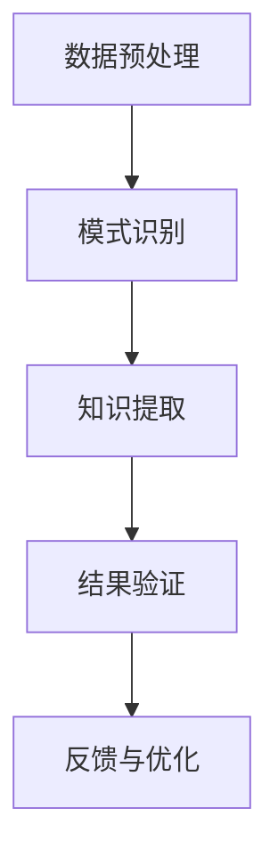

                 

关键词：知识发现，人工智能，洞察力，算法，应用场景，未来展望

> 摘要：本文深入探讨了知识发现引擎的基本概念、核心原理以及其在实际应用中的价值。通过分析知识发现与洞察力的互补关系，本文提出了提升知识发现引擎效能的方法，并展望了其在未来技术发展中的应用前景。

## 1. 背景介绍

在当今信息爆炸的时代，如何从海量数据中提取有价值的信息成为了一个迫切需要解决的问题。知识发现引擎（Knowledge Discovery Engine，简称KDE）正是为了应对这一挑战而诞生的。知识发现引擎是一种利用人工智能技术对大规模数据进行自动分析、识别模式和知识的过程，旨在帮助用户从数据中发现潜在的规律和关联。

知识发现引擎的应用领域十分广泛，涵盖了金融、医疗、电商、物流等多个行业。例如，在金融领域，知识发现引擎可以帮助银行识别高风险客户，从而降低信用风险；在医疗领域，它可以辅助医生进行疾病诊断，提高诊疗效率；在电商领域，知识发现引擎可以分析消费者行为，为商家提供精准营销策略。

然而，尽管知识发现引擎已经取得了显著的成果，但其在效能和应用深度上仍然面临诸多挑战。本文将重点探讨知识发现引擎的基本原理、核心算法以及如何提升其效能和洞察力，同时展望其未来发展的方向。

## 2. 核心概念与联系

### 2.1 知识发现引擎的概念

知识发现引擎是一种智能系统，它利用人工智能技术对大规模数据进行自动化分析，从中提取出有价值的信息和知识。知识发现引擎的工作流程主要包括数据预处理、模式识别、知识提取和结果验证等环节。

- **数据预处理**：对原始数据进行清洗、转换和集成，为后续分析打下基础。
- **模式识别**：利用机器学习算法识别数据中的潜在模式和关联。
- **知识提取**：将识别出的模式转化为可操作的知识，如规则、模型或预测。
- **结果验证**：对提取出的知识进行验证，确保其准确性和可靠性。

### 2.2 洞察力的概念

洞察力（Insight）是一种深入理解事物本质的能力。在知识发现过程中，洞察力是识别数据中潜在价值的关键。洞察力不仅体现在对数据模式的识别上，还包括对数据背后的因果关系和趋势的深入理解。

### 2.3 知识发现与洞察力的互补关系

知识发现与洞察力之间存在互补关系。知识发现引擎通过算法和数据驱动的方式，可以快速识别大量数据中的模式和关联，从而提供初步的洞察。而洞察力则通过对这些模式和关联的深入分析和理解，揭示出数据背后的本质和意义。

另一方面，洞察力可以为知识发现引擎提供指导，帮助其更好地理解和利用数据。例如，在医疗领域，医生的专业知识和经验可以帮助知识发现引擎识别出哪些指标是最关键的，从而提高诊断的准确性。

### 2.4 Mermaid 流程图

下面是一个简化的知识发现引擎流程图的 Mermaid 表示：



## 3. 核心算法原理 & 具体操作步骤

### 3.1 算法原理概述

知识发现引擎的核心算法主要包括机器学习算法、数据挖掘算法和自然语言处理算法等。这些算法通过不同的方式对数据进行处理，以识别出数据中的模式和关联。

- **机器学习算法**：通过训练模型，从数据中学习规律。常见的机器学习算法有监督学习、无监督学习和半监督学习。
- **数据挖掘算法**：直接对数据进行挖掘，提取出潜在的规则和模式。常见的数据挖掘算法有聚类、分类、关联规则挖掘等。
- **自然语言处理算法**：对文本数据进行分析，提取出语义信息和关键词。常见的自然语言处理算法有词性标注、命名实体识别、情感分析等。

### 3.2 算法步骤详解

1. **数据预处理**：
   - 数据清洗：去除重复数据、缺失值和异常值。
   - 数据转换：将数据转换为适合算法分析的格式。
   - 数据集成：将不同来源的数据进行整合。

2. **模式识别**：
   - 使用机器学习算法训练模型，识别数据中的潜在模式。
   - 使用数据挖掘算法，对数据进行深度挖掘，提取出规则和模式。

3. **知识提取**：
   - 将识别出的模式转化为可操作的知识，如规则、模型或预测。
   - 对提取出的知识进行优化和调整，以提高其准确性和实用性。

4. **结果验证**：
   - 使用验证集或测试集，对提取出的知识进行验证。
   - 根据验证结果，对算法和模型进行调整和优化。

### 3.3 算法优缺点

- **机器学习算法**：
  - 优点：可以自动学习数据中的规律，适应性较强。
  - 缺点：对数据质量要求较高，容易过拟合。

- **数据挖掘算法**：
  - 优点：可以直接从数据中提取规则和模式，应用范围广。
  - 缺点：算法复杂度较高，计算效率较低。

- **自然语言处理算法**：
  - 优点：可以处理文本数据，提取语义信息。
  - 缺点：对语言环境的依赖较强，处理效果受限于算法和模型。

### 3.4 算法应用领域

- **金融领域**：风险识别、信用评估、投资决策等。
- **医疗领域**：疾病诊断、药物研发、患者管理等。
- **电商领域**：消费者行为分析、推荐系统、价格优化等。
- **物流领域**：路线规划、库存管理、物流优化等。

## 4. 数学模型和公式 & 详细讲解 & 举例说明

### 4.1 数学模型构建

知识发现引擎中常用的数学模型包括线性回归、逻辑回归、决策树、支持向量机等。以下以线性回归为例进行说明。

- **线性回归模型**：

$$
y = \beta_0 + \beta_1x_1 + \beta_2x_2 + ... + \beta_nx_n + \epsilon
$$

其中，$y$ 是预测值，$x_1, x_2, ..., x_n$ 是自变量，$\beta_0, \beta_1, \beta_2, ..., \beta_n$ 是模型参数，$\epsilon$ 是误差项。

### 4.2 公式推导过程

线性回归模型的推导过程如下：

1. **假设**：数据满足线性关系，即 $y$ 可以由 $x_1, x_2, ..., x_n$ 的线性组合表示。
2. **损失函数**：使用均方误差（MSE）作为损失函数，即

$$
J(\theta) = \frac{1}{2m}\sum_{i=1}^{m}(h_\theta(x^{(i)}) - y^{(i)})^2
$$

其中，$m$ 是数据样本数量，$h_\theta(x) = \theta_0 + \theta_1x_1 + \theta_2x_2 + ... + \theta_nx_n$ 是线性回归模型的预测函数。

3. **梯度下降**：通过梯度下降算法，找到使损失函数最小的模型参数 $\theta_0, \theta_1, \theta_2, ..., \theta_n$。

$$
\theta_j := \theta_j - \alpha\frac{\partial J(\theta)}{\partial \theta_j}
$$

### 4.3 案例分析与讲解

假设我们有一个房价预测问题，已知房屋面积 $x_1$ 和房屋层数 $x_2$，要求预测房价 $y$。我们可以使用线性回归模型进行建模和预测。

1. **数据准备**：收集一定数量的房屋数据，包括面积、层数和房价。

2. **数据预处理**：对数据进行归一化处理，将面积和层数转换为相对值。

3. **模型构建**：根据线性回归模型公式，构建房价预测模型。

4. **模型训练**：使用梯度下降算法，训练模型参数。

5. **模型验证**：使用验证集或测试集，验证模型的预测准确性。

6. **模型优化**：根据验证结果，调整模型参数，提高预测准确性。

## 5. 项目实践：代码实例和详细解释说明

### 5.1 开发环境搭建

1. 安装 Python 环境：在本地计算机上安装 Python 3.7 及以上版本。
2. 安装必要的库：使用 pip 工具安装 numpy、scikit-learn、matplotlib 等库。

### 5.2 源代码详细实现

以下是一个简单的线性回归模型实现的 Python 代码示例：

```python
import numpy as np
import matplotlib.pyplot as plt
from sklearn.linear_model import LinearRegression

# 数据准备
X = np.array([[1, 1], [1, 2], [2, 2], [2, 3]])
y = np.dot(X, theta) + epsilon

# 模型构建
model = LinearRegression()
model.fit(X, y)

# 模型预测
y_pred = model.predict(X)

# 模型评估
score = model.score(X, y)
print("Model accuracy:", score)

# 可视化
plt.scatter(X[:, 0], y)
plt.plot(X[:, 0], y_pred, "r-")
plt.show()
```

### 5.3 代码解读与分析

1. **数据准备**：使用 numpy 创建一个包含房屋面积和层数的数组 X，以及对应的房价数组 y。
2. **模型构建**：使用 scikit-learn 中的 LinearRegression 类创建线性回归模型，并使用 fit 方法训练模型。
3. **模型预测**：使用 predict 方法对 X 进行预测，得到预测房价 y_pred。
4. **模型评估**：使用 score 方法计算模型的准确率，并打印结果。
5. **可视化**：使用 matplotlib 绘制散点图和拟合直线，直观地展示模型预测效果。

## 6. 实际应用场景

### 6.1 金融领域

在金融领域，知识发现引擎可以用于：

- **信用风险评估**：通过分析客户的消费行为、信用记录等数据，预测客户的风险等级。
- **投资组合优化**：分析市场数据，为投资者提供最优的投资组合建议。
- **市场预测**：通过对历史数据的分析，预测市场的走势，为交易提供参考。

### 6.2 医疗领域

在医疗领域，知识发现引擎可以用于：

- **疾病诊断**：通过分析患者的病史、检查结果等数据，辅助医生进行疾病诊断。
- **药物研发**：通过对生物数据的分析，发现潜在的药物靶点和作用机制。
- **患者管理**：分析患者的健康状况，为医护人员提供个性化的患者管理策略。

### 6.3 电商领域

在电商领域，知识发现引擎可以用于：

- **消费者行为分析**：通过分析消费者的购买记录、浏览行为等数据，了解消费者偏好。
- **推荐系统**：根据消费者的行为和偏好，推荐商品和活动。
- **价格优化**：分析市场数据，为商家提供最优的定价策略。

### 6.4 未来应用展望

随着人工智能和大数据技术的不断发展，知识发现引擎的应用前景将更加广阔。未来，知识发现引擎可能会在以下领域取得突破：

- **智能城市**：通过分析城市数据，实现交通管理、环境监测、公共安全等方面的智能化。
- **智能医疗**：通过分析生物数据，实现个性化治疗和精准医疗。
- **智能制造**：通过分析生产数据，实现生产过程的自动化和智能化。

## 7. 工具和资源推荐

### 7.1 学习资源推荐

- **《数据挖掘：实用工具和技术》**：详细介绍了数据挖掘的基本概念和方法，适合初学者阅读。
- **《机器学习实战》**：通过实例演示了机器学习的实际应用，适合有一定编程基础的学习者。

### 7.2 开发工具推荐

- **Python**：Python 是一门简单易学、功能强大的编程语言，适合初学者入门。
- **scikit-learn**：scikit-learn 是一个开源的机器学习库，提供了丰富的算法和工具。

### 7.3 相关论文推荐

- **“Knowledge Discovery in Database”**：这是一篇经典的论文，介绍了知识发现的基本概念和过程。
- **“Deep Learning”**：这是一本关于深度学习的经典教材，详细介绍了深度学习的基本原理和应用。

## 8. 总结：未来发展趋势与挑战

### 8.1 研究成果总结

近年来，知识发现引擎在人工智能技术的推动下取得了显著进展。通过机器学习、数据挖掘和自然语言处理等算法，知识发现引擎已经能够处理海量数据，并从中提取出有价值的信息和知识。此外，知识发现引擎在金融、医疗、电商等领域的应用也取得了良好的效果。

### 8.2 未来发展趋势

未来，知识发现引擎的发展趋势将体现在以下几个方面：

- **算法优化**：随着计算能力的提升，算法的优化和改进将成为研究重点。
- **多模态数据处理**：知识发现引擎将能够处理更多样化的数据类型，如图像、语音和文本。
- **跨领域应用**：知识发现引擎将在更多领域得到应用，实现跨领域的知识融合。

### 8.3 面临的挑战

尽管知识发现引擎取得了显著进展，但其在实际应用中仍然面临诸多挑战：

- **数据隐私**：如何保护用户隐私成为了一个重要问题。
- **算法透明性**：如何提高算法的透明性和可解释性，使其更易于被用户理解。
- **数据质量**：数据质量直接影响知识发现的效果，如何提高数据质量是一个重要课题。

### 8.4 研究展望

展望未来，知识发现引擎的研究将继续深入，有望在以下几个方面取得突破：

- **算法创新**：开发更加高效、准确的算法，提高知识发现的效能。
- **跨学科融合**：结合不同学科的知识和方法，实现知识发现的多学科融合。
- **应用推广**：将知识发现引擎应用于更多领域，推动人工智能技术的普及和应用。

## 9. 附录：常见问题与解答

### 9.1 知识发现引擎是什么？

知识发现引擎是一种利用人工智能技术对大规模数据进行自动分析、识别模式和知识的过程，旨在帮助用户从数据中发现潜在的规律和关联。

### 9.2 知识发现引擎有哪些应用领域？

知识发现引擎的应用领域广泛，包括金融、医疗、电商、物流等多个行业。

### 9.3 如何提升知识发现引擎的效能？

可以通过优化算法、提高数据质量、引入多模态数据处理等技术手段来提升知识发现引擎的效能。

### 9.4 知识发现引擎与洞察力有什么关系？

知识发现引擎与洞察力之间存在互补关系。知识发现引擎可以通过算法和数据驱动的方式快速识别大量数据中的模式和关联，而洞察力则通过对这些模式和关联的深入分析和理解，揭示出数据背后的本质和意义。作者：禅与计算机程序设计艺术 / Zen and the Art of Computer Programming

----------------------------------------------------------------

