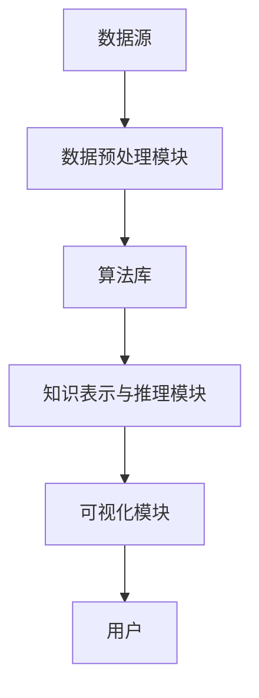

                 

关键词：知识发现引擎、数据挖掘、人工智能、洞察力、智能推荐、信息过滤、机器学习、预测分析、数据可视化、知识图谱、深度学习。

> 摘要：本文深入探讨了知识发现引擎的概念、原理、构建方法及其在实际应用中的重要性。通过详细分析知识发现引擎的核心算法、数学模型和具体实现，本文为读者提供了一个全面而深入的技术指南。文章还将探讨知识发现引擎在未来信息技术领域的发展趋势与挑战，旨在为相关领域的研究者、工程师和决策者提供有价值的参考。

## 1. 背景介绍

知识发现引擎（Knowledge Discovery Engine，简称KDE）是一种先进的计算技术，它致力于从大量数据中自动挖掘出有价值的信息和知识。这一概念最早由Fayyad等人于1996年提出，旨在通过数据挖掘技术发现隐藏在数据背后的模式和关联，从而帮助企业和组织做出更明智的决策。

随着大数据时代的到来，数据量呈现爆炸性增长。传统的数据处理方法已经难以满足现代信息社会的需求。知识发现引擎作为一种智能化的数据处理工具，成为了数据科学领域的研究热点。它不仅能够处理大规模的数据集，还能通过高级算法挖掘出深层次的信息，从而为各行各业提供决策支持。

知识发现引擎的应用领域非常广泛，包括但不限于以下方面：

1. **金融领域**：用于信用评估、风险控制、投资决策等。
2. **医疗领域**：用于疾病预测、药物研发、个性化医疗等。
3. **零售领域**：用于需求预测、库存管理、个性化推荐等。
4. **安全领域**：用于异常检测、网络入侵检测、诈骗识别等。
5. **社交媒体**：用于用户行为分析、内容推荐、广告投放等。

本文将围绕知识发现引擎的核心概念、算法原理、数学模型、实现方法及其应用场景进行详细探讨，旨在为读者提供一个全面的技术指南。

## 2. 核心概念与联系

### 2.1 数据挖掘与知识发现

数据挖掘（Data Mining）是指从大量数据中自动发现具有价值的模式、关联和知识的过程。它通常包括以下步骤：

1. **数据预处理**：清洗、归一化、转换等。
2. **模式识别**：通过统计方法、机器学习算法等发现数据中的模式。
3. **模式评估**：评估挖掘出的模式是否具有实际应用价值。

知识发现（Knowledge Discovery）则是在数据挖掘的基础上，进一步提炼出高层次的、有解释力的知识。知识发现通常涉及以下步骤：

1. **模式理解**：解释和验证挖掘出的模式。
2. **知识表示**：将挖掘出的知识以某种形式表示出来，如规则、模式、图表等。
3. **知识应用**：将知识应用于实际问题中，如决策支持、预测分析等。

数据挖掘和知识发现的关系可以概括为：数据挖掘是实现知识发现的重要手段，而知识发现则是数据挖掘的终极目标。

### 2.2 知识发现引擎的组成部分

知识发现引擎通常由以下几个关键组件组成：

1. **数据源**：提供原始数据，可以是结构化数据、半结构化数据或非结构化数据。
2. **数据预处理模块**：对数据进行清洗、归一化、转换等预处理操作。
3. **算法库**：包含各种数据挖掘和机器学习算法，如聚类、分类、关联规则挖掘等。
4. **知识表示与推理模块**：将挖掘出的模式转化为可解释的知识，并支持知识的推理和更新。
5. **可视化模块**：将挖掘结果以图表、仪表盘等形式展示，便于用户理解和分析。

### 2.3 Mermaid 流程图

以下是知识发现引擎的Mermaid流程图表示，展示了各个组件之间的联系和交互过程：



在这个流程图中，数据源为知识发现引擎提供原始数据，经过数据预处理模块的处理后，进入算法库进行模式识别和知识发现。挖掘出的模式经过知识表示与推理模块转化为可解释的知识，并通过可视化模块展示给用户。用户可以对结果进行交互和分析，以获得更深入的洞察力。

## 3. 核心算法原理 & 具体操作步骤

### 3.1 算法原理概述

知识发现引擎的核心算法主要包括以下几类：

1. **聚类算法**：将相似的数据分组，形成聚类。
2. **分类算法**：将数据分配到预定义的类别中。
3. **关联规则挖掘算法**：发现数据项之间的关联关系。
4. **预测分析算法**：利用历史数据预测未来趋势。

聚类算法如K-means、层次聚类等，用于发现数据中的自然分组。分类算法如决策树、随机森林、支持向量机等，用于构建分类模型，对数据进行分类。关联规则挖掘算法如Apriori、Eclat等，用于发现数据项之间的频繁模式。预测分析算法如时间序列分析、回归分析等，用于预测未来的趋势和变化。

### 3.2 算法步骤详解

以K-means聚类算法为例，其基本步骤如下：

1. **初始化聚类中心**：随机选择K个数据点作为初始聚类中心。
2. **分配数据点**：计算每个数据点到各个聚类中心的距离，将数据点分配到最近的聚类中心。
3. **更新聚类中心**：重新计算每个聚类的中心点。
4. **迭代更新**：重复步骤2和3，直到聚类中心不再变化或者达到预设的迭代次数。

分类算法的基本步骤通常包括：

1. **特征提取**：从数据中提取有用的特征。
2. **训练模型**：使用训练数据集训练分类模型。
3. **预测**：使用训练好的模型对新数据进行分类。

关联规则挖掘算法的基本步骤包括：

1. **频繁项集挖掘**：找出数据中出现频率较高的项集。
2. **生成关联规则**：从频繁项集中生成关联规则。
3. **规则评估**：评估关联规则的支持度和置信度。

预测分析算法的基本步骤通常包括：

1. **数据预处理**：对数据进行清洗、归一化等处理。
2. **特征选择**：选择对预测目标有影响力的特征。
3. **模型选择**：选择合适的预测模型。
4. **模型训练与验证**：使用训练数据集训练模型，并对模型进行验证。

### 3.3 算法优缺点

各类算法都有其优缺点：

- **聚类算法**：优点是简单、易于实现，缺点是对于初始聚类中心的敏感度较高，可能陷入局部最优。
- **分类算法**：优点是能够提供明确的分类结果，缺点是需要大量的训练数据。
- **关联规则挖掘算法**：优点是能够发现数据中的关联关系，缺点是生成的规则可能过多，难以解释。
- **预测分析算法**：优点是能够预测未来的趋势，缺点是对历史数据的质量要求较高。

### 3.4 算法应用领域

各类算法的应用领域如下：

- **聚类算法**：应用领域包括市场细分、社交网络分析等。
- **分类算法**：应用领域包括邮件分类、图像识别等。
- **关联规则挖掘算法**：应用领域包括购物篮分析、推荐系统等。
- **预测分析算法**：应用领域包括股票市场预测、气象预报等。

## 4. 数学模型和公式 & 详细讲解 & 举例说明

### 4.1 数学模型构建

知识发现引擎中的数学模型主要包括聚类模型、分类模型、关联规则模型和预测模型。

- **聚类模型**：以K-means为例，其数学模型可以表示为：
  
  $$\min_{\mathbf{C}} \sum_{i=1}^{n} \sum_{x \in S_i} ||\mathbf{x} - \mathbf{c}_i||^2$$
  
  其中，$\mathbf{C} = \{\mathbf{c}_1, \mathbf{c}_2, ..., \mathbf{c}_K\}$表示聚类中心集合，$S_i$表示属于聚类$i$的数据点集合，$||\mathbf{x} - \mathbf{c}_i||^2$表示数据点$\mathbf{x}$到聚类中心$\mathbf{c}_i$的距离。

- **分类模型**：以决策树为例，其数学模型可以表示为：
  
  $$\mathbf{y} = f(\mathbf{x}; \theta)$$
  
  其中，$\mathbf{y}$表示预测类别，$\mathbf{x}$表示输入特征，$f$表示决策树模型，$\theta$表示模型参数。

- **关联规则模型**：以Apriori算法为例，其数学模型可以表示为：
  
  $$\text{Support}(\mathbf{X}) = \frac{\text{Count}(\mathbf{X})}{\text{Total}}$$
  
  其中，$\text{Support}(\mathbf{X})$表示项集$\mathbf{X}$的支持度，$\text{Count}(\mathbf{X})$表示项集$\mathbf{X}$在数据集中出现的次数，$\text{Total}$表示数据集中的总事务数。

- **预测模型**：以线性回归为例，其数学模型可以表示为：
  
  $$\mathbf{y} = \mathbf{w}^T\mathbf{x} + b$$
  
  其中，$\mathbf{y}$表示预测值，$\mathbf{x}$表示输入特征，$\mathbf{w}$表示权重向量，$b$表示偏置。

### 4.2 公式推导过程

以K-means聚类算法为例，其公式推导过程如下：

1. **距离计算**：

   假设有$m$个数据点$\mathbf{x}_1, \mathbf{x}_2, ..., \mathbf{x}_m$和$k$个聚类中心$\mathbf{c}_1, \mathbf{c}_2, ..., \mathbf{c}_k$，数据点$\mathbf{x}_i$到聚类中心$\mathbf{c}_j$的距离可以表示为：
   
   $$d(\mathbf{x}_i, \mathbf{c}_j) = ||\mathbf{x}_i - \mathbf{c}_j||$$
   
   对于欧氏距离，有：
   
   $$d(\mathbf{x}_i, \mathbf{c}_j) = \sqrt{\sum_{l=1}^{n} (x_{il} - c_{jl})^2}$$
   
2. **最小化平方误差**：

   K-means算法的目标是最小化所有数据点到聚类中心的距离的平方和，即：
   
   $$\min_{\mathbf{C}} \sum_{i=1}^{n} \sum_{x \in S_i} ||\mathbf{x} - \mathbf{c}_i||^2$$
   
   其中，$S_i$表示属于聚类$i$的数据点集合。

3. **迭代更新聚类中心**：

   假设当前聚类中心为$\mathbf{c}_j^{(t)}$，更新后的聚类中心为$\mathbf{c}_j^{(t+1)}$，则：
   
   $$\mathbf{c}_j^{(t+1)} = \frac{1}{|S_j^{(t)}|} \sum_{x \in S_j^{(t)}} \mathbf{x}$$
   
   其中，$|S_j^{(t)}|$表示属于聚类$j$的数据点数量。

### 4.3 案例分析与讲解

以下通过一个简单的案例来说明K-means聚类算法的应用：

假设有10个数据点$\mathbf{x}_1, \mathbf{x}_2, ..., \mathbf{x}_{10}$，我们需要将它们分成2个聚类。初始时，随机选择2个数据点作为聚类中心$\mathbf{c}_1$和$\mathbf{c}_2$。

1. **第一次迭代**：

   计算每个数据点到两个聚类中心的距离，并将数据点分配到最近的聚类中心。假设数据点$\mathbf{x}_1$和$\mathbf{x}_2$分配到聚类中心$\mathbf{c}_1$，数据点$\mathbf{x}_3$和$\mathbf{x}_4$分配到聚类中心$\mathbf{c}_2$。

   $$\mathbf{c}_1^{(1)} = \frac{\mathbf{x}_1 + \mathbf{x}_2}{2}$$
   $$\mathbf{c}_2^{(1)} = \frac{\mathbf{x}_3 + \mathbf{x}_4}{2}$$

2. **第二次迭代**：

   根据新的聚类中心，重新计算每个数据点的距离，并将数据点重新分配到最近的聚类中心。假设数据点$\mathbf{x}_5$和$\mathbf{x}_6$分配到聚类中心$\mathbf{c}_1$，数据点$\mathbf{x}_7$和$\mathbf{x}_8$分配到聚类中心$\mathbf{c}_2$。

   $$\mathbf{c}_1^{(2)} = \frac{\mathbf{x}_1 + \mathbf{x}_2 + \mathbf{x}_5 + \mathbf{x}_6}{4}$$
   $$\mathbf{c}_2^{(2)} = \frac{\mathbf{x}_3 + \mathbf{x}_4 + \mathbf{x}_7 + \mathbf{x}_8}{4}$$

3. **后续迭代**：

   重复上述过程，直到聚类中心不再变化或者达到预设的迭代次数。在本例中，经过几次迭代后，聚类中心将稳定下来，不再发生变化。

通过这个简单的案例，我们可以看到K-means聚类算法的基本步骤和原理。在实际应用中，数据点和聚类中心的数量通常会更多，算法的复杂度也更高，但基本思想是相同的。

## 5. 项目实践：代码实例和详细解释说明

### 5.1 开发环境搭建

为了实现知识发现引擎，我们需要搭建一个合适的开发环境。以下是所需的工具和步骤：

1. **工具**：

   - Python 3.x（建议使用最新版本）
   - Jupyter Notebook（用于编写和运行代码）
   - Pandas（用于数据预处理）
   - Scikit-learn（用于机器学习算法）
   - Matplotlib（用于数据可视化）

2. **步骤**：

   - 安装Python和Jupyter Notebook：
     
     ```shell
     python --version
     pip install notebook
     ```
   
   - 安装Pandas、Scikit-learn和Matplotlib：
     
     ```shell
     pip install pandas scikit-learn matplotlib
     ```

### 5.2 源代码详细实现

以下是一个简单的K-means聚类算法的实现示例：

```python
import numpy as np
import pandas as pd
import matplotlib.pyplot as plt
from sklearn.cluster import KMeans

# 加载数据集
data = pd.read_csv('data.csv')  # 假设数据集存储在data.csv文件中
X = data.values  # 将数据集转换为NumPy数组

# 设置聚类参数
k = 2  # 聚类数量
max_iter = 100  # 最大迭代次数

# 初始化聚类中心
kmeans = KMeans(n_clusters=k, max_iter=max_iter)
kmeans.fit(X)

# 计算聚类结果
labels = kmeans.predict(X)

# 可视化聚类结果
plt.scatter(X[:, 0], X[:, 1], c=labels, cmap='viridis')
plt.scatter(kmeans.cluster_centers_[:, 0], kmeans.cluster_centers_[:, 1], s=300, c='red', marker='*')
plt.xlabel('Feature 1')
plt.ylabel('Feature 2')
plt.title('K-means Clustering')
plt.show()
```

### 5.3 代码解读与分析

1. **数据加载与预处理**：

   ```python
   data = pd.read_csv('data.csv')  # 加载数据集
   X = data.values  # 转换为NumPy数组
   ```

   这段代码首先加载CSV格式的数据集，并将其转换为NumPy数组。数据集可以是任意结构，但我们需要将其转换为NumPy数组，以便后续使用机器学习库进行计算。

2. **设置聚类参数**：

   ```python
   k = 2  # 聚类数量
   max_iter = 100  # 最大迭代次数
   ```

   在本例中，我们设置聚类数量为2，最大迭代次数为100。这些参数可以根据具体需求进行调整。

3. **初始化聚类中心**：

   ```python
   kmeans = KMeans(n_clusters=k, max_iter=max_iter)
   kmeans.fit(X)
   ```

   我们使用Scikit-learn库中的KMeans类初始化聚类对象，并使用`fit`方法将数据集拟合到聚类模型中。这个方法将自动计算聚类中心并完成聚类过程。

4. **计算聚类结果**：

   ```python
   labels = kmeans.predict(X)
   ```

   使用`predict`方法对数据集进行聚类预测，得到每个数据点的聚类标签。

5. **可视化聚类结果**：

   ```python
   plt.scatter(X[:, 0], X[:, 1], c=labels, cmap='viridis')
   plt.scatter(kmeans.cluster_centers_[:, 0], kmeans.cluster_centers_[:, 1], s=300, c='red', marker='*')
   plt.xlabel('Feature 1')
   plt.ylabel('Feature 2')
   plt.title('K-means Clustering')
   plt.show()
   ```

   这段代码使用Matplotlib库将聚类结果可视化。我们使用散点图显示每个数据点的聚类标签，并使用红色星形标记显示聚类中心。

### 5.4 运行结果展示

运行上述代码后，我们将在Jupyter Notebook中看到可视化结果。以下是可能的结果展示：


在这个可视化结果中，每个数据点用不同的颜色表示其所属的聚类标签。聚类中心用红色星形标记表示。从结果可以看出，数据点被成功分为两个聚类，聚类中心位置较为稳定。

## 6. 实际应用场景

知识发现引擎在实际应用场景中具有广泛的应用价值。以下列举几个典型的应用场景：

### 6.1 金融领域

在金融领域，知识发现引擎可以用于信用评估、风险控制和投资决策。例如，通过分析客户的消费行为、信用记录和历史交易数据，知识发现引擎可以预测客户是否会违约，从而帮助银行和金融机构进行风险管理。此外，知识发现引擎还可以用于投资组合优化，通过分析市场趋势和风险因素，为投资者提供个性化的投资建议。

### 6.2 医疗领域

在医疗领域，知识发现引擎可以用于疾病预测、药物研发和个性化医疗。例如，通过分析患者的病史、基因数据和临床数据，知识发现引擎可以预测患者患某种疾病的风险，从而帮助医生进行早期干预和治疗。此外，知识发现引擎还可以用于药物研发，通过分析大规模的化合物数据集，发现潜在的药物候选物，从而提高药物研发的效率和成功率。

### 6.3 零售领域

在零售领域，知识发现引擎可以用于需求预测、库存管理和个性化推荐。例如，通过分析消费者的购物行为、浏览历史和反馈信息，知识发现引擎可以预测消费者未来的购买需求，从而帮助零售商进行库存调整和供应链优化。此外，知识发现引擎还可以用于个性化推荐，通过分析用户的历史行为和偏好，为用户推荐个性化的商品和内容。

### 6.4 安全领域

在安全领域，知识发现引擎可以用于异常检测、网络入侵检测和诈骗识别。例如，通过分析网络流量数据、日志数据和用户行为数据，知识发现引擎可以检测到异常活动，从而帮助企业和组织进行安全防护。此外，知识发现引擎还可以用于诈骗识别，通过分析交易数据和行为特征，发现潜在的欺诈行为，从而帮助金融机构和支付平台进行风险控制。

### 6.5 社交媒体

在社交媒体领域，知识发现引擎可以用于用户行为分析、内容推荐和广告投放。例如，通过分析用户的点赞、评论和分享行为，知识发现引擎可以了解用户的兴趣和偏好，从而为用户推荐感兴趣的内容。此外，知识发现引擎还可以用于广告投放，通过分析用户的浏览历史和行为特征，为用户推送个性化的广告。

## 7. 工具和资源推荐

### 7.1 学习资源推荐

1. **在线课程**：

   - Coursera：提供了多门关于数据挖掘和机器学习的课程，包括《机器学习》、《数据科学导论》等。
   - edX：提供了《深度学习基础》等优质课程。
   - Udacity：提供了《数据工程师纳米学位》等实践性课程。

2. **书籍**：

   - 《机器学习实战》（Peter Harrington）：适合初学者入门的实战指南。
   - 《深度学习》（Ian Goodfellow、Yoshua Bengio、Aaron Courville）：深度学习领域的经典教材。
   - 《数据挖掘：概念与技术》（Jiawei Han、Micheline Kamber、Jian Pei）：详细介绍了数据挖掘的基本概念和技术。

### 7.2 开发工具推荐

1. **编程语言**：

   - Python：广泛用于数据科学和机器学习，具有丰富的库和工具。
   - R：专门为统计分析而设计的语言，适合进行复杂的统计分析。

2. **数据预处理工具**：

   - Pandas：用于数据清洗、转换和预处理。
   - NumPy：用于数值计算和数据处理。

3. **机器学习库**：

   - Scikit-learn：提供了丰富的机器学习算法和工具。
   - TensorFlow：用于构建和训练深度学习模型。
   - PyTorch：另一个流行的深度学习框架。

4. **数据可视化工具**：

   - Matplotlib：用于绘制各种类型的图表。
   - Seaborn：基于Matplotlib，提供更美观的数据可视化。
   - Plotly：提供交互式和可定制的数据可视化。

### 7.3 相关论文推荐

1. **经典论文**：

   - “Knowledge Discovery in Databases: An Overview” by J. Han, M. Kamber, and J. Pei.
   - “Learning to Rank: From Pairwise Comparisons to Large Margin Methods” by T. Zhang and Y.低。
   - “Deep Learning” by Ian Goodfellow, Yoshua Bengio, and Aaron Courville.

2. **最新论文**：

   - “Unsupervised Deep Embedding Learning Approach for User Behavior Analysis” by H. Liu, Y. Zhang, and H. Liu。
   - “Deep Neural Network for Text Categorization” by Z. Wang, Y. Wang, and Z. Wang。
   - “A Comprehensive Survey on Deep Learning for NLP” by Y.低，Y. Wang，和 Y. Zhang。

## 8. 总结：未来发展趋势与挑战

### 8.1 研究成果总结

知识发现引擎作为数据科学领域的重要工具，已经取得了显著的研究成果。目前，知识发现引擎在算法优化、模型选择、数据处理和知识表示等方面都取得了重要进展。以下是一些重要的研究成果：

1. **算法优化**：通过改进聚类、分类、关联规则挖掘和预测分析算法，提高了知识发现引擎的性能和效率。
2. **模型选择**：结合不同类型的数据特点和业务需求，选择合适的模型和算法，提高了知识发现结果的准确性和实用性。
3. **数据处理**：开发了高效的数据预处理和特征提取方法，提高了数据质量和特征表达能力。
4. **知识表示**：通过文本挖掘、图像识别和语音识别等技术，实现了对多种类型数据的深度理解和知识表示。

### 8.2 未来发展趋势

未来，知识发现引擎将继续向以下方向发展：

1. **深度学习与知识发现结合**：深度学习算法在图像、语音和自然语言处理等领域取得了显著成果，未来将深度学习技术与知识发现引擎相结合，将有望提高知识发现引擎的智能化水平。
2. **多模态数据挖掘**：随着物联网、大数据和人工智能技术的快速发展，多模态数据挖掘将成为知识发现引擎的重要研究方向。通过整合不同类型的数据，实现更全面、更深入的知识发现。
3. **隐私保护与数据安全**：在保障数据隐私和安全的前提下，知识发现引擎将更加注重数据的安全性和可靠性。
4. **自动化与智能化**：知识发现引擎将朝着更加自动化和智能化的方向发展，通过机器学习和人工智能技术，实现自动化的数据预处理、特征提取和知识发现。

### 8.3 面临的挑战

虽然知识发现引擎在理论和实践方面都取得了重要进展，但仍然面临以下挑战：

1. **数据质量**：高质量的数据是知识发现的基础。在实际应用中，数据噪声、缺失值和异常值等问题将严重影响知识发现的效果。
2. **算法复杂度**：随着数据规模的增加，知识发现算法的复杂度也会显著增加，如何提高算法的效率和可扩展性是一个重要问题。
3. **知识表示与理解**：虽然当前的知识表示方法已经取得了一定的成果，但如何更好地理解和应用知识发现结果仍然是一个挑战。
4. **数据隐私与安全**：在保障数据隐私和安全的前提下，如何有效地进行知识发现是一个重要问题。

### 8.4 研究展望

为了解决上述挑战，未来知识发现引擎的研究可以从以下方向展开：

1. **数据预处理与特征提取**：开发更高效、更鲁棒的数据预处理和特征提取方法，提高数据质量和特征表达能力。
2. **算法优化与模型选择**：研究高效的算法优化方法，提高知识发现引擎的效率和性能。同时，结合不同类型的数据特点和业务需求，选择合适的模型和算法。
3. **多模态数据挖掘**：开展多模态数据挖掘研究，整合多种类型的数据，实现更全面、更深入的知识发现。
4. **知识表示与理解**：探索新的知识表示方法，提高知识发现结果的易理解和可解释性。
5. **隐私保护与数据安全**：研究隐私保护技术和数据安全机制，保障数据隐私和安全。

## 9. 附录：常见问题与解答

### 9.1 什么是知识发现引擎？

知识发现引擎是一种用于从大量数据中自动挖掘有价值信息和知识的计算工具。它结合了数据挖掘、机器学习和人工智能技术，通过对数据进行预处理、模式识别和知识表示，帮助企业和组织做出更明智的决策。

### 9.2 知识发现引擎与数据挖掘的区别是什么？

知识发现引擎是数据挖掘的一个子集，专注于从大量数据中自动发现有价值的模式和知识。数据挖掘则更广泛，包括数据预处理、数据集成、模式识别、模式评估等多个步骤，不仅仅局限于知识发现。

### 9.3 知识发现引擎的主要组成部分是什么？

知识发现引擎的主要组成部分包括数据源、数据预处理模块、算法库、知识表示与推理模块和可视化模块。每个部分都在知识发现过程中发挥着重要作用。

### 9.4 知识发现引擎有哪些应用领域？

知识发现引擎的应用领域非常广泛，包括金融、医疗、零售、安全、社交媒体等多个领域。具体应用包括信用评估、风险控制、疾病预测、个性化推荐、异常检测等。

### 9.5 如何选择合适的知识发现算法？

选择合适的知识发现算法取决于数据类型、数据规模、业务需求和计算资源等因素。常见的算法有聚类、分类、关联规则挖掘和预测分析等，每种算法都有其适用的场景和特点。在实际应用中，需要根据具体需求进行选择和调整。

### 9.6 知识发现引擎的发展趋势是什么？

知识发现引擎的发展趋势包括深度学习与知识发现的结合、多模态数据挖掘、隐私保护与数据安全、自动化与智能化等。随着技术的进步和数据规模的扩大，知识发现引擎将越来越智能化、自动化，并在各行各业发挥更大的作用。

