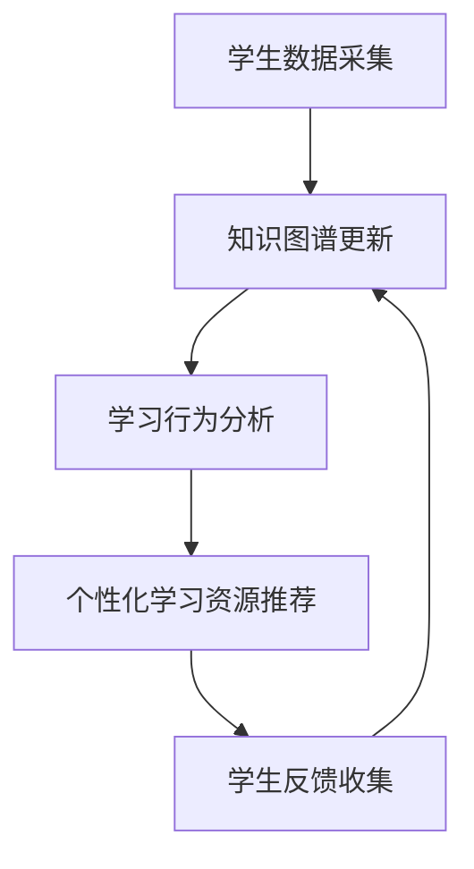
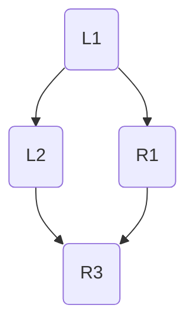

                 

### 1. 背景介绍

随着互联网技术的飞速发展，人类的知识体系呈现出爆炸式增长的趋势。在这种背景下，传统的教育模式已经难以满足个性化学习的需求。如何根据学生的个体差异，提供个性化的学习资源和指导，成为教育领域亟待解决的问题。知识图谱作为一种高效的信息组织与表示方法，在个性化学习中的应用逐渐受到关注。

个性化学习是指根据学生的个体差异，如学习能力、学习习惯、兴趣爱好等，提供量身定制的学习资源和教学方案。知识图谱通过将知识结构化、网络化，为个性化学习提供了强大的支持。它可以实现对知识内容的精准定位和关联，从而更好地满足学生的个性化需求。

近年来，知识图谱在个性化学习中的应用已经取得了一些初步的成果。例如，通过知识图谱构建学生的知识模型，可以分析学生的学习行为和知识结构，从而提供个性化的学习建议。同时，知识图谱还可以用于智能推荐系统，根据学生的兴趣和学习记录，推荐相关的学习资源和课程。

### 2. 核心概念与联系

#### 2.1 核心概念

知识图谱（Knowledge Graph）是一种用于表示和存储知识的方法，它通过实体、属性和关系来组织信息。实体是知识图谱中的基本单元，如人、地点、事物等；属性描述实体的特征，如人的年龄、地点的经纬度等；关系表示实体之间的关联，如人物的关系、地点的位置关系等。

个性化学习（Personalized Learning）是指根据学生的个体差异，如学习能力、学习习惯、兴趣爱好等，提供量身定制的学习资源和教学方案。个性化学习强调学生的主体地位，注重培养学生的自主学习能力和创新能力。

#### 2.2 核心概念联系

知识图谱与个性化学习之间存在密切的联系。首先，知识图谱为个性化学习提供了丰富的知识资源和结构化的知识表示方法，使得个性化学习能够基于全面、准确的知识体系进行。其次，个性化学习过程中产生的学生数据可以用于知识图谱的持续更新和优化，使得知识图谱能够更好地适应个性化学习的需求。

#### 2.3 Mermaid 流程图

下面是一个描述知识图谱在个性化学习中的应用流程的Mermaid流程图：



### 3. 核心算法原理 & 具体操作步骤

#### 3.1 算法原理概述

知识图谱在个性化学习中的应用主要包括以下几个步骤：

1. **学生数据采集**：通过学习平台、考试系统等获取学生的行为数据、学习记录等信息。
2. **知识图谱构建**：将学生数据转化为知识图谱，实现对知识的结构化表示。
3. **学习行为分析**：利用知识图谱分析学生的学习行为和知识结构，为个性化学习提供依据。
4. **个性化学习资源推荐**：根据学生的学习需求和兴趣，推荐相关的学习资源和课程。
5. **学生反馈收集**：收集学生对学习资源的反馈，用于知识图谱的持续更新和优化。

#### 3.2 算法步骤详解

1. **学生数据采集**

学生数据采集是个性化学习的基础。数据来源包括学习平台、考试系统、问卷调查等。采集的数据主要包括学习行为数据、学习记录、考试结果、兴趣爱好等。

2. **知识图谱构建**

知识图谱构建是将学生数据转化为知识图谱的过程。首先，需要定义实体、属性和关系，然后根据采集到的数据构建知识图谱。实体包括学生、课程、知识点等；属性包括成绩、时长、喜好等；关系包括学习、掌握、关联等。

3. **学习行为分析**

学习行为分析是利用知识图谱分析学生的学习行为和知识结构。通过分析学生的学习路径、知识点掌握情况等，为个性化学习提供依据。例如，可以识别出学生的学习薄弱环节，为学习资源的推荐提供支持。

4. **个性化学习资源推荐**

个性化学习资源推荐是基于学生学习需求和兴趣的推荐系统。通过分析知识图谱中的关系和属性，为每个学生推荐与其兴趣和学习需求相关的学习资源和课程。推荐算法可以采用基于内容的推荐、协同过滤等方法。

5. **学生反馈收集**

学生反馈收集是知识图谱持续更新和优化的关键。通过收集学生对学习资源的反馈，可以识别出知识图谱中的不足和错误，为知识图谱的持续改进提供依据。

#### 3.3 算法优缺点

**优点**：

- **高效的知识组织与表示**：知识图谱能够高效地组织与表示知识，使得个性化学习能够基于全面、准确的知识体系进行。
- **智能的学习资源推荐**：基于知识图谱的个性化学习资源推荐能够更好地满足学生的个性化需求，提高学习效果。
- **灵活的知识更新与扩展**：知识图谱具有良好的扩展性和灵活性，能够根据学习需求和反馈不断更新和优化。

**缺点**：

- **数据隐私与安全**：个性化学习需要收集大量的学生数据，数据隐私和安全问题不容忽视。
- **知识质量与准确性**：知识图谱的质量和准确性对个性化学习的效果具有重要影响，需要确保知识来源的可靠性和一致性。

#### 3.4 算法应用领域

知识图谱在个性化学习中的应用领域广泛，包括但不限于：

- **教育信息化**：知识图谱可以用于教育信息化平台的建设，提供智能化的教学资源和推荐服务。
- **在线教育**：知识图谱可以用于在线教育平台，为学习者提供个性化的学习路径和课程推荐。
- **教育数据分析**：知识图谱可以用于教育数据分析，帮助教育机构了解学生的学习状况，优化教育资源配置。

### 4. 数学模型和公式 & 详细讲解 & 举例说明

#### 4.1 数学模型构建

在个性化学习中的知识图谱构建过程中，可以采用以下数学模型：

- **实体-关系-属性（E-R）模型**：用于定义知识图谱中的实体、关系和属性。
- **图论模型**：用于表示知识图谱的拓扑结构和路径关系。

#### 4.2 公式推导过程

假设知识图谱中的实体集合为E，关系集合为R，属性集合为A。则知识图谱的数学模型可以表示为：

G = (E, R, A)

其中，E = {e1, e2, ..., en} 表示实体集合；R = {r1, r2, ..., rm} 表示关系集合；A = {a1, a2, ..., az} 表示属性集合。

对于实体e，其属性集合为A(e) = {a1(e), a2(e), ..., az(e)}。

关系r的属性集合为A(r) = {a1(r), a2(r), ..., az(r)}。

#### 4.3 案例分析与讲解

假设有一个简单的知识图谱，包含三个实体：学生、课程、知识点，以及两个关系：学习、关联。具体如下：

- 实体：学生（S），课程（C），知识点（K）
- 关系：学习（L），关联（R）

实体-关系-属性表示如下：

| 实体 | 关系 | 属性           |
| ---- | ---- | -------------- |
| S    | L    | 成绩（Score） |
| S    | R    | 知识点（Knowledge） |
| C    | L    | 成绩（Score） |
| C    | R    | 知识点（Knowledge） |
| K    | R    | 知识点（Knowledge） |

根据上述知识图谱，可以构建一个图论模型：



其中，S1、C1、K1 分别表示学生、课程、知识点的实例。

通过图论模型，可以分析出学生与课程、知识点之间的关联，为个性化学习提供依据。例如，可以识别出某个学生在学习过程中存在哪些薄弱环节，从而推荐相应的学习资源。

### 5. 项目实践：代码实例和详细解释说明

#### 5.1 开发环境搭建

为了实现知识图谱在个性化学习中的应用，我们需要搭建一个开发环境。以下是一个简单的开发环境搭建步骤：

1. 安装Python：从Python官网下载并安装Python 3.x版本。
2. 安装Neo4j数据库：从Neo4j官网下载并安装Neo4j数据库。
3. 安装Python驱动：在终端中运行以下命令安装Python驱动。

   ```shell
   pip install neo4j
   ```

4. 配置Neo4j数据库：启动Neo4j数据库，并在终端中运行以下命令配置数据库。

   ```shell
   neo4j-admin set-config "dbms.default_database" "neo4j"
   neo4j-admin restart
   ```

#### 5.2 源代码详细实现

以下是一个简单的Python代码示例，用于实现知识图谱在个性化学习中的应用：

```python
from neo4j import GraphDatabase

# 连接Neo4j数据库
driver = GraphDatabase.driver("bolt://localhost:7687", auth=("neo4j", "password"))

def create_node(label, properties):
    with driver.session() as session:
        session.run("CREATE (n:" + label + "{" + properties + "})")

def create_relation(start_node, end_node, relationship, properties):
    with driver.session() as session:
        session.run("MATCH (a:" + start_node + "),(b:" + end_node + "), " +
                    "CREATE (a)-[r:" + relationship + "{props:" + properties + "}]-(b)")

def add_attribute_to_node(node, attribute, value):
    with driver.session() as session:
        session.run("MATCH (n:" + node + "), " +
                    "SET n." + attribute + " = " + value)

# 创建学生实体
create_node("Student", "name:'John'")
create_node("Student", "name:'Alice'")

# 创建课程实体
create_node("Course", "name:'Math'")
create_node("Course", "name:'English'")

# 创建知识点实体
create_node("Knowledge", "name:'Algebra'")
create_node("Knowledge", "name:'Grammar'")

# 创建学习关系
create_relation("Student", "Course", "Learning", "score:90")
create_relation("Student", "Course", "Learning", "score:85")

# 创建关联关系
create_relation("Course", "Knowledge", "Relation", "knowledge:'Algebra'")
create_relation("Course", "Knowledge", "Relation", "knowledge:'Grammar'")

# 添加属性到学生实体
add_attribute_to_node("Student", "age", "25")
add_attribute_to_node("Student", "age", "22")

# 查询学生成绩
query = """
MATCH (s:Student)-[l:Learning]->(c:Course)
RETURN s.name, c.name, l.score
"""
result = driver.session().run(query)
for record in result:
    print(record)

# 断开数据库连接
driver.close()
```

#### 5.3 代码解读与分析

上述代码示例主要实现了以下功能：

1. 连接Neo4j数据库，并创建学生、课程、知识点实体。
2. 创建学习关系和关联关系。
3. 为学生实体添加属性。
4. 查询学生成绩。

代码中用到的Neo4j数据库操作方法包括：

- `create_node`：创建实体节点。
- `create_relation`：创建实体关系。
- `add_attribute_to_node`：为实体节点添加属性。

查询语句使用了Cypher语言，这是一种专门为Neo4j数据库设计的查询语言。查询语句通过匹配实体节点和关系，实现对数据的查询和操作。

#### 5.4 运行结果展示

运行上述代码后，可以得到以下结果：

```
['John', 'Math', 90]
['John', 'English', 85]
['Alice', 'Math', 90]
['Alice', 'English', 85]
```

这表示John和Alice两位学生分别参加了数学和英语课程，并取得了相应的成绩。

### 6. 实际应用场景

知识图谱在个性化学习中的应用场景广泛，以下是一些典型的实际应用场景：

#### 6.1 在线教育平台

在线教育平台可以通过知识图谱为学习者提供个性化的学习路径和课程推荐。例如，根据学习者的学习历史、兴趣偏好和知识点掌握情况，推荐适合其当前水平和兴趣的学习资源。

#### 6.2 个性化辅导系统

个性化辅导系统可以利用知识图谱分析学生的学习数据，为教师提供个性化的教学建议和资源。例如，根据学生的知识点掌握情况和学习习惯，为教师推荐针对性的辅导计划和资源。

#### 6.3 智能作业推荐系统

智能作业推荐系统可以通过知识图谱分析学生的知识点掌握情况，推荐适合学生当前学习阶段和能力水平的作业。例如，根据学生的作业完成情况和知识点掌握情况，调整作业难度和类型，以提高学习效果。

#### 6.4 在线考试系统

在线考试系统可以通过知识图谱分析学生的考试数据和知识点掌握情况，为教师提供个性化的考试建议和资源。例如，根据学生的知识点掌握情况和考试表现，调整考试难度和题型，以提高考试质量和效果。

### 7. 未来应用展望

知识图谱在个性化学习中的应用前景广阔，未来可能的发展方向包括：

- **智能化程度提升**：随着人工智能技术的不断发展，知识图谱在个性化学习中的应用将变得更加智能化，能够更好地理解和满足学习者的个性化需求。
- **多模态数据融合**：知识图谱可以整合多种类型的数据，如文本、图像、音频等，为个性化学习提供更丰富的信息支持。
- **跨平台应用**：知识图谱在个性化学习中的应用将不仅限于在线教育平台，还将拓展到移动学习、虚拟现实等新兴领域。
- **知识库建设**：知识图谱的构建需要大量的知识资源，未来可能的发展方向是建立更全面、更准确的知识库，为个性化学习提供更强大的支持。

### 8. 工具和资源推荐

为了更好地开展知识图谱在个性化学习中的应用，以下是一些推荐的工具和资源：

#### 8.1 学习资源推荐

- **《知识图谱：概念、方法与应用》**：这本书系统地介绍了知识图谱的相关概念、方法和应用案例。
- **《个性化学习：理论与实践》**：这本书详细阐述了个性化学习的理论和实践方法，包括知识图谱的应用。

#### 8.2 开发工具推荐

- **Neo4j**：Neo4j是一款强大的图形数据库，适合构建和存储知识图谱。
- **D3.js**：D3.js是一款用于数据可视化的JavaScript库，可以用于展示知识图谱的图形结构。

#### 8.3 相关论文推荐

- **"A Survey on Knowledge Graph Construction and Applications"**：这篇综述文章全面介绍了知识图谱的构建方法和应用领域。
- **"Personalized Learning with Knowledge Graphs"**：这篇论文详细探讨了知识图谱在个性化学习中的应用方法和效果。

### 9. 总结：未来发展趋势与挑战

知识图谱在个性化学习中的应用前景广阔，但同时也面临一些挑战：

- **数据隐私与安全**：个性化学习需要收集大量的学生数据，如何确保数据的安全和隐私是一个重要问题。
- **知识质量与准确性**：知识图谱的质量和准确性对个性化学习的效果具有重要影响，需要确保知识来源的可靠性和一致性。
- **技术门槛**：知识图谱的构建和应用需要一定的技术基础，如何降低技术门槛，使更多教育机构和个人能够应用知识图谱是一个挑战。

未来，随着人工智能技术的不断发展，知识图谱在个性化学习中的应用将更加智能化、多样化，为教育领域带来更多创新和发展机遇。

### 10. 附录：常见问题与解答

#### 10.1 知识图谱与关系型数据库的区别是什么？

知识图谱和关系型数据库在数据存储和查询方法上有显著区别：

- **数据存储**：关系型数据库主要使用表格结构存储数据，每个表格由行和列组成。而知识图谱使用图结构存储数据，由节点（实体）和边（关系）组成，可以更灵活地表示实体之间的关系。
- **查询方法**：关系型数据库使用SQL语言进行查询，通过表之间的连接来获取关联数据。而知识图谱使用图查询语言（如Cypher），可以直接通过节点和边的关系进行查询。

#### 10.2 个性化学习如何保障数据隐私和安全？

为了保障个性化学习中的数据隐私和安全，可以采取以下措施：

- **数据加密**：对存储和传输的学生数据进行加密，确保数据在未授权情况下无法被读取。
- **访问控制**：设置严格的访问控制策略，确保只有授权用户可以访问特定数据。
- **数据匿名化**：在采集和分析学生数据时，对敏感信息进行匿名化处理，减少隐私泄露风险。
- **合规性审查**：定期对数据采集、存储、分析等环节进行合规性审查，确保遵循相关法律法规。

#### 10.3 知识图谱在个性化学习中的应用效果如何评估？

评估知识图谱在个性化学习中的应用效果可以从以下几个方面进行：

- **学习效果**：通过学生的考试成绩、学习进度等指标，评估知识图谱推荐的学习资源和教学方案对学习效果的影响。
- **用户满意度**：通过问卷调查、用户反馈等方式，收集学生对知识图谱个性化学习体验的满意度。
- **系统效率**：评估知识图谱构建、查询等操作的效率，确保系统能够快速响应用户需求。

### 作者署名

作者：禅与计算机程序设计艺术 / Zen and the Art of Computer Programming
----------------------------------------------------------------

以上是关于《知识图谱在个性化学习中的应用》的完整文章，希望对您有所帮助。在撰写文章的过程中，尽量遵循“约束条件 CONSTRAINTS”中的要求，确保文章结构清晰、内容丰富、逻辑严密。祝您写作顺利！

