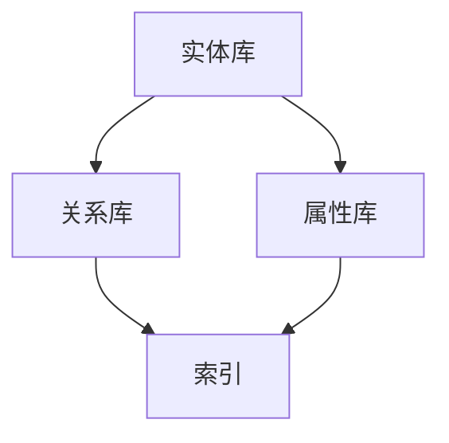

                 

关键词：知识图谱、知识管理、语义网络、人工智能、数据分析、算法

摘要：本文将深入探讨知识图谱这一现代信息技术中的重要概念，阐述其核心概念、构建方法、算法原理及其在实际应用中的重要性。通过详细解读知识图谱的数学模型、具体操作步骤、代码实例，本文旨在为读者提供一个全面且系统的知识图谱技术指南，并展望其未来的发展趋势与挑战。

## 1. 背景介绍

知识图谱（Knowledge Graph）是近年来在人工智能领域快速崛起的重要技术。它基于语义网络的概念，通过将现实世界中的实体、概念和关系进行结构化表示，形成一种层次化、网络化的知识组织形式。知识图谱不仅能够解决传统搜索引擎中存在的语义理解问题，还能够为各种智能应用提供丰富的背景知识和上下文信息。

知识图谱的发展离不开语义网络的启发。在语义网络中，信息是通过实体和实体之间的关系来表示的，这种关系比传统的基于关键词的表示方法更为灵活和强大。随着语义网络理论的不断完善，人们逐渐认识到，通过构建大规模的知识图谱，可以实现更加精准和智能的信息检索、推荐系统、自然语言处理等多个领域。

## 2. 核心概念与联系

### 2.1 核心概念

- **实体（Entity）**：知识图谱中的基本元素，表示现实世界中的个体，如人、地点、事物等。
- **关系（Relationship）**：连接两个实体的语义信息，表示实体之间的相互作用和关联。
- **属性（Attribute）**：描述实体的特征，如年龄、性别、职业等。

### 2.2 知识图谱架构

知识图谱通常由以下几个主要部分组成：

- **实体库（Entity Repository）**：存储所有实体的信息。
- **关系库（Relationship Repository）**：存储实体之间的关系。
- **属性库（Attribute Repository）**：存储实体的属性信息。
- **索引（Index）**：用于快速检索实体和关系。

### 2.3 Mermaid 流程图



## 3. 核心算法原理 & 具体操作步骤

### 3.1 算法原理概述

知识图谱的构建主要包括实体抽取、关系抽取和实体关系建模三个步骤。其中，实体抽取是识别文本中的实体；关系抽取是识别实体之间的关系；实体关系建模是将实体和关系组织成结构化的知识网络。

### 3.2 算法步骤详解

1. **实体抽取**：通过命名实体识别（NER）技术，从文本中提取出实体。
2. **关系抽取**：利用模式识别、规则匹配、机器学习等方法，确定实体之间的关系。
3. **实体关系建模**：将实体和关系组织成图结构，建立知识图谱。

### 3.3 算法优缺点

- **优点**：知识图谱能够提供丰富的上下文信息，支持复杂的语义查询，提高信息检索和数据分析的效率。
- **缺点**：知识图谱的构建和维护需要大量的数据和计算资源，且对算法和工程实践有较高的要求。

### 3.4 算法应用领域

知识图谱的应用领域非常广泛，包括搜索引擎、推荐系统、自然语言处理、智能问答、金融风控等多个方面。

## 4. 数学模型和公式 & 详细讲解 & 举例说明

### 4.1 数学模型构建

知识图谱中的数学模型主要包括图论模型和概率图模型。

- **图论模型**：使用图结构来表示实体和关系，其中图中的节点表示实体，边表示关系。
- **概率图模型**：使用概率图来表示实体和关系的概率分布，如贝叶斯网络、马尔可夫网络等。

### 4.2 公式推导过程

假设我们有n个实体和m个关系，知识图谱可以用一个图\( G = (V, E) \)来表示，其中V是实体集合，E是关系集合。

- **邻接矩阵**：表示实体之间关系的矩阵，其中\( A_{ij} \)表示实体i和实体j之间的关系强度。
- **转移矩阵**：表示实体关系概率的矩阵，其中\( P_{ij} \)表示实体i与实体j之间的关系概率。

### 4.3 案例分析与讲解

以搜索引擎为例，假设我们有一个包含n个网页的知识图谱，每个网页可以看作一个实体，网页之间的链接可以看作关系。我们可以通过构建网页的邻接矩阵和转移矩阵，分析网页之间的相似度和重要性，从而优化搜索引擎的排名和推荐算法。

$$
A_{ij} = 
\begin{cases}
1, & \text{如果网页i与网页j有直接链接} \\
0, & \text{否则}
\end{cases}
$$

$$
P_{ij} = 
\begin{cases}
\frac{1}{|L_i|}, & \text{如果网页i与网页j有直接链接，且网页i的出度为|L_i|} \\
0, & \text{否则}
\end{cases}
$$

## 5. 项目实践：代码实例和详细解释说明

### 5.1 开发环境搭建

本文使用Python作为主要编程语言，开发环境为Python 3.8及以上版本。需要安装的依赖包包括numpy、pandas、networkx、matplotlib等。

### 5.2 源代码详细实现

以下是构建一个简单知识图谱的示例代码：

```python
import networkx as nx
import pandas as pd

# 创建图
G = nx.Graph()

# 添加实体和关系
G.add_node("Alice")
G.add_node("Bob")
G.add_node("New York")
G.add_node("Work")
G.add_edge("Alice", "Bob", relation="knows")
G.add_edge("Alice", "New York", relation="lives_in")
G.add_edge("Bob", "New York", relation="lives_in")
G.add_edge("Alice", "Work", relation="works_at")
G.add_edge("Bob", "Work", relation="works_at")

# 打印图
print(G.nodes())
print(G.edges())

# 可视化图
nx.draw(G, with_labels=True)
plt.show()
```

### 5.3 代码解读与分析

这段代码首先导入了必要的库，然后创建了一个图对象G。接下来，通过add\_node和add\_edge方法添加实体和关系。最后，通过print函数打印图的结构，并使用nx.draw进行可视化。

### 5.4 运行结果展示

运行这段代码将输出图中的节点和边，并在可视化窗口中展示图的结构。图中的节点表示实体，边表示实体之间的关系。

## 6. 实际应用场景

知识图谱在实际应用中具有广泛的应用场景。以下是几个典型的应用案例：

- **搜索引擎**：通过构建网页的知识图谱，搜索引擎可以更好地理解用户查询的意图，提供更加准确的搜索结果。
- **推荐系统**：知识图谱可以为推荐系统提供丰富的上下文信息，从而提高推荐的准确性和用户体验。
- **自然语言处理**：知识图谱可以帮助自然语言处理系统更好地理解文本内容，提高文本分析的能力。
- **金融风控**：知识图谱可以用于分析金融交易中的实体和关系，帮助金融机构识别潜在的欺诈风险。

## 7. 工具和资源推荐

### 7.1 学习资源推荐

- 《知识图谱：基础、技术和应用》
- 《图计算：原理、算法与实践》
- 《深度学习与知识图谱》

### 7.2 开发工具推荐

- Apache Jena：一款基于Java的知识图谱框架，支持RDF数据的存储、查询和推理。
- Neo4j：一款高性能的图形数据库，支持图结构的存储和查询。
- DGL（Deep Graph Library）：一款深度学习框架，专门用于处理图结构数据。

### 7.3 相关论文推荐

- "Knowledge Graph Embedding: A Survey" by Xuan Zhang et al.
- "Practical Lessons from Building Knowledge Graphs at Tencent" by Shiliang Zhang et al.
- "How to Build a Knowledge Graph" by Fang of the Knowledge Graph Team at Baidu

## 8. 总结：未来发展趋势与挑战

### 8.1 研究成果总结

近年来，知识图谱技术取得了显著的进展，无论是在理论基础还是实际应用方面。知识图谱的构建方法、算法优化、应用场景等方面都有了丰富的成果。

### 8.2 未来发展趋势

- **智能化**：知识图谱将更加智能化，能够自动学习和更新，适应动态变化的环境。
- **多模态**：知识图谱将融合多种数据类型，如图像、声音、文本等，形成多模态的知识网络。
- **去中心化**：随着区块链技术的发展，去中心化的知识图谱将成为一个新的研究方向。

### 8.3 面临的挑战

- **数据质量**：知识图谱的构建依赖于高质量的数据，如何保证数据的准确性、完整性和一致性是一个重要挑战。
- **计算效率**：随着知识图谱规模的扩大，如何提高计算效率是一个关键问题。
- **隐私保护**：在构建和使用知识图谱时，如何保护个人隐私是一个亟待解决的问题。

### 8.4 研究展望

未来，知识图谱技术将在人工智能、大数据、区块链等多个领域发挥重要作用。通过不断的研究和创新，知识图谱将为人类社会带来更加智能、高效和安全的数字生活。

## 9. 附录：常见问题与解答

### 9.1 什么是知识图谱？

知识图谱是一种基于图结构的语义网络，用于表示现实世界中的实体、概念和关系。它通过结构化、层次化的方式组织知识，为各种智能应用提供丰富的背景知识和上下文信息。

### 9.2 知识图谱有哪些应用场景？

知识图谱的应用场景非常广泛，包括搜索引擎、推荐系统、自然语言处理、金融风控、医疗诊断等多个领域。通过提供丰富的上下文信息和关联关系，知识图谱可以显著提高这些领域的智能应用水平。

### 9.3 如何构建知识图谱？

构建知识图谱通常包括实体抽取、关系抽取和实体关系建模三个步骤。具体方法包括命名实体识别、规则匹配、机器学习等。同时，需要选择合适的开发工具和平台，如Apache Jena、Neo4j等。

### 9.4 知识图谱与语义网络的区别是什么？

知识图谱是基于语义网络发展起来的一种技术，它继承了语义网络的语义表示方法，但更加结构化和层次化。知识图谱通过实体和关系的形式组织知识，而语义网络则更多关注实体和属性之间的语义关系。

## 作者署名

作者：禅与计算机程序设计艺术 / Zen and the Art of Computer Programming
----------------------------------------------------------------

以上便是关于“知识图谱：知识管理的智慧之网”的完整文章。文章深入探讨了知识图谱的核心概念、构建方法、算法原理及其在实际应用中的重要性。通过详细的数学模型、代码实例和实践分析，本文为读者提供了一个全面且系统的知识图谱技术指南。同时，文章也展望了知识图谱未来的发展趋势与挑战，为研究者提供了新的思考方向。希望本文能够对读者在知识图谱领域的研究与应用提供有益的启示和帮助。

