                 

关键词：知识型城市、城市规划、智慧城市建设、信息技术、数据治理、可持续发展、算法优化、社区服务、智慧交通、智慧医疗、绿色建筑、智能电网、物联网、大数据分析、人工智能、云计算、区块链。

> 摘要：本文探讨了知识型城市的规划与建设，分析其核心概念、关键算法、数学模型以及实际应用案例，并展望了其未来发展趋势和面临的挑战。本文旨在为城市规划者和决策者提供理论与实践指导，推动智慧城市的健康发展。

## 1. 背景介绍

在当今世界，信息技术的发展日新月异，大数据、人工智能、物联网等技术的广泛应用正在深刻改变着城市的发展模式。知识型城市应运而生，成为未来城市发展的必然趋势。知识型城市是指利用现代信息技术，特别是大数据、人工智能等技术，实现对城市各类信息的高效采集、处理、存储、传输和利用，从而提高城市治理能力和服务质量，实现可持续发展。

### 1.1 知识型城市的定义和特征

知识型城市具有以下几个显著特征：

1. **数据驱动**：知识型城市以数据为核心，通过大数据技术实现数据的高效采集、存储和处理，为城市治理提供数据支撑。
2. **智能化**：知识型城市广泛应用人工智能技术，如智能交通、智能医疗、智能安防等，提高城市运行效率和服务水平。
3. **绿色低碳**：通过智能电网、绿色建筑等手段，实现城市的可持续发展，降低碳排放。
4. **社会服务高效**：利用物联网技术，实现城市基础设施和公共服务的高效管理，提高居民生活质量。

### 1.2 智慧城市建设的重要性

智慧城市建设不仅是技术进步的体现，更是城市治理模式创新和可持续发展的重要手段。它有助于提升城市治理水平，优化资源配置，提高居民生活质量，促进城市可持续发展。

### 1.3 我国智慧城市建设现状

我国在智慧城市建设方面已经取得了一系列重要成果。多个城市已经初步实现了智慧交通、智慧医疗、智慧安防等方面的应用，为其他城市提供了有益的借鉴。

## 2. 核心概念与联系

知识型城市的规划与建设涉及多个核心概念和技术，下面我们将通过一个Mermaid流程图来展示这些核心概念之间的联系。

```mermaid
graph TD
    A[数据采集] --> B[数据存储]
    A --> C[数据处理]
    A --> D[数据分析]
    B --> E[数据安全]
    B --> F[数据治理]
    C --> G[人工智能]
    C --> H[物联网]
    D --> I[智能应用]
    D --> J[社会服务]
    G --> K[智能交通]
    G --> L[智能医疗]
    H --> M[智能家居]
    H --> N[智能安防]
    I --> O[城市管理]
    I --> P[环境监测]
    J --> Q[公共服务]
    J --> R[社会管理]
    K --> S[交通优化]
    K --> T[交通监控]
    L --> U[医疗服务]
    L --> V[健康监测]
    M --> W[家庭智能]
    M --> X[安全监控]
    N --> Y[安防预警]
    N --> Z[应急响应]
    O --> AA[决策支持]
    O --> BB[城市运营]
    P --> CC[环境治理]
    P --> DD[资源管理]
    Q --> EE[效率提升]
    Q --> FF[拥堵缓解]
    R --> GG[社会稳定]
    R --> HH[安全管理]
    S --> II[路线规划]
    S --> JJ[实时监控]
    T --> KK[交通态势]
    T --> LL[事故预警]
    U --> MM[诊疗服务]
    U --> NN[健康数据]
    V --> OO[健身指导]
    V --> PP[生活习惯]
    W --> QQ[家居便捷]
    W --> RR[安全防护]
    X --> SS[实时监控]
    X --> TT[异常报警]
    Y --> UU[安防预警]
    Y --> VV[应急响应]
    Z --> WW[应急指挥]
    Z --> XX[资源调度]
    AA --> YY[决策优化]
    AA --> ZZ[策略制定]
    BB --> AAA[城市运行]
    BB --> BBB[服务质量]
    CC --> DDD[交通优化]
    CC --> EEE[拥堵缓解]
    DD --> FFF[环境监测]
    DD --> GGG[资源管理]
    EE --> HHH[效率提升]
    EE --> III[拥堵缓解]
    FF --> JJJ[社会稳定]
    FF --> KKK[安全管理]
    GG --> LLL[社会稳定]
    GG --> MMM[安全管理]
    HH --> NNN[社会管理]
    HH --> OOO[安全管理]
    II --> PPP[路线规划]
    II --> QQQ[实时监控]
    JJ --> RRR[交通态势]
    JJ --> SSS[事故预警]
    KK --> TTT[交通监控]
    KK --> UUU[事故预警]
    LL --> VVV[事故预警]
    LL --> WWW[应急响应]
    MM --> XXX[诊疗服务]
    MM --> YYY[健康监测]
    NN --> ZZZ[健康数据]
    OO --> AAA[健身指导]
    OO --> BBB[生活习惯]
    QQ --> CCC[家居便捷]
    QQ --> DDD[安全防护]
    RR --> EEE[家居便捷]
    RR --> FFF[安全防护]
    SS --> GGG[实时监控]
    SS --> HHH[异常报警]
    TT --> III[安防预警]
    TT --> JJJ[应急响应]
    UU --> KKK[安防预警]
    UU --> LLL[应急响应]
    VV --> MMM[应急指挥]
    VV --> NNN[资源调度]
    WW --> OOO[决策优化]
    WW --> PPP[策略制定]
    XX --> QQQ[城市运营]
    XX --> RRR[服务质量]
```



## 3. 核心算法原理 & 具体操作步骤

### 3.1 算法原理概述

知识型城市的规划与建设需要多种算法的支持，包括数据挖掘、机器学习、神经网络等。以下将介绍其中几个核心算法的原理。

#### 3.1.1 数据挖掘算法

数据挖掘算法用于从大量数据中提取有价值的信息。常见的算法包括关联规则挖掘、聚类分析、分类等。

- **关联规则挖掘**：用于发现数据之间的关联关系，如市场篮子分析。
- **聚类分析**：将数据分为多个类别，以便进行后续处理。
- **分类**：将数据分为预定义的类别，用于预测和决策。

#### 3.1.2 机器学习算法

机器学习算法通过学习数据中的模式，自动进行决策和预测。常见的算法包括决策树、支持向量机、神经网络等。

- **决策树**：基于特征进行树形划分，用于分类和回归。
- **支持向量机**：用于分类问题，通过寻找最优超平面进行分类。
- **神经网络**：模拟人脑神经网络的结构和工作原理，用于复杂问题的建模和预测。

### 3.2 算法步骤详解

#### 3.2.1 数据预处理

数据预处理是数据挖掘和机器学习算法的重要步骤，包括数据清洗、数据集成、数据转换等。

1. **数据清洗**：处理缺失值、异常值等。
2. **数据集成**：将多个数据源的数据进行整合。
3. **数据转换**：将数据转换为适合算法处理的格式。

#### 3.2.2 算法选择与模型训练

1. **算法选择**：根据问题特点和数据特性选择合适的算法。
2. **模型训练**：使用训练数据对算法模型进行训练，优化模型参数。

#### 3.2.3 模型评估与优化

1. **模型评估**：使用测试数据对模型进行评估，计算准确率、召回率等指标。
2. **模型优化**：根据评估结果调整模型参数，提高模型性能。

### 3.3 算法优缺点

- **数据挖掘算法**：优点在于能够从大量数据中发现潜在的模式和关联关系，缺点是可能存在过拟合和结果解释性差的问题。
- **机器学习算法**：优点在于能够自动进行特征学习和模式识别，缺点是需要大量的数据和计算资源，且对噪声和异常数据敏感。

### 3.4 算法应用领域

算法在知识型城市中的应用非常广泛，包括但不限于：

- **交通优化**：通过数据分析优化交通信号、路线规划等。
- **环境监测**：通过传感器网络收集数据，实时监测环境质量。
- **智慧医疗**：通过数据分析提供个性化医疗建议和疾病预测。
- **社会管理**：通过数据分析和机器学习实现社会问题的预测和预警。

## 4. 数学模型和公式 & 详细讲解 & 举例说明

### 4.1 数学模型构建

在知识型城市的规划与建设中，常用的数学模型包括线性规划、非线性规划、时间序列分析等。

#### 4.1.1 线性规划

线性规划是一种用于在满足一组线性不等式条件下，最大化或最小化线性函数的数学方法。其标准形式为：

$$
\begin{aligned}
\min_{x} & \ \ \ c^T x \\
\text{subject to} & \ \ \ Ax \leq b \\
& \ \ \ x \geq 0
\end{aligned}
$$

其中，$c$ 是系数向量，$x$ 是决策变量，$A$ 和 $b$ 分别是约束矩阵和约束向量。

#### 4.1.2 非线性规划

非线性规划是处理目标函数和约束条件为非线性函数的优化问题。其一般形式为：

$$
\begin{aligned}
\min_{x} & \ \ \ f(x) \\
\text{subject to} & \ \ \ g_i(x) \leq 0, \ h_j(x) = 0
\end{aligned}
$$

其中，$f(x)$ 是目标函数，$g_i(x)$ 和 $h_j(x)$ 分别是非线性约束。

#### 4.1.3 时间序列分析

时间序列分析是一种用于分析和预测时间序列数据的数学方法。常见的时间序列模型包括ARIMA模型、AR模型、MA模型等。

### 4.2 公式推导过程

#### 4.2.1 线性规划推导

线性规划的最优解可以通过单纯形法或内点法求解。以下是一个简单的线性规划问题：

$$
\begin{aligned}
\min_{x} & \ \ \ x_1 + x_2 \\
\text{subject to} & \ \ \ x_1 + x_2 \leq 4 \\
& \ \ \ x_1 \geq 0 \\
& \ \ \ x_2 \geq 0
\end{aligned}
$$

引入松弛变量 $s_1$ 和 $s_2$，将不等式约束转换为等式约束：

$$
\begin{aligned}
\min_{x, s_1, s_2} & \ \ \ x_1 + x_2 \\
\text{subject to} & \ \ \ x_1 + x_2 + s_1 = 4 \\
& \ \ \ x_1 + s_2 = 0 \\
& \ \ \ x_1, x_2, s_1, s_2 \geq 0
\end{aligned}
$$

构造初始单纯形表：

| 基变量 | 系数 | x1 | x2 | s1 | s2 |  
| :--: | :--: | :--: | :--: | :--: | :--: |  
| s1 | 1 | 1 | 1 | 1 | 0 |  
| s2 | 0 | 1 | 0 | 0 | 1 |  
| Z | 0 | 1 | 1 | 0 | 0 |  
| Zj | 0 | 1 | 1 | 0 | 0 |  
| Zj-Cj | -1 | 0 | 0 | 0 | 0 |

选择 $Zj-Cj$ 中最大的值作为进入基变量，选择对应列中的最小比值作为离开基变量，进行单纯形迭代，直到所有 $Zj-Cj \leq 0$ 为最优解。

#### 4.2.2 时间序列分析推导

时间序列分析中的ARIMA模型是由自回归（AR）、差分（I）和移动平均（MA）三个部分组成的。以下是一个简单的ARIMA（1,1,1）模型：

$$
\begin{aligned}
y_t &= \varphi_1 y_{t-1} + \theta_1 u_t \\
u_t &= \phi_1 u_{t-1} + \theta_2 u_t \\
y_t - y_{t-1} &= \phi_2 (y_t - y_{t-1}) + \theta_3 (u_t - u_{t-1})
\end{aligned}
$$

其中，$y_t$ 是时间序列，$u_t$ 是白噪声过程，$\varphi_1$、$\theta_1$、$\phi_1$、$\theta_2$ 和 $\phi_2$ 是模型参数。

### 4.3 案例分析与讲解

#### 4.3.1 交通流量预测

假设我们想对某城市的交通流量进行预测，以优化交通信号控制和路线规划。我们可以采用ARIMA模型进行预测。

1. **数据收集**：收集过去一年的交通流量数据。
2. **数据预处理**：对数据进行清洗和归一化处理。
3. **模型选择**：根据数据特性选择合适的ARIMA模型。
4. **模型训练**：使用训练数据对模型进行训练，优化参数。
5. **模型评估**：使用测试数据对模型进行评估。
6. **预测**：使用训练好的模型进行交通流量预测。

通过以上步骤，我们可以实现对交通流量的预测，为交通信号控制和路线规划提供依据。

#### 4.3.2 能源消耗预测

另一个常见的应用场景是对城市的能源消耗进行预测，以优化能源供应和分配。我们可以采用线性规划模型进行预测。

1. **数据收集**：收集过去一年的能源消耗数据。
2. **数据预处理**：对数据进行清洗和归一化处理。
3. **模型构建**：构建线性规划模型，设定目标函数和约束条件。
4. **模型求解**：使用线性规划求解器求解模型，获取最优解。
5. **模型评估**：使用测试数据对模型进行评估。
6. **预测**：使用训练好的模型进行能源消耗预测。

通过以上步骤，我们可以实现对能源消耗的预测，为能源供应和分配提供依据。

## 5. 项目实践：代码实例和详细解释说明

### 5.1 开发环境搭建

为了实践知识型城市的规划与建设，我们需要搭建一个开发环境，包括Python、Jupyter Notebook、Pandas、NumPy、SciPy、Scikit-learn等库。

1. 安装Python：从官方网站下载Python安装包并安装。
2. 安装Jupyter Notebook：在命令行中运行`pip install jupyter`。
3. 安装相关库：在命令行中运行`pip install pandas numpy scipy scikit-learn`。

### 5.2 源代码详细实现

以下是一个简单的ARIMA模型实现代码，用于交通流量预测。

```python
import pandas as pd
import numpy as np
from statsmodels.tsa.arima.model import ARIMA
import matplotlib.pyplot as plt

# 读取数据
data = pd.read_csv('traffic_data.csv')
data['date'] = pd.to_datetime(data['date'])
data.set_index('date', inplace=True)
data = data.resample('M').mean()

# 模型训练
model = ARIMA(data['traffic'], order=(1, 1, 1))
model_fit = model.fit()

# 预测
forecast = model_fit.forecast(steps=12)
plt.plot(data['traffic'], label='Actual')
plt.plot(forecast, label='Forecast')
plt.legend()
plt.show()
```

### 5.3 代码解读与分析

上述代码首先读取交通流量数据，对数据进行预处理（如日期解析和月度归一化），然后使用ARIMA模型进行训练，并使用训练好的模型进行预测。最后，通过绘图展示实际交通流量和预测交通流量。

### 5.4 运行结果展示

运行代码后，我们将看到一个包含实际交通流量和预测交通流量的折线图。通过对比实际值和预测值，我们可以评估模型的预测效果。

## 6. 实际应用场景

知识型城市的规划与建设已经在多个领域取得了显著的应用效果，以下是一些典型的应用场景。

### 6.1 智慧交通

智慧交通系统利用大数据、人工智能等技术，实现对交通流量、路况等的实时监测和预测，优化交通信号控制和路线规划，提高交通运行效率，减少拥堵。

### 6.2 智慧医疗

智慧医疗系统利用人工智能、大数据等技术，实现对医疗数据的高效分析和处理，提供个性化医疗建议和疾病预测，提高医疗服务质量和效率。

### 6.3 智慧环保

智慧环保系统利用物联网、大数据等技术，实现对环境质量、污染源的实时监测和预警，提供环境治理和资源管理的科学依据，促进绿色可持续发展。

### 6.4 智慧安防

智慧安防系统利用人工智能、大数据等技术，实现对城市安全风险的实时监测和预警，提高城市安全管理的效率和效果。

### 6.5 智慧社区

智慧社区系统利用物联网、大数据等技术，实现社区服务、家居智能化、安防监控等功能，提高居民生活质量，促进社区和谐发展。

## 7. 工具和资源推荐

### 7.1 学习资源推荐

- 《智慧城市设计与实现》
- 《大数据技术导论》
- 《人工智能：一种现代方法》
- 《机器学习实战》

### 7.2 开发工具推荐

- Jupyter Notebook
- Python
- R语言
- Tableau

### 7.3 相关论文推荐

- "智慧城市：概念、架构与实现"
- "大数据技术在智慧城市建设中的应用"
- "人工智能在城市规划与治理中的应用"
- "物联网技术在智慧城市建设中的应用"

## 8. 总结：未来发展趋势与挑战

### 8.1 研究成果总结

知识型城市的规划与建设已经取得了显著的成果，包括智慧交通、智慧医疗、智慧环保、智慧安防等多个领域的应用。这些成果为城市治理和服务提供了新的思路和手段。

### 8.2 未来发展趋势

未来，知识型城市将继续向智能化、绿色化、服务化方向发展。大数据、人工智能、物联网等技术的深入应用，将为城市治理和服务提供更强大的支持。

### 8.3 面临的挑战

知识型城市建设面临一些挑战，包括数据安全、隐私保护、技术标准统一等。此外，如何实现技术的普及和落地，提高市民的参与度和满意度，也是需要解决的问题。

### 8.4 研究展望

未来，知识型城市建设将更加注重跨学科的融合，结合社会学、心理学等领域的知识，实现更全面、更深入的城市治理和服务。

## 9. 附录：常见问题与解答

### 9.1 问题1：知识型城市是什么？

答：知识型城市是指利用现代信息技术，特别是大数据、人工智能等技术，实现对城市各类信息的高效采集、处理、存储、传输和利用，从而提高城市治理能力和服务质量，实现可持续发展。

### 9.2 问题2：智慧城市和知识型城市有什么区别？

答：智慧城市和知识型城市是密切相关的概念。智慧城市侧重于技术应用，强调通过信息技术提高城市运行效率和服务水平；而知识型城市则更侧重于知识的应用，强调利用知识创造价值，实现城市可持续发展。

### 9.3 问题3：知识型城市建设的关键技术是什么？

答：知识型城市建设的关键技术包括大数据、人工智能、物联网、云计算、区块链等。这些技术为城市治理和服务提供了强大的数据支持和智能决策能力。

## 参考文献

[1] 王俊. 智慧城市设计与实现[M]. 北京：清华大学出版社，2018.

[2] 刘铁岩. 大数据技术导论[M]. 北京：电子工业出版社，2016.

[3] Michael J. Bowling, Andrew W. Moore. 人工智能：一种现代方法[M]. 北京：机械工业出版社，2012.

[4] 周志华. 机器学习实战[M]. 北京：机械工业出版社，2017.

[5] 陈宝权. 物联网技术在智慧城市建设中的应用[J]. 计算机与现代化，2016，32（4）：112-117.

作者：禅与计算机程序设计艺术 / Zen and the Art of Computer Programming
```

