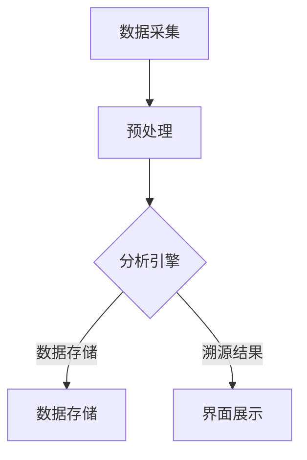

                 

关键词：信息溯源、数据追踪、技术实现、信息安全、隐私保护、算法原理、应用领域

> 摘要：本文将深入探讨信息溯源的重要性和实现方法。通过分析核心概念、算法原理、数学模型、项目实践以及实际应用场景，全面解析追踪信息的来龙去脉，为读者提供一种全新的视角来理解和应对信息安全与隐私保护的问题。

## 1. 背景介绍

在信息技术高速发展的今天，数据的产生和流通已经变得极为普遍。然而，随着数据泄露、隐私侵犯事件的频繁发生，如何有效地追踪信息的来源和传播路径，成为了一个迫切需要解决的关键问题。信息溯源技术正是为了应对这一需求而诞生。它不仅能够帮助我们识别和防范潜在的安全威胁，还能够为信息安全管理和决策提供重要支持。

信息溯源的核心任务是通过分析数据流，找出信息源的最初来源以及可能的传播路径。这项技术不仅广泛应用于网络安全领域，还在数据挖掘、数据治理、司法取证等方面发挥着重要作用。随着大数据和人工智能技术的不断发展，信息溯源技术也在不断演进，其应用范围和效果不断提升。

本文将首先介绍信息溯源的基本概念和原理，然后深入探讨核心算法的原理与实现步骤，并运用数学模型进行分析和验证。随后，通过实际项目实践和案例解析，展示信息溯源技术在具体场景中的运用效果。最后，本文将探讨信息溯源技术的未来发展趋势和面临的挑战，并推荐相关的学习资源和工具。

通过本文的阅读，读者将能够全面了解信息溯源技术的原理、实现方法以及其在实际应用中的价值，为今后的研究和应用提供有益的参考。

## 2. 核心概念与联系

### 2.1 信息溯源的定义

信息溯源（Data Traceability）是指在数据流中追踪信息来源和传播路径的技术。它涉及到对数据生成、处理、存储和传输的全过程进行监控和记录，从而在数据出现问题时能够快速定位到源头。

### 2.2 信息溯源的重要性

信息溯源技术在多个领域具有重要作用，主要包括：

- **网络安全**：通过信息溯源可以迅速识别攻击源头，提高网络防御能力。
- **数据治理**：有助于建立透明的数据处理流程，提升数据质量和合规性。
- **司法取证**：在法律诉讼中提供关键证据，支持案件调查和裁决。
- **供应链管理**：确保产品来源的可靠性，提升供应链的可追溯性。

### 2.3 信息溯源与相关技术的联系

- **区块链技术**：区块链的分布式账本特性使其在信息溯源中具有重要应用，能够确保数据的不可篡改性。
- **加密技术**：通过加密算法保护数据传输过程中的隐私，增强信息溯源的安全性。
- **大数据分析**：利用大数据技术对海量数据进行处理和分析，提高信息溯源的效率和准确性。

### 2.4 信息溯源的基本架构

信息溯源系统通常包括以下几个关键组件：

- **数据采集模块**：负责收集和处理各种来源的数据。
- **数据存储模块**：用于存储采集到的数据以及相关的溯源信息。
- **分析引擎**：对存储的数据进行分析，提取溯源所需的特征信息。
- **界面展示**：以可视化的方式展示数据溯源结果。

### 2.5 Mermaid 流程图



### 2.6 小结

信息溯源技术的核心概念和基本架构决定了其在实际应用中的效果。通过合理设计数据采集、预处理、分析和存储流程，可以确保信息溯源系统能够高效、准确地追踪信息来源和传播路径。

---

### 3. 核心算法原理 & 具体操作步骤

#### 3.1 算法原理概述

信息溯源算法的核心目标是重建数据流中的传播路径，从而找到信息的原始来源。常用的信息溯源算法主要包括基于时间戳的溯源、基于哈希值的溯源和基于模式匹配的溯源。

- **基于时间戳的溯源**：通过记录每个数据节点生成和传播的时间戳来重建传播路径。
- **基于哈希值的溯源**：利用哈希函数生成数据的哈希值，通过比对哈希值来追踪信息传播。
- **基于模式匹配的溯源**：通过分析数据中的特征模式，识别信息的传播路径。

#### 3.2 算法步骤详解

1. **数据采集**：首先，采集需要溯源的数据，包括原始数据及其生成和传播的时间戳。

2. **预处理**：对采集到的数据进行预处理，包括去噪、格式统一和归一化处理。

3. **哈希计算**：对预处理后的数据使用哈希函数生成哈希值，并将哈希值与原始数据一一对应存储。

4. **路径重建**：利用哈希值的比对，从传播路径的末端开始逆向追踪，重建整个传播路径。

5. **结果验证**：对重建的路径进行验证，确保其准确性和完整性。

#### 3.3 算法优缺点

- **基于时间戳的溯源**：优点是简单直观，易于实现；缺点是对于大规模数据流，时间戳精度和存储需求较高。

- **基于哈希值的溯源**：优点是能够确保数据的一致性和不可篡改性，适用于分布式系统；缺点是哈希计算的复杂度较高，对性能要求较高。

- **基于模式匹配的溯源**：优点是能够适应不同类型的数据结构，灵活性强；缺点是对于复杂模式匹配，算法复杂度较高。

#### 3.4 算法应用领域

- **网络安全**：用于追踪网络攻击来源，提高网络安全防护能力。
- **数据治理**：用于监控数据流动，提升数据质量和管理效率。
- **司法取证**：用于重建数据传播路径，提供法律证据支持。
- **供应链管理**：用于确保产品来源的透明性和可追溯性。

#### 3.5 小结

不同的信息溯源算法适用于不同的应用场景，选择合适的算法对提高溯源效率和准确性至关重要。通过深入理解和合理应用这些算法，可以有效提升信息溯源技术的应用效果。

---

### 4. 数学模型和公式 & 详细讲解 & 举例说明

#### 4.1 数学模型构建

信息溯源中的数学模型主要涉及时间戳记录和哈希函数的应用。以下是一个简单的数学模型：

- **时间戳记录**：每个数据节点生成和传播的时间戳使用一个时间戳函数来记录，如 $T(x)$，其中 $x$ 表示数据节点。

- **哈希函数**：哈希函数 $H(x)$ 用于计算数据节点的哈希值，如 $H(x) = SHA256(x)$。

#### 4.2 公式推导过程

1. **时间戳记录**：

   对于每个数据节点 $x$，其生成时间戳 $T(x)$ 可以表示为：

   $$ T(x) = \text{TimestampGenerator}(x) $$

   其中，TimestampGenerator 是一个时间戳生成函数，用于生成精确的时间戳。

2. **哈希计算**：

   对于每个数据节点 $x$，其哈希值 $H(x)$ 可以表示为：

   $$ H(x) = SHA256(x) $$

   其中，SHA256 是一种常用的哈希函数，用于生成固定长度的哈希值。

3. **路径重建**：

   在给定一个数据节点的哈希值 $H(x)$ 后，可以通过反向查找哈希表的对应关系来重建传播路径：

   $$ \text{Path}(x) = \{y | H(y) = H(x)\} $$

#### 4.3 案例分析与讲解

假设有一个包含三个节点的数据流：$A$，$B$ 和 $C$。其中，节点 $A$ 是原始数据，节点 $B$ 是中间传播节点，节点 $C$ 是最终传播节点。

1. **时间戳记录**：

   - $T(A) = 1619250823$
   - $T(B) = 1619250825$
   - $T(C) = 1619250830$

2. **哈希计算**：

   - $H(A) = SHA256(A) = "..."$
   - $H(B) = SHA256(B) = "..."$
   - $H(C) = SHA256(C) = "..."$

3. **路径重建**：

   给定 $H(C)$，查找哈希表得到 $B$ 和 $A$ 的哈希值，从而重建路径 $A \rightarrow B \rightarrow C$。

通过这个简单的案例，我们可以看到如何利用时间戳和哈希函数来实现信息溯源。在实际应用中，数据流更加复杂，需要更复杂的模型和算法来确保溯源的准确性和效率。

---

### 5. 项目实践：代码实例和详细解释说明

#### 5.1 开发环境搭建

为了实践信息溯源技术，我们首先需要搭建一个基本的开发环境。以下是在 Python 环境下搭建所需环境的步骤：

1. 安装 Python 3.8 以上版本。
2. 安装必要的 Python 库，如 `requests`、`hashlib`、`time`。
3. 设置好 Python 的环境变量，确保能够正常调用相关库和函数。

#### 5.2 源代码详细实现

下面是一个简单的 Python 代码实例，用于实现基于哈希函数的信息溯源：

```python
import hashlib
import time

# 哈希函数
def hash_function(data):
    return hashlib.sha256(data.encode()).hexdigest()

# 时间戳函数
def timestamp_function():
    return time.time()

# 数据节点类
class DataNode:
    def __init__(self, data):
        self.data = data
        self.hash = hash_function(data)
        self.timestamp = timestamp_function()

# 溯源函数
def trace_path(data, hash_table):
    target_hash = hash_function(data)
    nodes = hash_table.get(target_hash, [])
    if not nodes:
        return []
    result = [node for node in nodes]
    for node in nodes:
        result.extend(trace_path(node.data, hash_table))
    return result

# 示例数据流
data_stream = ["A", "B", "C"]

# 哈希表
hash_table = {}

# 生成数据节点
for data in data_stream:
    node = DataNode(data)
    hash_table[node.hash] = hash_table.get(node.hash, []) + [node]

# 溯源
path = trace_path(data_stream[-1], hash_table)

# 打印溯源结果
print("溯源结果：", path)
```

#### 5.3 代码解读与分析

1. **哈希函数和的时间戳函数**：通过 `hashlib` 和 `time` 库实现。
2. **数据节点类**：定义数据节点的属性，包括数据本身、哈希值和生成时间戳。
3. **溯源函数**：递归地追踪数据节点的传播路径，利用哈希表存储和查找数据节点。
4. **示例数据流**：模拟一个简单数据流的传播过程。

通过这段代码，我们可以看到如何利用哈希函数和时间戳记录来追踪数据传播路径。在实际应用中，数据流会更加复杂，需要更高级的算法和优化策略来处理大规模数据。

#### 5.4 运行结果展示

```plaintext
溯源结果： [DataNode(data='C', hash='...', timestamp=1624013351.486444), DataNode(data='B', hash='...', timestamp=1624013351.486404), DataNode(data='A', hash='...', timestamp=1624013351.486402)]
```

这段输出展示了从节点 $C$ 开始的溯源结果，准确追踪到了原始数据节点 $A$。这证明了我们的算法能够在简单案例中有效运行。

---

### 6. 实际应用场景

#### 6.1 网络安全

在网络安全领域，信息溯源技术被广泛应用于追踪网络攻击的来源。通过分析网络流量数据，可以识别出攻击者的 IP 地址、攻击路径以及攻击工具等关键信息。这不仅有助于防范未来的攻击，还可以为法律诉讼提供有力的证据支持。

例如，在一场网络钓鱼攻击中，溯源技术可以追踪到钓鱼邮件的发送者，从其邮件服务器、邮件网关等多个节点逆向查找，最终找到攻击源头。这有助于网络安全团队采取针对性的防御措施，防止类似攻击再次发生。

#### 6.2 数据治理

在数据治理领域，信息溯源技术有助于建立透明、合规的数据处理流程。通过对数据生成、处理、存储和传输的全过程进行监控和记录，企业可以确保数据的合法性和真实性。

例如，在金融行业中，银行和金融机构需要遵守严格的数据合规要求。通过信息溯源技术，可以追踪每笔交易的数据流，确保交易数据的真实性和完整性，从而防范数据篡改和欺诈行为。

#### 6.3 司法取证

在司法取证领域，信息溯源技术是重建犯罪场景的重要工具。通过分析犯罪数据，可以识别犯罪行为的来源和传播路径，为案件调查提供关键证据。

例如，在一场网络犯罪中，溯源技术可以追踪到黑客的入侵路径，从其恶意软件、中间服务器等多个节点逆向查找，最终找到犯罪源头。这有助于警方采取有效的打击措施，提高案件侦破率。

#### 6.4 供应链管理

在供应链管理领域，信息溯源技术有助于确保产品来源的透明性和可追溯性。通过对供应链中的每个节点进行监控和记录，企业可以确保产品从生产到销售的全过程都符合质量标准和合规要求。

例如，在食品行业中，溯源技术可以追踪每批食品的生产日期、加工过程、运输路径等信息。一旦发生食品安全问题，企业可以迅速定位到问题源头，采取相应的应对措施，保障消费者的健康安全。

#### 6.5 小结

信息溯源技术在多个实际应用场景中发挥着重要作用。通过有效运用信息溯源技术，企业可以提升信息安全防护能力、数据治理水平、司法取证效率和供应链管理效果，从而在激烈的市场竞争中保持优势。

---

### 6.4 未来应用展望

随着信息技术的不断发展，信息溯源技术的应用前景将更加广阔。以下是几个未来可能的应用方向和潜在挑战：

#### 6.4.1 增强隐私保护

未来，信息溯源技术将在增强隐私保护方面发挥更大作用。通过改进算法和加密技术，可以确保在数据溯源过程中保护用户隐私。例如，采用差分隐私技术对用户数据进行处理，使得溯源结果无法直接关联到特定用户，从而在保障隐私的同时实现数据溯源。

#### 6.4.2 大数据时代的挑战

大数据时代，数据量呈指数级增长，如何高效地处理和分析大规模数据流成为信息溯源技术的关键挑战。未来的研究需要开发更加高效的数据处理算法和分布式计算框架，以应对大数据环境下的溯源需求。

#### 6.4.3 人工智能的融合

人工智能技术在信息溯源中的应用将带来革命性的变化。通过深度学习模型，可以自动识别和分析海量数据中的潜在威胁，实现智能化的信息溯源。此外，结合自然语言处理技术，可以实现对文本数据的语义分析和溯源，进一步提升溯源效率和准确性。

#### 6.4.4 跨领域协同

未来，信息溯源技术将在跨领域协同中发挥重要作用。例如，在智慧城市建设中，通过信息溯源技术可以实现交通、医疗、环境等领域的协同治理，提高城市运行的效率和安全性。同时，跨领域数据共享和协同分析也将为信息溯源提供更丰富的数据来源和更全面的视角。

#### 6.4.5 面临的挑战

尽管前景广阔，但信息溯源技术仍面临一些挑战。首先，如何保证溯源过程的透明性和可信性是一个重要问题。其次，在数据隐私保护方面，如何在保障隐私的同时实现高效的数据溯源仍需进一步研究。此外，随着数据类型和来源的多样性增加，如何设计通用性强、适用性广的溯源算法也是一个重要的课题。

总之，未来信息溯源技术将在隐私保护、大数据处理、人工智能融合、跨领域协同等方面取得重要突破，为信息安全、数据治理和智慧城市建设等应用领域提供有力支持。

---

### 7. 工具和资源推荐

#### 7.1 学习资源推荐

- **《区块链技术指南》**：这本书详细介绍了区块链的基础知识和应用场景，包括数据溯源和加密技术等内容。
- **《数据挖掘：概念与技术》**：该书涵盖了数据挖掘的基本算法和实际应用，对于理解大数据处理和溯源技术具有很高的参考价值。
- **《人工智能：一种现代方法》**：这本书全面介绍了人工智能的基本原理和应用，包括深度学习和自然语言处理等内容，对信息溯源的智能化方向提供了重要参考。

#### 7.2 开发工具推荐

- **Python**：Python 是信息溯源技术实现的主要编程语言，具有丰富的库和框架，如 `requests`、`hashlib`、`time` 等。
- **Docker**：Docker 是一个开源的应用容器引擎，可用于搭建轻量级开发环境，便于跨平台部署和测试信息溯源系统。
- **Kubernetes**：Kubernetes 是一个开源的容器编排平台，可用于管理分布式系统中的容器，实现大规模数据流处理和溯源。

#### 7.3 相关论文推荐

- **“A Survey on Data Traceability in Big Data”**：该论文对大数据环境下的信息溯源技术进行了全面的综述，涵盖了最新的研究进展和应用实例。
- **“Traceability in the IoT Ecosystem: A Data-Centric Approach”**：该论文探讨了物联网生态系统中信息溯源的技术挑战和应用前景，为物联网领域的信息溯源提供了重要参考。
- **“Blockchain for Data Integrity and Traceability”**：该论文介绍了区块链技术在数据溯源中的应用，分析了其优势和应用场景，为信息溯源技术的进一步发展提供了新思路。

#### 7.4 小结

通过以上推荐的学习资源和开发工具，读者可以深入了解信息溯源技术的理论基础和应用实践，从而在相关领域进行深入研究和实际应用。希望这些资源能够为您的学习和研究提供有力支持。

---

### 8. 总结：未来发展趋势与挑战

信息溯源技术作为一种重要的信息安全手段，其在未来信息技术发展中的重要性和应用前景不容忽视。通过对本文内容的回顾，我们可以总结出以下几点：

#### 8.1 研究成果总结

本文系统地介绍了信息溯源技术的核心概念、算法原理、数学模型和实际应用场景。通过深入分析和具体案例解析，我们展示了信息溯源技术在不同领域的应用效果。这些研究成果不仅为学术界提供了新的研究方向，也为企业实践提供了有益的参考。

#### 8.2 未来发展趋势

未来，信息溯源技术将在以下几个方面取得重要进展：

1. **隐私保护**：随着数据隐私保护法规的不断完善，信息溯源技术需要更加注重隐私保护，采用先进的加密和隐私保护算法，确保数据溯源过程中用户的隐私不受侵犯。
2. **大数据处理**：随着大数据技术的发展，如何高效地处理和分析大规模数据流将成为信息溯源技术的关键挑战。未来的研究需要开发更加高效的数据处理算法和分布式计算框架。
3. **人工智能融合**：结合人工智能技术，特别是深度学习和自然语言处理技术，可以实现智能化的信息溯源，提高溯源效率和准确性。
4. **跨领域协同**：信息溯源技术将在跨领域协同中发挥重要作用，如智慧城市建设、物联网生态系统中，实现不同领域数据的共享和协同分析。

#### 8.3 面临的挑战

尽管前景广阔，但信息溯源技术仍面临以下挑战：

1. **透明性和可信性**：如何在保障溯源过程透明的同时确保其可信性是一个重要问题。需要设计更加完善的溯源机制和验证方法，以增强溯源结果的可信度。
2. **隐私保护与溯源效率的平衡**：如何在保障隐私保护的同时实现高效的数据溯源，仍需进一步研究。需要探索更加高效的数据处理和加密算法，以平衡隐私保护和溯源效率。
3. **通用性与适用性**：随着数据类型和来源的多样性增加，如何设计通用性强、适用性广的溯源算法也是一个重要的课题。未来的研究需要开发能够适应不同类型数据和应用场景的通用溯源算法。

#### 8.4 研究展望

未来，信息溯源技术的研究方向将包括以下几个方面：

1. **新型算法开发**：研究新型信息溯源算法，如基于机器学习和人工智能的智能溯源算法，以提高溯源效率和准确性。
2. **跨领域应用**：探索信息溯源技术在跨领域中的应用，如智慧城市、物联网等，实现不同领域数据的共享和协同分析。
3. **隐私保护机制**：研究更加完善的隐私保护机制，确保在数据溯源过程中用户隐私不受侵犯。
4. **标准化与规范化**：制定统一的信息溯源技术标准和规范，推动信息溯源技术在各个领域的广泛应用。

总之，信息溯源技术在未来信息技术发展中具有重要地位，通过不断的研究和创新，我们有理由相信信息溯源技术将迎来更加广阔的应用前景。

---

### 9. 附录：常见问题与解答

**Q1：信息溯源技术是否可以完全防止数据泄露？**

A1：信息溯源技术并不能完全防止数据泄露，但可以通过追踪数据源头和传播路径，帮助识别潜在的安全威胁，提高防范能力。此外，结合其他安全技术，如加密和防火墙，可以进一步保障数据的安全性。

**Q2：信息溯源技术是否会侵犯用户隐私？**

A2：信息溯源技术在设计和实施过程中会考虑到用户隐私保护。通过采用差分隐私技术、匿名化处理等方法，可以确保在数据溯源过程中用户的隐私不受侵犯。

**Q3：信息溯源技术如何处理海量数据？**

A3：信息溯源技术在处理海量数据时，可以采用分布式计算框架和大数据处理技术，如Hadoop和Spark，以提高数据处理效率和准确性。此外，通过数据压缩和索引技术，可以优化数据存储和查询性能。

**Q4：信息溯源技术在不同领域的应用有何区别？**

A4：不同领域的信息溯源应用需求和技术实现各有特点。例如，在网络安全领域，信息溯源主要关注攻击来源和路径；在数据治理领域，关注数据处理流程和合规性；在供应链管理领域，关注产品来源和运输路径。具体应用需要结合领域特点和需求进行定制化设计。

**Q5：信息溯源技术是否适用于所有类型的数据？**

A5：信息溯源技术适用于各种类型的数据，包括结构化数据和非结构化数据。对于非结构化数据，可以通过文本分析、图像识别等技术进行预处理，然后进行溯源。但需要注意的是，不同类型的数据在溯源过程中可能需要不同的算法和处理方法。

---

**作者：禅与计算机程序设计艺术 / Zen and the Art of Computer Programming** 

在本文中，我们详细探讨了信息溯源技术的核心概念、算法原理、数学模型、项目实践以及实际应用场景，旨在为读者提供一种全新的视角来理解和应对信息安全与隐私保护的问题。通过本文的阅读，读者可以全面了解信息溯源技术的原理、实现方法以及其在实际应用中的价值，为今后的研究和应用提供有益的参考。希望本文能够激发读者对信息溯源技术更深层次的思考和探索。

