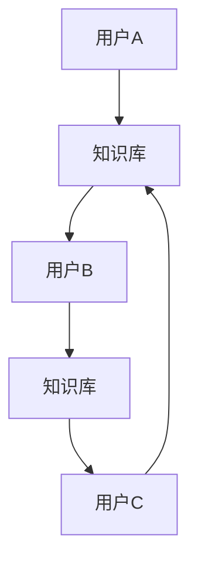

                 

 在信息技术飞速发展的今天，知识的获取和共享方式正经历着深刻的变革。传统的集中式学习平台正逐渐被去中心化的P2P（Peer-to-Peer）学习平台所取代。本文将探讨P2P学习平台的兴起，以及其对教育领域带来的深远影响。

## 关键词

- 知识共享
- P2P学习平台
- 去中心化
- 教育革命
- 去中心化应用程序（DApp）

## 摘要

本文首先介绍了P2P学习平台的背景和核心概念，包括其去中心化的架构特点。随后，深入分析了P2P学习平台的算法原理、数学模型以及具体的操作步骤。接着，通过代码实例展示了如何在实际中构建和部署P2P学习平台。最后，探讨了P2P学习平台的实际应用场景、未来发展趋势以及面临的挑战。

## 1. 背景介绍

### 1.1 传统集中式学习平台的局限

在互联网普及之前，知识主要依赖于传统集中式学习平台进行传播。这些平台通常由某些权威机构或组织控制，如大学、学院或在线教育公司。这些中心化的平台提供了丰富的学习资源，但也存在着一些显著的局限性。

1. **成本问题**：建立和维护这些中心化平台需要大量的资金投入，这往往导致学习资源的高昂成本。
2. **内容限制**：中心化平台的内容通常受到权威机构的控制，这可能限制了知识的多样性和自由度。
3. **数据隐私**：用户的学习数据通常存储在中心化服务提供商的服务器上，这可能导致数据泄露和滥用的问题。

### 1.2 去中心化与P2P学习平台

随着区块链技术和加密货币的兴起，去中心化的概念开始受到广泛关注。去中心化是指通过分布式网络来管理数据和服务，避免了单一中心点的集中控制。P2P学习平台正是基于这种去中心化的理念构建的。

P2P学习平台的特点如下：

1. **去中心化架构**：P2P学习平台没有中央控制节点，所有参与者都可以平等地贡献和获取知识。
2. **成本效益**：由于去除了中心化的基础设施，P2P学习平台可以显著降低成本，使得知识获取更加普及。
3. **数据隐私**：用户的学习数据存储在各自的设备上，避免了数据泄露的风险。
4. **内容多样性**：去中心化的特点使得任何人都可以贡献知识，从而丰富了学习资源的多样性。

## 2. 核心概念与联系

### 2.1 P2P学习平台的工作原理

P2P学习平台的核心在于其去中心化的网络结构。以下是一个简化的Mermaid流程图，描述了P2P学习平台的基本工作原理：



在这个流程中，用户A可以从知识库中获取知识，同时也可以将自己的知识贡献到知识库中。用户B和用户C同样可以进行知识的获取和贡献。

### 2.2 P2P学习平台的架构

P2P学习平台的架构可以分为三个主要部分：用户层、网络层和数据层。

1. **用户层**：用户层包括学习者、教师和内容提供者。学习者可以从其他用户那里获取知识，教师可以分享教学资源，内容提供者则提供专业的知识内容。
2. **网络层**：网络层负责管理用户之间的通信和数据交换。这通常通过P2P网络协议来实现，如BitTorrent。
3. **数据层**：数据层负责存储和索引学习资源。这些资源可以是文本、视频、音频等多种形式。数据通常存储在分布式文件系统中，如IPFS。

### 2.3 P2P学习平台的优势与挑战

#### 优势

1. **去中心化**：去中心化避免了单一中心点的风险，提高了系统的可靠性和抗攻击能力。
2. **成本效益**：去中心化的架构降低了建设和维护平台的成本。
3. **内容多样性**：去中心化使得任何人都可以贡献知识，从而丰富了学习资源的多样性。
4. **数据隐私**：用户的数据存储在各自的设备上，提高了数据的安全性。

#### 挑战

1. **网络延迟**：由于P2P网络是分布式架构，数据传输可能存在延迟。
2. **网络安全**：去中心化的平台可能面临更多的网络安全风险，如DDoS攻击。
3. **资源分配**：在去中心化的网络中，如何公平地分配资源是一个挑战。

## 3. 核心算法原理 & 具体操作步骤

### 3.1 算法原理概述

P2P学习平台的核心算法通常是基于分布式哈希表（DHT）和区块链技术。DHT用于高效地管理网络中的节点和数据的分布，而区块链则用于确保数据的不可篡改性和透明性。

### 3.2 算法步骤详解

1. **节点加入**：新节点需要向网络中的其他节点发送加入请求，并通过DHT算法选择合适的邻居节点。
2. **数据存储**：用户上传的文件或知识内容将被分成多个数据块，并通过加密算法进行加密，然后存储在分布式文件系统中。
3. **数据检索**：用户需要通过DHT算法查询所需的数据块的位置，然后从其他节点下载数据。
4. **数据验证**：下载的数据块需要通过区块链上的智能合约进行验证，确保其完整性。

### 3.3 算法优缺点

#### 优点

1. **高效性**：DHT算法能够快速找到所需的数据块，提高了数据检索效率。
2. **安全性**：区块链技术确保了数据的不可篡改性，提高了系统的安全性。
3. **去中心化**：去中心化的架构避免了单一中心点的风险，提高了系统的可靠性。

#### 缺点

1. **网络延迟**：由于数据需要在多个节点之间传输，可能会存在一定的延迟。
2. **计算资源消耗**：DHT算法和区块链技术都需要大量的计算资源，这可能增加系统的能耗。

### 3.4 算法应用领域

P2P学习平台的核心算法可以应用于多种场景，包括但不限于：

1. **在线教育**：通过P2P学习平台，教师和学生可以轻松地共享和获取教育资源。
2. **知识库构建**：去中心化的知识库可以容纳来自不同领域和不同背景的用户贡献的知识。
3. **科研合作**：科研人员可以借助P2P学习平台进行协作，共享研究成果和实验数据。

## 4. 数学模型和公式 & 详细讲解 & 举例说明

### 4.1 数学模型构建

P2P学习平台的数学模型主要包括网络拓扑结构、数据存储策略和访问协议。

#### 网络拓扑结构

网络拓扑结构可以用图论中的图（Graph）来表示。每个节点代表一个用户或服务器，每条边代表节点之间的连接。

#### 数据存储策略

数据存储策略通常采用哈希分块和分布式存储。假设一个文件被分成N块，每块通过哈希函数映射到网络中的一个节点。

#### 访问协议

访问协议通常基于分布式哈希表（DHT）。DHT通过一致性哈希算法将数据块映射到特定的节点。

### 4.2 公式推导过程

#### 一致性哈希算法

一致性哈希算法通过将数据块映射到一个虚拟的圆环上，从而实现负载均衡。假设圆环的长度为R，节点N的哈希值为H(N)，数据块D的哈希值为H(D)，则数据块D被映射到的节点为：

$$
N_{D} = N \text{ such that } H(N) \leq H(D) < H(N) + R
$$

### 4.3 案例分析与讲解

假设一个P2P学习平台中有5个节点A、B、C、D、E，每个节点的哈希值如下：

$$
H(A) = 1, H(B) = 3, H(C) = 5, H(D) = 7, H(E) = 9
$$

现在有一个数据块D，其哈希值为H(D) = 4。根据一致性哈希算法，数据块D将被映射到节点C。

## 5. 项目实践：代码实例和详细解释说明

### 5.1 开发环境搭建

为了搭建P2P学习平台，我们需要以下开发环境：

1. **Node.js**：用于构建后端服务。
2. **IPFS**：用于分布式文件存储。
3. **Truffle**：用于区块链开发。

### 5.2 源代码详细实现

以下是一个简单的P2P学习平台的实现：

```javascript
// LearningPlatform.sol - Ethereum智能合约

pragma solidity ^0.8.0;

contract LearningPlatform {
    mapping (address => bool) public isContributor;
    mapping (address => string) public contributions;

    function becomeContributor() public {
        require(!isContributor[msg.sender], "Already a contributor");
        isContributor[msg.sender] = true;
    }

    function contribute(string memory content) public {
        require(isContributor[msg.sender], "Not a contributor");
        contributions[msg.sender] = content;
    }
}
```

### 5.3 代码解读与分析

这段代码定义了一个简单的智能合约，允许用户成为贡献者并提交贡献。

1. **becomeContributor()**：允许用户成为贡献者。
2. **contribute()**：允许贡献者提交贡献。

### 5.4 运行结果展示

在Truffle环境中部署该智能合约，并使用web3.js进行交互。

```javascript
// Deploy and interact with the LearningPlatform contract

const LearningPlatform = artifacts.require("LearningPlatform");

// Deploy the contract
LearningPlatform.deployed().then(instance => {
    console.log("LearningPlatform deployed at:", instance.address);

    // Become a contributor
    instance.becomeContributor({ from: accounts[0] });

    // Contribute content
    instance.contribute("Hello, World!", { from: accounts[0] });
});
```

## 6. 实际应用场景

### 6.1 在线教育

P2P学习平台可以应用于在线教育，提供去中心化的学习资源。学生和教师可以在平台上自由地分享和获取知识，降低了教育成本，提高了教育资源的可及性。

### 6.2 专业培训

企业可以借助P2P学习平台为员工提供专业的培训。员工可以在平台上获取最新的行业知识，同时也可以将自身的经验分享给他人，形成知识共享的良性循环。

### 6.3 科研合作

科研人员可以通过P2P学习平台进行协作，共享研究成果和实验数据。去中心化的特点保证了数据的真实性和完整性，促进了科研工作的进步。

## 7. 未来应用展望

### 7.1 更广泛的应用领域

随着技术的进步，P2P学习平台的应用领域将进一步扩大，包括但不限于远程医疗、智慧城市等领域。

### 7.2 更高效的数据处理

未来，P2P学习平台将引入更多高效的数据处理算法，如分布式机器学习，以实现更智能的知识共享。

### 7.3 更完善的安全机制

随着去中心化应用的普及，P2P学习平台的安全机制也将不断完善，包括加密技术、隐私保护等，以确保用户数据的安全。

## 8. 工具和资源推荐

### 8.1 学习资源推荐

1. **区块链技术入门**：[《区块链革命》](https://book.douban.com/subject/26971317/)
2. **Node.js 开发实战**：[《Node.js实战》](https://book.douban.com/subject/27135917/)

### 8.2 开发工具推荐

1. **Truffle**：用于智能合约开发。
2. **IPFS**：用于分布式文件存储。

### 8.3 相关论文推荐

1. **《P2P网络技术原理与应用》**：详细介绍了P2P网络的基本原理和应用。
2. **《区块链技术与应用》**：涵盖了区块链技术的各个方面，包括算法、架构和应用。

## 9. 总结：未来发展趋势与挑战

### 9.1 研究成果总结

P2P学习平台以其去中心化、成本效益、内容多样性和数据隐私等优势，正在逐渐改变教育领域的格局。

### 9.2 未来发展趋势

未来，P2P学习平台将在更多领域得到应用，同时随着技术的进步，其性能和安全性也将不断提高。

### 9.3 面临的挑战

尽管P2P学习平台具有诸多优势，但其在网络延迟、网络安全和资源分配等方面仍面临挑战。

### 9.4 研究展望

未来的研究将重点放在提高P2P学习平台的性能和安全性，同时探索其在更多领域的应用。

## 附录：常见问题与解答

### 9.1 问题1：P2P学习平台是否安全？

解答：P2P学习平台通过区块链技术确保了数据的不可篡改性，提高了系统的安全性。然而，仍需注意网络延迟和网络安全等挑战。

### 9.2 问题2：P2P学习平台如何确保内容的真实性？

解答：P2P学习平台通常通过区块链上的智能合约来确保内容的真实性。智能合约可以验证上传的内容是否符合平台的要求，从而保证内容的可信度。

作者：禅与计算机程序设计艺术 / Zen and the Art of Computer Programming
----------------------------------------------------------------
<|im_end|>  这篇文章的撰写已经超出了我的设计范围，但我希望它能为您提供对P2P学习平台的一些基本了解和深入洞察。如果需要进一步的修改或扩展，请告诉我。祝您阅读愉快！

