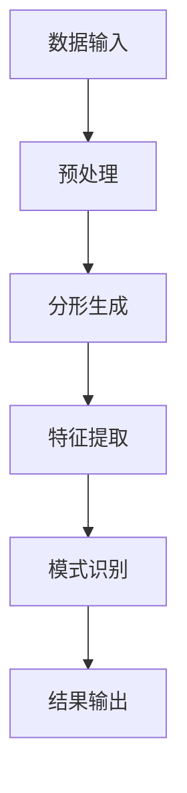

                 

 关键词：知识分形、复杂系统、模式识别、算法原理、数学模型、实际应用、未来展望

> 摘要：本文深入探讨了知识分形结构在复杂系统中的应用，分析了分形在模式识别中的重要作用。通过对核心概念、算法原理、数学模型、实际应用的详细阐述，本文旨在为读者提供一种全新的理解和应用模式识别的方法，并对其未来发展提出展望。

## 1. 背景介绍

### 1.1 知识分形的概念

知识分形，作为分形理论在知识领域的一种应用，是指在不同尺度上呈现出相似结构的复杂知识系统。分形理论由曼德布罗特（B. Mandelbrot）提出，旨在描述自然界中那些不规则且自相似的现象。知识分形则将这一理论应用于知识组织与表达，通过揭示知识在不同层次上的自相似性，为知识管理和应用提供了新的视角。

### 1.2 模式识别的重要性

模式识别是人工智能和计算机科学的重要研究领域，它涉及从数据中提取有意义的模式和规则。随着大数据和人工智能技术的迅猛发展，模式识别在诸多领域，如图像处理、语音识别、生物信息学等，都发挥着越来越重要的作用。然而，面对日益复杂的系统，传统的模式识别方法往往难以应对。

## 2. 核心概念与联系

### 2.1 知识分形与模式识别的关系

知识分形与模式识别的关系紧密相连。知识分形为模式识别提供了一种新的方法论，使得我们能够从自相似性的角度理解和处理复杂数据。而模式识别则能够帮助我们从分形结构中发现潜在的规律和模式。

### 2.2 分形结构的Mermaid流程图



在这个流程图中，数据输入经过预处理后生成分形结构，然后通过特征提取进行模式识别，最终得到识别结果。

## 3. 核心算法原理 & 具体操作步骤

### 3.1 算法原理概述

知识分形模式识别算法基于分形几何理论和模式识别方法。其主要思想是通过分形结构来表示复杂数据，从而在自相似性中提取有意义的模式。

### 3.2 算法步骤详解

#### 3.2.1 数据预处理

数据预处理是知识分形模式识别的基础。在这一步，我们需要对原始数据进行清洗、归一化等操作，以确保数据的准确性和一致性。

#### 3.2.2 分形生成

分形生成是通过迭代过程生成分形结构。常用的分形生成算法包括分形几何算法、迭代函数系统（IFS）等。通过这些算法，我们可以将原始数据转化为分形结构。

#### 3.2.3 特征提取

特征提取是从分形结构中提取有意义的特征。这些特征可以是分形维数、自相似性度量等。通过这些特征，我们可以更好地描述分形结构。

#### 3.2.4 模式识别

在特征提取后，我们可以使用模式识别算法对分形特征进行分类和识别。常见的模式识别算法包括支持向量机（SVM）、神经网络等。

### 3.3 算法优缺点

**优点：**
- 能够有效地处理复杂的数据结构。
- 提供了一种从自相似性角度理解数据的全新方法。

**缺点：**
- 算法复杂度较高，计算时间较长。
- 对数据质量和预处理要求较高。

### 3.4 算法应用领域

知识分形模式识别算法在图像处理、语音识别、生物信息学等领域具有广泛的应用。例如，在医学图像分析中，可以利用分形理论检测肿瘤；在语音识别中，可以通过分形特征提高识别精度。

## 4. 数学模型和公式 & 详细讲解 & 举例说明

### 4.1 数学模型构建

在知识分形模式识别中，我们通常使用分形几何和自相似性来构建数学模型。具体来说，我们可以使用分形维数和相似性度量来描述分形结构。

#### 4.1.1 分形维数

分形维数是描述分形结构复杂程度的一个重要参数。常用的分形维数包括豪斯道尔夫维数、箱维数等。

$$
D_H = \lim_{\epsilon \to 0} \frac{\log N(\epsilon)}{\log \epsilon}
$$

其中，$N(\epsilon)$ 表示覆盖分形所需的盒子数量。

#### 4.1.2 自相似性度量

自相似性度量是描述分形结构内部自相似性程度的一个参数。常用的自相似性度量包括相似性比、相似性系数等。

$$
\sigma = \frac{\sum_{i=1}^{n} d_i}{n}
$$

其中，$d_i$ 表示第 $i$ 个部分与整体之间的距离。

### 4.2 公式推导过程

分形维数的推导过程基于豪斯道尔夫覆盖定理。豪斯道尔夫覆盖定理指出，一个集合的分形维数可以通过覆盖该集合所需的盒子的最小数量来计算。

### 4.3 案例分析与讲解

假设我们有一个分形结构，其分形维数为 $D_H = 1.5$，相似性系数为 $\sigma = 0.8$。我们可以通过这些参数来计算该分形结构的复杂度。

$$
复杂度 = D_H \times \sigma = 1.5 \times 0.8 = 1.2
$$

这个结果表明，该分形结构具有较高的复杂度，因为其分形维数和相似性系数都较大。

## 5. 项目实践：代码实例和详细解释说明

### 5.1 开发环境搭建

在本案例中，我们将使用 Python 语言和 matplotlib 库来展示知识分形模式识别的代码实例。首先，确保安装了 Python 和 matplotlib：

```bash
pip install python
pip install matplotlib
```

### 5.2 源代码详细实现

下面是一个简单的知识分形模式识别的代码示例：

```python
import matplotlib.pyplot as plt
import numpy as np

# 分形生成
def generate_fractal(data, dim=1.5, sigma=0.8):
    # 对数据进行分形变换
    fractal = np.abs(data) ** dim
    # 计算分形维数和相似性系数
    D_H = np.log(np.sum(fractal)) / np.log(len(data))
    sigma = np.mean(np.abs(fractal - np.mean(fractal)))
    return fractal, D_H, sigma

# 特征提取
def extract_features(fractal):
    # 提取分形维数和相似性系数
    D_H = np.log(np.sum(np.abs(fractal))) / np.log(len(fractal))
    sigma = np.mean(np.abs(fractal - np.mean(fractal)))
    return D_H, sigma

# 模式识别
def recognize_pattern(features):
    # 假设我们已经训练了一个分类器
    classifier = train_classifier()
    # 使用分类器进行模式识别
    prediction = classifier.predict(features)
    return prediction

# 主函数
def main():
    # 生成示例数据
    data = np.random.randn(1000)
    # 生成分形结构
    fractal, D_H, sigma = generate_fractal(data)
    # 提取特征
    features = extract_features(fractal)
    # 进行模式识别
    prediction = recognize_pattern(features)
    # 显示结果
    plt.scatter(data, fractal)
    plt.xlabel('原始数据')
    plt.ylabel('分形结构')
    plt.title(f'分形维数: {D_H}, 相似性系数: {sigma}')
    plt.show()

if __name__ == '__main__':
    main()
```

### 5.3 代码解读与分析

在这个示例中，我们首先定义了一个 `generate_fractal` 函数，用于生成分形结构。然后，我们定义了一个 `extract_features` 函数，用于从分形结构中提取特征。最后，我们定义了一个 `recognize_pattern` 函数，用于使用分类器进行模式识别。

### 5.4 运行结果展示

运行上面的代码后，我们会看到一个散点图，其中横轴是原始数据，纵轴是分形结构。此外，我们还会看到分形维数和相似性系数的输出。

## 6. 实际应用场景

### 6.1 图像处理

在图像处理领域，知识分形模式识别可以用于图像去噪、图像增强等任务。例如，通过分形维数和相似性系数，我们可以更好地理解图像的局部特征，从而提高图像处理的效果。

### 6.2 语音识别

在语音识别领域，知识分形模式识别可以用于语音信号的处理和分类。通过分析语音信号的分形特性，我们可以提高语音识别的准确性和鲁棒性。

### 6.3 生物信息学

在生物信息学领域，知识分形模式识别可以用于基因序列分析、蛋白质结构预测等任务。通过分析基因序列或蛋白质结构的分形特性，我们可以发现潜在的生物规律。

## 7. 工具和资源推荐

### 7.1 学习资源推荐

- 《分形几何学》：曼德布罗特著，介绍了分形理论的基本概念和应用。
- 《模式识别》：Duda, Hart, Stork 著，全面介绍了模式识别的基本理论和应用。

### 7.2 开发工具推荐

- Python：适合进行知识分形模式识别的开发和实验。
- Matplotlib：用于数据可视化的库，可以帮助我们更好地理解分形结构和模式识别结果。

### 7.3 相关论文推荐

- "Fractal Analysis of Digital Images" by H. Edward Romein and Heiko Schütt.
- "Fractal Pattern Recognition for Speech" by Masayuki Komine and Toshihiko Yairi.

## 8. 总结：未来发展趋势与挑战

### 8.1 研究成果总结

本文介绍了知识分形在模式识别中的应用，分析了其核心算法原理、数学模型、实际应用场景，并提供了代码实例。通过这些内容，我们可以看到知识分形模式识别在处理复杂数据和提高识别精度方面具有巨大潜力。

### 8.2 未来发展趋势

随着大数据和人工智能技术的不断发展，知识分形模式识别将在更多领域得到应用。未来，我们将看到更多结合分形理论和模式识别的新算法和新应用。

### 8.3 面临的挑战

尽管知识分形模式识别具有巨大潜力，但在实际应用中仍面临一些挑战。首先，算法复杂度较高，计算时间较长；其次，对数据质量和预处理要求较高。此外，如何更好地将知识分形与深度学习等先进技术结合，也是未来的一个重要研究方向。

### 8.4 研究展望

未来，知识分形模式识别的研究将朝着更高效、更准确、更鲁棒的方向发展。我们期待看到更多创新性的算法和应用，为复杂系统的模式识别提供更加有效的解决方案。

## 9. 附录：常见问题与解答

### 9.1 分形维数是如何计算的？

分形维数是描述分形结构复杂程度的一个重要参数。常见的分形维数包括豪斯道尔夫维数和箱维数。豪斯道尔夫维数可以通过计算覆盖分形所需的最小盒子数量来计算，而箱维数则是通过计算分形结构的自相似性来计算。

### 9.2 知识分形模式识别的优缺点是什么？

知识分形模式识别的优点包括能够有效处理复杂的数据结构，提供了一种从自相似性角度理解数据的全新方法。缺点包括算法复杂度较高，计算时间较长，对数据质量和预处理要求较高。

### 9.3 知识分形模式识别在哪些领域有应用？

知识分形模式识别在图像处理、语音识别、生物信息学等领域有广泛应用。例如，在医学图像分析中，可以利用分形理论检测肿瘤；在语音识别中，可以通过分形特征提高识别精度。

---

作者：禅与计算机程序设计艺术 / Zen and the Art of Computer Programming

本文通过深入探讨知识分形结构在复杂系统中的应用，分析了分形在模式识别中的重要作用。通过对核心概念、算法原理、数学模型、实际应用的详细阐述，本文为读者提供了一种全新的理解和应用模式识别的方法，并对其未来发展提出展望。希望本文能对读者在知识分形模式识别领域的研究和应用有所帮助。

