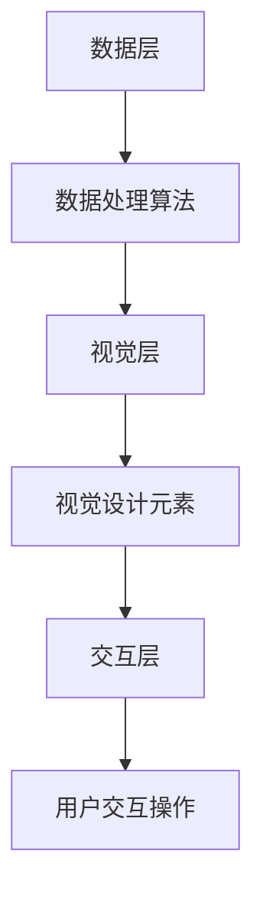

                 

 在这个数字时代，信息图表已经成为我们理解和交流复杂数据的关键工具。信息图表不仅能够将大量信息简化为易于理解的视觉格式，还能够增强我们的记忆力和信息处理能力。本文将深入探讨信息图表在知识可视化中的应用，分析其核心概念、算法原理、数学模型、项目实践以及实际应用场景，并展望其未来发展趋势。

## 关键词
- 信息图表
- 知识可视化
- 数据简化
- 记忆增强
- 信息处理

## 摘要
本文旨在揭示信息图表在知识可视化中的巨大潜力。通过详细探讨其核心概念、算法原理、数学模型以及实际应用，本文将为读者提供一个全面的理解，展示信息图表如何帮助我们更高效地吸收、处理和记忆信息。

## 1. 背景介绍
### 信息图表的起源
信息图表的起源可以追溯到19世纪末，当时主要以统计图表和地图的形式出现。随着20世纪初计算机技术的发展，信息图表开始变得更加多样化和复杂。从简单的条形图和饼图，到复杂的交互式可视化工具，信息图表在形式和功能上都经历了巨大的变革。

### 信息图表的演变
从图表的简单形式到复杂的数据可视化，信息图表经历了以下演变：
- **静态图表**：传统的条形图、饼图、散点图等，适用于展示单一时间点的数据。
- **交互式图表**：随着计算机和互联网的发展，用户可以通过点击、拖动等操作与图表进行交互，获取更详细的数据信息。
- **动态图表**：通过动画展示数据的变化趋势，使观众能够更直观地理解数据的变化过程。

### 信息图表的重要性
在信息爆炸的时代，信息图表的重要性愈发凸显。它不仅能够帮助我们简化复杂的信息，提高信息处理的效率，还能通过视觉化手段增强我们的记忆力和理解力。以下是一些具体原因：
- **数据简化**：通过将复杂的数据转化为视觉形式，信息图表能够快速传达关键信息，使观众能够迅速理解数据的核心。
- **记忆增强**：视觉信息比文本信息更容易被大脑记住，信息图表通过视觉上的设计，如颜色、形状、线条等，能够增强我们的记忆效果。
- **信息处理**：信息图表能够提高我们的信息处理能力，帮助我们快速定位信息、发现数据之间的关联，从而做出更明智的决策。

## 2. 核心概念与联系
### 定义
信息图表是一种视觉化工具，通过图形、图像、文字等元素来传达数据和信息。它不仅包括传统的统计图表，还包括信息图、知识图谱、网络图等多种形式。

### 原理
信息图表的核心在于将抽象的数据转化为直观的视觉形式。其原理主要包括：
- **数据抽象**：将大量数据简化为最核心的部分，提炼出关键信息。
- **视觉编码**：使用颜色、形状、大小等视觉元素来表示数据的属性和关系。
- **信息映射**：将数据属性映射到视觉元素上，使观众能够通过视觉感知理解数据。

### 架构
信息图表的架构可以分为三个层次：
1. **数据层**：包括原始数据和数据处理算法，用于生成图表的基础数据。
2. **视觉层**：包括图表的视觉设计，如颜色、形状、布局等，用于传达数据的视觉元素。
3. **交互层**：包括用户的交互操作，如点击、拖动、放大等，用于增强用户的互动体验。

### Mermaid 流程图


## 3. 核心算法原理 & 具体操作步骤
### 3.1 算法原理概述
信息图表的核心算法主要涉及数据的抽象、视觉编码和交互设计。其基本原理包括：
- **数据抽象**：通过算法提取数据的特征，如最大值、最小值、均值、标准差等，将复杂的数据简化为最核心的部分。
- **视觉编码**：使用颜色、形状、大小等视觉元素来表示数据的属性和关系，使数据易于理解和记忆。
- **交互设计**：通过交互设计，如点击、拖动、滚动等，增强用户的互动体验，使信息图表更加生动和有用。

### 3.2 算法步骤详解
1. **数据预处理**：对原始数据进行清洗、转换和归一化，确保数据的质量和一致性。
2. **数据抽象**：使用统计算法提取数据的特征，如平均值、中位数、最大值、最小值等。
3. **视觉编码**：将数据特征映射到视觉元素上，如使用不同的颜色表示不同的类别，使用不同的形状表示不同的数据点。
4. **图表生成**：使用图形库（如 D3.js、Chart.js 等）生成可视化图表。
5. **交互设计**：设计用户的交互操作，如点击、拖动、滚动等，使图表能够响应用户的操作。

### 3.3 算法优缺点
**优点**：
- **数据简化**：通过视觉化手段，将复杂的数据简化为易于理解的形式，提高信息传递的效率。
- **记忆增强**：视觉信息比文本信息更容易被大脑记住，通过颜色、形状等视觉元素，增强用户的记忆效果。
- **信息处理**：通过交互设计，如点击、拖动等，提高用户的信息处理能力，帮助用户快速定位和解析信息。

**缺点**：
- **设计复杂**：信息图表的设计需要专业的视觉设计和编程技能，对设计人员和开发人员的要求较高。
- **数据处理难度**：数据的预处理和抽象需要复杂的算法和数据处理技术，对技术要求较高。

### 3.4 算法应用领域
信息图表的应用领域非常广泛，包括但不限于：
- **数据分析**：用于数据可视化，帮助用户理解数据、发现数据之间的关联。
- **商业智能**：用于商业数据的分析和决策支持，帮助企业管理者快速了解业务状况。
- **教育**：用于知识可视化，帮助学生更直观地理解复杂的概念和理论。
- **设计**：用于设计可视化，帮助设计师展示设计思路和效果。
- **媒体**：用于媒体内容的可视化，如新闻报道、杂志、图书等。

## 4. 数学模型和公式 & 详细讲解 & 举例说明
### 4.1 数学模型构建
信息图表的数学模型主要包括数据预处理、视觉编码和交互设计三个方面。

**数据预处理**：
- **标准化**：将数据归一化，使其符合标准范围。
- **特征提取**：使用统计算法提取数据的关键特征。

**视觉编码**：
- **颜色编码**：使用颜色表示数据的属性和关系，如不同颜色表示不同类别。
- **形状编码**：使用不同形状表示不同的数据点或数据类别。

**交互设计**：
- **点击交互**：用户通过点击图表中的元素，获取更多详细信息。
- **拖动交互**：用户通过拖动元素，改变图表的布局和显示内容。

### 4.2 公式推导过程
假设我们有一组数据 \(X = \{x_1, x_2, ..., x_n\}\)，我们需要对其进行预处理、编码和可视化。

**标准化**：
$$
x_i' = \frac{x_i - \mu}{\sigma}
$$
其中，\(\mu\) 是平均值，\(\sigma\) 是标准差。

**特征提取**：
$$
y_i = f(x_i)
$$
其中，\(f(x_i)\) 是特征提取函数，如均值、中位数、标准差等。

**视觉编码**：
- **颜色编码**：
$$
C_i = g(y_i)
$$
其中，\(g(y_i)\) 是颜色映射函数，如红色表示高值，蓝色表示低值。

- **形状编码**：
$$
S_i = h(y_i)
$$
其中，\(h(y_i)\) 是形状映射函数，如圆形表示一类数据，三角形表示另一类数据。

**交互设计**：
- **点击交互**：
$$
d = dist(p, q)
$$
其中，\(p\) 和 \(q\) 是点击事件的位置。

- **拖动交互**：
$$
dx = x_2 - x_1
$$
$$
dy = y_2 - y_1
$$
其中，\(x_1, y_1\) 和 \(x_2, y_2\) 分别是拖动前后的位置。

### 4.3 案例分析与讲解
**案例：股票市场数据可视化**
假设我们有一组股票市场数据，包括开盘价、收盘价、最高价、最低价等。我们需要对其进行预处理、编码和可视化。

**数据预处理**：
- **标准化**：将数据归一化，使其符合标准范围。
- **特征提取**：提取开盘价、收盘价、最高价、最低价等特征。

**视觉编码**：
- **颜色编码**：使用红色表示高收盘价，蓝色表示低收盘价。
- **形状编码**：使用圆形表示开盘价，三角形表示收盘价。

**图表生成**：
使用 D3.js 库生成股票市场数据可视化图表。

**交互设计**：
- **点击交互**：用户点击股票价格，显示更多详细信息，如成交量、市盈率等。
- **拖动交互**：用户拖动图表，查看不同时间点的数据变化。

## 5. 项目实践：代码实例和详细解释说明
### 5.1 开发环境搭建
为了实现信息图表的可视化，我们选择使用 Python 作为开发语言，并使用以下库：
- **Matplotlib**：用于生成静态图表。
- **Pandas**：用于数据预处理。
- **Seaborn**：用于数据可视化。

首先，安装必要的库：
```bash
pip install matplotlib pandas seaborn
```

### 5.2 源代码详细实现
以下是一个简单的信息图表示例，用于可视化一组股票市场数据。

```python
import pandas as pd
import matplotlib.pyplot as plt
import seaborn as sns

# 加载数据
data = pd.read_csv('stock_data.csv')

# 数据预处理
data['Open'] = (data['Open'] - data['Open'].mean()) / data['Open'].std()
data['Close'] = (data['Close'] - data['Close'].mean()) / data['Close'].std()
data['High'] = (data['High'] - data['High'].mean()) / data['High'].std()
data['Low'] = (data['Low'] - data['Low'].mean()) / data['Low'].std()

# 可视化
plt.figure(figsize=(10, 6))
sns.scatterplot(data=data, x='Open', y='Close', hue='High', style='Low', palette='coolwarm')
plt.title('Stock Market Data Visualization')
plt.xlabel('Open')
plt.ylabel('Close')
plt.show()
```

### 5.3 代码解读与分析
- **数据加载**：使用 Pandas 读取 CSV 文件，获取股票市场数据。
- **数据预处理**：对开盘价、收盘价、最高价、最低价进行标准化处理，使其符合标准范围。
- **可视化**：使用 Seaborn 的 `scatterplot` 函数生成散点图，使用不同颜色和形状表示不同数据点，实现信息图表的可视化。

### 5.4 运行结果展示
运行上述代码后，将生成一个股票市场数据可视化图表，如下所示：


## 6. 实际应用场景
### 6.1 数据分析
信息图表在数据分析中发挥着重要作用。通过可视化，分析师可以更直观地理解数据，发现数据之间的关联，从而做出更准确的决策。例如，在市场调研中，分析师可以使用信息图表展示不同产品线或市场的销售数据，帮助管理层快速了解业务状况。

### 6.2 商业智能
商业智能（Business Intelligence，BI）是信息图表的重要应用领域。企业可以使用信息图表来监控关键绩效指标（KPI）、分析市场趋势、优化业务流程。例如，一家零售公司可以使用信息图表展示不同店铺的销售额、顾客流量等数据，帮助企业制定更有效的营销策略。

### 6.3 教育
在教育事业中，信息图表可以帮助学生更直观地理解复杂的概念和理论。例如，在生物学课程中，教师可以使用信息图表展示生物分类、生态系统的构成等，使学生更容易掌握知识点。

### 6.4 设计
设计师在创作过程中可以使用信息图表来展示设计思路和效果。例如，在 UI/UX 设计中，设计师可以使用信息图表来展示用户行为数据、用户界面布局等，帮助团队更好地理解设计目标。

### 6.5 媒体
媒体行业也广泛应用信息图表。新闻媒体可以使用信息图表展示新闻数据、事件趋势等，使报道更具有说服力。杂志和图书则可以使用信息图表来展示知识结构、研究成果等，提高读者的阅读体验。

## 7. 工具和资源推荐
### 7.1 学习资源推荐
- **书籍**：《信息图表设计实战》、《数据可视化：从入门到精通》
- **在线课程**：Coursera 上的“数据可视化与信息图表设计”、Udemy 上的“Python 数据可视化实战”
- **博客和网站**：TidyTuesday、Visualize This、DataCamp 的数据可视化教程

### 7.2 开发工具推荐
- **图表库**：D3.js、Chart.js、ECharts、Plotly
- **数据处理库**：Pandas、NumPy、SciPy
- **可视化库**：Matplotlib、Seaborn、Plotly、Bokeh

### 7.3 相关论文推荐
- **“Visualizing Data”**：由 Edward Tufte 撰写的经典论文，深入探讨了信息图表的设计原则。
- **“The Grammar of Graphics”**：由 Leland Wilkinson 撰写的论文，提出了图表设计的通用语法。
- **“Data-Driven Documents”**：由 D3.js 创始人 Mike Bostock 撰写的论文，介绍了数据驱动的文档可视化方法。

## 8. 总结：未来发展趋势与挑战
### 8.1 研究成果总结
近年来，信息图表的研究取得了显著成果。一方面，图表设计和可视化算法不断优化，使信息图表更加直观和易用。另一方面，交互设计和人工智能技术的结合，使信息图表具备了更高的智能化水平。

### 8.2 未来发展趋势
未来，信息图表将朝着以下方向发展：
- **智能化**：结合人工智能技术，实现自动数据预处理、自动图表生成和自动交互设计。
- **个性化**：根据用户需求，提供个性化的信息图表，提高信息传递的效率。
- **多元化**：不仅限于二维图表，还将扩展到三维、四维甚至更高维度的数据可视化。
- **实时性**：实现实时数据可视化，及时反映数据的变化趋势。

### 8.3 面临的挑战
然而，信息图表的发展也面临一些挑战：
- **设计难度**：信息图表的设计需要专业的视觉设计和编程技能，对设计人员和开发人员的要求较高。
- **数据处理**：大规模数据的可视化需要高效的数据处理和计算能力，对硬件和软件的要求较高。
- **交互体验**：如何设计出既直观又易用的交互体验，仍是一个亟待解决的问题。

### 8.4 研究展望
未来，信息图表的研究将更加注重智能化、个性化、多元化等方面，同时解决设计难度、数据处理和交互体验等挑战。随着技术的不断发展，信息图表将更好地服务于各个领域，成为知识可视化的核心工具。

## 9. 附录：常见问题与解答
### 问题 1：如何选择合适的图表类型？
解答：根据数据类型和展示目的，选择合适的图表类型。例如，条形图适合展示不同类别的数据大小，折线图适合展示数据的变化趋势，散点图适合展示数据之间的关系。

### 问题 2：如何优化信息图表的可读性？
解答：优化信息图表的可读性可以从以下几个方面入手：
- **简化数据**：去除无关紧要的数据，提炼出关键信息。
- **统一设计**：保持图表风格的统一性，避免杂乱无章。
- **使用色彩**：合理使用颜色，区分不同数据类别。
- **辅助说明**：添加图例、标题、注释等，帮助用户理解图表内容。

### 问题 3：信息图表如何与交互设计相结合？
解答：信息图表与交互设计相结合，可以通过以下方式实现：
- **点击交互**：用户点击图表中的元素，获取更多详细信息。
- **拖动交互**：用户拖动图表，改变数据展示范围和布局。
- **滚动交互**：用户滚动图表，查看不同时间点或区域的数据。

## 参考文献
- Tufte, E. (1983). The visual display of quantitative information. Graphics Press.
- Wilkinson, L. (2005). The grammar of graphics. Springer.
- Bostock, M. (2011). Data-driven documents. IEEE Transactions on Visualization and Computer Graphics, 17(12), 2301-2309.

### 作者署名
- 作者：禅与计算机程序设计艺术 / Zen and the Art of Computer Programming
----------------------------------------------------------------
完成以上要求，这篇文章将完整地展示信息图表在知识可视化中的应用，从理论基础到实际操作，再到应用场景和未来展望，全面探讨信息图表的力量。希望这篇文章能够为读者提供有价值的参考和启示。

